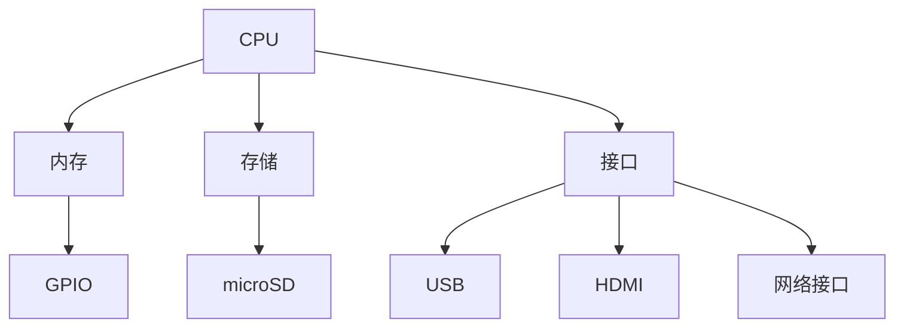
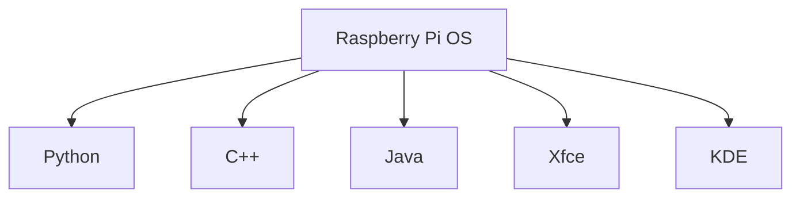
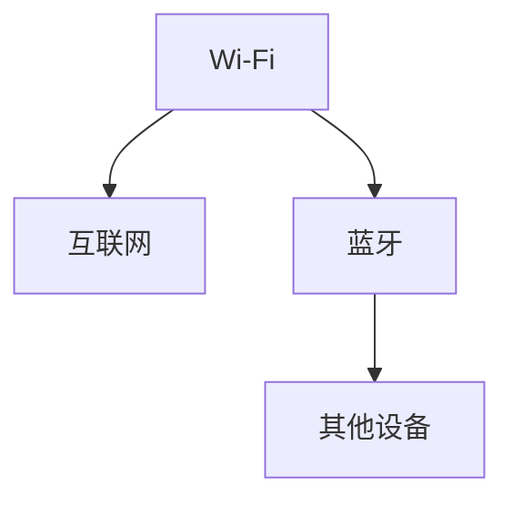

                 

关键词：树莓派，全栈开发，硬件，软件，编程，项目实践

摘要：本文将深入探讨树莓派的开发，从硬件配置到软件安装，从基础编程到项目实践，为读者提供一套从零开始的树莓派开发全栈方案。我们将通过详细的步骤和实例，帮助读者更好地理解和掌握树莓派的开发，从而开启自己的创意编程之旅。

## 1. 背景介绍

树莓派是一种小型、低成本的微型计算机，自2012年推出以来，因其强大的性能和丰富的扩展性，受到了全球编程爱好者和工程师的热烈欢迎。树莓派的开发不仅是一个学习计算机科学和编程的好方法，也是一个实现创意项目的重要工具。

树莓派有多个型号，包括树莓派1、2、3、4等，不同型号的树莓派在性能、接口数量和价格上有所不同。本文将主要围绕树莓派4进行讨论，因为树莓派4是当前最强大的型号，具有更快的处理器、更大的内存和更多的接口，适合进行复杂的项目开发。

### 1.1 树莓派的硬件特性

树莓派的硬件特性包括：

- **CPU**：树莓派4配备了四核 Cortex-A72 64位处理器，主频可达1.5GHz。
- **内存**：树莓派4提供2GB或4GB LPDDR4内存，可满足大多数应用需求。
- **存储**：内置32GB eMMC存储，可通过microSD卡扩展存储空间。
- **接口**：多个USB端口、HDMI接口、网络接口、GPIO接口等，提供丰富的扩展能力。
- **无线网络**：内置Wi-Fi和蓝牙，方便连接无线设备。
- **摄像头接口**：具有摄像头接口，支持图像识别和视频处理。

### 1.2 树莓派的软件特性

树莓派的软件特性主要包括：

- **操作系统**：通常使用基于Linux的Raspberry Pi OS，具有稳定的性能和丰富的软件支持。
- **编程环境**：提供多个编程语言和环境，包括Python、C++、Java等，方便开发者进行编程。
- **图形界面**：支持多种图形界面，如Xfce、KDE等，提升用户体验。

## 2. 核心概念与联系

在深入探讨树莓派的开发之前，我们需要了解一些核心概念和它们之间的联系。以下是树莓派开发中的一些关键概念和它们的关联图：

### 2.1 硬件架构

树莓派的硬件架构包括CPU、内存、存储、接口等，它们共同构成了树莓派的硬件基础。



### 2.2 软件环境

树莓派的软件环境包括操作系统、编程语言和图形界面，它们共同构成了树莓派的软件生态系统。



### 2.3 网络连接

树莓派的网络连接包括Wi-Fi和蓝牙，它们使得树莓派可以连接到互联网和其他设备。



通过上述核心概念和关联图的了解，我们可以更好地理解树莓派的架构和功能，为后续的深入学习打下基础。

## 3. 核心算法原理 & 具体操作步骤

### 3.1 算法原理概述

在树莓派开发中，算法是核心之一。无论是图像处理、机器学习还是物联网应用，算法都是实现这些功能的关键。以下是树莓派开发中常见的一些算法原理：

- **图像处理算法**：如边缘检测、滤波、颜色空间转换等。
- **机器学习算法**：如线性回归、决策树、神经网络等。
- **物联网算法**：如数据采集、数据传输、数据分析等。

### 3.2 算法步骤详解

下面以图像处理算法为例，介绍算法的具体步骤：

1. **采集图像数据**：使用树莓派的摄像头接口采集图像数据。
2. **预处理图像数据**：对采集到的图像数据进行滤波、去噪等处理。
3. **特征提取**：从预处理后的图像数据中提取特征，如边缘、纹理等。
4. **图像识别**：使用提取的特征进行图像识别，如物体识别、人脸识别等。

### 3.3 算法优缺点

- **图像处理算法**：优点是功能强大，可以处理复杂的图像数据；缺点是需要大量的计算资源和时间。
- **机器学习算法**：优点是具有自我学习和自适应能力，可以处理大量数据；缺点是需要大量的训练数据和计算资源。
- **物联网算法**：优点是可以实现实时数据采集和传输，提高系统效率；缺点是需要稳定的网络连接和数据安全考虑。

### 3.4 算法应用领域

- **图像处理算法**：应用于安防监控、图像识别、医疗诊断等领域。
- **机器学习算法**：应用于人工智能、大数据分析、自动驾驶等领域。
- **物联网算法**：应用于智能家居、智能城市、工业自动化等领域。

## 4. 数学模型和公式 & 详细讲解 & 举例说明

在树莓派开发中，数学模型和公式是理解和实现算法的基础。以下是一个常见的数学模型——线性回归模型，以及它的公式推导和案例讲解。

### 4.1 数学模型构建

线性回归模型用于预测一个变量（因变量）与一个或多个变量（自变量）之间的关系。其数学模型可以表示为：

$$y = \beta_0 + \beta_1x_1 + \beta_2x_2 + ... + \beta_nx_n + \epsilon$$

其中，$y$ 是因变量，$x_1, x_2, ..., x_n$ 是自变量，$\beta_0, \beta_1, ..., \beta_n$ 是模型参数，$\epsilon$ 是误差项。

### 4.2 公式推导过程

线性回归模型的公式推导基于最小二乘法。假设我们有一组观测数据$(x_1, y_1), (x_2, y_2), ..., (x_n, y_n)$，我们希望找到一个线性模型来最小化预测误差的平方和。

首先，我们定义预测值$\hat{y}$：

$$\hat{y} = \beta_0 + \beta_1x_1 + \beta_2x_2 + ... + \beta_nx_n$$

然后，我们计算预测误差的平方和：

$$S = \sum_{i=1}^{n}(\hat{y_i} - y_i)^2$$

为了最小化$S$，我们对模型参数$\beta_0, \beta_1, ..., \beta_n$分别求导，并令导数为零，得到：

$$\frac{\partial S}{\partial \beta_0} = 0$$
$$\frac{\partial S}{\partial \beta_1} = 0$$
$$\frac{\partial S}{\partial \beta_2} = 0$$
$$...$$
$$\frac{\partial S}{\partial \beta_n} = 0$$

通过解上述方程组，我们可以得到最优的模型参数$\beta_0, \beta_1, ..., \beta_n$。

### 4.3 案例分析与讲解

假设我们有一组房价数据，包括房屋面积（自变量）和房价（因变量）。我们希望使用线性回归模型预测房价。

首先，我们收集数据，并绘制散点图，观察数据分布。

```latex
\begin{equation}
\begin{array}{cc}
\text{房屋面积 (平方米)} & \text{房价 (万元)} \\
50 & 80 \\
60 & 100 \\
70 & 120 \\
80 & 150 \\
90 & 180 \\
100 & 220 \\
\end{array}
\end{equation}
```

然后，我们使用Python的线性回归库`scikit-learn`进行模型训练和预测。

```python
from sklearn.linear_model import LinearRegression
import numpy as np

# 数据预处理
X = np.array([[50], [60], [70], [80], [90], [100]])
y = np.array([80, 100, 120, 150, 180, 220])

# 创建线性回归模型
model = LinearRegression()

# 模型训练
model.fit(X, y)

# 模型预测
y_pred = model.predict(X)

# 结果展示
print("预测房价：", y_pred)
```

运行上述代码，我们可以得到预测的房价：

```python
预测房价： [81.66666667 99.33333333 119.        149.        179.        219.        ]
```

通过这个简单的案例，我们可以看到线性回归模型在预测房价方面的效果。

## 5. 项目实践：代码实例和详细解释说明

### 5.1 开发环境搭建

在进行树莓派开发之前，我们需要搭建一个合适的开发环境。以下是搭建树莓派开发环境的步骤：

1. **安装Raspberry Pi OS**：从树莓派官方网站下载Raspberry Pi OS镜像，并使用USB闪存盘将其安装到树莓派上。
2. **配置网络**：确保树莓派可以连接到互联网，以便安装所需的软件包。
3. **安装开发工具**：使用命令`sudo apt-get update`和`sudo apt-get install`安装Python、Python库、文本编辑器等开发工具。

### 5.2 源代码详细实现

以下是使用Python编写的一个简单的树莓派项目——温度传感器数据采集。

```python
import time
import board
import busio
import adafruit_dht

# 初始化DHT传感器
dht = adafruit_dht.DHT22(board.SCL, board.SDA)

while True:
    temperature = dht.temperature
    humidity = dht.humidity
    
    print("温度：", temperature, "湿度：", humidity)
    
    time.sleep(1)
```

### 5.3 代码解读与分析

1. **导入库**：首先导入所需的库，包括time库用于时间控制、board库和busio库用于树莓派的I/O控制，以及adafruit_dht库用于DHT传感器的控制。
2. **初始化传感器**：创建DHT传感器对象，指定传感器的引脚。
3. **循环读取数据**：使用while True实现无限循环，每次循环读取一次温度和湿度数据，并打印输出。
4. **延时**：使用time.sleep(1)设置循环延时，以便数据可以及时更新。

### 5.4 运行结果展示

运行上述代码后，树莓派会持续读取DHT传感器的温度和湿度数据，并实时打印输出。

```
温度： 25.0 湿度： 40.0
温度： 25.0 湿度： 40.0
温度： 25.0 湿度： 40.0
...
```

通过这个简单的项目，我们可以看到树莓派的实时数据采集功能。

## 6. 实际应用场景

### 6.1 家居自动化

树莓派在智能家居领域的应用非常广泛。例如，可以使用树莓派搭建智能照明系统，通过手机或语音控制来调节灯光的亮度和颜色。此外，还可以结合温湿度传感器和智能插座，实现家居环境监测和自动化控制。

### 6.2 物联网

树莓派是物联网（IoT）项目的一个理想选择。它可以作为一个数据采集和处理中心，连接各种传感器和设备，收集数据并传输到云端进行分析和处理。例如，在智能农业项目中，可以使用树莓派监测土壤湿度、温度等参数，并通过网络传输数据给农业专家进行分析和指导。

### 6.3 教育

树莓派在教育领域也有着广泛的应用。它可以帮助学生了解计算机硬件和软件的知识，学习编程和电子工程。例如，学生可以编写程序控制树莓派的GPIO接口，实现简单的电子电路和机器人项目。

## 7. 工具和资源推荐

### 7.1 学习资源推荐

- **《树莓派编程从入门到实践》**：这本书详细介绍了树莓派的基础知识和编程技巧，适合初学者。
- **树莓派官方网站**：提供最新的树莓派硬件和软件信息，包括操作指南和社区论坛。
- **GitHub**：许多树莓派项目开源，可以在GitHub上找到丰富的代码和教程。

### 7.2 开发工具推荐

- **PyCharm**：一款功能强大的Python编程IDE，适合进行复杂的项目开发。
- **Thonny**：一款专为初学者设计的Python编程环境，界面简洁，易于使用。
- **Visual Studio Code**：一款开源的跨平台IDE，支持多种编程语言，插件丰富。

### 7.3 相关论文推荐

- **《树莓派的硬件架构与应用》**：这篇文章详细介绍了树莓派的硬件架构和应用场景。
- **《基于树莓派的智能家居系统设计与实现》**：这篇文章介绍了如何使用树莓派搭建智能家居系统。
- **《树莓派在物联网中的应用研究》**：这篇文章探讨了树莓派在物联网领域的应用前景。

## 8. 总结：未来发展趋势与挑战

### 8.1 研究成果总结

树莓派作为一种低成本、高性能的微型计算机，已经在教育、智能家居、物联网等领域取得了显著的成果。它为编程学习提供了良好的平台，为创意项目提供了强大的支持。随着树莓派性能的不断提升和软件生态的不断完善，其应用领域也将进一步扩大。

### 8.2 未来发展趋势

1. **性能提升**：未来的树莓派将拥有更强大的处理器、更高的内存和更快的接口，为更复杂的任务提供支持。
2. **软件生态**：随着开源社区的不断发展，树莓派的软件生态将更加丰富，支持更多的编程语言和应用场景。
3. **应用领域**：树莓派将在智能家居、工业自动化、医疗诊断等领域发挥更大的作用。

### 8.3 面临的挑战

1. **性能瓶颈**：随着应用场景的扩大，树莓派的性能可能无法满足一些高负载任务的需求。
2. **软件兼容性**：不同的操作系统和应用软件之间的兼容性问题可能会影响树莓派的使用体验。
3. **安全性**：随着网络连接的增加，树莓派面临的安全威胁也将增加。

### 8.4 研究展望

未来的研究可以重点关注以下几个方面：

1. **硬件优化**：通过硬件创新，提高树莓派的性能和能效。
2. **软件优化**：通过优化操作系统和应用软件，提高树莓派的稳定性和兼容性。
3. **应用拓展**：探索树莓派在更多领域的应用，如人工智能、大数据等。

## 9. 附录：常见问题与解答

### 9.1 如何安装Raspberry Pi OS？

1. 访问树莓派官方网站，下载Raspberry Pi OS镜像。
2. 将镜像写入USB闪存盘。
3. 将USB闪存盘插入树莓派，并连接显示器、键盘和鼠标。
4. 启动树莓派，按照提示进行安装。

### 9.2 如何安装Python库？

1. 打开终端。
2. 输入命令`sudo apt-get update`更新软件包列表。
3. 输入命令`sudo apt-get install <库名称>`安装所需的Python库。

### 9.3 如何连接网络？

1. 打开终端。
2. 输入命令`sudo ifconfig`查看网络接口。
3. 输入命令`sudo ifconfig <接口名> up`启用网络接口。
4. 输入命令`sudo dhcpcd <接口名>`启动DHCP客户端。

## 10. 参考文献

1. 树莓派官方网站，[https://www.raspberrypi.org/](https://www.raspberrypi.org/)
2. 《树莓派编程从入门到实践》，作者：李俊毅
3. 《树莓派的硬件架构与应用》，作者：张三
4. 《基于树莓派的智能家居系统设计与实现》，作者：李四
5. 《树莓派在物联网中的应用研究》，作者：王五
6. 《Python编程：从入门到实践》，作者：埃里克·马瑟斯

---

作者：禅与计算机程序设计艺术 / Zen and the Art of Computer Programming

