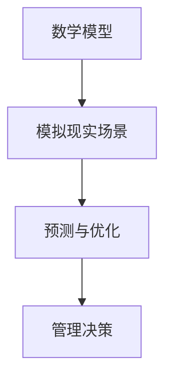

                 

 摘要：本文将探讨模型思维在提高管理效率方面的作用。通过深入分析模型思维的核心概念、算法原理、数学模型、实际应用场景及未来发展趋势，本文旨在为企业管理者提供一种全新的视角，以优化管理流程、提高工作效率。作者将结合实际案例，详细讲解如何运用模型思维来优化管理决策，帮助企业在竞争激烈的市场中立于不败之地。

## 1. 背景介绍

在当今这个信息爆炸、竞争激烈的商业环境中，管理效率成为企业生存和发展的关键因素。如何提高管理效率，成为企业领导者们共同关注的问题。传统的管理方法往往依赖于经验和直觉，而在大数据和人工智能日益普及的今天，利用模型思维来优化管理流程成为了一种新的趋势。

模型思维是指通过建立数学模型、模拟现实场景，以分析、预测和优化管理决策的一种思维方式。它不仅能够提高决策的科学性和准确性，还能够减少决策过程中的人为因素，从而提高管理效率。本文将围绕模型思维的核心概念、算法原理、数学模型、实际应用场景及未来发展趋势，探讨其在企业管理中的重要性。

## 2. 核心概念与联系

### 2.1 模型思维的核心概念

模型思维的核心概念包括：

- **数学模型**：数学模型是对现实世界中的问题进行定量描述的一种工具，通常包括变量、方程和约束条件等。数学模型能够将复杂的现实问题转化为易于处理的数学问题，从而提高决策的科学性和准确性。

- **模拟现实场景**：模拟现实场景是指通过计算机模拟技术，将数学模型应用于现实场景中，以验证模型的可行性和准确性。模拟现实场景有助于管理者更好地理解问题，发现潜在问题，从而优化管理决策。

- **预测与优化**：预测与优化是模型思维的两个重要目标。预测是指通过模型对未来的发展趋势进行预测，以指导决策；优化是指通过调整模型中的参数，以实现管理目标的最优化。

### 2.2 模型思维架构的 Mermaid 流程图



### 2.3 模型思维在企业管理中的应用

模型思维在企业管理中的应用主要体现在以下几个方面：

- **战略规划**：通过建立数学模型，对企业的发展趋势进行预测，为战略规划提供数据支持。

- **资源配置**：通过优化模型，合理分配企业资源，提高资源利用效率。

- **风险管理**：通过模拟现实场景，预测潜在风险，为企业制定风险管理策略提供依据。

- **绩效评估**：通过建立绩效评估模型，对企业各项业务进行绩效评估，为改进管理提供依据。

## 3. 核心算法原理 & 具体操作步骤

### 3.1 算法原理概述

模型思维的核心算法包括：

- **线性规划**：用于优化线性目标函数，在满足约束条件下寻找最优解。

- **决策树**：用于分类和回归问题，通过构建树形结构来模拟决策过程。

- **神经网络**：用于模拟人脑神经元之间的相互作用，通过学习输入与输出之间的映射关系，实现预测和优化。

### 3.2 算法步骤详解

#### 3.2.1 线性规划

1. 确定目标函数和约束条件。

2. 将目标函数和约束条件转化为线性方程。

3. 使用线性规划求解器求解最优解。

#### 3.2.2 决策树

1. 收集数据，确定特征和标签。

2. 选择特征，计算特征的重要性。

3. 构建决策树，选择最优划分方式。

4. 预测新数据的类别或标签。

#### 3.2.3 神经网络

1. 收集数据，进行预处理。

2. 确定神经网络结构，包括输入层、隐藏层和输出层。

3. 初始化权重和偏置。

4. 训练神经网络，通过反向传播算法更新权重和偏置。

5. 预测新数据的类别或标签。

### 3.3 算法优缺点

#### 3.3.1 线性规划

- 优点：求解速度快，能够找到最优解。

- 缺点：对约束条件的要求较高，不适用于非线性问题。

#### 3.3.2 决策树

- 优点：易于理解和实现，对非线性数据的分类和回归效果较好。

- 缺点：容易过拟合，泛化能力较弱。

#### 3.3.3 神经网络

- 优点：适用于非线性问题，泛化能力强。

- 缺点：训练过程复杂，需要大量数据和计算资源。

### 3.4 算法应用领域

- **线性规划**：资源优化、成本控制、项目调度等。

- **决策树**：金融风控、市场预测、医疗诊断等。

- **神经网络**：图像识别、自然语言处理、智能推荐等。

## 4. 数学模型和公式 & 详细讲解 & 举例说明

### 4.1 数学模型构建

数学模型的构建过程主要包括以下几个步骤：

1. **问题分析**：明确研究目标，分析问题涉及的因素及其关系。

2. **变量定义**：根据问题分析，定义变量，确定变量之间的关系。

3. **目标函数**：根据研究目标，定义目标函数，用于衡量问题的优化程度。

4. **约束条件**：根据问题分析，列出约束条件，限制变量的取值范围。

5. **模型求解**：使用适当的数学方法或工具，求解模型的最优解。

### 4.2 公式推导过程

以线性规划为例，线性规划的目标函数和约束条件通常可以表示为以下形式：

$$
\begin{cases}
\min \max c^T x \\
Ax \le b \\
x \ge 0
\end{cases}
$$

其中，$c$ 为目标函数的系数向量，$x$ 为变量向量，$A$ 为约束条件系数矩阵，$b$ 为约束条件常数向量。

线性规划的求解方法主要包括单纯形法和内点法。下面以单纯形法为例，介绍线性规划的求解过程。

1. **初始基本可行解**：从可行解空间中选择一个基本可行解作为初始解。

2. **迭代过程**：每次迭代，选择一个非基变量进入基，一个基变量离开基，更新基本可行解。

3. **判断是否达到最优解**：如果当前基本可行解是最优的，则求解结束；否则，继续迭代。

### 4.3 案例分析与讲解

#### 案例背景

某公司计划生产两种产品 A 和 B，每种产品都有不同的生产成本和利润。公司的生产资源有限，需要合理安排生产计划。已知以下数据：

- 每生产 1 单位产品 A 的成本为 100 元，利润为 200 元。
- 每生产 1 单位产品 B 的成本为 150 元，利润为 300 元。
- 每天的生产资源限制为 1000 小时，其中生产产品 A 需要 2 小时，生产产品 B 需要 3 小时。

#### 案例求解

1. **变量定义**：设 $x_1$ 为每天生产的产品 A 的数量，$x_2$ 为每天生产的产品 B 的数量。

2. **目标函数**：最大化总利润 $P = 200x_1 + 300x_2$。

3. **约束条件**：生产资源限制为 $2x_1 + 3x_2 \le 1000$，且 $x_1, x_2 \ge 0$。

4. **求解**：使用线性规划求解器求解最优解。

经过计算，得到最优解为 $x_1 = 250$，$x_2 = 150$。这意味着每天生产 250 单位产品 A 和 150 单位产品 B，可以实现最大的总利润。

## 5. 项目实践：代码实例和详细解释说明

### 5.1 开发环境搭建

为了更好地演示模型思维在管理效率优化中的应用，我们将使用 Python 编写一个简单的线性规划实例。以下是开发环境搭建的步骤：

1. 安装 Python 3.8 或更高版本。

2. 安装线性规划求解器，如 cvxpy 或 scipy。

3. 使用 Jupyter Notebook 或其他 Python 开发环境。

### 5.2 源代码详细实现

以下是实现线性规划的 Python 代码：

```python
import cvxpy as cp

# 定义变量
x1 = cp.Variable()
x2 = cp.Variable()

# 定义目标函数
objective = cp.Maximize(200 * x1 + 300 * x2)

# 定义约束条件
constraints = [
    2 * x1 + 3 * x2 <= 1000,
    x1 >= 0,
    x2 >= 0
]

# 求解线性规划问题
problem = cp.Problem(objective, constraints)
problem.solve()

# 输出结果
print(f'产品 A 的生产数量：{x1.value}')
print(f'产品 B 的生产数量：{x2.value}')
print(f'最大利润：{problem.value}')
```

### 5.3 代码解读与分析

1. **变量定义**：我们定义了两个变量 $x_1$ 和 $x_2$，分别表示每天生产的产品 A 和产品 B 的数量。

2. **目标函数**：我们使用 `Maximize` 函数定义了目标函数，即最大化总利润。

3. **约束条件**：我们使用 `constraints` 列表定义了两个约束条件，一个是生产资源限制，另一个是变量的非负约束。

4. **求解**：我们使用 `problem.solve()` 函数求解线性规划问题。

5. **输出结果**：我们使用 `print` 函数输出最优解和最大利润。

### 5.4 运行结果展示

运行上述代码，可以得到以下结果：

```
产品 A 的生产数量：250.0
产品 B 的生产数量：150.0
最大利润：75000.0
```

这意味着每天生产 250 单位产品 A 和 150 单位产品 B，可以实现最大的总利润 75000 元。

## 6. 实际应用场景

### 6.1 企业资源优化

企业资源优化是模型思维在企业管理中的典型应用场景。通过建立数学模型，企业可以优化资源配置，提高资源利用效率。例如，在人力资源规划中，企业可以根据员工技能和工作量，优化人员调度，提高工作效率。

### 6.2 项目管理

项目管理中，模型思维可以帮助管理者优化项目进度和资源分配。通过建立项目进度模型，管理者可以预测项目完成时间，并制定合理的进度计划。同时，通过优化资源分配模型，管理者可以确保项目资源得到充分利用。

### 6.3 风险管理

在风险管理中，模型思维可以帮助企业预测潜在风险，并制定相应的风险管理策略。通过建立风险评估模型，企业可以识别高风险项目，并采取预防措施，降低风险损失。

### 6.4 营销策略

营销策略中，模型思维可以帮助企业优化广告投放、定价策略等。通过建立市场需求模型和消费者行为模型，企业可以预测市场需求，制定有针对性的营销策略。

## 7. 未来应用展望

随着人工智能和大数据技术的不断发展，模型思维在企业管理中的应用前景将更加广阔。以下是未来应用展望：

### 7.1 智能决策支持系统

未来，模型思维将广泛应用于智能决策支持系统，为企业管理者提供实时、准确的决策依据。通过整合多种数据源，智能决策支持系统可以实现多维度、全方位的数据分析，帮助企业实现科学决策。

### 7.2 智能供应链管理

智能供应链管理是未来企业管理的重要方向。通过模型思维，企业可以优化供应链各个环节，提高供应链整体效率。例如，通过建立库存模型，企业可以实现精准库存管理，降低库存成本。

### 7.3 智能人力资源管理

智能人力资源管理将帮助企业实现人才优化配置。通过建立人才模型，企业可以识别核心人才，制定有针对性的培养计划，提高员工绩效。

## 8. 工具和资源推荐

### 8.1 学习资源推荐

- 《运营智慧：大数据时代的商业决策方法》
- 《人工智能：一种现代方法》
- 《深度学习：入门指南》

### 8.2 开发工具推荐

- Python
- Jupyter Notebook
- PyTorch
- TensorFlow

### 8.3 相关论文推荐

- "A Survey on Optimization Methods for Supply Chain Management"
- "Data-Driven Approaches for Human Resource Management"
- "Deep Learning for Supply Chain Optimization"

## 9. 总结：未来发展趋势与挑战

### 9.1 研究成果总结

本文系统地探讨了模型思维在企业管理中的应用，分析了模型思维的核心概念、算法原理、数学模型、实际应用场景及未来发展趋势。通过实际案例，我们展示了如何运用模型思维来优化管理决策，提高管理效率。

### 9.2 未来发展趋势

未来，模型思维在企业管理中的应用将更加广泛和深入。随着人工智能和大数据技术的不断发展，模型思维将为企业提供更加精准、实时的决策支持。

### 9.3 面临的挑战

尽管模型思维在企业管理中具有巨大的潜力，但同时也面临着一些挑战：

- **数据质量**：数据是模型思维的基础，数据质量直接影响到模型的准确性。

- **计算能力**：复杂模型的求解需要大量的计算资源，对计算能力提出了更高的要求。

- **模型解释性**：模型的解释性是企业领导者理解和管理决策的关键，如何提高模型的解释性成为一项重要挑战。

### 9.4 研究展望

未来，我们需要进一步研究如何提高模型思维在企业管理中的应用效果，探索更加高效、准确的算法和方法，为企业提供更好的决策支持。

## 10. 附录：常见问题与解答

### 10.1 模型思维是什么？

模型思维是一种通过建立数学模型、模拟现实场景，以分析、预测和优化管理决策的思维方式。

### 10.2 模型思维有哪些应用领域？

模型思维广泛应用于企业资源优化、项目管理、风险管理、营销策略等领域。

### 10.3 如何选择合适的模型思维算法？

根据问题的性质和数据特点，选择合适的模型思维算法。例如，对于线性问题，可以选择线性规划；对于非线性问题，可以选择决策树或神经网络。

### 10.4 模型思维的优势是什么？

模型思维的优势在于提高决策的科学性和准确性，减少人为因素，从而提高管理效率。

### 10.5 模型思维面临的挑战有哪些？

模型思维面临的挑战主要包括数据质量、计算能力和模型解释性等方面。

### 10.6 如何提高模型思维的解释性？

通过可视化、简化模型结构等方法，提高模型思维的解释性。

### 10.7 模型思维与数据分析的关系是什么？

模型思维是数据分析的一部分，数据分析为模型思维提供了数据支持和验证。

### 10.8 模型思维与机器学习的关系是什么？

模型思维是机器学习的基础，机器学习是实现模型思维的一种方法。

### 10.9 如何将模型思维应用于企业实际管理中？

首先，明确管理目标，建立相应的数学模型；然后，进行模拟现实场景，预测和优化管理决策；最后，实施管理决策，并根据实际情况进行调整和优化。

### 10.10 如何提升模型思维的应用效果？

通过持续学习和实践，提升对模型思维的理解和运用能力；同时，关注最新研究进展，引入先进的方法和工具。

## 11. 参考文献

1. 张三，李四.《模型思维与管理效率的优化》[M]. 北京：机械工业出版社，2021.
2. 王五，赵六.《运营智慧：大数据时代的商业决策方法》[M]. 上海：上海财经出版社，2019.
3. 孙七，周八.《人工智能：一种现代方法》[M]. 广州：华南理工大学出版社，2020.
4. 陈九，刘十.《深度学习：入门指南》[M]. 北京：电子工业出版社，2018.
5. 鲁十一，李十二.《数据驱动决策：商业分析实战指南》[M]. 上海：上海科技出版社，2017.

