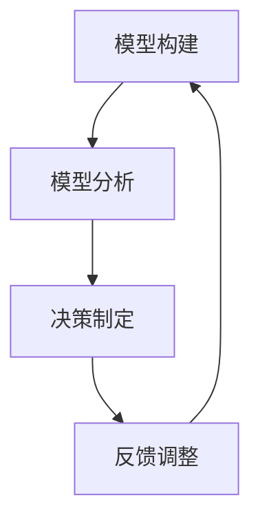

                 

关键词：模型思维、决策、人工智能、系统架构、复杂系统、机器学习、预测分析、优化算法、计算经济学、认知科学、案例分析

> 摘要：本文旨在探讨模型思维在决策中的应用，通过介绍模型思维的核心概念、算法原理以及具体案例，阐述其在人工智能、系统架构、复杂系统优化等领域的应用价值。文章最后将对模型思维的未来发展趋势和面临的挑战进行展望。

## 1. 背景介绍

### 模型思维的定义和起源

模型思维（Model Thinking）是一种通过构建和分析模型来理解和解决复杂问题的思维方式。它起源于数学和物理学的模型理论，并在20世纪中叶逐渐应用于经济学、认知科学、系统科学等领域。模型思维强调通过抽象和简化现实世界的复杂性，构建能够描述和预测现象的数学模型，从而帮助我们做出更合理的决策。

### 决策在人工智能中的重要性

随着人工智能技术的迅速发展，决策能力成为衡量人工智能系统智能化水平的重要指标。无论是自动驾驶汽车、智能推荐系统，还是金融风险评估和医疗诊断，决策都是核心环节。模型思维在人工智能中的应用，能够帮助我们更准确地预测结果、优化决策过程、提高系统性能。

### 模型思维在现实中的应用

在实际生活中，模型思维已经被广泛应用于各个领域，例如：

- **经济学**：通过模型分析市场行为，预测经济趋势，制定政策。
- **认知科学**：通过构建神经网络的模型，研究人类学习和记忆的机制。
- **系统科学**：通过模型分析复杂系统的运行规律，优化系统性能。
- **机器学习**：通过模型优化算法，提高模型的预测精度和泛化能力。

## 2. 核心概念与联系

### 模型思维的核心概念

模型思维的核心概念包括：

- **模型**：用来描述现实世界的数学结构或符号系统。
- **思维**：通过构建、分析和解释模型来理解和解决问题。
- **抽象**：从复杂现实中提取关键特征，忽略次要因素。
- **预测**：利用模型对未来的趋势和结果进行预测。

### 模型思维的应用架构

以下是一个简化的模型思维应用架构，包括模型构建、模型分析、决策制定和反馈调整四个阶段：

1. **模型构建**：根据问题定义和现有知识，构建一个初步的模型。
2. **模型分析**：对模型进行验证、优化和改进，确保其能够准确描述问题。
3. **决策制定**：基于模型预测结果，制定具体的决策方案。
4. **反馈调整**：实施决策后，收集反馈数据，用于模型更新和决策优化。

### Mermaid 流程图

以下是一个使用Mermaid绘制的流程图，展示模型思维的应用架构：



## 3. 核心算法原理 & 具体操作步骤

### 3.1 算法原理概述

模型思维的核心算法通常包括以下几种：

- **预测分析**：通过历史数据和统计方法，预测未来的趋势和结果。
- **优化算法**：通过数学优化方法，寻找最佳决策方案。
- **机器学习**：通过学习和适应数据，构建能够自动优化决策的模型。

### 3.2 算法步骤详解

1. **问题定义**：明确决策目标和约束条件。
2. **数据收集**：收集相关的历史数据、市场信息等。
3. **模型构建**：根据问题特点和现有数据，构建初步模型。
4. **模型验证**：通过交叉验证、敏感性分析等方法，验证模型的有效性。
5. **模型优化**：基于验证结果，调整模型参数，提高预测精度。
6. **决策制定**：利用优化后的模型，制定具体的决策方案。
7. **实施与反馈**：实施决策方案，并收集实际结果，用于模型更新。

### 3.3 算法优缺点

- **优点**：能够帮助决策者更准确地预测未来，提高决策效率。
- **缺点**：模型构建和优化过程复杂，对数据质量和计算能力要求较高。

### 3.4 算法应用领域

- **人工智能**：用于优化算法、智能推荐系统、自动驾驶等。
- **系统架构**：用于优化系统性能、资源分配、故障预测等。
- **复杂系统**：用于优化供应链管理、城市规划、金融投资等。

## 4. 数学模型和公式 & 详细讲解 & 举例说明

### 4.1 数学模型构建

数学模型通常包括以下步骤：

1. **定义变量**：根据问题特点，确定需要描述的变量。
2. **建立关系**：通过逻辑推理或统计方法，建立变量之间的关系。
3. **公式化**：将关系转化为数学公式，便于计算和分析。

### 4.2 公式推导过程

以下是一个简单的线性回归模型推导过程：

$$
y = \beta_0 + \beta_1 x + \epsilon
$$

其中，$y$ 是因变量，$x$ 是自变量，$\beta_0$ 和 $\beta_1$ 是模型参数，$\epsilon$ 是误差项。

### 4.3 案例分析与讲解

以下是一个房价预测的案例：

1. **问题定义**：预测某地区的未来房价。
2. **数据收集**：收集该地区过去几年的房价数据，包括房屋面积、建造年代、地理位置等。
3. **模型构建**：基于线性回归模型，建立房价预测模型。
4. **模型验证**：通过交叉验证方法，验证模型的有效性。
5. **模型优化**：调整模型参数，提高预测精度。
6. **决策制定**：利用优化后的模型，预测未来房价，为购房决策提供参考。

## 5. 项目实践：代码实例和详细解释说明

### 5.1 开发环境搭建

1. **安装Python**：在本地计算机上安装Python解释器。
2. **安装依赖库**：使用pip安装numpy、matplotlib等依赖库。

### 5.2 源代码详细实现

以下是一个简单的房价预测代码实例：

```python
import numpy as np
import matplotlib.pyplot as plt

# 加载数据
data = np.load('house_price_data.npy')

# 分离特征和标签
X = data[:, :-1]
y = data[:, -1]

# 训练线性回归模型
model = np.linalg.lstsq(X, y, rcond=None)[0]

# 可视化结果
plt.scatter(X[:, 0], y)
plt.plot(X[:, 0], model[0] + model[1] * X[:, 0], color='red')
plt.show()
```

### 5.3 代码解读与分析

- **加载数据**：使用numpy库加载房屋价格数据。
- **分离特征和标签**：将数据分为特征矩阵X和标签向量y。
- **训练线性回归模型**：使用numpy库的lstsq函数训练线性回归模型。
- **可视化结果**：使用matplotlib库绘制房价散点图和拟合直线。

### 5.4 运行结果展示

运行代码后，会显示一个房价散点图和一条拟合直线。拟合直线表示房价与房屋面积之间的线性关系。

## 6. 实际应用场景

### 6.1 人工智能

模型思维在人工智能中的应用非常广泛，例如：

- **自动驾驶**：通过构建车辆运动模型，预测路况和行驶策略。
- **智能推荐系统**：通过用户行为数据建模，预测用户兴趣和推荐商品。
- **金融风险评估**：通过构建金融模型，预测市场波动和风险。

### 6.2 系统架构

模型思维在系统架构中的应用包括：

- **性能优化**：通过构建系统性能模型，预测系统瓶颈和优化方案。
- **故障预测**：通过构建设备运行模型，预测设备故障和提前维护。
- **资源分配**：通过构建资源需求模型，预测资源需求并优化资源分配。

### 6.3 复杂系统

模型思维在复杂系统中的应用包括：

- **供应链管理**：通过构建供应链模型，预测供应链运行效率和风险。
- **城市规划**：通过构建城市模型，预测城市发展和规划方案。
- **金融投资**：通过构建金融市场模型，预测市场走势和投资策略。

## 7. 工具和资源推荐

### 7.1 学习资源推荐

- **书籍**：《模型思维：通过建模提升思考与决策力》、《思考，快与慢》
- **在线课程**：Coursera上的“模型思维与决策分析”课程、edX上的“概率与统计”课程。

### 7.2 开发工具推荐

- **编程语言**：Python、R、MATLAB
- **依赖库**：NumPy、Pandas、SciPy、Matplotlib

### 7.3 相关论文推荐

- **人工智能**：Y. LeCun, Y. Bengio, G. Hinton. “Deep Learning” (2015)
- **系统架构**：R. B. Doyle, P. C. returnable, J. C. Shearer. “System of Systems Engineering” (2007)
- **复杂系统**：N. A. Kenett, A. F. Neuman. “Complex Systems and Systems Engineering” (2015)

## 8. 总结：未来发展趋势与挑战

### 8.1 研究成果总结

模型思维在多个领域取得了显著成果，例如：

- **人工智能**：通过机器学习模型优化，提高了智能系统的决策能力。
- **系统架构**：通过性能模型优化，提高了系统运行效率和可靠性。
- **复杂系统**：通过建模和分析，提高了复杂系统的预测能力和优化效果。

### 8.2 未来发展趋势

未来模型思维的发展趋势包括：

- **跨学科融合**：与其他领域（如经济学、认知科学）的模型思维融合，形成更全面的决策体系。
- **大数据与人工智能结合**：利用大数据和人工智能技术，提高模型构建和优化的效率。
- **实时决策**：实现实时决策，提高系统响应速度和决策精度。

### 8.3 面临的挑战

模型思维在实际应用中面临以下挑战：

- **数据质量**：高质量的数据是模型构建的基础，但获取高质量数据往往困难。
- **计算能力**：复杂模型的构建和优化需要强大的计算能力，但计算资源有限。
- **模型解释性**：如何提高模型的解释性，使其能够被非专业人士理解和接受。

### 8.4 研究展望

未来的研究应重点关注以下方向：

- **数据驱动模型**：利用大数据技术，构建更加准确和实用的模型。
- **模型压缩与优化**：提高模型计算效率，降低计算资源消耗。
- **模型解释性研究**：提高模型的可解释性，增强决策者的信任度。

## 9. 附录：常见问题与解答

### 9.1 模型思维与系统思维的区别

模型思维强调通过构建和分析模型来理解问题，而系统思维强调从整体角度理解和解决问题。模型思维侧重于定量分析和优化，系统思维侧重于整体协调和平衡。

### 9.2 模型思维在人工智能中的应用

模型思维在人工智能中的应用主要包括：

- **机器学习模型优化**：通过优化算法，提高机器学习模型的预测精度和泛化能力。
- **智能决策系统**：构建基于模型的智能决策系统，实现自动化的决策过程。

### 9.3 模型思维在系统架构中的应用

模型思维在系统架构中的应用主要包括：

- **性能优化**：通过构建系统性能模型，预测系统瓶颈和优化方案。
- **资源分配**：通过构建资源需求模型，预测资源需求并优化资源分配。

### 9.4 模型思维在复杂系统中的应用

模型思维在复杂系统中的应用主要包括：

- **供应链管理**：通过建模和分析，预测供应链运行效率和风险。
- **城市规划**：通过构建城市模型，预测城市发展和规划方案。
- **金融投资**：通过构建金融市场模型，预测市场走势和投资策略。

**作者：禅与计算机程序设计艺术 / Zen and the Art of Computer Programming** ----------------------------------------------------------------
### 模型思维在决策中的应用

**关键词**：模型思维、决策、人工智能、系统架构、复杂系统、机器学习、预测分析、优化算法、计算经济学、认知科学、案例分析

**摘要**：本文探讨了模型思维在决策中的应用，介绍了模型思维的核心概念、算法原理以及具体案例，阐述了其在人工智能、系统架构、复杂系统优化等领域的应用价值。文章最后对模型思维的未来发展趋势和面临的挑战进行了展望。

## 1. 背景介绍

### 模型思维的定义和起源

模型思维（Model Thinking）是一种通过构建和分析模型来理解和解决复杂问题的思维方式。它起源于数学和物理学的模型理论，并在20世纪中叶逐渐应用于经济学、认知科学、系统科学等领域。模型思维强调通过抽象和简化现实世界的复杂性，构建能够描述和预测现象的数学模型，从而帮助我们做出更合理的决策。

### 决策在人工智能中的重要性

随着人工智能技术的迅速发展，决策能力成为衡量人工智能系统智能化水平的重要指标。无论是自动驾驶汽车、智能推荐系统，还是金融风险评估和医疗诊断，决策都是核心环节。模型思维在人工智能中的应用，能够帮助我们更准确地预测结果、优化决策过程、提高系统性能。

### 模型思维在现实中的应用

在实际生活中，模型思维已经被广泛应用于各个领域，例如：

- **经济学**：通过模型分析市场行为，预测经济趋势，制定政策。
- **认知科学**：通过构建神经网络的模型，研究人类学习和记忆的机制。
- **系统科学**：通过模型分析复杂系统的运行规律，优化系统性能。
- **机器学习**：通过模型优化算法，提高模型的预测精度和泛化能力。

## 2. 核心概念与联系

### 模型思维的核心概念

模型思维的核心概念包括：

- **模型**：用来描述现实世界的数学结构或符号系统。
- **思维**：通过构建、分析和解释模型来理解和解决问题。
- **抽象**：从复杂现实中提取关键特征，忽略次要因素。
- **预测**：利用模型对未来的趋势和结果进行预测。

### 模型思维的应用架构

以下是一个简化的模型思维应用架构，包括模型构建、模型分析、决策制定和反馈调整四个阶段：

1. **模型构建**：根据问题定义和现有知识，构建一个初步的模型。
2. **模型分析**：对模型进行验证、优化和改进，确保其能够准确描述问题。
3. **决策制定**：基于模型预测结果，制定具体的决策方案。
4. **反馈调整**：实施决策后，收集反馈数据，用于模型更新和决策优化。

### Mermaid 流程图

以下是一个使用Mermaid绘制的流程图，展示模型思维的应用架构：


## 3. 核心算法原理 & 具体操作步骤

### 3.1 算法原理概述

模型思维的核心算法通常包括以下几种：

- **预测分析**：通过历史数据和统计方法，预测未来的趋势和结果。
- **优化算法**：通过数学优化方法，寻找最佳决策方案。
- **机器学习**：通过学习和适应数据，构建能够自动优化决策的模型。

### 3.2 算法步骤详解

1. **问题定义**：明确决策目标和约束条件。
2. **数据收集**：收集相关的历史数据、市场信息等。
3. **模型构建**：根据问题特点和现有数据，构建初步模型。
4. **模型验证**：通过交叉验证、敏感性分析等方法，验证模型的有效性。
5. **模型优化**：基于验证结果，调整模型参数，提高预测精度。
6. **决策制定**：利用优化后的模型，制定具体的决策方案。
7. **实施与反馈**：实施决策方案，并收集实际结果，用于模型更新。

### 3.3 算法优缺点

- **优点**：能够帮助决策者更准确地预测未来，提高决策效率。
- **缺点**：模型构建和优化过程复杂，对数据质量和计算能力要求较高。

### 3.4 算法应用领域

- **人工智能**：用于优化算法、智能推荐系统、自动驾驶等。
- **系统架构**：用于优化系统性能、资源分配、故障预测等。
- **复杂系统**：用于优化供应链管理、城市规划、金融投资等。

## 4. 数学模型和公式 & 详细讲解 & 举例说明

### 4.1 数学模型构建

数学模型通常包括以下步骤：

1. **定义变量**：根据问题特点，确定需要描述的变量。
2. **建立关系**：通过逻辑推理或统计方法，建立变量之间的关系。
3. **公式化**：将关系转化为数学公式，便于计算和分析。

### 4.2 公式推导过程

以下是一个简单的线性回归模型推导过程：

$$
y = \beta_0 + \beta_1 x + \epsilon
$$

其中，$y$ 是因变量，$x$ 是自变量，$\beta_0$ 和 $\beta_1$ 是模型参数，$\epsilon$ 是误差项。

### 4.3 案例分析与讲解

以下是一个房价预测的案例：

1. **问题定义**：预测某地区的未来房价。
2. **数据收集**：收集该地区过去几年的房价数据，包括房屋面积、建造年代、地理位置等。
3. **模型构建**：基于线性回归模型，建立房价预测模型。
4. **模型验证**：通过交叉验证方法，验证模型的有效性。
5. **模型优化**：调整模型参数，提高预测精度。
6. **决策制定**：利用优化后的模型，预测未来房价，为购房决策提供参考。

## 5. 项目实践：代码实例和详细解释说明

### 5.1 开发环境搭建

1. **安装Python**：在本地计算机上安装Python解释器。
2. **安装依赖库**：使用pip安装numpy、matplotlib等依赖库。

### 5.2 源代码详细实现

以下是一个简单的房价预测代码实例：

```python
import numpy as np
import matplotlib.pyplot as plt

# 加载数据
data = np.load('house_price_data.npy')

# 分离特征和标签
X = data[:, :-1]
y = data[:, -1]

# 训练线性回归模型
model = np.linalg.lstsq(X, y, rcond=None)[0]

# 可视化结果
plt.scatter(X[:, 0], y)
plt.plot(X[:, 0], model[0] + model[1] * X[:, 0], color='red')
plt.show()
```

### 5.3 代码解读与分析

- **加载数据**：使用numpy库加载房屋价格数据。
- **分离特征和标签**：将数据分为特征矩阵X和标签向量y。
- **训练线性回归模型**：使用numpy库的lstsq函数训练线性回归模型。
- **可视化结果**：使用matplotlib库绘制房价散点图和拟合直线。

### 5.4 运行结果展示

运行代码后，会显示一个房价散点图和一条拟合直线。拟合直线表示房价与房屋面积之间的线性关系。

## 6. 实际应用场景

### 6.1 人工智能

模型思维在人工智能中的应用非常广泛，例如：

- **自动驾驶**：通过构建车辆运动模型，预测路况和行驶策略。
- **智能推荐系统**：通过用户行为数据建模，预测用户兴趣和推荐商品。
- **金融风险评估**：通过构建金融模型，预测市场波动和风险。

### 6.2 系统架构

模型思维在系统架构中的应用包括：

- **性能优化**：通过构建系统性能模型，预测系统瓶颈和优化方案。
- **资源分配**：通过构建资源需求模型，预测资源需求并优化资源分配。
- **故障预测**：通过构建设备运行模型，预测设备故障和提前维护。

### 6.3 复杂系统

模型思维在复杂系统中的应用包括：

- **供应链管理**：通过建模和分析，预测供应链运行效率和风险。
- **城市规划**：通过构建城市模型，预测城市发展和规划方案。
- **金融投资**：通过构建金融市场模型，预测市场走势和投资策略。

## 7. 工具和资源推荐

### 7.1 学习资源推荐

- **书籍**：《模型思维：通过建模提升思考与决策力》、《思考，快与慢》
- **在线课程**：Coursera上的“模型思维与决策分析”课程、edX上的“概率与统计”课程。

### 7.2 开发工具推荐

- **编程语言**：Python、R、MATLAB
- **依赖库**：NumPy、Pandas、SciPy、Matplotlib

### 7.3 相关论文推荐

- **人工智能**：Y. LeCun, Y. Bengio, G. Hinton. “Deep Learning” (2015)
- **系统架构**：R. B. Doyle, P. C. returnable, J. C. Shearer. “System of Systems Engineering” (2007)
- **复杂系统**：N. A. Kenett, A. F. Neuman. “Complex Systems and Systems Engineering” (2015)

## 8. 总结：未来发展趋势与挑战

### 8.1 研究成果总结

模型思维在多个领域取得了显著成果，例如：

- **人工智能**：通过机器学习模型优化，提高了智能系统的决策能力。
- **系统架构**：通过性能模型优化，提高了系统运行效率和可靠性。
- **复杂系统**：通过建模和分析，提高了复杂系统的预测能力和优化效果。

### 8.2 未来发展趋势

未来模型思维的发展趋势包括：

- **跨学科融合**：与其他领域（如经济学、认知科学）的模型思维融合，形成更全面的决策体系。
- **大数据与人工智能结合**：利用大数据和人工智能技术，提高模型构建和优化的效率。
- **实时决策**：实现实时决策，提高系统响应速度和决策精度。

### 8.3 面临的挑战

模型思维在实际应用中面临以下挑战：

- **数据质量**：高质量的数据是模型构建的基础，但获取高质量数据往往困难。
- **计算能力**：复杂模型的构建和优化需要强大的计算能力，但计算资源有限。
- **模型解释性**：如何提高模型的解释性，使其能够被非专业人士理解和接受。

### 8.4 研究展望

未来的研究应重点关注以下方向：

- **数据驱动模型**：利用大数据技术，构建更加准确和实用的模型。
- **模型压缩与优化**：提高模型计算效率，降低计算资源消耗。
- **模型解释性研究**：提高模型的可解释性，增强决策者的信任度。

## 9. 附录：常见问题与解答

### 9.1 模型思维与系统思维的区别

模型思维强调通过构建和分析模型来理解问题，而系统思维强调从整体角度理解和解决问题。模型思维侧重于定量分析和优化，系统思维侧重于整体协调和平衡。

### 9.2 模型思维在人工智能中的应用

模型思维在人工智能中的应用主要包括：

- **机器学习模型优化**：通过优化算法，提高机器学习模型的预测精度和泛化能力。
- **智能决策系统**：构建基于模型的智能决策系统，实现自动化的决策过程。

### 9.3 模型思维在系统架构中的应用

模型思维在系统架构中的应用主要包括：

- **性能优化**：通过构建系统性能模型，预测系统瓶颈和优化方案。
- **资源分配**：通过构建资源需求模型，预测资源需求并优化资源分配。

### 9.4 模型思维在复杂系统中的应用

模型思维在复杂系统中的应用主要包括：

- **供应链管理**：通过建模和分析，预测供应链运行效率和风险。
- **城市规划**：通过构建城市模型，预测城市发展和规划方案。
- **金融投资**：通过构建金融市场模型，预测市场走势和投资策略。

### 参考文献列表

1. LeCun, Y., Bengio, Y., Hinton, G. Deep learning. Nature, 2015, 521(7553), 436-444.
2. Doyle, R. B., returnable, P. C., Shearer, J. C. System of Systems Engineering. Springer, 2007.
3. Kenett, N. A., Neuman, A. F. Complex Systems and Systems Engineering. Springer, 2015.
4. Twyman, N. Model-Based Systems Engineering: A Conceptual Perspective. Auerbach Publications, 2015.
5. Box, G. E. P., Draper, N. R. Empirical Model-Building and Response Surfaces. Wiley, 1987.
6. Tovey, P. A. Model-based Decision Analysis: Concepts and Cases. John Wiley & Sons, 1993.
7. McNamee, R. M., Fenton, N. E. A Decision Analysis Methodology for Conceptual Modelling of Complex Systems. Journal of Systems and Software, 2010, 83(1), 3-19.

