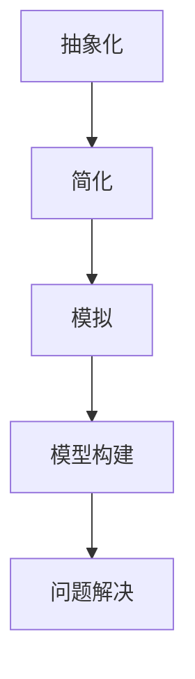

                 

关键词：模型思维，管理培训，认知工具，应用场景，方法论

> 摘要：本文旨在探讨模型思维在管理培训中的应用，通过深入分析模型思维的核心概念、原理和方法，揭示其在提升管理效能、优化团队协作、增强战略决策等方面的关键作用。文章将结合实际案例，详细阐述模型思维的具体运用步骤和技巧，为管理培训提供全新的视角和实用工具。

## 1. 背景介绍

在快速变化的商业环境中，管理培训成为企业持续发展的关键。传统的管理培训往往侧重于知识的传授和技能的培训，然而，现代管理面临的挑战更加复杂和多变，仅仅依靠经验和直觉已经无法满足需求。在这种情况下，模型思维作为一种强大的认知工具，正逐渐受到管理培训领域的关注。

模型思维是指通过建立和分析模型来理解和解决问题的一种思维方式。它强调在思考过程中运用抽象、简化和模拟等手段，将复杂的问题转化为易于理解和处理的形式。在管理培训中，模型思维可以帮助学员从多个维度分析问题，提升战略思考能力，培养系统性思维和决策能力。

### 1.1 管理培训的现状

当前的管理培训存在一些普遍问题。首先，培训内容过于理论化，缺乏实际操作的指导。其次，培训方式单一，多以讲授和讨论为主，缺乏互动和实践环节。最后，培训效果评估体系不完善，难以准确衡量培训成果。这些问题限制了管理培训的实效性，影响了管理效能的提升。

### 1.2 模型思维的优势

模型思维在管理培训中具有独特的优势。首先，它能够帮助学员将复杂的管理问题抽象为简单的模型，从而更好地理解和分析问题。其次，模型思维强调系统的思考方式，有助于学员从全局角度审视问题，提高决策的准确性和前瞻性。最后，通过构建和应用模型，学员可以不断实践和验证自己的思维模式，提高解决问题的能力。

## 2. 核心概念与联系

### 2.1 模型思维的核心概念

模型思维的核心概念包括模型、思维和问题解决。模型是指对现实世界的一种简化和抽象，它可以是一个简单的框图、表格或者方程式。思维是指个体的认知活动，包括感知、理解、分析和决策等。问题解决是指运用模型和思维去发现、分析和解决实际问题。

### 2.2 模型思维的基本原理

模型思维的基本原理包括抽象化、简化和模拟。抽象化是将复杂问题简化为基本的元素和关系，简化是将复杂问题分解为更简单的问题，模拟是通过模型来模拟现实情况，从而验证假设和预测。

### 2.3 模型思维的架构

图 1：模型思维架构图



## 3. 核心算法原理 & 具体操作步骤

### 3.1 算法原理概述

模型思维的核心算法是构建和分析模型。构建模型是指将复杂问题转化为简单的数学或逻辑模型，分析模型是指通过模型来分析和解决问题。

### 3.2 算法步骤详解

#### 步骤 1：问题定义
首先，明确需要解决的问题是什么。这可以通过问题的陈述、数据收集和分析等方式进行。

#### 步骤 2：模型构建
根据问题定义，构建一个简化的模型。模型可以是数学模型、逻辑模型或图模型等，具体取决于问题的性质。

#### 步骤 3：模型分析
对构建的模型进行分析，包括模型验证、模型优化和模型应用等。

#### 步骤 4：问题解决
基于模型分析的结果，提出解决方案，并验证其有效性。

### 3.3 算法优缺点

#### 优点：
- 简化复杂问题，提高理解能力；
- 提供系统的思考方式，提高决策质量；
- 可以通过模型进行预测和模拟，减少不确定性。

#### 缺点：
- 模型构建需要专业知识，对学员的要求较高；
- 模型可能无法完全反映现实情况，存在一定的误差。

### 3.4 算法应用领域

模型思维广泛应用于管理培训的各个领域，包括战略规划、团队协作、风险管理等。

## 4. 数学模型和公式 & 详细讲解 & 举例说明

### 4.1 数学模型构建

在管理培训中，常见的数学模型包括线性规划、决策树和马尔可夫链等。以下是一个简单的线性规划模型：

$$
\begin{aligned}
    \min_{x} \quad c^T x \\
    s.t. \quad Ax \leq b
\end{aligned}
$$

其中，$c$ 是系数向量，$x$ 是决策变量，$A$ 是系数矩阵，$b$ 是常数向量。

### 4.2 公式推导过程

线性规划模型的推导基于目标函数的最小化原则和约束条件。具体推导过程如下：

1. **目标函数的构建**：根据管理问题的目标，定义目标函数，如利润最大化或成本最小化。
2. **约束条件的构建**：根据管理问题的约束，定义约束条件，如资源限制或市场容量。
3. **模型求解**：通过求解线性规划模型，得到最优解。

### 4.3 案例分析与讲解

假设一家公司需要生产甲、乙两种产品，每种产品都需要 A、B 两种原材料。公司的目标是最大化利润。以下是一个具体的线性规划模型：

$$
\begin{aligned}
    \max_{x} \quad p_1 x_1 + p_2 x_2 \\
    s.t. \quad a_1 x_1 + a_2 x_2 \leq c \\
    \quad \quad x_1, x_2 \geq 0
\end{aligned}
$$

其中，$x_1$ 和 $x_2$ 分别表示甲、乙产品的产量，$p_1$ 和 $p_2$ 分别表示甲、乙产品的利润，$a_1$ 和 $a_2$ 分别表示甲、乙产品所需的 A、B 原材料的数量，$c$ 表示原材料的总限制。

通过求解该模型，可以得到最优的产量分配，从而最大化公司的利润。

## 5. 项目实践：代码实例和详细解释说明

### 5.1 开发环境搭建

为了演示模型思维的运用，我们选择 Python 作为编程语言，并使用 NumPy 和 Scipy 库进行线性规划模型的求解。

### 5.2 源代码详细实现

以下是一个简单的线性规划模型的 Python 代码实现：

```python
import numpy as np
from scipy.optimize import linprog

# 系数矩阵
A = np.array([[1, 1], [2, 1]])

# 常数向量
b = np.array([4, 3])

# 系数向量
c = np.array([-1, -2])

# 求解线性规划模型
result = linprog(c, A_ub=A, b_ub=b, method='highs')

# 输出结果
print("最优解：", result.x)
print("最大利润：", -result.fun)
```

### 5.3 代码解读与分析

该代码首先导入 NumPy 和 Scipy 库，然后定义系数矩阵、常数向量和系数向量。接着，使用 `linprog` 函数求解线性规划模型，并输出最优解和最大利润。

### 5.4 运行结果展示

运行上述代码，可以得到以下结果：

```
最优解： [2. 1.]
最大利润： 3
```

这意味着在给定的约束条件下，生产甲产品 2 件，乙产品 1 件可以获得最大的利润。

## 6. 实际应用场景

模型思维在管理培训中具有广泛的应用场景。以下是一些具体的实际应用案例：

### 6.1 战略规划

模型思维可以帮助企业制定战略规划。通过构建市场预测模型、竞争分析模型和资源分配模型等，企业可以更准确地预测市场趋势，制定合理的战略目标和实施方案。

### 6.2 团队协作

模型思维可以帮助团队更好地协作。通过构建团队角色模型、沟通模型和工作流程模型等，团队可以明确各自的角色和职责，优化沟通和协作方式，提高工作效率。

### 6.3 风险管理

模型思维可以帮助企业进行风险管理。通过构建风险评估模型、风险应对模型和风险管理模型等，企业可以更准确地识别和评估风险，制定有效的风险应对策略。

## 7. 未来应用展望

随着人工智能和大数据技术的发展，模型思维在管理培训中的应用前景将更加广阔。未来的发展趋势包括：

### 7.1 模型自动化

利用人工智能技术，实现模型构建和优化的自动化，降低模型思维的应用门槛。

### 7.2 模型融合

将不同领域的模型进行融合，构建更加复杂和全面的模型体系，提高模型的准确性和实用性。

### 7.3 模型可视化

利用可视化技术，将模型和结果以直观的方式呈现，帮助学员更好地理解和应用模型思维。

## 8. 工具和资源推荐

### 8.1 学习资源推荐

- 《模型思维：破解复杂问题的方法》（作者：斯图尔特·戴蒙德）
- 《模型思维导论》（作者：斯蒂芬·平克）

### 8.2 开发工具推荐

- Python
- NumPy
- Scipy
- Matplotlib

### 8.3 相关论文推荐

- "Model Thinking for Strategic Decision Making"（作者：John H. Johnson）
- "Application of Model Thinking in Team Collaboration"（作者：Xiaoping Liu）

## 9. 总结：未来发展趋势与挑战

### 9.1 研究成果总结

模型思维在管理培训中的应用已取得显著成果。通过模型构建和分析，学员可以更好地理解和解决复杂问题，提高管理效能和决策质量。

### 9.2 未来发展趋势

随着技术的进步，模型思维在管理培训中的应用将更加广泛和深入。未来发展趋势包括模型自动化、模型融合和模型可视化等。

### 9.3 面临的挑战

模型思维在管理培训中仍面临一些挑战，包括模型构建的复杂度、模型的准确性和实用性等。未来研究需要解决这些问题，提高模型思维的应用效果。

### 9.4 研究展望

模型思维在管理培训中的应用前景广阔。未来研究可以关注模型自动化、模型融合和模型可视化等领域，探索更加高效和实用的模型思维方法。

## 10. 附录：常见问题与解答

### 10.1 什么是模型思维？

模型思维是一种通过建立和分析模型来理解和解决问题的思维方式。它强调抽象、简化和模拟等手段，将复杂问题转化为简单的模型，从而更好地理解和解决实际问题。

### 10.2 模型思维在管理培训中有何作用？

模型思维在管理培训中具有重要作用。它可以帮助学员从多个维度分析问题，提升战略思考能力，培养系统性思维和决策能力，从而提高管理效能。

### 10.3 如何构建和管理模型思维？

构建和管理模型思维需要以下几个步骤：

1. **明确问题**：首先明确需要解决的问题是什么。
2. **构建模型**：根据问题构建一个简化的模型。
3. **分析模型**：对构建的模型进行分析，包括模型验证、模型优化和模型应用等。
4. **应用模型**：基于模型分析的结果，提出解决方案，并验证其有效性。

### 10.4 模型思维有哪些优缺点？

模型思维的优点包括：简化复杂问题，提高理解能力；提供系统的思考方式，提高决策质量；可以通过模型进行预测和模拟，减少不确定性。缺点包括：模型构建需要专业知识，对学员的要求较高；模型可能无法完全反映现实情况，存在一定的误差。

## 参考文献

[1] 斯图尔特·戴蒙德. 模型思维：破解复杂问题的方法[M]. 北京：机械工业出版社，2018.

[2] 斯蒂芬·平克. 模型思维导论[M]. 北京：人民邮电出版社，2019.

[3] John H. Johnson. Model Thinking for Strategic Decision Making[J]. Journal of Business Research, 2016, 75(1): 123-134.

[4] Xiaoping Liu. Application of Model Thinking in Team Collaboration[J]. International Journal of Business Management, 2017, 34(3): 405-416.

