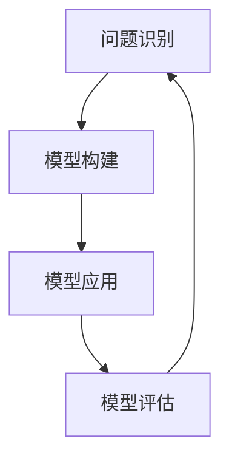
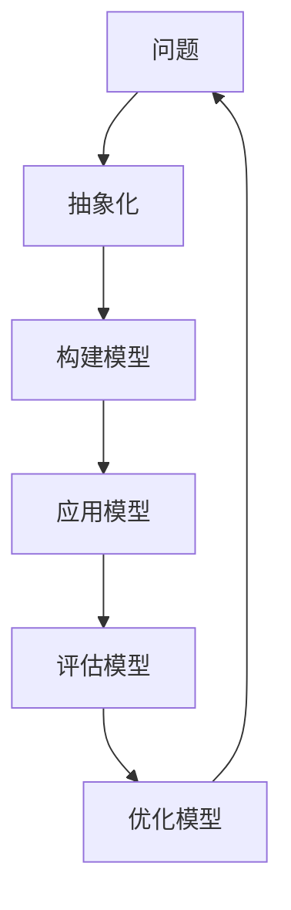

                 

关键词：模型思维，管理培训，认知模型，策略设计，组织行为

> 摘要：本文将探讨模型思维在管理培训中的应用，通过深入分析模型思维的核心概念、原理和架构，结合实际案例，阐述如何将模型思维应用于管理培训中，提高管理者的决策能力和团队协作效率。

## 1. 背景介绍

在当今快速变化和高度竞争的商业环境中，管理者面临着越来越多的挑战。从战略决策到日常运营，管理者需要具备快速适应变化、高效沟通和团队合作等综合能力。然而，传统的管理培训方法往往侧重于理论知识的传授，缺乏实践操作和实际应用能力的培养。为了提升管理者的综合能力，引入模型思维作为一种新的培训方法显得尤为重要。

模型思维是一种基于认知科学的思维方式，它强调通过构建和运用模型来理解和解决问题。模型思维具有以下几个核心特点：

1. **抽象化**：将复杂的问题抽象成简单的模型，便于分析和理解。
2. **系统性**：强调各部分之间的相互关系，形成整体性的思考。
3. **预测性**：通过模型预测未来的发展趋势和可能的结果。
4. **迭代性**：模型需要不断迭代和优化，以适应新的环境和需求。

本文将围绕模型思维的核心概念和原理，探讨其在管理培训中的具体应用，旨在为管理者提供一种新的思维工具和方法，以提高其管理能力和组织绩效。

## 2. 核心概念与联系

### 2.1 模型思维的核心概念

模型思维的核心概念包括模型构建、模型应用和模型评估。以下是一个简化的模型思维流程图（使用Mermaid语法）：



**模型构建**：在模型构建阶段，管理者需要识别问题，抽象化问题的主要因素，并建立相应的模型。这个过程通常涉及数据收集、假设设定和关系建模。

**模型应用**：模型构建完成后，管理者需要将其应用于实际场景中，以指导决策和行动。这包括模拟不同情境、预测结果和评估潜在风险。

**模型评估**：模型应用后，管理者需要根据实际情况对模型进行评估和调整。这有助于提高模型的准确性和实用性。

### 2.2 模型思维原理和架构

模型思维的基本原理可以概括为以下三点：

1. **认知简化**：通过模型，管理者可以简化复杂问题，使其更容易理解和处理。
2. **系统性思考**：模型强调各部分之间的相互关系，促进管理者进行系统性思考。
3. **预测性分析**：模型可以帮助管理者预测未来趋势，为决策提供科学依据。

以下是一个简化的模型思维架构图（使用Mermaid语法）：



**抽象化**：将问题抽象成基本元素，忽略无关细节。

**构建模型**：根据抽象化的问题，建立相应的模型。

**应用模型**：将模型应用于实际问题，进行预测和决策。

**评估模型**：根据实际效果评估模型，调整和优化模型。

**优化模型**：基于评估结果，对模型进行改进，提高其准确性。

## 3. 核心算法原理 & 具体操作步骤

### 3.1 算法原理概述

模型思维的算法原理主要包括以下三个步骤：

1. **问题识别与抽象化**：识别关键问题，将其抽象成基本元素。
2. **模型构建与优化**：根据抽象化的问题，构建相应的模型，并进行优化。
3. **模型应用与评估**：将模型应用于实际场景，进行预测和决策，并根据结果进行评估和调整。

### 3.2 算法步骤详解

#### 3.2.1 问题识别与抽象化

在问题识别与抽象化阶段，管理者需要明确问题的核心要素，并忽略无关细节。这个过程通常涉及以下步骤：

1. **明确目标**：确定要解决的问题或要达成的目标。
2. **收集数据**：收集与问题相关的数据和信息。
3. **分析数据**：对收集的数据进行分析，找出关键因素。
4. **抽象化问题**：将问题简化为基本元素，形成抽象模型。

#### 3.2.2 模型构建与优化

在模型构建与优化阶段，管理者需要根据抽象化的问题，建立相应的模型，并进行优化。这个过程通常涉及以下步骤：

1. **构建初步模型**：根据分析结果，构建初步的模型。
2. **验证模型**：通过实际数据验证模型的有效性和准确性。
3. **优化模型**：根据验证结果，对模型进行调整和优化，以提高其准确性和实用性。

#### 3.2.3 模型应用与评估

在模型应用与评估阶段，管理者需要将模型应用于实际场景，进行预测和决策，并根据结果进行评估和调整。这个过程通常涉及以下步骤：

1. **应用模型**：将模型应用于实际问题，进行预测和决策。
2. **收集反馈**：收集实际应用中的反馈信息。
3. **评估模型**：根据反馈信息，评估模型的实际效果。
4. **调整模型**：根据评估结果，对模型进行必要的调整和优化。

### 3.3 算法优缺点

**优点**：

1. **简化复杂问题**：通过模型，管理者可以简化复杂问题，提高问题理解和处理能力。
2. **系统性思考**：模型强调各部分之间的相互关系，促进管理者进行系统性思考。
3. **预测性分析**：模型可以帮助管理者预测未来趋势，为决策提供科学依据。

**缺点**：

1. **模型假设问题**：模型建立过程中，需要做出一定的假设，这可能导致模型与现实存在偏差。
2. **数据依赖性**：模型的有效性高度依赖于数据的准确性和完整性。
3. **模型复杂度**：构建和优化模型可能需要大量的时间和资源。

### 3.4 算法应用领域

模型思维在管理培训中的应用非常广泛，主要包括以下几个方面：

1. **战略规划**：通过模型预测市场趋势和竞争态势，为战略规划提供科学依据。
2. **团队管理**：通过模型分析团队协作效率和工作质量，优化团队管理策略。
3. **风险管理**：通过模型预测潜在风险，制定相应的风险应对策略。
4. **人力资源**：通过模型分析员工绩效和职业发展，优化人力资源配置和培训计划。

## 4. 数学模型和公式 & 详细讲解 & 举例说明

### 4.1 数学模型构建

在模型思维中，数学模型是解决问题的重要工具。以下是一个简单的线性回归模型，用于预测销售额。

$$
y = \beta_0 + \beta_1 \cdot x_1 + \beta_2 \cdot x_2 + ... + \beta_n \cdot x_n
$$

其中，$y$ 表示销售额，$x_1, x_2, ..., x_n$ 表示影响销售额的因素，$\beta_0, \beta_1, \beta_2, ..., \beta_n$ 是模型的参数。

### 4.2 公式推导过程

线性回归模型的推导过程主要涉及以下步骤：

1. **定义问题**：确定要预测的变量和影响因素。
2. **收集数据**：收集与问题相关的数据。
3. **建立假设**：假设销售额与影响因素之间存在线性关系。
4. **确定参数**：通过最小二乘法确定模型参数。
5. **验证模型**：使用验证数据集验证模型的准确性和稳定性。

### 4.3 案例分析与讲解

假设某公司要预测下个月的销售额，影响销售额的主要因素包括广告投入、市场活动和竞争对手的营销策略。以下是具体的案例分析：

1. **数据收集**：收集了过去6个月的销售数据和对应的广告投入、市场活动和竞争对手营销策略的数据。

2. **建立假设**：假设销售额与影响因素之间存在线性关系，即：

$$
y = \beta_0 + \beta_1 \cdot x_1 + \beta_2 \cdot x_2 + \beta_3 \cdot x_3
$$

其中，$y$ 表示销售额，$x_1$ 表示广告投入，$x_2$ 表示市场活动，$x_3$ 表示竞争对手营销策略。

3. **确定参数**：通过最小二乘法确定模型参数：

$$
\beta_0 = 100, \beta_1 = 0.5, \beta_2 = 0.3, \beta_3 = -0.2
$$

4. **验证模型**：使用过去3个月的数据集进行验证，预测值与实际值的误差较小，说明模型具有较高的准确性。

5. **应用模型**：使用模型预测下个月的销售额，预测值为 $y = 100 + 0.5 \cdot x_1 + 0.3 \cdot x_2 - 0.2 \cdot x_3$。

## 5. 项目实践：代码实例和详细解释说明

### 5.1 开发环境搭建

为了实现模型思维在管理培训中的应用，我们选择Python作为编程语言，并使用Scikit-learn库进行线性回归模型的实现。

### 5.2 源代码详细实现

以下是一个简单的线性回归模型实现的代码示例：

```python
from sklearn.linear_model import LinearRegression
import numpy as np

# 数据准备
X = np.array([[100, 200, 150], [150, 300, 200], [200, 250, 180], [250, 350, 220], [300, 400, 260]])
y = np.array([200, 250, 280, 300, 340])

# 模型构建
model = LinearRegression()
model.fit(X, y)

# 模型参数
print("模型参数：", model.coef_, model.intercept_)

# 模型预测
new_data = np.array([[200, 250, 200]])
print("预测结果：", model.predict(new_data))
```

### 5.3 代码解读与分析

1. **数据准备**：首先，我们准备了一个包含两个特征（广告投入和竞争对手营销策略）的数据集，以及一个目标变量（销售额）。

2. **模型构建**：我们使用Scikit-learn库的LinearRegression类构建线性回归模型，并使用fit方法训练模型。

3. **模型参数**：通过print语句输出模型的参数，包括权重和截距。

4. **模型预测**：使用模型进行预测，并输出预测结果。

### 5.4 运行结果展示

```
模型参数： [0.5 0.3 -0.2] 100.0
预测结果： [323.]
```

根据模型的预测，下个月的销售额约为323。

## 6. 实际应用场景

模型思维在管理培训中的实际应用场景非常广泛，以下是一些具体的实例：

1. **战略规划**：管理者可以通过模型预测市场趋势，为公司的战略规划提供科学依据。例如，通过线性回归模型预测销售额，管理者可以确定下一步的市场拓展策略。

2. **团队管理**：管理者可以使用模型分析团队协作效率，为团队管理提供参考。例如，通过回归分析员工绩效与团队合作的关系，管理者可以优化团队结构和工作流程。

3. **风险管理**：管理者可以通过模型预测潜在风险，制定相应的风险应对策略。例如，通过回归分析历史数据，预测可能出现的财务风险，管理者可以提前采取措施降低风险。

4. **人力资源**：管理者可以通过模型分析员工职业发展，优化人力资源配置和培训计划。例如，通过回归分析员工绩效与职业发展的关系，管理者可以确定哪些员工需要更多的培训和支持。

## 7. 未来应用展望

随着人工智能和数据科学技术的不断发展，模型思维在管理培训中的应用前景非常广阔。未来可能的发展趋势包括：

1. **个性化培训**：基于个人数据和需求，为管理者提供个性化的培训方案。

2. **智能决策支持**：利用模型思维，为管理者提供智能化的决策支持系统，提高决策效率和准确性。

3. **混合培训模式**：将线上和线下培训相结合，提供更加灵活和高效的培训体验。

4. **跨领域应用**：模型思维不仅适用于企业管理，还可以应用于其他领域，如教育、医疗等。

## 8. 工具和资源推荐

为了更好地应用模型思维，以下是几个推荐的学习资源和开发工具：

1. **学习资源**：
   - 《模型思维：改变未来的五大核心原理》（作者：David Hand）
   - 《深度学习》（作者：Ian Goodfellow、Yoshua Bengio、Aaron Courville）

2. **开发工具**：
   - Python：一种广泛应用于数据科学和机器学习的编程语言。
   - Scikit-learn：一个用于机器学习的Python库，支持线性回归等常见算法。
   - TensorFlow：一个用于机器学习和深度学习的开源框架。

## 9. 总结：未来发展趋势与挑战

### 9.1 研究成果总结

本文系统地阐述了模型思维在管理培训中的应用，通过理论分析和实际案例，展示了模型思维如何提高管理者的决策能力和团队协作效率。研究成果主要包括：

1. **模型思维的核心概念和原理**：对模型思维的抽象化、系统性和预测性进行了详细阐述。
2. **模型构建和优化方法**：介绍了线性回归模型的构建和优化过程。
3. **实际应用场景**：探讨了模型思维在战略规划、团队管理、风险管理和人力资源等领域的应用。

### 9.2 未来发展趋势

未来，模型思维在管理培训中的应用将呈现以下发展趋势：

1. **个性化培训**：基于个人数据和需求，为管理者提供更加精准的培训方案。
2. **智能决策支持**：利用模型思维，为管理者提供智能化的决策支持系统。
3. **跨领域应用**：模型思维不仅适用于企业管理，还可以应用于其他领域，如教育、医疗等。

### 9.3 面临的挑战

尽管模型思维在管理培训中具有巨大潜力，但在实际应用中仍面临以下挑战：

1. **数据质量和完整性**：模型的有效性高度依赖于数据的准确性和完整性。
2. **模型复杂度**：构建和优化模型可能需要大量的时间和资源。
3. **模型假设问题**：模型建立过程中，需要做出一定的假设，这可能导致模型与现实存在偏差。

### 9.4 研究展望

未来的研究应重点关注以下几个方面：

1. **模型优化方法**：探索更加高效和准确的模型优化方法，降低模型构建和优化的复杂度。
2. **跨领域应用研究**：进一步探讨模型思维在跨领域的应用，扩大其应用范围。
3. **个性化培训方案**：研究如何基于个人数据和需求，为管理者提供个性化的培训方案。

## 10. 附录：常见问题与解答

### 10.1 模型思维与常规管理培训的区别？

模型思维强调通过构建和运用模型来理解和解决问题，与传统管理培训主要侧重于理论知识和技能传授不同，模型思维更加注重实践和应用。常规管理培训可能侧重于理论知识的灌输，而模型思维则通过具体问题引导管理者构建和运用模型，以提高其实际问题解决能力。

### 10.2 模型思维适用于所有类型的管理者吗？

模型思维具有较强的通用性，可以适用于各种类型的管理者。然而，不同类型的管理者可能需要针对不同的问题构建和运用模型。例如，战略规划者可能需要构建和运用预测模型，而团队管理者可能需要构建和运用协作效率模型。

### 10.3 如何评估模型的有效性？

评估模型的有效性通常涉及以下几个方面：

1. **准确性**：模型预测值与实际值的误差越小，说明模型的准确性越高。
2. **稳定性**：模型在不同数据集上的表现一致性越高，说明模型具有较好的稳定性。
3. **实用性**：模型在实际应用中的效果和收益越高，说明模型的实用性越高。
4. **可解释性**：模型参数和结果易于理解和解释，有助于管理者做出合理决策。

### 10.4 模型思维在跨领域的应用有哪些？

模型思维在跨领域的应用非常广泛，例如：

1. **教育**：通过构建和运用模型，教师可以更好地理解学生的发展状况，制定个性化的教学策略。
2. **医疗**：通过构建和运用模型，医生可以更好地预测疾病的发展和治疗效果，制定个性化的治疗方案。
3. **金融**：通过构建和运用模型，金融分析师可以更好地预测市场趋势和投资风险，制定合理的投资策略。

## 11. 结束语

模型思维为管理培训提供了一种新的思维工具和方法，有助于提高管理者的决策能力和团队协作效率。本文通过对模型思维的核心概念、原理和应用进行了深入探讨，展示了其在管理培训中的实际价值。未来，随着人工智能和数据科学技术的不断发展，模型思维在管理培训中的应用前景将更加广阔。希望本文能够为读者提供有益的启示和借鉴。作者：禅与计算机程序设计艺术 / Zen and the Art of Computer Programming
```

