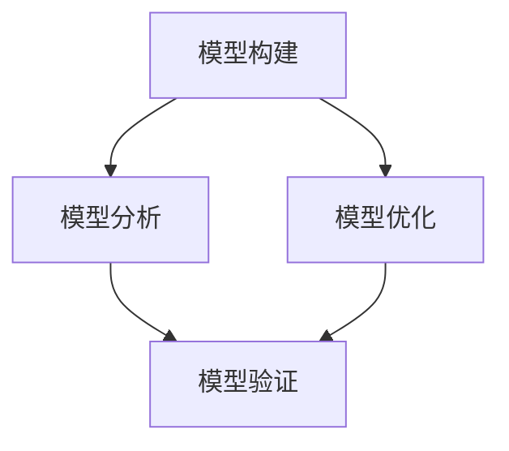

                 

关键词：模型思维、管理效率、复杂系统、决策优化、算法、人工智能

> 摘要：本文将探讨模型思维在提高管理效率方面的作用。通过分析模型思维的核心概念、应用场景和具体案例，阐述其在企业管理、战略规划和团队协作中的重要性，以及如何利用模型思维来提升管理效率和决策质量。

## 1. 背景介绍

在信息化、全球化和复杂化的今天，企业管理面临前所未有的挑战。如何高效地决策、优化资源分配、提升团队协作效率成为企业管理者亟待解决的问题。传统的管理方法和经验已经难以应对复杂多变的市场环境。因此，探索新的管理工具和方法，提高管理效率成为当务之急。

在这个背景下，模型思维作为一种强大的工具，逐渐引起了管理者和学者的关注。模型思维是指通过构建、分析和优化模型来理解和解决问题的思维方式。它不仅能够帮助我们更清晰地认识复杂系统，还能为决策提供科学依据，从而提升管理效率。

## 2. 核心概念与联系

### 2.1 模型思维的定义

模型思维是一种基于模型构建和分析的思考方式，旨在通过模拟、预测和优化来解决问题。它包括以下几个核心概念：

- **模型**：模型是对现实世界的一种抽象和简化，用于描述系统、现象或问题。模型可以是数学公式、计算机模拟、物理实验等。
- **构建**：构建模型的过程包括识别关键因素、定义变量、建立关系和假设等。这一过程需要管理者具备扎实的专业知识、敏锐的洞察力和逻辑思维能力。
- **分析**：分析模型的过程是对模型进行验证、优化和调整。通过分析，管理者可以了解模型的可靠性、预测能力和局限性，为决策提供参考。
- **优化**：优化模型的过程是通过调整参数、改进算法等手段来提高模型的预测精度和实用性。

### 2.2 模型思维在管理中的应用

模型思维在管理中的应用非常广泛，包括以下几个方面：

- **战略规划**：通过构建竞争模型、市场趋势模型等，管理者可以更好地把握市场动态、预测竞争对手行为，从而制定更为科学和有效的战略。
- **资源分配**：通过构建资源分配模型，管理者可以优化资源配置，提高资源利用效率，降低运营成本。
- **团队协作**：通过构建团队协作模型，管理者可以更好地了解团队的工作模式、沟通方式等，从而提高团队协作效率。
- **风险管理**：通过构建风险模型，管理者可以识别潜在风险、评估风险影响，制定有效的风险管理策略。

### 2.3 Mermaid 流程图

以下是一个简化的Mermaid流程图，用于展示模型思维的核心概念和联系：



## 3. 核心算法原理 & 具体操作步骤

### 3.1 算法原理概述

模型思维的核心算法包括模型构建、模型分析和模型优化。这些算法的基本原理如下：

- **模型构建**：基于系统分析，识别关键因素，定义变量和参数，建立数学模型或计算机模型。
- **模型分析**：通过数据分析和模拟，验证模型的有效性，评估模型的预测能力和局限性。
- **模型优化**：通过调整参数、改进算法，优化模型的性能，提高预测精度和实用性。

### 3.2 算法步骤详解

以下是模型思维算法的具体操作步骤：

1. **问题定义**：明确管理问题，确定需要解决的问题类型和目标。
2. **系统分析**：分析系统结构、关键因素和变量，建立问题的数学模型或计算机模型。
3. **模型构建**：根据系统分析结果，构建数学模型或计算机模型，定义变量和参数。
4. **模型验证**：通过历史数据或模拟实验，验证模型的有效性和预测能力。
5. **模型优化**：根据验证结果，调整模型参数和算法，优化模型性能。
6. **模型应用**：将优化后的模型应用于实际问题，指导决策和行动。

### 3.3 算法优缺点

**优点**：

- 提高决策的科学性和可靠性。
- 提高资源利用效率，降低运营成本。
- 提高团队协作效率，减少冲突和误解。

**缺点**：

- 模型构建和分析过程复杂，需要专业知识和技能。
- 模型可能存在局限性和误差，需要谨慎使用。
- 模型优化和调整过程可能需要大量计算资源和时间。

### 3.4 算法应用领域

模型思维在多个领域具有广泛的应用，包括：

- 企业管理：战略规划、资源分配、风险管理等。
- 金融行业：风险评估、投资组合优化、市场预测等。
- 医疗领域：疾病预测、治疗方案优化、健康管理等。
- 交通运输：交通流量预测、路径规划、运输优化等。

## 4. 数学模型和公式 & 详细讲解 & 举例说明

### 4.1 数学模型构建

数学模型是模型思维的核心组成部分。以下是构建数学模型的基本步骤：

1. **问题定义**：明确研究问题和目标。
2. **系统分析**：分析系统结构、关键因素和变量。
3. **变量定义**：定义变量和参数，明确变量之间的关系。
4. **方程建立**：根据变量关系，建立数学方程或方程组。
5. **模型验证**：通过历史数据或模拟实验，验证模型的有效性和预测能力。

### 4.2 公式推导过程

以下是一个简单的线性回归模型的推导过程：

1. **问题定义**：假设我们有一个自变量\( X \)和一个因变量\( Y \)，需要建立线性关系模型。
2. **系统分析**：根据问题定义，分析自变量和因变量之间的关系。
3. **变量定义**：定义自变量\( X \)、因变量\( Y \)、斜率\( k \)和截距\( b \)。
4. **方程建立**：根据变量关系，建立线性方程\( Y = kX + b \)。
5. **模型验证**：通过历史数据，验证模型的预测能力。

### 4.3 案例分析与讲解

以下是一个简单的案例，用于说明数学模型的构建和应用。

### 案例背景

某公司生产的产品销量与广告支出之间存在一定的关系。为了提高销量，公司需要确定最佳的广告支出策略。

### 案例分析

1. **问题定义**：确定广告支出与销量之间的线性关系。
2. **系统分析**：分析广告支出和销量之间的关系。
3. **变量定义**：定义广告支出\( X \)和销量\( Y \)。
4. **方程建立**：根据变量关系，建立线性方程\( Y = kX + b \)。
5. **模型验证**：通过历史数据，验证模型的预测能力。
6. **模型优化**：根据验证结果，调整模型参数，优化模型性能。

### 模型公式

$$ Y = kX + b $$

### 模型参数

- \( k \)：斜率，表示广告支出对销量的影响程度。
- \( b \)：截距，表示广告支出为零时的销量。

### 模型应用

1. **预测销量**：通过模型公式，预测不同广告支出水平下的销量。
2. **优化广告支出**：根据预测结果，确定最佳的广告支出策略。

## 5. 项目实践：代码实例和详细解释说明

### 5.1 开发环境搭建

1. **Python环境**：安装Python 3.8及以上版本。
2. **数据集**：下载并导入广告支出与销量数据集。
3. **依赖库**：安装numpy、pandas、matplotlib等依赖库。

### 5.2 源代码详细实现

以下是一个简单的线性回归模型实现：

```python
import numpy as np
import pandas as pd
import matplotlib.pyplot as plt

# 读取数据
data = pd.read_csv('advertising_data.csv')
X = data['ad_expenditure'].values.reshape(-1, 1)
Y = data['sales'].values

# 模型训练
from sklearn.linear_model import LinearRegression
model = LinearRegression()
model.fit(X, Y)

# 模型评估
score = model.score(X, Y)
print(f'Model R-squared: {score:.2f}')

# 模型预测
X_pred = np.linspace(X.min(), X.max(), 100).reshape(-1, 1)
Y_pred = model.predict(X_pred)

# 可视化
plt.scatter(X, Y)
plt.plot(X_pred, Y_pred, color='red')
plt.xlabel('Ad Expenditure')
plt.ylabel('Sales')
plt.title('Linear Regression Model')
plt.show()
```

### 5.3 代码解读与分析

1. **数据读取**：读取广告支出与销量数据集，将数据分为自变量\( X \)和因变量\( Y \)。
2. **模型训练**：使用scikit-learn库中的线性回归模型进行训练。
3. **模型评估**：计算模型的R-squared值，评估模型的预测能力。
4. **模型预测**：生成自变量\( X \)的预测值，使用模型进行销量预测。
5. **可视化**：绘制自变量\( X \)与因变量\( Y \)的散点图，并添加预测线。

### 5.4 运行结果展示

运行代码后，会显示一个散点图，其中红色线条表示预测的销量。通过观察预测结果，可以了解广告支出对销量影响的程度，从而制定最佳的广告支出策略。

## 6. 实际应用场景

模型思维在企业管理、金融、医疗、交通运输等领域具有广泛的应用。以下是一些实际应用场景：

1. **企业管理**：通过构建业务模型，分析市场需求、竞争状况和经营成本，为决策提供科学依据。
2. **金融行业**：通过构建风险评估模型，识别潜在风险、评估风险影响，制定有效的风险管理策略。
3. **医疗领域**：通过构建疾病预测模型，提前预测疾病发生，制定个性化的治疗方案。
4. **交通运输**：通过构建交通流量预测模型，优化路径规划、运输调度，提高交通运输效率。

### 6.4 未来应用展望

随着人工智能和大数据技术的发展，模型思维在管理效率提升方面具有巨大的潜力。未来，模型思维的应用将更加深入和广泛，涵盖更多领域和场景。以下是一些未来应用展望：

1. **智能化决策支持**：通过构建智能化决策支持系统，为管理者提供实时、精准的决策建议。
2. **自适应优化**：通过实时监测系统运行状态，动态调整模型参数，实现自适应优化。
3. **知识图谱构建**：通过构建知识图谱，将分散的数据和信息进行整合和关联，提高决策的全面性和准确性。
4. **多领域融合**：结合不同领域的知识和技术，实现跨领域协同优化，提高管理效率。

## 7. 工具和资源推荐

### 7.1 学习资源推荐

1. **《模型思维》**：这本书系统地介绍了模型思维的概念、方法和应用，适合初学者和专业人士阅读。
2. **《人工智能管理》**：这本书探讨了人工智能在企业管理中的应用，包括模型思维、数据驱动决策等。

### 7.2 开发工具推荐

1. **Python**：Python是一种广泛应用于数据分析和建模的语言，具有丰富的库和工具。
2. **R**：R是一种专门用于统计分析和建模的语言，具有强大的数据处理和分析能力。

### 7.3 相关论文推荐

1. **“Model-Based Reinforcement Learning for Strategic Decision-Making”**：这篇文章探讨了基于模型增强学习的战略决策方法。
2. **“Data-Driven Decision-Making with Machine Learning”**：这篇文章介绍了机器学习在数据驱动决策中的应用。

## 8. 总结：未来发展趋势与挑战

### 8.1 研究成果总结

模型思维作为一种有效的管理工具，在提高管理效率、优化决策和资源分配方面具有显著作用。通过构建、分析和优化模型，管理者可以更好地理解和应对复杂问题，提高决策的科学性和可靠性。

### 8.2 未来发展趋势

随着人工智能、大数据和云计算技术的发展，模型思维的应用将更加广泛和深入。未来，模型思维将朝着智能化、自适应化和多领域融合的方向发展，为管理效率的提升提供更强大的支持。

### 8.3 面临的挑战

1. **模型复杂性**：随着模型规模的扩大，模型的构建、分析和优化过程将变得更加复杂。
2. **数据质量**：数据的质量和准确性直接影响模型的预测能力和实用性，需要加强数据管理和质量控制。
3. **技能要求**：模型思维的应用需要管理者具备一定的数学和编程技能，需要加强相关培训和人才培养。

### 8.4 研究展望

未来，模型思维的研究将朝着更加实用、高效和智能的方向发展。通过结合人工智能、大数据和云计算等技术，开发出更加智能、自适应和跨领域的模型思维工具，为管理效率的提升提供更加有力的支持。

## 9. 附录：常见问题与解答

### 9.1 模型思维是什么？

模型思维是一种通过构建、分析和优化模型来理解和解决问题的思维方式。它包括识别问题、构建模型、分析模型和优化模型等步骤。

### 9.2 模型思维有哪些优点？

模型思维的优点包括提高决策的科学性和可靠性、优化资源分配、提高团队协作效率等。

### 9.3 模型思维有哪些应用领域？

模型思维广泛应用于企业管理、金融、医疗、交通运输等领域，用于战略规划、资源分配、风险管理、团队协作等。

### 9.4 如何构建一个有效的模型？

构建一个有效的模型需要明确问题、分析系统、定义变量、建立方程和验证模型等步骤。同时，需要具备扎实的专业知识和逻辑思维能力。

### 9.5 模型思维与人工智能有什么区别？

模型思维是一种基于模型构建和分析的思考方式，而人工智能是一种通过模拟人类思维和行为来解决问题的技术。模型思维可以应用于人工智能系统的开发和应用中，但两者并不等同。

