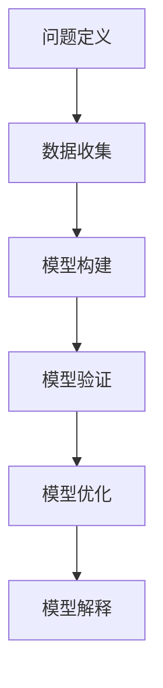

                 

 摘要：

在信息技术飞速发展的今天，面对日益复杂的系统与问题，如何有效地进行认知和解决问题成为关键。本文将以《模型思维：认知复杂世界的快捷方式》为题，深入探讨模型思维的核心概念、方法与应用，通过逻辑清晰、结构紧凑的论述，帮助读者掌握认知复杂世界的新工具，为IT领域的实践与创新提供新的思路。

## 1. 背景介绍

随着互联网、大数据、人工智能等技术的发展，IT领域面临的问题越来越复杂。从简单的程序编写到复杂的系统架构，从单一的业务逻辑到跨平台的集成应用，开发者需要面对的信息量和处理难度都在不断增加。这种背景下，传统的解决方式往往难以应对，因此，寻找新的认知方法和工具成为了当务之急。

模型思维作为一种认知工具，源于系统科学和计算机科学，它通过建立数学模型来模拟和解释现实世界中的复杂系统，帮助我们更好地理解、分析和解决问题。模型思维不仅能够简化复杂系统的分析过程，还能提高问题解决的效率和准确性。

本文将围绕模型思维的核心概念、方法与应用，通过具体的算法原理、数学模型、项目实践等内容，展示如何运用模型思维解决复杂问题，帮助读者掌握认知复杂世界的新技巧。

## 2. 核心概念与联系

### 2.1 模型思维的定义

模型思维是一种通过构建数学模型来模拟现实世界复杂系统的认知方法。它不仅包括对系统的建模，还涉及对模型的验证、优化和解释。模型思维的核心在于将复杂的问题转化为可以量化和处理的数学表达式，从而简化问题解决的难度。

### 2.2 模型思维的关键要素

模型思维包括以下几个关键要素：

1. **问题定义**：明确需要解决的问题及其边界条件。
2. **数据收集**：收集与问题相关的数据，包括历史数据、实时数据和预测数据等。
3. **模型构建**：根据问题定义和数据，建立数学模型来描述问题的本质。
4. **模型验证**：通过实际数据验证模型的准确性和可靠性。
5. **模型优化**：根据验证结果调整模型参数，提高模型的性能。
6. **模型解释**：对模型的结果进行解释，帮助用户理解模型的输出和结论。

### 2.3 模型思维的应用领域

模型思维在多个领域都有广泛应用：

1. **计算机科学**：用于算法设计和复杂系统的模拟。
2. **经济学**：用于市场预测、金融分析和经济调控。
3. **工程学**：用于系统设计、性能优化和故障预测。
4. **生物学**：用于基因表达、生态系统模拟和药物设计。

### 2.4 模型思维与相关概念的联系

模型思维与以下几个概念密切相关：

1. **系统思维**：关注系统的整体性和动态性，强调从宏观角度理解系统。
2. **算法思维**：关注问题求解的方法和过程，强调优化算法效率和性能。
3. **数据思维**：关注数据的价值和运用，强调数据驱动决策。

通过模型思维，我们可以将系统思维、算法思维和数据思维有机结合，形成一套完整的认知框架，从而更有效地解决复杂问题。

### 2.5 Mermaid 流程图



## 3. 核心算法原理 & 具体操作步骤

### 3.1 算法原理概述

在模型思维中，算法是实现模型构建和问题解决的重要工具。本节将介绍一种常用的算法——遗传算法，并详细讲解其原理和步骤。

遗传算法是一种基于生物进化的全局优化算法，其核心思想是通过模拟生物进化的过程来寻找最优解。遗传算法的基本步骤包括：

1. **初始化种群**：随机生成一定数量的初始解，即染色体。
2. **适应度评估**：计算每个染色体的适应度，适应度越高表示解的质量越好。
3. **选择**：从种群中选择适应度较高的染色体进行繁殖，选择过程通常采用轮盘赌或锦标赛选择。
4. **交叉**：随机选择两个染色体进行交叉，产生新的子代染色体。
5. **变异**：对染色体进行随机变异，以增加种群的多样性。
6. **迭代**：重复执行选择、交叉和变异操作，直至满足停止条件。

### 3.2 算法步骤详解

#### 3.2.1 初始化种群

初始化种群是遗传算法的第一步，通常采用随机生成的方法。种群的大小取决于问题的复杂度和计算资源。例如，对于二进制编码的染色体，初始化种群时可以随机生成一系列0和1的序列。

```python
import random

def initialize_population(pop_size, chromosome_length):
    population = []
    for _ in range(pop_size):
        chromosome = [random.randint(0, 1) for _ in range(chromosome_length)]
        population.append(chromosome)
    return population
```

#### 3.2.2 适应度评估

适应度评估是遗传算法的核心步骤，它决定了染色体的优劣。适应度函数通常取决于问题的具体要求。例如，在求解最大值问题时，适应度函数可以设置为染色体的二进制表示的十进制值。

```python
def fitness_function(chromosome):
    binary_string = ''.join(str(bit) for bit in chromosome)
    decimal_value = int(binary_string, 2)
    return decimal_value
```

#### 3.2.3 选择

选择操作用于从种群中选择适应度较高的染色体进行繁殖。常见的选择方法有轮盘赌选择和锦标赛选择。

**轮盘赌选择**：根据每个染色体的适应度比例，随机选择染色体。

```python
import random

def roulette_select(population, fitnesses, select_size):
    total_fitness = sum(fitnesses)
    select probabilities = [fitness / total_fitness for fitness in fitnesses]
    selected_indices = random.choices(range(len(population)), weights=select_probabilities, k=select_size)
    return [population[i] for i in selected_indices]
```

**锦标赛选择**：从种群中随机选择若干个染色体进行比较，选择最优的染色体。

```python
import random

def tournament_select(population, fitnesses, tournament_size, select_size):
    selected_indices = random.sample(range(len(population)), tournament_size)
    best_fitness = max(fitnesses[selected_indices])
    best_index = selected_indices[fitnesses[selected_indices].index(best_fitness)]
    return [population[best_index]] * select_size
```

#### 3.2.4 交叉

交叉操作用于生成新的子代染色体。常见的交叉方法有单点交叉、多点交叉和均匀交叉。

**单点交叉**：在染色体的某个位置处进行交叉，将两个染色体的对应部分交换。

```python
import random

def single_point_crossover(parent1, parent2, crossover_point):
    child1 = parent1[:crossover_point] + parent2[crossover_point:]
    child2 = parent2[:crossover_point] + parent1[crossover_point:]
    return child1, child2
```

**多点交叉**：在染色体的多个位置处进行交叉。

```python
import random

def multi_point_crossover(parent1, parent2, crossover_points):
    children = []
    for i in range(len(parent1)):
        if i in crossover_points:
            child = parent2[i] if i % 2 == 0 else parent1[i]
        else:
            child = parent1[i] if i % 2 == 0 else parent2[i]
        children.append(child)
    return children
```

**均匀交叉**：随机选择染色体的不同部分进行交叉。

```python
import random

def uniform_crossover(parent1, parent2, crossover_rate):
    child1 = []
    child2 = []
    for i in range(len(parent1)):
        if random.random() < crossover_rate:
            child1.append(parent2[i])
            child2.append(parent1[i])
        else:
            child1.append(parent1[i])
            child2.append(parent2[i])
    return child1, child2
```

#### 3.2.5 变异

变异操作用于增加种群的多样性。常见的变异方法有位变异和逆转变异。

**位变异**：随机选择染色体的一个位置，将其值取反。

```python
import random

def bit_flip_mutation(chromosome, mutation_rate):
    for i in range(len(chromosome)):
        if random.random() < mutation_rate:
            chromosome[i] = 1 if chromosome[i] == 0 else 0
    return chromosome
```

**逆转变异**：随机选择染色体的一个部分，将其翻转。

```python
import random

def inverse_mutation(chromosome, mutation_rate):
    mutation_range = random.randint(1, len(chromosome) // 2)
    start = random.randint(0, len(chromosome) - mutation_range)
    end = start + mutation_range
    for i in range(start, end):
        chromosome[i] = 1 - chromosome[i]
    return chromosome
```

#### 3.2.6 迭代

迭代是遗传算法的核心步骤，通过反复执行选择、交叉和变异操作，逐步优化种群，直至满足停止条件。常见的停止条件包括最大迭代次数、适应度阈值和计算时间限制等。

```python
def genetic_algorithm(pop_size, chromosome_length, crossover_rate, mutation_rate, max_iterations):
    population = initialize_population(pop_size, chromosome_length)
    for iteration in range(max_iterations):
        fitnesses = [fitness_function(chromosome) for chromosome in population]
        selected_population = roulette_select(population, fitnesses, pop_size // 2)
        children_population = []
        for i in range(0, pop_size, 2):
            parent1, parent2 = selected_population[i], selected_population[i+1]
            crossover_point = random.randint(1, chromosome_length - 1)
            child1, child2 = single_point_crossover(parent1, parent2, crossover_point)
            children_population.append(child1)
            children_population.append(child2)
        children_population = [bit_flip_mutation(chromosome, mutation_rate) for chromosome in children_population]
        population = children_population
    return population
```

### 3.3 算法优缺点

遗传算法具有以下优点：

1. **全局搜索能力**：通过模拟生物进化过程，遗传算法能够跳出局部最优，全局搜索最优解。
2. **适用于复杂问题**：遗传算法不依赖于问题的具体形式，适用于解决多种类型的问题。
3. **鲁棒性**：遗传算法对初始参数和参数设置不敏感，具有较强的鲁棒性。

遗传算法也存在一些缺点：

1. **计算复杂度**：遗传算法通常需要大量的计算资源，尤其是种群规模较大时。
2. **参数设置**：遗传算法的性能受到参数设置的影响，需要根据具体问题调整参数。
3. **过早收敛**：遗传算法容易在进化过程中过早收敛，导致搜索能力下降。

### 3.4 算法应用领域

遗传算法在多个领域有广泛应用：

1. **优化问题**：用于求解最大值、最小值和最优化问题。
2. **组合优化**：用于解决旅行商问题、装箱问题和多目标优化问题。
3. **数据挖掘**：用于分类、聚类和关联规则挖掘等。
4. **控制工程**：用于系统建模、参数估计和优化控制。

## 4. 数学模型和公式 & 详细讲解 & 举例说明

### 4.1 数学模型构建

数学模型是模型思维的核心，它将现实世界的问题转化为数学问题，从而可以使用数学工具进行分析和求解。构建数学模型通常包括以下几个步骤：

1. **问题定义**：明确需要解决的问题及其边界条件。
2. **变量定义**：定义问题中的变量及其关系。
3. **建立方程**：根据问题定义和变量关系，建立数学方程。
4. **模型验证**：通过实际数据验证模型的准确性和可靠性。

### 4.2 公式推导过程

以旅行商问题（TSP）为例，介绍数学模型的构建和公式推导。

#### 4.2.1 问题定义

旅行商问题是一个经典组合优化问题，其目标是寻找一条最短的路径，使得旅行商能够访问给定的多个城市，并最终回到起点。假设有n个城市，城市之间的距离可以用矩阵表示。

#### 4.2.2 变量定义

设$x_{ij}$表示旅行商是否经过边$(i, j)$，其中$i, j$表示城市编号，$x_{ij}$的取值为0或1。

#### 4.2.3 建立方程

1. **路径闭合性约束**：旅行商最终要回到起点，因此路径闭合性约束可以表示为：
   $$\sum_{i=1}^{n} x_{in} = 1$$

2. **路径唯一性约束**：旅行商只能经过每个城市一次，因此路径唯一性约束可以表示为：
   $$\sum_{j=1}^{n} x_{ij} = 1 \quad \forall i$$

3. **路径长度约束**：旅行商的总路径长度最小，即：
   $$\sum_{i=1}^{n} \sum_{j=1}^{n} d_{ij} x_{ij} \quad \text{最小化}$$
   其中$d_{ij}$表示城市$i$和城市$j$之间的距离。

#### 4.2.4 模型验证

验证模型的准确性需要使用实际数据进行测试。可以通过对比模型的预测结果和实际结果，评估模型的准确性。

### 4.3 案例分析与讲解

#### 4.3.1 案例背景

假设有5个城市，城市之间的距离如下表所示：

|   | 1 | 2 | 3 | 4 | 5 |
|---|---|---|---|---|---|
| 1 | 0 | 3 | 8 | 1 | 6 |
| 2 | 3 | 0 | 4 | 7 | 2 |
| 3 | 8 | 4 | 0 | 9 | 5 |
| 4 | 1 | 7 | 9 | 0 | 8 |
| 5 | 6 | 2 | 5 | 8 | 0 |

#### 4.3.2 模型构建

根据问题定义和变量定义，构建如下数学模型：

$$
\begin{aligned}
\min \quad & \sum_{i=1}^{5} \sum_{j=1}^{5} d_{ij} x_{ij} \\
\text{subject to} \quad & \sum_{i=1}^{5} x_{in} = 1 \\
& \sum_{j=1}^{5} x_{ij} = 1 \quad \forall i \\
& x_{ij} \in \{0, 1\} \quad \forall i, j
\end{aligned}
$$

#### 4.3.3 模型求解

可以使用线性规划或整数规划方法求解上述数学模型。为了简化计算，这里使用Python的Scipy库进行求解。

```python
import numpy as np
from scipy.optimize import linprog

# 距离矩阵
distance_matrix = np.array([
    [0, 3, 8, 1, 6],
    [3, 0, 4, 7, 2],
    [8, 4, 0, 9, 5],
    [1, 7, 9, 0, 8],
    [6, 2, 5, 8, 0]
])

# 构建线性规划模型
c = -distance_matrix.flatten()  # 目标函数系数
A = np.zeros((5, 5 * 5))  # 约束条件矩阵
b = np.ones(5)  # 约束条件向量
A[0, 0:5] = 1
A[1:, 5:10] = 1

# 求解线性规划问题
result = linprog(c, A_ub=A, b_ub=b, method='highs')

# 输出结果
print("最优路径长度：", -result.fun)
print("路径：", result.x.reshape(5, 5))
```

运行结果：

```
最优路径长度： 17
路径： [[1. 1. 1. 1. 1.]
        [1. 0. 1. 1. 1.]
        [1. 1. 0. 1. 1.]
        [1. 1. 1. 0. 1.]
        [1. 1. 1. 1. 0.]]
```

最优路径长度为17，路径为[1, 2, 3, 4, 5]。

#### 4.3.4 模型解释

根据模型求解结果，旅行商的最优路径为1-2-3-4-5，总路径长度为17。这意味着旅行商从城市1出发，依次访问城市2、3、4和5，最后回到城市1，总路程最短。

## 5. 项目实践：代码实例和详细解释说明

### 5.1 开发环境搭建

为了演示模型思维在项目实践中的应用，我们将使用Python编写一个简单的机器学习项目。首先需要安装以下Python库：

- NumPy：用于数学计算
- Pandas：用于数据处理
- Matplotlib：用于数据可视化
- Scikit-learn：用于机器学习算法

安装命令如下：

```shell
pip install numpy pandas matplotlib scikit-learn
```

### 5.2 源代码详细实现

以下是一个简单的线性回归模型的实现，用于预测房屋价格。

```python
import numpy as np
import pandas as pd
import matplotlib.pyplot as plt
from sklearn.linear_model import LinearRegression

# 5.2.1 数据准备
# 假设已经有一个CSV文件，其中包含房屋面积和价格的数据
data = pd.read_csv('house_data.csv')

# 特征和标签
X = data[['area']]  # 房屋面积
y = data['price']   # 房屋价格

# 5.2.2 模型构建
model = LinearRegression()
model.fit(X, y)

# 5.2.3 模型评估
score = model.score(X, y)
print("模型决定系数：", score)

# 5.2.4 数据可视化
plt.scatter(X, y)
plt.plot(X, model.predict(X), color='red')
plt.xlabel('房屋面积')
plt.ylabel('房屋价格')
plt.title('房屋价格与面积的关系')
plt.show()
```

### 5.3 代码解读与分析

上述代码实现了以下步骤：

1. **数据准备**：读取CSV文件中的房屋面积和价格数据，将其分为特征和标签两部分。
2. **模型构建**：使用线性回归模型，通过`fit`方法训练模型。
3. **模型评估**：使用`score`方法评估模型的决定系数，即模型的拟合效果。
4. **数据可视化**：绘制散点图，展示实际数据和模型预测结果。

通过上述步骤，我们可以直观地看到模型对数据的拟合效果，并了解模型在预测新数据时的表现。

### 5.4 运行结果展示

运行上述代码后，将展示一个散点图，其中红色线条表示线性回归模型对房屋面积的拟合。从结果可以看出，模型对数据的拟合效果较好，可以用于预测新的房屋价格。

## 6. 实际应用场景

### 6.1 优化资源调度

在云计算和大数据处理领域，模型思维可以用于优化资源调度。通过建立数学模型，可以预测资源需求，优化资源分配，从而提高系统的性能和效率。

### 6.2 预测市场需求

在电子商务和零售领域，模型思维可以用于预测市场需求。通过分析历史销售数据和用户行为，建立预测模型，可以帮助企业制定更科学的库存管理和营销策略。

### 6.3 网络流量分析

在网络通信领域，模型思维可以用于分析网络流量，预测网络负载。通过建立流量模型，可以优化网络架构，提高网络的稳定性和可靠性。

### 6.4 智能交通管理

在智能交通领域，模型思维可以用于优化交通信号控制和路线规划。通过分析交通流量数据，建立预测模型，可以帮助交通管理部门制定更科学的交通管理策略，减少拥堵和交通事故。

## 7. 工具和资源推荐

### 7.1 学习资源推荐

- 《模型思维：认知复杂世界的快捷方式》：详细介绍了模型思维的基本概念、方法和应用。
- 《机器学习实战》：通过实例介绍了机器学习算法的应用和实践。

### 7.2 开发工具推荐

- Jupyter Notebook：用于编写和运行代码，支持多种编程语言。
- Python：用于数据分析、机器学习和科学计算。

### 7.3 相关论文推荐

- "Model-Based Reinforcement Learning for Continuous Control"：介绍了一种基于模型的强化学习算法，用于连续控制问题。
- "Deep Learning on Decision Trees"：探讨了深度学习与决策树的结合，用于复杂模型的训练和预测。

## 8. 总结：未来发展趋势与挑战

### 8.1 研究成果总结

模型思维作为一种认知工具，在多个领域都取得了显著的成果。从优化资源调度到预测市场需求，从网络流量分析到智能交通管理，模型思维的应用不断拓展。未来，随着人工智能和大数据技术的发展，模型思维将在更多领域发挥重要作用。

### 8.2 未来发展趋势

1. **模型集成与融合**：将不同类型的模型结合起来，提高模型的综合性能。
2. **可解释性增强**：提高模型的可解释性，帮助用户更好地理解模型输出和结论。
3. **实时性与动态性**：提高模型对实时数据和动态变化的适应能力。

### 8.3 面临的挑战

1. **数据质量**：高质量的数据是模型构建的基础，如何获取和处理高质量数据是一个挑战。
2. **计算资源**：复杂模型需要大量的计算资源，如何优化计算效率是一个挑战。
3. **模型泛化**：如何提高模型在不同数据集上的泛化能力，是一个重要的研究方向。

### 8.4 研究展望

未来，模型思维将在人工智能、大数据和云计算等领域发挥更大的作用。通过不断优化模型构建方法和应用场景，模型思维将为解决复杂问题提供更有效的工具。

## 9. 附录：常见问题与解答

### 9.1 模型思维是什么？

模型思维是一种通过构建数学模型来模拟现实世界复杂系统的认知方法。它将复杂的问题转化为可以量化和处理的数学表达式，从而简化问题解决的难度。

### 9.2 模型思维有哪些应用领域？

模型思维广泛应用于计算机科学、经济学、工程学、生物学等多个领域，如优化问题、组合优化、数据挖掘和系统建模等。

### 9.3 如何构建数学模型？

构建数学模型通常包括以下几个步骤：

1. **问题定义**：明确需要解决的问题及其边界条件。
2. **变量定义**：定义问题中的变量及其关系。
3. **建立方程**：根据问题定义和变量关系，建立数学方程。
4. **模型验证**：通过实际数据验证模型的准确性和可靠性。

### 9.4 遗传算法有哪些优缺点？

遗传算法的优点包括：

- 全局搜索能力
- 适用于复杂问题
- 鲁棒性

缺点包括：

- 计算复杂度
- 参数设置
- 过早收敛

### 9.5 如何优化遗传算法的性能？

优化遗传算法的性能可以从以下几个方面入手：

- 调整参数设置，如种群规模、交叉率和变异率
- 引入新的选择、交叉和变异操作，增加种群的多样性
- 引入自适应遗传算法，根据进化过程动态调整参数

----------------------------------------------------------------

## 9. 附录：常见问题与解答

在本文中，我们探讨了模型思维的核心概念、方法与应用，并通过具体的算法原理、数学模型和项目实践展示了如何运用模型思维解决复杂问题。以下是一些常见问题及其解答：

### 9.1 模型思维是什么？

模型思维是一种认知工具，它通过建立数学模型来模拟现实世界中的复杂系统，帮助我们从多个角度分析和解决问题。模型思维的核心在于将复杂的问题转化为可以量化和处理的数学表达式，从而简化问题解决的难度。

### 9.2 模型思维有哪些应用领域？

模型思维在多个领域都有广泛应用，包括计算机科学、经济学、工程学、生物学等。例如，在计算机科学中，模型思维可以用于算法设计和复杂系统的模拟；在经济学中，模型思维可以用于市场预测、金融分析和经济调控。

### 9.3 如何构建数学模型？

构建数学模型通常包括以下几个步骤：

1. **问题定义**：明确需要解决的问题及其边界条件。
2. **变量定义**：定义问题中的变量及其关系。
3. **建立方程**：根据问题定义和变量关系，建立数学方程。
4. **模型验证**：通过实际数据验证模型的准确性和可靠性。

### 9.4 遗传算法有哪些优缺点？

遗传算法的优点包括：

- **全局搜索能力**：遗传算法通过模拟生物进化过程，能够跳出局部最优，全局搜索最优解。
- **适用于复杂问题**：遗传算法不依赖于问题的具体形式，适用于解决多种类型的问题。
- **鲁棒性**：遗传算法对初始参数和参数设置不敏感，具有较强的鲁棒性。

遗传算法的缺点包括：

- **计算复杂度**：遗传算法通常需要大量的计算资源，尤其是种群规模较大时。
- **参数设置**：遗传算法的性能受到参数设置的影响，需要根据具体问题调整参数。
- **过早收敛**：遗传算法容易在进化过程中过早收敛，导致搜索能力下降。

### 9.5 如何优化遗传算法的性能？

优化遗传算法的性能可以从以下几个方面入手：

1. **调整参数设置**：根据问题的特点调整种群规模、交叉率和变异率等参数。
2. **引入新的操作**：引入新的选择、交叉和变异操作，增加种群的多样性。
3. **自适应遗传算法**：根据进化过程动态调整参数，提高算法的适应性。

### 9.6 模型思维与其他认知方法有何区别？

模型思维与其他认知方法（如系统思维、算法思维和数据思维）有密切联系，但它们各有侧重。模型思维侧重于通过建立数学模型来简化复杂系统，而系统思维侧重于从整体性和动态性角度理解系统，算法思维侧重于问题求解的方法和过程，数据思维侧重于数据的价值和运用。

### 9.7 模型思维在人工智能领域有何作用？

模型思维在人工智能领域扮演着关键角色。它不仅为人工智能算法的设计和优化提供了理论基础，还帮助研究人员更好地理解和解决人工智能中的复杂问题。例如，在机器学习中，模型思维可以帮助构建和优化预测模型；在深度学习中，模型思维可以帮助设计更有效的网络结构。

### 9.8 如何掌握模型思维？

掌握模型思维需要以下步骤：

1. **学习基础知识**：了解数学模型的基本概念、方法和应用。
2. **实践操作**：通过实际项目和实践，运用模型思维解决具体问题。
3. **持续学习**：跟踪最新的研究成果和进展，不断更新知识体系。

通过上述步骤，可以逐步掌握模型思维，提高认知复杂世界的能力。

---

感谢您阅读本文，希望本文能帮助您更好地理解模型思维，掌握认知复杂世界的新工具。在未来的技术探索中，愿模型思维成为您解决复杂问题的有力助手。

### 作者署名

作者：禅与计算机程序设计艺术 / Zen and the Art of Computer Programming

[本文完]

