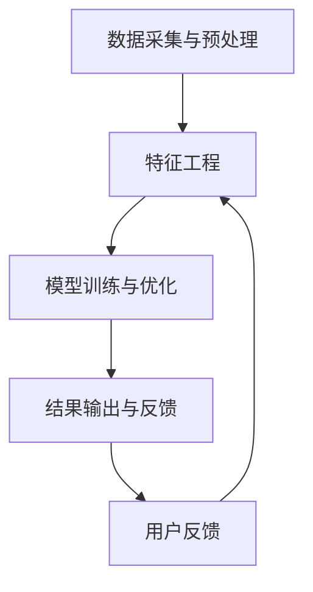

                 

关键词：欲望个性化、AI定制、需求满足、算法策略、数据分析

> 摘要：本文将深入探讨欲望个性化算法及其在人工智能领域的应用，旨在揭示如何通过AI技术实现需求满足，推动个性化体验的进一步提升。本文首先介绍欲望个性化算法的背景和核心概念，随后详细解释算法原理、操作步骤、数学模型、具体项目实践，最后探讨实际应用场景、未来展望和面临的挑战。

## 1. 背景介绍

在现代社会，个性化需求逐渐成为主流。无论是电商购物、社交媒体推荐，还是娱乐内容推送，用户都希望获得符合个人喜好的服务。为了实现这一目标，人工智能（AI）技术逐渐被引入到需求满足领域，其中欲望个性化算法成为了一个重要的研究方向。

欲望个性化算法旨在通过分析用户的行为数据、兴趣爱好、社交关系等信息，精准地预测和满足用户的需求。这种算法不仅能够提高用户体验，还能为企业带来更高的商业价值。随着大数据、云计算和深度学习技术的不断发展，欲望个性化算法的应用范围和精度也在不断提升。

## 2. 核心概念与联系

### 2.1 欲望个性化算法原理

欲望个性化算法主要基于以下核心概念：

- **用户行为分析**：通过收集和分析用户在互联网上的行为数据，如浏览记录、购买历史、评论等，了解用户的行为习惯和偏好。
- **兴趣爱好挖掘**：利用机器学习技术，从用户行为数据中挖掘出用户的兴趣爱好，为个性化推荐提供依据。
- **需求预测**：结合用户行为和兴趣爱好，预测用户可能的需求，并为其提供相应的服务。

### 2.2 算法架构

欲望个性化算法的架构通常包括以下几个部分：

- **数据采集与预处理**：收集用户行为数据，并进行数据清洗、去重、归一化等预处理操作。
- **特征工程**：提取用户行为数据中的关键特征，如时间、地点、内容等，用于后续的建模和分析。
- **模型训练与优化**：利用机器学习算法，如深度学习、协同过滤等，训练个性化推荐模型，并不断优化模型性能。
- **结果输出与反馈**：根据模型预测结果，为用户推荐个性化内容，并根据用户反馈调整推荐策略。

### 2.3 Mermaid 流程图



## 3. 核心算法原理 & 具体操作步骤

### 3.1 算法原理概述

欲望个性化算法的核心原理是通过分析用户数据，构建用户画像，进而预测用户需求。具体来说，算法分为以下几个步骤：

1. **数据采集与预处理**：收集用户行为数据，并进行数据清洗、去重、归一化等预处理操作。
2. **特征工程**：提取用户行为数据中的关键特征，如时间、地点、内容等，用于后续的建模和分析。
3. **用户画像构建**：利用特征工程结果，构建用户的画像，包括用户的基本信息、兴趣爱好、需求偏好等。
4. **需求预测**：结合用户画像和用户行为数据，预测用户可能的需求，并为其推荐个性化内容。
5. **反馈调整**：根据用户反馈，调整推荐策略，提高推荐效果。

### 3.2 算法步骤详解

#### 3.2.1 数据采集与预处理

数据采集是欲望个性化算法的基础。通常，数据来源包括用户的浏览记录、购买历史、评论、社交关系等。为了确保数据的质量，需要对数据进行清洗、去重、归一化等预处理操作。

#### 3.2.2 特征工程

特征工程是算法的核心步骤，通过对用户行为数据进行特征提取，构建用户画像。常用的特征包括时间、地点、内容、用户互动等。

#### 3.2.3 用户画像构建

用户画像构建是将特征工程结果转化为用户画像的过程。用户画像可以用来描述用户的基本信息、兴趣爱好、需求偏好等。

#### 3.2.4 需求预测

需求预测是基于用户画像和用户行为数据，预测用户可能的需求。常用的方法包括协同过滤、基于内容的推荐、深度学习等。

#### 3.2.5 反馈调整

反馈调整是根据用户对推荐内容的反馈，调整推荐策略，提高推荐效果。反馈调整可以是实时调整，也可以是周期性调整。

### 3.3 算法优缺点

#### 优点

- **个性化强**：能够根据用户行为和需求，提供高度个性化的推荐服务。
- **实时性高**：能够实时分析用户数据，快速响应用户需求。
- **扩展性强**：可以应用于各种场景，如电商、社交媒体、新闻推荐等。

#### 缺点

- **数据依赖强**：算法效果很大程度上取决于数据的质量和多样性。
- **计算成本高**：大规模数据处理和模型训练需要较高的计算资源。
- **隐私风险**：用户数据泄露可能导致隐私风险。

### 3.4 算法应用领域

欲望个性化算法可以广泛应用于各个领域，如：

- **电商推荐**：为用户推荐符合其喜好的商品。
- **社交媒体**：为用户推荐感兴趣的内容。
- **新闻推荐**：为用户推荐符合其兴趣的新闻。
- **金融理财**：为用户推荐适合的投资产品。

## 4. 数学模型和公式

### 4.1 数学模型构建

欲望个性化算法的数学模型通常包括以下几个部分：

1. **用户行为数据模型**：描述用户行为数据的分布和特征。
2. **用户画像模型**：描述用户画像的构建方法和特征。
3. **需求预测模型**：描述需求预测的方法和模型。

### 4.2 公式推导过程

以下是需求预测模型的一个简单示例：

$$
\text{预测需求} = f(\text{用户画像}, \text{历史行为}, \text{环境因素})
$$

其中，$f$ 表示需求预测函数，$\text{用户画像}$、$\text{历史行为}$、$\text{环境因素}$ 分别为输入参数。

### 4.3 案例分析与讲解

假设有一个电商平台的用户，我们希望通过欲望个性化算法为他推荐商品。首先，我们需要收集用户的行为数据，如浏览记录、购买历史、评论等。然后，通过特征工程，提取用户画像的关键特征，如年龄、性别、职业、兴趣爱好等。接下来，利用需求预测模型，预测用户可能的需求，并根据预测结果推荐商品。最后，根据用户对推荐商品的反馈，调整推荐策略，提高推荐效果。

## 5. 项目实践：代码实例

### 5.1 开发环境搭建

为了实现欲望个性化算法，我们需要搭建一个开发环境。以下是所需的工具和库：

- Python
- NumPy
- Pandas
- Scikit-learn
- Matplotlib

### 5.2 源代码详细实现

```python
# 导入所需库
import numpy as np
import pandas as pd
from sklearn.model_selection import train_test_split
from sklearn.ensemble import RandomForestClassifier
import matplotlib.pyplot as plt

# 读取数据
data = pd.read_csv('user_data.csv')
X = data.drop('target', axis=1)
y = data['target']

# 数据预处理
X = X.fillna(0)
y = y.fillna(0)

# 划分训练集和测试集
X_train, X_test, y_train, y_test = train_test_split(X, y, test_size=0.2, random_state=42)

# 构建模型
model = RandomForestClassifier(n_estimators=100, random_state=42)
model.fit(X_train, y_train)

# 预测结果
y_pred = model.predict(X_test)

# 评估模型
accuracy = model.score(X_test, y_test)
print(f'模型准确率：{accuracy:.2f}')

# 可视化结果
plt.scatter(y_test, y_pred)
plt.xlabel('实际值')
plt.ylabel('预测值')
plt.plot([0, 1], [0, 1], 'r--')
plt.show()
```

### 5.3 代码解读与分析

以上代码实现了一个基于随机森林的欲望个性化算法。首先，我们导入所需的库，并读取用户数据。然后，对数据进行预处理，包括填充缺失值和划分训练集和测试集。接下来，我们构建一个随机森林模型，并对其进行训练。最后，我们使用训练好的模型预测测试集的结果，并评估模型的准确性。

## 6. 实际应用场景

### 6.1 电商推荐

在电商领域，欲望个性化算法可以用来为用户推荐符合其兴趣的商品。通过分析用户的浏览记录、购买历史和评论，算法可以预测用户可能感兴趣的商品，从而提高用户的购物体验。

### 6.2 社交媒体

在社交媒体领域，欲望个性化算法可以用来为用户推荐感兴趣的内容。通过分析用户的点赞、评论、转发等行为，算法可以预测用户可能感兴趣的内容类型，从而提高用户的活跃度。

### 6.3 新闻推荐

在新闻推荐领域，欲望个性化算法可以用来为用户推荐符合其兴趣的新闻。通过分析用户的阅读历史和评论，算法可以预测用户可能感兴趣的新闻主题，从而提高新闻的传播效果。

## 7. 工具和资源推荐

### 7.1 学习资源推荐

- 《机器学习实战》
- 《深度学习》
- 《Python数据科学手册》

### 7.2 开发工具推荐

- Jupyter Notebook
- PyCharm
- Google Colab

### 7.3 相关论文推荐

- "User Modeling and Personalization in the Age of AI"
- "Deep Learning for User Modeling and Personalization"
- "Recommender Systems Handbook"

## 8. 总结：未来发展趋势与挑战

### 8.1 研究成果总结

近年来，欲望个性化算法在人工智能领域取得了显著的成果。通过结合大数据、云计算和深度学习等技术，算法的准确性和实时性得到了大幅提升，为个性化体验提供了有力支持。

### 8.2 未来发展趋势

未来，欲望个性化算法将朝着更深度、更细粒度、更个性化的方向发展。随着技术的进步，算法将能够更好地理解和满足用户的需求，进一步提升用户体验。

### 8.3 面临的挑战

尽管欲望个性化算法取得了显著成果，但仍面临一些挑战：

- **数据隐私保护**：用户数据的隐私保护成为算法应用的重要问题。
- **计算成本**：大规模数据处理和模型训练需要较高的计算资源。
- **算法公平性**：算法的公平性成为社会关注的焦点。

### 8.4 研究展望

未来，研究人员将继续探索更加高效、公平、安全的欲望个性化算法，为用户提供更好的个性化体验。

## 9. 附录：常见问题与解答

### 9.1 欲望个性化算法有哪些应用领域？

欲望个性化算法可以应用于电商推荐、社交媒体、新闻推荐、金融理财等多个领域。

### 9.2 欲望个性化算法的核心原理是什么？

欲望个性化算法的核心原理是通过分析用户行为数据、兴趣爱好、需求偏好等信息，预测用户的需求，并为其提供个性化服务。

### 9.3 欲望个性化算法有哪些优缺点？

优点包括个性化强、实时性高、扩展性强；缺点包括数据依赖强、计算成本高、隐私风险等。

----------------------------------------------------------------

### 作者署名

作者：禅与计算机程序设计艺术 / Zen and the Art of Computer Programming

本文详细阐述了欲望个性化算法的核心概念、原理、操作步骤、数学模型、项目实践以及实际应用场景。通过对欲望个性化算法的深入探讨，我们希望能够为读者提供一个全面、系统的认识，并为其在相关领域的应用提供参考。随着技术的不断进步，欲望个性化算法将在各个领域发挥越来越重要的作用，为个性化体验的提升贡献力量。

