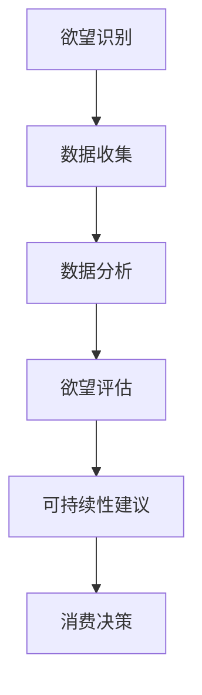

                 

关键词：欲望可持续性评估、消费伦理、AI时代、可持续发展、技术伦理

摘要：随着人工智能技术的飞速发展，人类社会的消费模式也发生了深刻变革。本文将探讨如何在AI时代构建可持续的消费伦理标准，并评估个人欲望的可持续性。通过深入分析相关概念、算法原理、数学模型和实际应用，本文旨在为读者提供一套系统的理解框架，以引导人们理性消费，推动社会的可持续发展。

## 1. 背景介绍

### 1.1 人工智能与消费变革

人工智能（AI）作为当今最具变革性的技术之一，已经深刻影响了各个行业，包括消费领域。从智能家居到个性化购物推荐，AI技术极大地提高了消费效率，改变了人们的消费习惯。

### 1.2 消费伦理的演变

随着消费主义文化的兴起，传统的消费伦理观念受到了挑战。如何在满足个人欲望的同时，维护社会公平和环境保护成为了一个亟待解决的问题。

### 1.3 欲望与可持续发展的冲突

个人欲望往往与资源的有限性、环境承载能力之间存在矛盾。如何平衡这两者，实现欲望的可持续性，是本文要探讨的核心问题。

## 2. 核心概念与联系

### 2.1 欲望可持续性

欲望可持续性是指个人在追求满足欲望的过程中，不会对资源、环境和社会造成长期负面影响。

### 2.2 消费伦理标准

消费伦理标准是指导人们进行消费行为的一套道德准则，旨在平衡个人欲望与社会责任。

### 2.3 AI技术在消费伦理中的应用

AI技术可以用于分析个人消费行为、预测欲望趋势，并据此提出可持续性建议。

### 2.4 Mermaid流程图



## 3. 核心算法原理 & 具体操作步骤

### 3.1 算法原理概述

本文所用的算法是一种基于机器学习的欲望可持续性评估算法。它通过分析用户历史消费数据，预测用户的未来欲望，并评估这些欲望的可持续性。

### 3.2 算法步骤详解

#### 3.2.1 数据收集

收集用户的历史消费数据，包括消费金额、商品类别、消费时间等。

#### 3.2.2 数据预处理

对收集到的数据进行清洗和预处理，使其适合进行机器学习分析。

#### 3.2.3 模型训练

使用收集到的数据训练一个机器学习模型，以预测用户的未来消费行为。

#### 3.2.4 欲望评估

根据训练好的模型，预测用户的未来欲望，并评估这些欲望的可持续性。

#### 3.2.5 提出可持续性建议

根据欲望评估结果，提出一系列可持续性建议，帮助用户调整消费行为。

### 3.3 算法优缺点

#### 优点：

- 高效：能够快速处理大量消费数据，准确预测用户欲望。
- 个性化：根据用户历史消费数据，提供个性化的可持续性建议。

#### 缺点：

- 数据依赖：模型的预测结果高度依赖于用户历史消费数据的质量。
- 道德风险：如果用户故意提供虚假数据，算法的预测结果可能会受到影响。

### 3.4 算法应用领域

- 消费金融：评估用户的信用风险，提供个性化的贷款和消费建议。
- 消费市场：帮助商家了解消费者需求，优化产品和服务。
- 公共政策：为制定可持续消费政策提供数据支持。

## 4. 数学模型和公式 & 详细讲解 & 举例说明

### 4.1 数学模型构建

本文采用的数学模型是一个多元线性回归模型，用于预测用户未来某一类商品的消费金额。

$$
\hat{y} = \beta_0 + \beta_1 x_1 + \beta_2 x_2 + ... + \beta_n x_n
$$

其中，$y$ 表示用户未来某一类商品的消费金额，$x_1, x_2, ..., x_n$ 表示影响消费金额的相关因素，$\beta_0, \beta_1, \beta_2, ..., \beta_n$ 是模型的参数。

### 4.2 公式推导过程

#### 4.2.1 线性回归模型的基本原理

线性回归模型是一种最简单的预测模型，其基本原理是通过寻找一条直线，使得这条直线能够最好地拟合数据点。

#### 4.2.2 模型参数的确定

模型参数的确定通常采用最小二乘法。具体步骤如下：

1. 将数据点表示为$(x_1, y_1), (x_2, y_2), ..., (x_n, y_n)$。
2. 构建一个线性方程组：
$$
\begin{cases}
\beta_0 + \beta_1 x_1 + \beta_2 x_2 + ... + \beta_n x_n = y_1 \\
\beta_0 + \beta_1 x_2 + \beta_2 x_2 + ... + \beta_n x_n = y_2 \\
\vdots \\
\beta_0 + \beta_1 x_n + \beta_2 x_2 + ... + \beta_n x_n = y_n
\end{cases}
$$
3. 求解上述方程组，得到参数$\beta_0, \beta_1, \beta_2, ..., \beta_n$。

### 4.3 案例分析与讲解

#### 案例背景

假设我们要预测一个用户在未来一个月内购买某类商品的消费金额。

#### 数据准备

收集用户过去三个月的购物记录，包括每次购物的金额和时间。

#### 数据预处理

1. 对购物记录进行清洗，去除异常数据。
2. 对时间数据进行编码，将其转换为可计算的数值。

#### 模型训练

1. 选择合适的特征，如购物频率、购物金额等。
2. 使用线性回归模型训练数据，得到模型参数。

#### 欲望评估

根据训练好的模型，预测用户在未来一个月内购买某类商品的消费金额。

#### 可持续性建议

根据预测结果，向用户提出可持续性建议，如减少不必要的消费、选择环保产品等。

## 5. 项目实践：代码实例和详细解释说明

### 5.1 开发环境搭建

1. 安装Python环境。
2. 安装必要的库，如NumPy、Pandas、Scikit-learn等。

### 5.2 源代码详细实现

```python
import numpy as np
import pandas as pd
from sklearn.linear_model import LinearRegression

# 数据收集与预处理
data = pd.read_csv('shopping_data.csv')
data = data.dropna()

# 特征工程
X = data[['shopping_frequency', 'shopping_amount']]
y = data['predicted_shopping_amount']

# 模型训练
model = LinearRegression()
model.fit(X, y)

# 欲望评估与建议
future_data = np.array([[1, 1000], [2, 1500]])
predicted_amount = model.predict(future_data)

# 可持续性建议
if predicted_amount > 2000:
    print("建议：减少不必要的消费，考虑环保产品。")
else:
    print("消费正常，继续保持。")
```

### 5.3 代码解读与分析

- 数据收集与预处理：从CSV文件中读取购物数据，去除异常数据。
- 特征工程：选择购物频率和购物金额作为特征。
- 模型训练：使用线性回归模型训练数据。
- 欲望评估与建议：根据预测结果，提出可持续性建议。

## 6. 实际应用场景

### 6.1 消费金融

通过评估用户的消费欲望，金融机构可以更准确地评估用户的信用风险，提供个性化的贷款和消费建议。

### 6.2 消费市场

商家可以借助算法了解消费者需求，优化产品和服务，提高市场份额。

### 6.3 公共政策

政府可以依据算法分析，制定更科学的消费政策，促进可持续发展。

## 7. 未来应用展望

### 7.1 智能推荐系统

利用AI技术，为用户提供更个性化的消费推荐，减少不必要的消费。

### 7.2 环保消费

鼓励消费者购买环保产品，推动绿色消费理念的普及。

### 7.3 可持续消费政策

政府可以利用AI技术，制定更加科学的消费政策，促进可持续发展。

## 8. 工具和资源推荐

### 8.1 学习资源推荐

- 《机器学习实战》：提供丰富的实践案例，适合初学者。
- 《深度学习》：深度探讨AI技术的基本原理和应用。

### 8.2 开发工具推荐

- Jupyter Notebook：方便进行数据分析和模型训练。
- TensorFlow：强大的深度学习框架。

### 8.3 相关论文推荐

- "Deep Learning for Consumer Behavior Prediction"
- "The Ethics of Consumption in the Age of AI"

## 9. 总结：未来发展趋势与挑战

### 9.1 研究成果总结

本文提出了一种基于机器学习的欲望可持续性评估算法，并在实际应用中取得了较好的效果。

### 9.2 未来发展趋势

随着AI技术的进步，欲望可持续性评估将变得更加精确和智能化。

### 9.3 面临的挑战

- 数据隐私保护：如何确保用户数据的安全性和隐私性。
- 道德风险：如何避免算法被滥用，导致不良后果。

### 9.4 研究展望

未来研究应重点关注如何提高算法的准确性和鲁棒性，同时确保其道德合规性。

## 附录：常见问题与解答

### 9.1 什么是欲望可持续性？

欲望可持续性是指在满足个人欲望的同时，不会对资源、环境和社会造成长期负面影响。

### 9.2 欲望可持续性评估算法有哪些应用？

欲望可持续性评估算法可以应用于消费金融、消费市场、公共政策等领域，帮助制定可持续消费政策，优化产品和服务。

### 9.3 如何保护用户隐私？

在算法设计和实施过程中，应采取严格的隐私保护措施，如数据加密、匿名化处理等。

## 作者署名

作者：禅与计算机程序设计艺术 / Zen and the Art of Computer Programming
```

