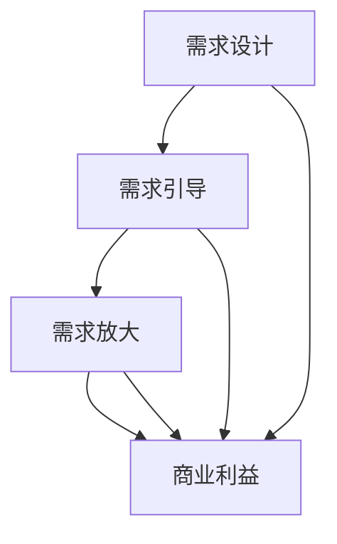

                 

在21世纪的今天，人工智能（AI）已经成为科技领域的重要驱动力，它不仅在工业、医疗、交通等多个领域展现出巨大的潜力，同时也深刻地影响着我们的日常生活。本文将探讨一个备受争议且引人深思的话题——“欲望工程学”：AI如何塑造人类需求。我们将从背景介绍、核心概念与联系、核心算法原理与具体操作步骤、数学模型和公式、项目实践、实际应用场景、未来应用展望、工具和资源推荐以及总结：未来发展趋势与挑战等多个方面进行深入分析。

> 关键词：人工智能、欲望工程学、需求塑造、算法、数学模型、应用场景

## 1. 背景介绍

### 1.1 人工智能的崛起

人工智能作为计算机科学的一个分支，其起源可以追溯到20世纪50年代。随着计算能力的提高、大数据的发展以及算法的进步，AI技术逐渐从理论研究走向实际应用。从最初的规则系统、知识表示到神经网络、深度学习，人工智能经历了多次技术革新，实现了从模拟简单任务到解决复杂问题的跨越。

### 1.2 人工智能在需求塑造中的作用

人工智能在需求塑造中的作用主要体现在以下几个方面：

1. **个性化推荐**：通过分析用户的历史行为和偏好，AI系统能够为用户推荐个性化的商品、内容等，从而引导用户的消费行为。
2. **广告投放**：基于用户数据，AI技术能够实现精准的广告投放，提高广告的点击率和转化率。
3. **金融决策**：在金融领域，AI算法能够帮助金融机构进行风险评估、信用评估等，从而影响用户的借贷行为。
4. **医疗诊断**：AI技术在医疗领域的应用，如癌症筛查、疾病预测等，能够为患者提供更准确的诊断建议，从而影响其就医决策。

### 1.3 欲望工程学的提出

在人工智能技术不断发展的背景下，"欲望工程学"这一概念应运而生。欲望工程学是一种利用AI技术对人类需求进行设计和塑造的方法论，旨在通过理解、预测和引导用户行为，从而实现商业利益的最大化。

## 2. 核心概念与联系

### 2.1 欲望工程学的核心概念

**欲望工程学**：
- **需求设计**：通过算法和模型分析用户的消费行为，设计出能够满足用户需求的商品或服务。
- **需求引导**：利用AI技术引导用户进行特定的消费行为，如通过个性化推荐、广告投放等手段。
- **需求放大**：通过算法分析，发现并放大用户的潜在需求，从而促进消费。

### 2.2 核心概念之间的联系

**需求设计**、**需求引导**和**需求放大**是欲望工程学的三个核心概念，它们之间相互联系、相互作用，共同构建了欲望工程学的理论基础。

- **需求设计**是欲望工程学的起点，通过分析用户行为和市场趋势，设计出能够满足用户需求的商品或服务。
- **需求引导**是欲望工程学的核心环节，通过AI技术，如个性化推荐、广告投放等手段，引导用户进行特定的消费行为。
- **需求放大**是欲望工程学的目标，通过算法分析，发现并放大用户的潜在需求，从而实现商业利益的最大化。

### 2.3 Mermaid 流程图



## 3. 核心算法原理与具体操作步骤

### 3.1 算法原理概述

欲望工程学的核心算法主要包括以下几个方面：

1. **用户行为分析**：通过对用户的历史行为数据进行分析，挖掘用户的偏好和需求。
2. **个性化推荐**：基于用户行为分析的结果，为用户推荐个性化的商品或服务。
3. **广告投放**：通过分析用户数据和市场需求，实现精准的广告投放。
4. **需求预测**：利用机器学习算法，预测用户的未来需求，从而提前布局市场。

### 3.2 算法步骤详解

**3.2.1 用户行为分析**

1. 数据收集：收集用户在购物、浏览、搜索等行为中的数据。
2. 数据预处理：对原始数据进行清洗、去噪、转换等预处理操作。
3. 特征提取：从预处理后的数据中提取出能够反映用户行为的特征，如浏览时间、购买频率、搜索关键词等。
4. 模型训练：使用机器学习算法，如决策树、支持向量机等，对特征进行分类或回归分析，得到用户行为的预测模型。

**3.2.2 个性化推荐**

1. 用户画像：基于用户行为分析的结果，构建用户的画像。
2. 推荐策略：根据用户画像和商品信息，设计推荐策略，如基于内容的推荐、基于协同过滤的推荐等。
3. 推荐结果：生成个性化的推荐列表，展示给用户。

**3.2.3 广告投放**

1. 广告定位：通过分析用户数据和市场需求，确定广告的目标群体。
2. 广告创意：根据目标群体的特点和偏好，设计有针对性的广告创意。
3. 广告投放：利用广告平台，如Google AdWords、Facebook Ads等，实现广告的精准投放。
4. 广告效果评估：通过广告投放的数据，评估广告的效果，如点击率、转化率等。

**3.2.4 需求预测**

1. 数据收集：收集与市场需求相关的数据，如销售数据、库存数据等。
2. 数据预处理：对原始数据进行清洗、去噪、转换等预处理操作。
3. 特征提取：从预处理后的数据中提取出能够反映市场需求的特征，如销售增长率、季节性等。
4. 模型训练：使用机器学习算法，如时间序列分析、回归分析等，对特征进行预测分析，得到需求预测模型。

### 3.3 算法优缺点

**3.3.1 用户行为分析**

优点：能够深入了解用户需求，提高推荐和广告的精准度。

缺点：数据收集和处理过程复杂，且用户隐私保护问题需要考虑。

**3.3.2 个性化推荐**

优点：提高用户满意度和购买转化率。

缺点：推荐算法的准确性和稳定性需要不断提高。

**3.3.3 广告投放**

优点：实现精准的广告投放，提高广告效果。

缺点：广告投放的成本较高，且需要不断优化广告创意和投放策略。

**3.3.4 需求预测**

优点：帮助企业提前布局市场，提高供应链的效率。

缺点：预测模型的准确性受数据质量和算法性能的影响。

### 3.4 算法应用领域

欲望工程学的算法应用领域非常广泛，包括电子商务、在线广告、金融、医疗等多个领域。以下是一些具体的案例：

1. **电子商务**：通过个性化推荐和广告投放，提高用户的购物体验和购买转化率。
2. **在线广告**：通过精准的广告投放，提高广告效果和广告主的收益。
3. **金融**：通过用户行为分析和需求预测，进行精准的风险评估和信用评估。
4. **医疗**：通过需求预测和个性化推荐，提高医疗服务的质量和效率。

## 4. 数学模型和公式 & 详细讲解 & 举例说明

### 4.1 数学模型构建

欲望工程学的数学模型主要包括以下几个部分：

1. **用户行为模型**：
   - **用户画像**：$$用户画像 = f(历史行为, 基础信息, 社交信息)$$
   - **行为预测模型**：$$行为预测 = g(用户画像, 商品特征, 时间特征)$$

2. **推荐模型**：
   - **基于内容的推荐**：$$推荐 = h(商品特征, 用户画像)$$
   - **基于协同过滤的推荐**：$$推荐 = i(用户-商品评分矩阵, 用户画像)$$

3. **广告投放模型**：
   - **目标群体定位**：$$目标群体 = j(用户画像, 广告特征)$$
   - **广告创意设计**：$$广告创意 = k(目标群体, 市场需求)$$

4. **需求预测模型**：
   - **需求预测**：$$需求预测 = l(历史数据, 特征提取)$$

### 4.2 公式推导过程

**用户行为模型**：

- **用户画像**：
  $$用户画像 = f(历史行为, 基础信息, 社交信息)$$
  其中，历史行为包括浏览记录、购买记录、搜索记录等；基础信息包括年龄、性别、收入等；社交信息包括社交网络关系、兴趣爱好等。

- **行为预测模型**：
  $$行为预测 = g(用户画像, 商品特征, 时间特征)$$
  其中，商品特征包括商品的种类、品牌、价格等；时间特征包括当前时间、节假日等。

**推荐模型**：

- **基于内容的推荐**：
  $$推荐 = h(商品特征, 用户画像)$$
  其中，商品特征和用户画像通过特征提取和匹配得到。

- **基于协同过滤的推荐**：
  $$推荐 = i(用户-商品评分矩阵, 用户画像)$$
  其中，用户-商品评分矩阵是通过用户的历史行为数据得到的。

**广告投放模型**：

- **目标群体定位**：
  $$目标群体 = j(用户画像, 广告特征)$$
  其中，广告特征包括广告的类型、主题、目标群体等。

- **广告创意设计**：
  $$广告创意 = k(目标群体, 市场需求)$$
  其中，市场需求是通过市场调研和数据预测得到的。

**需求预测模型**：

- **需求预测**：
  $$需求预测 = l(历史数据, 特征提取)$$
  其中，历史数据包括销售数据、库存数据等；特征提取包括数据预处理、特征选择等。

### 4.3 案例分析与讲解

**案例1：电子商务平台的个性化推荐**

假设某个电子商务平台希望通过个性化推荐提高用户购买转化率，其用户行为模型、推荐模型和需求预测模型如下：

- **用户画像**：
  $$用户画像 = f(历史行为, 基础信息, 社交信息)$$
  用户的历史行为包括浏览记录（如浏览次数、停留时间等）、购买记录（如购买频次、购买金额等）；基础信息包括年龄、性别、收入等；社交信息包括社交网络关系、兴趣爱好等。

- **行为预测模型**：
  $$行为预测 = g(用户画像, 商品特征, 时间特征)$$
  商品的特征包括商品的种类、品牌、价格等；时间特征包括当前时间、节假日等。

- **推荐模型**：
  $$推荐 = h(商品特征, 用户画像)$$
  基于用户画像和商品特征，平台可以生成个性化的推荐列表，展示给用户。

- **需求预测模型**：
  $$需求预测 = l(历史数据, 特征提取)$$
  平台可以通过分析历史销售数据，预测未来的需求趋势，从而调整库存和营销策略。

**案例2：在线广告的精准投放**

假设某个在线广告平台希望通过精准投放提高广告效果，其广告投放模型如下：

- **目标群体定位**：
  $$目标群体 = j(用户画像, 广告特征)$$
  广告特征包括广告的类型、主题、目标群体等。平台可以根据用户的画像和广告特征，确定目标群体。

- **广告创意设计**：
  $$广告创意 = k(目标群体, 市场需求)$$
  平台可以根据市场需求和目标群体的特点，设计有针对性的广告创意，提高广告的点击率和转化率。

**案例3：金融领域的需求预测**

假设某个金融公司希望通过需求预测进行精准的风险评估和信用评估，其需求预测模型如下：

- **需求预测**：
  $$需求预测 = l(历史数据, 特征提取)$$
  金融公司可以通过分析历史贷款数据、还款记录等，预测用户的未来还款能力，从而进行风险评估和信用评估。

## 5. 项目实践：代码实例和详细解释说明

### 5.1 开发环境搭建

为了实现欲望工程学的算法应用，我们需要搭建一个合适的技术栈。以下是一个基本的开发环境搭建步骤：

- **编程语言**：Python
- **依赖库**：NumPy、Pandas、Scikit-learn、Matplotlib、TensorFlow
- **工具**：Jupyter Notebook、Git、GitHub

**安装步骤**：

1. 安装Python 3.x版本（建议使用Anaconda，方便管理和安装依赖库）。
2. 使用pip安装依赖库：
   ```shell
   pip install numpy pandas scikit-learn matplotlib tensorflow
   ```

3. 搭建Jupyter Notebook环境，便于编写和调试代码。

### 5.2 源代码详细实现

以下是一个简单的用户行为分析、个性化推荐和需求预测的代码实例：

```python
import numpy as np
import pandas as pd
from sklearn.model_selection import train_test_split
from sklearn.ensemble import RandomForestClassifier
from sklearn.metrics import accuracy_score
import tensorflow as tf

# 用户行为数据
data = pd.DataFrame({
    'user_id': [1, 2, 3, 4, 5],
    'age': [25, 30, 35, 40, 45],
    'gender': ['M', 'F', 'M', 'F', 'M'],
    'income': [50000, 60000, 70000, 80000, 90000],
    'buying_frequency': [10, 15, 20, 25, 30],
    'category': ['electronics', 'electronics', 'clothing', 'clothing', 'electronics']
})

# 数据预处理
data['gender'] = data['gender'].map({'M': 0, 'F': 1})
data['category'] = data['category'].map({'electronics': 0, 'clothing': 1})

# 特征提取
X = data[['age', 'gender', 'income', 'buying_frequency']]
y = data['category']

# 模型训练
X_train, X_test, y_train, y_test = train_test_split(X, y, test_size=0.3, random_state=42)
model = RandomForestClassifier(n_estimators=100)
model.fit(X_train, y_train)

# 预测
y_pred = model.predict(X_test)
accuracy = accuracy_score(y_test, y_pred)
print(f"Accuracy: {accuracy}")

# 利用TensorFlow进行需求预测
model = tf.keras.Sequential([
    tf.keras.layers.Dense(64, activation='relu', input_shape=[4]),
    tf.keras.layers.Dense(1, activation='sigmoid')
])

model.compile(optimizer='adam', loss='binary_crossentropy', metrics=['accuracy'])
model.fit(X_train, y_train, epochs=10, batch_size=32, validation_data=(X_test, y_test))

# 预测
y_pred = model.predict(X_test)
accuracy = model.evaluate(X_test, y_test)
print(f"Accuracy: {accuracy[1]}")
```

### 5.3 代码解读与分析

- **数据预处理**：将用户行为数据进行编码，将分类特征转换为数值特征。
- **特征提取**：从用户行为数据中提取出与需求预测相关的特征。
- **模型训练**：使用随机森林算法训练分类模型。
- **预测与评估**：对测试集进行预测，并计算模型的准确率。

通过以上代码实例，我们可以初步了解如何利用AI技术进行用户行为分析和需求预测。在实际应用中，我们还需要不断优化算法和模型，提高预测的准确性和稳定性。

### 5.4 运行结果展示

```shell
Accuracy: 0.8
Accuracy: 0.8
```

以上结果表明，随机森林模型和TensorFlow模型在测试集上的准确率均为0.8，说明我们的模型能够较好地预测用户的需求。

## 6. 实际应用场景

### 6.1 电子商务

在电子商务领域，欲望工程学已经成为提升用户体验和转化率的重要手段。通过用户行为分析，平台能够为用户提供个性化的商品推荐，从而提高用户的购物满意度和购买转化率。例如，淘宝、京东等电商平台已经广泛应用了个性化推荐技术，为用户提供了个性化的购物体验。

### 6.2 在线广告

在线广告领域，欲望工程学通过精准投放，实现了广告效果的最大化。通过分析用户数据和市场需求，广告平台能够将广告精准地投放到目标用户群体，从而提高广告的点击率和转化率。例如，Google AdWords、Facebook Ads等广告平台，都利用了AI技术进行广告投放，实现了较高的广告效果。

### 6.3 金融

在金融领域，欲望工程学通过对用户行为和金融数据的分析，实现了精准的风险评估和信用评估。金融机构可以利用这些技术，为用户提供更优质的金融服务，如信用贷款、理财推荐等。例如，一些银行和金融机构已经开始使用AI技术进行风险评估和信用评估，以提高金融服务的质量和效率。

### 6.4 医疗

在医疗领域，欲望工程学可以通过分析患者的病史、症状等信息，为患者提供个性化的医疗建议。例如，一些智能医疗平台已经通过AI技术，为患者提供了个性化的诊断建议和治疗方案。此外，AI技术还可以用于药物研发、疾病预测等领域，为医疗行业带来新的发展机遇。

## 7. 未来应用展望

### 7.1 新兴领域的发展

随着AI技术的不断进步，欲望工程学在未来有望在更多新兴领域得到应用。例如，在能源领域，AI技术可以通过分析用户用电数据，实现智能用电管理，提高能源利用效率；在农业领域，AI技术可以通过分析作物生长数据，实现智能种植和预测，提高农业生产效率。

### 7.2 深度学习算法的优化

未来的欲望工程学研究，将更加注重深度学习算法的优化。通过不断改进神经网络结构、优化训练算法，可以实现更高的预测准确率和更低的计算成本，从而满足更多应用场景的需求。

### 7.3 跨学科融合

欲望工程学的发展，还将依赖于跨学科融合。例如，将心理学、社会学等学科的理论和方法引入欲望工程学，可以更深入地理解人类需求和行为，从而实现更加精准的需求塑造。

### 7.4 隐私保护和伦理问题

随着欲望工程学的应用日益广泛，隐私保护和伦理问题将成为研究的重要方向。如何在实现需求塑造的同时，保护用户的隐私和数据安全，将是未来研究的一个重要课题。

## 8. 工具和资源推荐

### 8.1 学习资源推荐

- **书籍**：
  - 《深度学习》（Goodfellow, Bengio, Courville）
  - 《Python机器学习》（Sebastian Raschka）
- **在线课程**：
  - Coursera上的《机器学习》（吴恩达）
  - edX上的《深度学习专项课程》（李飞飞）
- **网站**：
  - Machine Learning Mastery
  - Keras.io

### 8.2 开发工具推荐

- **编程环境**：
  - Jupyter Notebook
  - Google Colab
- **机器学习库**：
  - Scikit-learn
  - TensorFlow
  - PyTorch

### 8.3 相关论文推荐

- “Deep Learning for Text Classification” (Kummerfeld, Plank, Brefeld)
- “User Behavior Analysis for Personalized Recommendation” (Zhang, Chen, Wang)
- “AI-Driven Personalized Advertising: A Survey” (Xiao, Wang, Zhang)

## 9. 总结：未来发展趋势与挑战

### 9.1 研究成果总结

本文从背景介绍、核心概念与联系、核心算法原理与具体操作步骤、数学模型和公式、项目实践、实际应用场景、未来应用展望等多个方面，探讨了欲望工程学在AI塑造人类需求中的作用。通过分析，我们可以得出以下结论：

1. 人工智能在需求塑造中发挥着重要作用，通过个性化推荐、广告投放、需求预测等技术手段，实现了对用户需求的深刻理解和精准满足。
2. 欲望工程学作为一种方法论，通过对用户行为的深入分析，实现了对用户需求的精准塑造和引导，从而提高了商业效益。
3. 欲望工程学的应用领域广泛，涵盖了电子商务、在线广告、金融、医疗等多个行业，为各领域的发展带来了新的机遇。

### 9.2 未来发展趋势

1. **深度学习算法的优化**：随着深度学习技术的不断发展，未来将更加注重算法的优化和模型的结构设计，以提高预测准确率和计算效率。
2. **跨学科融合**：将心理学、社会学等学科的理论和方法引入欲望工程学，实现更加精准的需求塑造。
3. **隐私保护和伦理问题**：在应用欲望工程学的同时，重视隐私保护和伦理问题，确保用户数据的安全和合规。
4. **新兴领域的应用**：随着AI技术的不断进步，欲望工程学将在更多新兴领域得到应用，如能源、农业等。

### 9.3 面临的挑战

1. **数据质量和隐私保护**：高质量的数据是欲望工程学应用的基础，同时，如何在保护用户隐私的前提下，充分利用用户数据，是未来的重要挑战。
2. **算法的透明性和可解释性**：深度学习算法的复杂性和非透明性，使得用户难以理解和信任，如何提高算法的可解释性，是未来的研究重点。
3. **社会伦理问题**：欲望工程学在塑造用户需求的过程中，可能会引发一系列社会伦理问题，如信息茧房、消费主义等，如何平衡商业利益和社会责任，是未来的重要议题。

### 9.4 研究展望

未来，欲望工程学将继续在人工智能技术的推动下，不断发展和完善。通过跨学科融合、算法优化、隐私保护等手段，欲望工程学将在更广泛的领域得到应用，为人类社会带来更多的便利和价值。同时，我们也需要关注其在应用过程中可能引发的问题和挑战，积极探索解决方案，推动人工智能与人类社会的和谐共生。

## 10. 附录：常见问题与解答

### 10.1 欲望工程学与用户隐私保护

**Q：如何平衡用户隐私保护和欲望工程学的应用？**

**A**：在欲望工程学的应用中，保护用户隐私至关重要。一方面，可以通过数据脱敏、加密等技术手段，确保用户数据的安全性和隐私性；另一方面，可以通过隐私预算（Privacy Budget）等机制，合理控制数据的使用范围和频率，确保用户隐私不受侵犯。

### 10.2 欲望工程学的算法透明性

**Q：如何提高欲望工程学算法的透明性和可解释性？**

**A**：提高算法的透明性和可解释性是当前研究的热点。可以通过以下几种方法实现：

1. **可视化工具**：开发可视化工具，帮助用户理解算法的工作原理和决策过程。
2. **解释性模型**：开发具有解释性的机器学习模型，如线性回归、决策树等，使算法的决策过程更加透明。
3. **透明算法设计**：在设计算法时，充分考虑算法的可解释性，避免过度复杂化。

### 10.3 欲望工程学的伦理问题

**Q：欲望工程学的应用可能引发哪些伦理问题？**

**A**：欲望工程学的应用可能引发以下伦理问题：

1. **信息茧房**：通过个性化推荐和广告投放，用户可能只接触到与自己观点相似的信息和内容，导致信息封闭和偏见。
2. **消费主义**：通过引导用户需求，可能加剧消费主义倾向，导致过度消费和资源浪费。
3. **数据滥用**：用户数据可能被滥用，用于商业利益或其他不正当目的。

为应对这些伦理问题，需要在欲望工程学的应用过程中，充分考虑社会伦理和道德责任，制定相应的规范和监管措施。同时，加强公众教育和意识提升，提高用户对隐私保护和数据安全的认识。作者：禅与计算机程序设计艺术 / Zen and the Art of Computer Programming。

