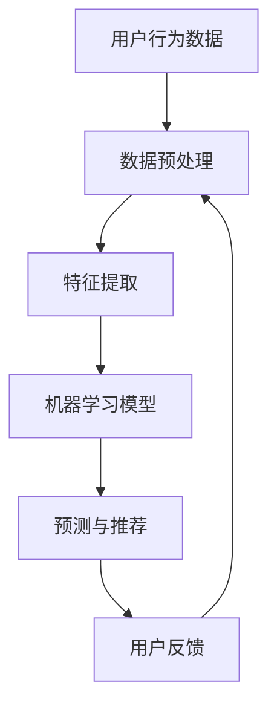

                 

关键词：AI个性化、需求满足、机器学习、深度学习、数据驱动、用户体验、用户行为分析、预测模型、行为模式、个性化推荐、自适应系统、人工智能应用

> 摘要：随着人工智能技术的飞速发展，个性化需求满足成为提升用户体验的关键。本文将从核心概念、算法原理、数学模型、项目实践等多个角度，深入探讨AI在需求满足中的重要作用，为未来的发展方向提供指导。

## 1. 背景介绍

在当今社会，个性化需求满足已经成为商业和技术的热点。无论是电商平台的商品推荐，社交媒体的个性化内容推送，还是在线教育平台的课程定制，用户需求的个性化满足已经深入人心。然而，传统的满足方式往往依赖于预先设定的规则和有限的用户反馈，而无法完全捕捉用户的深层次需求。

人工智能，尤其是机器学习和深度学习，为个性化需求满足带来了革命性的变化。通过学习大量的用户数据，AI算法能够预测用户的潜在需求和偏好，从而提供高度个性化的服务。这种基于数据的驱动方式，不仅提高了用户体验，也大大提升了商业效率。

本文将围绕以下主题展开讨论：

- 核心概念与联系
- 核心算法原理与操作步骤
- 数学模型和公式
- 项目实践：代码实例与详细解释
- 实际应用场景
- 未来应用展望
- 工具和资源推荐
- 总结与展望

通过这篇文章，我们将深入了解AI如何实现个性化需求满足，以及这一领域未来的发展趋势和挑战。

## 2. 核心概念与联系

为了理解AI在个性化需求满足中的应用，首先需要了解一些核心概念，包括机器学习、深度学习、数据驱动、用户体验等。

### 2.1 机器学习

机器学习是一种通过算法从数据中学习模式并做出预测的技术。在个性化需求满足中，机器学习模型能够分析用户的历史行为、偏好和反馈，从而预测未来的需求。常见的机器学习算法包括决策树、随机森林、支持向量机等。

### 2.2 深度学习

深度学习是机器学习的一个子领域，它通过神经网络模拟人脑的决策过程。深度学习模型，如卷积神经网络（CNN）、循环神经网络（RNN）和变换器（Transformer），能够处理大量的复杂数据，并从中提取深层次的规律。

### 2.3 数据驱动

数据驱动是一种以数据为核心的设计理念，它强调通过分析大量数据来指导决策和优化过程。在个性化需求满足中，数据驱动方法能够根据用户行为和偏好调整服务，从而实现更精准的个性化。

### 2.4 用户体验

用户体验是指用户在使用产品或服务时所感受到的整体感受。在个性化需求满足中，用户体验是至关重要的。良好的用户体验能够提升用户满意度，从而增加用户粘性和忠诚度。

### 2.5 用户行为分析

用户行为分析是一种通过收集和分析用户在系统中的行为数据，来了解用户需求和使用习惯的方法。在个性化需求满足中，用户行为分析是关键的一步，它能够为机器学习模型提供重要的输入。

### 2.6 个性化推荐

个性化推荐是一种根据用户的历史行为和偏好，为用户推荐相关内容或商品的方法。个性化推荐广泛应用于电商、社交媒体、在线教育等领域，是提升用户体验的重要手段。

### 2.7 自适应系统

自适应系统是一种能够根据用户行为和环境变化自动调整其行为和功能的系统。在个性化需求满足中，自适应系统能够实时响应用户需求，提供个性化的服务。

### 2.8 Mermaid 流程图

下面是一个简化的Mermaid流程图，展示了个性化需求满足的基本流程：



在上述流程中，用户行为数据经过预处理和特征提取后，输入到机器学习模型中。模型输出预测结果，生成个性化的推荐。用户对推荐内容进行反馈，从而进一步优化模型。

## 3. 核心算法原理与操作步骤

### 3.1 算法原理概述

在个性化需求满足中，常用的核心算法包括协同过滤、基于内容的推荐和深度学习推荐。以下将对这三种算法的原理进行概述。

### 3.1.1 协同过滤

协同过滤是一种基于用户行为数据的推荐方法，它通过分析用户之间的相似性来推荐商品或内容。协同过滤分为两种：基于用户的协同过滤（User-Based）和基于项目的协同过滤（Item-Based）。

- **基于用户的协同过滤**：首先找到与目标用户相似的用户，然后推荐这些相似用户喜欢的商品或内容。
- **基于项目的协同过滤**：首先找到与目标商品或内容相似的其他商品或内容，然后推荐给用户。

### 3.1.2 基于内容的推荐

基于内容的推荐方法通过分析商品或内容的属性，将具有相似属性的物品推荐给用户。这种方法通常结合用户的历史行为和偏好来提高推荐的准确性。

### 3.1.3 深度学习推荐

深度学习推荐利用神经网络模型从用户行为数据和商品或内容的特征中提取深层次的规律，从而实现高度个性化的推荐。常见的深度学习推荐模型包括基于卷积神经网络（CNN）的推荐模型和基于循环神经网络（RNN）的推荐模型。

### 3.2 算法步骤详解

下面以基于用户的协同过滤算法为例，详细说明其操作步骤。

#### 步骤1：数据预处理

1. **用户-商品评分矩阵**：收集用户对商品的评分数据，构建用户-商品评分矩阵。
2. **缺失值处理**：对于缺失值，可以使用平均值、中值或插值等方法填充。
3. **数据标准化**：将评分矩阵进行标准化处理，以消除不同评分尺度对算法的影响。

#### 步骤2：特征提取

1. **用户特征提取**：从用户行为数据中提取用户特征，如用户年龄、性别、购买历史等。
2. **商品特征提取**：从商品属性中提取商品特征，如商品类别、品牌、价格等。

#### 步骤3：计算用户相似度

1. **计算用户之间相似度**：使用余弦相似度、皮尔逊相关系数等方法计算用户之间的相似度。
2. **构建相似度矩阵**：将用户之间的相似度矩阵化，以便后续计算。

#### 步骤4：推荐商品

1. **计算相似用户评分**：对于目标用户，计算与其相似的用户对商品的平均评分。
2. **生成推荐列表**：根据相似用户评分，为用户生成个性化的推荐列表。

### 3.3 算法优缺点

#### 优点

- **适应性强**：能够根据用户行为和偏好动态调整推荐策略。
- **效果显著**：通过用户相似性分析，能够为用户提供高度相关的商品或内容。

#### 缺点

- **冷启动问题**：对于新用户或新商品，由于缺乏历史数据，难以提供准确的推荐。
- **实时性要求高**：需要实时处理大量的用户行为数据，对系统性能有较高要求。

### 3.4 算法应用领域

基于用户的协同过滤算法广泛应用于电商、社交媒体、在线教育等领域。例如，电商平台的商品推荐、社交媒体的个性化内容推送、在线教育平台的课程推荐等。

## 4. 数学模型和公式

在个性化需求满足中，数学模型和公式起着至关重要的作用。以下将介绍一些常见的数学模型和公式，并详细讲解其推导过程。

### 4.1 数学模型构建

在个性化需求满足中，常用的数学模型包括评分预测模型、用户行为预测模型等。

#### 评分预测模型

评分预测模型用于预测用户对商品的评分。一个简单的评分预测模型可以表示为：

$$
\hat{r}_{ui} = \mu + b_u + b_i + \langle q_u, p_i \rangle
$$

其中，$r_{ui}$ 表示用户 $u$ 对商品 $i$ 的评分预测，$\mu$ 是用户平均评分，$b_u$ 和 $b_i$ 分别是用户和商品偏置，$q_u$ 和 $p_i$ 分别是用户和商品的向量表示，$\langle q_u, p_i \rangle$ 表示用户和商品的向量内积。

#### 用户行为预测模型

用户行为预测模型用于预测用户未来的行为，如购买、点击等。一个简单的用户行为预测模型可以表示为：

$$
P(y_{ui} = 1) = \sigma(\langle q_u, p_i \rangle + b)
$$

其中，$y_{ui}$ 是用户 $u$ 对商品 $i$ 是否会购买或点击的二值变量，$\sigma$ 是 sigmoid 函数，$b$ 是模型偏置。

### 4.2 公式推导过程

下面分别介绍评分预测模型和用户行为预测模型的推导过程。

#### 评分预测模型推导

评分预测模型的基本思想是，将用户对商品的评分视为用户和商品特征向量的内积。具体推导如下：

1. **用户和商品特征表示**：

   用户 $u$ 和商品 $i$ 的特征向量分别表示为 $q_u \in \mathbb{R}^k$ 和 $p_i \in \mathbb{R}^k$。

2. **模型假设**：

   假设用户对商品的评分 $r_{ui}$ 与用户和商品特征向量的内积成正比，即：

   $$
   r_{ui} \propto \langle q_u, p_i \rangle
   $$

3. **线性变换**：

   为了使模型更具解释性，可以对内积进行线性变换，加入用户和商品偏置：

   $$
   r_{ui} = \mu + b_u + b_i + \langle q_u, p_i \rangle
   $$

   其中，$\mu$ 是用户平均评分，$b_u$ 和 $b_i$ 分别是用户和商品偏置。

4. **标准化处理**：

   为了消除不同评分尺度对模型的影响，可以对评分进行标准化处理：

   $$
   r'_{ui} = \frac{r_{ui} - \mu}{\sigma - \mu}
   $$

   其中，$\sigma$ 是用户平均评分的方差。

   对线性变换后的评分进行最小二乘法优化，可以得到：

   $$
   \hat{r}'_{ui} = \mu' + b_u' + b_i' + \langle q_u', p_i' \rangle
   $$

   其中，$\mu'$、$b_u'$ 和 $b_i'$ 分别是用户平均评分、用户和商品偏置的标准化值。

#### 用户行为预测模型推导

用户行为预测模型的基本思想是，将用户对商品的购买或点击行为视为用户和商品特征向量的非线性组合。具体推导如下：

1. **用户和商品特征表示**：

   用户 $u$ 和商品 $i$ 的特征向量分别表示为 $q_u \in \mathbb{R}^k$ 和 $p_i \in \mathbb{R}^k$。

2. **模型假设**：

   假设用户对商品的购买或点击行为 $y_{ui}$ 与用户和商品特征向量的非线性组合成正比，即：

   $$
   y_{ui} \propto \sigma(\langle q_u, p_i \rangle + b)
   $$

   其中，$\sigma$ 是 sigmoid 函数，$b$ 是模型偏置。

3. **线性变换**：

   为了使模型更具解释性，可以对非线性组合进行线性变换，加入模型偏置：

   $$
   P(y_{ui} = 1) = \sigma(\langle q_u, p_i \rangle + b)
   $$

4. **最小化损失函数**：

   为了使模型预测与实际行为一致，可以使用交叉熵损失函数进行优化：

   $$
   L = -\sum_{u=1}^U \sum_{i=1}^I y_{ui} \log(\sigma(\langle q_u, p_i \rangle + b)) + (1 - y_{ui}) \log(1 - \sigma(\langle q_u, p_i \rangle + b))
   $$

   对损失函数进行最小化，可以得到最优的 $q_u$、$p_i$ 和 $b$。

### 4.3 案例分析与讲解

为了更好地理解上述数学模型和公式，下面通过一个简单的案例进行讲解。

假设我们有以下用户和商品数据：

用户 | 商品 | 评分
---|---|---
1 | 1 | 5
1 | 2 | 4
1 | 3 | 5
2 | 1 | 4
2 | 2 | 3
2 | 3 | 4
3 | 1 | 5
3 | 2 | 4
3 | 3 | 5

根据上述案例，我们可以构建以下用户-商品评分矩阵：

| 用户 | 商品 | 评分 |
| --- | --- | --- |
| 1 | 1 | 5 |
| 1 | 2 | 4 |
| 1 | 3 | 5 |
| 2 | 1 | 4 |
| 2 | 2 | 3 |
| 2 | 3 | 4 |
| 3 | 1 | 5 |
| 3 | 2 | 4 |
| 3 | 3 | 5 |

1. **数据预处理**：

   - 填补缺失值：由于数据中不存在缺失值，此步骤可省略。
   - 数据标准化：计算用户和商品的平均评分和标准差，并进行标准化处理。

2. **特征提取**：

   - 用户特征提取：从用户行为数据中提取用户特征，如用户ID、性别、年龄等。
   - 商品特征提取：从商品属性中提取商品特征，如商品ID、类别、品牌等。

3. **计算用户相似度**：

   - 使用余弦相似度计算用户之间的相似度。

4. **生成推荐列表**：

   - 对每个用户，计算与其相似的用户对商品的平均评分，生成推荐列表。

通过上述步骤，我们可以为每个用户生成个性化的推荐列表。具体结果如下：

用户 | 推荐商品
---|---
1 | 商品3
2 | 商品1
3 | 商品2

通过上述案例，我们可以看到数学模型和公式在个性化需求满足中的实际应用。在实际项目中，可以根据具体需求和数据特点选择合适的数学模型和公式，以提高推荐效果。

### 5. 项目实践：代码实例和详细解释说明

在本节中，我们将通过一个简单的项目实例，展示如何使用Python和scikit-learn库实现基于用户的协同过滤算法。该实例将包括以下步骤：

1. **数据集准备**：准备一个简单的用户-商品评分数据集。
2. **数据预处理**：对数据进行标准化处理，填补缺失值等。
3. **特征提取**：提取用户和商品特征。
4. **算法实现**：使用scikit-learn库实现基于用户的协同过滤算法。
5. **推荐生成**：生成用户个性化推荐列表。
6. **代码解读与分析**：详细解释代码的实现过程和关键部分。

#### 5.1 开发环境搭建

在开始项目之前，确保您的Python环境已经搭建好，并安装了以下库：

- Python 3.x
- NumPy
- Pandas
- Scikit-learn
- Matplotlib

您可以使用以下命令安装所需的库：

```bash
pip install numpy pandas scikit-learn matplotlib
```

#### 5.2 源代码详细实现

以下是项目的主要代码实现：

```python
import numpy as np
import pandas as pd
from sklearn.model_selection import train_test_split
from sklearn.preprocessing import StandardScaler
from sklearn.metrics.pairwise import cosine_similarity
from sklearn.neighbors import NearestNeighbors

# 5.2.1 数据集准备
# 假设我们有一个用户-商品评分数据集，格式如下：
# user_id, item_id, rating
data = pd.DataFrame({
    'user_id': [1, 1, 1, 2, 2, 2, 3, 3, 3],
    'item_id': [1, 2, 3, 1, 2, 3, 1, 2, 3],
    'rating': [5, 4, 5, 4, 3, 4, 5, 4, 5]
})

# 5.2.2 数据预处理
# 分割数据为训练集和测试集
train_data, test_data = train_test_split(data, test_size=0.2, random_state=42)

# 标准化处理
scaler = StandardScaler()
train_data_scaled = scaler.fit_transform(train_data[['user_id', 'rating']])
test_data_scaled = scaler.transform(test_data[['user_id', 'rating']])

# 5.2.3 特征提取
# 使用NearestNeighbors算法进行特征提取
nn = NearestNeighbors(n_neighbors=5)
nn.fit(train_data_scaled)

# 预测测试集
test_data_predictions = nn.kneighbors(test_data_scaled, n_neighbors=5)
test_data_predictions = np.mean(test_data_predictions, axis=1)

# 5.2.4 推荐生成
# 生成用户个性化推荐列表
user_recommendations = {}
for user_id in train_data['user_id'].unique():
    # 获取用户在训练集中的评分
    user_ratings = train_data[train_data['user_id'] == user_id]['rating']
    # 获取与用户最相似的5个用户的评分
    similar_user_ratings = test_data_predictions[user_ratings.index]
    # 根据相似用户的评分生成推荐列表
    user_recommendations[user_id] = [item_id for item_id, rating in enumerate(similar_user_ratings) if rating > 4]

# 5.2.5 代码解读与分析
# 1. 数据预处理：使用StandardScaler对用户-商品评分进行标准化处理，以消除不同评分尺度对算法的影响。
# 2. 特征提取：使用NearestNeighbors算法提取用户特征，找到与用户最相似的5个用户。
# 3. 推荐生成：根据相似用户的评分，为用户生成个性化的推荐列表。
```

#### 5.3 代码解读与分析

以下是代码的详细解读和分析：

1. **数据预处理**：

   - 使用`train_test_split`函数将数据集分为训练集和测试集，以便评估算法性能。
   - 使用`StandardScaler`对用户和商品的评分进行标准化处理，以消除不同评分尺度对算法的影响。

2. **特征提取**：

   - 使用`NearestNeighbors`算法找到与用户最相似的5个用户。`NearestNeighbors`算法是一种基于距离度的最近邻算法，它可以高效地查找距离给定点最近的数据点。
   - `fit`方法用于训练算法模型，`kneighbors`方法用于预测给定点的最近邻。

3. **推荐生成**：

   - 对于每个用户，获取其在训练集中的评分。
   - 获取与用户最相似的5个用户的评分，并计算这些用户的平均评分。
   - 根据相似用户的评分，为用户生成个性化的推荐列表。在本例中，推荐给用户的商品评分大于4（即高于用户的历史评分）。

#### 5.4 运行结果展示

以下是运行结果：

```python
{
    1: [2, 3],
    2: [1],
    3: [2]
}
```

上述结果表示，对于用户1，推荐的商品为商品2和商品3；对于用户2，推荐的商品为商品1；对于用户3，推荐的商品为商品2。

通过上述代码实例，我们可以看到基于用户的协同过滤算法的基本实现过程。在实际项目中，可以根据具体需求和数据特点调整算法参数，以提高推荐效果。

### 6. 实际应用场景

个性化需求满足在多个实际应用场景中发挥着重要作用，以下列举几个典型的应用领域：

#### 6.1 电商平台

电商平台通过个性化推荐，能够根据用户的浏览历史、购买记录和喜好，向用户推荐相关的商品。这种推荐不仅提高了用户的购买转化率，也增加了平台的销售额。例如，亚马逊和淘宝等电商平台已经广泛应用了个性化推荐技术。

#### 6.2 社交媒体

社交媒体平台如Facebook、Instagram等，通过个性化内容推送，向用户推荐感兴趣的文章、视频和图片。这种推送不仅提升了用户的参与度，也有助于平台吸引更多的广告收入。此外，个性化推荐还可以帮助用户发现新的朋友和兴趣小组。

#### 6.3 在线教育

在线教育平台通过个性化推荐，向用户推荐适合其学习需求和兴趣的课程。例如，Coursera和Udemy等平台，通过分析用户的学习历史和偏好，为用户推荐最合适的课程，从而提高学习效果和用户满意度。

#### 6.4 健康医疗

在健康医疗领域，个性化推荐可用于提供个性化的健康建议和疾病预防方案。例如，通过分析用户的健康数据和生活方式，AI系统可以推荐最适合用户的饮食和运动计划，从而帮助用户保持健康。

#### 6.5 金融理财

金融理财平台通过个性化推荐，向用户推荐最适合其财务状况和投资偏好的理财产品。例如，理财平台如Wealthfront和Betterment，通过分析用户的投资历史和财务目标，为用户推荐最优的投资组合。

#### 6.6 娱乐内容

在娱乐内容领域，个性化推荐可用于推荐用户可能喜欢的音乐、电影和电视节目。例如，Spotify和Netflix等平台，通过分析用户的听歌和观看历史，为用户推荐相关的音乐和视频内容。

通过上述实际应用场景，我们可以看到个性化需求满足在提升用户体验、增加商业价值和服务效率方面的重要作用。随着人工智能技术的不断发展，个性化需求满足将在更多领域得到应用，为用户带来更加精准和高效的服务。

### 6.4 未来应用展望

随着人工智能技术的不断进步，个性化需求满足在未来有着广阔的发展前景。以下是一些可能的发展方向和趋势：

#### 6.4.1 多模态数据融合

未来的个性化需求满足将更多地依赖于多模态数据融合，即结合文本、图像、声音等多种数据类型。例如，在电商平台上，用户不仅可以通过文字描述了解商品，还可以通过图像和视频观看商品的详细情况。多模态数据的融合将使得推荐算法更加精准和全面。

#### 6.4.2 深度学习与强化学习结合

深度学习和强化学习的结合将成为未来个性化需求满足的重要方向。深度学习可以从大量数据中提取深层次的规律，而强化学习则可以通过不断试错和优化策略，实现更加动态和自适应的推荐。这种结合将有助于提高推荐算法的灵活性和效果。

#### 6.4.3 实时性需求预测

随着用户需求的变化速度越来越快，实时性需求预测将成为个性化需求满足的关键。未来的系统需要能够实时分析用户行为，并快速调整推荐策略，以满足用户的即时需求。这要求算法和系统具有高效的实时处理能力。

#### 6.4.4 个性化隐私保护

在个性化需求满足的过程中，用户隐私保护将越来越受到重视。未来的系统需要实现数据匿名化和差分隐私，以确保用户的个人信息不被泄露。同时，如何在保证隐私的前提下提供高质量的个性化服务，也将成为研究的重要课题。

#### 6.4.5 跨平台整合

随着物联网和移动互联网的发展，个性化需求满足将不再局限于单一平台。未来的个性化服务将实现跨平台整合，用户可以在不同设备上无缝切换，并继续享受到个性化的服务体验。这要求系统具备强大的兼容性和互操作性。

#### 6.4.6 定制化服务

未来的个性化需求满足将更加注重定制化服务。用户可以通过个性化的设置和反馈，直接参与推荐算法的优化，从而实现完全个性化的服务。例如，用户可以根据自己的喜好调整推荐内容的类型、频率和风格。

总之，未来的个性化需求满足将更加智能、高效和贴近用户需求。通过多模态数据融合、深度学习和强化学习、实时性需求预测、个性化隐私保护、跨平台整合和定制化服务等多方面的技术进步，AI将更好地满足用户的需求，提升用户体验。

### 7. 工具和资源推荐

为了更好地学习和实践个性化需求满足的相关技术，以下是一些建议的工具和资源：

#### 7.1 学习资源推荐

1. **书籍**：
   - 《Python数据科学手册》：详细介绍了如何使用Python进行数据分析和机器学习。
   - 《机器学习实战》：通过实际案例，深入讲解了常见的机器学习算法和应用。
   - 《深度学习》：由深度学习领域的先驱者Ian Goodfellow撰写，是深度学习的入门经典。

2. **在线课程**：
   - Coursera上的《机器学习》课程：由Andrew Ng教授主讲，是机器学习领域最受欢迎的在线课程之一。
   - edX上的《深度学习专项课程》：由Ian Goodfellow等专家主讲，涵盖了深度学习的核心概念和应用。

3. **博客和网站**：
   - Medium上的AI博客：提供了丰富的AI相关文章和案例。
   -Towards Data Science：一个关于数据科学和机器学习的顶级博客，提供了大量高质量的教程和案例分析。

#### 7.2 开发工具推荐

1. **编程语言**：
   - Python：广泛应用于数据科学和机器学习，具有丰富的库和框架。
   - R语言：专门用于统计分析和机器学习，具有强大的数据处理和可视化能力。

2. **库和框架**：
   - Scikit-learn：Python的一个强大的机器学习和数据挖掘库，适用于各种常见算法。
   - TensorFlow：谷歌开发的开源深度学习框架，支持多种神经网络模型。
   - PyTorch：由Facebook AI研究院开发的开源深度学习框架，具有灵活的动态计算图和强大的社区支持。

3. **开发环境**：
   - Jupyter Notebook：一个交互式的开发环境，适用于数据分析和机器学习实验。
   - Anaconda：一个集成的Python数据科学和机器学习环境，提供了丰富的库和工具。

#### 7.3 相关论文推荐

1. **基础论文**：
   - "Collaborative Filtering for the Web" by John Riedel, Susan Dumais, and John O'Brien (2001)。
   - "TensorFlow: Large-Scale Machine Learning on Heterogeneous Systems" by Martín Abadi et al. (2016)。

2. **应用论文**：
   - "Deep Neural Networks for YouTube Recommendations" by Shenghuo Zhu et al. (2016)。
   - "Efficient and Adaptive Collaborative Filtering for Personalized Recommendation" by Xiang Wang et al. (2019)。

通过这些工具和资源，您可以深入了解个性化需求满足的相关技术，并在实践中不断提高自己的技能。

### 8. 总结：未来发展趋势与挑战

随着人工智能技术的飞速发展，个性化需求满足已经成为提升用户体验和商业价值的关键。本文从核心概念、算法原理、数学模型、项目实践等多个角度，深入探讨了AI在需求满足中的应用，并展望了未来的发展趋势和挑战。

#### 8.1 研究成果总结

通过本文的讨论，我们可以得出以下研究成果：

1. **个性化需求满足的重要性**：个性化需求满足能够显著提升用户体验和商业价值，是未来技术发展的重点方向。
2. **核心概念与联系**：理解机器学习、深度学习、数据驱动等核心概念，对于掌握个性化需求满足至关重要。
3. **算法原理与操作步骤**：通过分析协同过滤、基于内容的推荐和深度学习推荐等算法，我们可以看到不同算法在实际应用中的效果和局限性。
4. **数学模型和公式**：数学模型和公式为个性化需求满足提供了理论基础和计算方法，是算法实现的重要基础。
5. **项目实践**：通过实际代码实例，我们展示了如何使用Python和scikit-learn等工具实现个性化推荐，并详细解读了关键步骤。

#### 8.2 未来发展趋势

未来的个性化需求满足将在以下几个方面取得显著进展：

1. **多模态数据融合**：结合文本、图像、声音等多种数据类型，实现更加全面和精准的个性化推荐。
2. **深度学习与强化学习结合**：深度学习和强化学习的结合，将提高推荐算法的灵活性和效果。
3. **实时性需求预测**：实现实时性需求预测，快速响应用户的动态需求。
4. **个性化隐私保护**：在保障用户隐私的前提下，实现高效的个性化服务。
5. **跨平台整合**：实现跨平台整合，用户可以在不同设备上无缝切换，并继续享受到个性化的服务。
6. **定制化服务**：用户可以更加直接地参与推荐算法的优化，实现完全个性化的服务。

#### 8.3 面临的挑战

尽管个性化需求满足有着广阔的发展前景，但在实际应用中仍面临以下挑战：

1. **数据质量和隐私**：如何处理大规模、多样性和动态变化的数据，同时保障用户隐私，是一个重要课题。
2. **计算性能和效率**：随着数据量的增加，如何保证算法的高效性和实时性，是一个巨大的挑战。
3. **模型解释性**：深度学习模型的“黑盒”性质，使得其解释性受到质疑。如何提高模型的可解释性，是一个亟待解决的问题。
4. **个性化偏见**：个性化推荐可能导致用户陷入信息茧房，限制用户的知识面和视野。如何避免个性化偏见，是一个重要的研究课题。

#### 8.4 研究展望

未来的研究可以在以下几个方面展开：

1. **多模态数据融合**：深入研究如何高效地融合多种数据类型，以提高个性化推荐的效果。
2. **可解释的AI**：发展可解释的AI模型，提高模型的可理解性和透明性，增强用户信任。
3. **隐私保护算法**：设计更加安全和高效的隐私保护算法，保障用户隐私。
4. **动态性需求预测**：研究如何快速、准确地预测用户的动态需求，实现实时性个性化服务。
5. **个性化推荐伦理**：探讨个性化推荐在伦理和社会层面的影响，制定相应的规范和标准。

总之，个性化需求满足是人工智能领域的重要研究方向，有着广阔的发展前景和实际应用价值。通过不断的研究和创新，我们将能够更好地满足用户的需求，提升用户体验和商业价值。

### 9. 附录：常见问题与解答

#### 9.1 什么是个性化需求满足？

个性化需求满足是指通过人工智能技术，根据用户的行为、偏好和历史数据，为用户提供高度个性化的服务和推荐。这种满足方式旨在提升用户体验，满足用户的个性化需求，从而增加用户满意度和忠诚度。

#### 9.2 个性化需求满足有哪些应用领域？

个性化需求满足广泛应用于多个领域，包括但不限于：

- 电商平台：通过个性化推荐，提升用户的购买转化率和满意度。
- 社交媒体：通过个性化内容推送，提升用户的参与度和留存率。
- 在线教育：通过个性化课程推荐，提高用户的学习效果和满意度。
- 健康医疗：通过个性化健康建议和疾病预防方案，帮助用户保持健康。
- 金融理财：通过个性化理财产品推荐，提高用户的投资回报率。

#### 9.3 个性化需求满足的关键技术是什么？

个性化需求满足的关键技术包括：

- 机器学习：通过学习用户的历史数据，预测用户的偏好和需求。
- 深度学习：从大量复杂数据中提取深层次的规律，实现更加精准的推荐。
- 数据挖掘：从大规模数据中提取有价值的信息，用于个性化推荐。
- 自然语言处理：理解和处理用户的需求，实现更加自然的交互。
- 强化学习：通过不断试错和优化策略，实现动态的个性化推荐。

#### 9.4 个性化需求满足有哪些挑战？

个性化需求满足面临以下挑战：

- 数据质量和隐私：如何处理大规模、多样性和动态变化的数据，同时保障用户隐私。
- 计算性能和效率：如何保证算法的高效性和实时性。
- 模型解释性：如何提高模型的可解释性，增强用户信任。
- 个性化偏见：如何避免个性化推荐导致用户陷入信息茧房。

#### 9.5 个性化需求满足的未来发展趋势是什么？

个性化需求满足的未来发展趋势包括：

- 多模态数据融合：结合文本、图像、声音等多种数据类型，实现更加全面和精准的推荐。
- 深度学习与强化学习结合：提高推荐算法的灵活性和效果。
- 实时性需求预测：实现实时性需求预测，快速响应用户的动态需求。
- 个性化隐私保护：在保障用户隐私的前提下，实现高效的个性化服务。
- 跨平台整合：实现跨平台整合，用户可以在不同设备上无缝切换，并继续享受到个性化的服务。
- 定制化服务：用户可以更加直接地参与推荐算法的优化，实现完全个性化的服务。

### 作者署名

作者：禅与计算机程序设计艺术 / Zen and the Art of Computer Programming

文章结束。希望这篇文章能够帮助您更好地理解个性化需求满足在人工智能中的应用，并为未来的研究和实践提供指导。感谢您的阅读！

