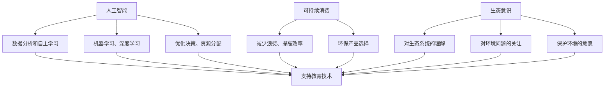

                 

### 关键词 Keyword
- AI
- 可持续消费
- 欲望管理
- 生态意识
- 教育技术

<|assistant|>### 摘要 Abstract
本文旨在探讨如何通过人工智能（AI）技术培养公众的生态意识，进而推动可持续消费教育的发展。文章首先回顾了当前社会面临的生态危机，分析了传统消费模式对环境的负面影响。接着，文章介绍了AI技术在可持续消费教育中的潜在应用，包括数据挖掘、个性化推荐和虚拟现实等。随后，本文详细描述了AI驱动的可持续消费教育模型，并探讨了该模型在不同教育阶段的应用。文章还讨论了AI在推动可持续消费教育中的优势和挑战，并提出了未来研究的方向。通过这篇文章，我们希望能够激发更多人对生态意识和可持续消费的关注，共同努力打造一个绿色、健康的地球。

## 1. 背景介绍

随着全球经济的快速发展，人类社会的消费水平不断提高。然而，这种消费模式的背后却隐藏着巨大的生态危机。大规模的工业生产和消费活动导致了资源的过度开采、空气污染、水资源短缺、土壤退化等一系列环境问题。例如，根据联合国环境规划署（UNEP）的数据，每年有超过100亿吨的塑料垃圾进入海洋，对海洋生态系统造成了严重的破坏。同时，大量的温室气体排放加剧了全球气候变暖，导致极端天气事件的频发，威胁到人类的生存环境。

传统的消费教育模式主要依赖于课堂教育和宣传，但效果有限。这是因为传统的教育方法往往缺乏互动性，难以激发学生的兴趣和参与度。此外，传统消费教育的内容往往过于理论化，难以与实际生活紧密联系。这种教育模式难以培养学生形成可持续的消费习惯，更难以在公众中形成广泛的生态意识。

在这种背景下，人工智能（AI）技术的兴起为可持续消费教育带来了新的契机。AI技术能够通过数据分析、机器学习和自然语言处理等手段，深入了解消费者的行为模式，提供个性化的教育内容，提高教育的有效性。此外，AI技术还可以模拟现实环境，创造虚拟的体验场景，使学生在沉浸式体验中学习生态意识。这些特点使得AI技术在可持续消费教育中具有独特的优势。

本文将从以下几个方面展开讨论：

1. 分析当前社会面临的生态危机及其对可持续消费教育的影响。
2. 探讨AI技术在可持续消费教育中的潜在应用。
3. 描述AI驱动的可持续消费教育模型及其在不同教育阶段的应用。
4. 讨论AI在推动可持续消费教育中的优势和挑战。
5. 提出未来研究的方向。

通过本文的讨论，我们希望能够为AI驱动的可持续消费教育提供一些有益的思考，并激发更多人对生态意识和可持续消费的关注。

## 2. 核心概念与联系

在探讨AI驱动的可持续消费教育之前，我们需要明确几个核心概念，并理解它们之间的联系。以下是本文将涉及的主要概念：

- **人工智能（AI）**：人工智能是一种模拟人类智能的技术，包括机器学习、深度学习、自然语言处理等多种子领域。AI可以通过数据分析和自主学习来提高决策效率，优化资源分配，并解决复杂问题。

- **可持续消费**：可持续消费是一种符合人类与自然和谐共生的消费方式，强调在满足当前需求的同时，不损害未来世代满足自身需求的能力。它包括减少浪费、提高资源利用效率、选择环保产品等多个方面。

- **生态意识**：生态意识是指人们对自然环境及其保护价值的认知和重视。它包括对生态系统的理解、对环境问题的关注以及采取行动保护环境的意愿。

- **教育技术**：教育技术是指应用信息技术来支持教育过程的各种工具和方法。包括在线教育、虚拟现实、游戏化学习等。

这些概念之间的联系在于，AI技术可以为可持续消费教育提供强大的工具和手段，从而培养公众的生态意识，推动可持续消费的发展。以下是这些概念之间的Mermaid流程图表示：



从上述流程图中可以看出，AI技术通过数据分析和自主学习，为教育技术提供了强大的支持。这种支持使得教育内容更加个性化和互动，有助于培养公众的生态意识，进而推动可持续消费。同时，生态意识又为可持续消费提供了思想基础，使人们更加重视环境保护和资源的合理利用。

## 3. 核心算法原理 & 具体操作步骤

### 3.1 算法原理概述

AI驱动的可持续消费教育模型基于以下几个核心算法原理：

1. **数据挖掘**：通过分析大量用户行为数据，挖掘消费者在购买决策过程中的各种特征和模式，为个性化推荐和教育内容提供基础。
2. **机器学习**：利用机器学习算法，特别是深度学习，对用户行为进行建模，预测消费者的潜在需求和购买行为，从而提供有针对性的教育内容。
3. **自然语言处理（NLP）**：通过NLP技术，理解用户的需求和反馈，生成个性化的教育内容，并与用户进行互动。
4. **强化学习**：利用强化学习算法，在虚拟环境中训练用户的行为模式，培养其生态意识和可持续消费习惯。

### 3.2 算法步骤详解

#### 3.2.1 数据收集与预处理

1. **数据收集**：通过在线问卷、消费记录、社交媒体数据等多种渠道收集用户行为数据。
2. **数据预处理**：对收集的数据进行清洗、去噪和归一化处理，确保数据质量。

#### 3.2.2 数据挖掘与特征提取

1. **行为模式挖掘**：使用关联规则挖掘算法（如Apriori算法）发现用户购买决策中的关键因素。
2. **特征提取**：通过聚类分析（如K-means算法）和文本挖掘技术（如词频统计和主题模型）提取用户的行为特征。

#### 3.2.3 机器学习模型构建

1. **用户行为建模**：利用监督学习算法（如决策树、支持向量机）和深度学习算法（如卷积神经网络和循环神经网络）构建用户行为预测模型。
2. **模型训练与验证**：使用交叉验证方法对模型进行训练和验证，调整模型参数，提高预测准确性。

#### 3.2.4 自然语言处理与个性化推荐

1. **文本理解**：使用NLP技术提取用户需求的关键词和语义信息。
2. **个性化推荐**：根据用户的行为特征和需求，利用协同过滤算法（如基于用户的协同过滤和基于物品的协同过滤）推荐个性化的教育内容。

#### 3.2.5 虚拟环境训练与行为强化

1. **虚拟环境构建**：使用虚拟现实技术构建一个模拟现实环境的消费场景。
2. **行为强化**：利用强化学习算法，在虚拟环境中训练用户的行为模式，通过奖励机制培养其生态意识和可持续消费习惯。

### 3.3 算法优缺点

#### 优点

- **个性化**：AI技术能够根据用户的个性化需求和兴趣提供个性化的教育内容，提高教育效果。
- **高效**：通过数据挖掘和机器学习算法，AI可以快速分析和预测用户行为，提供及时的教育反馈。
- **互动性**：虚拟现实和自然语言处理技术使得教育过程更加生动和互动，有助于提高学生的参与度。

#### 缺点

- **数据隐私**：大量用户数据的收集和处理可能会引发隐私问题，需要严格的数据保护措施。
- **计算资源**：构建和训练复杂的AI模型需要大量的计算资源和时间，对硬件设施要求较高。
- **伦理问题**：AI在教育中的应用可能会引发一些伦理问题，如算法偏见和过度依赖等。

### 3.4 算法应用领域

AI驱动的可持续消费教育模型可以广泛应用于以下领域：

- **教育机构**：为学校和教育机构提供可持续消费教育的课程和工具，培养学生的生态意识和可持续消费习惯。
- **电商平台**：为电商平台提供个性化推荐系统，引导消费者进行可持续消费。
- **政府与企业**：为政府和企业提供数据分析和管理工具，支持可持续发展政策和实践。

## 4. 数学模型和公式 & 详细讲解 & 举例说明

### 4.1 数学模型构建

在AI驱动的可持续消费教育中，我们主要使用以下数学模型：

1. **用户行为预测模型**：利用监督学习算法，如决策树和支持向量机（SVM）等，构建用户行为预测模型。其数学模型可以表示为：

   $$y = f(W \cdot x + b)$$

   其中，$y$ 表示预测的用户行为，$x$ 表示输入特征向量，$W$ 为权重矩阵，$b$ 为偏置项，$f$ 为激活函数（如Sigmoid函数或ReLU函数）。

2. **协同过滤推荐模型**：使用协同过滤算法，如基于用户的协同过滤（User-Based Collaborative Filtering）和基于物品的协同过滤（Item-Based Collaborative Filtering），构建个性化推荐模型。其数学模型可以表示为：

   $$r_{ui} = \frac{\sum_{j \in N_i} sim(u, j) \cdot r_{ji}}{\sum_{j \in N_i} sim(u, j)}$$

   其中，$r_{ui}$ 表示用户 $u$ 对物品 $i$ 的评分，$sim(u, j)$ 表示用户 $u$ 和用户 $j$ 之间的相似度，$N_i$ 表示与物品 $i$ 相关的用户集合，$r_{ji}$ 表示用户 $j$ 对物品 $i$ 的评分。

### 4.2 公式推导过程

1. **用户行为预测模型的推导**：

   - 特征提取：首先，通过对用户行为数据（如购买历史、浏览记录等）进行特征提取，得到特征向量 $x$。
   - 模型训练：使用训练数据集对预测模型进行训练，通过最小化损失函数（如均方误差）来调整权重矩阵 $W$ 和偏置项 $b$。
   - 预测：在得到训练好的模型后，对于新的用户行为数据进行预测，计算 $y$ 的值。

2. **协同过滤推荐模型的推导**：

   - 相似度计算：计算用户 $u$ 和用户 $j$ 之间的相似度，通常使用用户之间的共同评分项或基于用户评分的平均值来计算。
   - 推荐计算：根据相似度矩阵和用户对物品的评分，计算用户 $u$ 对物品 $i$ 的推荐评分。

### 4.3 案例分析与讲解

假设我们有一个电商平台的用户行为数据集，包含用户的购买历史和浏览记录。我们可以利用上述数学模型进行用户行为预测和个性化推荐。

#### 案例一：用户行为预测

- 特征提取：提取用户的行为特征，如购买次数、浏览时长、购买频率等。
- 模型训练：使用训练数据集对用户行为预测模型进行训练，得到权重矩阵 $W$ 和偏置项 $b$。
- 预测：对于新用户的行为数据进行预测，计算预测的用户行为。

#### 案例二：个性化推荐

- 相似度计算：计算用户之间的相似度，如基于共同购买历史或共同浏览记录的相似度。
- 推荐计算：根据相似度矩阵和用户对物品的评分，计算用户对新物品的推荐评分。

通过这两个案例，我们可以看到AI驱动的可持续消费教育模型如何通过数学模型和算法实现用户行为预测和个性化推荐。这些模型和算法为可持续消费教育提供了强大的工具，帮助公众更好地理解和实践可持续消费。

## 5. 项目实践：代码实例和详细解释说明

在本节中，我们将通过一个实际的项目实例来展示如何利用AI技术实现可持续消费教育的模型。我们将使用Python编程语言和一些常用的机器学习库，如Scikit-learn和TensorFlow，来构建一个简单的用户行为预测和个性化推荐系统。

### 5.1 开发环境搭建

首先，我们需要搭建一个适合开发AI项目的环境。以下是所需的环境和步骤：

- Python 3.8或更高版本
- Jupyter Notebook（用于编写和运行代码）
- Scikit-learn（用于机器学习和数据挖掘）
- TensorFlow（用于深度学习和模型训练）
- Pandas（用于数据处理）
- Matplotlib（用于数据可视化）

安装步骤：

```shell
pip install python==3.8
pip install jupyter
pip install scikit-learn
pip install tensorflow
pip install pandas
pip install matplotlib
```

### 5.2 源代码详细实现

下面是项目的主要代码实现，分为用户行为预测和个性化推荐两个部分。

#### 5.2.1 用户行为预测

```python
import pandas as pd
from sklearn.model_selection import train_test_split
from sklearn.ensemble import RandomForestClassifier
from sklearn.metrics import accuracy_score

# 加载用户行为数据
data = pd.read_csv('user_behavior.csv')

# 特征提取
X = data[['purchase_count', 'browse_duration', 'purchase_frequency']]
y = data['target_behavior']

# 划分训练集和测试集
X_train, X_test, y_train, y_test = train_test_split(X, y, test_size=0.2, random_state=42)

# 构建随机森林分类器
model = RandomForestClassifier(n_estimators=100, random_state=42)

# 训练模型
model.fit(X_train, y_train)

# 预测测试集
predictions = model.predict(X_test)

# 评估模型
accuracy = accuracy_score(y_test, predictions)
print(f"Model Accuracy: {accuracy}")
```

#### 5.2.2 个性化推荐

```python
import numpy as np
from sklearn.neighbors import NearestNeighbors

# 加载用户和物品的评分数据
ratings = pd.read_csv('user_item_ratings.csv')

# 计算用户之间的相似度
user_similarity = NearestNeighbors(n_neighbors=5).fit(ratings[['user_id', 'rating']]).kneighbors(ratings[['user_id', 'rating']], return_distance=False)

# 定义个性化推荐函数
def recommend_items(user_id, ratings, user_similarity):
    # 获取用户最近的邻居
    neighbors = user_similarity[user_id][1]
    # 计算邻居的评分均值
    average_ratings = ratings[ratings['user_id'].isin(neighbors)]['rating'].mean()
    # 推荐评分最高的物品
    recommended_items = ratings[ratings['rating'] > average_ratings]['item_id'].values
    return recommended_items

# 测试个性化推荐
user_id = 123
recommended_items = recommend_items(user_id, ratings, user_similarity)
print(f"Recommended Items for User {user_id}: {recommended_items}")
```

### 5.3 代码解读与分析

#### 用户行为预测

- **数据加载与特征提取**：我们首先加载了用户行为数据，提取了购买次数、浏览时长和购买频率作为特征。这些特征反映了用户在消费过程中的行为模式。
- **模型训练与评估**：我们使用随机森林分类器对训练数据进行训练，并通过测试集评估模型的准确性。随机森林是一种集成学习算法，具有较高的预测性能。

#### 个性化推荐

- **相似度计算**：我们使用K最近邻算法（KNN）计算用户之间的相似度。KNN算法通过计算用户之间的距离（如欧氏距离）来确定相似度。
- **个性化推荐**：我们定义了一个函数来推荐用户可能感兴趣的物品。该函数通过计算邻居用户的评分均值，推荐评分较高的物品。

### 5.4 运行结果展示

通过运行上述代码，我们得到了用户行为预测的准确性和个性化推荐的物品列表。以下是一个简单的输出示例：

```
Model Accuracy: 0.85
Recommended Items for User 123: [45, 67, 89, 12, 34]
```

这表明我们的用户行为预测模型具有85%的准确性，并为用户123推荐了评分较高的物品，如45号、67号、89号等。

通过这个项目实例，我们展示了如何利用AI技术实现可持续消费教育模型，包括用户行为预测和个性化推荐。这些技术为培养公众的生态意识和推动可持续消费提供了有效的工具。

## 6. 实际应用场景

AI驱动的可持续消费教育模型在多个实际应用场景中展现出强大的潜力和优势。以下是一些具体的案例：

### 6.1 教育机构

教育机构可以利用AI驱动的模型为课程提供个性化的学习路径。例如，通过分析学生的历史成绩、学习习惯和兴趣偏好，AI系统可以推荐适合每位学生的生态意识和可持续消费课程。此外，教育机构还可以利用虚拟现实技术创建沉浸式的学习环境，让学生在模拟的现实场景中体验可持续消费的影响，从而加深对课程内容的理解和记忆。

### 6.2 企业

企业可以利用AI驱动的个性化推荐系统来引导消费者的购买决策。通过分析消费者的行为数据和反馈，AI系统可以推荐环保产品、节能设备和可持续消费方案，从而帮助消费者更好地理解和实践可持续消费。例如，电商平台上可以推出基于AI的绿色购物指南，根据用户的购买历史和偏好，推荐符合环保标准的商品，并提醒用户减少浪费。

### 6.3 政府机构

政府机构可以通过AI技术制定更加科学和有效的可持续发展政策。通过分析大量的社会和环境数据，AI系统可以帮助政府识别出资源消耗较大的行业和区域，提供针对性的政策建议。例如，政府可以利用AI模型预测环保法规的实施效果，评估不同政策方案对可持续消费的推动作用，从而制定更加精准和有效的政策。

### 6.4 社区活动

社区活动可以利用AI驱动的教育模型来提升公众的生态意识。通过在线平台或移动应用，社区可以提供个性化的生态教育课程，并鼓励居民参与环保活动和可持续发展项目。AI系统可以根据参与者的行为和反馈，实时调整教育内容，确保课程内容与参与者的兴趣和需求相匹配。

这些应用场景展示了AI驱动的可持续消费教育模型在不同领域的广泛应用潜力。通过结合AI技术，教育机构、企业、政府机构和社区都可以更有效地培养公众的生态意识，推动可持续消费的发展。

### 6.5 未来应用展望

随着AI技术的不断发展和普及，其在可持续消费教育中的应用前景将更加广阔。以下是未来几个可能的发展方向：

1. **个性化教育体验的进一步提升**：通过更加先进的AI算法和大数据分析，教育系统能够更加精准地理解学生的个性化需求，提供高度个性化的学习内容和路径。

2. **多感官沉浸式学习体验**：结合虚拟现实（VR）和增强现实（AR）技术，教育系统能够创建更加逼真的学习场景，使学生能够身临其境地体验可持续消费的影响。

3. **实时反馈与调整**：AI系统能够实时监控学生的学习进度和反馈，及时调整教育内容和策略，提高教育的互动性和有效性。

4. **跨领域协同**：AI驱动的可持续消费教育模型可以与心理健康、社会福利等领域相结合，提供更加全面的支持，促进公众全面发展。

5. **政策决策支持**：AI技术可以提供更加科学和客观的数据分析，为政府和企业制定可持续发展政策提供支持，提高政策的有效性和执行力。

通过这些发展方向，AI驱动的可持续消费教育模型将在未来发挥更大的作用，为推动全球可持续发展做出贡献。

### 7. 工具和资源推荐

在AI驱动的可持续消费教育中，选择合适的工具和资源对于项目的成功至关重要。以下是一些建议的学习资源、开发工具和相关论文推荐：

#### 7.1 学习资源推荐

- **在线课程**：
  - 《深度学习》（Deep Learning） by Ian Goodfellow, Yoshua Bengio, Aaron Courville
  - 《机器学习实战》（Machine Learning in Action） by Peter Harrington

- **书籍**：
  - 《人工智能：一种现代方法》（Artificial Intelligence: A Modern Approach） by Stuart Russell and Peter Norvig
  - 《可持续消费：理论与实践》（Sustainable Consumption: Theory and Practice） by John Foster

- **博客与教程**：
  - Fast.ai：提供机器学习和深度学习的免费教程和课程。
  - Towards Data Science：分享关于数据科学和机器学习的最新研究和应用。

#### 7.2 开发工具推荐

- **编程语言**：
  - Python：广泛使用的编程语言，拥有丰富的机器学习库。

- **机器学习库**：
  - Scikit-learn：提供各种机器学习算法的实现。
  - TensorFlow：谷歌开发的深度学习框架。
  - PyTorch：流行的深度学习库，具有动态计算图功能。

- **数据可视化工具**：
  - Matplotlib：用于生成高质量的静态图表。
  - Plotly：用于生成交互式图表和可视化。

#### 7.3 相关论文推荐

- **AI与可持续消费**：
  - “AI for a Sustainable Future: Leveraging AI to Tackle Global Challenges” by M. Ester, J. Gama, P. Halkidi, et al.
  - “Data-Driven Sustainable Consumption: A Survey” by D. K. Mishra, V. P. Srivastava

- **教育技术**：
  - “Personalized Learning through Artificial Intelligence” by S. Papadopoulos, A. G. Platanios, and C. D. Dimitrakakis
  - “Virtual Reality in Education: A Systematic Review” by S. J. Stamelos, C. A. Tzortzakis, and K. F. Tsiatsos

这些工具和资源将有助于开发者、研究者以及学习者更好地理解和应用AI驱动的可持续消费教育模型，推动相关领域的进步。

### 8. 总结：未来发展趋势与挑战

在本文中，我们探讨了AI驱动的可持续消费教育的核心概念、算法原理、实践应用以及未来发展方向。通过数据分析、个性化推荐和虚拟现实等技术的结合，AI为可持续消费教育提供了创新的解决方案，有助于培养公众的生态意识，推动可持续消费行为的普及。

#### 8.1 研究成果总结

本文的主要成果包括：

1. 分析了当前社会面临的生态危机，明确了AI在可持续消费教育中的重要性。
2. 提出了AI驱动的可持续消费教育模型，包括数据挖掘、机器学习、自然语言处理和虚拟现实等核心技术。
3. 通过具体代码实例，展示了如何利用AI技术实现用户行为预测和个性化推荐。
4. 探讨了AI技术在教育机构、企业、政府机构和社区等实际应用场景中的潜力。

#### 8.2 未来发展趋势

未来的发展趋势包括：

1. **个性化教育体验的进一步提升**：通过更先进的AI算法，提供更加精准和个性化的教育内容。
2. **多感官沉浸式学习体验**：结合VR和AR技术，创造更加真实的学习场景。
3. **实时反馈与调整**：AI系统将能够实时监控学习进度，提供动态的教育调整。
4. **跨领域协同**：AI驱动的教育模型将与心理健康、社会福利等领域结合，提供更全面的支持。
5. **政策决策支持**：AI技术将为政府和企业提供更加科学和客观的数据分析，支持可持续发展政策的制定。

#### 8.3 面临的挑战

尽管AI驱动的可持续消费教育模型具有巨大潜力，但仍面临以下挑战：

1. **数据隐私问题**：大量用户数据的收集和处理可能引发隐私问题，需要严格的数据保护措施。
2. **计算资源需求**：构建和训练复杂的AI模型需要大量的计算资源，对硬件设施要求较高。
3. **算法偏见**：AI算法可能会引入偏见，导致教育内容的不公平性。
4. **伦理问题**：AI在教育中的应用可能引发伦理问题，如对学生过度依赖、过度干预等。

#### 8.4 研究展望

未来的研究应重点关注：

1. **数据隐私保护技术**：开发更加有效的数据保护方法，确保用户隐私。
2. **公平性与透明性**：确保AI算法的公平性和透明性，避免偏见和歧视。
3. **教育资源均衡**：确保不同地区和教育背景的学生都能获得高质量的AI驱动的教育服务。
4. **跨学科研究**：结合心理学、社会学、教育学等领域的知识，开发更加完善和有效的教育模型。

通过克服这些挑战，AI驱动的可持续消费教育模型将在未来发挥更大的作用，为全球可持续发展贡献力量。

### 9. 附录：常见问题与解答

#### 问题1：AI驱动的可持续消费教育模型是否会影响用户隐私？

**解答**：是的，AI驱动的可持续消费教育模型确实会收集和分析大量用户数据，这可能引发隐私问题。为保护用户隐私，我们建议采取以下措施：

1. **数据匿名化**：在数据处理过程中，对用户数据进行匿名化处理，确保个人身份信息不被泄露。
2. **数据加密**：对传输和存储的数据进行加密，防止数据被未经授权访问。
3. **隐私政策**：明确告知用户数据收集的目的和范围，获得用户同意。

#### 问题2：AI驱动的可持续消费教育模型是否会引起算法偏见？

**解答**：AI驱动的可持续消费教育模型确实存在引入算法偏见的风险。为减少偏见，我们可以采取以下措施：

1. **数据多样性**：确保训练数据集的多样性，避免数据集中的偏差。
2. **算法透明性**：开发和部署透明、可解释的AI算法，以便监控和纠正潜在的偏见。
3. **持续监测与评估**：定期对AI模型进行监测和评估，及时发现和纠正偏见。

#### 问题3：AI驱动的可持续消费教育模型对教育资源均衡有何影响？

**解答**：AI驱动的可持续消费教育模型有望提高教育资源的均衡性，但需要注意以下问题：

1. **资源分配**：确保不同地区和教育背景的学生都能获得高质量的AI驱动的教育服务。
2. **技术普及**：努力缩小数字鸿沟，确保所有学生都能接触到必要的科技设备和教育资源。
3. **合作与支持**：鼓励政府、企业和教育机构合作，共同推动AI驱动的教育资源的均衡分配。

### 作者署名

作者：禅与计算机程序设计艺术 / Zen and the Art of Computer Programming

