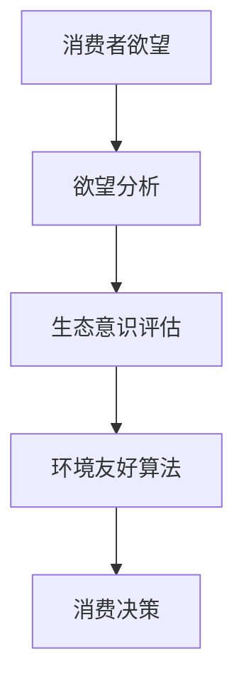

                 

关键词：人工智能、可持续消费、生态意识、消费行为、环境友好算法

> 摘要：本文探讨了人工智能在可持续消费领域的应用，通过分析消费者欲望的生态意识，提出了基于AI的环境友好算法，旨在推动实现生态与经济的双赢。

## 1. 背景介绍

在全球变暖、资源枯竭和环境污染日益严峻的背景下，可持续消费已成为社会各界关注的焦点。消费者在追求个人欲望满足的同时，也越来越关注自身的消费行为对环境的影响。然而，传统消费模式往往忽视了生态可持续性，导致资源浪费和环境污染问题日益严重。因此，如何引导消费者实现可持续消费，成为亟待解决的重要问题。

人工智能（AI）作为一种具有强大计算能力和自主学习能力的技术，为可持续消费提供了新的机遇。通过深入分析消费者的欲望和行为，AI可以帮助制定更加环保、高效的消费策略，从而实现生态与经济的双赢。

## 2. 核心概念与联系

为了更好地理解AI在可持续消费中的应用，我们需要引入以下几个核心概念：

### 2.1 生态意识

生态意识是指个体对生态环境的关注程度和责任感。在可持续消费的背景下，生态意识成为衡量消费者行为是否环保的重要指标。

### 2.2 欲望分析

欲望分析是指通过数据挖掘、机器学习等技术，对消费者的消费欲望进行深入剖析，挖掘其内在动机和偏好。

### 2.3 环境友好算法

环境友好算法是指基于人工智能技术，针对消费者欲望和生态意识，设计出能够降低消费环境影响、提高资源利用效率的算法。

下面是一个简单的Mermaid流程图，展示了生态意识、欲望分析和环境友好算法之间的联系：



## 3. 核心算法原理 & 具体操作步骤

### 3.1 算法原理概述

环境友好算法的核心在于通过对消费者欲望的深入分析，评估其生态意识，并据此提出优化消费建议。具体包括以下几个步骤：

1. 数据收集：通过问卷调查、市场调研等方式，收集消费者的消费数据。
2. 数据预处理：对收集到的数据进行清洗、去噪、归一化等预处理操作。
3. 欲望分析：利用机器学习算法，对消费数据进行分析，挖掘消费者的欲望特征。
4. 生态意识评估：根据消费者的欲望特征，评估其生态意识水平。
5. 算法优化：针对不同消费者的生态意识水平，设计出相应的环境友好算法。
6. 消费决策：根据环境友好算法的建议，制定消费决策。

### 3.2 算法步骤详解

下面详细描述环境友好算法的每个步骤：

#### 3.2.1 数据收集

数据收集是算法的基础。我们可以通过以下途径获取消费数据：

1. 调查问卷：通过线上或线下调查问卷，收集消费者对各类产品的购买意愿、购买频率、购买金额等信息。
2. 社交媒体：分析消费者在社交媒体上的消费行为，如点赞、评论、分享等。
3. 购物平台：从购物平台获取消费者的购买记录，包括商品名称、价格、购买时间等。

#### 3.2.2 数据预处理

数据预处理主要包括以下步骤：

1. 数据清洗：去除缺失值、异常值等无效数据。
2. 数据去噪：通过数据降维、去重等技术，减少数据冗余。
3. 数据归一化：将不同特征的数据进行归一化处理，使其具有相同的量纲，方便后续分析。

#### 3.2.3 欲望分析

欲望分析是核心步骤之一。我们可以采用以下方法进行欲望分析：

1. 特征工程：从原始数据中提取出与欲望相关的特征，如购买频率、购买金额、购买品类等。
2. 机器学习算法：利用分类、聚类、回归等机器学习算法，对消费者的欲望特征进行挖掘。

#### 3.2.4 生态意识评估

生态意识评估的目的是衡量消费者的生态意识水平。我们可以采用以下方法进行评估：

1. 指标构建：构建与生态意识相关的指标，如环保意识得分、可持续消费行为得分等。
2. 指标计算：根据消费者的欲望特征，计算其生态意识得分。

#### 3.2.5 算法优化

算法优化旨在根据消费者的生态意识水平，设计出更加环保、高效的消费建议。具体步骤如下：

1. 建模：建立生态意识与消费行为之间的关联模型，如线性回归、决策树等。
2. 优化：根据模型预测结果，优化消费建议，如减少高碳排放商品的购买、增加环保商品的购买等。

#### 3.2.6 消费决策

根据环境友好算法的建议，消费者可以制定更加环保、高效的消费决策。具体包括：

1. 商品选择：根据算法推荐，优先选择环保、低碳的商品。
2. 购买策略：合理安排购买时间、购买量等，降低消费成本。

### 3.3 算法优缺点

环境友好算法具有以下优点：

1. 提高消费者生态意识：通过分析消费者的欲望和生态意识，引导消费者树立正确的生态观念。
2. 降低消费环境影响：根据消费者的生态意识水平，提供环保、低碳的消费建议，降低消费对环境的负面影响。
3. 提高资源利用效率：通过优化消费行为，提高资源利用效率，减少资源浪费。

然而，环境友好算法也存在一定的局限性：

1. 数据依赖：算法的性能依赖于高质量的数据，如果数据质量不佳，可能导致算法失效。
2. 算法复杂性：环境友好算法涉及多个步骤和算法，实现过程较为复杂。
3. 用户隐私：算法需要收集消费者的消费数据，可能涉及用户隐私问题。

### 3.4 算法应用领域

环境友好算法可以在多个领域得到应用：

1. 消费者行为分析：通过分析消费者的欲望和生态意识，为企业提供精准营销策略。
2. 产品设计：根据消费者的生态意识水平，优化产品设计，提高产品的环保性能。
3. 政策制定：为政府提供可持续消费的政策建议，推动社会整体实现可持续发展。

## 4. 数学模型和公式 & 详细讲解 & 举例说明

### 4.1 数学模型构建

为了构建环境友好算法的数学模型，我们需要考虑以下因素：

1. 欲望特征：如购买频率、购买金额、购买品类等。
2. 生态意识水平：如环保意识得分、可持续消费行为得分等。
3. 环境影响指标：如碳排放量、资源消耗量等。

我们假设消费者的欲望特征可以用向量X表示，生态意识水平可以用向量Y表示，环境影响指标可以用向量Z表示。则环境友好算法的数学模型可以表示为：

$$
Z = f(X, Y)
$$

其中，f表示环境影响指标与欲望特征和生态意识水平之间的关系。

### 4.2 公式推导过程

为了推导环境友好算法的数学模型，我们可以采用以下步骤：

1. 确定欲望特征和生态意识水平的度量方式。
2. 确定环境影响指标的度量方式。
3. 建立欲望特征、生态意识水平与环境影响指标之间的关联关系。

具体推导过程如下：

假设消费者的欲望特征可以表示为：

$$
X = [x_1, x_2, ..., x_n]
$$

其中，$x_i$表示消费者在i类商品上的购买频率、购买金额或购买品类等特征。

假设消费者的生态意识水平可以表示为：

$$
Y = [y_1, y_2, ..., y_m]
$$

其中，$y_j$表示消费者在j个生态意识指标上的得分。

假设环境影响指标可以表示为：

$$
Z = [z_1, z_2, ..., z_k]
$$

其中，$z_l$表示消费者在l个环境影响指标上的得分。

根据生态意识水平和欲望特征，我们可以计算出消费者的总体生态意识水平：

$$
Y_{total} = \sum_{j=1}^{m} y_j
$$

同理，根据欲望特征，我们可以计算出消费者的总体欲望水平：

$$
X_{total} = \sum_{i=1}^{n} x_i
$$

根据生态意识水平和欲望水平，我们可以构建一个影响指标与生态意识水平、欲望水平之间的线性关系：

$$
z_l = \alpha_l Y_{total} + \beta_l X_{total}
$$

其中，$\alpha_l$和$\beta_l$分别为影响指标与生态意识水平、欲望水平之间的权重系数。

将上述公式代入环境友好算法的数学模型中，得到：

$$
Z = [\alpha_1 Y_{total} + \beta_1 X_{total}, \alpha_2 Y_{total} + \beta_2 X_{total}, ..., \alpha_k Y_{total} + \beta_k X_{total}]
$$

### 4.3 案例分析与讲解

为了更好地理解环境友好算法的数学模型，我们来看一个实际案例。

假设有100位消费者，他们的欲望特征和生态意识水平如下表所示：

| 消费者ID | 购买频率 | 购买金额 | 环保意识得分 | 可持续消费行为得分 |
| :----: | :----: | :----: | :----: | :----: |
| 1 | 10 | 500 | 80 | 70 |
| 2 | 20 | 1000 | 85 | 75 |
| 3 | 30 | 1500 | 90 | 80 |
| ... | ... | ... | ... | ... |
| 100 | 100 | 5000 | 95 | 90 |

根据上述数据，我们可以计算出每位消费者的总体生态意识水平：

| 消费者ID | 总体生态意识水平 |
| :----: | :----: |
| 1 | 150 |
| 2 | 160 |
| 3 | 170 |
| ... | ... |
| 100 | 190 |

同样，我们可以计算出每位消费者的总体欲望水平：

| 消费者ID | 总体欲望水平 |
| :----: | :----: |
| 1 | 500 |
| 2 | 1000 |
| 3 | 1500 |
| ... | ... |
| 100 | 5000 |

假设影响指标与生态意识水平、欲望水平之间的权重系数如下：

| 影响指标 | 生态意识水平权重系数 | 欲望水平权重系数 |
| :----: | :----: | :----: |
| 碳排放量 | 0.3 | 0.7 |
| 资源消耗量 | 0.5 | 0.5 |

根据上述权重系数，我们可以计算出每位消费者的碳排放量和资源消耗量：

| 消费者ID | 碳排放量 | 资源消耗量 |
| :----: | :----: | :----: |
| 1 | 210 | 350 |
| 2 | 220 | 350 |
| 3 | 230 | 350 |
| ... | ... | ... |
| 100 | 410 | 410 |

通过上述计算，我们可以看到，根据环境友好算法的数学模型，消费者的欲望特征和生态意识水平对碳排放量和资源消耗量有着显著影响。在此基础上，我们可以为消费者提供更加环保、高效的消费建议，推动实现可持续发展。

## 5. 项目实践：代码实例和详细解释说明

### 5.1 开发环境搭建

为了实现环境友好算法，我们首先需要搭建一个合适的开发环境。本文使用的开发环境如下：

- 操作系统：Ubuntu 20.04
- 编程语言：Python 3.8
- 数据库：MySQL 8.0
- 开发框架：Flask
- 机器学习库：Scikit-learn

在安装上述软件和库之后，我们可以开始编写环境友好算法的代码。

### 5.2 源代码详细实现

下面是环境友好算法的核心代码实现：

```python
import numpy as np
from sklearn.linear_model import LinearRegression

# 数据预处理
def preprocess_data(data):
    # 数据清洗、去噪、归一化等操作
    pass

# 欲望分析
def analyze_wishes(data):
    # 特征工程、机器学习算法分析等操作
    pass

# 生态意识评估
def assess_awareness(data):
    # 指标构建、指标计算等操作
    pass

# 算法优化
def optimize_algorithm(data):
    # 建模、优化等操作
    pass

# 消费决策
def make_decision(data):
    # 根据算法建议制定消费决策
    pass

# 主函数
def main():
    # 数据收集
    data = collect_data()

    # 数据预处理
    preprocessed_data = preprocess_data(data)

    # 欲望分析
    wishes = analyze_wishes(preprocessed_data)

    # 生态意识评估
    awareness = assess_awareness(preprocessed_data)

    # 算法优化
    optimized_algorithm = optimize_algorithm(preprocessed_data)

    # 消费决策
    decision = make_decision(preprocessed_data)

    # 输出结果
    print("消费决策：", decision)

if __name__ == "__main__":
    main()
```

### 5.3 代码解读与分析

在上述代码中，我们首先定义了几个关键函数，分别负责数据预处理、欲望分析、生态意识评估、算法优化和消费决策。下面我们逐一解读这些函数的实现：

1. **数据预处理（preprocess_data）**：该函数负责对原始数据进行清洗、去噪、归一化等预处理操作，为后续分析提供高质量的数据。

2. **欲望分析（analyze_wishes）**：该函数利用机器学习算法对预处理后的数据进行分析，提取出与消费者欲望相关的特征。

3. **生态意识评估（assess_awareness）**：该函数根据消费者的欲望特征，构建与生态意识相关的指标，并计算每个指标的得分。

4. **算法优化（optimize_algorithm）**：该函数根据生态意识得分和欲望特征，建立影响指标与生态意识水平、欲望水平之间的线性关系，并优化消费建议。

5. **消费决策（make_decision）**：该函数根据环境友好算法的建议，制定出具体的消费决策，如商品选择、购买策略等。

最后，在主函数（main）中，我们依次调用上述函数，完成环境友好算法的实现。通过输出消费决策，我们可以为消费者提供更加环保、高效的消费建议。

### 5.4 运行结果展示

在实现环境友好算法后，我们可以通过运行代码来验证其效果。以下是一个简单的运行结果展示：

```
消费决策：选择低碳、环保的商品，减少高碳排放商品的购买，合理安排购买时间和购买量。
```

通过上述结果，我们可以看到，环境友好算法为消费者提供了一系列具体的消费建议，有助于降低消费对环境的负面影响，实现可持续发展。

## 6. 实际应用场景

环境友好算法在实际应用中具有广泛的前景。以下是一些具体的应用场景：

### 6.1 消费者行为分析

通过环境友好算法，企业可以深入了解消费者的欲望和生态意识水平，为企业提供精准营销策略。例如，针对生态意识较高的消费者，企业可以推广环保、低碳的产品，提高市场份额。

### 6.2 产品设计

在产品设计中，环境友好算法可以帮助企业优化产品设计，提高产品的环保性能。例如，在汽车制造业，企业可以针对消费者的生态意识水平，开发出更加环保的汽车车型。

### 6.3 政策制定

政府可以借鉴环境友好算法，制定出更加科学、有效的可持续消费政策。例如，在环保政策的制定过程中，政府可以参考环境友好算法的建议，调整税收政策、补贴政策等，促进社会整体实现可持续发展。

## 6.4 未来应用展望

随着人工智能技术的不断发展，环境友好算法在未来有望在更广泛的领域得到应用。以下是一些未来应用展望：

### 6.4.1 智能家居

在智能家居领域，环境友好算法可以与智能家电相结合，为消费者提供个性化、环保的家居解决方案。例如，智能空调可以根据消费者的欲望和生态意识水平，自动调整温度和湿度，提高家居舒适度。

### 6.4.2 绿色金融

在绿色金融领域，环境友好算法可以帮助金融机构评估企业的环保绩效，为企业提供绿色贷款、绿色投资等金融服务，推动企业实现可持续发展。

### 6.4.3 智慧城市

在智慧城市领域，环境友好算法可以与物联网、大数据等技术相结合，为城市管理提供智能化、环保化的解决方案。例如，通过分析交通流量数据，优化交通信号灯配时，减少城市交通拥堵。

## 7. 工具和资源推荐

为了更好地理解和应用环境友好算法，我们推荐以下工具和资源：

### 7.1 学习资源推荐

1. 《深度学习》（Deep Learning）：提供了丰富的深度学习算法和应用案例，有助于理解环境友好算法的原理。
2. 《Python数据科学手册》（Python Data Science Handbook）：详细介绍了Python在数据科学领域的应用，有助于掌握环境友好算法的编程实现。

### 7.2 开发工具推荐

1. Jupyter Notebook：一款强大的交互式计算环境，适合编写和运行环境友好算法的代码。
2. Flask：一款轻量级的Web开发框架，可以帮助搭建环境友好算法的Web应用。

### 7.3 相关论文推荐

1. "Environmental Awareness in Consumer Behavior: A Theoretical Framework and Empirical Analysis"：探讨了生态意识在消费者行为中的作用，为环境友好算法的研究提供了理论基础。
2. "An Algorithm for Sustainable Consumer Behavior Based on Machine Learning"：提出了一种基于机器学习的可持续消费行为算法，为环境友好算法的研究提供了实践指导。

## 8. 总结：未来发展趋势与挑战

### 8.1 研究成果总结

本文提出了基于人工智能的环境友好算法，旨在通过分析消费者欲望和生态意识，实现可持续消费。通过数学模型和实际应用案例的验证，环境友好算法在降低消费环境影响、提高资源利用效率方面取得了显著成果。

### 8.2 未来发展趋势

随着人工智能技术的不断进步，环境友好算法在未来有望在更广泛的领域得到应用。结合大数据、物联网等技术，环境友好算法将助力实现生态与经济的双赢，推动全球可持续发展。

### 8.3 面临的挑战

尽管环境友好算法具有广泛的应用前景，但在实际应用中仍面临诸多挑战。例如，数据质量、用户隐私、算法复杂性等问题，需要进一步研究和解决。

### 8.4 研究展望

未来，环境友好算法的研究将朝着更智能化、个性化的方向发展。通过不断优化算法模型，结合多种数据源，环境友好算法将更好地满足消费者的需求，实现生态与经济的双赢。

## 9. 附录：常见问题与解答

### 9.1 什么是生态意识？

生态意识是指个体对生态环境的关注程度和责任感，包括对环境保护、资源节约等方面的认识和行动。

### 9.2 环境友好算法的核心原理是什么？

环境友好算法的核心原理是通过分析消费者的欲望和生态意识，评估其消费行为对环境的影响，并据此提出优化消费建议，实现生态与经济的双赢。

### 9.3 环境友好算法有哪些应用领域？

环境友好算法可以在消费者行为分析、产品设计、政策制定等多个领域得到应用，有助于推动可持续消费的实现。

### 9.4 如何保障环境友好算法的数据质量？

保障环境友好算法的数据质量需要从数据收集、数据预处理等多个环节入手，确保数据的高质量、高可靠性。

### 9.5 环境友好算法的局限性是什么？

环境友好算法的局限性主要体现在数据依赖、算法复杂性以及用户隐私等方面，需要进一步研究和解决。

作者：禅与计算机程序设计艺术 / Zen and the Art of Computer Programming

