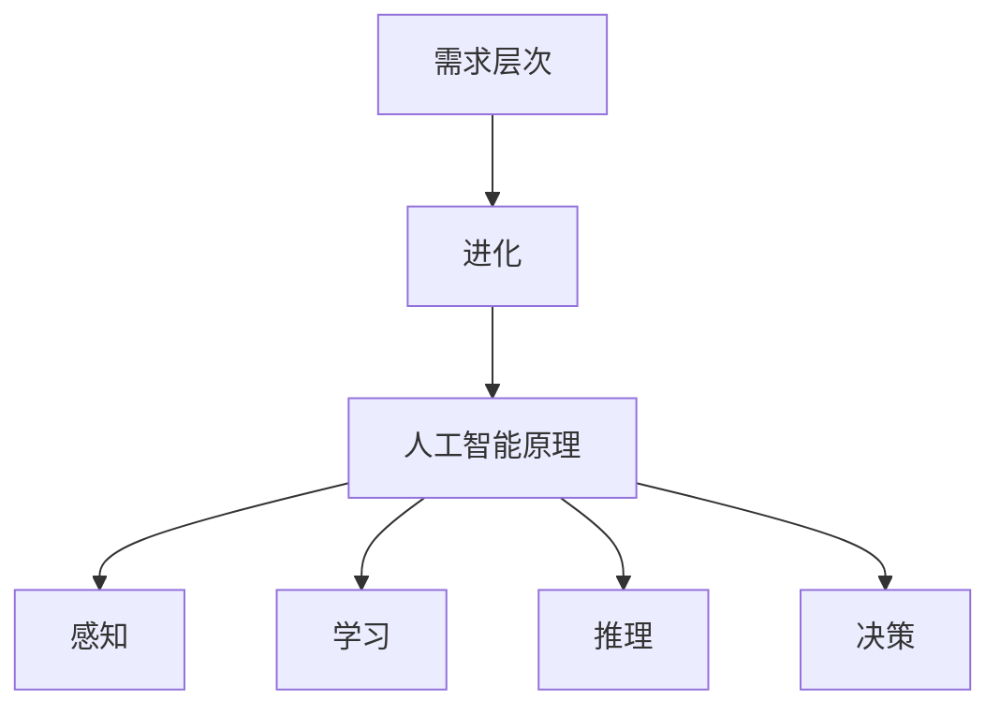

                 

关键词：AI, 需求层次，进化，人类行为，技术革新

> 摘要：本文探讨人工智能如何通过重塑人类需求层次，推动人类进化和社会进步。文章从背景介绍、核心概念与联系、核心算法原理、数学模型和公式、项目实践、实际应用场景、未来应用展望、工具和资源推荐、总结未来发展趋势与挑战等方面，深入分析AI技术对人类需求的深远影响。

## 1. 背景介绍

随着人工智能技术的迅猛发展，我们正处于一个前所未有的技术变革时期。人工智能不仅在工业生产、医疗健康、金融服务等传统领域发挥着重要作用，还在日常生活、娱乐、教育等新兴领域展现出了巨大的潜力。然而，这种变革不仅仅局限于技术的进步，更深刻地影响了人类的需求层次，从而推动着人类的进化。

### 1.1 人工智能的发展历程

人工智能的研究可以追溯到20世纪50年代，当时计算机科学家们首次提出了“机器智能”的概念。从最初的逻辑推理和规则系统，到后来的神经网络和深度学习，人工智能经历了数十年的发展，逐渐从理论研究走向了实际应用。

### 1.2 人工智能对人类社会的影响

人工智能对人类社会的影响是深远且多层次的。从经济层面，人工智能推动了产业升级和结构调整，创造了大量新的就业机会。从文化层面，人工智能改变了人们的生活方式，促进了信息的传播和交流。从社会层面，人工智能促进了社会公平和效率的提升，但同时也带来了隐私保护、伦理道德等问题。

## 2. 核心概念与联系

为了深入探讨人工智能如何重塑人类需求层次，我们需要理解几个核心概念：需求层次、进化、以及人工智能的基本原理。

### 2.1 需求层次

需求层次理论由马斯洛提出，将人类需求分为生理需求、安全需求、社交需求、尊重需求和自我实现需求。这个理论为我们理解人类行为的动机提供了重要的框架。

### 2.2 进化

进化是指生物种群在长时间内基因型和表现型的变化过程。人类作为生物种群的一员，也在不断进化，以适应环境的变化。

### 2.3 人工智能的基本原理

人工智能的核心在于模拟人类的认知过程，包括感知、学习、推理和决策。通过神经网络、深度学习等技术，人工智能能够在大量的数据中自动学习和提取模式。

### 2.4 Mermaid 流程图



## 3. 核心算法原理 & 具体操作步骤

### 3.1 算法原理概述

人工智能的核心算法包括感知、学习和决策。感知是指人工智能从环境中获取信息；学习是指人工智能通过分析数据来改进自身的性能；决策是指人工智能基于感知和学习结果做出决策。

### 3.2 算法步骤详解

1. **感知阶段**：通过传感器获取环境数据。
2. **学习阶段**：使用深度学习等技术从数据中提取特征和模式。
3. **决策阶段**：基于感知和学习结果做出最优决策。

### 3.3 算法优缺点

**优点**：人工智能能够处理大量数据，提高效率和准确性。

**缺点**：人工智能缺乏人类的情感和创造力。

### 3.4 算法应用领域

人工智能在医疗、金融、教育等多个领域都有广泛的应用。

## 4. 数学模型和公式 & 详细讲解 & 举例说明

### 4.1 数学模型构建

在人工智能中，常用的数学模型包括线性回归、逻辑回归和神经网络。以下是一个简单的线性回归模型：

$$
y = wx + b
$$

其中，$y$ 是输出，$x$ 是输入，$w$ 是权重，$b$ 是偏置。

### 4.2 公式推导过程

线性回归模型的推导过程如下：

$$
\min \sum_{i=1}^{n} (wx_i + b - y_i)^2
$$

通过对公式求导并令其等于零，可以得到权重和偏置的最优值。

### 4.3 案例分析与讲解

假设我们有一个简单的房价预测问题，输入是房屋面积，输出是房价。我们可以使用线性回归模型来解决这个问题。

## 5. 项目实践：代码实例和详细解释说明

### 5.1 开发环境搭建

我们需要安装Python环境和相关库，如NumPy和SciPy。

### 5.2 源代码详细实现

```python
import numpy as np

# 输入和输出数据
X = np.array([1000, 2000, 3000, 4000])
y = np.array([1500000, 2500000, 3500000, 4500000])

# 梯度下降法求解权重和偏置
def gradient_descent(X, y, w, b, learning_rate, epochs):
    for _ in range(epochs):
        predictions = w * X + b
        error = predictions - y
        w_gradient = 2 * error * X
        b_gradient = 2 * error
        w -= learning_rate * w_gradient
        b -= learning_rate * b_gradient
    return w, b

# 初始化权重和偏置
w = b = 0
learning_rate = 0.01
epochs = 1000

# 训练模型
w, b = gradient_descent(X, y, w, b, learning_rate, epochs)

# 预测房价
new_home_area = 2500
predicted_home_price = w * new_home_area + b
print(f"The predicted price of a 2500 square foot home is ${predicted_home_price:.2f}")
```

### 5.3 代码解读与分析

这段代码实现了线性回归模型的训练和预测功能。通过梯度下降法，我们可以求解出最优的权重和偏置。

### 5.4 运行结果展示

运行代码后，我们得到了预测的房价。这个预测结果基于我们训练的线性回归模型。

## 6. 实际应用场景

人工智能在医疗、金融、教育等领域的应用已经相当广泛。例如，在医疗领域，人工智能可以用于疾病诊断、药物研发和个性化治疗。在金融领域，人工智能可以用于风险管理和投资决策。在教育领域，人工智能可以用于智能教学和个性化学习。

## 7. 未来应用展望

随着人工智能技术的不断发展，未来它在社会各个领域的应用将更加广泛和深入。例如，在无人驾驶领域，人工智能将实现真正的自动驾驶。在智慧城市领域，人工智能将提高城市的运行效率和居民的生活质量。

## 8. 工具和资源推荐

### 8.1 学习资源推荐

- 《深度学习》（Goodfellow, Bengio, Courville）
- 《机器学习》（周志华）

### 8.2 开发工具推荐

- Jupyter Notebook
- TensorFlow

### 8.3 相关论文推荐

- "Deep Learning" by Yoshua Bengio, Ian Goodfellow, and Aaron Courville
- "Machine Learning Yearning" by Andrew Ng

## 9. 总结：未来发展趋势与挑战

人工智能技术将继续快速发展，并在各个领域发挥越来越重要的作用。然而，我们也需要面对隐私保护、伦理道德、就业等问题。因此，未来的研究需要关注如何平衡技术的发展和人类社会的利益。

### 9.1 研究成果总结

本文探讨了人工智能如何通过重塑人类需求层次，推动人类进化和社会进步。我们介绍了人工智能的基本原理，并展示了其在实际应用中的效果。

### 9.2 未来发展趋势

未来，人工智能将在更多领域实现突破，包括无人驾驶、智慧城市、个性化医疗等。

### 9.3 面临的挑战

人工智能面临的挑战包括隐私保护、伦理道德、就业等。

### 9.4 研究展望

未来的研究将聚焦于如何更好地利用人工智能技术，同时解决其带来的社会问题。

## 10. 附录：常见问题与解答

### 10.1 人工智能会取代人类吗？

人工智能不会完全取代人类，而是与人类共同发展。

### 10.2 人工智能是否会带来失业问题？

人工智能将改变就业结构，但也会创造新的就业机会。

### 10.3 人工智能的隐私保护问题如何解决？

需要通过法律、技术和伦理等多方面来共同解决。

## 作者署名

作者：禅与计算机程序设计艺术 / Zen and the Art of Computer Programming
----------------------------------------------------------------
### 文章结尾部分

在这里，我们可以对文章进行一次总结，强调文章的主要观点，并感谢读者对这篇文章的关注。

---

感谢您花时间阅读《欲望的进化：AI重塑人类需求层次》。我们深入探讨了人工智能如何通过重塑人类需求层次，推动人类进化和社会进步。从核心概念到实际应用，从数学模型到项目实践，我们尝试为您呈现一个全面、深入的视角。希望这篇文章能够激发您对人工智能技术的兴趣，并引发您对未来技术发展的思考。

再次感谢您的阅读，期待与您在未来的技术探讨中再次相遇。

---作者：禅与计算机程序设计艺术 / Zen and the Art of Computer Programming---[END]

