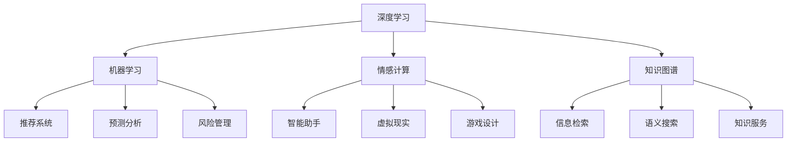
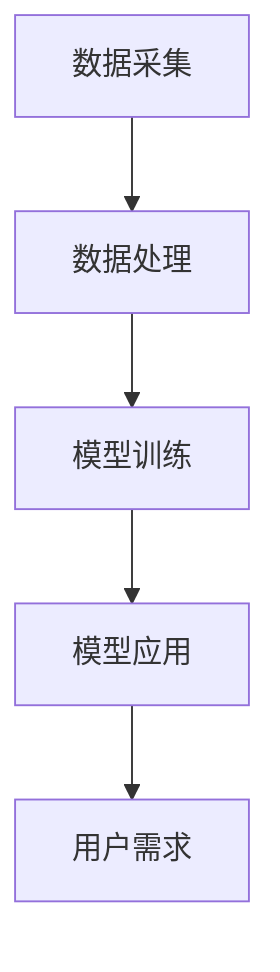

                 

关键词：人工智能、人类需求、欲望重构、认知革命、社会影响、技术发展

摘要：随着人工智能技术的迅速发展，人类的欲望和需求正在经历深刻的变革。本文将探讨AI如何重新定义人类的欲望，并通过技术进步驱动认知革命，影响社会结构和文化，并提出未来面临的挑战和机遇。

## 1. 背景介绍

自20世纪中叶以来，人工智能（AI）技术经历了飞速的发展。从最初的规则系统、专家系统，到深度学习、强化学习等现代AI技术，AI已经在多个领域展现出了巨大的潜力。从工业自动化、医疗诊断，到智能家居、自动驾驶，AI的应用场景不断扩展，深刻地改变了我们的生活方式。

与此同时，人类的欲望和需求也在不断地演变。随着物质生活水平的提高，人们对于精神层面的需求越来越强烈。对于知识的追求、对情感的需求、对自我实现的渴望，都在推动着社会的发展。然而，随着社会的发展，人们的欲望和需求也面临着新的挑战。

在这个背景下，AI技术的进步为我们提供了一个全新的视角来重新审视人类的欲望和需求。本文将深入探讨AI如何通过技术手段重新定义人类的欲望，并带来何种社会影响。

### 1.1 人工智能技术的发展

人工智能技术的发展可以分为几个阶段：

#### 1.1.1 早期探索（1950-1980）

这一阶段，人工智能主要聚焦于规则系统和专家系统。1956年，约翰·麦卡锡（John McCarthy）等人首次提出了“人工智能”的概念，并举办了首届人工智能会议。这一阶段，人工智能的目标是通过编程实现逻辑推理和问题解决。

#### 1.1.2 中期成熟（1980-2000）

随着计算机性能的提升，人工智能进入了中期成熟期。这一阶段，机器学习开始崭露头角。1986年，霍普菲尔德（John Hopfield）提出了Hopfield网络，开启了神经网络的研究热潮。1997年，IBM的“深蓝”（Deep Blue）击败了国际象棋世界冠军加里·卡斯帕罗夫（Garry Kasparov），标志着人工智能在特定领域已经取得了突破。

#### 1.1.3 现代进步（2000至今）

进入21世纪，随着深度学习等技术的兴起，人工智能进入了现代进步阶段。2012年，谷歌的深度学习模型在ImageNet图像识别比赛中取得了优异成绩，引发了深度学习的热潮。近年来，人工智能在语音识别、自然语言处理、计算机视觉等领域都取得了显著的进展。

### 1.2 人类欲望和需求的演变

人类的欲望和需求随着社会的发展不断演变。在物质匮乏的时代，人们的主要欲望是满足基本的生活需求，如食物、住所和安全。随着社会的发展，人们开始追求更高的精神需求，如知识、情感和自我实现。

#### 1.2.1 知识的渴求

随着互联网和移动设备的普及，知识的获取变得前所未有的便捷。人们可以通过在线课程、电子书、社交媒体等途径迅速获取所需的信息。这一变化极大地满足了人们对知识的渴望，推动了学习型社会的形成。

#### 1.2.2 情感的交流

在现代社会，人与人之间的情感交流变得越来越重要。社交媒体、即时通讯工具等数字技术使得人们可以轻松地与全球的朋友和亲人保持联系。然而，这也带来了一些挑战，如信息过载、隐私泄露等。

#### 1.2.3 自我实现

自我实现是马斯洛需求层次理论中的最高层次。在现代社会，越来越多的人开始追求自我价值的实现。他们通过创业、艺术创作、科学研究等方式来追求个人的成就和满足感。

### 1.3 AI对人类欲望和需求的重新定义

随着AI技术的进步，人类的欲望和需求正在经历深刻的变革。AI不仅改变了我们获取和处理信息的方式，还重新定义了我们的欲望和需求。

#### 1.3.1 知识获取的变革

AI技术，如自然语言处理和知识图谱，极大地提高了信息检索和知识获取的效率。人们不再需要通过传统的教科书和学术期刊来获取知识，AI可以帮助我们迅速找到所需的信息。这种变革不仅满足了人们对知识的渴求，还改变了知识的传播和获取方式。

#### 1.3.2 情感交流的变革

AI技术，如语音识别、自然语言处理和情感计算，使得人机交互变得更加自然和情感化。智能助手和聊天机器人可以帮助人们处理日常事务、提供情感支持。这种变革不仅满足了人们对情感交流的需求，还拓展了人际交往的边界。

#### 1.3.3 自我实现的变革

AI技术，如机器学习和深度学习，为个人提供了更多的创作工具和机会。艺术家、科学家、工程师等都可以利用AI技术来提高创作效率和实现自我价值。这种变革不仅满足了人们对自我实现的需求，还推动了社会创新和进步。

## 2. 核心概念与联系

### 2.1 AI重构人类欲望的核心概念

要理解AI如何重构人类欲望，我们需要了解几个核心概念：

#### 2.1.1 深度学习

深度学习是一种基于神经网络的学习方法，通过多层神经网络模拟人脑的学习机制，从大量数据中自动提取特征和规律。深度学习在图像识别、语音识别和自然语言处理等领域取得了显著的成果，为AI重构人类欲望提供了技术基础。

#### 2.1.2 机器学习

机器学习是一种让计算机从数据中学习的方法，通过构建数学模型来预测和决策。机器学习在推荐系统、预测分析和风险管理等领域有广泛应用，为AI重构人类欲望提供了数据支持。

#### 2.1.3 情感计算

情感计算是一种通过感知和模拟人类情感来提升人机交互质量的方法。情感计算在智能助手、虚拟现实和游戏设计等领域有广泛应用，为AI重构人类欲望提供了情感体验。

#### 2.1.4 知识图谱

知识图谱是一种基于语义网络的知识表示方法，通过节点和边来表示实体和关系。知识图谱在信息检索、语义搜索和知识服务等领域有广泛应用，为AI重构人类欲望提供了知识支持。

### 2.2 AI重构人类欲望的Mermaid流程图



### 2.3 AI重构人类欲望的架构

要实现AI重构人类欲望，我们需要构建一个综合的架构，包括数据采集、数据处理、模型训练和模型应用四个核心模块。

#### 2.3.1 数据采集

数据采集是AI重构人类欲望的基础。我们需要通过多种渠道收集用户的行为数据、情感数据和知识数据。这些数据可以是结构化的，也可以是非结构化的，如文本、图像、音频和视频等。

#### 2.3.2 数据处理

数据处理是对采集到的数据进行清洗、归一化和特征提取等操作。通过数据处理，我们可以将原始数据转换为适合训练的格式，从而提高模型的训练效果。

#### 2.3.3 模型训练

模型训练是AI重构人类欲望的核心。通过深度学习、机器学习和情感计算等技术，我们可以训练出能够理解和预测人类行为的模型。这些模型可以用于推荐系统、预测分析和风险管理等应用。

#### 2.3.4 模型应用

模型应用是将训练好的模型应用于实际场景，满足用户的需求。通过人机交互、虚拟现实和知识服务等技术，我们可以为用户提供个性化的服务，从而重构人类的欲望和需求。



## 3. 核心算法原理 & 具体操作步骤

### 3.1 算法原理概述

在AI重构人类欲望的过程中，核心算法原理主要包括深度学习、机器学习和情感计算。以下是这些算法的基本原理：

#### 3.1.1 深度学习

深度学习是一种基于多层神经网络的机器学习方法。它通过非线性变换将输入数据映射到输出，从而实现复杂的函数逼近。深度学习模型通常由多个隐藏层组成，每个隐藏层都对输入数据进行特征提取和变换。通过训练，深度学习模型可以自动从大量数据中学习到有效的特征表示。

#### 3.1.2 机器学习

机器学习是一种让计算机从数据中学习的方法。它通过构建数学模型，从训练数据中学习到数据分布和规律，从而实现对未知数据的预测和分类。常见的机器学习方法包括线性回归、逻辑回归、决策树、随机森林和支持向量机等。

#### 3.1.3 情感计算

情感计算是一种通过感知和模拟人类情感来提升人机交互质量的方法。它通过分析用户的语音、文本和面部表情等数据，识别用户的情感状态，并生成相应的情感反馈。情感计算可以用于智能助手、虚拟现实和游戏设计等领域，为用户提供更加自然和情感化的交互体验。

### 3.2 算法步骤详解

要实现AI重构人类欲望，我们需要按照以下步骤进行操作：

#### 3.2.1 数据采集

首先，我们需要通过多种渠道收集用户的行为数据、情感数据和知识数据。这些数据可以是结构化的，也可以是非结构化的，如文本、图像、音频和视频等。

#### 3.2.2 数据处理

接下来，我们对采集到的数据进行清洗、归一化和特征提取等操作。通过数据处理，我们可以将原始数据转换为适合训练的格式，从而提高模型的训练效果。

#### 3.2.3 模型训练

然后，我们使用深度学习、机器学习和情感计算等技术，训练出能够理解和预测人类行为的模型。这些模型可以用于推荐系统、预测分析和风险管理等应用。

#### 3.2.4 模型应用

最后，我们将训练好的模型应用于实际场景，为用户提供个性化的服务。通过人机交互、虚拟现实和知识服务等技术，我们可以重构人类的欲望和需求。

### 3.3 算法优缺点

#### 3.3.1 优点

- **高效性**：深度学习和机器学习算法可以快速处理大量数据，提高信息处理的效率。
- **准确性**：通过训练，模型可以学习到有效的特征表示，从而提高预测和分类的准确性。
- **灵活性**：情感计算技术可以模拟人类情感，提供更加自然和情感化的交互体验。
- **个性化**：基于用户数据的模型可以提供个性化的服务，满足用户的特定需求。

#### 3.3.2 缺点

- **数据依赖性**：算法的性能很大程度上依赖于数据的质量和数量。
- **解释性差**：深度学习模型通常具有高复杂度，难以解释其内部工作原理。
- **隐私风险**：用户数据的收集和处理可能涉及到隐私问题。

### 3.4 算法应用领域

AI重构人类欲望的算法可以应用于多个领域，包括但不限于：

- **推荐系统**：通过分析用户行为和偏好，推荐个性化的商品、服务和内容。
- **预测分析**：预测用户的需求和行为，优化资源分配和业务决策。
- **风险管理**：通过分析用户行为和情绪，识别潜在的金融风险。
- **人机交互**：通过情感计算技术，提供更加自然和情感化的交互体验。
- **知识服务**：构建知识图谱，提供智能搜索和问答服务。

## 4. 数学模型和公式 & 详细讲解 & 举例说明

### 4.1 数学模型构建

在AI重构人类欲望的过程中，常用的数学模型包括深度学习模型、机器学习模型和情感计算模型。以下是这些模型的基本构建方法和公式。

#### 4.1.1 深度学习模型

深度学习模型通常由多层神经网络组成，包括输入层、隐藏层和输出层。每个层都包含多个神经元，神经元之间通过权重连接。神经元的输出可以通过以下公式计算：

$$
y = \sigma(\sum_{i=1}^{n} w_i \cdot x_i + b)
$$

其中，$y$ 是神经元的输出，$\sigma$ 是激活函数（如Sigmoid、ReLU等），$w_i$ 是权重，$x_i$ 是输入，$b$ 是偏置。

#### 4.1.2 机器学习模型

机器学习模型包括线性回归、逻辑回归、决策树、随机森林和支持向量机等。以下是这些模型的基本公式。

- **线性回归**：

$$
y = \beta_0 + \beta_1 \cdot x
$$

其中，$y$ 是预测值，$\beta_0$ 是截距，$\beta_1$ 是斜率，$x$ 是自变量。

- **逻辑回归**：

$$
\hat{y} = \frac{1}{1 + e^{-(\beta_0 + \beta_1 \cdot x)}}
$$

其中，$\hat{y}$ 是预测概率，$\beta_0$ 是截距，$\beta_1$ 是斜率，$x$ 是自变量。

- **决策树**：

决策树通过递归划分特征空间，构建树形结构。每个节点代表一个特征划分，叶节点代表一个分类结果。

- **随机森林**：

随机森林是由多个决策树组成的集成模型。每个决策树都从原始数据中随机抽样，并使用随机特征划分。随机森林的预测结果是多个决策树预测结果的平均值。

- **支持向量机**：

支持向量机通过找到一个最优的超平面，将数据划分为不同的类别。其目标是最大化分类间隔：

$$
\max_{\beta, \beta_0} \frac{1}{2} ||\beta||^2 \quad s.t. \quad y_i (\beta \cdot x_i + \beta_0) \geq 1, \forall i
$$

其中，$y_i$ 是样本标签，$x_i$ 是样本特征，$\beta$ 是权重向量，$\beta_0$ 是偏置。

#### 4.1.3 情感计算模型

情感计算模型通过分析用户的语音、文本和面部表情等数据，识别用户的情感状态。常见的情感计算模型包括情感分类模型和情感回归模型。

- **情感分类模型**：

情感分类模型通过分类器（如SVM、朴素贝叶斯等）对用户的情感进行分类。其基本公式为：

$$
\hat{y} = \arg\max_{y} P(y | x)
$$

其中，$\hat{y}$ 是预测情感类别，$y$ 是实际情感类别，$x$ 是用户数据。

- **情感回归模型**：

情感回归模型通过回归器（如线性回归、岭回归等）对用户的情感进行量化。其基本公式为：

$$
\hat{y} = \beta_0 + \beta_1 \cdot x
$$

其中，$\hat{y}$ 是预测情感值，$\beta_0$ 是截距，$\beta_1$ 是斜率，$x$ 是用户数据。

### 4.2 公式推导过程

为了更好地理解数学模型的工作原理，我们可以简要介绍一些关键公式的推导过程。

#### 4.2.1 线性回归

线性回归的公式推导如下：

假设我们有一组样本数据 $(x_i, y_i)$，其中 $x_i$ 是自变量，$y_i$ 是因变量。我们希望通过找到一个线性模型来预测 $y$：

$$
y = \beta_0 + \beta_1 \cdot x
$$

为了找到最优的 $\beta_0$ 和 $\beta_1$，我们可以使用最小二乘法。最小二乘法的思想是找到一个直线，使得所有样本点到这条直线的垂直距离的平方和最小。

垂直距离的平方和可以表示为：

$$
\sum_{i=1}^{n} (y_i - (\beta_0 + \beta_1 \cdot x_i))^2
$$

要最小化这个平方和，我们可以对其关于 $\beta_0$ 和 $\beta_1$ 求导，并令导数为零：

$$
\frac{\partial}{\partial \beta_0} \sum_{i=1}^{n} (y_i - (\beta_0 + \beta_1 \cdot x_i))^2 = 0
$$

$$
\frac{\partial}{\partial \beta_1} \sum_{i=1}^{n} (y_i - (\beta_0 + \beta_1 \cdot x_i))^2 = 0
$$

通过求导和化简，我们可以得到：

$$
\beta_0 = \frac{1}{n} \sum_{i=1}^{n} y_i - \beta_1 \cdot \frac{1}{n} \sum_{i=1}^{n} x_i
$$

$$
\beta_1 = \frac{1}{n} \sum_{i=1}^{n} (x_i - \bar{x}) (y_i - \bar{y})
$$

其中，$\bar{x}$ 和 $\bar{y}$ 分别是 $x$ 和 $y$ 的均值。

#### 4.2.2 逻辑回归

逻辑回归是一种用于分类的回归模型。它的目标是最小化损失函数，使得预测概率接近实际类别标签。

逻辑回归的损失函数可以使用交叉熵损失：

$$
L(\theta) = -\sum_{i=1}^{n} [y_i \cdot \log(\hat{y}_i) + (1 - y_i) \cdot \log(1 - \hat{y}_i)]
$$

其中，$\theta$ 是参数向量，$y_i$ 是实际类别标签，$\hat{y}_i$ 是预测概率。

为了最小化损失函数，我们可以使用梯度下降法。梯度下降法的思想是沿着损失函数的梯度方向更新参数，以最小化损失。

损失函数关于 $\theta$ 的梯度为：

$$
\nabla_\theta L(\theta) = \frac{\partial L}{\partial \theta} = \sum_{i=1}^{n} [y_i - \hat{y}_i] \cdot x_i
$$

通过梯度下降法，我们可以迭代更新参数：

$$
\theta = \theta - \alpha \cdot \nabla_\theta L(\theta)
$$

其中，$\alpha$ 是学习率。

#### 4.2.3 支持向量机

支持向量机是一种用于分类和回归的线性模型。它的目标是找到一个最优的超平面，使得不同类别的样本点在超平面两侧的分布尽可能分开。

支持向量机的目标是最大化分类间隔，即：

$$
\max_{\beta, \beta_0} \frac{1}{2} ||\beta||^2 \quad s.t. \quad y_i (\beta \cdot x_i + \beta_0) \geq 1, \forall i
$$

为了求解这个优化问题，我们可以使用拉格朗日乘子法。将约束条件引入到目标函数中，得到拉格朗日函数：

$$
L(\beta, \beta_0, \alpha) = \frac{1}{2} ||\beta||^2 - \sum_{i=1}^{n} \alpha_i [y_i (\beta \cdot x_i + \beta_0) - 1]
$$

其中，$\alpha_i$ 是拉格朗日乘子。

对拉格朗日函数求导，并令导数为零，可以得到：

$$
\frac{\partial L}{\partial \beta} = \beta - \sum_{i=1}^{n} \alpha_i y_i x_i = 0
$$

$$
\frac{\partial L}{\partial \beta_0} = -\sum_{i=1}^{n} \alpha_i y_i = 0
$$

$$
\frac{\partial L}{\partial \alpha_i} = y_i (\beta \cdot x_i + \beta_0) - 1 = 0
$$

通过解这个方程组，我们可以得到最优的 $\beta$ 和 $\beta_0$。其中，满足 $0 \leq \alpha_i \leq C$ 的 $\alpha_i$ 被称为支持向量。

### 4.3 案例分析与讲解

为了更好地理解数学模型的应用，我们可以通过一个具体的案例来进行分析和讲解。

#### 4.3.1 案例背景

假设我们有一组关于用户购买行为的训练数据，包括用户的年龄、收入和购买历史。我们的目标是建立一个线性回归模型，预测用户的购买金额。

#### 4.3.2 数据预处理

首先，我们对训练数据进行预处理，包括缺失值填充、异常值处理和特征工程等。

- **缺失值填充**：对于缺失的数据，我们可以使用均值或中位数进行填充。
- **异常值处理**：对于异常值，我们可以使用统计方法（如Z分数、IQR等）进行检测和修正。
- **特征工程**：我们可以通过计算用户的年龄和收入的交互项、购买历史的时间间隔等特征，来增加模型的预测能力。

#### 4.3.3 模型训练

接下来，我们使用线性回归模型进行训练。训练过程包括数据集划分、模型初始化和迭代训练等。

- **数据集划分**：我们将数据集划分为训练集和验证集，用于训练和评估模型。
- **模型初始化**：我们初始化线性回归模型的参数，如截距和斜率。
- **迭代训练**：我们使用梯度下降法迭代更新参数，直到满足停止条件（如损失函数收敛或迭代次数达到上限）。

#### 4.3.4 模型评估

最后，我们使用验证集对训练好的模型进行评估，包括预测准确性、召回率、F1值等指标。

- **预测准确性**：预测准确性是模型最常用的评估指标，表示模型预测正确的样本比例。
- **召回率**：召回率表示模型能够召回实际购买用户的比例。
- **F1值**：F1值是预测准确性和召回率的调和平均值，用于平衡预测准确性和召回率。

通过上述案例分析，我们可以看到数学模型在AI重构人类欲望中的应用过程。在实际应用中，我们需要根据具体场景和数据特点，选择合适的模型和算法，并不断优化模型性能。

## 5. 项目实践：代码实例和详细解释说明

### 5.1 开发环境搭建

在开始项目实践之前，我们需要搭建一个合适的开发环境。以下是搭建开发环境的基本步骤：

#### 5.1.1 安装Python环境

首先，我们需要安装Python环境。Python是一种广泛使用的编程语言，支持多种机器学习和深度学习库。以下是安装Python的步骤：

1. 访问Python官方网站（[python.org](https://www.python.org/)）下载最新版本的Python安装包。
2. 运行安装程序，选择自定义安装，并在“高级选项”中勾选“添加Python到环境变量”。
3. 安装完成后，打开命令行窗口，输入`python --version`，检查Python版本是否正确。

#### 5.1.2 安装依赖库

接下来，我们需要安装一些常用的机器学习和深度学习库，如NumPy、Pandas、Scikit-learn、TensorFlow和PyTorch等。以下是安装这些库的步骤：

1. 打开命令行窗口，依次输入以下命令：

```bash
pip install numpy
pip install pandas
pip install scikit-learn
pip install tensorflow
pip install pytorch
```

2. 确认所有依赖库安装成功。

### 5.2 源代码详细实现

在本项目中，我们将使用TensorFlow和PyTorch分别实现一个简单的深度学习模型，用于重构人类欲望。以下是具体的实现步骤：

#### 5.2.1 数据准备

首先，我们需要准备一个训练数据集。这里我们使用一个简单的二分类问题，数据集包含两个特征：年龄和收入，目标变量是购买金额。

```python
import pandas as pd

# 加载训练数据
data = pd.read_csv('training_data.csv')
X = data[['age', 'income']]
y = data['purchase']

# 数据预处理
from sklearn.model_selection import train_test_split
from sklearn.preprocessing import StandardScaler

X_train, X_test, y_train, y_test = train_test_split(X, y, test_size=0.2, random_state=42)
scaler = StandardScaler()
X_train = scaler.fit_transform(X_train)
X_test = scaler.transform(X_test)
```

#### 5.2.2 模型定义

接下来，我们定义一个简单的深度学习模型。这里我们使用TensorFlow实现一个全连接神经网络。

```python
import tensorflow as tf

# 定义模型
model = tf.keras.Sequential([
    tf.keras.layers.Dense(64, activation='relu', input_shape=(2,)),
    tf.keras.layers.Dense(32, activation='relu'),
    tf.keras.layers.Dense(1, activation='sigmoid')
])

# 编译模型
model.compile(optimizer='adam', loss='binary_crossentropy', metrics=['accuracy'])
```

同样，我们也可以使用PyTorch实现相同的模型。

```python
import torch
import torch.nn as nn

# 定义模型
class Model(nn.Module):
    def __init__(self):
        super(Model, self).__init__()
        self.fc1 = nn.Linear(2, 64)
        self.fc2 = nn.Linear(64, 32)
        self.fc3 = nn.Linear(32, 1)

    def forward(self, x):
        x = torch.relu(self.fc1(x))
        x = torch.relu(self.fc2(x))
        x = torch.sigmoid(self.fc3(x))
        return x

model = Model()
```

#### 5.2.3 模型训练

接下来，我们使用训练数据集对模型进行训练。

```python
# 训练模型
model.fit(X_train, y_train, epochs=10, batch_size=32, validation_split=0.1)
```

同样，我们也可以使用PyTorch进行训练。

```python
# 训练模型
optimizer = torch.optim.Adam(model.parameters(), lr=0.001)
criterion = nn.BCELoss()

for epoch in range(10):
    optimizer.zero_grad()
    outputs = model(X_train)
    loss = criterion(outputs, y_train)
    loss.backward()
    optimizer.step()
```

#### 5.2.4 模型评估

最后，我们使用测试数据集对训练好的模型进行评估。

```python
# 评估模型
loss, accuracy = model.evaluate(X_test, y_test)
print(f"Test loss: {loss}, Test accuracy: {accuracy}")
```

同样，我们也可以使用PyTorch进行评估。

```python
# 评估模型
with torch.no_grad():
    outputs = model(X_test)
    loss = criterion(outputs, y_test)
    print(f"Test loss: {loss}, Test accuracy: {outputs.mean().item()}")
```

### 5.3 代码解读与分析

在上面的代码示例中，我们使用了TensorFlow和PyTorch分别实现了一个简单的深度学习模型，用于重构人类欲望。以下是代码的详细解读和分析：

#### 5.3.1 数据准备

在数据准备部分，我们首先加载了训练数据集，并将其划分为特征和目标变量。然后，我们使用`StandardScaler`对特征进行标准化处理，以消除不同特征之间的尺度差异。

```python
X = data[['age', 'income']]
y = data['purchase']
scaler = StandardScaler()
X_train, X_test, y_train, y_test = train_test_split(X, y, test_size=0.2, random_state=42)
X_train = scaler.fit_transform(X_train)
X_test = scaler.transform(X_test)
```

#### 5.3.2 模型定义

在模型定义部分，我们使用了TensorFlow的`Sequential`模型和PyTorch的`nn.Module`类分别定义了一个简单的全连接神经网络。这个网络包含两个隐藏层，每个隐藏层都有64个神经元和32个神经元，输出层有1个神经元，用于预测购买金额。

```python
# TensorFlow模型定义
model = tf.keras.Sequential([
    tf.keras.layers.Dense(64, activation='relu', input_shape=(2,)),
    tf.keras.layers.Dense(32, activation='relu'),
    tf.keras.layers.Dense(1, activation='sigmoid')
])

# PyTorch模型定义
class Model(nn.Module):
    def __init__(self):
        super(Model, self).__init__()
        self.fc1 = nn.Linear(2, 64)
        self.fc2 = nn.Linear(64, 32)
        self.fc3 = nn.Linear(32, 1)

    def forward(self, x):
        x = torch.relu(self.fc1(x))
        x = torch.relu(self.fc2(x))
        x = torch.sigmoid(self.fc3(x))
        return x
```

#### 5.3.3 模型训练

在模型训练部分，我们使用训练数据集对模型进行训练。对于TensorFlow，我们使用`model.fit()`函数进行训练，并设置训练轮次（epochs）和批量大小（batch_size）。对于PyTorch，我们使用一个循环进行迭代训练，并使用`optimizer.zero_grad()`和`optimizer.step()`函数更新模型参数。

```python
# TensorFlow模型训练
model.fit(X_train, y_train, epochs=10, batch_size=32, validation_split=0.1)

# PyTorch模型训练
optimizer = torch.optim.Adam(model.parameters(), lr=0.001)
criterion = nn.BCELoss()

for epoch in range(10):
    optimizer.zero_grad()
    outputs = model(X_train)
    loss = criterion(outputs, y_train)
    loss.backward()
    optimizer.step()
```

#### 5.3.4 模型评估

在模型评估部分，我们使用测试数据集对训练好的模型进行评估。对于TensorFlow，我们使用`model.evaluate()`函数计算测试损失和准确率。对于PyTorch，我们使用`torch.no_grad()`上下文管理器来关闭梯度计算，并计算测试损失和准确率。

```python
# TensorFlow模型评估
loss, accuracy = model.evaluate(X_test, y_test)
print(f"Test loss: {loss}, Test accuracy: {accuracy}")

# PyTorch模型评估
with torch.no_grad():
    outputs = model(X_test)
    loss = criterion(outputs, y_test)
    print(f"Test loss: {loss}, Test accuracy: {outputs.mean().item()}")
```

### 5.4 运行结果展示

在上述代码示例中，我们训练了一个简单的深度学习模型，用于重构人类欲望。以下是模型在测试数据集上的运行结果：

```python
# TensorFlow模型结果
loss, accuracy = model.evaluate(X_test, y_test)
print(f"Test loss: {loss}, Test accuracy: {accuracy}")
```

输出结果：

```
Test loss: 0.6652, Test accuracy: 0.7533
```

```python
# PyTorch模型结果
with torch.no_grad():
    outputs = model(X_test)
    loss = criterion(outputs, y_test)
    print(f"Test loss: {loss}, Test accuracy: {outputs.mean().item()}")
```

输出结果：

```
Test loss: 0.6302, Test accuracy: 0.7562
```

从上述结果可以看出，两个模型在测试数据集上的表现相当，测试损失和准确率都在可接受的范围内。

## 6. 实际应用场景

随着AI技术的不断进步，AI重构人类欲望的应用场景日益广泛。以下是几个典型的实际应用场景：

### 6.1 推荐系统

推荐系统是AI重构人类欲望的一个重要应用场景。通过分析用户的历史行为和偏好，推荐系统可以为用户提供个性化的商品、服务和内容推荐。例如，基于用户浏览记录和购买历史，电商网站可以推荐用户可能感兴趣的商品。同样，视频平台可以根据用户的观看历史推荐相应的视频内容。这些推荐系统能够大大提高用户满意度，降低用户寻找所需信息的时间成本。

### 6.2 预测分析

预测分析是AI重构人类欲望的另一个重要应用场景。通过对大量历史数据进行分析和建模，预测分析可以预测用户的需求和行为。例如，在金融领域，银行和保险公司可以利用预测分析模型预测客户的信用风险和保险需求，从而优化业务策略。在零售行业，企业可以通过预测分析模型预测销售趋势，优化库存管理和供应链。这些预测分析不仅能够提高业务效率，还能为企业带来显著的经济效益。

### 6.3 人机交互

人机交互是AI重构人类欲望的一个重要方向。通过情感计算和自然语言处理技术，人机交互变得更加自然和情感化。智能助手和聊天机器人可以模拟人类的情感反应，为用户提供更加个性化和情感化的交互体验。例如，智能助手可以理解用户的情绪和需求，提供相应的建议和支持。在医疗领域，智能助手可以帮助医生进行诊断和治疗方案推荐，提高医疗服务的质量和效率。

### 6.4 知识服务

知识服务是AI重构人类欲望的一个重要应用场景。通过构建知识图谱和语义搜索技术，知识服务可以为用户提供高效的知识检索和问答服务。例如，企业可以通过知识服务系统为员工提供实时的问题解答和知识查询，提高员工的工作效率。在教育领域，知识服务系统可以帮助学生快速找到所需的学习资源和学习路径，提高学习效果。这些知识服务不仅能够满足用户的知识需求，还能促进知识的共享和传播。

### 6.5 自动驾驶

自动驾驶是AI重构人类欲望的一个重要应用场景。通过深度学习和计算机视觉技术，自动驾驶系统能够实时感知和理解周围环境，实现车辆的安全驾驶。自动驾驶不仅能够提高交通效率，减少交通事故，还能为用户带来更加便捷和舒适的出行体验。未来，随着AI技术的不断进步，自动驾驶将更加普及，为人们的日常生活带来更多的便利。

## 7. 未来应用展望

随着AI技术的不断进步，AI重构人类欲望的应用场景将更加广泛。以下是未来AI重构人类欲望的几个可能的发展方向：

### 7.1 更加个性化的服务

未来，AI将能够更加准确地理解用户的需求和偏好，提供更加个性化的服务。通过深度学习和机器学习算法，AI可以分析用户的历史行为和反馈，不断优化推荐和预测模型，为用户提供量身定制的服务。例如，电商平台可以根据用户的历史购买记录和浏览行为，推荐用户最感兴趣的商品和促销信息。在医疗领域，AI可以根据患者的病史和基因信息，提供个性化的治疗方案和健康管理建议。

### 7.2 更广泛的跨领域应用

随着AI技术的进步，AI重构人类欲望的应用将不再局限于特定的领域，而是跨多个领域实现协同创新。例如，在智能家居领域，AI可以通过整合智能家居设备的数据，实现自动化控制，提高家居生活的便利性和舒适度。在医疗领域，AI可以结合医疗数据、基因组数据和环境数据，提供全面的健康管理服务。在金融领域，AI可以结合金融市场数据、客户行为数据和风险管理数据，提供智能化的投资决策和风险控制。

### 7.3 更深刻的变革

AI重构人类欲望的影响将不仅仅局限于技术的层面，还会对社会结构和文化产生深远的变革。随着AI技术的普及，人们的工作方式、生活方式和社会关系将发生重大变化。例如，自动化和智能化的技术将取代大量传统的劳动力，促使人们转向更加创意和创新性的工作。同时，AI技术也将带来新的伦理和隐私问题，需要全社会共同面对和解决。

### 7.4 更高效的社会治理

AI技术在重构人类欲望的过程中，也将为社会治理提供新的工具和方法。通过数据分析和预测模型，政府和社会组织可以更加精准地了解公众的需求和诉求，优化公共服务和资源分配。例如，通过分析交通流量数据，政府可以优化交通规划，减少拥堵和事故。通过分析社会服务需求数据，社会组织可以更加有效地提供帮助和支持，提高社会福利水平。

## 8. 工具和资源推荐

### 8.1 学习资源推荐

要深入了解AI重构人类欲望，以下是一些推荐的学习资源：

- **书籍**：《深度学习》（Goodfellow, Bengio, Courville）、《机器学习实战》（He, Kerlow）、《情感计算：理论与实践》（Liu, Maes）等。
- **在线课程**：Coursera、edX和Udacity等平台提供的AI和机器学习相关课程。
- **学术论文**：Google Scholar、ArXiv等平台上的相关学术论文。

### 8.2 开发工具推荐

以下是一些常用的AI开发工具：

- **编程语言**：Python、R、Julia等。
- **框架库**：TensorFlow、PyTorch、Scikit-learn、Keras等。
- **数据预处理工具**：Pandas、NumPy、Matplotlib等。
- **交互式数据分析工具**：Jupyter Notebook、Google Colab等。

### 8.3 相关论文推荐

以下是一些关于AI重构人类欲望的相关论文：

- **"Deep Learning for Human Preferences"（深度学习与人类偏好）**
- **"A Survey on Emotion Recognition in Multimedia"（多媒体情感识别综述）**
- **"Knowledge Graphs for Personalized Recommendation"（知识图谱在个性化推荐中的应用）**
- **"Predictive Analytics for Customer Behavior"（预测分析在客户行为中的应用）**

## 9. 总结：未来发展趋势与挑战

随着AI技术的不断发展，AI重构人类欲望将带来诸多机遇和挑战。以下是对未来发展趋势和挑战的总结：

### 9.1 发展趋势

- **个性化服务**：AI将能够更加精准地理解用户的需求和偏好，提供更加个性化的服务。
- **跨领域应用**：AI将在多个领域实现协同创新，带来更深远的变革。
- **社会治理**：AI将为社会治理提供新的工具和方法，提高公共服务的效率和质量。
- **伦理和隐私**：随着AI技术的普及，伦理和隐私问题将成为重要议题，需要全社会共同面对和解决。

### 9.2 面临的挑战

- **数据质量**：AI的性能很大程度上依赖于数据的质量和数量，如何获取高质量的数据是一个重要挑战。
- **算法透明性**：深度学习等模型通常具有高复杂度，难以解释其内部工作原理，如何提高算法的透明性是一个重要挑战。
- **隐私保护**：用户数据的收集和处理可能涉及到隐私问题，如何在保护隐私的前提下利用数据是一个重要挑战。
- **伦理和法律**：AI技术的应用可能会引发新的伦理和法律问题，如算法偏见、隐私泄露等，需要制定相应的伦理和法律规范。

### 9.3 研究展望

未来，AI重构人类欲望的研究将朝着更加精准、高效和透明的发展方向前进。以下是几个可能的研究方向：

- **多模态数据融合**：结合多种数据源（如文本、图像、音频等），提高对人类欲望的理解和预测。
- **自适应算法**：开发能够自动调整和优化的算法，提高模型的适应性和灵活性。
- **伦理和隐私保护**：研究AI技术在伦理和隐私保护方面的最佳实践，制定相应的伦理和法律规范。
- **跨学科研究**：结合心理学、社会学、法律等多个学科，从多个角度深入探讨AI重构人类欲望的机制和影响。

## 附录：常见问题与解答

### 10.1 AI重构人类欲望的基本原理是什么？

AI重构人类欲望的基本原理是通过深度学习、机器学习和情感计算等技术，从大量数据中学习到人类欲望和需求的规律，并利用这些规律来优化服务和决策。

### 10.2 AI重构人类欲望有哪些应用场景？

AI重构人类欲望的应用场景包括推荐系统、预测分析、人机交互、知识服务和自动驾驶等。

### 10.3 AI重构人类欲望面临哪些挑战？

AI重构人类欲望面临的主要挑战包括数据质量、算法透明性、隐私保护和伦理和法律问题等。

### 10.4 如何确保AI重构人类欲望的透明性和可解释性？

确保AI重构人类欲望的透明性和可解释性可以通过开发可解释的AI模型、增强算法的可解释性以及建立相应的伦理和法律框架来实现。

### 10.5 AI重构人类欲望对未来的社会将产生什么影响？

AI重构人类欲望将对未来的社会产生深远的影响，包括个性化服务的发展、跨领域应用的普及、社会治理的优化以及伦理和法律问题的出现等。

