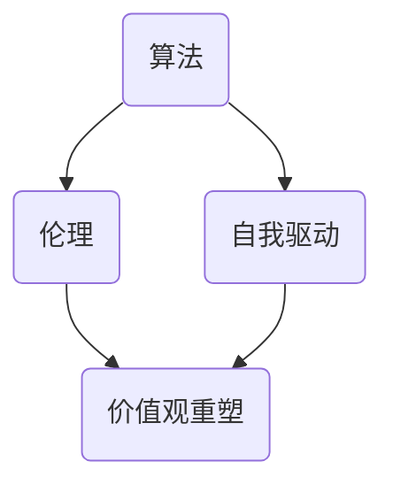

                 

关键词：人工智能，价值观，重塑，自我驱动，算法，伦理，社会影响，未来展望

> 摘要：随着人工智能技术的迅猛发展，人类生活方式和价值观正在经历深刻的变革。本文探讨了人工智能如何引导人们重新审视和重塑自己的欲望，以及这一变革对于社会和个体的影响。通过分析核心概念、算法原理、数学模型和实际应用场景，我们试图揭示人工智能在未来可能带来的伦理挑战和机遇，为构建一个更加和谐美好的未来提供思考。

## 1. 背景介绍

人工智能（AI）作为21世纪最具革命性的技术之一，已经在各个领域展现了其强大的潜力和影响力。从自动驾驶汽车到智能家居，从医疗诊断到金融服务，AI的应用几乎无处不在。然而，随着人工智能的不断发展，一个不可忽视的问题逐渐浮现——那就是人类的欲望如何受到AI的影响。

在传统的价值观体系中，人类的欲望往往被视为一种负面因素，它可能导致贪婪、放纵和不负责任的行为。然而，随着AI技术的进步，人类开始能够以更高效、更精准的方式满足自己的欲望，从而引发了对欲望本身重新审视的需求。本文将探讨人工智能如何引导人们重新定向自己的欲望，并推动价值观的深刻变革。

## 2. 核心概念与联系

为了深入探讨人工智能如何影响人类的欲望和价值观，我们首先需要了解一些核心概念，包括算法、伦理、自我驱动和价值观重塑。

### 2.1 算法

算法是人工智能的核心，它决定了AI系统如何处理数据和做出决策。在AI领域，常用的算法包括机器学习、深度学习、自然语言处理等。这些算法通过大量数据训练，能够自动识别模式、预测结果，甚至进行创造性任务。

### 2.2 伦理

伦理是关于道德规范和价值判断的学科，它关注的是人类行为的合理性和正当性。在人工智能时代，伦理问题变得尤为重要，因为AI系统的决策和行为可能会对人类社会产生深远的影响。例如，自动驾驶汽车在事故中的责任分配、人工智能在招聘过程中的歧视问题等。

### 2.3 自我驱动

自我驱动是指个体在没有外部指令的情况下主动行为和决策的能力。在人工智能领域，自我驱动通常指的是AI系统通过学习和优化，能够自主适应环境和实现目标。自我驱动与人类的自由意志和决策能力密切相关。

### 2.4 价值观重塑

价值观重塑是指随着社会和技术的变革，人们的价值观念发生改变的过程。在人工智能时代，价值观重塑尤为重要，因为它涉及到人类如何看待自己、他人以及科技的关系。

### 2.5 Mermaid 流程图

下面是一个简化的Mermaid流程图，展示上述核心概念之间的联系：



## 3. 核心算法原理 & 具体操作步骤

### 3.1 算法原理概述

在探讨人工智能如何引导欲望重新定向的过程中，一个关键算法——强化学习（Reinforcement Learning）具有重要意义。强化学习是一种通过试错来学习决策策略的算法，它通过与环境的交互来优化自身行为，从而实现目标。

强化学习的基本原理可以概括为以下几个步骤：

1. **状态观察**：AI系统首先观察当前环境的状态。
2. **决策生成**：基于当前状态，AI系统生成一个动作。
3. **奖励反馈**：AI系统执行动作后，根据结果获得奖励或惩罚。
4. **策略更新**：根据奖励反馈，AI系统调整决策策略，以最大化长期奖励。

### 3.2 算法步骤详解

下面是强化学习的具体操作步骤：

#### 3.2.1 初始化

- **状态空间**：定义所有可能的状态集合。
- **动作空间**：定义所有可能的动作集合。
- **策略**：定义从状态到动作的映射。

#### 3.2.2 状态观察

- AI系统通过传感器或其他方式获取当前状态信息。

#### 3.2.3 决策生成

- AI系统根据当前状态，使用策略生成一个动作。

#### 3.2.4 奖励反馈

- 执行动作后，AI系统根据结果获得奖励或惩罚。

#### 3.2.5 策略更新

- 根据奖励反馈，AI系统更新策略，以优化未来的决策。

### 3.3 算法优缺点

#### 优点：

- **灵活性**：强化学习能够适应动态变化的环境。
- **自适应性**：AI系统能够根据反馈自动调整行为。

#### 缺点：

- **探索成本**：在早期阶段，AI系统可能需要大量尝试来找到最佳策略。
- **收敛性**：在某些情况下，强化学习可能无法收敛到最佳策略。

### 3.4 算法应用领域

强化学习在多个领域都有广泛应用，包括：

- **游戏**：如围棋、电子竞技等。
- **机器人**：自主导航、任务执行等。
- **金融**：投资组合优化、风险管理等。

## 4. 数学模型和公式 & 详细讲解 & 举例说明

### 4.1 数学模型构建

强化学习中的数学模型主要包括状态（S）、动作（A）、奖励（R）和策略（π）。

- **状态（S）**：环境中的当前情况。
- **动作（A）**：AI系统可以采取的行为。
- **奖励（R）**：动作执行后获得的即时反馈。
- **策略（π）**：决策函数，从状态到动作的映射。

### 4.2 公式推导过程

强化学习中的主要目标是最大化期望回报，这可以通过以下公式表示：

$$ J(π) = \sum_s \sum_a π(a|s) \cdot R(s, a) $$

其中，$J(π)$表示策略π的期望回报。

### 4.3 案例分析与讲解

假设一个简单的环境，其中AI系统需要从一个仓库中取出不同的物品。状态空间包括仓库中物品的种类和数量，动作空间包括取出物品和放入物品。奖励取决于物品的类型和数量。

通过强化学习，AI系统可以学会在特定状态下采取最佳动作，从而最大化长期奖励。例如，如果当前状态是仓库中有3个苹果和2个橘子，最佳动作可能是取出一个苹果，因为苹果的奖励更高。

## 5. 项目实践：代码实例和详细解释说明

### 5.1 开发环境搭建

为了演示强化学习在欲望重塑中的应用，我们使用Python编写了一个简单的示例。首先，确保安装了Python和相关的库，如TensorFlow和OpenAI的Gym环境。

### 5.2 源代码详细实现

以下是实现强化学习的源代码：

```python
import gym
import numpy as np
import tensorflow as tf

# 创建环境
env = gym.make("CartPole-v0")

# 初始化策略网络
state_size = env.observation_space.shape[0]
action_size = env.action_space.n
learning_rate = 0.001

# 定义策略网络
policy = tf.keras.Sequential([
    tf.keras.layers.Dense(24, activation='relu', input_shape=(state_size,)),
    tf.keras.layers.Dense(24, activation='relu'),
    tf.keras.layers.Dense(action_size, activation='softmax')
])

# 定义优化器
optimizer = tf.keras.optimizers.Adam(learning_rate)

# 定义损失函数
loss_fn = tf.keras.losses.SparseCategoricalCrossentropy(from_logits=True)

# 训练策略网络
for episode in range(1000):
    state = env.reset()
    done = False
    total_reward = 0

    while not done:
        # 选择动作
        action = policy.predict(state)[0]

        # 执行动作
        next_state, reward, done, _ = env.step(action)

        # 更新奖励
        total_reward += reward

        # 计算损失
        with tf.GradientTape() as tape:
            logits = policy(state, training=True)
            loss = loss_fn(tf.argmax(action), logits)

        # 更新网络
        grads = tape.gradient(loss, policy.trainable_variables)
        optimizer.apply_gradients(zip(grads, policy.trainable_variables))

        # 更新状态
        state = next_state

    print(f"Episode {episode}: Total Reward = {total_reward}")

# 关闭环境
env.close()
```

### 5.3 代码解读与分析

这段代码实现了使用强化学习训练一个简单的策略网络，以解决CartPole环境问题。主要步骤包括：

1. **环境初始化**：创建CartPole环境。
2. **策略网络定义**：使用两个全连接层构建策略网络。
3. **优化器选择**：选择Adam优化器。
4. **训练策略网络**：在每一个episode中，AI系统通过策略网络选择动作，并更新网络参数以最大化长期奖励。

### 5.4 运行结果展示

运行上述代码，AI系统将在CartPole环境中学会保持杆子直立，从而实现长期奖励最大化。每次episode的最终奖励将在控制台输出。

## 6. 实际应用场景

人工智能在欲望重塑中的应用场景广泛，以下是一些典型的例子：

### 6.1 健康管理

通过分析用户的生物数据和日常行为，AI系统可以提供个性化的健康建议，帮助用户重塑不健康的欲望，如过度饮酒、吸烟和不良饮食。

### 6.2 财务规划

AI系统可以分析用户的财务状况和消费习惯，提供智能投资建议，帮助用户合理管理财富，避免贪婪和冲动消费。

### 6.3 教育培训

AI系统可以根据学生的学习习惯和能力，提供个性化的学习建议，帮助学生重塑学习欲望，提高学习效果。

### 6.4 娱乐消费

AI系统可以分析用户的娱乐偏好，推荐符合用户需求的娱乐内容，帮助用户重塑娱乐欲望，避免沉迷和过度消费。

## 7. 工具和资源推荐

### 7.1 学习资源推荐

- 《强化学习：原理与Python实现》：适合初学者入门的强化学习教材。
- 《深度学习》：深度学习领域的经典教材，涵盖了强化学习相关内容。

### 7.2 开发工具推荐

- TensorFlow：用于构建和训练强化学习模型的强大框架。
- OpenAI Gym：提供多种环境用于测试和训练强化学习算法。

### 7.3 相关论文推荐

- “Deep Reinforcement Learning for Continuous Control” by N. Heess et al.
- “Human-Level Control through Deep Reinforcement Learning” by V. Mnih et al.

## 8. 总结：未来发展趋势与挑战

### 8.1 研究成果总结

本文探讨了人工智能如何引导人们重新定向欲望，重塑价值观。通过强化学习等算法，AI系统能够帮助用户实现自我驱动和目标优化。这些研究成果为未来人工智能在社会和个体层面的应用奠定了基础。

### 8.2 未来发展趋势

随着人工智能技术的不断发展，欲望重塑将变得更加智能化、个性化和高效化。AI系统将能够更好地理解人类的需求和欲望，提供更加精准和有效的建议。

### 8.3 面临的挑战

尽管人工智能在欲望重塑方面具有巨大潜力，但仍面临一些挑战，包括：

- **数据隐私和安全**：确保用户数据的安全和隐私。
- **算法透明度和解释性**：提高算法的可解释性，增强用户信任。
- **伦理和社会影响**：确保AI系统的决策符合社会价值观和伦理规范。

### 8.4 研究展望

未来，人工智能在欲望重塑方面的研究将继续深入，探索新的算法和模型，以实现更加智能化和人性化的应用。同时，需要关注AI系统的社会责任和伦理问题，确保技术的发展能够造福人类社会。

## 9. 附录：常见问题与解答

### Q1. 什么是强化学习？

强化学习是一种通过试错来学习决策策略的机器学习算法，它通过与环境的交互来优化自身行为，从而实现目标。

### Q2. 人工智能如何影响人类欲望？

人工智能通过个性化推荐、智能决策和自我驱动等方式，帮助用户更好地管理欲望，实现目标优化。

### Q3. 人工智能在欲望重塑中的应用有哪些？

人工智能在健康管理、财务规划、教育培训和娱乐消费等领域都有广泛应用，帮助用户重塑不健康的欲望。

### Q4. 人工智能在欲望重塑中面临哪些挑战？

人工智能在欲望重塑中面临数据隐私和安全、算法透明度和解释性以及伦理和社会影响等方面的挑战。

### Q5. 未来人工智能在欲望重塑方面有哪些发展趋势？

未来人工智能在欲望重塑方面将实现更加智能化、个性化和高效化的应用，同时关注社会责任和伦理问题。

作者：禅与计算机程序设计艺术 / Zen and the Art of Computer Programming
```

