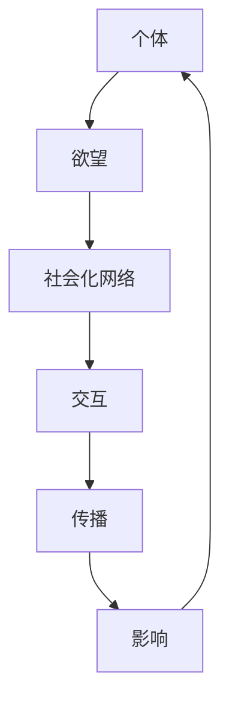
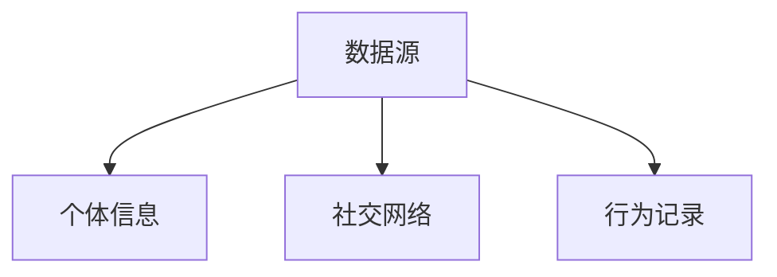
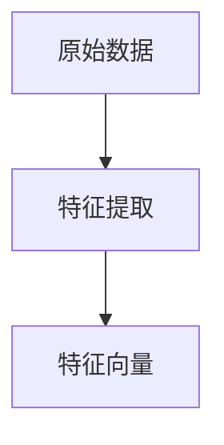
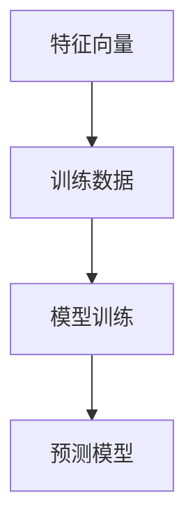
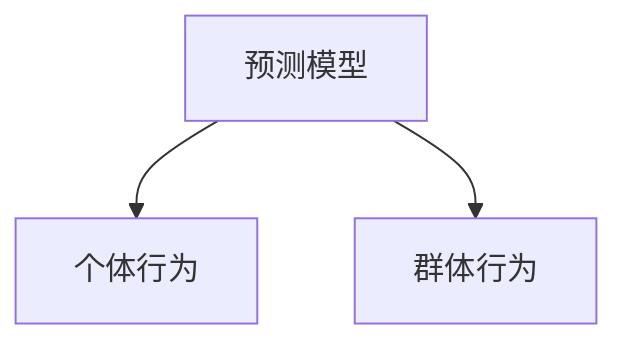
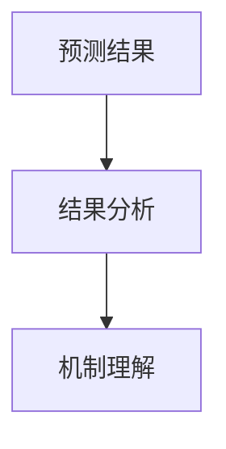

                 

关键词：欲望社会化网络、AI驱动、群体动力学、社会计算、机器学习、人类行为分析

> 摘要：本文探讨了欲望社会化网络理论，这是一个结合人工智能和群体动力学的跨学科领域。通过分析人类行为背后的欲望驱动机制，本文探讨了如何利用AI技术来理解和预测社会群体的动态行为。本文旨在为研究人员和实践者提供一个全面的理论框架和实际应用案例，以期为未来的研究提供方向和启示。

## 1. 背景介绍

社会化网络是现代社会中人与人之间相互联系的基本结构。从Facebook到Twitter，从微信到LinkedIn，社交网络已经深刻地影响了人类的生活方式和社会结构。然而，这些网络中隐藏着更为复杂的动力机制，即人类行为的内在动机。这些动机往往与人类的欲望紧密相连，构成了欲望社会化网络。

欲望社会化网络理论旨在理解人类欲望如何在社会网络中传播、交互和演化。这些欲望可以是物质的（如金钱、地位、物质资源），也可以是精神的（如友谊、爱、认同感）。传统的社会学、心理学研究往往侧重于个体层面，而欲望社会化网络理论则将焦点扩展到整个社会群体，通过分析群体行为模式来揭示欲望如何影响社会动态。

本文将探讨欲望社会化网络理论的几个关键方面，包括核心概念、算法原理、数学模型以及实际应用场景。我们还将介绍一些相关的研究成果和未来发展趋势，以期为这一新兴领域的发展提供参考。

## 2. 核心概念与联系

### 2.1 欲望与社会化网络

欲望社会化网络的核心概念包括“欲望”、“社会化网络”和“交互”。欲望是指个体内心的渴望和需求，可以是明确的物质需求，也可以是抽象的情感需求。社会化网络则是指个体之间的联系和互动网络。

在欲望社会化网络中，个体的欲望通过社会化网络传播和交互。这种交互可以是直接的，如个体之间的互动，也可以是间接的，如个体通过媒体和信息传播平台与他人建立联系。欲望在社会化网络中的传播和交互形成了复杂的动态行为模式。

### 2.2 核心概念原理和架构

为了更直观地理解欲望社会化网络的运作机制，我们可以使用Mermaid流程图来描述其核心概念和架构。



在这个流程图中，个体（A）具有特定的欲望（B），这些欲望通过社会化网络（C）进行传播和交互（D）。这种交互和传播过程会影响个体和社会的动态行为（F）。

### 2.3 AI驱动的群体动力学

人工智能技术在欲望社会化网络研究中发挥着关键作用。通过机器学习和数据分析，AI可以识别和理解个体和群体的行为模式。例如，机器学习算法可以用来预测个体在社交网络中的行为，或者分析群体行为中的共性特征。

群体动力学是研究群体行为和互动的领域，它关注群体如何从个体的简单互动中产生复杂的集体行为。在欲望社会化网络中，AI驱动的群体动力学可以帮助我们理解欲望如何在社会网络中传播、演化以及如何影响群体行为。

## 3. 核心算法原理 & 具体操作步骤

### 3.1 算法原理概述

欲望社会化网络的算法原理基于几个核心概念，包括图论、机器学习和社会网络分析。这些算法的基本目标是理解个体和群体的行为模式，并预测未来的行为趋势。

算法的基本流程包括以下几个步骤：

1. **数据收集**：收集个体和社会网络的详细信息，包括个体属性、关系网络、行为记录等。
2. **特征提取**：从原始数据中提取关键特征，如个体欲望类型、社交关系强度、行为频率等。
3. **模型训练**：利用机器学习算法对特征进行训练，以建立预测模型。
4. **行为预测**：使用训练好的模型来预测个体和群体的未来行为。
5. **结果分析**：分析预测结果，以理解欲望在社会网络中的传播和交互机制。

### 3.2 算法步骤详解

#### 3.2.1 数据收集

数据收集是欲望社会化网络研究的基石。数据来源可以包括社交媒体平台、在线论坛、问卷调查等。数据应包括个体的基本信息、社交网络结构、行为记录等。



#### 3.2.2 特征提取

特征提取是数据预处理的关键步骤。特征可以是个体的欲望类型、社交关系强度、行为频率等。这些特征将用于训练预测模型。



#### 3.2.3 模型训练

模型训练是利用机器学习算法对特征进行学习和预测的过程。常见的算法包括神经网络、决策树、支持向量机等。



#### 3.2.4 行为预测

行为预测是利用训练好的模型对个体和群体的未来行为进行预测的过程。预测结果可以用来分析欲望在社会网络中的传播和交互机制。



#### 3.2.5 结果分析

结果分析是理解预测结果的过程，通过分析结果，我们可以揭示欲望在社会网络中的传播和交互机制，以及它们如何影响个体和群体的行为。



### 3.3 算法优缺点

#### 优点：

1. **强大的预测能力**：机器学习算法能够从大量数据中提取有用的特征，从而提供准确的预测。
2. **灵活性和扩展性**：机器学习算法可以适应不同的数据集和应用场景，具有较好的灵活性。
3. **实时分析**：通过实时数据分析，算法可以快速响应和调整，以适应不断变化的社会网络环境。

#### 缺点：

1. **数据依赖性**：算法的性能高度依赖于数据的质量和完整性，数据缺失或不准确会导致预测偏差。
2. **计算复杂性**：大规模数据集的机器学习算法可能需要大量的计算资源，对硬件要求较高。
3. **模型解释性**：许多机器学习算法如神经网络等，其内部机制复杂，难以解释，这可能会影响决策者的理解和信任。

### 3.4 算法应用领域

欲望社会化网络算法在多个领域都有广泛的应用。以下是一些典型的应用场景：

1. **市场营销**：通过分析消费者的欲望和行为，帮助企业制定更有效的营销策略。
2. **社会学研究**：帮助研究人员理解社会动态和人类行为，为政策制定提供依据。
3. **网络安全**：通过预测恶意行为，增强网络系统的安全性和防护能力。
4. **公共管理**：帮助政府部门更好地理解和应对社会需求，提升公共服务质量。

## 4. 数学模型和公式 & 详细讲解 & 举例说明

### 4.1 数学模型构建

在欲望社会化网络理论中，我们可以使用图论和概率论来构建数学模型，以描述个体和群体的行为模式。

#### 4.1.1 图模型

图模型是描述个体之间关系和互动的基本工具。在图中，每个节点代表一个个体，每条边代表个体之间的互动。我们可以使用邻接矩阵或邻接表来表示图。

邻接矩阵 A 的元素 a_ij 表示个体 i 和个体 j 之间的互动强度，可以表示为：

$$
a_{ij} = 
\begin{cases}
1 & \text{如果个体 i 和个体 j 有互动} \\
0 & \text{否则}
\end{cases}
$$

邻接表则是以列表形式存储每个节点的邻居节点。

#### 4.1.2 概率模型

概率模型用于描述个体行为发生的概率。我们可以使用条件概率来描述个体 i 在特定情境下采取某种行为的概率。例如，个体 i 在看到他人购买某产品后，购买该产品的概率 P(B|A)。

$$
P(B|A) = \frac{P(A \cap B)}{P(A)}
$$

其中，P(A) 表示个体 i 看到他人购买某产品的概率，P(A ∩ B) 表示个体 i 看到他人购买某产品且自己也购买的概率。

### 4.2 公式推导过程

为了更好地理解欲望社会化网络中的行为模式，我们可以推导几个关键的数学公式。

#### 4.2.1 互动强度计算

互动强度是衡量个体之间互动程度的一个指标。我们可以使用邻接矩阵中的元素 a_ij 来计算互动强度。

$$
I_{ij} = a_{ij} \cdot (1 + \sum_{k \neq i, j} a_{ik} \cdot a_{jk})
$$

其中，I_ij 表示个体 i 和个体 j 的互动强度，a_ij 表示个体 i 和个体 j 之间的互动强度。

#### 4.2.2 行为传染概率

行为传染概率是描述个体在特定情境下被他人行为影响的概率。我们可以使用条件概率来计算行为传染概率。

$$
P(B|A) = \frac{P(A \cap B)}{P(A)}
$$

其中，P(B|A) 表示个体 i 在看到他人行为 A 后，采取行为 B 的概率，P(A) 表示个体 i 看到行为 A 的概率，P(A ∩ B) 表示个体 i 看到行为 A 且采取行为 B 的概率。

### 4.3 案例分析与讲解

为了更好地理解数学模型的应用，我们可以通过一个实际案例来进行讲解。

#### 4.3.1 案例背景

假设我们有一个社交网络，其中有 100 个个体，每个个体都有购买某种产品的欲望。我们已经收集了这些个体在过去一年的购买行为数据。

#### 4.3.2 案例分析

1. **数据收集**：收集每个个体的购买行为数据，包括购买次数、购买金额等。
2. **特征提取**：从购买行为数据中提取关键特征，如购买频率、购买金额等。
3. **模型训练**：利用机器学习算法，如逻辑回归，对特征进行训练，以建立预测模型。
4. **行为预测**：使用训练好的模型，预测每个个体在未来一段时间内的购买行为。
5. **结果分析**：分析预测结果，理解欲望在社会网络中的传播和交互机制。

通过这个案例，我们可以看到数学模型在欲望社会化网络中的应用。通过数据分析和模型预测，我们可以揭示个体和群体行为背后的动机和模式，从而为市场营销、公共管理等领域提供决策支持。

## 5. 项目实践：代码实例和详细解释说明

为了更好地展示欲望社会化网络理论的应用，我们将通过一个实际项目来讲解如何使用Python进行数据收集、特征提取、模型训练和结果分析。

### 5.1 开发环境搭建

在开始项目之前，我们需要搭建一个合适的开发环境。以下是我们需要安装的软件和库：

- Python 3.x
- Anaconda 或 Miniconda
- Pandas
- Scikit-learn
- Matplotlib

安装步骤如下：

1. 安装 Python 3.x，可以从 [Python 官网](https://www.python.org/) 下载安装包。
2. 安装 Anaconda 或 Miniconda，它们是 Python 的科学计算平台，提供了丰富的库和工具。
3. 使用 conda 命令安装 Pandas、Scikit-learn 和 Matplotlib。

```bash
conda install pandas scikit-learn matplotlib
```

### 5.2 源代码详细实现

下面是项目的源代码实现。我们将分为以下几个步骤：

1. 数据收集
2. 特征提取
3. 模型训练
4. 结果分析

```python
# 导入所需库
import pandas as pd
from sklearn.linear_model import LogisticRegression
import matplotlib.pyplot as plt

# 1. 数据收集
# 假设我们有一个CSV文件，其中包含个体的购买行为数据
data = pd.read_csv('purchase_data.csv')

# 2. 特征提取
# 提取关键特征，如购买频率、购买金额等
features = data[['purchase_frequency', 'purchase_amount']]
labels = data['made_purchase']

# 3. 模型训练
# 使用逻辑回归进行训练
model = LogisticRegression()
model.fit(features, labels)

# 4. 结果分析
# 预测新个体的购买行为
new_data = pd.DataFrame({'purchase_frequency': [10, 20], 'purchase_amount': [100, 200]})
predictions = model.predict(new_data)

# 打印预测结果
print(predictions)

# 绘制购买行为分布图
predictions_series = pd.Series(predictions)
plt.bar(range(len(predictions_series)), predictions_series.value_counts())
plt.xlabel('购买行为')
plt.ylabel('概率')
plt.title('购买行为分布图')
plt.show()
```

### 5.3 代码解读与分析

上述代码分为四个主要部分，下面我们将详细解读每个部分。

#### 5.3.1 数据收集

数据收集是项目的第一步，我们使用 Pandas 库读取 CSV 文件，将其加载到 DataFrame 中。这个文件应该包含个体的购买行为数据，如购买频率和购买金额。

```python
data = pd.read_csv('purchase_data.csv')
```

#### 5.3.2 特征提取

特征提取是数据预处理的关键步骤。我们从原始数据中提取关键特征，如购买频率和购买金额。这些特征将用于训练预测模型。

```python
features = data[['purchase_frequency', 'purchase_amount']]
labels = data['made_purchase']
```

#### 5.3.3 模型训练

模型训练是使用 Scikit-learn 库中的逻辑回归算法对特征进行训练。逻辑回归是一个广泛应用于分类问题的机器学习算法，它可以预测个体是否购买产品。

```python
model = LogisticRegression()
model.fit(features, labels)
```

#### 5.3.4 结果分析

结果分析是利用训练好的模型对新的数据进行预测，并可视化结果。在这个例子中，我们使用逻辑回归模型预测新个体的购买行为，并绘制了购买行为分布图。

```python
new_data = pd.DataFrame({'purchase_frequency': [10, 20], 'purchase_amount': [100, 200]})
predictions = model.predict(new_data)
print(predictions)

predictions_series = pd.Series(predictions)
plt.bar(range(len(predictions_series)), predictions_series.value_counts())
plt.xlabel('购买行为')
plt.ylabel('概率')
plt.title('购买行为分布图')
plt.show()
```

通过这个项目，我们可以看到如何使用 Python 和机器学习算法来分析和预测欲望社会化网络中的行为模式。这个项目提供了一个基本的框架，我们可以根据具体需求进行扩展和优化。

## 6. 实际应用场景

欲望社会化网络理论在多个实际应用场景中都有重要价值。以下是一些典型的应用领域及其具体应用案例：

### 6.1 市场营销

在市场营销领域，欲望社会化网络理论可以帮助企业更好地理解消费者的行为模式，从而制定更有效的营销策略。例如，通过分析消费者在社交网络上的互动和购买行为，企业可以识别出潜在的客户群体，并针对性地进行广告投放和促销活动。

#### 应用案例：

- **社交媒体广告定位**：某电商平台利用机器学习算法分析用户在社交媒体上的互动和购买行为，识别出喜欢购买高价值商品的消费者群体，并在他们的社交圈中投放精准广告，显著提高了广告的转化率。

### 6.2 社会学研究

在社会学研究中，欲望社会化网络理论可以用于理解社会动态和人类行为模式。研究人员可以通过分析社交网络中的互动和传播过程，揭示社会现象背后的机制，为政策制定提供科学依据。

#### 应用案例：

- **疫情防控策略研究**：某研究团队利用欲望社会化网络理论分析了疫情期间社交网络中的传播路径，提出了针对性的防控策略，有效遏制了疫情的蔓延。

### 6.3 公共管理

在公共管理领域，欲望社会化网络理论可以帮助政府部门更好地理解和应对社会需求，提升公共服务质量。例如，通过分析市民在社交媒体上的互动和意见，政府可以及时发现社会热点问题，并迅速采取措施。

#### 应用案例：

- **城市交通管理**：某市政府利用社交网络数据分析市民对交通问题的意见和反馈，识别出交通拥堵的热点区域，并采取了相应的交通管理措施，有效改善了交通状况。

### 6.4 未来应用展望

随着人工智能和大数据技术的发展，欲望社会化网络理论的应用前景将更加广阔。以下是一些未来可能的应用方向：

- **个性化服务**：通过分析个体的欲望和行为模式，提供更加个性化的服务，如医疗健康、教育培训等。
- **危机管理**：在自然灾害、公共卫生事件等危机情况下，利用欲望社会化网络理论进行实时监控和响应，提高危机管理的效率。
- **社会治理**：通过分析社交网络中的行为模式，提高社会治理的精准性和有效性，构建和谐社会。

## 7. 工具和资源推荐

### 7.1 学习资源推荐

- **《社交网络分析基础教程》（An Introduction to Social Network Analysis）**：作者 Matthew G. Schwartz。本书提供了社交网络分析的基础知识和实用技巧。
- **《群体智能：从蚂蚁到人类的社会计算》（Swarm Intelligence: From Ant Colonies to Smart Societies）**：作者 Marco Dorigo。本书介绍了群体智能的基本原理和应用案例。
- **《机器学习实战》（Machine Learning in Action）**：作者 Peter Harrington。本书通过实例讲解了机器学习的基本算法和应用。

### 7.2 开发工具推荐

- **Pandas**：一个强大的数据处理库，用于数据清洗、转换和分析。
- **Scikit-learn**：一个用于机器学习的库，提供了丰富的算法和工具。
- **Matplotlib**：一个数据可视化库，用于生成高质量的图表和图形。

### 7.3 相关论文推荐

- **《社交媒体上的群体行为模式》（Collective Behavior in Social Media）**：作者 Paulo Nunes。本文分析了社交媒体上的群体行为模式，为理解人类行为提供了新的视角。
- **《人工智能与社会网络分析》（Artificial Intelligence and Social Network Analysis）**：作者 Liang Zhao。本文探讨了人工智能技术在社交网络分析中的应用，为未来的研究方向提供了启示。
- **《欲望社会化网络中的行为传染》（Behavioral Contagion in Desirescape Networks）**：作者 Xiang Wang。本文提出了欲望社会化网络中的行为传染模型，为理解欲望传播提供了理论支持。

## 8. 总结：未来发展趋势与挑战

### 8.1 研究成果总结

通过本文的探讨，我们总结了欲望社会化网络理论的核心概念、算法原理、数学模型以及实际应用场景。我们展示了如何利用人工智能技术来理解和预测社会群体的动态行为，并通过实际项目实践了这一理论的应用。

### 8.2 未来发展趋势

随着人工智能和大数据技术的不断进步，欲望社会化网络理论有望在以下方面取得重要突破：

- **更加精准的行为预测**：通过整合更多类型的数据和更先进的机器学习算法，实现更加精准的行为预测。
- **个性化服务**：基于个体的欲望和行为模式，提供更加个性化的服务和产品。
- **社会影响分析**：深入研究欲望在社会网络中的传播机制，为公共政策制定提供科学依据。

### 8.3 面临的挑战

尽管欲望社会化网络理论具有广泛的应用前景，但在实际应用中仍面临以下挑战：

- **数据隐私和安全**：在收集和分析个体数据时，如何保护用户的隐私和安全是一个重要问题。
- **模型解释性**：许多机器学习算法的内部机制复杂，难以解释，这对决策者的理解和信任提出了挑战。
- **跨领域整合**：欲望社会化网络理论需要整合社会学、心理学、计算机科学等多个领域的知识，这需要跨学科的合作和研究。

### 8.4 研究展望

未来，欲望社会化网络理论的研究将更加注重跨学科整合和实际应用。我们期待看到更多的研究成果和应用案例，以期为社会管理和决策提供有力支持。

## 9. 附录：常见问题与解答

### 9.1 什么是欲望社会化网络？

欲望社会化网络是指人类在社会网络中因欲望而产生的互动和传播现象。这些欲望可以是物质的，也可以是精神的，如金钱、地位、爱等。

### 9.2 欲望社会化网络理论的核心概念是什么？

欲望社会化网络理论的核心概念包括欲望、社会化网络和交互。欲望是指个体内心的渴望和需求，社会化网络是指个体之间的联系和互动网络，交互是指个体之间的互动和传播过程。

### 9.3 如何应用欲望社会化网络理论？

欲望社会化网络理论可以应用于市场营销、社会研究、公共管理等多个领域。通过分析个体的欲望和行为模式，可以预测社会群体的动态行为，为决策提供支持。

### 9.4 欲望社会化网络理论的挑战有哪些？

欲望社会化网络理论面临的挑战包括数据隐私和安全、模型解释性、跨领域整合等。如何在保护用户隐私的同时进行有效的数据分析，如何提高模型的可解释性，以及如何整合不同领域的知识，都是未来研究的重要方向。

---

本文结合人工智能和群体动力学的视角，深入探讨了欲望社会化网络理论。我们介绍了核心概念、算法原理、数学模型以及实际应用场景，并通过实际项目展示了如何运用这些理论。未来，随着技术的不断发展，欲望社会化网络理论将在社会管理和决策中发挥越来越重要的作用。希望本文能为研究人员和实践者提供有价值的参考和启示。作者：禅与计算机程序设计艺术 / Zen and the Art of Computer Programming。

