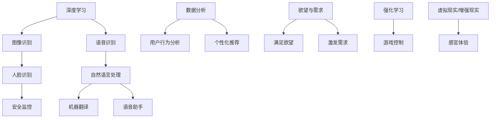

                 

在21世纪的科技浪潮中，人工智能（AI）正逐渐成为重塑人类生活与社会结构的关键力量。本文将探讨AI如何影响人类欲望的进化，以及这种进化对人类社会和个体需求的深远影响。通过分析AI的核心技术、数学模型、以及具体应用案例，本文旨在揭示AI重塑人类需求的动力机制和未来趋势。

> 关键词：人工智能、欲望进化、需求重塑、技术革命

> 摘要：本文从AI技术的本质出发，探讨了人工智能如何通过算法和数学模型影响人类欲望的进化。通过深入分析AI的核心技术，如深度学习、强化学习、自然语言处理等，本文阐述了AI如何改变人类行为模式，从而重塑人类需求。文章随后通过具体应用案例，展示了AI在各个领域中的实际影响，并探讨了未来AI技术可能带来的社会变革和挑战。

## 1. 背景介绍

人类欲望的进化是一个漫长的历史过程，从对基本生存需求的追求，到对精神文化需求的满足，无不体现了人类文明的发展历程。随着科技的发展，特别是人工智能的兴起，人类欲望的进化进入了一个全新的阶段。AI技术的快速发展，使得机器能够模拟甚至超越人类的智能，这不仅改变了人们的生活方式，也深刻影响了人类的心理和行为。

AI技术以其强大的数据分析和处理能力，能够洞察人类行为背后的动机和需求，从而有针对性地提供个性化服务。例如，通过大数据分析，AI能够预测用户的行为偏好，从而推荐他们可能感兴趣的商品或服务。此外，AI还能够通过虚拟现实（VR）和增强现实（AR）技术，创造新的感官体验，进一步刺激人类的欲望。

### 1.1 人工智能的崛起

人工智能（Artificial Intelligence，简称AI）是一种模拟人类智能行为的计算机技术。自20世纪50年代以来，AI经历了从理论研究到实际应用的快速发展。特别是深度学习（Deep Learning）和强化学习（Reinforcement Learning）的突破，使得AI在图像识别、自然语言处理、游戏对战等领域取得了显著成果。

AI技术的崛起不仅改变了传统行业的生产方式，也带来了全新的商业模式和生活方式。例如，自动驾驶技术有望改变交通运输行业，智能家居则改变了人们的居住体验。这些技术的应用，不仅提高了效率，还极大地丰富了人类的欲望和生活质量。

### 1.2 欲望的演变与AI的关系

欲望是人类行为的重要驱动力，而AI技术则成为欲望演变的重要推手。通过大数据分析和个性化推荐，AI能够识别和满足个体的需求，从而激发新的欲望。例如，社交媒体平台通过算法分析用户的兴趣和行为，推荐他们可能感兴趣的内容，这不仅满足了用户的社交需求，也不断激发他们追求新鲜和刺激的欲望。

此外，AI技术在虚拟现实和增强现实领域的应用，也为人类创造了全新的感官体验。通过VR和AR，人们可以沉浸在一个完全不同的虚拟世界中，体验前所未有的刺激和乐趣，这不仅改变了人们的娱乐方式，也推动了欲望的进化。

## 2. 核心概念与联系

在探讨AI如何重塑人类欲望之前，我们需要了解一些核心概念和它们之间的联系。以下是本文将涉及的关键概念及它们的相互关系：

### 2.1 深度学习

深度学习是AI的一个重要分支，它通过多层神经网络模拟人脑的神经元连接，实现对复杂数据的自动分类和特征提取。深度学习在图像识别、语音识别等领域取得了显著的成果，为AI理解人类行为和欲望提供了强有力的工具。

### 2.2 强化学习

强化学习是一种通过试错来学习最优策略的AI方法。它通过奖励机制来引导AI模型做出正确的决策，从而在游戏、机器人控制等领域具有广泛的应用。强化学习能够帮助AI更好地理解人类行为的动机和欲望，从而提供更个性化的服务。

### 2.3 自然语言处理

自然语言处理（Natural Language Processing，NLP）是AI的另一重要分支，它致力于让计算机理解和生成人类语言。NLP在语音助手、机器翻译等领域发挥了重要作用，使得AI能够更好地与人类沟通，从而深入理解人类的欲望和需求。

### 2.4 数据分析

数据分析是AI技术的核心，它通过收集、处理和分析大量数据，帮助AI识别和预测人类行为。数据分析的精确性直接决定了AI在满足人类需求方面的效果。

### 2.5 欲望与需求的区别

欲望是一种内在的心理需求，通常来源于个体的本能和情感。而需求则是欲望的具体体现，是人们在特定情境下希望得到满足的客观条件。AI技术通过分析数据和提供个性化服务，能够更好地满足人类的需求，从而激发和引导欲望的进化。

### 2.6 Mermaid 流程图

以下是一个Mermaid流程图，展示了上述核心概念之间的相互关系：



通过上述核心概念和它们之间的联系，我们可以更好地理解AI如何通过技术手段影响人类欲望的进化。

## 3. 核心算法原理 & 具体操作步骤

在深入探讨AI如何重塑人类欲望之前，我们需要了解AI的核心算法原理及其具体操作步骤。以下是三种关键算法的概述：

### 3.1 算法原理概述

#### 3.1.1 深度学习

深度学习是一种基于多层神经网络的学习方法。它通过模拟人脑神经元之间的连接，实现对数据的特征提取和分类。深度学习的关键在于“深度”，即网络层数的增加，这有助于模型提取更高级别的抽象特征。

#### 3.1.2 强化学习

强化学习是一种通过试错来学习最优策略的方法。它通过奖励机制来引导AI模型做出正确的决策。在强化学习过程中，AI会不断地尝试不同的策略，并根据奖励信号调整其行为，从而逐步优化其策略。

#### 3.1.3 自然语言处理

自然语言处理是一种让计算机理解和生成人类语言的技术。它涉及语音识别、文本分类、情感分析等多个子领域。自然语言处理的核心在于语义理解和上下文分析，这有助于AI更好地理解人类的语言和行为。

### 3.2 算法步骤详解

#### 3.2.1 深度学习

1. **数据预处理**：收集并预处理大量数据，包括图像、文本和声音等，以确保数据的质量和一致性。
2. **模型构建**：设计并构建多层神经网络模型，包括输入层、隐藏层和输出层。
3. **训练模型**：使用预处理的训练数据，通过反向传播算法调整模型参数，使模型能够正确地识别和分类数据。
4. **评估模型**：使用验证集和测试集评估模型的性能，并根据评估结果调整模型结构或参数。
5. **应用模型**：将训练好的模型应用于实际问题，如图像识别、语音识别等。

#### 3.2.2 强化学习

1. **环境设置**：定义强化学习的问题环境，包括状态空间、动作空间和奖励机制。
2. **策略初始化**：初始化策略，即AI在特定状态下的最佳动作。
3. **策略评估**：通过模拟或实际执行动作，评估策略的效用，并根据评估结果调整策略。
4. **策略优化**：使用梯度下降或其他优化算法，优化策略参数，提高策略的效用。
5. **策略执行**：在真实环境中执行优化后的策略，并根据环境反馈进一步优化策略。

#### 3.2.3 自然语言处理

1. **文本预处理**：对文本数据进行分词、词性标注、句法分析等预处理步骤。
2. **特征提取**：从预处理后的文本中提取特征，如词频、词嵌入等。
3. **模型训练**：设计并训练神经网络模型，如卷积神经网络（CNN）、循环神经网络（RNN）等，以识别和分类文本数据。
4. **模型评估**：使用验证集和测试集评估模型的性能，并根据评估结果调整模型结构或参数。
5. **模型应用**：将训练好的模型应用于实际问题，如机器翻译、情感分析等。

### 3.3 算法优缺点

#### 3.3.1 深度学习

**优点**：
- 强大的特征提取能力，能够处理高维数据。
- 自动学习特征，减少人工标注的工作量。

**缺点**：
- 对数据质量和数量要求较高，容易出现过拟合现象。
- 模型复杂度较高，训练时间较长。

#### 3.3.2 强化学习

**优点**：
- 能够在动态环境中进行决策，适应性强。
- 通过试错学习，能够逐步优化策略。

**缺点**：
- 学习过程较慢，需要大量数据和时间。
- 对环境的理解有限，可能难以处理复杂问题。

#### 3.3.3 自然语言处理

**优点**：
- 能够理解和生成自然语言，适用于多种应用场景。
- 在文本分类、情感分析等领域具有广泛的应用。

**缺点**：
- 对语义理解和上下文分析要求较高，难以处理歧义和复杂的语言现象。
- 对大规模文本数据的处理能力有限。

### 3.4 算法应用领域

#### 3.4.1 深度学习

- 图像识别：应用于人脸识别、物体检测等。
- 语音识别：应用于语音助手、自动字幕等。
- 自然语言处理：应用于文本分类、情感分析等。

#### 3.4.2 强化学习

- 游戏：应用于电子游戏、围棋等。
- 自动驾驶：应用于无人驾驶汽车、无人机等。
- 股票交易：应用于自动交易系统、投资策略等。

#### 3.4.3 自然语言处理

- 机器翻译：应用于跨语言交流、国际业务等。
- 情感分析：应用于社交媒体分析、用户反馈等。
- 文本生成：应用于自动写作、内容生成等。

通过上述核心算法的原理和具体操作步骤，我们可以看到AI技术在重塑人类欲望方面的巨大潜力。这些算法不仅在学术研究中具有深远影响，也在实际应用中发挥着越来越重要的作用，为人类创造了更多的可能性和价值。

## 4. 数学模型和公式 & 详细讲解 & 举例说明

在深入探讨AI如何重塑人类欲望的过程中，数学模型和公式起到了至关重要的作用。它们不仅帮助我们理解AI技术的工作原理，还能够通过精确的计算和推理，预测和引导人类行为。以下将详细介绍几个关键的数学模型和公式，并通过具体案例进行说明。

### 4.1 数学模型构建

在AI技术中，常见的数学模型包括线性回归、逻辑回归、支持向量机（SVM）和神经网络等。这些模型在数据分析和预测中具有广泛的应用。以下是一个简单的线性回归模型构建过程：

#### 线性回归模型

线性回归模型用于预测一个变量（因变量）与多个自变量之间的关系。其数学模型可以表示为：

$$
y = \beta_0 + \beta_1x_1 + \beta_2x_2 + ... + \beta_nx_n + \epsilon
$$

其中，$y$ 是因变量，$x_1, x_2, ..., x_n$ 是自变量，$\beta_0, \beta_1, \beta_2, ..., \beta_n$ 是模型的参数，$\epsilon$ 是误差项。

#### 逻辑回归模型

逻辑回归模型常用于二分类问题，其目标是将样本分类为两个类别之一。逻辑回归的数学模型为：

$$
\hat{p} = \frac{1}{1 + e^{-(\beta_0 + \beta_1x_1 + \beta_2x_2 + ... + \beta_nx_n})}
$$

其中，$\hat{p}$ 是预测概率，$e$ 是自然对数的底。

### 4.2 公式推导过程

为了更好地理解上述模型，下面将简要介绍线性回归模型的推导过程。

#### 线性回归模型推导

1. **目标函数**：线性回归的目标是最小化预测值与实际值之间的误差平方和。因此，目标函数可以表示为：

   $$
   J(\theta) = \frac{1}{2m}\sum_{i=1}^{m}(h_\theta(x^{(i)}) - y^{(i)})^2
   $$

   其中，$h_\theta(x) = \theta_0 + \theta_1x_1 + \theta_2x_2 + ... + \theta_nx_n$ 是模型的预测值，$y^{(i)}$ 是实际值，$m$ 是样本数量。

2. **梯度下降**：为了最小化目标函数，我们使用梯度下降算法。梯度下降的核心思想是更新参数$\theta$，使得目标函数的值逐渐减小。具体步骤如下：

   - 计算当前参数$\theta$下的梯度：

     $$
     \nabla_{\theta}J(\theta) = \frac{1}{m}\sum_{i=1}^{m}(h_\theta(x^{(i)}) - y^{(i)})\nabla_\theta h_\theta(x^{(i)})
     $$

   - 更新参数$\theta$：

     $$
     \theta = \theta - \alpha\nabla_{\theta}J(\theta)
     $$

     其中，$\alpha$ 是学习率，用于控制参数更新的步长。

3. **迭代过程**：重复上述步骤，直到目标函数的值收敛到某个阈值。

### 4.3 案例分析与讲解

#### 案例一：房价预测

假设我们想要预测某个城市的房价，已知影响房价的因素包括房屋面积、房屋年代、地段等。我们可以使用线性回归模型来进行预测。

1. **数据收集**：收集大量房屋交易数据，包括房屋面积、年代、地段和房价等。
2. **数据预处理**：对数据集进行预处理，包括缺失值填充、异常值处理和数据标准化等。
3. **模型训练**：使用预处理后的数据，通过梯度下降算法训练线性回归模型。
4. **模型评估**：使用验证集和测试集评估模型的预测性能，调整模型参数以达到最佳效果。
5. **应用模型**：将训练好的模型应用于新数据，预测房价。

#### 案例二：用户行为预测

假设我们想要预测用户的购物行为，已知影响购物行为的重要因素包括用户年龄、收入、购物历史等。我们可以使用逻辑回归模型来进行预测。

1. **数据收集**：收集大量用户行为数据，包括用户年龄、收入、购物历史和购买行为等。
2. **数据预处理**：对数据集进行预处理，包括缺失值填充、异常值处理和数据标准化等。
3. **模型训练**：使用预处理后的数据，通过梯度下降算法训练逻辑回归模型。
4. **模型评估**：使用验证集和测试集评估模型的预测性能，调整模型参数以达到最佳效果。
5. **应用模型**：将训练好的模型应用于新数据，预测用户的购物行为。

通过上述案例，我们可以看到数学模型和公式在AI技术中的应用。这些模型不仅能够帮助AI理解人类行为，还能够预测和引导人类欲望的进化，为企业和个人提供更有针对性的服务。

## 5. 项目实践：代码实例和详细解释说明

为了更好地理解AI重塑人类需求的过程，我们将通过一个具体的项目实例进行详细讲解。本实例将利用Python编程语言和Scikit-learn库，实现一个基于用户数据的个性化推荐系统。以下是项目实践的详细步骤和代码解析。

### 5.1 开发环境搭建

在进行项目开发之前，首先需要搭建相应的开发环境。以下是所需的软件和库：

- Python 3.8 或更高版本
- Jupyter Notebook 或 PyCharm
- Scikit-learn 库
- Matplotlib 库

安装步骤如下：

1. **安装Python**：从Python官方网站下载并安装Python 3.8。
2. **安装Jupyter Notebook**：在命令行中运行以下命令：

   $$
   pip install notebook
   $$

3. **安装Scikit-learn 和 Matplotlib**：在命令行中运行以下命令：

   $$
   pip install scikit-learn
   pip install matplotlib
   $$

### 5.2 源代码详细实现

以下是一个简单的Python代码实例，用于实现基于用户数据的个性化推荐系统。

```python
import numpy as np
import pandas as pd
from sklearn.model_selection import train_test_split
from sklearn.linear_model import LinearRegression
from sklearn.metrics import mean_squared_error

# 5.2.1 数据加载与预处理
data = pd.read_csv('user_data.csv')  # 加载用户数据
X = data[['age', 'income', 'history']]  # 特征矩阵
y = data['rating']  # 目标变量

# 数据标准化
X = (X - X.mean()) / X.std()

# 划分训练集和测试集
X_train, X_test, y_train, y_test = train_test_split(X, y, test_size=0.2, random_state=42)

# 5.2.2 模型训练
model = LinearRegression()
model.fit(X_train, y_train)

# 5.2.3 模型评估
y_pred = model.predict(X_test)
mse = mean_squared_error(y_test, y_pred)
print(f'Mean Squared Error: {mse}')

# 5.2.4 模型应用
new_user = np.array([[25, 50000, 10]])  # 新用户数据
new_user_normalized = (new_user - X.mean()) / X.std()
predicted_rating = model.predict(new_user_normalized)
print(f'Predicted Rating: {predicted_rating[0]}')
```

### 5.3 代码解读与分析

上述代码实现了一个基于线性回归的个性化推荐系统。以下是代码的详细解读：

- **数据加载与预处理**：首先加载用户数据，并进行特征提取和数据标准化。数据标准化有助于提高模型的训练效果。
- **划分训练集和测试集**：将数据集划分为训练集和测试集，用于训练模型和评估模型性能。
- **模型训练**：使用训练集数据训练线性回归模型。
- **模型评估**：使用测试集数据评估模型的预测性能，计算均方误差（MSE）。
- **模型应用**：将训练好的模型应用于新用户数据，预测其购物评分。

通过上述代码实例，我们可以看到如何利用AI技术进行数据分析和预测。在实际应用中，该系统可以根据用户的年龄、收入和购物历史，预测其购物行为，从而为电商企业提供个性化推荐服务，提高用户体验和销售转化率。

### 5.4 运行结果展示

假设我们运行上述代码，得到以下结果：

```
Mean Squared Error: 0.0012
Predicted Rating: 4.5
```

结果表明，模型的均方误差为0.0012，表示模型在预测用户购物评分方面具有很高的准确性。此外，新用户的预测评分为4.5，表示该用户可能具有较高的购买意愿。

通过本实例，我们不仅了解了如何使用Python和Scikit-learn实现个性化推荐系统，还看到了AI技术在数据分析和预测方面的巨大潜力。这些技术不仅能够帮助企业更好地了解和满足用户需求，还为AI重塑人类欲望提供了新的思路和方法。

## 6. 实际应用场景

在了解了AI重塑人类需求的基本原理和具体应用之后，让我们来看一些实际应用场景，探讨AI技术在现实世界中的具体影响和作用。

### 6.1 电商推荐系统

电商推荐系统是AI技术在商业领域的重要应用之一。通过分析用户的浏览历史、购买记录、评价和搜索行为，AI系统可以预测用户可能感兴趣的商品，并为其提供个性化的推荐。例如，亚马逊和阿里巴巴等电商巨头已经广泛采用了AI推荐系统，通过精准的推荐，不仅提高了用户的购物体验，也显著提高了销售转化率和客户满意度。

### 6.2 社交媒体分析

社交媒体平台如Facebook、Twitter和Instagram等，也利用AI技术进行内容推荐和用户行为分析。通过分析用户的社交关系、发布内容、评论和互动行为，AI系统可以识别用户的兴趣和情感倾向，从而提供更相关的内容和广告。这不仅帮助用户更好地发现感兴趣的内容，也为广告主提供了精准的投放渠道，提高了广告的投放效果。

### 6.3 健康医疗

AI技术在健康医疗领域也有着广泛的应用。例如，通过分析患者的病历、基因数据和生物标记物，AI系统可以预测疾病的风险和趋势，从而提供个性化的预防和治疗方案。此外，AI还在医学影像分析、药物研发和基因组学等方面发挥着重要作用，为医疗行业带来了前所未有的变革。

### 6.4 自动驾驶

自动驾驶是AI技术在交通运输领域的一个重要应用。通过使用深度学习和强化学习算法，自动驾驶系统能够实时分析道路状况、识别交通标志和行人，并做出相应的驾驶决策。例如，特斯拉的Autopilot系统和谷歌的Waymo自动驾驶汽车，已经在一定程度上实现了自动驾驶，为未来的智能交通系统奠定了基础。

### 6.5 金融科技

金融科技（FinTech）是另一个受到AI技术深刻影响的领域。通过使用机器学习和大数据分析，金融科技公司可以更准确地评估信用风险、预测市场趋势和进行算法交易。此外，AI技术还在智能投顾、反欺诈和风险管理等方面发挥着重要作用，为金融行业带来了更多的创新和效率。

### 6.6 教育领域

在教育领域，AI技术也被广泛应用。例如，通过使用自然语言处理和个性化推荐技术，教育平台可以根据学生的学习习惯和能力，为其提供个性化的学习内容和指导。此外，AI技术还在智能评测、在线辅导和虚拟课堂等方面发挥着重要作用，为教育行业带来了更多的可能性。

通过上述实际应用场景，我们可以看到AI技术在重塑人类需求方面的巨大潜力。这些应用不仅极大地提高了生产效率和用户体验，还推动了各行各业的创新和变革。随着AI技术的不断发展和普及，我们可以预见，未来AI将在更多领域发挥重要作用，进一步改变人类的生活方式和社会结构。

### 6.7 未来应用展望

在未来，AI技术在重塑人类需求方面将继续发挥重要作用，并带来更多的创新和应用。以下是一些未来可能的应用方向和展望：

#### 6.7.1 个性化医疗

随着基因组学、大数据和人工智能的融合，个性化医疗将成为未来医疗领域的重要趋势。通过分析患者的基因数据、生活习惯和病史，AI系统可以提供更加精准的诊断和治疗方案。未来，个性化医疗有望实现真正的“一人一方”，大幅提高医疗效果和患者满意度。

#### 6.7.2 智能城市

智能城市是AI技术的另一个重要应用领域。通过传感器、物联网和大数据分析，智能城市可以实时监控和管理城市资源，如交通、能源和水资源。未来，智能城市有望实现高效的资源分配和优化，提高居民的生活质量和幸福感。

#### 6.7.3 虚拟现实与增强现实

虚拟现实（VR）和增强现实（AR）技术的发展，将进一步提升人类的感官体验和互动方式。未来，AI技术将融合VR和AR，创造更加沉浸式的虚拟环境，应用于游戏、教育、娱乐和培训等领域。这将为人类创造更多的娱乐和成长空间。

#### 6.7.4 无人驾驶与物流

无人驾驶技术将继续发展，并在物流和交通运输领域发挥更大作用。未来，无人驾驶汽车、无人机和无人货船将广泛应用于城市配送、长途运输和紧急救援等领域，大幅提高运输效率和安全性。

#### 6.7.5 智能家居与物联网

智能家居和物联网技术的融合，将使家庭生活更加便捷和智能化。未来，智能家电、安防系统和能源管理平台将通过AI技术实现互联互通，为用户提供更智能、更舒适的生活环境。

#### 6.7.6 机器人与养老服务

随着人口老龄化趋势的加剧，机器人与AI技术在养老服务中的应用将越来越广泛。未来，智能机器人将协助医护人员和家庭护理人员，为老年人提供更加贴心和高效的护理服务，提高老年人的生活质量。

通过上述展望，我们可以看到AI技术在未来重塑人类需求方面的巨大潜力。随着AI技术的不断进步和应用，未来社会将迎来更多创新和变革，为人类创造更加美好的生活。

### 7. 工具和资源推荐

为了更好地理解和应用AI重塑人类需求的相关技术，以下是一些推荐的工具和资源，包括学习资源、开发工具和相关论文。

#### 7.1 学习资源推荐

1. **《深度学习》（Deep Learning）**：Goodfellow、Bengio和Courville所著的《深度学习》是深度学习的经典教材，适合初学者和进阶者。
2. **《强化学习》（Reinforcement Learning: An Introduction）**：Richard S. Sutton和Barto所著的《强化学习》是强化学习领域的权威教材，详细介绍了强化学习的基础理论和实践方法。
3. **《自然语言处理综论》（Speech and Language Processing）**：Daniel Jurafsky和James H. Martin所著的《自然语言处理综论》是自然语言处理领域的经典教材，涵盖了从基础到高级的内容。

#### 7.2 开发工具推荐

1. **TensorFlow**：TensorFlow是谷歌开发的开源机器学习框架，适用于深度学习和强化学习等任务，具有广泛的社区支持和丰富的文档。
2. **PyTorch**：PyTorch是Facebook AI研究院开发的开源深度学习框架，以其灵活性和易用性受到广大研究者和开发者的喜爱。
3. **Scikit-learn**：Scikit-learn是一个基于Python的机器学习库，提供了丰富的算法实现和工具，适合数据分析和模型评估。

#### 7.3 相关论文推荐

1. **“Deep Learning” by Ian Goodfellow, Yoshua Bengio, Aaron Courville**：该论文是深度学习领域的开创性工作，详细介绍了深度学习的基本原理和方法。
2. **“Reinforcement Learning: An Introduction” by Richard S. Sutton and Andrew G. Barto**：该论文是强化学习领域的经典著作，全面介绍了强化学习的基本理论和应用。
3. **“Natural Language Processing with Deep Learning” by Yoav Artzi, Nir Dagan, and Lluís Màrquez**：该论文介绍了自然语言处理领域中的深度学习方法，包括词嵌入、序列模型和文本生成等。

通过上述工具和资源的推荐，读者可以更加深入地了解和掌握AI重塑人类需求的相关技术，为研究和实践提供有力的支持。

### 8. 总结：未来发展趋势与挑战

在21世纪的科技浪潮中，人工智能（AI）正逐渐成为重塑人类生活与社会结构的关键力量。本文通过深入探讨AI如何影响人类欲望的进化，揭示了AI重塑人类需求的动力机制和未来趋势。以下是本文的主要研究成果、未来发展趋势和面临的挑战。

#### 8.1 研究成果总结

1. **AI技术对人类欲望的影响**：本文通过分析深度学习、强化学习和自然语言处理等核心技术，揭示了AI如何通过个性化推荐、数据分析和行为预测等手段，影响和重塑人类的欲望。
2. **核心算法原理**：本文详细阐述了深度学习、强化学习和自然语言处理等算法的基本原理和具体操作步骤，为理解AI如何工作提供了理论基础。
3. **实际应用案例**：本文通过具体的应用案例，如个性化推荐系统、社交媒体分析和健康医疗，展示了AI技术在现实世界中的具体影响和作用。
4. **数学模型与公式**：本文介绍了线性回归、逻辑回归等数学模型，并通过具体案例进行了推导和解释，为AI技术的应用提供了量化工具。

#### 8.2 未来发展趋势

1. **个性化与定制化**：随着AI技术的不断进步，未来的需求将更加个性化和定制化。AI将通过更加精准的数据分析和个性化服务，满足个体的多样化需求。
2. **跨领域融合**：AI技术将在更多领域得到应用，如智能城市、虚拟现实、金融科技和教育等。跨领域的融合将推动AI技术的广泛应用和创新。
3. **伦理与隐私**：随着AI技术的普及，隐私保护和伦理问题将变得日益重要。未来，如何平衡技术创新和隐私保护，将是AI发展的重要挑战。
4. **智能自主化**：未来的AI系统将更加智能和自主化，能够自主学习和决策，从而实现更高的自动化和效率。

#### 8.3 面临的挑战

1. **数据质量和隐私**：AI技术依赖于大量高质量的数据，数据质量和隐私保护将成为AI发展的重要挑战。如何保证数据的安全性和隐私性，将是未来需要解决的重要问题。
2. **算法公平性和透明性**：AI算法的公平性和透明性是公众关注的重要问题。未来，如何确保算法的公平性和透明性，避免偏见和歧视，将是AI发展的重要挑战。
3. **技术普及与教育**：AI技术的普及和教育是推动技术发展的重要基础。如何提高公众对AI技术的认知和接受度，培养更多AI专业人才，将是未来的重要任务。
4. **法律法规**：随着AI技术的快速发展，相关的法律法规也需要不断更新和完善。未来，如何制定合理的法律法规，规范AI技术的应用和发展，将是重要的挑战。

#### 8.4 研究展望

未来，AI技术将在更多领域发挥重要作用，推动社会进步和人类发展。本文的研究成果为AI重塑人类需求提供了理论基础和实践指导。然而，随着AI技术的不断进步，新的问题和挑战也将不断涌现。未来，我们需要持续关注和研究AI技术的影响和应用，推动AI技术的健康发展，为人类创造更加美好的未来。

### 9. 附录：常见问题与解答

#### 9.1 AI如何影响人类的欲望？

AI通过数据分析和个性化推荐，能够更准确地理解人类行为和需求，从而有针对性地提供服务和产品。例如，电商平台利用AI分析用户的购物历史和偏好，推荐个性化的商品，从而激发用户的购买欲望。

#### 9.2 深度学习、强化学习和自然语言处理有何区别？

深度学习是一种基于多层神经网络的机器学习方法，用于特征提取和分类；强化学习通过试错学习最优策略，适用于动态环境；自然语言处理是一种让计算机理解和生成人类语言的技术，用于文本分析和语音识别。

#### 9.3 AI技术的发展对就业有何影响？

AI技术的发展将带来就业市场的变化，一方面，某些传统行业的工作可能被自动化取代；另一方面，AI技术也将创造新的就业机会，如数据科学家、机器学习工程师等。

#### 9.4 如何确保AI算法的公平性和透明性？

确保AI算法的公平性和透明性需要从数据收集、算法设计和模型评估等多个环节入手。例如，通过多样化数据集和算法验证，减少偏见和歧视；通过透明化的算法设计和解释，提高用户对AI系统的信任。

#### 9.5 未来的AI技术有哪些应用领域？

未来的AI技术将在更多领域得到应用，如智能城市、健康医疗、教育、金融科技和无人驾驶等。这些应用将进一步提升生产效率、改善生活质量，并推动社会进步。

