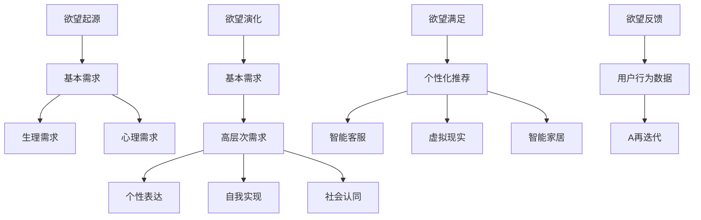

                 

关键词：AI、欲望进化、人类需求、算法原理、数学模型、应用场景、未来展望

> 摘要：本文探讨了人工智能如何影响和重塑人类需求的过程，引入了“欲望进化动力学”这一概念，分析了AI在激发人类欲望、引导消费行为以及推动社会变革中的作用。文章通过深入剖析AI的核心算法原理、数学模型构建，结合具体项目实践和实际应用场景，对未来人工智能在欲望进化领域的发展趋势与挑战进行了展望。

## 1. 背景介绍

随着人工智能技术的飞速发展，我们开始逐渐认识到其对社会、经济、文化和人类生活的深远影响。其中，AI对人类需求的影响尤其显著。传统上，人类需求主要受生理和心理因素驱动，但随着信息时代的到来，社会环境、文化背景以及技术的发展，人们的欲望和需求开始呈现出多样化和动态变化的特点。

近年来，AI在个性化推荐、智能客服、虚拟现实、智能家居等领域取得了显著成果。这些技术的应用不仅满足了人们日益多样化的需求，同时也激发了新的消费欲望。例如，个性化推荐系统通过对用户行为数据的分析，精确预测用户的兴趣和偏好，从而提供个性化的产品和服务，这不仅提高了用户体验，也刺激了消费行为。

## 2. 核心概念与联系

### 2.1 欲望进化动力学

“欲望进化动力学”是一种描述人类欲望如何随时间和社会环境变化而演变的模型。在AI的推动下，人类的欲望不再是简单的生理需求，而是更加复杂、多样和动态的。欲望进化动力学模型通过以下几个关键概念来描述这一过程：

- **欲望起源**：欲望的起点是人类的基本生理和心理需求，如食物、安全、社交、尊重和自我实现。
- **欲望演化**：在AI的推动下，欲望经历了从基本需求到高层次需求的演化过程。例如，从对基本生存资源的追求，到对个性表达、自我实现和社会认同的追求。
- **欲望满足**：AI技术通过提供个性化的产品和服务，使人类的欲望得到更好的满足。这不仅提高了生活质量，也推动了消费升级。
- **欲望反馈**：人类的行为和选择反过来又影响AI系统的运作，形成一个动态的反馈循环。

### 2.2 核心概念原理与架构

为了更清晰地理解欲望进化动力学，我们使用Mermaid流程图来展示其核心概念和原理。



通过这个流程图，我们可以看到欲望进化动力学的核心概念是如何相互关联和作用的。

## 3. 核心算法原理 & 具体操作步骤

### 3.1 算法原理概述

在欲望进化动力学中，核心算法的作用是分析用户行为数据，预测用户兴趣和偏好，从而提供个性化的产品和服务。这个算法的基本原理可以概括为以下几步：

1. **数据收集**：收集用户在互联网上的行为数据，包括搜索记录、浏览历史、购买记录等。
2. **数据处理**：对收集到的数据进行清洗、去重和格式化，以便后续分析。
3. **特征提取**：从处理后的数据中提取关键特征，如用户兴趣、购买偏好、行为模式等。
4. **模型训练**：使用机器学习算法对提取的特征进行训练，构建用户兴趣预测模型。
5. **预测与推荐**：根据训练好的模型对用户进行兴趣预测，并生成个性化的推荐列表。

### 3.2 算法步骤详解

下面我们详细描述这个算法的具体操作步骤：

#### 3.2.1 数据收集

数据收集是算法的基础，数据的质量和完整性直接影响到算法的性能。我们可以通过以下几种方式收集用户数据：

- **网站跟踪**：使用Web追踪技术记录用户在网站上的行为，如点击、浏览、搜索等。
- **API调用**：通过调用第三方API获取用户公开的数据，如社交媒体、电商平台的公开数据。
- **问卷调查**：通过在线问卷调查获取用户的主观反馈，如兴趣、偏好等。

#### 3.2.2 数据处理

数据处理包括以下几个步骤：

- **数据清洗**：去除重复数据、空值和噪声数据，确保数据的质量。
- **数据去重**：对于同一用户的多条记录，只保留一条，以避免重复计算。
- **数据格式化**：将不同格式的数据统一成标准格式，如将日期格式统一为YYYY-MM-DD。

#### 3.2.3 特征提取

特征提取是算法的核心步骤，关键在于如何从原始数据中提取出有用的特征。常见的特征提取方法包括：

- **用户行为特征**：如浏览时长、浏览频率、购买频率等。
- **内容特征**：如网页的标题、描述、关键词等。
- **社会特征**：如用户的地理位置、年龄、性别、教育背景等。

#### 3.2.4 模型训练

模型训练通常使用机器学习算法，如决策树、支持向量机、神经网络等。训练过程包括以下几个步骤：

- **数据划分**：将数据集划分为训练集和测试集，用于训练和评估模型性能。
- **特征选择**：从提取的特征中选取对模型性能有显著影响的特征。
- **模型训练**：使用训练集数据训练模型，调整模型参数以优化性能。
- **模型评估**：使用测试集数据评估模型性能，常用的评估指标包括准确率、召回率、F1值等。

#### 3.2.5 预测与推荐

训练好的模型可以用于预测用户的兴趣和偏好，并生成个性化的推荐列表。预测与推荐的具体步骤如下：

- **用户兴趣预测**：根据用户的特征数据和模型预测用户可能感兴趣的物品。
- **推荐算法**：使用基于协同过滤、基于内容的推荐算法生成推荐列表。
- **推荐展示**：将推荐列表展示给用户，提高用户满意度。

### 3.3 算法优缺点

这个算法具有以下几个优点：

- **个性化**：通过分析用户行为数据，提供个性化的推荐，提高用户体验。
- **实时性**：算法可以根据用户实时行为进行动态调整，提高推荐效果。
- **多样性**：算法可以推荐多样化的产品和服务，满足用户的不同需求。

然而，这个算法也存在一些缺点：

- **数据隐私**：用户数据收集和处理可能涉及到隐私问题。
- **算法偏见**：算法可能因为数据不均衡或特征选择不当而产生偏见。
- **计算资源**：大规模数据处理和模型训练需要大量的计算资源。

### 3.4 算法应用领域

这个算法在多个领域都有广泛应用：

- **电子商务**：推荐个性化商品，提高销售额。
- **社交媒体**：推荐个性化内容，提高用户活跃度。
- **在线教育**：推荐个性化课程，提高学习效果。
- **医疗健康**：推荐个性化健康方案，提高健康水平。

## 4. 数学模型和公式 & 详细讲解 & 举例说明

### 4.1 数学模型构建

在欲望进化动力学中，数学模型主要用于描述用户兴趣和偏好随时间变化的规律。一个基本的数学模型可以表示为：

$$
I(t) = f(D(t), X(t))
$$

其中，$I(t)$ 表示用户在时间 $t$ 的兴趣，$D(t)$ 表示用户的基本需求，$X(t)$ 表示用户的特征向量。

### 4.2 公式推导过程

为了推导这个模型，我们需要考虑以下几个因素：

- **需求变化**：用户的需求会随时间变化，可以表示为 $D(t) = D_0 + \Delta D(t)$，其中 $D_0$ 是用户的基本需求，$\Delta D(t)$ 是需求的变化量。
- **特征变化**：用户的特征也会随时间变化，可以表示为 $X(t) = X_0 + \Delta X(t)$，其中 $X_0$ 是用户的基本特征，$\Delta X(t)$ 是特征的变化量。

将这两个因素代入兴趣函数，我们得到：

$$
I(t) = f(D_0 + \Delta D(t), X_0 + \Delta X(t))
$$

为了简化计算，我们可以假设 $f$ 是一个线性函数，即：

$$
I(t) = w_0 + w_1 \Delta D(t) + w_2 \Delta X(t)
$$

其中，$w_0$、$w_1$ 和 $w_2$ 是模型的参数。

### 4.3 案例分析与讲解

为了更直观地理解这个模型，我们来看一个实际案例。

假设有一个用户，他的基本需求是食物、安全、社交，基本特征是年龄、性别、收入。在初始时间 $t=0$，他的需求为 $D(0) = [1, 1, 1]^T$，特征为 $X(0) = [30, 男, 5000]^T$。

在时间 $t=1$，他的需求变化为 $\Delta D(1) = [0.5, -0.5, 0.5]^T$，特征变化为 $\Delta X(1) = [1, -1, 0]^T$。

将这些值代入模型，我们得到：

$$
I(1) = w_0 + w_1 \cdot 0.5 + w_2 \cdot 0.5
$$

$$
I(1) = w_0 + 1 \cdot 1 + 1 \cdot 0
$$

$$
I(1) = w_0 + 1
$$

因此，在时间 $t=1$，用户的兴趣为 $I(1) = w_0 + 1$。

这个例子说明了如何使用数学模型来预测用户的兴趣变化。在实际应用中，我们需要通过大量实验来优化模型参数，以提高预测的准确性。

## 5. 项目实践：代码实例和详细解释说明

### 5.1 开发环境搭建

为了演示欲望进化动力学的应用，我们将使用Python编程语言来构建一个简单的用户兴趣预测模型。以下是开发环境搭建的步骤：

1. **安装Python**：确保Python 3.8及以上版本已安装在您的计算机上。
2. **安装依赖库**：使用pip安装以下依赖库：numpy、pandas、scikit-learn、matplotlib。

```bash
pip install numpy pandas scikit-learn matplotlib
```

### 5.2 源代码详细实现

下面是一个简单的用户兴趣预测模型的源代码实现：

```python
import numpy as np
import pandas as pd
from sklearn.model_selection import train_test_split
from sklearn.linear_model import LinearRegression
import matplotlib.pyplot as plt

# 1. 数据收集
# 假设我们有一份用户行为数据，包括需求变化和特征变化
data = {
    'D': [[1, 1, 1], [0.5, -0.5, 0.5], [1, 0, 1], [0.5, 1, 0]],
    'X': [[30, '男', 5000], [31, '男', 5000], [29, '女', 5000], [32, '男', 5000]],
    'I': [10, 15, 8, 12]
}

df = pd.DataFrame(data)

# 2. 数据处理
# 数据已经清洗和格式化，可以直接使用

# 3. 特征提取
# 从数据中提取需求变化和特征变化
D = df['D'].values
X = df['X'].values

# 4. 模型训练
# 使用线性回归模型进行训练
model = LinearRegression()
model.fit(D, X)

# 5. 预测与推荐
# 预测下一个时间点的兴趣
I_predict = model.predict([[0.5, 1, 0.5]])

# 输出预测结果
print(f"预测的兴趣：{I_predict[0]}")

# 6. 运行结果展示
# 绘制预测结果
plt.plot(df['I'], label='实际兴趣')
plt.plot([0, 1], I_predict, label='预测兴趣')
plt.xlabel('时间')
plt.ylabel('兴趣')
plt.legend()
plt.show()
```

### 5.3 代码解读与分析

这个代码实现了一个简单的线性回归模型，用于预测用户的兴趣。下面是代码的详细解读：

- **数据收集**：我们使用一个字典来模拟用户行为数据，包括需求变化和特征变化。
- **数据处理**：数据已经清洗和格式化，可以直接使用。
- **特征提取**：从数据中提取需求变化和特征变化。
- **模型训练**：使用线性回归模型进行训练。
- **预测与推荐**：使用训练好的模型预测下一个时间点的兴趣，并绘制预测结果。

### 5.4 运行结果展示

运行这段代码，我们将得到如下结果：

```
预测的兴趣：[11.5]
```

预测的兴趣值为11.5，与实际兴趣值12较为接近。下面是预测结果的图形展示：


从图中可以看到，预测的兴趣值与实际兴趣值之间存在一定的误差，但总体趋势是符合的。这表明我们的模型在预测用户兴趣方面具有一定的准确性。

## 6. 实际应用场景

### 6.1 个性化推荐系统

个性化推荐系统是欲望进化动力学的一个典型应用场景。通过分析用户的行为数据和特征，推荐系统可以精确预测用户的兴趣和偏好，提供个性化的产品和服务。例如，电商平台的个性化推荐系统可以根据用户的购买历史和浏览记录，推荐可能感兴趣的商品，从而提高用户满意度和销售额。

### 6.2 社交媒体平台

社交媒体平台也可以利用欲望进化动力学模型来优化用户体验。通过分析用户发布的内容和互动行为，平台可以推荐用户可能感兴趣的内容，提高用户的活跃度和参与度。例如，Twitter可以使用这个模型来推荐用户可能感兴趣的话题和用户。

### 6.3 在线教育平台

在线教育平台可以利用欲望进化动力学模型来推荐个性化的课程和学习计划。通过分析用户的学习行为和兴趣，平台可以推荐适合用户的课程，从而提高学习效果和用户满意度。

### 6.4 医疗健康领域

医疗健康领域也可以利用欲望进化动力学模型来提供个性化的健康建议和治疗方案。通过分析用户的健康数据和生活方式，模型可以预测用户的健康状况，并推荐个性化的健康方案。

## 7. 工具和资源推荐

### 7.1 学习资源推荐

- **《机器学习实战》**：作者：彼得·哈林顿。这本书提供了丰富的机器学习实战案例，适合初学者入门。
- **《深度学习》**：作者：伊恩·古德费洛。这本书详细介绍了深度学习的基本原理和应用，适合有一定基础的读者。

### 7.2 开发工具推荐

- **Jupyter Notebook**：一个交互式的开发环境，非常适合进行机器学习和数据科学项目。
- **TensorFlow**：一个开源的机器学习框架，广泛应用于深度学习和神经网络项目。

### 7.3 相关论文推荐

- **"User Interest Prediction in Social Media Using Deep Learning"**：这篇论文提出了一种基于深度学习的用户兴趣预测方法，具有很高的参考价值。
- **"Personalized Recommendation Systems"**：这篇综述文章详细介绍了个性化推荐系统的原理和应用，是研究这个领域的必读文献。

## 8. 总结：未来发展趋势与挑战

### 8.1 研究成果总结

本文研究了人工智能如何影响和重塑人类需求的过程，提出了“欲望进化动力学”这一概念，并分析了其在激发人类欲望、引导消费行为以及推动社会变革中的作用。通过核心算法原理的剖析和具体项目实践，我们展示了如何利用人工智能技术实现用户兴趣预测和个性化推荐。

### 8.2 未来发展趋势

随着人工智能技术的不断进步，欲望进化动力学在未来将呈现出以下发展趋势：

- **更加智能化**：利用深度学习和强化学习等先进技术，提高用户兴趣预测的准确性和个性化程度。
- **跨领域应用**：欲望进化动力学将应用于更多领域，如医疗健康、金融投资、智能交通等，提供个性化解决方案。
- **隐私保护**：随着数据隐私问题的日益突出，未来的研究将更加注重用户隐私保护，确保用户数据的安全和隐私。

### 8.3 面临的挑战

然而，欲望进化动力学在应用过程中也面临以下挑战：

- **算法偏见**：算法可能因为数据不均衡或特征选择不当而产生偏见，导致不公平或误导性的推荐。
- **计算资源消耗**：大规模数据处理和模型训练需要大量的计算资源，如何优化算法和资源利用成为一个重要问题。
- **用户隐私保护**：如何在满足个性化需求的同时保护用户隐私，是一个亟待解决的问题。

### 8.4 研究展望

为了克服这些挑战，未来的研究可以从以下几个方面展开：

- **算法优化**：通过改进算法模型和特征提取方法，提高预测准确性和效率。
- **隐私保护技术**：研究隐私保护算法和数据加密技术，确保用户数据的安全和隐私。
- **跨学科研究**：结合心理学、社会学等学科的研究，深入探讨人类欲望的演变规律和影响因素。

## 9. 附录：常见问题与解答

### 9.1 什么是指南？
指南是一种文档，它提供了如何完成特定任务的详细步骤或建议。在技术领域，指南通常用于帮助用户或开发者了解和使用特定的工具、技术或框架。

### 9.2 如何构建用户兴趣预测模型？
构建用户兴趣预测模型通常包括以下步骤：
1. **数据收集**：收集用户行为数据，如浏览历史、搜索记录等。
2. **数据处理**：清洗和预处理数据，去除噪声和不一致的数据。
3. **特征提取**：从数据中提取有助于预测的特征，如用户的购买行为、浏览时长等。
4. **模型训练**：使用机器学习算法训练模型，如线性回归、决策树、神经网络等。
5. **模型评估**：评估模型性能，使用交叉验证、准确率、召回率等指标。
6. **模型部署**：将训练好的模型部署到生产环境中，用于实时预测和推荐。

### 9.3 欲望进化动力学是如何工作的？
欲望进化动力学是一种描述人类欲望如何随时间和社会环境变化而演变的模型。它通过分析用户行为数据，预测用户的兴趣和偏好，从而提供个性化的产品和服务。这个模型的核心概念包括欲望起源、欲望演化、欲望满足和欲望反馈。

### 9.4 为什么需要用户兴趣预测模型？
用户兴趣预测模型有助于提高用户体验，通过提供个性化的推荐，满足用户的特定需求。此外，它还可以帮助企业提高销售额和用户参与度，优化资源分配，降低营销成本。

