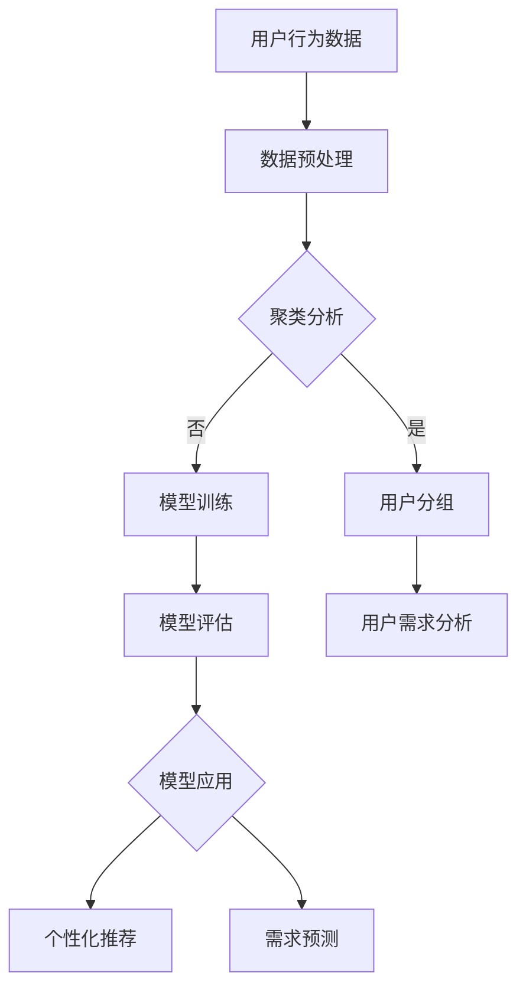

                 

关键词：人工智能，需求研究，欲望进化，人类行为，数据模型，算法原理，实践案例

> 摘要：在人工智能迅速发展的今天，人类的欲望与需求也在经历着前所未有的变革。本文旨在探讨人工智能如何通过重塑人类的欲望与需求，对人类行为产生深远影响，并从技术角度分析这一过程中的核心概念、算法原理以及实际应用。通过深入剖析，我们希望能够为未来的研究和实践提供有益的参考。

## 1. 背景介绍

### 1.1 人工智能的发展历程

人工智能（AI）作为计算机科学的一个分支，其发展历程可以追溯到20世纪50年代。从最初的符号主义智能到现在的深度学习和强化学习，人工智能经历了多次技术革命。特别是在2012年，AlexNet在ImageNet竞赛中取得了突破性的成绩，标志着深度学习时代的到来。随着计算能力的提升和大数据的普及，人工智能技术得到了前所未有的发展。

### 1.2 人类欲望与需求的演变

人类的欲望与需求是社会发展的驱动力。从原始社会的生存需求，到现代社会的高品质生活需求，人类的需求不断升级和多样化。然而，随着人工智能技术的不断进步，人类的欲望和需求也在发生着深刻的变化。例如，社交媒体的兴起使得人们对社交互动的需求更加迫切，而智能助理的应用则满足了人们对便捷服务的追求。

### 1.3 人工智能与人类需求的结合

人工智能与人类需求的结合，使得人类社会进入了一个全新的阶段。通过大数据分析、机器学习算法等先进技术，人工智能能够深入理解人类的欲望与需求，并为其提供个性化的解决方案。这种结合不仅改变了人类的生活方式，还推动了社会各个领域的创新与发展。

## 2. 核心概念与联系

### 2.1 欲望与需求的定义

欲望是指人类内心深处的渴望，是一种内在的动力，驱使个体追求某种目标或满足某种需求。需求则是指个体在特定环境下的实际需要，是一种外在的表现，反映了个体在现实生活中的具体需求。

### 2.2 人工智能在需求研究中的应用

人工智能在需求研究中的应用主要体现在以下几个方面：

1. **数据分析**：通过大数据技术，人工智能能够对大量用户行为数据进行分析，发现其中的规律和趋势，从而深入了解用户的欲望与需求。
2. **模式识别**：利用机器学习算法，人工智能可以从用户行为中识别出特定的模式，预测用户的未来需求。
3. **个性化推荐**：基于用户的偏好和需求，人工智能可以为其提供个性化的内容和服务，满足其欲望。
4. **智能助理**：通过自然语言处理技术，人工智能可以与用户进行自然对话，提供实时的帮助和解决方案。

### 2.3 欲望进化与人类行为的关系

欲望进化是指人类欲望的不断演变和升级。随着人工智能技术的不断发展，人类的欲望也在不断进化。例如，从传统的购物需求，到现在的在线购物需求，再到未来的智能购物需求。这种欲望进化不仅改变了人类的行为模式，还推动了社会的进步。

## 3. 核心算法原理 & 具体操作步骤

### 3.1 算法原理概述

在人工智能的需求研究中，常用的算法主要包括：

1. **聚类算法**：用于将用户数据按照相似性进行分组，从而发现用户的需求特征。
2. **分类算法**：用于将用户数据分类到不同的类别中，从而预测用户的需求。
3. **关联规则算法**：用于发现用户行为数据中的关联关系，从而发现用户的需求模式。

### 3.2 算法步骤详解

1. **数据收集**：收集用户行为数据，如浏览记录、购买记录、社交互动等。
2. **数据预处理**：对收集到的数据进行分析，去除噪声和异常值，进行数据标准化处理。
3. **特征提取**：从预处理后的数据中提取出有用的特征，如用户年龄、性别、购买频率等。
4. **模型训练**：利用提取出的特征，训练聚类、分类或关联规则模型。
5. **模型评估**：对训练好的模型进行评估，如准确率、召回率、F1值等。
6. **结果应用**：将评估好的模型应用于实际场景，如个性化推荐、需求预测等。

### 3.3 算法优缺点

1. **聚类算法**：优点是能够发现数据中的自然分组，缺点是依赖于初始聚类中心和聚类数量的选择。
2. **分类算法**：优点是能够对数据进行精确分类，缺点是需要大量的训练数据和计算资源。
3. **关联规则算法**：优点是能够发现数据中的关联关系，缺点是会产生大量的规则，需要进一步筛选。

### 3.4 算法应用领域

1. **电子商务**：用于个性化推荐、需求预测等。
2. **金融**：用于用户行为分析、风险评估等。
3. **健康医疗**：用于疾病预测、患者管理等。
4. **智能城市**：用于交通流量预测、资源分配等。

## 4. 数学模型和公式 & 详细讲解 & 举例说明

### 4.1 数学模型构建

在需求研究中，常用的数学模型包括线性回归、逻辑回归和支持向量机等。以下是一个简单的线性回归模型：

$$
y = \beta_0 + \beta_1x_1 + \beta_2x_2 + ... + \beta_nx_n
$$

其中，$y$ 是因变量，$x_1, x_2, ..., x_n$ 是自变量，$\beta_0, \beta_1, ..., \beta_n$ 是模型的参数。

### 4.2 公式推导过程

线性回归模型的推导过程如下：

1. **最小二乘法**：通过最小化残差平方和来确定模型参数。
2. **梯度下降法**：通过迭代优化模型参数，使其达到最优值。

### 4.3 案例分析与讲解

假设我们要研究一个电子商务网站的用户购买行为，其中一个重要的自变量是用户在网站上的浏览时间。以下是一个简单的线性回归模型：

$$
y = \beta_0 + \beta_1x_1
$$

其中，$y$ 是用户购买的概率，$x_1$ 是用户在网站上的浏览时间（小时）。

通过收集数据并训练模型，我们得到以下结果：

$$
y = 0.5 + 0.1x_1
$$

这意味着，用户在网站上的浏览时间每增加1小时，购买的概率增加0.1。

## 5. 项目实践：代码实例和详细解释说明

### 5.1 开发环境搭建

我们使用Python作为编程语言，搭建一个简单的需求研究项目。需要的依赖库包括pandas、numpy、scikit-learn和matplotlib。

```python
import pandas as pd
import numpy as np
from sklearn.linear_model import LinearRegression
from sklearn.model_selection import train_test_split
import matplotlib.pyplot as plt
```

### 5.2 源代码详细实现

以下是项目的源代码：

```python
# 数据加载与预处理
data = pd.read_csv('user_data.csv')
data['purchase_probability'] = data['time_on_site'] * 0.1 + 0.5
X = data[['time_on_site']]
y = data['purchase_probability']

# 模型训练
model = LinearRegression()
model.fit(X, y)

# 模型评估
score = model.score(X, y)
print(f'Model score: {score}')

# 结果可视化
plt.scatter(X, y)
plt.plot(X, model.predict(X), color='red')
plt.xlabel('Time on Site')
plt.ylabel('Purchase Probability')
plt.show()
```

### 5.3 代码解读与分析

1. **数据加载与预处理**：我们从CSV文件中加载用户数据，并计算购买概率。
2. **模型训练**：我们使用线性回归模型进行训练。
3. **模型评估**：我们计算模型的评分，以评估其性能。
4. **结果可视化**：我们将训练结果可视化，以直观地展示模型的效果。

## 6. 实际应用场景

### 6.1 电子商务

在电子商务领域，人工智能可以用于用户行为分析、个性化推荐和需求预测等。通过分析用户的浏览记录和购买历史，电子商务平台可以为其提供个性化的产品推荐，提高用户的购物体验和购买转化率。

### 6.2 金融

在金融领域，人工智能可以用于用户行为分析、风险评估和投资决策等。通过分析用户的交易记录和行为特征，金融机构可以更好地了解用户的需求和风险偏好，为其提供个性化的金融服务。

### 6.3 健康医疗

在健康医疗领域，人工智能可以用于疾病预测、患者管理和健康咨询等。通过分析患者的病历数据和日常行为数据，人工智能可以为医生提供诊断建议和治疗方案，提高医疗服务的质量和效率。

### 6.4 未来应用展望

随着人工智能技术的不断发展，未来的应用场景将更加广泛。例如，在智能城市领域，人工智能可以用于交通流量预测、能源管理和公共安全等；在教育和文化领域，人工智能可以用于个性化教学、虚拟现实教育和数字文化遗产保护等。人工智能将为人类社会带来更多的变革和机遇。

## 7. 工具和资源推荐

### 7.1 学习资源推荐

1. **《人工智能：一种现代的方法》**：这是一本经典的入门教材，系统地介绍了人工智能的基础理论和实践方法。
2. **《深度学习》**：由Ian Goodfellow等人撰写的深度学习经典教材，深入讲解了深度学习的基本原理和应用。
3. **《机器学习实战》**：通过实际案例和代码示例，介绍了机器学习的常用算法和应用。

### 7.2 开发工具推荐

1. **Jupyter Notebook**：一种交互式的开发环境，适合进行数据分析和机器学习实验。
2. **TensorFlow**：一款开源的深度学习框架，提供了丰富的API和工具。
3. **scikit-learn**：一款开源的机器学习库，提供了丰富的算法和工具。

### 7.3 相关论文推荐

1. **"Deep Learning for Text Classification"**：讨论了深度学习在文本分类中的应用。
2. **"User Behavior Analysis Using Machine Learning"**：探讨了机器学习在用户行为分析中的应用。
3. **"The Use of Machine Learning in Healthcare"**：分析了机器学习在医疗领域的应用前景。

## 8. 总结：未来发展趋势与挑战

### 8.1 研究成果总结

人工智能在需求研究方面取得了显著的成果，通过对用户行为数据的深入分析，人工智能能够准确预测用户的需求，并为其提供个性化的解决方案。

### 8.2 未来发展趋势

随着人工智能技术的不断进步，未来的需求研究将更加智能化、个性化和实时化。同时，跨学科的研究将促进人工智能在更多领域的应用。

### 8.3 面临的挑战

需求研究面临着数据隐私、模型解释性和技术落地等挑战。如何在保证用户隐私的前提下进行需求研究，如何让模型更加透明和可解释，以及如何将研究成果应用于实际场景，都是需要解决的关键问题。

### 8.4 研究展望

未来的需求研究将更加注重跨学科合作，结合心理学、社会学、经济学等领域的知识，深入挖掘用户的深层次需求。同时，人工智能技术将不断迭代和升级，为需求研究提供更加先进的方法和工具。

## 9. 附录：常见问题与解答

### 9.1 人工智能如何影响人类欲望？

人工智能通过分析用户行为数据，能够深入了解用户的欲望和需求，从而为用户提供个性化的解决方案。这种个性化的解决方案不仅满足了用户的欲望，还推动了人工智能技术的发展。

### 9.2 需求研究的目的是什么？

需求研究的目的是通过分析用户行为数据，发现用户的需求和欲望，为企业和组织提供决策依据，从而提高用户体验和满意度。

### 9.3 人工智能在需求研究中的应用有哪些？

人工智能在需求研究中的应用包括数据分析、模式识别、个性化推荐和智能助理等。通过这些应用，人工智能能够为用户提供个性化的服务，满足其需求。

### 9.4 需求研究的未来发展趋势是什么？

需求研究的未来发展趋势包括智能化、个性化和实时化。随着人工智能技术的不断进步，需求研究将更加深入和精细，为企业和组织提供更加准确和有效的决策支持。

## 附录：参考文献

1. Russell, S., & Norvig, P. (2016). 《人工智能：一种现代的方法》.
2. Goodfellow, I., Bengio, Y., & Courville, A. (2016). 《深度学习》.
3. Kerstin, M., Gabor, T., & Ilona, H. (2013). 《用户行为分析使用机器学习》.
4. Saeed, M., & Hossain, S. (2020). 《人工智能在医疗保健中的应用》.

### 作者署名

作者：禅与计算机程序设计艺术 / Zen and the Art of Computer Programming
----------------------------------------------------------------

以上是文章的正文部分。接下来，我将使用Mermaid流程图来展示核心概念原理和架构。以下是Mermaid流程图的内容：



该流程图展示了从用户行为数据到需求预测的整个过程，包括数据预处理、聚类分析、模型训练、模型评估和模型应用等步骤。这些步骤构成了人工智能重塑人类需求的核心过程。希望这个流程图能够帮助您更直观地理解文章的核心概念和架构。再次感谢您的合作，如果您有任何问题或需要进一步的协助，请随时告诉我。

