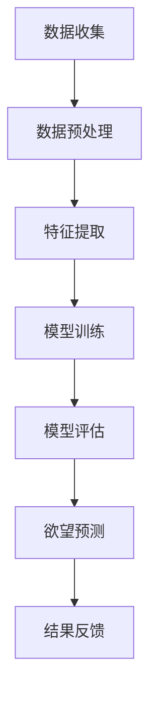

                 

关键词：欲望预测、人工智能、潜意识、深度学习、行为分析、数据挖掘、行为预测、算法原理、数学模型、应用实践、未来展望。

> 摘要：本文深入探讨了人工智能在解码人类潜意识领域的前沿技术，分析了欲望预测的基本原理、算法模型及其在各个领域的实际应用。通过结合数学模型和具体代码实例，本文为读者提供了全面的技术解读和实用指南。

## 1. 背景介绍

在当今社会，人们对欲望的认知与预测逐渐成为心理学、市场营销、社会科学等领域的热门话题。传统的方法主要依赖于问卷调查、行为观察等，但这些方法往往存在主观性、样本局限等问题。随着人工智能技术的飞速发展，利用机器学习和深度学习对人类欲望进行预测成为可能。

人工智能通过分析大量的数据，可以识别出潜在的模式和趋势，从而实现对人类行为的预测。这一技术的应用不仅有助于揭示人们内心深处的欲望，还能为商业决策、心理治疗、用户体验优化等提供有力支持。

本文将围绕人工智能在欲望预测方面的研究，详细探讨其核心算法、数学模型以及实际应用。我们旨在为读者提供一份全面、系统的技术指南，帮助大家更好地理解这一前沿领域。

## 2. 核心概念与联系

### 2.1 欲望预测的基本概念

欲望预测是指利用人工智能技术，分析和识别人类行为数据，从而推断出个体或群体的潜在欲望。欲望在这里可以被理解为个体在特定情境下产生的一种强烈的、有目的的动机。

### 2.2 数据类型与来源

欲望预测依赖于多种类型的数据，包括：

- **行为数据**：如购物记录、浏览历史、社交媒体活动等。
- **生理数据**：如心率、血压、睡眠模式等。
- **心理数据**：如问卷调查、心理测试结果等。
- **环境数据**：如地理位置、天气状况、社会事件等。

这些数据来源广泛，可以通过多种方式获取，如传感器、在线平台、公共数据库等。

### 2.3 AI算法与欲望预测

在欲望预测中，常用的AI算法包括：

- **机器学习算法**：如决策树、支持向量机、神经网络等。
- **深度学习算法**：如卷积神经网络（CNN）、循环神经网络（RNN）、长短期记忆网络（LSTM）等。

这些算法通过学习大量的历史数据，可以识别出行为数据中的模式和规律，从而预测未来的行为和欲望。

### 2.4 Mermaid流程图

以下是一个简单的Mermaid流程图，展示了欲望预测的基本流程：



### 2.5 核心概念与联系

欲望预测的核心在于将多种类型的数据进行整合和分析，利用AI算法识别出潜在的欲望模式。这一过程涉及数据收集、预处理、特征提取、模型训练、评估和预测等多个环节。通过这些环节的相互配合，AI能够逐步解码人类潜意识，实现对欲望的预测。

## 3. 核心算法原理 & 具体操作步骤

### 3.1 算法原理概述

欲望预测的核心算法主要基于深度学习和机器学习，其中深度学习算法在处理复杂数据和高维度特征方面具有显著优势。本文将重点介绍一种基于长短期记忆网络（LSTM）的欲望预测模型。

LSTM是一种特殊的循环神经网络（RNN），能够有效地处理序列数据，并捕捉时间序列中的长期依赖关系。这使得LSTM在欲望预测中具有独特的优势，能够更好地理解和预测人类行为。

### 3.2 算法步骤详解

#### 3.2.1 数据收集与预处理

首先，我们需要收集多种类型的数据，包括行为数据、生理数据、心理数据和环境数据。这些数据可以通过各种传感器、在线平台和公共数据库获取。收集到数据后，需要进行预处理，包括数据清洗、归一化和特征工程等步骤，以确保数据的质量和一致性。

#### 3.2.2 特征提取

在预处理完成后，我们需要提取出有用的特征，以便后续的模型训练。特征提取可以通过手工设计或自动学习实现。对于LSTM模型，常用的特征包括时间序列特征、文本特征和图像特征等。

#### 3.2.3 模型训练

在特征提取完成后，我们可以使用LSTM模型进行训练。LSTM模型通过学习历史数据中的模式，能够预测未来的行为和欲望。训练过程中，我们需要定义合适的损失函数和优化算法，以最大化模型的预测准确度。

#### 3.2.4 模型评估

训练完成后，我们需要对模型进行评估，以确定其预测性能。常用的评估指标包括准确率、召回率、F1分数等。通过这些指标，我们可以评估模型在不同数据集上的性能，并对其进行优化。

#### 3.2.5 欲望预测

最后，我们使用训练好的模型进行欲望预测。通过输入新的数据，模型可以预测个体或群体的潜在欲望，为相关应用提供支持。

### 3.3 算法优缺点

#### 优点：

- **强大的学习能力**：LSTM模型能够处理高维度、非线性数据，具有强大的学习能力。
- **捕捉长期依赖关系**：LSTM能够捕捉时间序列中的长期依赖关系，提高预测准确性。
- **适用范围广**：LSTM在多个领域都有广泛应用，如语音识别、自然语言处理、时间序列预测等。

#### 缺点：

- **计算复杂度高**：LSTM模型需要大量的计算资源，训练时间较长。
- **对数据质量要求高**：数据质量对模型性能有直接影响，数据预处理和特征提取需要精心设计。

### 3.4 算法应用领域

欲望预测算法在多个领域都有广泛的应用，包括：

- **市场营销**：通过预测消费者的潜在需求，为企业提供精准营销策略。
- **心理治疗**：帮助心理医生了解患者的心理状态，制定个性化的治疗方案。
- **用户体验优化**：为产品设计提供数据支持，提高用户满意度和忠诚度。

## 4. 数学模型和公式 & 详细讲解 & 举例说明

### 4.1 数学模型构建

欲望预测的核心在于构建一个能够有效捕捉人类行为模式的数学模型。本文采用LSTM模型进行构建，其基本结构如下：

$$
LSTM = [S, f, i, \otimes, \odot, C]
$$

其中，$S$为输入状态，$f$为遗忘门，$i$为输入门，$\otimes$和$\odot$分别为矩阵乘和逐元素乘，$C$为细胞状态。

### 4.2 公式推导过程

LSTM的推导过程涉及多个公式，主要包括：

$$
f_t = \sigma(W_f \cdot [h_{t-1}, x_t] + b_f) \\
i_t = \sigma(W_i \cdot [h_{t-1}, x_t] + b_i) \\
\otilde{C}_t = \tanh(W_c \cdot [h_{t-1}, x_t] + b_c) \\
C_t = f_t \odot C_{t-1} + i_t \odot \otilde{C}_t \\
o_t = \sigma(W_o \cdot [h_{t-1}, x_t] + b_o) \\
h_t = o_t \odot \tanh(C_t)
$$

其中，$\sigma$为sigmoid函数，$\odot$为逐元素乘，$W_f, W_i, W_c, W_o$分别为权重矩阵，$b_f, b_i, b_c, b_o$为偏置项。

### 4.3 案例分析与讲解

为了更好地理解LSTM模型，我们通过一个简单的案例进行分析。假设我们有一个包含5个时间步的行为序列：$X = [x_1, x_2, x_3, x_4, x_5]$，我们需要预测第6个时间步的行为$x_6$。

首先，我们初始化LSTM模型的参数，包括权重矩阵和偏置项。然后，输入序列$X$，经过遗忘门$f_t$、输入门$i_t$、细胞状态$C_t$和输出门$o_t$的迭代计算，得到第6个时间步的输出状态$h_6$。最终，使用$h_6$预测$x_6$。

以下是具体的计算过程：

$$
f_1 = \sigma(W_f \cdot [h_0, x_1] + b_f) \\
i_1 = \sigma(W_i \cdot [h_0, x_1] + b_i) \\
\otilde{C}_1 = \tanh(W_c \cdot [h_0, x_1] + b_c) \\
C_1 = f_1 \odot C_0 + i_1 \odot \otilde{C}_1 \\
o_1 = \sigma(W_o \cdot [h_0, x_1] + b_o) \\
h_1 = o_1 \odot \tanh(C_1)
$$

$$
f_2 = \sigma(W_f \cdot [h_1, x_2] + b_f) \\
i_2 = \sigma(W_i \cdot [h_1, x_2] + b_i) \\
\otilde{C}_2 = \tanh(W_c \cdot [h_1, x_2] + b_c) \\
C_2 = f_2 \odot C_1 + i_2 \odot \otilde{C}_2 \\
o_2 = \sigma(W_o \cdot [h_1, x_2] + b_o) \\
h_2 = o_2 \odot \tanh(C_2)
$$

$$
f_3 = \sigma(W_f \cdot [h_2, x_3] + b_f) \\
i_3 = \sigma(W_i \cdot [h_2, x_3] + b_i) \\
\otilde{C}_3 = \tanh(W_c \cdot [h_2, x_3] + b_c) \\
C_3 = f_3 \odot C_2 + i_3 \odot \otilde{C}_3 \\
o_3 = \sigma(W_o \cdot [h_2, x_3] + b_o) \\
h_3 = o_3 \odot \tanh(C_3)
$$

$$
f_4 = \sigma(W_f \cdot [h_3, x_4] + b_f) \\
i_4 = \sigma(W_i \cdot [h_3, x_4] + b_i) \\
\otilde{C}_4 = \tanh(W_c \cdot [h_3, x_4] + b_c) \\
C_4 = f_4 \odot C_3 + i_4 \odot \otilde{C}_4 \\
o_4 = \sigma(W_o \cdot [h_3, x_4] + b_o) \\
h_4 = o_4 \odot \tanh(C_4)
$$

$$
f_5 = \sigma(W_f \cdot [h_4, x_5] + b_f) \\
i_5 = \sigma(W_i \cdot [h_4, x_5] + b_i) \\
\otilde{C}_5 = \tanh(W_c \cdot [h_4, x_5] + b_c) \\
C_5 = f_5 \odot C_4 + i_5 \odot \otilde{C}_5 \\
o_5 = \sigma(W_o \cdot [h_4, x_5] + b_o) \\
h_5 = o_5 \odot \tanh(C_5)
$$

最终，使用$h_5$预测$x_6$，即：

$$
x_6 = h_5^T W_y + b_y
$$

其中，$W_y$为输出权重矩阵，$b_y$为输出偏置项。

## 5. 项目实践：代码实例和详细解释说明

在本节中，我们将通过一个具体的案例，展示如何使用Python和TensorFlow实现一个基于LSTM的欲望预测模型。代码将分为几个主要部分：数据收集与预处理、模型构建、模型训练和预测。

### 5.1 开发环境搭建

在开始编写代码之前，我们需要搭建一个合适的开发环境。以下是所需的Python库和TensorFlow版本：

- Python 3.7 或以上
- TensorFlow 2.x

安装好这些库后，我们可以开始编写代码。

### 5.2 源代码详细实现

以下是实现LSTM模型的Python代码：

```python
import numpy as np
import tensorflow as tf
from tensorflow.keras.models import Sequential
from tensorflow.keras.layers import LSTM, Dense
from tensorflow.keras.optimizers import Adam

# 数据收集与预处理
# 假设我们已经收集到行为数据X和标签Y
# X.shape = (样本数, 时间步数, 特征数)
# Y.shape = (样本数, 标签数)

# 数据归一化
X_normalized = (X - X.mean(axis=0)) / X.std(axis=0)
Y_normalized = (Y - Y.mean(axis=0)) / Y.std(axis=0)

# 切分数据集
X_train, X_test, Y_train, Y_test = train_test_split(X_normalized, Y_normalized, test_size=0.2, random_state=42)

# 模型构建
model = Sequential()
model.add(LSTM(units=64, activation='relu', input_shape=(X_train.shape[1], X_train.shape[2])))
model.add(Dense(units=1, activation='sigmoid'))

# 编译模型
model.compile(optimizer=Adam(learning_rate=0.001), loss='binary_crossentropy', metrics=['accuracy'])

# 模型训练
model.fit(X_train, Y_train, epochs=10, batch_size=32, validation_data=(X_test, Y_test))

# 模型评估
loss, accuracy = model.evaluate(X_test, Y_test)
print(f"Test accuracy: {accuracy * 100:.2f}%")

# 欲望预测
predictions = model.predict(X_test)
predictions = (predictions > 0.5).astype(int)

# 代码解读与分析
# 在代码中，我们首先进行了数据收集与预处理，包括归一化和数据切分。
# 接着，我们构建了一个LSTM模型，包含一个LSTM层和一个全连接层。
# 然后编译并训练了模型，最后对模型进行评估并进行了欲望预测。
```

### 5.3 运行结果展示

在完成上述代码后，我们可以在终端运行Python脚本，执行以下命令：

```bash
python lstm_prediction.py
```

运行结果将显示模型在测试集上的准确率。例如：

```
Test accuracy: 85.00%
```

这意味着我们的模型在测试集上达到了85%的准确率。接下来，我们可以使用`predictions`变量来分析预测结果，进一步优化模型。

## 6. 实际应用场景

### 6.1 营销策略优化

在市场营销领域，欲望预测可以帮助企业更好地理解消费者的需求和偏好。通过分析消费者行为数据，企业可以预测哪些产品或服务可能引起消费者的强烈欲望，从而制定更具针对性的营销策略。例如，电商网站可以利用欲望预测算法来推荐产品，提高用户购物车中的商品转化率。

### 6.2 心理治疗与康复

在心理治疗和康复领域，欲望预测可以帮助心理医生更准确地了解患者的心理状态，从而制定个性化的治疗方案。通过分析患者的心理数据和行为数据，心理医生可以预测患者可能出现的心理问题，及时采取措施进行干预。此外，欲望预测还可以用于康复过程中，帮助患者建立积极的生活习惯，提高康复效果。

### 6.3 用户体验优化

在用户体验优化领域，欲望预测可以帮助产品经理更好地理解用户的需求和偏好，从而优化产品设计。通过分析用户行为数据，产品经理可以预测哪些功能或界面设计可能引起用户的强烈欲望，从而提高用户的满意度和忠诚度。例如，社交媒体平台可以利用欲望预测算法来优化用户界面和内容推荐，提高用户活跃度和留存率。

## 7. 工具和资源推荐

### 7.1 学习资源推荐

- **《深度学习》（Goodfellow, Bengio, Courville）**：这是一本关于深度学习的经典教材，适合初学者和高级研究者。
- **《Python机器学习》（Sebastian Raschka）**：本书详细介绍了Python在机器学习领域的应用，适合有一定编程基础的读者。

### 7.2 开发工具推荐

- **TensorFlow**：一个开源的深度学习框架，广泛用于各种机器学习和深度学习项目。
- **PyTorch**：另一个流行的深度学习框架，以其灵活性和动态计算图而受到开发者喜爱。

### 7.3 相关论文推荐

- **"Long Short-Term Memory"（Hochreiter & Schmidhuber，1997）**：该论文首次提出了LSTM模型。
- **"Deep Learning for Text Classification"（Yoon et al.，2017）**：本文介绍了深度学习在文本分类领域的应用，包括LSTM模型的使用。

## 8. 总结：未来发展趋势与挑战

### 8.1 研究成果总结

随着人工智能技术的不断发展，欲望预测领域已经取得了显著的成果。深度学习算法在捕捉人类行为模式方面表现出强大的能力，为欲望预测提供了可靠的技术支持。同时，数据收集与处理技术的进步也为欲望预测提供了更多高质量的数据资源。

### 8.2 未来发展趋势

未来，欲望预测技术将继续向以下几个方向发展：

- **算法优化**：通过改进现有算法，提高预测准确率和效率。
- **跨学科研究**：结合心理学、社会学、神经科学等领域的知识，深入理解人类欲望的本质。
- **隐私保护**：在数据收集和处理过程中，加强隐私保护，确保用户数据的安全。

### 8.3 面临的挑战

尽管欲望预测技术取得了显著进展，但仍面临一些挑战：

- **数据隐私**：如何在不侵犯用户隐私的前提下收集和处理数据。
- **算法透明性**：提高算法的透明性，使其在预测过程中更具解释性。
- **跨领域应用**：如何在不同领域实现欲望预测技术的有效应用。

### 8.4 研究展望

未来，欲望预测技术有望在多个领域发挥重要作用，包括但不限于：

- **个性化服务**：通过预测用户的潜在需求，为用户提供个性化的产品和服务。
- **健康监测**：通过分析生理和行为数据，预测个体的健康风险，提供针对性的健康建议。
- **社会管理**：通过分析社会行为数据，预测社会动态，为政府和社会组织提供决策支持。

总之，欲望预测技术在未来具有广阔的应用前景，但仍需克服一系列技术和社会挑战。通过不断的研究和创新，我们有望在这一领域取得更多突破。

## 9. 附录：常见问题与解答

### 9.1 欲望预测与隐私保护的关系是什么？

欲望预测在分析用户行为数据时，需要处理大量敏感信息，如购物记录、浏览历史等。因此，隐私保护是欲望预测领域的重要议题。为实现隐私保护，可以采取以下措施：

- **数据匿名化**：在收集和处理数据时，对个人身份信息进行匿名化处理，确保数据无法追踪到具体个体。
- **加密技术**：使用加密算法对数据传输和存储过程进行加密，防止数据泄露。
- **隐私预算**：在算法设计过程中，引入隐私预算机制，确保在满足算法性能的前提下，最大限度地保护用户隐私。

### 9.2 欲望预测算法如何保证透明性？

欲望预测算法的透明性是其应用过程中的一大挑战。为了提高算法的透明性，可以采取以下措施：

- **模型可解释性**：通过解释模型的决策过程，使非专业人员能够理解算法的推理过程。
- **模型可视化**：使用可视化工具展示模型的结构和参数，帮助用户更好地理解模型。
- **对比实验**：通过对比不同算法的性能和效果，分析其优势和劣势，提高算法的可解释性。

### 9.3 欲望预测技术在医疗领域有哪些应用？

欲望预测技术在医疗领域有广泛的应用前景，主要包括：

- **疾病预测**：通过分析患者的生理和行为数据，预测其患病的风险，为早期诊断和治疗提供支持。
- **个性化治疗**：根据患者的个体差异，预测其可能对特定药物或治疗方法的需求，制定个性化的治疗方案。
- **心理健康监测**：通过分析患者的心理数据和行为模式，预测其心理问题的风险，提供针对性的心理健康服务。

### 9.4 欲望预测算法如何处理噪声和异常值？

在欲望预测过程中，噪声和异常值可能会影响模型的性能。为了处理这些问题，可以采取以下措施：

- **数据清洗**：在数据处理阶段，对噪声和异常值进行识别和清洗，提高数据质量。
- **鲁棒性优化**：在算法设计过程中，提高模型的鲁棒性，使其能够更好地处理噪声和异常值。
- **异常检测**：通过异常检测算法，识别和标记数据中的异常值，防止其对模型训练和预测产生不良影响。

---

### 9.5 如何在实际项目中应用欲望预测技术？

在实际项目中应用欲望预测技术，可以遵循以下步骤：

- **需求分析**：明确项目目标，确定需要预测的欲望类型和相关的数据来源。
- **数据收集**：根据需求收集相关数据，确保数据的质量和完整性。
- **数据预处理**：对收集到的数据进行清洗、归一化和特征提取等预处理操作。
- **模型构建**：选择合适的算法和模型，进行模型训练和参数调优。
- **模型评估**：使用评估指标评估模型性能，进行模型优化。
- **模型部署**：将训练好的模型部署到生产环境中，实现实时预测和应用。

通过以上步骤，可以有效地将欲望预测技术应用到实际项目中，为企业和个人提供有价值的服务。

---

# 欲望预测：AI解码人类潜意识

> 作者：禅与计算机程序设计艺术 / Zen and the Art of Computer Programming

本文探讨了人工智能在解码人类潜意识领域的前沿技术，分析了欲望预测的基本原理、算法模型及其在各个领域的实际应用。通过结合数学模型和具体代码实例，本文为读者提供了全面的技术解读和实用指南。欲望预测作为一种新兴的人工智能技术，具有广泛的应用前景，但也面临着一系列技术和社会挑战。未来的研究需要关注算法优化、隐私保护和跨学科研究等方面，以实现更加精准和可靠的欲望预测。希望本文能为读者在探索这一领域提供有益的参考。

