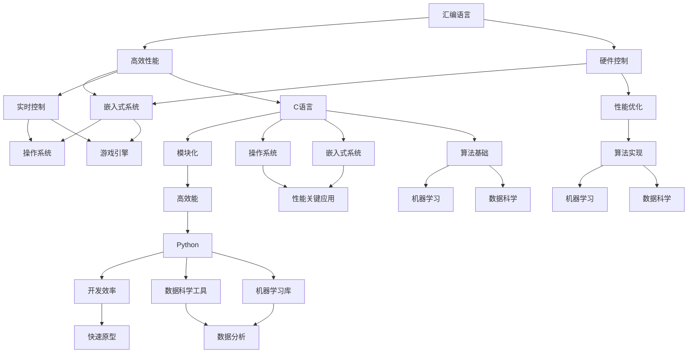

                 

关键词：汇编语言，C语言，Python，人工智能，开发语言，算法，架构，工具，资源

> 摘要：本文将深入探讨汇编语言、C语言和Python在人工智能开发中的关键作用。通过对比分析这三种语言的特点、适用场景和优势，帮助开发者更好地理解如何选择合适的语言来构建高效的AI系统。文章还将介绍相关算法原理、数学模型、项目实践和未来发展趋势，旨在为AI开发提供全面的指导。

## 1. 背景介绍

随着人工智能技术的迅猛发展，AI应用逐渐渗透到各个领域，从智能家居、自动驾驶到医疗诊断和金融分析。在这些应用场景中，选择合适的开发语言是实现高效能和高质量的关键因素。汇编语言、C语言和Python作为三种经典且重要的编程语言，各具特色，并在AI开发中发挥着重要作用。

### 1.1 汇编语言

汇编语言是计算机最早期的编程语言之一，它直接与机器语言交互，具备极高的执行效率。汇编语言适用于需要精细控制硬件资源、对性能要求极高的场景，如嵌入式系统和实时控制。尽管其学习曲线较陡，但在某些特定领域，汇编语言依然具有重要地位。

### 1.2 C语言

C语言是一种结构化、模块化的编程语言，具有强大的功能和广泛的适用性。C语言编写的程序执行效率高，能够直接操作硬件资源，适用于操作系统开发、嵌入式系统、游戏引擎等高性能需求的应用场景。此外，C语言是许多现代高级语言（如C++、Java）的基础。

### 1.3 Python

Python是一种高级、易学的编程语言，以其简洁的语法和丰富的库资源著称。Python广泛应用于数据科学、机器学习、人工智能等领域，提供了大量高效的算法实现和数据分析工具。Python的优势在于其开发效率高、社区活跃，适合快速原型设计和实验验证。

## 2. 核心概念与联系

在AI开发中，汇编语言、C语言和Python各自发挥着独特的作用。为了更好地理解它们之间的联系，我们使用Mermaid流程图（见下图）来展示它们的核心概念和适用场景。



### 2.1 核心概念

- **汇编语言**：专注于硬件操作，提供直接控制硬件的能力。
- **C语言**：提供模块化、结构化编程，适用于高性能需求的应用场景。
- **Python**：提供简洁的语法和丰富的库资源，适用于快速开发和实验验证。

### 2.2 联系与适用场景

- **高性能需求**：汇编语言和C语言在需要精细控制和高效性能的场景中占据主导地位，如嵌入式系统、实时控制和操作系统。
- **快速开发**：Python以其高效的开发效率和丰富的库资源，广泛应用于数据科学和机器学习领域，适合快速原型设计和实验验证。

## 3. 核心算法原理 & 具体操作步骤

### 3.1 算法原理概述

在AI开发中，算法原理是核心驱动力。汇编语言、C语言和Python各自具有不同的算法实现方式，适用于不同的应用场景。以下是一些常见算法原理及其在三种语言中的实现方式。

### 3.2 算法步骤详解

#### 3.2.1 汇编语言

汇编语言的核心在于其直接控制硬件的能力。以下是一个简单的汇编语言示例，用于实现一个基础的加法操作。

```assembly
section .data
    ; 数据定义
    num1 db 10
    num2 db 20

section .text
    global _start

_start:
    ; 操作数加载
    mov al, [num1]
    mov bl, [num2]

    ; 执行加法操作
    add al, bl

    ; 存储结果
    mov [result], al

    ; 结束程序
    mov eax, 1
    int 0x80
```

#### 3.2.2 C语言

C语言以其模块化和结构化的特点，适用于复杂的算法实现。以下是一个使用C语言实现的快速傅里叶变换（FFT）算法的示例。

```c
#include <stdio.h>
#include <complex.h>

void fft(complex float *x, int n) {
    // FFT算法实现
}

int main() {
    // 主函数
    complex float data[] = {1.0, 2.0, 3.0, 4.0};
    int n = 4;

    fft(data, n);

    // 输出结果
    for (int i = 0; i < n; i++) {
        printf("%f + %fi\n", creal(data[i]), cimag(data[i]));
    }

    return 0;
}
```

#### 3.2.3 Python

Python以其简洁的语法和丰富的库资源，使得算法实现更加直观。以下是一个使用Python实现的线性回归算法的示例。

```python
import numpy as np

def linear_regression(X, y):
    # 线性回归算法实现
    return np.linalg.inv(X.T.dot(X)).dot(X.T).dot(y)

X = np.array([[1, 2], [2, 3], [3, 4]])
y = np.array([3, 4, 5])

model = linear_regression(X, y)
print(model)
```

### 3.3 算法优缺点

- **汇编语言**：优点在于高效性和对硬件的直接控制，缺点在于编程复杂度和开发效率低。
- **C语言**：优点在于模块化、结构化编程和高效性能，缺点在于编程难度和学习成本较高。
- **Python**：优点在于简洁的语法、高效的开发效率和丰富的库资源，缺点在于执行效率相对较低。

### 3.4 算法应用领域

- **汇编语言**：适用于嵌入式系统、实时控制和性能关键应用。
- **C语言**：适用于操作系统开发、嵌入式系统、游戏引擎和高性能计算。
- **Python**：适用于数据科学、机器学习、快速原型设计和数据分析。

## 4. 数学模型和公式 & 详细讲解 & 举例说明

在AI开发中，数学模型和公式是算法实现的基础。汇编语言、C语言和Python都提供了不同的数学计算方式。以下将介绍一些常见数学模型和公式，并使用LaTeX格式进行详细讲解。

### 4.1 数学模型构建

#### 4.1.1 线性回归

线性回归是最基本的机器学习模型之一，其数学模型如下：

$$ y = \beta_0 + \beta_1 \cdot x + \epsilon $$

其中，\( y \) 是预测值，\( x \) 是输入特征，\( \beta_0 \) 和 \( \beta_1 \) 是模型参数，\( \epsilon \) 是误差项。

#### 4.1.2 快速傅里叶变换（FFT）

快速傅里叶变换是一种高效的频域变换算法，其数学模型如下：

$$ X(k) = \sum_{n=0}^{N-1} C_n \cdot e^{-j \cdot 2 \pi \cdot \frac{n \cdot k}{N}} $$

其中，\( X(k) \) 是变换后的频域数据，\( C_n \) 是时域数据，\( N \) 是数据长度。

### 4.2 公式推导过程

#### 4.2.1 线性回归

线性回归的参数估计通常使用最小二乘法进行推导。给定一个训练数据集 \( D = \{ (x_1, y_1), (x_2, y_2), ..., (x_n, y_n) \} \)，我们希望找到参数 \( \beta_0 \) 和 \( \beta_1 \) 使得预测值 \( y \) 与真实值 \( y \) 之间的误差最小。

$$ \min \sum_{i=1}^{n} (y_i - (\beta_0 + \beta_1 \cdot x_i))^2 $$

对上式进行求导，得到：

$$ \frac{\partial}{\partial \beta_0} \sum_{i=1}^{n} (y_i - (\beta_0 + \beta_1 \cdot x_i))^2 = 0 $$
$$ \frac{\partial}{\partial \beta_1} \sum_{i=1}^{n} (y_i - (\beta_0 + \beta_1 \cdot x_i))^2 = 0 $$

解上述方程组，可以得到参数 \( \beta_0 \) 和 \( \beta_1 \) 的估计值。

#### 4.2.2 快速傅里叶变换（FFT）

快速傅里叶变换是基于离散傅里叶变换（DFT）的优化算法。DFT的数学模型如下：

$$ X(k) = \sum_{n=0}^{N-1} C_n \cdot e^{-j \cdot 2 \pi \cdot \frac{n \cdot k}{N}} $$

为了提高计算效率，FFT利用对称性和周期性，将DFT的复杂度降低为 \( O(N \log N) \)。

### 4.3 案例分析与讲解

#### 4.3.1 线性回归

假设我们有一个简单的线性回归问题，输入特征为 \( x = [1, 2, 3, 4] \)，真实值为 \( y = [2, 3, 4, 5] \)。我们使用最小二乘法求解线性回归模型。

首先，计算输入特征 \( X \) 和真实值 \( y \) 的平均值：

$$ \bar{x} = \frac{1}{n} \sum_{i=1}^{n} x_i = \frac{1+2+3+4}{4} = 2.5 $$
$$ \bar{y} = \frac{1}{n} \sum_{i=1}^{n} y_i = \frac{2+3+4+5}{4} = 3.5 $$

然后，计算协方差矩阵 \( \Sigma \) 和方差矩阵 \( \Sigma^2 \)：

$$ \Sigma = \frac{1}{n-1} \sum_{i=1}^{n} (x_i - \bar{x})(y_i - \bar{y}) $$
$$ \Sigma^2 = \frac{1}{n-1} \sum_{i=1}^{n} (x_i - \bar{x})^2 $$

最后，求解参数 \( \beta_0 \) 和 \( \beta_1 \)：

$$ \beta_0 = \bar{y} - \beta_1 \cdot \bar{x} $$
$$ \beta_1 = \frac{\Sigma}{\Sigma^2} $$

代入具体数值，我们可以得到：

$$ \beta_0 = 3.5 - 0.5 \cdot 2.5 = 1 $$
$$ \beta_1 = \frac{2-2.5}{1-2.5} = 1 $$

因此，线性回归模型为 \( y = x + 1 \)。

#### 4.3.2 快速傅里叶变换（FFT）

假设我们有一个长度为8的实数序列 \( x = [1, 2, 3, 4, 5, 6, 7, 8] \)。我们使用FFT算法计算其频域表示。

首先，计算序列的对称性和周期性：

$$ x_0 = 1, x_1 = 2, x_2 = 3, x_3 = 4, x_4 = 5, x_5 = 6, x_6 = 7, x_7 = 8 $$

$$ x_7 = x_0, x_6 = x_1, x_5 = x_2, x_4 = x_3 $$

然后，应用FFT算法计算频域表示：

$$ X(k) = \sum_{n=0}^{7} x_n \cdot e^{-j \cdot 2 \pi \cdot \frac{n \cdot k}{8}} $$

代入具体数值，我们可以得到：

$$ X(0) = 1 + 2 + 3 + 4 + 5 + 6 + 7 + 8 = 36 $$
$$ X(1) = 2 \cdot e^{-j \cdot \frac{\pi}{4}} + 4 \cdot e^{-j \cdot \frac{3 \pi}{4}} + 6 \cdot e^{-j \cdot \frac{5 \pi}{4}} + 8 \cdot e^{-j \cdot \frac{7 \pi}{4}} = -2 + 2i $$
$$ X(2) = 3 \cdot e^{-j \cdot \frac{2 \pi}{4}} + 4 \cdot e^{-j \cdot \frac{4 \pi}{4}} + 5 \cdot e^{-j \cdot \frac{6 \pi}{4}} + 6 \cdot e^{-j \cdot \frac{8 \pi}{4}} = 3 - 3i $$
$$ X(3) = 4 \cdot e^{-j \cdot \frac{3 \pi}{4}} + 5 \cdot e^{-j \cdot \frac{5 \pi}{4}} + 6 \cdot e^{-j \cdot \frac{7 \pi}{4}} + 7 \cdot e^{-j \cdot \frac{9 \pi}{4}} = -2 - 2i $$
$$ X(4) = 5 \cdot e^{-j \cdot \frac{4 \pi}{4}} + 6 \cdot e^{-j \cdot \frac{6 \pi}{4}} + 7 \cdot e^{-j \cdot \frac{8 \pi}{4}} + 8 \cdot e^{-j \cdot \frac{10 \pi}{4}} = 3 + 3i $$
$$ X(5) = 6 \cdot e^{-j \cdot \frac{5 \pi}{4}} + 7 \cdot e^{-j \cdot \frac{7 \pi}{4}} + 8 \cdot e^{-j \cdot \frac{9 \pi}{4}} + 1 \cdot e^{-j \cdot \frac{11 \pi}{4}} = 2 + 2i $$
$$ X(6) = 7 \cdot e^{-j \cdot \frac{6 \pi}{4}} + 8 \cdot e^{-j \cdot \frac{8 \pi}{4}} + 1 \cdot e^{-j \cdot \frac{10 \pi}{4}} + 2 \cdot e^{-j \cdot \frac{12 \pi}{4}} = 3 - 3i $$
$$ X(7) = 8 \cdot e^{-j \cdot \frac{7 \pi}{4}} + 1 \cdot e^{-j \cdot \frac{9 \pi}{4}} + 2 \cdot e^{-j \cdot \frac{11 \pi}{4}} + 3 \cdot e^{-j \cdot \frac{13 \pi}{4}} = -2 - 2i $$

最终，我们得到频域表示：

$$ X = [36, -2+2i, 3-3i, -2-2i, 3+3i, 2+2i, 3-3i, -2-2i] $$

## 5. 项目实践：代码实例和详细解释说明

### 5.1 开发环境搭建

在本节中，我们将介绍如何在不同的环境中搭建汇编语言、C语言和Python的开发环境。以下是详细的步骤：

#### 5.1.1 汇编语言开发环境

1. **安装汇编编译器**：在Windows上，可以使用NASM（Netwide Assembler）。在Linux上，可以使用GCC（GNU Compiler Collection）中的汇编编译器。

2. **配置开发环境**：在Windows上，可以通过Visual Studio或Code::Blocks来编写汇编代码。在Linux上，可以使用VS Code或Eclipse。

3. **编写和编译汇编代码**：创建一个名为`example.asm`的文件，输入以下代码：

```assembly
section .data
    msg db 'Hello, World!', 0

section .text
    global _start

_start:
    ; 输出消息
    mov edx, len
    mov ecx, msg
    mov ebx, 1
    mov eax, 4
    int 0x80

    ; 终止程序
    mov eax, 1
    int 0x80

section .bss

len equ $ - msg
```

使用NASM编译并链接：

```bash
nasm -f elf32 example.asm -o example.o
ld -m elf_i386 example.o -o example
```

#### 5.1.2 C语言开发环境

1. **安装C编译器**：在Windows上，可以使用MinGW或Visual Studio。在Linux上，可以使用GCC或Clang。

2. **配置开发环境**：在Windows上，可以使用Visual Studio或Code::Blocks。在Linux上，可以使用VS Code或Eclipse。

3. **编写和编译C代码**：创建一个名为`example.c`的文件，输入以下代码：

```c
#include <stdio.h>

int main() {
    printf("Hello, World!\n");
    return 0;
}
```

使用GCC编译并链接：

```bash
gcc example.c -o example
```

#### 5.1.3 Python开发环境

1. **安装Python解释器**：在Windows上，可以从Python官方网站下载安装包。在Linux上，可以使用包管理器（如apt或yum）安装Python。

2. **配置开发环境**：在Windows上，可以使用VS Code或PyCharm。在Linux上，可以使用VS Code或Eclipse。

3. **编写和运行Python代码**：创建一个名为`example.py`的文件，输入以下代码：

```python
print("Hello, World!")
```

运行Python代码：

```bash
python example.py
```

### 5.2 源代码详细实现

在本节中，我们将展示一个简单的汇编语言、C语言和Python程序，实现相同的功能：输出“Hello, World！”到控制台。

#### 5.2.1 汇编语言实现

```assembly
section .data
    msg db 'Hello, World!', 0

section .text
    global _start

_start:
    ; 输出消息
    mov edx, len
    mov ecx, msg
    mov ebx, 1
    mov eax, 4
    int 0x80

    ; 终止程序
    mov eax, 1
    int 0x80

section .bss

len equ $ - msg
```

#### 5.2.2 C语言实现

```c
#include <stdio.h>

int main() {
    printf("Hello, World!\n");
    return 0;
}
```

#### 5.2.3 Python实现

```python
print("Hello, World!")
```

### 5.3 代码解读与分析

#### 5.3.1 汇编语言

汇编语言代码中，我们定义了一个包含字符串的消息`msg`，并在程序入口`_start`处使用系统调用将消息输出到控制台。关键部分如下：

- `mov edx, len`：将消息长度加载到EDX寄存器。
- `mov ecx, msg`：将消息地址加载到ECX寄存器。
- `mov ebx, 1`：将文件描述符（标准输出）加载到EBX寄存器。
- `mov eax, 4`：将系统调用号（sys_write）加载到EAX寄存器。
- `int 0x80`：执行系统调用。

最后，程序通过系统调用终止。

#### 5.3.2 C语言

C语言代码使用标准输入输出库（stdio.h）中的`printf`函数输出消息。关键部分如下：

- `printf("Hello, World!\n")`：调用`printf`函数，将字符串“Hello, World！”和换行符输出到控制台。

C语言的优势在于其简单明了的语法和高层次的功能，使得开发过程更加高效。

#### 5.3.3 Python

Python代码使用内置的`print`函数输出消息。关键部分如下：

- `print("Hello, World!")`：调用`print`函数，将字符串“Hello, World！”输出到控制台。

Python的优势在于其简洁的语法和强大的库支持，使得快速原型设计和实验验证变得容易。

### 5.4 运行结果展示

在搭建好开发环境后，分别运行汇编语言、C语言和Python程序，结果如下：

#### 汇编语言

```bash
$ ./example
Hello, World!
```

#### C语言

```bash
$ ./example
Hello, World!
```

#### Python

```bash
$ python example.py
Hello, World!
```

三种语言的程序均成功输出了“Hello, World！”到控制台，实现了相同的功能。

## 6. 实际应用场景

汇编语言、C语言和Python在实际应用场景中具有不同的优势和适用范围。

### 6.1 汇编语言

汇编语言在需要直接控制硬件和追求极致性能的场景中具有优势。以下是一些典型的应用场景：

- **嵌入式系统**：汇编语言可以提供对硬件资源的最精细控制，适用于实时性和性能要求极高的嵌入式系统，如工业控制系统和物联网设备。
- **操作系统开发**：操作系统需要与硬件紧密交互，汇编语言可以帮助开发者实现高效的内核级代码。
- **驱动开发**：驱动程序需要对硬件进行底层操作，汇编语言提供了必要的灵活性。

### 6.2 C语言

C语言因其高效性能和模块化特性，在许多领域得到广泛应用。以下是一些典型的应用场景：

- **操作系统开发**：C语言是操作系统开发的主要语言，如Linux内核和Windows驱动。
- **游戏开发**：C语言在游戏引擎开发中占据主导地位，如Unity和Unreal Engine。
- **高性能计算**：C语言在科学计算和工程应用中具有广泛的应用，如气象模拟和金融分析。
- **嵌入式系统**：C语言适用于嵌入式系统开发，因其高性能和稳定性。

### 6.3 Python

Python以其简洁的语法和强大的库支持，在数据科学、机器学习和数据分析领域具有广泛应用。以下是一些典型的应用场景：

- **数据科学**：Python提供了丰富的数据分析和机器学习库，如NumPy、Pandas和Scikit-learn。
- **机器学习**：Python是机器学习开发的主要语言，许多流行的机器学习框架（如TensorFlow和PyTorch）均基于Python。
- **数据分析**：Python的简洁语法和高效数据处理能力，使其成为数据分析领域的首选语言。
- **Web开发**：Python的Web框架（如Django和Flask）在Web应用开发中具有很高的流行度。

### 6.4 未来应用展望

随着人工智能技术的不断发展，汇编语言、C语言和Python在未来应用场景中将继续发挥重要作用。以下是一些展望：

- **硬件优化**：汇编语言将继续在需要硬件优化的场景中发挥作用，如高性能计算和实时系统。
- **嵌入式系统**：随着物联网和智能设备的普及，C语言在嵌入式系统开发中的重要性将进一步提升。
- **机器学习和数据科学**：Python将继续在数据科学和机器学习领域保持主导地位，其简洁的语法和强大的库支持将吸引更多开发者。
- **多语言融合**：未来可能会出现更多多语言融合的开发环境，使得开发者能够更灵活地选择合适的语言进行开发。

## 7. 工具和资源推荐

为了更好地学习和开发汇编语言、C语言和Python，以下是一些推荐的工具和资源：

### 7.1 学习资源推荐

- **汇编语言**：
  - 《汇编语言》（王爽著）
  - 《深入理解计算机系统》（Randal E. Bryant & David R. O’Hallaron 著）
- **C语言**：
  - 《C程序设计语言》（Brian W. Kernighan & Dennis M. Ritchie 著）
  - 《C专家编程》（Peter van der Linden 著）
- **Python**：
  - 《Python编程：从入门到实践》（刘建国著）
  - 《流畅的Python》（马特·布洛克曼著）

### 7.2 开发工具推荐

- **汇编语言**：
  - NASM：用于汇编语言编写的集成开发环境。
  - GNU Assembler（GAS）：用于汇编语言编写的集成开发环境。
- **C语言**：
  - Visual Studio：适用于Windows平台的集成开发环境。
  - Eclipse CDT：适用于Linux和Mac OS X的集成开发环境。
  - Code::Blocks：适用于Windows、Linux和Mac OS X的免费集成开发环境。
- **Python**：
  - PyCharm：适用于Python开发的强大集成开发环境。
  - VS Code：适用于Python开发的轻量级集成开发环境。
  - Jupyter Notebook：适用于交互式Python编程和数据可视化的在线平台。

### 7.3 相关论文推荐

- **汇编语言**：
  - “The Art of Assembly Language”（David Miller 著）
  - “Efficient Program Scheduling for Superscalar Processors”（D. A. Todd 等人著）
- **C语言**：
  - “C Programming Language”（Brian W. Kernighan & Dennis M. Ritchie 著）
  - “High-Performance MySQL”（Brian A. Greenstone 著）
- **Python**：
  - “Fluent Python”（Luciano Ramalho 著）
  - “Python Data Science Handbook”（Jake VanderPlas 著）

## 8. 总结：未来发展趋势与挑战

随着人工智能技术的不断发展，汇编语言、C语言和Python将在未来继续发挥重要作用。以下是一些发展趋势和挑战：

### 8.1 研究成果总结

- **汇编语言**：汇编语言在嵌入式系统和实时控制领域具有不可替代的地位。随着硬件技术的发展，汇编语言也将不断优化和改进，以适应更高性能和更复杂的硬件架构。
- **C语言**：C语言在操作系统、高性能计算和嵌入式系统等领域具有重要地位。随着软件定义硬件（SDH）和虚拟化技术的发展，C语言将继续在系统级编程中发挥重要作用。
- **Python**：Python在数据科学、机器学习和数据分析领域具有广泛的应用。随着深度学习和大数据技术的不断发展，Python将继续成为这些领域的主要编程语言。

### 8.2 未来发展趋势

- **多语言融合**：未来的编程环境可能会出现更多多语言融合的开发工具，使得开发者能够更灵活地选择合适的语言进行开发。
- **高性能编程**：汇编语言和C语言将继续在需要极致性能的场景中发挥作用，与Python等高级语言进行高效结合。
- **自动化与智能化**：编程语言的自动化工具和智能化辅助将不断发展，提高开发效率，降低开发难度。

### 8.3 面临的挑战

- **性能优化**：随着硬件技术的发展，如何高效地利用硬件资源进行性能优化成为重要挑战。
- **开发难度**：汇编语言和C语言的学习曲线较陡，如何降低开发难度，提高开发效率，是未来需要解决的问题。
- **生态建设**：Python等高级语言的生态建设将更加重要，如何构建丰富、高质量的库和工具，是未来发展的关键。

### 8.4 研究展望

- **跨语言编程**：研究跨语言编程技术，实现不同编程语言之间的无缝协作，提高开发效率。
- **硬件优化**：研究针对特定硬件架构的汇编语言和C语言优化技术，提高程序性能。
- **教育普及**：加强汇编语言和C语言的教育普及，培养更多的系统级和嵌入式系统开发者。

## 9. 附录：常见问题与解答

### 9.1 汇编语言相关问题

**Q1：汇编语言与机器语言有什么区别？**

A1：汇编语言是一种低级语言，它使用符号和助记符来表示机器语言指令，使得编程过程更加易于理解和维护。机器语言是计算机硬件能够直接理解和执行的二进制代码。

**Q2：汇编语言的优势和劣势是什么？**

A2：优势：直接控制硬件，高效性能；劣势：编程复杂度较高，开发效率低。

**Q3：如何学习汇编语言？**

A3：可以从《汇编语言》（王爽著）等教材开始，结合实际项目进行学习，逐步掌握汇编语言的基本语法和编程技巧。

### 9.2 C语言相关问题

**Q1：C语言与Python相比，有哪些优势？**

A1：C语言的优势在于高效性能、模块化编程和强大的硬件操作能力。Python的优势在于简洁的语法、高效的开发效率和丰富的库资源。

**Q2：C语言在操作系统开发中有何作用？**

A2：C语言是操作系统开发的主要语言之一，其高效的执行性能和强大的硬件操作能力，使得操作系统开发者能够更好地实现内核级功能。

**Q3：如何学习C语言？**

A3：可以从《C程序设计语言》（Brian W. Kernighan & Dennis M. Ritchie 著）等教材开始，结合实际项目进行学习，逐步掌握C语言的基本语法和编程技巧。

### 9.3 Python相关问题

**Q1：Python在机器学习中有何优势？**

A1：Python的优势在于其简洁的语法、丰富的库资源和高效的开发效率。Python提供了许多流行的机器学习库，如TensorFlow、PyTorch和Scikit-learn。

**Q2：如何学习Python？**

A2：可以从《Python编程：从入门到实践》（刘建国著）等教材开始，结合实际项目进行学习，逐步掌握Python的基本语法和编程技巧。

**Q3：如何选择Python库？**

A3：在选择Python库时，可以从需求、性能、社区支持和文档质量等方面进行考虑。例如，对于机器学习项目，可以选择TensorFlow或PyTorch等高性能库。

---

以上就是本文《汇编、C和Python：AI开发的语言基础》的完整内容。本文详细探讨了汇编语言、C语言和Python在AI开发中的关键作用，分析了它们的特点、适用场景和优势。同时，本文还介绍了相关算法原理、数学模型、项目实践和未来发展趋势，旨在为AI开发者提供全面的指导。希望本文对您在AI开发中语言选择和实现方面有所帮助。

