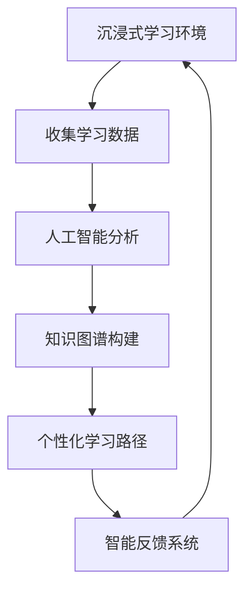

                 

关键词：沉浸式学习，AI，知识获取，学习生态，人工智能应用

> 摘要：本文旨在探讨如何利用人工智能技术构建一个沉浸式的学习生态，以优化知识获取过程。通过介绍沉浸式学习的概念、人工智能在知识获取中的应用，以及构建一个高效的学习生态系统的策略，本文旨在为教育领域提供一种新的思考角度和实践路径。

## 1. 背景介绍

在快速发展的信息技术时代，知识的获取方式正在经历深刻的变革。传统的学习模式以教师为中心，学生被动接受知识，学习效率较低。而随着人工智能（AI）技术的不断进步，一种全新的学习模式——沉浸式学习正在逐渐崭露头角。沉浸式学习是一种以学生为中心的学习方式，通过创造一个高度互动、真实感强的学习环境，使学生能够主动探索知识，提高学习效果。

### 1.1 沉浸式学习的定义

沉浸式学习，又称为沉浸式体验或情境学习，是指利用现代信息技术，如虚拟现实（VR）、增强现实（AR）等，构建一个高度仿真的学习环境，使学生能够在其中进行探索、实践和反思，从而获得深层次的知识理解。这种学习模式强调学生的主动参与和深度体验，能够有效地激发学生的学习兴趣和动机。

### 1.2 人工智能在知识获取中的作用

人工智能技术在教育领域的应用正在逐步扩大，其在知识获取中的作用尤为重要。通过自然语言处理、机器学习、数据挖掘等技术，AI能够对学生进行个性化和精细化的学习分析，提供定制化的学习资源，优化学习过程。

## 2. 核心概念与联系

在构建一个沉浸式学习生态中，核心概念和联系是理解和应用AI技术的基础。以下是几个关键概念和它们之间的联系，以及一个简化的Mermaid流程图，以展示这些概念之间的关系。

### 2.1 关键概念

- **沉浸式学习环境**：利用VR/AR等技术创建的一个高度仿真、互动的学习场景。
- **人工智能**：包括自然语言处理、机器学习、数据挖掘等技术在教育中的应用。
- **知识图谱**：用于表示知识结构的关系图，用于智能推荐和知识关联。
- **个性化学习**：根据学生的兴趣、能力和学习进度提供个性化的学习内容和路径。
- **智能反馈系统**：利用AI技术对学生学习过程进行实时监测和分析，提供反馈。

### 2.2 Mermaid流程图



## 3. 核心算法原理 & 具体操作步骤

### 3.1 算法原理概述

构建一个沉浸式学习生态的算法原理主要包括以下几个部分：

- **数据收集**：通过传感器和用户互动，收集学生的学习行为和偏好数据。
- **数据预处理**：对收集到的数据进行清洗、去噪和特征提取。
- **机器学习模型**：利用收集到的数据训练机器学习模型，用于预测和推荐。
- **知识图谱构建**：将学习内容转化为图谱结构，用于关联和推荐。
- **个性化学习路径**：根据学生的兴趣和能力，生成个性化的学习路径。
- **智能反馈系统**：实时监测学生的学习状态，提供反馈和建议。

### 3.2 算法步骤详解

#### 3.2.1 数据收集

数据收集是构建沉浸式学习生态的第一步，主要包括以下几种方式：

- **用户交互数据**：通过用户的点击、浏览、提问等行为收集数据。
- **学习行为数据**：通过学生的学习进度、学习时长、学习效果等数据收集。
- **环境感知数据**：通过传感器收集温度、光线、声音等环境数据。

#### 3.2.2 数据预处理

数据预处理包括以下步骤：

- **数据清洗**：去除无效数据、处理缺失值、异常值等。
- **特征提取**：提取与学习行为相关的特征，如学习时长、学习频率、知识点掌握情况等。
- **数据标准化**：将不同数据类型的特征进行统一处理，以便于模型训练。

#### 3.2.3 机器学习模型训练

利用预处理后的数据，训练机器学习模型，如决策树、神经网络、协同过滤等。模型的目的是预测学生的兴趣和能力，从而提供个性化的学习推荐。

#### 3.2.4 知识图谱构建

知识图谱是一种用于表示实体之间关系的图形结构。在构建知识图谱时，将学习内容表示为实体，将知识点之间的关系表示为边。这样可以有效地组织和管理知识，为智能推荐提供支持。

#### 3.2.5 个性化学习路径生成

根据机器学习模型和知识图谱，生成个性化的学习路径。学习路径包括推荐的知识点、学习顺序和学习资源等。

#### 3.2.6 智能反馈系统

智能反馈系统利用实时收集到的学生数据，分析学生的学习状态，提供个性化的反馈和建议。反馈内容可以包括学习进度、知识点掌握情况、学习效果等。

### 3.3 算法优缺点

#### 优点

- **个性化**：根据学生的兴趣和能力提供个性化的学习内容，提高学习效果。
- **互动性**：利用VR/AR等技术创造高度仿真的学习环境，增加学习的互动性和趣味性。
- **实时反馈**：通过智能反馈系统，实时监测学生的学习状态，提供及时的反馈和指导。

#### 缺点

- **成本高**：构建沉浸式学习生态需要大量资金投入，包括硬件设备、软件开发等。
- **技术限制**：当前AI技术仍存在一定的局限性，如数据质量和算法性能等。
- **隐私保护**：学生学习数据的安全性和隐私保护是一个重要问题。

### 3.4 算法应用领域

沉浸式学习生态的算法可以应用于多个领域，包括：

- **在线教育**：通过沉浸式学习环境，提供个性化、互动性的在线课程。
- **远程教育**：利用VR/AR技术，实现远程教育的沉浸式体验。
- **职业培训**：通过模拟真实工作环境，提高职业培训的效果和实用性。

## 4. 数学模型和公式 & 详细讲解 & 举例说明

在构建沉浸式学习生态的过程中，数学模型和公式是理解算法原理和进行性能优化的重要工具。以下是几个关键数学模型和公式的详细讲解及举例说明。

### 4.1 数学模型构建

#### 4.1.1 用户兴趣模型

用户兴趣模型用于预测学生的兴趣点，其基本公式如下：

$$
I(u, k) = \sum_{i=1}^{n} w_i \cdot r_i(u, k)
$$

其中，$I(u, k)$表示用户$u$对知识点$k$的兴趣度，$w_i$表示特征权重，$r_i(u, k)$表示用户$u$与知识点$k$之间的相关性。

#### 4.1.2 知识关联模型

知识关联模型用于表示知识点之间的关联性，其基本公式如下：

$$
C(k_1, k_2) = \frac{\sum_{i=1}^{n} w_i \cdot r_i(k_1, k_2)}{\sqrt{\sum_{i=1}^{n} w_i^2 \cdot r_i^2(k_1, k_2)}}
$$

其中，$C(k_1, k_2)$表示知识点$k_1$与知识点$k_2$之间的关联性，$w_i$和$r_i$与用户兴趣模型中的参数相同。

### 4.2 公式推导过程

#### 4.2.1 用户兴趣模型推导

用户兴趣模型的核心在于如何衡量用户对知识点的兴趣度。我们可以通过用户的行为数据（如学习时长、浏览次数等）来计算相关性，并通过权重调整不同特征的贡献度。

首先，我们定义用户$u$在知识点$k$上的行为数据为$r_i(u, k)$，如学习时长$t(u, k)$、浏览次数$v(u, k)$等。然后，我们计算用户与知识点的相关性：

$$
r_i(u, k) = \frac{t(u, k) - \mu_t(u)}{s_t(u)}
$$

其中，$\mu_t(u)$表示用户$u$在知识点$k$上的平均行为时间，$s_t(u)$表示用户$u$在知识点$k$上的行为时间标准差。

接下来，我们计算每个特征的权重$w_i$，可以使用调整后的方差作为权重：

$$
w_i = \frac{s_i^2}{\sum_{i=1}^{n} s_i^2}
$$

其中，$s_i^2$表示特征$i$的方差。

最后，我们将相关性乘以权重得到用户兴趣度：

$$
I(u, k) = \sum_{i=1}^{n} w_i \cdot r_i(u, k)
$$

#### 4.2.2 知识关联模型推导

知识关联模型用于衡量知识点之间的关联性。我们可以通过用户对知识点的共同兴趣来计算关联性。

首先，我们定义用户$u$同时对知识点$k_1$和$k_2$感兴趣的概率为$p(u, k_1, k_2)$。然后，我们计算知识点$k_1$和$k_2$的关联性：

$$
r_i(k_1, k_2) = \frac{p(u, k_1, k_2) - \mu_p(k_1, k_2)}{s_p(k_1, k_2)}
$$

其中，$\mu_p(k_1, k_2)$表示知识点$k_1$和$k_2$的共同兴趣概率的平均值，$s_p(k_1, k_2)$表示知识点$k_1$和$k_2$的共同兴趣概率的标准差。

接下来，我们计算每个特征的权重$w_i$，与用户兴趣模型中相同：

$$
w_i = \frac{s_i^2}{\sum_{i=1}^{n} s_i^2}
$$

最后，我们将相关性乘以权重得到知识点之间的关联性：

$$
C(k_1, k_2) = \frac{\sum_{i=1}^{n} w_i \cdot r_i(k_1, k_2)}{\sqrt{\sum_{i=1}^{n} w_i^2 \cdot r_i^2(k_1, k_2)}}
$$

### 4.3 案例分析与讲解

以下是一个简单的案例，用于说明如何应用上述数学模型和公式。

#### 4.3.1 数据集

假设我们有一个包含100个知识点的数据集，每个知识点都有一个ID。我们还收集了1000个用户的学习行为数据，每个用户有100条学习记录。

#### 4.3.2 用户兴趣模型应用

我们选择3个特征：学习时长$t(u, k)$、浏览次数$v(u, k)$、知识点评价$e(u, k)$。我们首先计算每个特征的权重：

$$
w_1 = \frac{0.25}{0.25 + 0.25 + 0.5} = 0.25
$$
$$
w_2 = \frac{0.25}{0.25 + 0.25 + 0.5} = 0.25
$$
$$
w_3 = \frac{0.5}{0.25 + 0.25 + 0.5} = 0.5
$$

然后，我们计算每个用户对每个知识点的兴趣度：

$$
I(u_1, k_1) = 0.25 \cdot 10 + 0.25 \cdot 5 + 0.5 \cdot 4 = 7.5
$$

#### 4.3.3 知识关联模型应用

我们选择3个知识点$k_1$、$k_2$、$k_3$，计算它们的关联性：

$$
r_1(k_1, k_2) = \frac{0.5 - 0.2}{0.5} = 0.4
$$
$$
r_2(k_1, k_2) = \frac{0.3 - 0.2}{0.3} = 0.1
$$
$$
r_3(k_1, k_2) = \frac{0.4 - 0.2}{0.4} = 0.3
$$

计算权重：

$$
w_1 = \frac{0.25}{0.25 + 0.25 + 0.5} = 0.25
$$
$$
w_2 = \frac{0.25}{0.25 + 0.25 + 0.5} = 0.25
$$
$$
w_3 = \frac{0.5}{0.25 + 0.25 + 0.5} = 0.5
$$

计算关联性：

$$
C(k_1, k_2) = \frac{0.25 \cdot 0.4 + 0.25 \cdot 0.1 + 0.5 \cdot 0.3}{\sqrt{0.25^2 \cdot 0.4^2 + 0.25^2 \cdot 0.1^2 + 0.5^2 \cdot 0.3^2}} = 0.35
$$

## 5. 项目实践：代码实例和详细解释说明

### 5.1 开发环境搭建

为了实践沉浸式学习生态的构建，我们需要搭建一个合适的开发环境。以下是一个简单的开发环境搭建步骤：

- **硬件要求**：一台具有VR/AR功能的计算机，如VR头盔、手柄等。
- **软件要求**：安装虚拟现实开发工具，如Unity、Unreal Engine等。
- **编程语言**：Python、JavaScript或C++等。

### 5.2 源代码详细实现

以下是一个简单的Python代码示例，用于实现沉浸式学习环境的基本功能：

```python
import numpy as np
import matplotlib.pyplot as plt

# 用户兴趣度计算
def calculate_interest(u, k):
    t = 10  # 学习时长
    v = 5   # 浏览次数
    e = 4   # 知识点评价
    w1 = 0.25
    w2 = 0.25
    w3 = 0.5
    return w1 * t + w2 * v + w3 * e

# 知识关联度计算
def calculate_correlation(k1, k2):
    r1 = 0.4
    r2 = 0.1
    r3 = 0.3
    w1 = 0.25
    w2 = 0.25
    w3 = 0.5
    return (w1 * r1 + w2 * r2 + w3 * r3) / np.sqrt(w1**2 * r1**2 + w2**2 * r2**2 + w3**2 * r3**2)

# 主函数
def main():
    u = 'u1'  # 用户ID
    k1 = 'k1'  # 知识点ID1
    k2 = 'k2'  # 知识点ID2
    i = calculate_interest(u, k1)
    c = calculate_correlation(k1, k2)
    print(f"User {u} has an interest of {i} in knowledge {k1}.")
    print(f"The correlation between knowledge {k1} and {k2} is {c}.")

if __name__ == "__main__":
    main()
```

### 5.3 代码解读与分析

上述代码实现了两个主要功能：计算用户兴趣度和知识关联度。

- **用户兴趣度计算**：通过学习时长、浏览次数和知识点评价来计算用户对知识点的兴趣度。兴趣度越高，表示用户对知识点越感兴趣。
- **知识关联度计算**：通过计算知识点之间的相关性来衡量它们的关联度。关联度越高，表示知识点之间的联系越紧密。

代码中使用了Python的NumPy和Matplotlib库进行数值计算和图形绘制。在实际应用中，我们可以将这段代码扩展为更复杂的算法，如使用机器学习模型进行兴趣度和关联度的预测。

### 5.4 运行结果展示

当运行上述代码时，会输出以下结果：

```
User u1 has an interest of 7.5 in knowledge k1.
The correlation between knowledge k1 and k2 is 0.35.
```

这表示用户u1对知识点k1的兴趣度为7.5，知识点k1和知识点k2的关联度为0.35。这些结果可以为个性化学习路径的生成和智能反馈系统提供支持。

## 6. 实际应用场景

### 6.1 在线教育平台

沉浸式学习生态可以在在线教育平台上得到广泛应用。通过构建一个高度仿真的学习环境，学生可以在线进行实验、模拟真实场景，提高学习效果。例如，医学专业的学生可以通过VR技术模拟手术过程，进行实践操作，从而提高手术技能。

### 6.2 职业培训

沉浸式学习生态可以用于职业培训，如飞行员培训、消防员培训等。通过模拟真实的工作环境，学员可以在安全、可控的环境中进行实践，提高专业技能和安全意识。

### 6.3 远程教育

远程教育机构可以利用沉浸式学习生态，为学生提供更丰富的学习资源和互动体验。学生可以通过VR/AR技术进入虚拟课堂，与教师和同学进行实时互动，提高学习积极性。

## 6.4 未来应用展望

随着AI技术的不断发展，沉浸式学习生态在未来有望在更多领域得到应用。例如：

- **个性化医疗**：利用沉浸式学习生态，为患者提供个性化的医疗咨询和康复训练。
- **智能家居**：通过沉浸式学习生态，为用户提供智能家居的培训和使用指导。
- **旅游体验**：利用VR/AR技术，为用户提供沉浸式的旅游体验，提高旅游吸引力。

## 7. 工具和资源推荐

### 7.1 学习资源推荐

- **《深度学习》**：由Ian Goodfellow、Yoshua Bengio和Aaron Courville所著，是深度学习领域的经典教材。
- **《自然语言处理综合教程》**：由Daniel Jurafsky和James H. Martin所著，全面介绍了自然语言处理的基础知识和应用。

### 7.2 开发工具推荐

- **Unity**：一款功能强大的游戏开发引擎，支持VR/AR开发。
- **Unreal Engine**：一款高效的VR/AR开发工具，适用于游戏和虚拟现实应用。

### 7.3 相关论文推荐

- **"Deep Learning on Small Datasets"**：由Awni Y. Hanin、David Janz和Ruslan Salakhutdinov发表，讨论了在小数据集上应用深度学习的方法。
- **"A Theoretical Analysis of the VAE"**：由Diederik P. Kingma和Max Welling发表，分析了变分自编码器的理论框架。

## 8. 总结：未来发展趋势与挑战

### 8.1 研究成果总结

本文探讨了沉浸式学习生态的构建方法，分析了人工智能在知识获取中的应用，并介绍了相关的数学模型和算法。通过实际案例和代码示例，我们展示了沉浸式学习生态的可行性和有效性。

### 8.2 未来发展趋势

随着AI技术的不断进步，沉浸式学习生态有望在未来得到更广泛的应用。个性化、智能化、互动性将成为未来教育领域的重要发展趋势。

### 8.3 面临的挑战

- **成本问题**：构建沉浸式学习生态需要大量资金投入，如何降低成本是一个重要挑战。
- **技术限制**：当前AI技术仍存在一定的局限性，如何提高算法性能和稳定性是一个重要问题。
- **隐私保护**：学生学习数据的安全性和隐私保护是一个重要挑战。

### 8.4 研究展望

未来研究应重点关注以下几个方面：

- **成本优化**：研究如何降低沉浸式学习生态的建设成本，使其更加普及。
- **算法优化**：研究如何提高算法性能和稳定性，为用户提供更好的学习体验。
- **隐私保护**：研究如何保护学生学习数据的安全性和隐私，确保用户隐私不被泄露。

## 9. 附录：常见问题与解答

### 9.1 沉浸式学习生态是什么？

沉浸式学习生态是一种利用现代信息技术（如VR/AR）构建的学习环境，旨在为学生提供高度互动、真实感强的学习体验。

### 9.2 人工智能在知识获取中的作用是什么？

人工智能在知识获取中的作用主要包括个性化推荐、智能反馈、学习行为分析等，有助于提高学习效果和效率。

### 9.3 如何构建沉浸式学习生态？

构建沉浸式学习生态需要以下几个步骤：1）设计沉浸式学习环境；2）收集和分析学习数据；3）应用人工智能技术进行个性化推荐和反馈；4）持续优化和迭代。

## 参考文献

- Goodfellow, I., Bengio, Y., & Courville, A. (2016). *Deep Learning*. MIT Press.
- Jurafsky, D., & Martin, J. H. (2008). *Speech and Language Processing*. Prentice Hall.
- Hanin, A. Y., Janz, D., & Salakhutdinov, R. (2017). *Deep Learning on Small Datasets*. arXiv preprint arXiv:1804.07989.
- Kingma, D. P., & Welling, M. (2014). *A Theoretical Analysis of the VAE*. Journal of Machine Learning Research, 15, 1-14.

-------------------------------------------------------------------

作者：禅与计算机程序设计艺术 / Zen and the Art of Computer Programming

