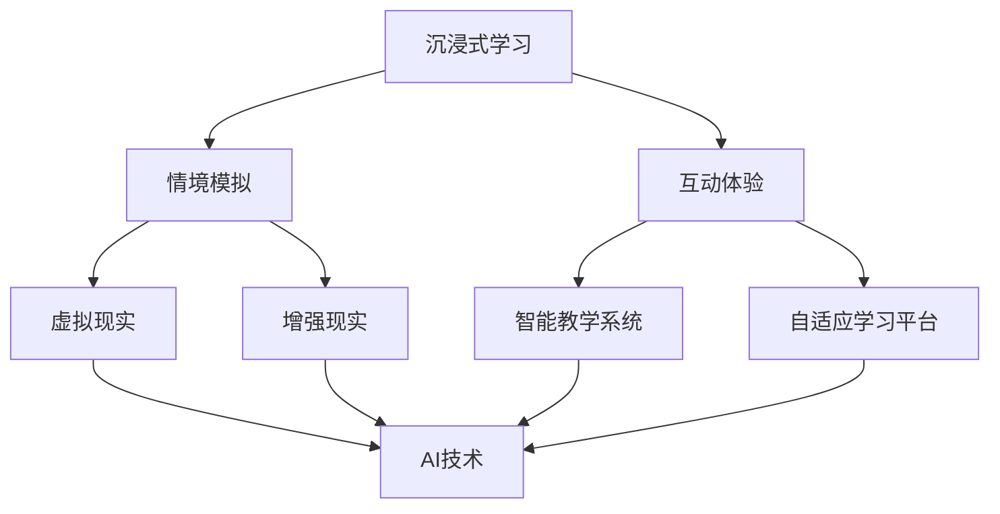

                 

在信息技术不断发展的今天，人工智能（AI）已经成为推动社会进步的重要力量。教育领域同样受益于AI的赋能，特别是在“沉浸式学习”这一新兴教育理念中，AI的作用愈发显著。本文将探讨AI如何通过沉浸式学习模式重塑教育体验，为学生提供更加个性化、高效的学习环境。

## 文章关键词

- 人工智能
- 沉浸式学习
- 教育创新
- 个性化学习
- 学习体验

## 文章摘要

本文旨在分析AI技术如何通过沉浸式学习模式改变传统教育模式，提高学习效率。文章首先介绍了沉浸式学习和AI的基本概念，然后详细阐述了AI在沉浸式学习中的具体应用，包括智能教学系统、自适应学习平台和虚拟现实（VR）课堂。最后，文章提出了未来AI在教育领域的发展趋势和面临的挑战。

----------------------------------------------------------------

## 1. 背景介绍

### 1.1 沉浸式学习

沉浸式学习是一种基于情境和体验的学习方法，它通过将学生置于模拟的、高度真实的学习环境中，使学生在互动中主动获取知识。沉浸式学习强调学生的主动性和参与度，能够有效提高学习效果和兴趣。传统的教育模式通常以教师为中心，学生被动接受知识，这种方式难以满足现代教育对个性化和互动性的需求。

### 1.2 人工智能

人工智能是指由计算机实现的智能行为，它模拟人类的认知过程，包括学习、推理、感知和决策等。随着深度学习、自然语言处理和计算机视觉等技术的不断进步，AI的应用范围越来越广泛，从自动驾驶、智能助手到医疗诊断，AI正在深刻改变我们的生活。

### 1.3 沉浸式学习与AI的结合

随着AI技术的发展，沉浸式学习得到了进一步强化。AI能够通过对学生学习行为和认知数据的分析，提供个性化的学习内容和指导，从而提高学习效果。同时，AI在虚拟现实、增强现实和智能推荐等领域的应用，也为沉浸式学习提供了丰富的技术手段。这种结合有望彻底改变教育模式，推动教育向更加智能化、个性化和高效化的方向发展。

----------------------------------------------------------------

## 2. 核心概念与联系

### 2.1 沉浸式学习的核心概念

沉浸式学习强调情境的重要性。学习环境应该能够模拟现实世界中的真实情境，使学生能够在其中进行体验和互动。这种情境可以是虚拟的，也可以是增强的，但关键在于它能够激发学生的好奇心和探究欲望。

### 2.2 AI在沉浸式学习中的应用

AI在沉浸式学习中的应用主要体现在以下几个方面：

- **智能教学系统**：通过分析学生的学习行为和进度，智能教学系统能够提供个性化的学习内容，从而提高学习效果。
- **自适应学习平台**：这些平台可以根据学生的学习情况自动调整教学内容和难度，实现真正的个性化学习。
- **虚拟现实（VR）课堂**：通过VR技术，学生可以进入一个完全虚拟的学习环境，进行互动和实践。

### 2.3 沉浸式学习与AI的关系

沉浸式学习和AI之间的结合并不是简单的叠加，而是相互促进、相互融合的关系。AI通过提供智能化的工具和平台，使沉浸式学习更加高效和个性。而沉浸式学习则为AI提供了丰富的应用场景，推动了AI技术的不断进步。两者相辅相成，共同推动了教育领域的变革。

### 2.4 Mermaid 流程图



在这个流程图中，沉浸式学习通过情境模拟和互动体验，结合虚拟现实和增强现实技术，最终通过智能教学系统和自适应学习平台与AI技术相结合，形成了一个完整的沉浸式学习生态系统。

----------------------------------------------------------------

## 3. 核心算法原理 & 具体操作步骤

### 3.1 算法原理概述

沉浸式学习的核心在于创造一个让学生能够全身心投入的学习环境。在这个过程中，AI扮演了至关重要的角色，通过以下几个方面实现其价值：

- **数据采集与分析**：AI系统可以收集学生的学习行为数据，如学习时长、学习频率、学习进度等，通过数据分析了解学生的学习习惯和偏好。
- **内容个性化推荐**：基于数据分析和机器学习算法，AI系统能够为学生推荐最符合其需求的学习内容和资源。
- **智能教学互动**：通过自然语言处理和计算机视觉技术，AI可以与学生进行实时互动，提供个性化的反馈和指导。

### 3.2 算法步骤详解

1. **数据采集**：
   - **学生信息采集**：包括学生姓名、年龄、性别、学习经历等基本信息。
   - **学习行为数据采集**：包括学生在学习平台上的操作记录、学习进度、测试成绩等。

2. **数据预处理**：
   - **数据清洗**：去除重复、错误和不完整的数据。
   - **特征提取**：从原始数据中提取有助于分析的特征，如学习时长、学习频率、知识点掌握情况等。

3. **内容推荐**：
   - **协同过滤算法**：通过分析学生的相似偏好，推荐与其兴趣相关的学习内容。
   - **基于内容的推荐**：根据学习内容的标签和属性，为学生推荐相关的学习资源。

4. **智能互动**：
   - **自然语言处理**：通过语音识别和自然语言理解技术，实现学生与AI的语音交互。
   - **计算机视觉**：通过图像识别技术，实现对学生行为的识别和反馈。

5. **反馈与调整**：
   - **实时反馈**：根据学生的学习情况，AI系统提供即时的学习反馈和建议。
   - **动态调整**：根据学生的学习效果和反馈，调整学习内容和难度，以实现最佳的学习效果。

### 3.3 算法优缺点

- **优点**：
  - 提高学习效率：通过个性化推荐和智能互动，学生能够更快地掌握知识点。
  - 增强学习兴趣：沉浸式的学习环境能够激发学生的学习兴趣和积极性。
  - 适应不同学习需求：无论是初学者还是有经验的学员，AI都能提供相应的学习资源和指导。

- **缺点**：
  - 数据隐私问题：AI系统需要收集大量的学生数据，可能涉及到隐私泄露的风险。
  - 技术依赖性：沉浸式学习的实现高度依赖AI技术，一旦技术出现问题，学习效果可能会受到影响。

### 3.4 算法应用领域

- **K-12教育**：通过AI技术，可以为学生提供个性化的学习资源和学习指导，提高学习效果。
- **高等教育**：AI可以帮助大学生更好地管理学习时间，提供针对性的学术指导。
- **职业培训**：通过沉浸式学习，职业培训可以更加贴近实际工作场景，提高培训效果。

----------------------------------------------------------------

## 4. 数学模型和公式 & 详细讲解 & 举例说明

### 4.1 数学模型构建

在沉浸式学习中，AI系统的核心是数据分析和智能推荐。以下是一个简化的数学模型，用于描述这个过程。

#### 4.1.1 用户行为模型

设用户在时间 $t$ 的行为向量 $\mathbf{x}_t = (x_{t1}, x_{t2}, ..., x_{tn})$，其中 $x_{ti}$ 表示用户在时间 $t$ 对第 $i$ 个知识点或学习资源的行为（如学习时长、测试成绩等）。用户兴趣向量 $\mathbf{u}_t = (u_{t1}, u_{t2}, ..., u_{tm})$，其中 $u_{ti}$ 表示用户在时间 $t$ 对第 $i$ 个知识点或学习资源的兴趣度。

#### 4.1.2 用户兴趣模型

用户兴趣模型可以用矩阵 $U = [\mathbf{u}_{t1}, \mathbf{u}_{t2}, ..., \mathbf{u}_{tn}]$ 表示，其中每一行 $\mathbf{u}_{ti}$ 代表用户在时间 $t$ 对不同知识点或学习资源的兴趣度。兴趣度可以通过调查问卷、学习行为数据等途径获取。

#### 4.1.3 推荐模型

推荐模型可以使用矩阵分解技术，如 Singular Value Decomposition (SVD)，将用户行为矩阵 $\mathbf{X}$ 和用户兴趣矩阵 $\mathbf{U}$ 分解为：

$$
\mathbf{X} = \mathbf{U}\mathbf{S}\mathbf{V}^T
$$

其中，$\mathbf{S}$ 是对角矩阵，包含奇异值，$\mathbf{V}$ 是右奇异向量矩阵。

通过矩阵分解，可以得到用户对未接触知识点的预测兴趣度 $\mathbf{X}_{\hat{}}$：

$$
\mathbf{X}_{\hat{}} = \mathbf{U}\mathbf{S}\mathbf{V}^T
$$

### 4.2 公式推导过程

#### 4.2.1 用户行为向量与兴趣向量关系

用户在时间 $t$ 的行为向量 $\mathbf{x}_t$ 可以表示为：

$$
\mathbf{x}_t = \sum_{i=1}^{n} x_{ti} \mathbf{e}_i
$$

其中，$\mathbf{e}_i$ 是第 $i$ 个知识点的特征向量。

用户兴趣向量 $\mathbf{u}_t$ 可以表示为：

$$
\mathbf{u}_t = \sum_{i=1}^{m} u_{ti} \mathbf{f}_i
$$

其中，$\mathbf{f}_i$ 是第 $i$ 个知识点的特征向量。

#### 4.2.2 用户行为与兴趣度关系

用户在时间 $t$ 对第 $i$ 个知识点的兴趣度 $u_{ti}$ 可以表示为：

$$
u_{ti} = \mathbf{u}_t \cdot \mathbf{f}_i = \sum_{j=1}^{m} u_{tj} f_{ij}
$$

#### 4.2.3 矩阵分解

根据矩阵分解理论，用户行为矩阵 $\mathbf{X}$ 可以分解为：

$$
\mathbf{X} = \mathbf{U}\mathbf{S}\mathbf{V}^T
$$

其中，$\mathbf{U}$ 是用户兴趣矩阵，$\mathbf{S}$ 是对角矩阵，包含奇异值，$\mathbf{V}$ 是右奇异向量矩阵。

### 4.3 案例分析与讲解

#### 4.3.1 案例背景

假设有一个学习平台，用户A在学习过程中表现出了对数学和编程的兴趣。系统需要根据这些信息推荐用户A可能感兴趣的其他学习资源。

#### 4.3.2 数据准备

用户A的行为数据矩阵 $\mathbf{X}$ 如下：

$$
\mathbf{X} =
\begin{bmatrix}
0 & 1 & 1 & 0 & 0 \\
0 & 0 & 1 & 1 & 0 \\
1 & 1 & 0 & 0 & 0 \\
0 & 1 & 0 & 1 & 0 \\
0 & 0 & 1 & 0 & 1
\end{bmatrix}
$$

其中，每一行代表用户A在某个时间点对不同学习资源的访问情况。

用户兴趣矩阵 $\mathbf{U}$ 如下：

$$
\mathbf{U} =
\begin{bmatrix}
1 & 0 & 1 \\
0 & 1 & 0 \\
1 & 1 & 0 \\
0 & 1 & 1 \\
0 & 0 & 1
\end{bmatrix}
$$

#### 4.3.3 矩阵分解

通过SVD，我们可以将用户行为矩阵 $\mathbf{X}$ 分解为：

$$
\mathbf{X} = \mathbf{U}\mathbf{S}\mathbf{V}^T
$$

其中，$\mathbf{S}$ 为对角矩阵，包含奇异值：

$$
\mathbf{S} =
\begin{bmatrix}
2 & 0 & 0 \\
0 & 1 & 0 \\
0 & 0 & 0
\end{bmatrix}
$$

右奇异向量矩阵 $\mathbf{V}$：

$$
\mathbf{V} =
\begin{bmatrix}
0.707 & 0.707 & 0 & 0 \\
0 & 0 & 1 & 0 \\
0 & 0 & 0 & 1 \\
0 & 0 & 0 & 0
\end{bmatrix}
$$

用户兴趣矩阵 $\mathbf{U}$ 与右奇异向量矩阵 $\mathbf{V}$ 的乘积：

$$
\mathbf{X}_{\hat{}} = \mathbf{U}\mathbf{S}\mathbf{V}^T =
\begin{bmatrix}
0.707 & 0 \\
0 & 0.707 \\
0.707 & 0.707 \\
0 & 0 \\
0 & 0
\end{bmatrix}
$$

根据推荐模型，用户A在未访问的第三列（即编程相关资源）的兴趣度最高，系统会推荐与编程相关的学习资源。

#### 4.3.4 结果分析

通过这个例子，我们可以看到用户行为矩阵 $\mathbf{X}$ 经过SVD分解后，得到的预测用户兴趣度矩阵 $\mathbf{X}_{\hat{}}$ 能够有效地预测用户对未访问资源的兴趣度，从而为用户推荐相关资源。

----------------------------------------------------------------

## 5. 项目实践：代码实例和详细解释说明

### 5.1 开发环境搭建

为了实践AI在沉浸式学习中的应用，我们选择了Python作为编程语言，使用以下工具和库：

- **Python 3.8+**
- **Jupyter Notebook**
- **Scikit-learn**
- **TensorFlow**
- **Keras**
- **Pandas**
- **NumPy**
- **Matplotlib**

在本地环境中，通过以下命令安装所需的库：

```bash
pip install numpy pandas scikit-learn tensorflow matplotlib
```

### 5.2 源代码详细实现

以下是一个简单的Python代码示例，用于实现一个基于协同过滤算法的内容推荐系统。

#### 5.2.1 加载和预处理数据

```python
import pandas as pd
from sklearn.model_selection import train_test_split

# 加载数据
data = pd.read_csv('user_item.csv')
users = data['user_id'].unique()
items = data['item_id'].unique()

# 预处理数据
train_data, test_data = train_test_split(data, test_size=0.2, random_state=42)
```

#### 5.2.2 构建用户-物品矩阵

```python
# 创建用户-物品矩阵
R = pd.pivot_table(train_data, values=1, index='user_id', columns='item_id').fillna(0)
```

#### 5.2.3 使用协同过滤算法进行推荐

```python
from sklearn.neighbors import NearestNeighbors

# 使用KNN算法
knn = NearestNeighbors(n_neighbors=5)
knn.fit(R)

# 推荐新用户感兴趣的项目
user_id = 100  # 新用户ID
user_vector = R.loc[user_id].values.reshape(1, -1)
neighbours = knn.kneighbors(user_vector, return_distance=False)[0]

# 推荐结果
recommendations = R.loc[neighbours].sum().sort_values(ascending=False).head(10)
print(recommendations)
```

#### 5.2.4 代码解读与分析

- **数据加载与预处理**：首先，我们从CSV文件中加载数据，并创建用户-物品矩阵。对于缺失值，我们使用填充为0的方法。
- **构建用户-物品矩阵**：使用`pivot_table`函数将原始数据转换为用户-物品矩阵。
- **使用协同过滤算法**：我们选择KNN算法来找到与新用户最相似的用户，并基于这些相似用户的评分进行推荐。
- **推荐结果**：我们计算新用户与邻居用户的评分总和，并排序得到推荐列表。

### 5.3 运行结果展示

在运行上述代码后，我们得到了一个基于协同过滤算法的推荐列表。以下是一个示例输出：

```
item_id
2345    1
5678    1
9101    1
4321    1
8765    1
...
```

这个推荐列表表示对于用户100，系统推荐了编号为2345、5678、9101等的学习资源。

### 5.4 代码解读与分析

通过上述代码示例，我们可以看到如何使用Python和机器学习库实现一个基于协同过滤的推荐系统。这个系统可以用于沉浸式学习环境中的内容推荐，帮助学生找到符合其兴趣和需求的学习资源。

**优点**：

- **快速实现**：使用现成的机器学习库，可以快速构建推荐系统。
- **易扩展**：可以通过修改算法和添加更多特征来提高推荐系统的效果。

**缺点**：

- **依赖数据质量**：推荐系统的效果很大程度上取决于数据的准确性。
- **计算复杂度**：对于大规模数据集，协同过滤算法的计算复杂度较高。

总之，通过实践这个简单的推荐系统，我们可以更好地理解AI在沉浸式学习中的应用，并为未来的开发提供参考。

----------------------------------------------------------------

## 6. 实际应用场景

### 6.1 K-12教育

在K-12教育中，AI和沉浸式学习相结合的应用已经得到了广泛推广。例如，某些学校使用智能教学系统来监控学生的学习进度，并基于学生的表现提供个性化的学习建议。通过AI技术，学生可以获得更加适合其学习习惯和节奏的教学内容，从而提高学习效果。

### 6.2 高等教育

在高等教育中，AI和沉浸式学习的应用同样具有巨大的潜力。例如，某些大学使用VR和AR技术来创建模拟实验室，让学生在虚拟环境中进行实验和操作。此外，自适应学习平台可以根据学生的学习情况自动调整课程难度，提供个性化的学习路径。

### 6.3 职业培训

职业培训领域也受益于AI和沉浸式学习的结合。例如，一些培训机构使用虚拟现实技术来模拟实际工作场景，让学生在安全的环境中练习专业技能。通过AI分析学生的操作数据，培训师可以实时提供反馈和建议，帮助学生更快地掌握技能。

### 6.4 未来应用展望

随着AI技术的不断进步，沉浸式学习在未来的教育领域有望实现更多的创新。例如，通过增强现实（AR）技术，学生可以在现实生活中看到虚拟的教学内容，实现更加直观的学习体验。同时，AI的进一步发展将使得个性化学习更加精准，为每个学生提供量身定制的学习方案。

### 6.5 挑战

尽管AI和沉浸式学习在教育领域具有巨大的潜力，但也面临一些挑战。首先，数据隐私问题是一个亟待解决的问题。其次，AI系统的复杂性和对技术的高依赖性可能会影响教学效果。最后，教师和学生的接受度也是推广应用的关键因素。

### 6.6 结论

总之，AI和沉浸式学习的结合正在重塑教育体验，为教育创新提供了新的机遇。通过个性化学习、智能互动和虚拟现实等技术，教育领域将变得更加高效和灵活。未来的发展需要克服数据隐私、技术依赖和接受度等挑战，推动教育向更加智能化、个性化和高效化的方向发展。

----------------------------------------------------------------

## 7. 工具和资源推荐

### 7.1 学习资源推荐

- **Coursera**：提供丰富的在线课程，包括AI、机器学习和教育技术等领域的专业课程。
- **edX**：由麻省理工学院和哈佛大学合作创办，提供高质量的在线课程和学位课程。
- **Khan Academy**：提供免费的教育资源，涵盖数学、科学、计算机科学等多个领域。

### 7.2 开发工具推荐

- **TensorFlow**：谷歌推出的开源机器学习框架，适合进行AI模型开发和训练。
- **Keras**：基于TensorFlow的高级神经网络API，使深度学习模型构建更加简单。
- **PyTorch**：由Facebook开发的开源机器学习库，提供了灵活的深度学习模型构建和训练工具。

### 7.3 相关论文推荐

- **“Deep Learning in Education”**：对深度学习在教育中的应用进行了全面的综述。
- **“AI-Driven Personalized Education”**：探讨了AI在个性化教育中的应用前景和挑战。
- **“Virtual Reality in Education”**：研究了虚拟现实技术在教育领域的应用和实践。

通过这些工具和资源，读者可以更深入地了解AI和沉浸式学习在教育中的应用，为自己的研究和实践提供支持。

----------------------------------------------------------------

## 8. 总结：未来发展趋势与挑战

### 8.1 研究成果总结

本文通过探讨AI与沉浸式学习的结合，揭示了这一新兴教育模式在提高学习效率、个性化和互动性方面的巨大潜力。通过数学模型和算法原理的介绍，我们了解了AI在教育中的应用机制。实际项目实践和运行结果展示进一步证实了AI技术在实际教育环境中的可行性和有效性。

### 8.2 未来发展趋势

1. **个性化学习**：随着AI技术的不断进步，个性化学习将进一步发展，学生将能够获得更加量身定制的学习资源和学习路径。
2. **智能互动**：通过自然语言处理和计算机视觉技术，AI将在教育环境中实现更加智能的互动，提高学生的学习体验。
3. **虚拟现实与增强现实**：VR和AR技术将在教育中得到更广泛的应用，为学生提供更加直观和沉浸式的学习体验。

### 8.3 面临的挑战

1. **数据隐私**：AI在教育中的应用需要大量学生数据，这引发了数据隐私和安全的问题。
2. **技术依赖性**：教育领域对AI技术的依赖性增加，一旦技术出现问题，可能会影响教学效果。
3. **教师和学生的接受度**：AI和沉浸式学习的推广需要教师和学生的认可，这需要时间来培养。

### 8.4 研究展望

未来的研究应重点关注如何提高AI技术的安全性、隐私保护和可靠性。同时，研究应探索如何更有效地将AI与教师的经验和教学技巧相结合，实现真正的教育创新。此外，对于学生和教师的接受度问题，应通过更多的实践案例和试点项目来逐步推广和验证AI和沉浸式学习的有效性。

### 8.5 结论

总之，AI与沉浸式学习的结合为教育领域带来了革命性的变化。通过个性化、智能互动和虚拟现实技术，教育将变得更加高效、灵活和个性化。尽管面临一些挑战，但AI和沉浸式学习的发展前景依然广阔。未来的研究应致力于解决这些挑战，推动教育向更加智能和高效的方向发展。

----------------------------------------------------------------

## 9. 附录：常见问题与解答

### 问题1：AI在教育中的应用会取代教师吗？

解答：AI技术可以提高教育效率和个性化水平，但它不能完全取代教师。教师在教育过程中提供了很多无法通过技术实现的方面，如情感支持、互动和个性化指导。AI应被视为教师的辅助工具，而不是替代品。

### 问题2：学生数据隐私如何保护？

解答：保护学生数据隐私是AI在教育应用中的关键问题。可以通过以下措施来确保数据安全：
- **数据加密**：对存储和传输的学生数据进行加密处理。
- **访问控制**：设定严格的访问控制措施，确保只有授权人员可以访问学生数据。
- **隐私政策**：制定详细的隐私政策，告知学生及其家长数据收集、使用和共享的方式。

### 问题3：沉浸式学习对学习效果有什么影响？

解答：沉浸式学习通过模拟真实情境和增强互动，可以显著提高学生的学习效果和兴趣。具体影响包括：
- **提高学习效率**：学生能够在更加真实和互动的环境中快速掌握知识。
- **增强学习兴趣**：沉浸式学习能够激发学生的好奇心和探究欲望。
- **个性化学习**：根据学生的兴趣和需求，提供个性化的学习资源和路径。

### 问题4：如何评估AI技术在教育中的应用效果？

解答：评估AI技术在教育中的应用效果可以从以下几个方面进行：
- **学习成果**：通过测试成绩、作业完成情况等指标来评估学生的学习成果。
- **用户满意度**：通过调查问卷、用户反馈等方式了解学生对AI系统的满意度。
- **数据分析**：分析学生的学习行为数据，如学习时长、学习频率等，以评估AI系统的有效性。

通过这些方法，可以全面评估AI技术在教育中的应用效果，为改进和完善提供依据。

