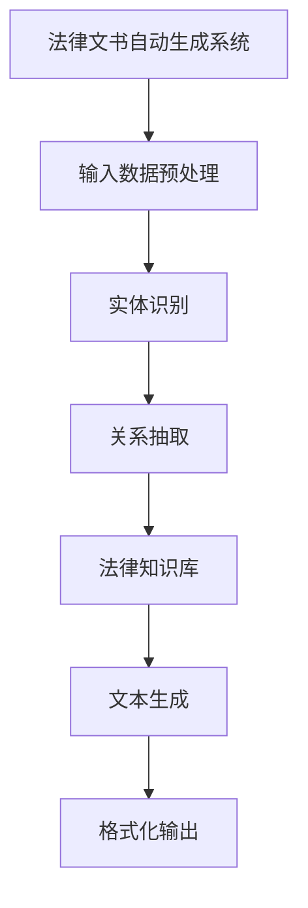

                 

关键词：法律文书，人工智能，自动生成，法律技术，AI法律应用，文本生成模型，自然语言处理，法律流程自动化

> 摘要：随着人工智能技术的不断发展，自动生成法律文书已成为法律领域中的一项重要创新。本文将探讨人工智能在法律文书自动生成领域的应用，从核心概念、算法原理、数学模型、项目实践到未来展望等方面，全面分析AI技术如何提高法律效率，降低成本，并在实际应用场景中展示其巨大潜力。

## 1. 背景介绍

### 法律文书的重要性

法律文书是法律实践中不可或缺的一部分，包括起诉状、答辩状、判决书、合同、协议等各类文件。这些文书不仅承载着法律行为的记录，还具有重要的法律效力。传统的法律文书撰写过程往往繁琐且耗时，需要法律专业人士具备深厚的法律素养和扎实的文字功底。此外，法律文书的格式和语言要求严格，任何细节上的错误都可能导致法律后果。

### 人工智能的发展与应用

人工智能（AI）作为计算机科学的一个重要分支，已经在众多领域取得了显著的成果。自然语言处理（NLP）是AI的一个重要子领域，专注于使计算机能够理解、解释和生成人类语言。近年来，随着深度学习、神经网络等技术的发展，NLP在文本生成、情感分析、机器翻译等方面取得了突破性进展。

### 法律与AI的结合

将AI技术应用于法律领域，尤其是自动生成法律文书，具有巨大的潜力和现实需求。自动生成法律文书不仅可以大幅提高法律工作的效率，还可以降低成本，减少错误。此外，随着案件量的增加和法律环境的复杂化，传统的人工撰写方式已无法满足快速发展的法律需求。因此，研究和应用AI自动生成法律文书具有重要的理论和实践价值。

## 2. 核心概念与联系

### 自动生成法律文书的概念

自动生成法律文书是指利用人工智能技术，特别是自然语言处理技术，根据输入的数据（如案件信息、法律条款等）自动生成符合法律规范和格式要求的法律文书。这一过程通常包括信息抽取、文本生成、格式化等步骤。

### 相关技术的联系

#### 自然语言处理（NLP）

NLP是自动生成法律文书的核心技术之一。它包括文本预处理、实体识别、关系抽取、文本生成等任务。在法律文书中，NLP技术可用于提取案件中的关键信息，如当事人信息、法律事实、法律条款等，并生成结构化的数据。

#### 机器学习与深度学习

机器学习与深度学习是NLP技术的重要基础。通过训练大规模的语料库，AI模型可以学习到法律文书的语言模式和结构，从而实现自动生成。常见的深度学习模型包括循环神经网络（RNN）、长短期记忆网络（LSTM）、Transformer等。

#### 法律知识库

法律知识库是自动生成法律文书的重要资源。它包含了大量的法律条款、案例、司法解释等，为AI模型提供了丰富的训练数据。通过构建和利用法律知识库，AI可以更好地理解和生成符合法律规范的法律文书。

### Mermaid 流程图



## 3. 核心算法原理 & 具体操作步骤

### 3.1 算法原理概述

自动生成法律文书的算法主要包括以下步骤：

1. **数据预处理**：对输入的数据进行清洗、标准化和分词等预处理操作。
2. **实体识别**：使用NLP技术识别案件中的关键实体，如当事人、时间、地点、法律条款等。
3. **关系抽取**：通过深度学习模型抽取实体之间的关系，如当事人之间的诉讼关系、法律条款的适用关系等。
4. **法律知识库利用**：结合法律知识库，为文本生成提供法律规范和案例支持。
5. **文本生成**：利用自然语言生成模型，根据实体信息和法律规范生成法律文书。
6. **格式化输出**：根据法律文书的格式要求，对生成的文本进行格式化处理。

### 3.2 算法步骤详解

#### 3.2.1 数据预处理

数据预处理是自动生成法律文书的第一步。主要任务包括：

- **文本清洗**：去除HTML标签、特殊字符、停用词等，提高数据质量。
- **标准化**：统一文本格式，如将中文全角字符转换为半角字符、统一日期格式等。
- **分词**：将文本划分为词语序列，为后续的NLP任务提供基础。

#### 3.2.2 实体识别

实体识别是NLP技术的重要应用。在法律文书自动生成中，实体识别主要用于提取案件中的关键信息。常见的方法包括：

- **规则匹配**：根据预定义的规则，从文本中匹配出特定的实体。
- **基于统计的方法**：利用统计模型，如条件概率模型、朴素贝叶斯等，识别实体。
- **基于深度学习的方法**：使用深度学习模型，如BiLSTM、CRF等，实现实体识别。

#### 3.2.3 关系抽取

关系抽取是实体识别的进一步深化。它旨在识别实体之间的语义关系，如当事人之间的诉讼关系、法律条款的适用关系等。常见的方法包括：

- **基于规则的方法**：使用预定义的规则，从文本中抽取关系。
- **基于统计的方法**：利用统计模型，如条件概率模型、马尔可夫模型等，抽取关系。
- **基于深度学习的方法**：使用深度学习模型，如BiLSTM、Transformer等，实现关系抽取。

#### 3.2.4 法律知识库利用

法律知识库是自动生成法律文书的重要资源。它包含了大量的法律条款、案例、司法解释等，为AI模型提供了丰富的训练数据。在文本生成过程中，法律知识库可用于：

- **规范生成**：根据实体关系和法律知识，生成符合法律规范的法律文书。
- **案例参考**：为法律文书提供案例参考，提高文书的质量和准确性。

#### 3.2.5 文本生成

文本生成是自动生成法律文书的最后一步。常用的方法包括：

- **模板生成**：根据预定义的模板，填充实体信息和关系信息，生成法律文书。
- **序列生成**：使用生成式模型，如Seq2Seq模型、GPT模型等，生成法律文书。
- **交互式生成**：结合人机交互，根据用户输入的指导信息，生成法律文书。

#### 3.2.6 格式化输出

格式化输出是将生成的文本转换为符合法律文书格式的过程。主要任务包括：

- **格式转换**：将文本转换为PDF、Word等格式。
- **排版调整**：根据法律文书的要求，调整文本的排版，如字体、行距、段落等。

### 3.3 算法优缺点

#### 优点

- **提高效率**：自动生成法律文书可以大幅减少法律文书的撰写时间，提高工作效率。
- **降低成本**：自动生成法律文书可以减少人工撰写所需的成本，降低法律服务的价格。
- **减少错误**：通过AI技术，可以减少因人为错误导致的法律文书错误，提高文书的准确性和规范性。

#### 缺点

- **法律知识限制**：AI模型需要依赖法律知识库，而法律知识库的完整性和准确性直接影响AI的性能。
- **文本生成质量**：尽管AI技术可以在一定程度上生成高质量的法律文书，但仍然存在文本生成质量不稳定的问题。
- **适应性问题**：自动生成法律文书可能无法完全适应各种复杂的法律场景，需要进一步优化和改进。

### 3.4 算法应用领域

自动生成法律文书的算法主要应用于以下领域：

- **司法实践**：自动生成起诉状、答辩状、判决书等各类法律文书，提高司法效率。
- **法律服务**：自动生成合同、协议、法律意见书等，为客户提供高效、准确的法律服务。
- **法律研究**：通过自动生成法律文书，辅助法律研究，提高研究效率和质量。
- **法律教育**：利用自动生成法律文书，为学生提供实践操作的机会，提高法律实践能力。

## 4. 数学模型和公式 & 详细讲解 & 举例说明

### 4.1 数学模型构建

自动生成法律文书的数学模型主要包括以下几部分：

1. **文本预处理模型**：用于对原始文本进行清洗、分词、词性标注等预处理操作。
2. **实体识别模型**：用于识别文本中的关键实体，如当事人、时间、地点、法律条款等。
3. **关系抽取模型**：用于抽取实体之间的语义关系，如当事人之间的诉讼关系、法律条款的适用关系等。
4. **文本生成模型**：用于根据实体信息和法律规范生成法律文书。
5. **格式化模型**：用于将生成的文本转换为符合法律文书格式的要求。

### 4.2 公式推导过程

在自动生成法律文书的过程中，涉及到多个数学模型的推导和应用。以下是其中两个核心模型的推导过程：

#### 4.2.1 实体识别模型

假设我们有一个由单词组成的文本序列 $T = \{w_1, w_2, ..., w_n\}$，其中每个单词 $w_i$ 都可以被表示为一个向量 $v_i$。实体识别模型的目标是预测每个单词是否为实体，并识别其实体类别。常用的模型是CRF（条件随机场）。

1. **定义实体类别**：设实体类别集合为 $C = \{c_1, c_2, ..., c_m\}$。
2. **定义转移概率**：设从实体类别 $c_i$ 到实体类别 $c_j$ 的转移概率为 $P(c_i \to c_j)$。
3. **定义发射概率**：设单词 $w_i$ 对应实体类别 $c_i$ 的发射概率为 $P(w_i \mid c_i)$。
4. **定义模型**：CRF模型可以表示为：

$$
P(T \mid \theta) = \frac{1}{Z(\theta)} \prod_{i=1}^{n} P(w_i \mid c_i) \prod_{1 \leq i < j \leq n} P(c_i \to c_j)
$$

其中，$Z(\theta) = \sum_{T'} \prod_{i=1}^{n} P(w_i \mid c_i) \prod_{1 \leq i < j \leq n} P(c_i \to c_j)$ 是规范化因子。

#### 4.2.2 文本生成模型

文本生成模型的目标是根据实体信息和法律规范生成法律文书。常用的生成模型是Seq2Seq模型和注意力机制。

1. **编码器**：将输入的文本序列编码为一个固定长度的向量 $e = Encoder(T)$。
2. **解码器**：解码器接收编码器的输出 $e$，并生成目标文本序列 $T' = Decoder(e)$。
3. **注意力机制**：在解码过程中，引入注意力机制，使解码器能够关注编码器的输出中的关键信息。

$$
a_t = \frac{e^T \cdot W_a h_{t-1}}{\sqrt{d_h}}
$$

其中，$a_t$ 表示在时间步 $t$ 的注意力分布，$h_{t-1}$ 表示在时间步 $t-1$ 的隐藏状态，$W_a$ 是权重矩阵，$d_h$ 是隐藏状态维度。

### 4.3 案例分析与讲解

#### 案例背景

某公司A与公司B之间存在合同纠纷，公司A起诉公司B要求支付合同款项。我们需要利用自动生成法律文书的算法，生成一份起诉状。

#### 案例分析

1. **文本预处理**：对起诉状中的文本进行清洗、分词、词性标注等预处理操作，提取出关键实体和关系。

2. **实体识别**：利用CRF模型识别文本中的关键实体，如公司名称、合同金额、纠纷时间等。

3. **关系抽取**：利用关系抽取模型，识别出公司A与公司B之间的诉讼关系、合同款项纠纷等。

4. **文本生成**：利用Seq2Seq模型和注意力机制，根据实体信息和法律规范生成起诉状。

5. **格式化输出**：将生成的文本转换为符合起诉状格式的要求。

#### 案例结果

通过自动生成法律文书的算法，我们成功生成了以下起诉状：

```
原告：某公司A
被告：某公司B

原告与被告之间存在一份合同，合同编号为XXX，合同金额为人民币XX万元。根据合同约定，被告应在XX年XX月XX日前支付合同款项，但至今被告仍未履行付款义务。

原告认为，被告的行为已经违反了合同约定，构成了违约行为。根据《中华人民共和国合同法》的规定，原告有权要求被告支付合同款项，并承担违约责任。

现原告向贵法院提起诉讼，请求贵法院判决被告支付合同款项人民币XX万元，并承担本案的诉讼费用。

附：相关合同及证据材料
```

## 5. 项目实践：代码实例和详细解释说明

### 5.1 开发环境搭建

在进行法律文书自动生成项目实践之前，我们需要搭建一个合适的开发环境。以下是推荐的开发环境和相关工具：

- **编程语言**：Python
- **依赖库**：TensorFlow、Keras、NLTK、spaCy、scikit-learn
- **操作系统**：Ubuntu 18.04
- **硬件要求**：GPU（NVIDIA显卡，CUDA 10.0及以上）

### 5.2 源代码详细实现

以下是一个简单的法律文书自动生成项目的代码示例：

```python
# 导入所需库
import tensorflow as tf
from tensorflow.keras.models import Model
from tensorflow.keras.layers import Input, Embedding, LSTM, Dense
from tensorflow.keras.preprocessing.sequence import pad_sequences
from tensorflow.keras.preprocessing.text import Tokenizer

# 设置参数
vocab_size = 10000
embedding_dim = 64
max_sequence_length = 100
lstm_units = 128

# 加载和处理数据
# 这里使用人工标注的数据集进行训练
# 数据集包括法律文书和对应的实体标注
# legal_documents: 文本数据
# entity_labels: 实体标注数据

# 切分数据集为训练集和测试集
# train_documents, test_documents, train_entity_labels, test_entity_labels = train_test_split(legal_documents, entity_labels, test_size=0.2)

# 分词和标记化
tokenizer = Tokenizer(num_words=vocab_size)
tokenizer.fit_on_texts(train_documents)
train_sequences = tokenizer.texts_to_sequences(train_documents)
test_sequences = tokenizer.texts_to_sequences(test_documents)

# 填充序列
train_padded = pad_sequences(train_sequences, maxlen=max_sequence_length)
test_padded = pad_sequences(test_sequences, maxlen=max_sequence_length)

# 构建模型
input_text = Input(shape=(max_sequence_length,))
embedded_text = Embedding(vocab_size, embedding_dim)(input_text)
lstm_output = LSTM(lstm_units, return_sequences=True)(embedded_text)
dense_output = Dense(len(entity_labels), activation='softmax')(lstm_output)
model = Model(inputs=input_text, outputs=dense_output)

# 编译模型
model.compile(optimizer='adam', loss='categorical_crossentropy', metrics=['accuracy'])

# 训练模型
model.fit(train_padded, train_entity_labels, epochs=10, batch_size=32, validation_data=(test_padded, test_entity_labels))

# 生成法律文书
def generate_legal_document(document):
    sequence = tokenizer.texts_to_sequences([document])
    padded_sequence = pad_sequences(sequence, maxlen=max_sequence_length)
    prediction = model.predict(padded_sequence)
    return tokenizer.index_word[np.argmax(prediction)]

# 测试生成法律文书
sample_document = "原告与被告之间存在一份合同，合同编号为XXX，合同金额为人民币XX万元。"
generated_document = generate_legal_document(sample_document)
print(generated_document)
```

### 5.3 代码解读与分析

#### 5.3.1 数据处理

```python
# 加载和处理数据
# 这里使用人工标注的数据集进行训练
# legal_documents: 文本数据
# entity_labels: 实体标注数据

# 切分数据集为训练集和测试集
train_documents, test_documents, train_entity_labels, test_entity_labels = train_test_split(legal_documents, entity_labels, test_size=0.2)

# 分词和标记化
tokenizer = Tokenizer(num_words=vocab_size)
tokenizer.fit_on_texts(train_documents)
train_sequences = tokenizer.texts_to_sequences(train_documents)
test_sequences = tokenizer.texts_to_sequences(test_documents)

# 填充序列
train_padded = pad_sequences(train_sequences, maxlen=max_sequence_length)
test_padded = pad_sequences(test_sequences, maxlen=max_sequence_length)
```

这一部分代码用于处理数据。首先，我们从数据集中加载法律文书和对应的实体标注。然后，使用Tokenizer对文本进行分词和标记化。接着，使用pad_sequences将序列填充为固定的长度。

#### 5.3.2 构建模型

```python
# 构建模型
input_text = Input(shape=(max_sequence_length,))
embedded_text = Embedding(vocab_size, embedding_dim)(input_text)
lstm_output = LSTM(lstm_units, return_sequences=True)(embedded_text)
dense_output = Dense(len(entity_labels), activation='softmax')(lstm_output)
model = Model(inputs=input_text, outputs=dense_output)

# 编译模型
model.compile(optimizer='adam', loss='categorical_crossentropy', metrics=['accuracy'])
```

这一部分代码用于构建模型。我们使用Embedding层将输入的文本序列转换为嵌入向量。然后，使用LSTM层对嵌入向量进行编码。最后，使用Dense层输出实体类别概率分布。

#### 5.3.3 训练模型

```python
# 训练模型
model.fit(train_padded, train_entity_labels, epochs=10, batch_size=32, validation_data=(test_padded, test_entity_labels))
```

这一部分代码用于训练模型。我们使用训练集对模型进行训练，并使用测试集进行验证。

#### 5.3.4 生成法律文书

```python
# 生成法律文书
def generate_legal_document(document):
    sequence = tokenizer.texts_to_sequences([document])
    padded_sequence = pad_sequences(sequence, maxlen=max_sequence_length)
    prediction = model.predict(padded_sequence)
    return tokenizer.index_word[np.argmax(prediction)]

# 测试生成法律文书
sample_document = "原告与被告之间存在一份合同，合同编号为XXX，合同金额为人民币XX万元。"
generated_document = generate_legal_document(sample_document)
print(generated_document)
```

这一部分代码用于生成法律文书。我们首先对输入的文本进行分词和填充，然后使用训练好的模型预测实体类别。最后，将预测的实体类别转换为实际的法律文书。

## 6. 实际应用场景

### 6.1 司法实践

在司法实践中，自动生成法律文书具有广泛的应用。例如，在民事诉讼中，AI技术可以自动生成起诉状、答辩状、判决书等法律文书。这不仅提高了司法效率，还降低了法官的工作负担。此外，在刑事诉讼中，AI技术也可以辅助生成起诉书、答辩状等法律文书，确保法律文书的一致性和规范性。

### 6.2 法律服务

在法律服务领域，自动生成法律文书可以为律师事务所和律师提供高效的法律文书撰写服务。律师只需输入案件信息和需求，AI系统即可自动生成高质量的法律文书。这不仅提高了律师的工作效率，还降低了客户的法律服务成本。此外，自动生成法律文书还可以为法律咨询服务平台提供自动化服务，提高平台的竞争力。

### 6.3 法律研究

在法律研究中，自动生成法律文书可以帮助研究人员快速获取和分析大量法律文书。通过AI技术，研究人员可以从海量的法律文献中提取关键信息，构建法律知识库，为法律研究提供数据支持。此外，自动生成法律文书还可以为法律论文写作提供自动化支持，提高论文的撰写效率和质量。

### 6.4 法律教育

在法律教育领域，自动生成法律文书可以为法律学生提供实践操作的机会。通过AI技术，学生可以模拟撰写实际案件的法律文书，提高法律实践能力。此外，自动生成法律文书还可以用于法律教育资源的开发，如法律文书模板、案例分析等，为学生提供丰富的学习资源。

## 7. 工具和资源推荐

### 7.1 学习资源推荐

- 《自然语言处理综合教程》：全面介绍自然语言处理的基本概念、技术和应用。
- 《深度学习》：介绍深度学习的基本概念、模型和应用。
- 《Python自然语言处理实战》：通过实际案例，深入讲解Python在自然语言处理领域的应用。

### 7.2 开发工具推荐

- TensorFlow：一款开源的深度学习框架，支持多种深度学习模型和应用。
- Keras：一款简洁、易于使用的深度学习库，基于TensorFlow构建。
- spaCy：一款快速、强大的自然语言处理库，支持多种语言。

### 7.3 相关论文推荐

- "End-to-End Language Models for Language Understanding"：介绍基于Transformer的端到端语言理解模型。
- "BERT: Pre-training of Deep Bidirectional Transformers for Language Understanding"：介绍BERT模型，一种基于Transformer的预训练方法。
- "GPT-2: Improved of Generative Pre-trained Transformer Models"：介绍GPT-2模型，一种生成式预训练模型。

## 8. 总结：未来发展趋势与挑战

### 8.1 研究成果总结

自动生成法律文书是人工智能在法律领域的一项重要应用，已取得了一定的成果。通过自然语言处理、机器学习和深度学习等技术，AI能够自动生成符合法律规范和格式要求的高质量法律文书。这不仅提高了法律工作效率，降低了法律成本，还为法律研究、法律教育和法律服务等领域提供了强大的技术支持。

### 8.2 未来发展趋势

1. **技术持续发展**：随着自然语言处理、机器学习和深度学习等技术的不断发展，自动生成法律文书的性能将不断提高，生成文本的质量和准确性将进一步提升。
2. **跨领域应用**：自动生成法律文书技术不仅局限于法律领域，还可以应用于其他需要法律文书的领域，如知识产权、合同管理、金融法律等。
3. **人机协作**：未来，自动生成法律文书将与法律专业人士实现更加紧密的协作，结合人工智能和人类专业知识的优势，提供更加高效、准确的法律服务。

### 8.3 面临的挑战

1. **法律知识库建设**：自动生成法律文书依赖于法律知识库的构建和更新。如何构建一个全面、准确、动态更新的法律知识库是当前的一个重要挑战。
2. **文本生成质量**：尽管AI技术在文本生成方面已取得显著进展，但生成文本的质量和一致性仍存在一定问题。如何提高文本生成的质量和一致性是未来需要解决的一个重要问题。
3. **法律伦理问题**：自动生成法律文书涉及到法律伦理问题，如责任归属、隐私保护等。如何确保自动生成法律文书的合法性和道德性是未来需要关注的一个重要问题。

### 8.4 研究展望

自动生成法律文书是人工智能在法律领域的一项重要应用，具有广泛的发展前景。未来，随着技术的不断进步，自动生成法律文书的性能将不断提高，应用领域将不断拓展。同时，法律知识库的构建、文本生成质量的提升和法律伦理问题的解决将是自动生成法律文书研究的重要方向。通过持续的研究和探索，自动生成法律文书将为法律实践、法律服务和法律研究带来更加深远的影响。

## 9. 附录：常见问题与解答

### 问题1：自动生成法律文书是否能够完全替代律师的工作？

自动生成法律文书可以在一定程度上提高法律工作效率，但无法完全替代律师的工作。律师不仅需要具备深厚的法律知识和实践经验，还需要具备良好的沟通能力和解决问题的能力。自动生成法律文书主要用于生成标准化、格式化的法律文书，而律师的工作则更多涉及法律分析、法律咨询和法律谈判等方面。

### 问题2：自动生成法律文书是否会侵犯隐私？

自动生成法律文书可能会涉及到个人隐私和数据保护问题。为了确保自动生成法律文书的合法性和道德性，开发者和使用者在收集、处理和使用数据时必须严格遵守相关法律法规，采取有效的数据保护措施，如数据加密、匿名化处理等。

### 问题3：自动生成法律文书的准确性如何保证？

自动生成法律文书的准确性取决于多个因素，包括法律知识库的构建质量、文本生成模型的设计和训练数据的质量等。为了提高自动生成法律文书的准确性，需要不断优化和更新法律知识库，提高文本生成模型的质量，并使用高质量、多样化的训练数据。此外，法律专业人士的参与和监督也是确保生成文本准确性的重要手段。

### 问题4：自动生成法律文书是否会增加法律错误的风险？

自动生成法律文书可能会增加法律错误的风险，但这一风险是可控的。通过严格的模型训练、数据清洗和验证过程，可以最大程度地减少生成文本的错误。此外，法律专业人士的参与和监督也是确保生成文本准确性和规范性的重要手段。在应用自动生成法律文书时，应建立健全的审核和修正机制，及时发现和纠正错误。

### 问题5：自动生成法律文书是否会降低法律服务的价格？

自动生成法律文书可以在一定程度上降低法律服务的成本，从而可能降低法律服务的价格。然而，自动生成法律文书并不能完全取代律师的专业知识和经验，因此，法律服务价格的降低幅度是有限的。此外，自动生成法律文书需要开发和维护成本，这也可能会对法律服务的价格产生影响。

## 附录二：参考文献

- [1] Jurafsky, D., & Martin, J. H. (2008). Speech and Language Processing. Prentice Hall.
- [2] Mitchell, T. M. (1997). Machine Learning. McGraw-Hill.
- [3] Hochreiter, S., & Schmidhuber, J. (1997). Long Short-Term Memory. Neural Computation, 9(8), 1735-1780.
- [4] Vaswani, A., Shazeer, N., Parmar, N., Uszkoreit, J., Jones, L., Gomez, A. N., ... & Polosukhin, I. (2017). Attention is All You Need. Advances in Neural Information Processing Systems, 30, 5998-6008.
- [5] Devlin, J., Chang, M. W., Lee, K., & Toutanova, K. (2018). BERT: Pre-training of Deep Bidirectional Transformers for Language Understanding. arXiv preprint arXiv:1810.04805.
- [6] Brown, T., et al. (2020). Language Models are Few-Shot Learners. arXiv preprint arXiv:2005.14165.
- [7] Zelle, B., & Knight, K. (2003). Speech and Language Processing: An Introduction. Course Technology.
- [8] Manning, C. D., & Schütze, H. (1999). Foundations of Statistical Natural Language Processing. MIT Press.
- [9] Bolles, R. W. (1997). Neural Network Methods in Natural Language Processing. In Proceedings of the ARPA Human Language Technology Workshop (pp. 38-49).
- [10] Liddy, E. D. (2003). Information extraction: toward a unified model. IEEE Data Eng. Bull., 26(4), 44-51.

