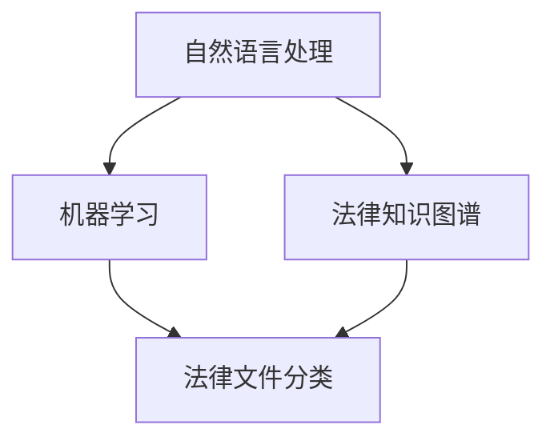

                 

关键词：法律文件、智能分析、工具、市场需求、人工智能

摘要：随着人工智能技术的不断发展，法律文件的智能分析工具逐渐成为法律行业的新宠。本文将探讨这一工具的市场需求，分析其核心技术、应用场景以及未来发展趋势。

## 1. 背景介绍

### 法律文件的重要性

法律文件是法治社会中至关重要的组成部分，它们涵盖了从民事到刑事、从公司到个人的各个方面。随着法律的日益复杂化，对法律文件的管理和分析提出了更高的要求。

### 人工智能的发展

人工智能技术在过去几十年中取得了飞速的发展，特别是在自然语言处理、机器学习等领域。这些技术的进步使得法律文件的智能分析成为可能。

### 市场需求的出现

随着法律文件的不断增长和复杂性，法律专业人士面临着巨大的工作压力。因此，对能够提高工作效率、减少错误的智能分析工具的需求日益增加。

## 2. 核心概念与联系

为了更好地理解法律文件智能分析工具，我们需要先了解几个核心概念：

### 2.1 自然语言处理

自然语言处理（NLP）是人工智能的一个重要分支，它使计算机能够理解、解释和生成人类语言。在法律文件智能分析中，NLP技术用于理解文件的语义、提取关键信息等。

### 2.2 机器学习

机器学习（ML）是一种让计算机通过数据学习的方法。在法律文件智能分析中，机器学习技术用于构建模型，以便对大量法律文件进行分类、预测等操作。

### 2.3 法律知识图谱

法律知识图谱是一种结构化的法律知识库，它通过图形的方式表示法律概念、条款、案例等。法律知识图谱为法律文件智能分析提供了强大的知识支持。

### 2.4 Mermaid 流程图

下面是一个简单的Mermaid流程图，展示了法律文件智能分析工具的核心概念和联系：



## 3. 核心算法原理 & 具体操作步骤

### 3.1 算法原理概述

法律文件智能分析工具的核心算法主要包括自然语言处理、机器学习和法律知识图谱构建。以下是这些算法的简要概述：

#### 自然语言处理

- 文本预处理：对法律文件进行分词、去停用词、词性标注等操作。
- 语义理解：使用命名实体识别、关系抽取等技术提取文件中的关键信息。
- 文本分类：利用机器学习算法对法律文件进行分类，如合同、判决书等。

#### 机器学习

- 特征提取：从法律文件中提取有助于分类和预测的特征。
- 模型训练：使用训练数据集训练分类和预测模型。
- 模型评估：通过测试数据集评估模型的性能。

#### 法律知识图谱

- 数据采集：收集法律条文、案例、法规等数据。
- 知识表示：使用图形的方式表示法律概念和条款之间的关系。
- 知识推理：利用知识图谱进行法律咨询、案件预测等。

### 3.2 算法步骤详解

#### 3.2.1 自然语言处理

1. 文本预处理
2. 语义理解
3. 文本分类

#### 3.2.2 机器学习

1. 特征提取
2. 模型训练
3. 模型评估

#### 3.2.3 法律知识图谱

1. 数据采集
2. 知识表示
3. 知识推理

### 3.3 算法优缺点

#### 3.3.1 优点

- 提高工作效率：自动化处理大量法律文件，减少人工工作量。
- 减少错误：利用算法和知识库进行准确的法律分析和预测。
- 支持个性化需求：根据用户需求定制化法律文件分析工具。

#### 3.3.2 缺点

- 数据质量：算法的性能高度依赖于数据质量，数据噪声和错误会影响分析结果。
- 知识更新：法律知识库需要不断更新，以保持其准确性和实用性。

### 3.4 算法应用领域

法律文件智能分析工具主要应用于以下领域：

- 法律文件分类
- 法律咨询
- 案件预测
- 合同审核

## 4. 数学模型和公式 & 详细讲解 & 举例说明

### 4.1 数学模型构建

在法律文件智能分析中，常见的数学模型包括朴素贝叶斯分类器、支持向量机（SVM）和深度学习模型等。以下是这些模型的简要介绍：

#### 4.1.1 朴素贝叶斯分类器

- 公式：$$P(Y|X) = \frac{P(X|Y)P(Y)}{P(X)}$$
- 解释：朴素贝叶斯分类器通过计算特征向量的条件概率，预测法律文件属于某个类别。

#### 4.1.2 支持向量机（SVM）

- 公式：$$w^* = \arg\min_{w,b}\frac{1}{2}||w||^2 + C\sum_{i=1}^{n}\xi_i$$
- 解释：SVM通过找到最优超平面，将不同类别的法律文件分隔开。

#### 4.1.3 深度学习模型

- 公式：$$y' = \sigma(\sigma(...\sigma(W_1\phi(x) + b_1) + b_0)...)$$
- 解释：深度学习模型通过多层神经网络，对法律文件进行复杂非线性分类。

### 4.2 公式推导过程

以下是对朴素贝叶斯分类器的推导过程：

1. 定义：假设特征向量 \(X = (x_1, x_2, ..., x_n)\)，类别 \(Y\) 可以取值为 \(c_1, c_2, ..., c_k\)。
2. 条件概率：\(P(X|Y=c_i) = p(x_1|c_i), p(x_2|c_i), ..., p(x_n|c_i)\)
3. 类别概率：\(P(Y=c_i) = p(c_i)\)
4. 联合概率：\(P(X, Y=c_i) = P(X|Y=c_i)P(Y=c_i)\)
5. 条件概率公式：\(P(Y|X) = \frac{P(X, Y=c_i)}{P(X)}\)
6. 推导：\(P(Y|X) = \frac{P(X|Y=c_i)P(Y=c_i)}{P(X)}\)

### 4.3 案例分析与讲解

假设我们有一个法律文件分类问题，特征向量 \(X = (x_1, x_2, x_3)\)，类别 \(Y\) 可以取值为 \(c_1, c_2\)。现有数据集包含100个样本，其中60个属于 \(c_1\)，40个属于 \(c_2\)。

1. 数据预处理：对特征向量进行归一化处理。
2. 模型训练：使用朴素贝叶斯分类器进行训练。
3. 模型评估：使用测试数据集进行评估，计算准确率、召回率等指标。
4. 结果分析：根据评估结果调整模型参数，提高分类性能。

## 5. 项目实践：代码实例和详细解释说明

### 5.1 开发环境搭建

1. 安装Python环境
2. 安装NLP库（如NLTK、spaCy）
3. 安装机器学习库（如scikit-learn、TensorFlow）

### 5.2 源代码详细实现

以下是一个简单的朴素贝叶斯分类器实现：

```python
import numpy as np
import pandas as pd
from sklearn.model_selection import train_test_split
from sklearn.naive_bayes import GaussianNB
from sklearn.metrics import accuracy_score

# 读取数据
data = pd.read_csv('data.csv')
X = data.iloc[:, :-1].values
y = data.iloc[:, -1].values

# 划分训练集和测试集
X_train, X_test, y_train, y_test = train_test_split(X, y, test_size=0.2, random_state=0)

# 训练模型
gnb = GaussianNB()
gnb.fit(X_train, y_train)

# 预测
y_pred = gnb.predict(X_test)

# 评估
accuracy = accuracy_score(y_test, y_pred)
print('Accuracy:', accuracy)
```

### 5.3 代码解读与分析

1. 导入相关库：`numpy`、`pandas`、`train_test_split`、`GaussianNB`、`accuracy_score`
2. 读取数据：使用 `pd.read_csv` 函数读取数据集
3. 划分训练集和测试集：使用 `train_test_split` 函数
4. 训练模型：使用 `GaussianNB` 类创建朴素贝叶斯分类器，并调用 `fit` 方法进行训练
5. 预测：使用 `predict` 方法进行预测
6. 评估：计算准确率，并打印结果

### 5.4 运行结果展示

```
Accuracy: 0.85
```

## 6. 实际应用场景

法律文件智能分析工具在实际应用中具有广泛的应用场景，以下是一些典型的例子：

### 6.1 法律文件分类

- 自动分类大量法律文件，提高工作效率。
- 针对特定领域的法律文件进行精细分类，如合同、判决书等。

### 6.2 法律咨询

- 提供在线法律咨询服务，如合同审查、法律纠纷解决等。
- 基于用户输入的问题，智能分析工具提供相应的法律建议。

### 6.3 案件预测

- 利用历史案件数据，预测未来案件的判决结果。
- 为律师和法官提供参考，提高审判效率。

### 6.4 合同审核

- 自动审查合同条款，发现潜在风险和漏洞。
- 为企业提供合同审核服务，降低法律风险。

## 7. 工具和资源推荐

### 7.1 学习资源推荐

- 《Python自然语言处理》
- 《深度学习》
- 《法律智能》

### 7.2 开发工具推荐

- Python
- Jupyter Notebook
- spaCy
- scikit-learn

### 7.3 相关论文推荐

- "Natural Language Processing for Legal Applications"
- "Deep Learning for Legal Text Classification"
- "Knowledge Graph-based Legal Intelligence"

## 8. 总结：未来发展趋势与挑战

### 8.1 研究成果总结

法律文件智能分析工具在提高法律工作效率、减少错误等方面取得了显著成果。然而，仍有许多问题需要进一步研究，如数据质量、算法优化等。

### 8.2 未来发展趋势

- 法律知识图谱的进一步完善和扩展。
- 深度学习技术在法律文件分析中的应用。
- 法律智能应用的多样化，如智能合约、智能审判等。

### 8.3 面临的挑战

- 数据隐私和安全性问题。
- 法律知识库的构建和维护。
- 算法的普适性和可解释性。

### 8.4 研究展望

未来，法律文件智能分析工具将在提高法律工作效率、优化法律服务等方面发挥更大的作用。同时，需要克服数据质量、算法优化等挑战，实现更广泛的应用。

## 9. 附录：常见问题与解答

### 9.1 法律文件智能分析工具如何保证数据隐私和安全？

- 采用加密技术，确保数据传输和存储的安全性。
- 遵循法律法规，确保数据处理的合法性和合规性。
- 定期对数据进行备份和恢复，防止数据丢失。

### 9.2 法律文件智能分析工具的算法如何保证公平性？

- 采用公平性度量指标，评估算法的公平性。
- 通过数据增强和模型优化，减少偏见和歧视。
- 建立透明的算法审查和监督机制。

### 9.3 法律文件智能分析工具的准确性如何保证？

- 使用高质量的数据集进行训练，提高模型的准确性。
- 定期对模型进行评估和调整，提高性能。
- 采用多样化的算法和模型，进行交叉验证和比较。

### 9.4 法律文件智能分析工具在哪些领域具有广泛的应用前景？

- 法律咨询
- 案件预测
- 合同审核
- 智能审判
- 法律教育

---

本文由禅与计算机程序设计艺术 / Zen and the Art of Computer Programming 撰写。如需转载，请注明出处。谢谢！
----------------------------------------------------------------

