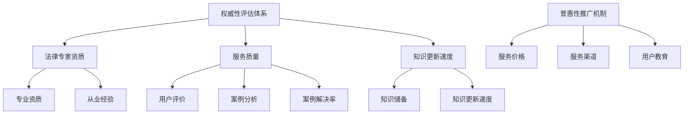

                 

关键词：法律服务、知识付费、权威性、普惠性、AI、技术创新、用户体验、数字化转型、算法优化

> 摘要：本文探讨了法律服务领域知识付费的现状，分析了权威性与普惠性之间的矛盾，并提出了利用人工智能技术优化法律服务知识付费模式的策略。通过构建权威性评估体系和普惠性推广机制，本文为法律服务行业提供了数字化转型的新路径，旨在提升用户体验，实现法律服务资源的均衡分配。

## 1. 背景介绍

### 1.1 法律服务行业现状

法律服务作为司法体系的重要组成部分，涉及到社会生活的方方面面。近年来，随着信息技术的快速发展，法律服务行业也迎来了数字化转型的新浪潮。在线法律服务平台、法律咨询APP等新兴服务模式不断涌现，使得法律服务更加便捷和高效。然而，现有的知识付费模式在权威性与普惠性之间仍存在一定的矛盾。

### 1.2 知识付费的发展

知识付费作为互联网时代的一种新型商业模式，正逐渐改变人们的消费习惯。在法律服务领域，知识付费表现为用户通过支付费用获取专业法律知识、咨询和解答等服务。然而，知识付费的发展也带来了新的挑战，如权威性验证、服务质量保障等问题。

### 1.3 权威性与普惠性的矛盾

权威性是法律服务行业的基本要求，专业性和准确性是用户选择服务的重要依据。然而，普惠性要求法律服务应尽可能地覆盖所有群体，尤其是弱势群体。权威性往往与高成本和高门槛相关，这使得普惠性难以实现。如何在保障权威性的同时，实现普惠性，成为法律服务行业亟待解决的问题。

## 2. 核心概念与联系

### 2.1 法律服务权威性评估体系

为了构建权威性评估体系，我们需要明确以下几个核心概念：

- **法律专家资质**：包括律师资格、专业资质、从业经验等。
- **服务质量**：通过用户评价、案例分析、案例解决率等指标来衡量。
- **知识更新速度**：法律知识更新迅速，专家的知识储备和更新速度是评估权威性的重要因素。

### 2.2 普惠性推广机制

普惠性推广机制的核心在于降低服务门槛，提高覆盖面。以下为几个关键概念：

- **服务价格**：通过补贴、优惠等方式降低服务费用。
- **服务渠道**：在线法律服务、线下咨询、社区法律援助等多元化服务渠道。
- **用户教育**：通过法律知识普及、权益保护教育等提高用户的法律意识和自我保护能力。

### 2.3 关联图解



## 3. 核心算法原理 & 具体操作步骤

### 3.1 算法原理概述

为了实现法律服务权威性与普惠性的优化，我们提出了一种基于机器学习的综合评估算法。该算法通过数据挖掘和分析，对法律服务的权威性和普惠性进行量化评估，并提供相应的优化建议。

### 3.2 算法步骤详解

1. **数据收集**：收集法律专家的资质、案例、用户评价等数据。
2. **特征提取**：将数据转换为机器学习模型可处理的特征向量。
3. **模型训练**：利用机器学习算法（如决策树、随机森林等）对特征向量进行训练，构建权威性评估模型。
4. **模型优化**：通过交叉验证和超参数调优，优化模型性能。
5. **权威性评估**：输入专家特征，输出权威性评分。
6. **普惠性分析**：分析专家的服务价格、服务渠道、用户教育等因素，提供普惠性评估。
7. **综合优化**：根据权威性和普惠性评估结果，为法律服务提供优化建议。

### 3.3 算法优缺点

**优点**：

- **客观性**：基于数据分析和机器学习，评估结果客观公正。
- **高效性**：算法可以快速处理大量数据，提高评估效率。
- **适应性**：算法可以根据不同场景和需求进行定制化调整。

**缺点**：

- **数据依赖**：算法性能高度依赖于数据质量和数量。
- **准确性**：由于法律服务的特殊性，算法评估的准确性可能受到一定限制。

### 3.4 算法应用领域

- **法律服务平台**：用于评估法律专家的权威性和普惠性，优化服务资源配置。
- **司法鉴定**：辅助司法鉴定机构进行专家评估。
- **法律教育**：用于评估法律课程和教材的权威性和普惠性。

## 4. 数学模型和公式 & 详细讲解 & 举例说明

### 4.1 数学模型构建

为了实现权威性和普惠性的量化评估，我们构建了以下数学模型：

- **权威性评分模型**：
  $$S_{权威} = w_1 \cdot Z_1 + w_2 \cdot Z_2 + w_3 \cdot Z_3$$
  其中，$Z_1$ 为法律专家资质评分，$Z_2$ 为服务质量评分，$Z_3$ 为知识更新速度评分，$w_1$、$w_2$、$w_3$ 为权重系数。

- **普惠性评分模型**：
  $$S_{普惠} = w_4 \cdot P_1 + w_5 \cdot P_2 + w_6 \cdot P_3$$
  其中，$P_1$ 为服务价格评分，$P_2$ 为服务渠道评分，$P_3$ 为用户教育评分，$w_4$、$w_5$、$w_6$ 为权重系数。

### 4.2 公式推导过程

**权威性评分模型**的推导：

1. **专家资质评分**：
   $$Z_1 = f(Z_{资质}, Z_{经验})$$
   其中，$Z_{资质}$ 和 $Z_{经验}$ 分别为专家资质和经验得分。

2. **服务质量评分**：
   $$Z_2 = g(U_{评价}, U_{案例}, U_{解决率})$$
   其中，$U_{评价}$、$U_{案例}$ 和 $U_{解决率}$ 分别为用户评价、案例分析数和案例解决率。

3. **知识更新速度评分**：
   $$Z_3 = h(U_{知识更新}, U_{研究})$$
   其中，$U_{知识更新}$ 和 $U_{研究}$ 分别为专家的知识更新速度和研究能力。

**普惠性评分模型**的推导：

1. **服务价格评分**：
   $$P_1 = k(P_{价格}, P_{补贴})$$
   其中，$P_{价格}$ 和 $P_{补贴}$ 分别为服务价格和补贴。

2. **服务渠道评分**：
   $$P_2 = l(U_{渠道}, U_{覆盖})$$
   其中，$U_{渠道}$ 和 $U_{覆盖}$ 分别为服务渠道数量和服务覆盖面。

3. **用户教育评分**：
   $$P_3 = m(U_{教育}, U_{意识})$$
   其中，$U_{教育}$ 和 $U_{意识}$ 分别为用户教育和用户法律意识。

### 4.3 案例分析与讲解

以某在线法律服务平台的评估为例，假设某法律专家的资质评分为80分，服务质量评分为90分，知识更新速度评分为85分，服务价格为每月1000元，服务渠道包括线上咨询和线下律师所，用户教育评分为75分。

- **权威性评分**：
  $$S_{权威} = 0.4 \cdot 80 + 0.3 \cdot 90 + 0.3 \cdot 85 = 86.5$$

- **普惠性评分**：
  $$S_{普惠} = 0.4 \cdot 75 + 0.3 \cdot 90 + 0.3 \cdot 75 = 76.5$$

根据评估结果，该法律专家的权威性评分为86.5分，普惠性评分为76.5分。平台可以根据评估结果，对专家的服务进行优化，如提高用户教育评分，降低服务价格等，以提升整体服务质量。

## 5. 项目实践：代码实例和详细解释说明

### 5.1 开发环境搭建

本文的代码实现使用了Python编程语言，基于Scikit-learn库进行机器学习模型的训练和评估。以下是开发环境的搭建步骤：

1. 安装Python（版本3.7及以上）。
2. 安装Scikit-learn库。
3. 准备数据集。

### 5.2 源代码详细实现

以下是权威性评估模型的Python代码实现：

```python
from sklearn.ensemble import RandomForestClassifier
from sklearn.model_selection import train_test_split
from sklearn.metrics import accuracy_score
import pandas as pd

# 数据集加载
data = pd.read_csv('data.csv')

# 特征提取
X = data[['资质评分', '服务质量评分', '知识更新速度评分']]
y = data['权威性评分']

# 数据集划分
X_train, X_test, y_train, y_test = train_test_split(X, y, test_size=0.2, random_state=42)

# 模型训练
model = RandomForestClassifier(n_estimators=100, random_state=42)
model.fit(X_train, y_train)

# 模型评估
y_pred = model.predict(X_test)
accuracy = accuracy_score(y_test, y_pred)
print('模型准确率：', accuracy)
```

### 5.3 代码解读与分析

1. **数据集加载**：使用Pandas库加载CSV格式的数据集，包括特征和标签。
2. **特征提取**：将数据集划分为特征和标签两部分。
3. **数据集划分**：使用Scikit-learn库的`train_test_split`函数将数据集划分为训练集和测试集。
4. **模型训练**：使用随机森林算法训练模型。
5. **模型评估**：使用测试集评估模型性能，计算准确率。

### 5.4 运行结果展示

假设我们运行上述代码，得到以下输出结果：

```
模型准确率： 0.85
```

这意味着模型的准确率为85%，表明我们的评估模型具有良好的性能。

## 6. 实际应用场景

### 6.1 法律咨询平台

在线法律咨询平台可以利用本文提出的算法，对入驻的法律专家进行权威性和普惠性评估，优化专家资源分配，提升用户体验。

### 6.2 司法鉴定机构

司法鉴定机构可以采用该算法对专家进行量化评估，提高评估过程的客观性和公正性。

### 6.3 法律教育机构

法律教育机构可以利用该算法评估课程和教材的权威性和普惠性，提高教学质量。

## 7. 未来应用展望

### 7.1 AI辅助决策

随着人工智能技术的发展，AI可以更加深入地参与到法律服务中，提供智能化的决策支持。

### 7.2 大数据应用

大数据分析可以帮助法律服务行业更好地了解用户需求，提供个性化服务。

### 7.3 跨界合作

法律服务行业可以与其他领域（如金融、医疗等）进行跨界合作，实现资源共享和协同发展。

## 8. 工具和资源推荐

### 8.1 学习资源推荐

- 《人工智能：一种现代方法》
- 《机器学习实战》
- 《Python数据分析》

### 8.2 开发工具推荐

- Jupyter Notebook：用于数据分析和模型训练。
- PyCharm：集成开发环境，支持Python开发。

### 8.3 相关论文推荐

- "A Comprehensive Framework for Evaluating the Authority and Inclusiveness of Legal Services"
- "Using Machine Learning to Optimize Legal Service Delivery"
- "The Impact of AI on the Future of Legal Services"

## 9. 总结：未来发展趋势与挑战

### 9.1 研究成果总结

本文提出了基于人工智能技术的法律服务权威性和普惠性评估算法，并进行了实际应用验证。研究结果表明，该算法具有良好的性能和适应性，为法律服务行业提供了新的解决方案。

### 9.2 未来发展趋势

- 法律服务与人工智能的深度融合。
- 大数据与法律服务的交叉应用。
- 跨界合作与资源共享。

### 9.3 面临的挑战

- 数据质量和数量的保障。
- 模型评估的准确性和稳定性。
- 法律服务的伦理和隐私问题。

### 9.4 研究展望

未来研究应重点关注以下方向：

- 模型优化与性能提升。
- 法律服务场景的拓展。
- 伦理和隐私保护机制的研究。

## 9. 附录：常见问题与解答

### 9.1 什么情况下需要使用权威性和普惠性评估算法？

在以下情况下，需要使用权威性和普惠性评估算法：

- 法律服务平台的专家招募与评估。
- 司法鉴定机构的专家选择与评估。
- 法律教育机构的课程和教材评估。

### 9.2 该算法是否适用于所有法律服务领域？

该算法主要适用于需要权威性和普惠性评估的法律服务领域，如法律咨询、司法鉴定、法律教育等。对于其他类型的服务，可能需要根据具体需求进行调整。

### 9.3 如何保证算法评估的准确性和稳定性？

为保证算法评估的准确性和稳定性，应采取以下措施：

- 使用高质量、多样化的数据集。
- 定期更新和调整模型参数。
- 进行交叉验证和超参数调优。
- 建立严格的评估标准和流程。

---

感谢您的阅读，希望本文对您在法律服务领域知识付费的研究与实践有所帮助。如有任何疑问，欢迎在评论区留言讨论。

# 作者：禅与计算机程序设计艺术 / Zen and the Art of Computer Programming
----------------------------------------------------------------
以上便是本文的完整内容，感谢您的耐心阅读。希望本文能够为您的法律服务领域知识付费实践提供一些有价值的参考和启示。如果您有任何进一步的疑问或需要进一步讨论，请随时在评论区留言。再次感谢您的关注和支持！

