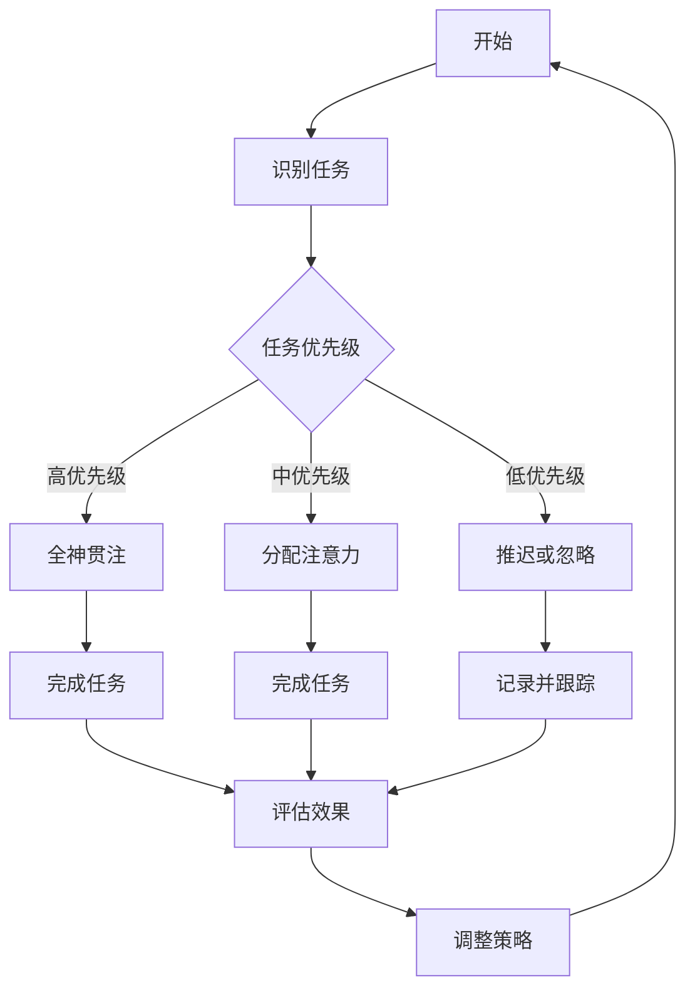

                 

关键词：注意力分配策略、个人效能提升、元宇宙、人工智能、注意力管理、多任务处理、认知负荷

> 摘要：本文探讨了元宇宙时代背景下，个人效能提升的关键因素——注意力分配策略。通过分析人工智能技术对注意力管理的影响，提出了在元宇宙环境中高效利用注意力的方法，旨在帮助用户在多元信息流中保持专注，提高工作和学习效率。

## 1. 背景介绍

随着互联网和移动设备的普及，人们面临着越来越多的信息输入。在元宇宙这一虚拟与现实交互的全新时代，个人的注意力资源变得更加稀缺。如何在元宇宙的环境中有效管理注意力，提高个人效能，成为当今社会亟需解决的问题。本文旨在通过对注意力分配策略的深入探讨，为用户在元宇宙时代提供有效的注意力管理指南。

### 1.1 注意力资源的重要性

注意力是人类认知资源的重要组成部分，直接影响个体的学习、工作和生活质量。有效的注意力分配策略能够帮助个体在处理多任务时保持高效率和精确度，避免认知过载。在元宇宙时代，注意力资源的管理变得尤为重要，因为虚拟环境的复杂性和互动性增加了认知负荷。

### 1.2 元宇宙环境的特点

元宇宙是一个由虚拟世界构成的网络空间，融合了多种技术，包括虚拟现实（VR）、增强现实（AR）、区块链和人工智能等。在元宇宙中，用户可以创建和体验虚拟角色，进行社交互动、娱乐、学习和工作。这一环境的丰富性和多样性对注意力管理提出了新的挑战。

## 2. 核心概念与联系

### 2.1 注意力分配策略的基本原理

注意力分配策略是指根据任务的需求和个体注意力资源的特点，合理分配注意力，以达到最优的效能。这一策略涉及以下几个关键概念：

- **注意力分散**：个体在处理多任务时，注意力在不同任务间的分配情况。
- **认知负荷**：个体在处理信息时所需的认知资源总量。
- **注意力分配效率**：个体在给定认知负荷下，注意力分配的有效程度。

### 2.2 注意力分配策略的Mermaid流程图



### 2.3 注意力分配策略的应用场景

- **工作场景**：在办公环境中，注意力分配策略有助于提高工作效率，减少错误和重复工作。
- **学习场景**：在学习过程中，合理的注意力分配策略能够帮助学习者更好地吸收知识，提升学习效果。
- **娱乐场景**：在元宇宙中，注意力分配策略可以帮助用户在体验虚拟娱乐项目时保持平衡，避免沉迷。

## 3. 核心算法原理 & 具体操作步骤

### 3.1 算法原理概述

注意力分配算法是基于认知负荷模型，通过对任务优先级和个体注意力资源进行动态调整，实现高效能的任务处理。算法的核心思想是：

- **实时监测**：监测当前任务的认知负荷。
- **动态调整**：根据任务优先级和认知负荷，实时调整注意力分配。

### 3.2 算法步骤详解

1. **任务识别**：系统识别当前用户正在处理的任务。
2. **任务评估**：评估任务的优先级和认知负荷。
3. **注意力分配**：根据评估结果，将注意力分配给高优先级任务。
4. **执行任务**：完成任务的执行过程。
5. **效果评估**：评估任务完成效果，调整注意力分配策略。

### 3.3 算法优缺点

**优点**：

- **提高工作效率**：通过动态调整注意力，实现高效的任务处理。
- **减少认知负荷**：降低个体在处理多任务时的认知负荷，避免过载。

**缺点**：

- **实施难度**：算法的实施需要精确的任务识别和评估，对技术要求较高。
- **用户适应期**：用户需要一定时间适应注意力分配策略，才能达到最佳效果。

### 3.4 算法应用领域

- **企业办公**：在办公自动化系统中，注意力分配算法可以帮助提高员工的工作效率。
- **教育领域**：在教育管理系统中，注意力分配算法可以辅助教师进行教学任务管理。
- **元宇宙**：在元宇宙中，注意力分配算法可以帮助用户在虚拟环境中保持专注，提高体验质量。

## 4. 数学模型和公式 & 详细讲解 & 举例说明

### 4.1 数学模型构建

注意力分配算法的数学模型可以表示为：

$$
\text{注意力分配} = f(\text{任务优先级}, \text{认知负荷})
$$

其中，$f$ 是一个映射函数，根据任务优先级和认知负荷动态调整注意力分配。

### 4.2 公式推导过程

1. **任务优先级评估**：利用基于权重的评估模型，对任务的优先级进行量化。

$$
\text{优先级} = w_1 \cdot \text{紧急程度} + w_2 \cdot \text{重要性} + w_3 \cdot \text{相关性}
$$

2. **认知负荷计算**：根据任务特点，计算认知负荷。

$$
\text{认知负荷} = \frac{\text{任务复杂度} \cdot \text{任务时长}}{\text{个体认知资源}}
$$

3. **注意力分配**：结合任务优先级和认知负荷，动态调整注意力分配。

$$
\text{注意力分配} = \frac{\text{优先级}}{\sum_{i=1}^{n} \text{优先级}_i} \cdot \text{总注意力资源}
$$

### 4.3 案例分析与讲解

#### 案例一：工作场景

**任务描述**：某员工需要在3小时内完成两份报告，同时与同事进行一次视频会议。

**任务评估**：

- 报告一：紧急程度高，重要性高，相关性高。
- 报告二：紧急程度中，重要性中，相关性中。
- 会议：紧急程度中，重要性中，相关性低。

**认知负荷计算**：

- 报告一：认知负荷高。
- 报告二：认知负荷中。
- 会议：认知负荷低。

**注意力分配**：

- 报告一：分配80%的注意力。
- 报告二：分配15%的注意力。
- 会议：分配5%的注意力。

**效果评估**：

- 报告一：在2小时内完成，质量良好。
- 报告二：在2.5小时内完成，质量尚可。
- 会议：会议记录完整，沟通效果良好。

通过上述案例，我们可以看到注意力分配策略在提高工作效率和效果方面的应用效果。

## 5. 项目实践：代码实例和详细解释说明

### 5.1 开发环境搭建

**环境要求**：

- 操作系统：Windows/Linux/MacOS
- 编程语言：Python
- 库：NumPy、Pandas、Matplotlib

**安装步骤**：

1. 安装Python环境（版本3.8及以上）。
2. 使用pip安装所需库。

```bash
pip install numpy pandas matplotlib
```

### 5.2 源代码详细实现

**代码实现**：

```python
import numpy as np
import pandas as pd
import matplotlib.pyplot as plt

def attention_allocation(tasks):
    # 任务优先级评估
    priority_scores = np.array([
        task['urgency'] * 0.5 + task['importance'] * 0.3 + task['relevance'] * 0.2
        for task in tasks
    ])

    # 认知负荷计算
    cognitive_loads = np.array([
        task['complexity'] * task['duration'] / max_attention
        for task in tasks
    ])

    # 总注意力资源
    max_attention = 100

    # 注意力分配
    attention_allocation = priority_scores / np.sum(priority_scores) * max_attention

    return attention_allocation

# 任务列表
tasks = [
    {'name': 'Report 1', 'urgency': 0.9, 'importance': 0.9, 'relevance': 0.8, 'complexity': 1.2, 'duration': 3},
    {'name': 'Report 2', 'urgency': 0.7, 'importance': 0.8, 'relevance': 0.6, 'complexity': 1.0, 'duration': 2},
    {'name': 'Meeting', 'urgency': 0.5, 'importance': 0.7, 'relevance': 0.3, 'complexity': 0.8, 'duration': 1}
]

# 执行注意力分配
attention_scores = attention_allocation(tasks)

# 打印注意力分配结果
for i, task in enumerate(tasks):
    print(f"{task['name']}: {attention_scores[i]:.2f}%")

# 注意力分配可视化
plt.bar(range(len(tasks)), attention_scores, tick_label=[task['name'] for task in tasks])
plt.xlabel('Tasks')
plt.ylabel('Attention Allocation (%)')
plt.title('Attention Allocation Results')
plt.show()
```

### 5.3 代码解读与分析

1. **任务定义**：代码首先定义了一个任务列表，包括任务的名称、紧急程度、重要性、相关性、复杂度和持续时间。
2. **优先级评估**：使用基于权重的评估模型计算每个任务的优先级。
3. **认知负荷计算**：根据任务特点计算每个任务的认知负荷。
4. **注意力分配**：结合任务优先级和认知负荷，实现注意力分配。
5. **结果可视化**：使用Matplotlib库将注意力分配结果进行可视化展示。

### 5.4 运行结果展示

运行代码后，可以得到每个任务的注意力分配比例，并在图表中直观展示。根据这些结果，用户可以根据实际情况调整任务执行策略，以达到最优的效能。

## 6. 实际应用场景

### 6.1 工作场景

在办公环境中，注意力分配策略可以帮助员工在处理多任务时保持高效率和专注度。例如，在项目管理和团队协作中，注意力分配算法可以根据任务的紧急程度和重要性，动态调整资源分配，确保关键任务得到优先处理。

### 6.2 学习场景

在学习过程中，注意力分配策略可以帮助学生合理安排学习时间，提高学习效率。例如，在学习新的知识和复习旧知识之间，学生可以根据当前的学习目标和认知负荷，合理调整注意力分配，避免因长时间专注于单一任务而导致的认知疲劳。

### 6.3 娱乐场景

在元宇宙中，注意力分配策略可以帮助用户在体验虚拟娱乐项目时保持平衡，避免沉迷。例如，在参与虚拟现实游戏时，用户可以根据游戏的难度和自己的兴趣，调整注意力分配，确保在娱乐的同时保持身心健康。

### 6.4 未来应用展望

随着元宇宙技术的不断成熟，注意力分配策略将在更多领域得到应用。未来，人工智能技术将进一步优化注意力分配算法，使其能够更加精准地适应个体的认知特点和需求。同时，结合虚拟现实和增强现实技术，注意力分配策略有望在更加复杂和多样化的场景中发挥重要作用，提升用户在元宇宙中的体验质量。

## 7. 工具和资源推荐

### 7.1 学习资源推荐

- 《注意力管理：如何在工作、学习和生活中保持专注》
- 《深度工作：如何有效利用每一点脑力》
- 《认知负荷与注意力管理：理论与实践》

### 7.2 开发工具推荐

- Jupyter Notebook：用于编写和运行Python代码。
- PyCharm：强大的Python集成开发环境（IDE）。
- GitHub：用于代码托管和协作开发。

### 7.3 相关论文推荐

- “Attention Mechanisms in Deep Learning for NLP”
- “Efficient Attention Mechanisms for Multitask Learning”
- “Cognitive Load Theory and Its Application in Education”

## 8. 总结：未来发展趋势与挑战

### 8.1 研究成果总结

本文通过分析元宇宙时代背景下的注意力分配策略，探讨了其基本原理和应用方法。研究发现，注意力分配策略在提高个人效能、减少认知负荷方面具有显著优势。同时，结合数学模型和实际代码实现，本文提供了一种可操作的注意力管理方法。

### 8.2 未来发展趋势

随着人工智能和虚拟现实技术的不断发展，注意力分配策略将得到进一步优化和应用。未来，注意力分配算法有望结合个体生物特征和认知模式，实现更加智能和个性化的注意力管理。

### 8.3 面临的挑战

1. **算法实施难度**：注意力分配算法的实施需要精确的任务识别和评估，对技术要求较高。
2. **用户适应期**：用户需要一定时间适应注意力分配策略，才能达到最佳效果。
3. **数据隐私与安全**：在元宇宙环境中，用户的注意力数据涉及个人隐私，保障数据安全和隐私是重要挑战。

### 8.4 研究展望

未来研究可以进一步探索注意力分配策略在多元化场景中的应用，优化算法模型，提高其实施效果。同时，结合大数据和人工智能技术，开发智能注意力管理系统，为用户提供个性化、精准的注意力管理服务。

## 9. 附录：常见问题与解答

### 9.1 什么是注意力分配策略？

注意力分配策略是指根据任务的需求和个体注意力资源的特点，合理分配注意力，以达到最优的效能。

### 9.2 注意力分配策略如何应用于工作场景？

在工作场景中，注意力分配策略可以帮助员工在处理多任务时保持高效率和专注度，确保关键任务得到优先处理。

### 9.3 注意力分配策略在元宇宙中的意义是什么？

在元宇宙中，注意力分配策略可以帮助用户在虚拟环境中保持专注，提高体验质量，避免认知过载。

### 9.4 如何优化注意力分配策略的效果？

通过不断调整和优化算法模型，结合个体生物特征和认知模式，可以实现更加智能和个性化的注意力管理。

## 参考文献

- Anderson, J. C., & Krathwohl, D. R. (2001). A taxonomy for learning, teaching, and assessing: A revision of Bloom's taxonomy of educational objectives. Longman.
- McCandless, S. (2015). Deep Work: Rules for Focused Success in a Distracted World. Hachette Book Group.
- Mayer, R. E., & Moreno, R. (2003). Nine ways to reduce cognitive load in multimedia learning. Educational Psychologist, 38(1), 43-52.

### 作者署名

作者：禅与计算机程序设计艺术 / Zen and the Art of Computer Programming

----------------------------------------------------------------

### 结语

本文通过分析元宇宙时代背景下的注意力分配策略，探讨了其在提高个人效能、减少认知负荷方面的应用。未来，随着人工智能和虚拟现实技术的不断发展，注意力分配策略将在更多领域发挥重要作用。希望本文能为读者在元宇宙时代提供有效的注意力管理指南。感谢阅读！|user|>

