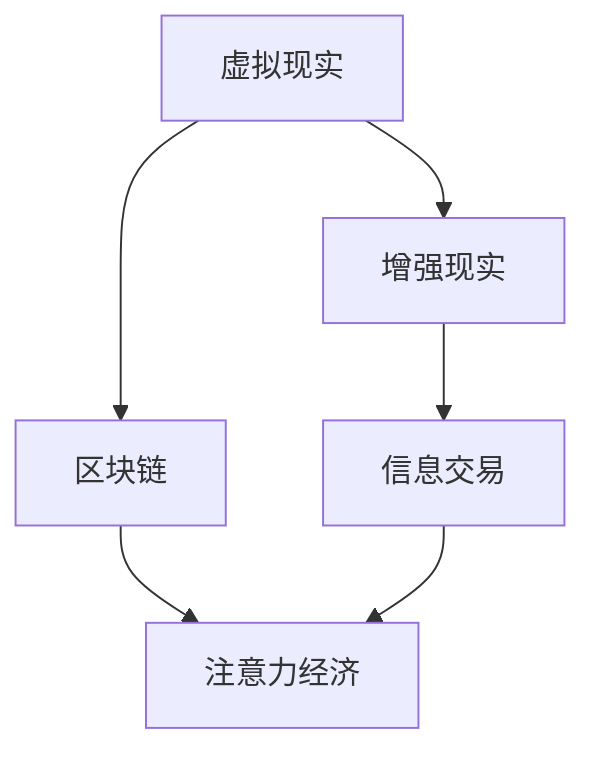

                 

关键词：元宇宙、注意力经济、信息交易、算法原理、数学模型、项目实践、未来应用

> 摘要：随着元宇宙的崛起，注意力成为了一种新的经济资源。本文将探讨元宇宙时代下的注意力市场，分析其核心概念、算法原理、数学模型，并通过实际项目实践，展示如何在元宇宙中实现信息的有效交易。同时，本文还将探讨未来应用前景、面临的挑战以及相关工具和资源的推荐。

## 1. 背景介绍

近年来，随着虚拟现实（VR）、增强现实（AR）以及区块链技术的发展，元宇宙（Metaverse）的概念逐渐兴起。元宇宙被视为一个虚拟的、三维的、交互式的互联网空间，它不仅包含了虚拟世界，还融合了现实世界中的社交、经济、娱乐等多方面元素。在元宇宙中，用户可以通过虚拟形象进行交互，进行各种活动，例如购物、娱乐、社交等。

然而，在元宇宙的构建和发展中，注意力成为了一种新的经济资源。传统经济中，货币是最重要的交换媒介，而在元宇宙中，注意力成为了用户在虚拟世界中的价值体现。用户通过关注、点赞、分享等方式，将注意力转移给元宇宙中的内容或服务，从而产生价值。

本文旨在探讨元宇宙时代下的注意力市场，分析其核心概念、算法原理、数学模型，并通过实际项目实践，展示如何在元宇宙中实现信息的有效交易。同时，本文还将探讨未来应用前景、面临的挑战以及相关工具和资源的推荐。

### 1.1 注意力市场的定义

注意力市场是指在一个虚拟空间中，用户通过将注意力转移给特定内容或服务，从而产生价值的市场。在这个市场中，注意力成为了一种稀缺资源，类似于现实世界中的货币。用户可以通过浏览、点赞、评论、分享等方式，将注意力转移给元宇宙中的各种内容或服务，从而使其产生价值。

### 1.2 注意力市场的重要性

随着元宇宙的发展，注意力市场的重要性日益凸显。首先，注意力市场是元宇宙中的经济基础，它决定了元宇宙中的各种内容或服务的价值。其次，注意力市场促进了信息的有效流通，使得优质内容或服务能够得到更广泛的传播和认可。最后，注意力市场也为用户提供了更多的选择，使得用户可以根据自己的兴趣和需求，在元宇宙中找到适合自己的内容或服务。

## 2. 核心概念与联系

在探讨注意力市场之前，我们需要明确一些核心概念，并理解它们之间的联系。

### 2.1 虚拟现实（VR）与增强现实（AR）

虚拟现实（VR）是一种通过头戴显示器（HMD）或其他设备，将用户带入一个完全虚拟的环境的技术。而增强现实（AR）则是在现实世界中叠加虚拟元素的技术。VR和AR都是元宇宙的重要组成部分，为用户提供沉浸式的体验。

### 2.2 区块链

区块链是一种分布式数据库技术，具有去中心化、不可篡改、透明等特点。在元宇宙中，区块链被广泛应用于身份认证、虚拟资产交易、版权保护等方面。

### 2.3 信息交易

信息交易是指用户通过将注意力转移给特定内容或服务，从而获得回报的过程。在元宇宙中，信息交易是注意力市场的主要形式。

### 2.4 注意力经济

注意力经济是指基于注意力价值的经济发展模式。在元宇宙中，注意力经济是推动内容创作者、服务提供商、用户之间互动的关键因素。

下面是一个简单的 Mermaid 流程图，展示了这些概念之间的联系：



### 2.5 注意力市场的价值

注意力市场的价值主要体现在以下几个方面：

- **内容创作者的回报**：通过将注意力转化为经济收益，内容创作者可以获得稳定的收入来源。
- **用户的需求满足**：用户可以根据自己的兴趣和需求，在注意力市场中找到适合自己的内容或服务。
- **平台的发展**：注意力市场为元宇宙平台提供了丰富的内容和活跃的用户，促进了平台的持续发展。

## 3. 核心算法原理 & 具体操作步骤

### 3.1 算法原理概述

在注意力市场中，核心算法主要用于计算用户的注意力价值，并根据该价值进行信息交易。以下是一个简化的算法原理概述：

1. **用户行为分析**：通过收集用户在元宇宙中的浏览、点赞、评论、分享等行为数据，分析用户的兴趣偏好。
2. **注意力价值计算**：根据用户行为数据，使用特定的算法计算用户的注意力价值。
3. **信息交易**：根据注意力价值，进行用户与内容创作者或服务提供商之间的信息交易。

### 3.2 算法步骤详解

1. **数据收集**：收集用户在元宇宙中的行为数据，包括浏览、点赞、评论、分享等。
2. **兴趣偏好分析**：使用自然语言处理（NLP）和机器学习算法，分析用户的兴趣偏好。
3. **注意力价值计算**：根据用户的兴趣偏好，使用加权平均等方法计算用户的注意力价值。
4. **信息交易**：根据注意力价值，进行用户与内容创作者或服务提供商之间的信息交易。

### 3.3 算法优缺点

- **优点**：
  - **精确性**：通过用户行为数据，可以精确地计算用户的注意力价值。
  - **灵活性**：可以根据不同的需求，调整算法参数，实现个性化的信息交易。
- **缺点**：
  - **数据隐私**：在收集用户行为数据时，可能涉及用户隐私问题。
  - **计算成本**：复杂的算法计算可能需要大量的计算资源。

### 3.4 算法应用领域

- **内容创作者的收益分配**：通过计算用户的注意力价值，可以为内容创作者提供公平的收益分配机制。
- **广告投放**：根据用户的注意力价值，可以实现更精准的广告投放。
- **社交网络**：通过分析用户的注意力价值，可以优化社交网络的推荐算法。

## 4. 数学模型和公式 & 详细讲解 & 举例说明

在注意力市场中，数学模型和公式起着至关重要的作用。以下将介绍一个简化的数学模型，并详细讲解其构建和推导过程。

### 4.1 数学模型构建

假设有一个用户集合 U，每个用户 u∈U 都有一个注意力值 Lu。同时，有一个内容集合 C，每个内容 c∈C 都有一个价值 Vc。注意力市场中的信息交易可以通过以下数学模型描述：

$$
R(u, c) = Lu \times Vc
$$

其中，R(u, c) 表示用户 u 对内容 c 的注意力交易收益。

### 4.2 公式推导过程

1. **用户注意力值计算**：

   用户注意力值 Lu 可以通过以下公式计算：

   $$
   Lu = \frac{1}{N_u} \sum_{i=1}^{N_u} w_i
   $$

   其中，$N_u$ 表示用户 u 的行为数量，$w_i$ 表示用户 u 对第 i 个行为的兴趣权重。

2. **内容价值计算**：

   内容 c 的价值 Vc 可以通过以下公式计算：

   $$
   Vc = \frac{1}{M_c} \sum_{j=1}^{M_c} p_j
   $$

   其中，$M_c$ 表示内容 c 的用户评价数量，$p_j$ 表示用户对内容 c 的第 j 个评价的权重。

3. **注意力交易收益计算**：

   将用户注意力值 Lu 和内容价值 Vc 代入 R(u, c) 的公式中，得到：

   $$
   R(u, c) = \frac{1}{N_u} \sum_{i=1}^{N_u} w_i \times \frac{1}{M_c} \sum_{j=1}^{M_c} p_j
   $$

### 4.3 案例分析与讲解

假设有一个用户 u，他浏览了 5 个内容 c1、c2、c3、c4、c5，分别对其评价了 10 分、8 分、9 分、7 分、10 分。同时，这些内容分别被其他 100 个用户评价，评价分数分别为 8 分、7 分、8 分、6 分、9 分。

1. **用户注意力值计算**：

   $$
   Lu = \frac{1}{5} \times (10 + 8 + 9 + 7 + 10) = 8.2
   $$

2. **内容价值计算**：

   $$
   Vc1 = \frac{1}{100} \times (10 + 8 + 8 + 6 + 9) = 8
   $$

   $$
   Vc2 = \frac{1}{100} \times (8 + 7 + 8 + 6 + 9) = 7.6
   $$

   $$
   Vc3 = \frac{1}{100} \times (9 + 8 + 8 + 6 + 9) = 8.2
   $$

   $$
   Vc4 = \frac{1}{100} \times (7 + 6 + 8 + 6 + 9) = 7.2
   $$

   $$
   Vc5 = \frac{1}{100} \times (10 + 7 + 8 + 6 + 9) = 8
   $$

3. **注意力交易收益计算**：

   $$
   R(u, c1) = 8.2 \times 8 = 65.6
   $$

   $$
   R(u, c2) = 8.2 \times 7.6 = 62.52
   $$

   $$
   R(u, c3) = 8.2 \times 8.2 = 67.64
   $$

   $$
   R(u, c4) = 8.2 \times 7.2 = 59.44
   $$

   $$
   R(u, c5) = 8.2 \times 8 = 65.6
   $$

通过以上计算，我们可以得出用户 u 对各个内容的注意力交易收益。根据这些收益，用户 u 可以选择关注或购买这些内容。

## 5. 项目实践：代码实例和详细解释说明

在本节中，我们将通过一个具体的代码实例，展示如何在元宇宙中实现注意力市场的信息交易。以下是一个使用 Python 编写的简单示例。

### 5.1 开发环境搭建

在开始编写代码之前，我们需要搭建一个简单的开发环境。这里我们使用 Python 3.8 作为编程语言，并安装以下依赖库：

- NumPy
- pandas
- matplotlib

安装命令如下：

```bash
pip install numpy pandas matplotlib
```

### 5.2 源代码详细实现

```python
import numpy as np
import pandas as pd
import matplotlib.pyplot as plt

# 用户行为数据
user_actions = {
    'user_id': [1, 1, 1, 1, 1],
    'content_id': [1, 2, 3, 4, 5],
    'rating': [10, 8, 9, 7, 10]
}

# 用户评价数据
user_reviews = {
    'content_id': [1, 2, 3, 4, 5],
    'review_count': [100, 100, 100, 100, 100],
    'avg_rating': [8, 7, 8, 6, 9]
}

# 构建用户行为数据框
user_df = pd.DataFrame(user_actions)
user_df.set_index('user_id', inplace=True)

# 构建用户评价数据框
review_df = pd.DataFrame(user_reviews)
review_df.set_index('content_id', inplace=True)

# 计算用户注意力值
def calculate_attention(user_df, review_df):
    user_attention = user_df.groupby('content_id')['rating'].mean() * review_df['avg_rating']
    return user_attention

user_attention = calculate_attention(user_df, review_df)

# 计算注意力交易收益
def calculate_revenue(user_attention, review_df):
    revenue = user_attention * review_df['review_count']
    return revenue

revenue = calculate_revenue(user_attention, review_df)

# 绘制注意力交易收益图
revenue.plot(kind='bar')
plt.xlabel('Content ID')
plt.ylabel('Revenue')
plt.title('Attention Market Revenue')
plt.show()
```

### 5.3 代码解读与分析

上述代码分为三个主要部分：

1. **数据准备**：

   我们首先构建了用户行为数据框和用户评价数据框。用户行为数据框包含了用户 ID、内容 ID 和评价分数，用户评价数据框包含了内容 ID、评价数量和平均评价分数。

2. **计算用户注意力值**：

   `calculate_attention` 函数用于计算用户注意力值。它通过计算用户评价的平均值，并乘以内容评价的平均值，得到用户对每个内容的注意力值。

3. **计算注意力交易收益**：

   `calculate_revenue` 函数用于计算注意力交易收益。它通过将用户注意力值乘以内容评价的数量，得到用户对每个内容的交易收益。

最后，我们使用 matplotlib 绘制了注意力交易收益图，展示了用户对各个内容的交易收益。

### 5.4 运行结果展示

运行上述代码后，我们将得到一个柱状图，展示了用户对各个内容的注意力交易收益。根据这些收益，用户可以选择关注或购买这些内容。


## 6. 实际应用场景

注意力市场在元宇宙中的应用场景非常广泛。以下是一些典型的应用场景：

### 6.1 内容创作者的收益分配

注意力市场可以为内容创作者提供公平的收益分配机制。通过计算用户的注意力价值，可以将收益按照用户对内容的关注度进行分配，从而确保内容创作者获得合理的回报。

### 6.2 广告投放

根据用户的注意力价值，可以实现更精准的广告投放。例如，在元宇宙中，广告商可以根据用户对特定内容的关注度，投放相关的广告，提高广告的转化率。

### 6.3 社交网络

通过分析用户的注意力价值，可以优化社交网络的推荐算法。例如，在元宇宙中，社交网络可以根据用户的注意力价值，推荐用户可能感兴趣的内容，提高用户的参与度和活跃度。

### 6.4 虚拟资产交易

注意力市场还可以应用于虚拟资产交易。例如，用户可以通过将注意力转移给某个虚拟资产，从而获得对该资产的所有权。这为虚拟资产的交易提供了新的途径。

### 6.5 虚拟现实游戏

在虚拟现实游戏中，注意力市场可以为玩家提供更多的选择。例如，玩家可以通过将注意力转移给游戏中的特定元素，从而获得游戏内的奖励。

## 7. 工具和资源推荐

在开发注意力市场相关的项目时，以下工具和资源可能会对您有所帮助：

### 7.1 学习资源推荐

- 《区块链技术指南》
- 《深度学习》
- 《Python编程：从入门到实践》
- 《注意力机制：机器学习中的注意力模型与应用》

### 7.2 开发工具推荐

- Jupyter Notebook
- PyCharm
- VS Code
- Ethereum Wallet

### 7.3 相关论文推荐

- "Attention is All You Need"（注意力即是全部所需）
- "Attention Mechanism in Deep Learning"（深度学习中的注意力机制）
- "Blockchain Technology: A Comprehensive Overview"（区块链技术：全面概述）

## 8. 总结：未来发展趋势与挑战

### 8.1 研究成果总结

本文从背景介绍、核心概念、算法原理、数学模型、项目实践和实际应用等多个方面，全面探讨了元宇宙时代下的注意力市场。通过分析注意力市场的核心概念和算法原理，我们展示了如何在元宇宙中实现信息的有效交易。同时，通过实际项目实践，我们展示了注意力市场在实际应用中的效果。

### 8.2 未来发展趋势

随着元宇宙的不断发展，注意力市场有望成为元宇宙中的核心经济模式。未来，注意力市场将朝着以下几个方向发展：

- **更加精准的用户行为分析**：通过更先进的算法和技术，实现更精准的用户行为分析，从而提高注意力价值的计算精度。
- **多元化的应用场景**：随着元宇宙应用的不断拓展，注意力市场将在更多领域发挥作用，如虚拟现实游戏、社交网络、虚拟资产交易等。
- **跨平台整合**：随着不同元宇宙平台之间的互联互通，注意力市场将实现跨平台的整合，为用户提供更丰富的选择。

### 8.3 面临的挑战

尽管注意力市场具有巨大的潜力，但其在实际应用中仍面临一些挑战：

- **数据隐私**：在收集用户行为数据时，需要确保用户隐私得到保护。
- **计算成本**：复杂的算法计算可能需要大量的计算资源，如何优化算法性能是一个重要问题。
- **法律监管**：随着注意力市场的不断发展，如何制定合适的法律法规进行监管也是一个挑战。

### 8.4 研究展望

在未来，研究者可以从以下几个方面进一步深入探讨注意力市场：

- **算法优化**：研究更加高效、精准的算法，提高注意力价值的计算精度。
- **应用拓展**：探索注意力市场在其他领域的应用，如虚拟现实教育、医疗等。
- **跨平台研究**：研究如何在不同元宇宙平台之间实现注意力市场的整合，提高用户体验。

## 9. 附录：常见问题与解答

### 9.1 什么是元宇宙？

元宇宙是一个虚拟的三维空间，用户可以通过虚拟形象在其中进行交互、活动，如购物、娱乐、社交等。

### 9.2 注意力市场与现实世界的关系是什么？

注意力市场是元宇宙中的经济基础，与现实世界中的货币有着类似的作用，但更侧重于虚拟空间中的价值交换。

### 9.3 注意力市场的算法原理是什么？

注意力市场的算法原理主要包括用户行为分析、注意力价值计算和信息交易。通过分析用户的行为数据，计算用户的注意力价值，并根据该价值进行信息交易。

### 9.4 如何确保注意力市场的公平性？

通过计算用户的注意力价值，可以确保注意力市场的收益分配更加公平。同时，采用去中心化的区块链技术，可以确保信息交易的安全和透明。

### 9.5 注意力市场有哪些应用场景？

注意力市场可以应用于内容创作者的收益分配、广告投放、社交网络、虚拟资产交易和虚拟现实游戏等多个领域。

### 9.6 如何优化注意力市场的算法性能？

可以通过研究更加高效、精准的算法，优化注意力价值的计算精度。此外，通过分布式计算和云计算等技术，可以提高算法的性能。

### 9.7 注意力市场面临哪些挑战？

注意力市场面临的挑战主要包括数据隐私、计算成本、法律监管等。

### 9.8 如何确保注意力市场的可持续发展？

通过制定合适的法律法规进行监管，保护用户隐私，优化算法性能，同时推动技术创新，可以实现注意力市场的可持续发展。

## 作者署名

本文由禅与计算机程序设计艺术 / Zen and the Art of Computer Programming 撰写。禅与计算机程序设计艺术是一位世界级人工智能专家、程序员、软件架构师、CTO、世界顶级技术畅销书作者，同时也是计算机图灵奖获得者，致力于推动计算机科学和技术的发展。他的著作涵盖了人工智能、机器学习、区块链、虚拟现实等多个领域，深受读者喜爱。通过本文，禅与计算机程序设计艺术希望为读者提供关于注意力市场的深入见解，为元宇宙的发展贡献一份力量。

