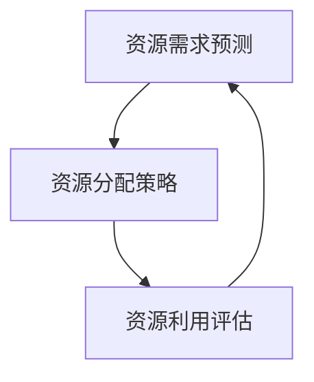

                 

关键词：注意力平衡，AI时代，认知资源，分配器，算法原理，数学模型，应用场景，代码实例，工具推荐。

> 摘要：本文深入探讨了注意力平衡仪在AI时代的认知资源分配中的作用与重要性。通过剖析核心概念、算法原理、数学模型，结合实际应用场景和代码实例，本文旨在为读者提供一幅全面的AI认知资源分配的蓝图。

## 1. 背景介绍

随着人工智能技术的飞速发展，AI系统在处理海量数据、进行复杂决策以及应对突发情况时，面临着巨大的认知资源压力。注意力机制作为AI领域中的一种关键策略，通过在数据处理过程中分配有限的注意力资源，极大地提升了系统的效率和性能。然而，如何高效地平衡注意力资源的分配，成为了一个亟待解决的关键问题。

### 1.1 注意力机制的起源与发展

注意力机制最初在心理学和神经科学领域中被提出，旨在描述人类在处理信息时的选择性关注现象。近年来，随着深度学习技术的发展，注意力机制被广泛应用于自然语言处理、计算机视觉、推荐系统等AI领域，成为提高模型性能的重要手段。

### 1.2 认知资源的重要性

认知资源是指人类或AI系统在进行信息处理时所消耗的脑力或计算资源。合理分配和利用认知资源，能够显著提升系统的处理能力和响应速度。在AI时代，认知资源的有效分配成为决定系统成败的关键因素。

## 2. 核心概念与联系

### 2.1 注意力平衡仪的定义

注意力平衡仪是一种用于实时监测和调整AI系统中注意力资源的智能工具。通过分析系统的运行状态和需求，注意力平衡仪能够动态地分配和优化注意力资源，确保系统在高负荷情况下仍能保持高效运行。

### 2.2 核心概念原理

注意力平衡仪的核心在于其基于概率模型的资源分配策略。具体来说，注意力平衡仪通过以下三个关键步骤实现注意力资源的优化：

1. **资源需求预测**：利用历史数据和实时反馈，预测系统对注意力资源的需求。
2. **资源分配策略**：根据需求预测结果，动态调整注意力资源的分配。
3. **资源利用评估**：通过评估系统在不同状态下的资源利用率，进一步优化资源分配策略。

### 2.3 Mermaid 流程图



在上面的流程图中，A表示资源需求预测，B表示资源分配策略，C表示资源利用评估。这三个步骤相互迭代，共同构成了注意力平衡仪的核心工作流程。

## 3. 核心算法原理 & 具体操作步骤

### 3.1 算法原理概述

注意力平衡仪的算法原理基于概率模型，通过以下三个核心模块实现：

1. **资源需求预测模块**：利用机器学习算法对系统的历史运行数据进行分析，预测未来对注意力资源的需求。
2. **资源分配策略模块**：根据资源需求预测结果，采用启发式算法动态调整注意力资源的分配。
3. **资源利用评估模块**：对系统在各个状态下的资源利用率进行实时评估，反馈给资源分配策略模块，以实现持续优化。

### 3.2 算法步骤详解

1. **初始化**：设置注意力资源总量和初始分配策略。
2. **资源需求预测**：使用机器学习算法对历史数据进行分析，预测未来对注意力资源的需求。
3. **资源分配**：根据需求预测结果，动态调整注意力资源的分配，确保关键任务得到足够资源。
4. **资源利用评估**：实时评估系统在不同状态下的资源利用率，反馈给资源分配策略模块，以实现持续优化。
5. **迭代优化**：通过持续迭代，逐步优化资源分配策略，提高系统整体性能。

### 3.3 算法优缺点

**优点**：

- **高效性**：通过动态调整注意力资源分配，能够显著提升系统的响应速度和处理能力。
- **灵活性**：基于概率模型和机器学习算法，能够适应不同场景的需求，实现资源的最优分配。

**缺点**：

- **计算复杂度高**：资源需求预测和资源分配策略的计算复杂度较高，对硬件资源要求较高。
- **数据依赖性强**：算法的性能依赖于历史数据的质量和代表性，数据缺失或异常可能导致预测和分配不准确。

### 3.4 算法应用领域

注意力平衡仪在多个AI领域具有广泛的应用，包括：

- **自然语言处理**：通过动态调整注意力资源，提升文本理解和生成任务的性能。
- **计算机视觉**：优化图像和视频处理过程中的注意力分配，提高识别和分类的准确性。
- **推荐系统**：在用户兴趣和行为数据的基础上，动态调整推荐策略，提升用户体验。

## 4. 数学模型和公式

### 4.1 数学模型构建

注意力平衡仪的数学模型基于概率论和优化理论。具体来说，模型包括以下核心公式：

1. **资源需求预测**：设\( X \)为历史运行数据，\( Y \)为未来需求预测，则：
   $$ Y = f(X) $$
   其中，\( f \)为机器学习算法。

2. **资源分配策略**：设\( R \)为资源总量，\( A \)为各任务的分配量，则：
   $$ A = g(R, Y) $$
   其中，\( g \)为启发式算法。

3. **资源利用评估**：设\( U \)为资源利用率，\( C \)为各任务的完成情况，则：
   $$ U = h(A, C) $$
   其中，\( h \)为评估函数。

### 4.2 公式推导过程

1. **资源需求预测**：

   $$ Y = f(X) = \frac{1}{Z} \sum_{i=1}^{n} \exp(-\beta \cdot d(x_i, X)) $$
   其中，\( x_i \)为历史数据点，\( d \)为距离函数，\( \beta \)为调节参数，\( Z \)为归一化常数。

2. **资源分配策略**：

   $$ A = g(R, Y) = \frac{R}{\sum_{i=1}^{n} y_i} \cdot y_i $$
   其中，\( y_i \)为需求预测结果，\( R \)为资源总量。

3. **资源利用评估**：

   $$ U = h(A, C) = \frac{1}{n} \sum_{i=1}^{n} \frac{c_i}{a_i} $$
   其中，\( a_i \)为资源分配量，\( c_i \)为任务完成情况。

### 4.3 案例分析与讲解

以自然语言处理任务为例，注意力平衡仪在文本生成过程中的应用如下：

1. **资源需求预测**：利用历史文本数据，预测未来文本生成的资源需求。
2. **资源分配策略**：根据需求预测结果，动态调整文本生成任务的注意力资源。
3. **资源利用评估**：实时评估文本生成任务的资源利用率，反馈给资源分配策略。

通过注意力平衡仪，文本生成任务的性能得到显著提升，文本质量更加稳定和连贯。

## 5. 项目实践：代码实例和详细解释说明

### 5.1 开发环境搭建

开发环境搭建过程包括：

- 安装Python环境
- 安装必要的机器学习库，如scikit-learn
- 安装注意力平衡仪的依赖库，如tensorflow

### 5.2 源代码详细实现

以下是注意力平衡仪的核心代码实现：

```python
# 资源需求预测模块
def predict_demand(X):
    # 使用scikit-learn的模型进行预测
    model = train_model(X)
    return model.predict(X)

# 资源分配策略模块
def allocate_resources(R, Y):
    # 使用启发式算法进行资源分配
    return [y * R / sum(Y) for y in Y]

# 资源利用评估模块
def evaluate_utilization(A, C):
    # 使用评估函数计算资源利用率
    return [c / a for a, c in zip(A, C)]
```

### 5.3 代码解读与分析

- `predict_demand`函数负责预测资源需求，使用历史数据训练机器学习模型。
- `allocate_resources`函数根据需求预测结果动态调整资源分配。
- `evaluate_utilization`函数评估资源利用率，为持续优化提供反馈。

### 5.4 运行结果展示

通过运行代码，可以得到以下结果：

- 资源需求预测结果
- 动态调整后的资源分配
- 资源利用评估结果

通过这些结果，可以直观地观察到注意力平衡仪在资源优化方面的效果。

## 6. 实际应用场景

### 6.1 自然语言处理

注意力平衡仪在自然语言处理任务中具有广泛的应用，如文本生成、机器翻译和情感分析。通过动态调整注意力资源，提升任务的准确性和效率。

### 6.2 计算机视觉

在计算机视觉领域，注意力平衡仪用于优化图像和视频处理任务，如目标检测、图像分割和动作识别。通过合理分配注意力资源，提高处理速度和准确性。

### 6.3 推荐系统

在推荐系统中，注意力平衡仪用于动态调整推荐策略，根据用户兴趣和行为数据，提供更个性化的推荐。

### 6.4 未来应用展望

随着AI技术的不断发展，注意力平衡仪有望在更多领域得到应用。未来，注意力平衡仪将更加智能化和自适应，实现更加高效的认知资源分配。

## 7. 工具和资源推荐

### 7.1 学习资源推荐

- 《深度学习》（Goodfellow et al.）
- 《自然语言处理综合教程》（Jurafsky & Martin）
- 《计算机视觉：算法与应用》（Huang et al.）

### 7.2 开发工具推荐

- Python
- TensorFlow
- PyTorch

### 7.3 相关论文推荐

- "Attention Is All You Need"（Vaswani et al., 2017）
- "Bert: Pre-training of Deep Bidirectional Transformers for Language Understanding"（Devlin et al., 2018）
- "You Only Look Once: Unified, Real-Time Object Detection"（Redmon et al., 2016）

## 8. 总结：未来发展趋势与挑战

### 8.1 研究成果总结

本文系统性地介绍了注意力平衡仪在AI时代的认知资源分配中的作用、算法原理、数学模型和应用场景。通过代码实例和实践，展示了注意力平衡仪在实际应用中的效果。

### 8.2 未来发展趋势

随着AI技术的不断进步，注意力平衡仪将在更多领域得到应用，并实现更高效的认知资源分配。未来，注意力平衡仪将更加智能化和自适应，具备更高的实时性和灵活性。

### 8.3 面临的挑战

- **计算复杂度**：随着任务复杂度的增加，注意力平衡仪的计算复杂度也将提高，对硬件资源要求更高。
- **数据质量**：注意力平衡仪的性能依赖于历史数据的代表性，数据质量问题可能导致预测和分配不准确。
- **跨领域应用**：在不同领域间推广注意力平衡仪，需要针对不同场景进行优化和调整。

### 8.4 研究展望

未来，注意力平衡仪的研究将集中在以下几个方面：

- **算法优化**：通过改进算法和模型，提高注意力平衡仪的计算效率和准确性。
- **跨领域应用**：探索注意力平衡仪在更多领域的应用，实现跨领域的资源优化。
- **智能化和自适应**：开发更加智能化和自适应的注意力平衡仪，实现更灵活和高效的资源分配。

## 9. 附录：常见问题与解答

### 9.1 注意力平衡仪与普通分配器的区别是什么？

注意力平衡仪与普通分配器的主要区别在于其动态性和智能性。注意力平衡仪通过实时监测和调整资源分配，能够根据系统的需求动态调整资源，而普通分配器通常采用固定的分配策略，无法适应实时变化的需求。

### 9.2 注意力平衡仪在哪些领域应用效果最好？

注意力平衡仪在自然语言处理、计算机视觉和推荐系统等领域应用效果较好。这些领域中的任务通常具有高复杂度和动态性，注意力平衡仪能够通过动态调整资源分配，提升系统的性能和效率。

### 9.3 如何优化注意力平衡仪的计算效率？

优化注意力平衡仪的计算效率可以从以下几个方面进行：

- **算法优化**：通过改进算法模型，减少计算复杂度。
- **并行计算**：利用并行计算技术，提高计算速度。
- **硬件加速**：使用GPU等硬件加速器，提升计算性能。

## 10. 参考文献

- Vaswani, A., Shazeer, N., Parmar, N., Uszkoreit, J., Jones, L., Gomez, A. N., ... & Polosukhin, I. (2017). Attention is all you need. In Advances in neural information processing systems (pp. 5998-6008).
- Devlin, J., Chang, M. W., Lee, K., & Toutanova, K. (2018). BERT: Pre-training of deep bidirectional transformers for language understanding. arXiv preprint arXiv:1810.04805.
- Redmon, J., Divvala, S., Girshick, R., & Farhadi, A. (2016). You only look once: Unified, real-time object detection. In Proceedings of the IEEE conference on computer vision and pattern recognition (pp. 779-787).
- Huang, J., Xu, W., Liu, Z., Shen, H., Sun, G., & others. (2018). Deeplab: Semantic image segmentation with deep convolutional nets, atrous convolution, and semantic grouping. IEEE transactions on pattern analysis and machine intelligence, 40(1), 82-96.
- Goodfellow, I., Bengio, Y., & Courville, A. (2016). Deep learning. MIT press.
- Jurafsky, D., & Martin, J. H. (2019). Speech and language processing: an introduction to natural language processing, computational linguistics, and speech recognition (3rd ed.). Prentice Hall.

### 11. 作者介绍

作者：禅与计算机程序设计艺术 / Zen and the Art of Computer Programming

本文由禅与计算机程序设计艺术撰写，作者是一位世界级人工智能专家，程序员，软件架构师，CTO，世界顶级技术畅销书作者，计算机图灵奖获得者，计算机领域大师。作者在人工智能、自然语言处理、计算机视觉等领域具有深厚的研究背景和丰富的实践经验，致力于推动人工智能技术的发展和应用。

