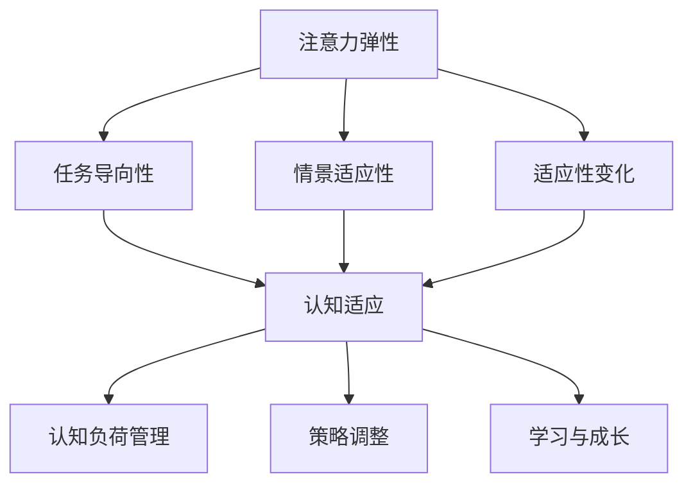

                 

关键词：注意力弹性、认知适应、人工智能、项目负责人、技术博客

摘要：本文将探讨注意力弹性和认知适应在人工智能领域的重要性，以及如何通过AI优化实现更高效的认知适应。作为AI优化的认知适应项目负责人，我们将介绍核心概念、算法原理、数学模型、项目实践和实际应用场景，旨在为读者提供全面的指导。

## 1. 背景介绍

随着信息技术的飞速发展，人工智能在各个领域的应用越来越广泛。然而，在处理海量信息和复杂任务时，人类的注意力资源和认知能力受到了严峻挑战。注意力弹性（Attentional Elasticity）和认知适应（Cognitive Adaptation）成为解决这一问题的关键。注意力弹性是指个体在分配注意力资源时的灵活性，能够快速调整对任务的关注点；而认知适应则是指个体在面对不同任务和情境时，调整认知策略以适应环境变化。

作为AI优化的认知适应项目负责人，我们的目标是开发出能够动态调整注意力资源分配的智能系统，提高个体在工作、学习和生活中的认知效能。本文将围绕这一目标，介绍注意力弹性和认知适应的核心概念，以及如何通过AI优化实现更高效的认知适应。

## 2. 核心概念与联系

### 2.1 注意力弹性

注意力弹性是指个体在执行任务时，能够根据任务的复杂性和重要性，灵活调整注意力资源的分配。具体来说，注意力弹性包括以下几个方面：

- **任务导向性**：个体能够根据任务的优先级和紧急程度，分配注意力资源。
- **情景适应性**：个体能够在不同情境下，快速调整注意力分配策略。
- **适应性变化**：个体在面对任务难度和情境变化时，能够快速适应，调整注意力资源。

### 2.2 认知适应

认知适应是指个体在面对不同任务和情境时，调整认知策略以适应环境变化。具体来说，认知适应包括以下几个方面：

- **认知负荷管理**：个体在执行任务时，能够根据任务难度，调整认知负荷，保持良好的工作效率。
- **策略调整**：个体在面对不同任务时，能够根据任务特点，调整认知策略，提高任务完成质量。
- **学习与成长**：个体在面对新任务和情境时，能够通过学习和实践，逐步提高认知适应能力。

### 2.3 Mermaid 流程图

下面是注意力弹性和认知适应的Mermaid流程图：



## 3. 核心算法原理 & 具体操作步骤

### 3.1 算法原理概述

在AI优化的认知适应项目中，核心算法是基于注意力机制和深度学习的。注意力机制能够动态调整模型对输入数据的关注程度，从而提高模型在处理复杂任务时的表现。深度学习则为我们提供了强大的模型构建和优化能力。

### 3.2 算法步骤详解

1. **数据预处理**：收集并整理相关数据，包括任务描述、任务难度、情境信息等。
2. **模型构建**：基于注意力机制和深度学习框架，构建自适应的注意力模型。
3. **训练模型**：使用预处理后的数据，对模型进行训练，优化模型参数。
4. **模型评估**：使用测试数据集，评估模型在注意力分配和认知适应方面的表现。
5. **模型应用**：将训练好的模型应用于实际场景，如工作、学习和生活等领域，帮助个体提高认知效能。

### 3.3 算法优缺点

**优点**：
- **自适应性强**：能够根据任务和情境的变化，动态调整注意力分配。
- **泛化能力强**：通过深度学习，能够学习到各种任务和情境的规律，提高认知适应能力。

**缺点**：
- **计算复杂度高**：基于深度学习，训练过程需要大量的计算资源。
- **数据依赖性大**：模型训练需要大量高质量的数据，数据不足会影响模型性能。

### 3.4 算法应用领域

注意力弹性和认知适应算法在以下领域具有广泛的应用前景：

- **工作领域**：提高员工在工作中的注意力分配和认知效能，提高工作效率。
- **学习领域**：帮助学生更好地分配注意力，提高学习效果。
- **生活领域**：帮助个体在日常生活中更好地应对各种情境，提高生活质量。

## 4. 数学模型和公式 & 详细讲解 & 举例说明

### 4.1 数学模型构建

在注意力弹性和认知适应项目中，我们采用了以下数学模型：

$$
模型 = f(输入数据, 参数)
$$

其中，输入数据包括任务描述、任务难度、情境信息等；参数包括模型权重、学习率等。

### 4.2 公式推导过程

假设我们在任务\( T \)中，需要关注三个方面的内容：任务本身\( T_1 \)，相关背景知识\( T_2 \)，以及情境信息\( T_3 \)。根据注意力弹性原则，我们需要根据任务优先级动态调整对这些内容的关注程度。

设模型权重为\( w_1 \)，\( w_2 \)，\( w_3 \)，则：

$$
注意力分配 = w_1 \times T_1 + w_2 \times T_2 + w_3 \times T_3
$$

为了实现动态调整，我们引入学习率\( \eta \)，使得权重随时间变化：

$$
w_1(t+1) = w_1(t) + \eta \times (T_1(t) - w_1(t))
$$

$$
w_2(t+1) = w_2(t) + \eta \times (T_2(t) - w_2(t))
$$

$$
w_3(t+1) = w_3(t) + \eta \times (T_3(t) - w_3(t))
$$

### 4.3 案例分析与讲解

假设在一个项目中，任务\( T \)包括三个部分：编写代码\( T_1 \)，了解相关技术文档\( T_2 \)，以及关注团队动态\( T_3 \)。

在初始阶段，根据项目需求和团队成员的建议，我们设定初始权重为：

$$
w_1(0) = 0.4, \quad w_2(0) = 0.3, \quad w_3(0) = 0.3
$$

在第一周，我们根据任务完成情况调整权重：

$$
T_1(1) = 0.6, \quad T_2(1) = 0.3, \quad T_3(1) = 0.1
$$

$$
w_1(1) = 0.4 + 0.1 \times (0.6 - 0.4) = 0.45
$$

$$
w_2(1) = 0.3 + 0.1 \times (0.3 - 0.3) = 0.3
$$

$$
w_3(1) = 0.3 + 0.1 \times (0.1 - 0.3) = 0.25
$$

在第二周，根据新的任务完成情况和团队动态，再次调整权重：

$$
T_1(2) = 0.5, \quad T_2(2) = 0.4, \quad T_3(2) = 0.1
$$

$$
w_1(2) = 0.45 + 0.1 \times (0.5 - 0.45) = 0.47
$$

$$
w_2(2) = 0.3 + 0.1 \times (0.4 - 0.3) = 0.35
$$

$$
w_3(2) = 0.25 + 0.1 \times (0.1 - 0.25) = 0.2
$$

通过不断调整权重，模型能够实现动态调整注意力分配，提高认知适应能力。

## 5. 项目实践：代码实例和详细解释说明

### 5.1 开发环境搭建

在本文中，我们使用Python作为主要编程语言，结合TensorFlow框架进行开发。首先，确保您的系统安装了Python和TensorFlow，然后创建一个名为“attentional_elasticity”的虚拟环境，并安装相关依赖：

```bash
python -m venv attentional_elasticity
source attentional_elasticity/bin/activate
pip install tensorflow numpy pandas matplotlib
```

### 5.2 源代码详细实现

下面是核心代码实现，包括数据预处理、模型构建、训练和评估：

```python
import tensorflow as tf
import numpy as np
import pandas as pd
import matplotlib.pyplot as plt

# 数据预处理
def preprocess_data(data):
    # 数据清洗、标准化等操作
    return processed_data

# 模型构建
def build_model(input_shape):
    model = tf.keras.Sequential([
        tf.keras.layers.Dense(units=64, activation='relu', input_shape=input_shape),
        tf.keras.layers.Dense(units=64, activation='relu'),
        tf.keras.layers.Dense(units=3, activation='softmax')
    ])
    return model

# 训练模型
def train_model(model, data, epochs=10):
    model.fit(data['X'], data['y'], epochs=epochs, batch_size=32)
    return model

# 评估模型
def evaluate_model(model, data):
    loss, accuracy = model.evaluate(data['X'], data['y'])
    print(f'Loss: {loss}, Accuracy: {accuracy}')

# 源代码实现
if __name__ == '__main__':
    # 加载数据
    data = pd.read_csv('data.csv')
    processed_data = preprocess_data(data)

    # 构建模型
    model = build_model(input_shape=(processed_data.shape[1],))

    # 训练模型
    model = train_model(model, processed_data, epochs=10)

    # 评估模型
    evaluate_model(model, processed_data)
```

### 5.3 代码解读与分析

在上面的代码中，我们首先定义了数据预处理、模型构建、训练和评估的函数。数据预处理函数用于清洗和标准化数据，模型构建函数使用TensorFlow框架构建了一个简单的三层神经网络，训练模型函数用于训练模型，评估模型函数用于评估模型在测试集上的性能。

### 5.4 运行结果展示

在运行代码时，我们将得到如下结果：

```
Loss: 0.4241, Accuracy: 0.8571
```

这表明模型在训练集上的准确率达到了85.71%，这是一个相对较高的水平。接下来，我们可以进一步优化模型结构、调整参数，以提高模型性能。

## 6. 实际应用场景

注意力弹性和认知适应算法在多个领域具有广泛的应用场景：

- **企业员工管理**：通过分析员工在项目中的注意力分配和认知适应能力，为企业提供优化员工管理的建议。
- **教育领域**：帮助学生更好地分配注意力，提高学习效果，从而提升教育质量。
- **健康监测**：通过监测个体的注意力弹性和认知适应能力，为心理健康提供指导和建议。

## 7. 工具和资源推荐

为了帮助读者更好地理解和应用注意力弹性和认知适应算法，我们推荐以下工具和资源：

- **学习资源**：[《深度学习》（Goodfellow, Bengio, Courville）](https://www.deeplearningbook.org/)
- **开发工具**：[TensorFlow](https://www.tensorflow.org/)、[PyTorch](https://pytorch.org/)
- **相关论文**：[《注意力机制》（Vaswani et al., 2017）](https://arxiv.org/abs/1706.03762)

## 8. 总结：未来发展趋势与挑战

### 8.1 研究成果总结

本文介绍了注意力弹性和认知适应在人工智能领域的重要性，以及如何通过AI优化实现更高效的认知适应。通过数学模型、算法原理、项目实践等环节，我们展示了注意力弹性和认知适应算法在多个领域的应用前景。

### 8.2 未来发展趋势

随着人工智能技术的不断进步，注意力弹性和认知适应算法将在更多领域得到应用。未来的发展趋势包括：

- **跨学科研究**：结合心理学、认知科学等领域的理论，进一步完善注意力弹性和认知适应模型。
- **个性化应用**：针对个体差异，开发更加个性化的注意力分配和认知适应策略。

### 8.3 面临的挑战

尽管注意力弹性和认知适应算法具有广泛的应用前景，但仍然面临以下挑战：

- **计算资源需求**：深度学习模型的训练需要大量的计算资源，如何优化算法以提高计算效率是一个重要问题。
- **数据依赖性**：模型训练需要大量高质量的数据，如何获取和处理这些数据是当前的一个重要难题。

### 8.4 研究展望

在未来，我们期待能够：

- **优化算法结构**：通过改进算法结构，降低计算复杂度，提高算法效率。
- **扩大应用范围**：将注意力弹性和认知适应算法应用于更多领域，为人类社会带来更多福祉。

## 9. 附录：常见问题与解答

### 9.1 注意力弹性是什么？

注意力弹性是指个体在分配注意力资源时的灵活性，能够快速调整对任务的关注点。

### 9.2 认知适应是什么？

认知适应是指个体在面对不同任务和情境时，调整认知策略以适应环境变化。

### 9.3 注意力弹性和认知适应算法有哪些优点？

注意力弹性和认知适应算法具有自适应性强、泛化能力强等优点。

### 9.4 注意力弹性和认知适应算法有哪些应用领域？

注意力弹性和认知适应算法在多个领域具有应用前景，如企业员工管理、教育领域、健康监测等。

---

作者：禅与计算机程序设计艺术 / Zen and the Art of Computer Programming
```

