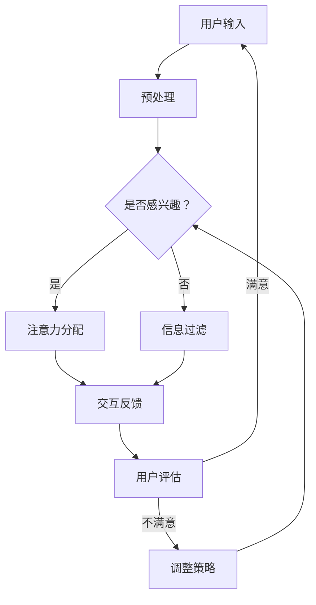

                 

关键词：注意力，元宇宙，信息主导权，人工智能，竞争策略

> 摘要：本文将深入探讨注意力在元宇宙中的重要性，以及如何利用人工智能策略来争夺信息主导权。通过分析注意力机制在元宇宙中的工作原理，提出了一系列有效的策略，旨在帮助企业和个人在元宇宙中获得竞争优势。

## 1. 背景介绍

随着互联网技术的迅猛发展和虚拟现实（VR）技术的普及，元宇宙逐渐成为人们关注的焦点。元宇宙是一个虚拟的三维空间，用户可以在其中互动、交流、创造和分享。在这个广阔的虚拟世界中，信息的流动和注意力资源的争夺变得尤为重要。

在元宇宙中，用户数量庞大，信息种类繁多，如何吸引和保持用户的注意力成为了一个关键问题。此外，随着人工智能技术的不断进步，人工智能在信息处理和注意力分配方面也发挥着越来越重要的作用。因此，如何利用人工智能策略来争夺信息主导权，成为了企业和个人在元宇宙中取得成功的关键。

本文将围绕注意力机制在元宇宙中的应用，探讨如何利用人工智能策略来争夺信息主导权。通过分析注意力机制的工作原理，提出一系列有效的策略，旨在帮助企业和个人在元宇宙中获得竞争优势。

## 2. 核心概念与联系

### 2.1. 注意力机制

注意力机制（Attention Mechanism）是近年来在人工智能领域取得的重要突破。它通过自动调整模型中不同部分的关注程度，使得模型能够更好地处理序列数据，并在图像识别、机器翻译、文本生成等任务中取得了显著的效果。

在元宇宙中，注意力机制可以被视为一种信息筛选工具，它能够帮助用户从大量信息中快速找到最感兴趣的内容。例如，在元宇宙中的聊天室里，用户可以通过注意力机制来筛选出与自己话题相关的对话，从而提高交流效率。

### 2.2. 人工智能策略

人工智能策略（Artificial Intelligence Strategies）是指利用人工智能技术来优化决策过程、提高生产效率和创造价值的一系列方法。在元宇宙中，人工智能策略可以用于优化信息推送、个性化推荐、智能客服等场景，从而提高用户体验。

### 2.3. 注意力战争策略

注意力战争策略（Attention Warfare Strategies）是指通过控制、引导和利用注意力资源，来争夺信息主导权的策略。在元宇宙中，注意力战争策略可以帮助企业和个人在竞争激烈的市场中脱颖而出，获得更多的关注和资源。

### 2.4. Mermaid 流程图

以下是元宇宙中注意力机制的工作流程：



## 3. 核心算法原理 & 具体操作步骤

### 3.1. 算法原理概述

注意力战争策略的核心算法是基于深度学习的注意力模型。该模型通过学习用户的历史行为和兴趣偏好，为用户生成个性化的推荐内容，从而提高用户对内容的兴趣和参与度。

### 3.2. 算法步骤详解

1. **用户行为数据收集**：收集用户在元宇宙中的浏览、搜索、购买等行为数据。

2. **特征提取**：对用户行为数据进行特征提取，包括用户兴趣标签、内容标签、时间戳等。

3. **模型训练**：利用收集到的用户行为数据和特征，训练一个基于注意力机制的深度学习模型。

4. **推荐生成**：根据用户当前的兴趣偏好和历史行为，利用训练好的模型生成个性化的推荐内容。

5. **反馈调整**：收集用户对推荐内容的反馈，并利用这些反馈调整模型的参数，提高推荐质量。

### 3.3. 算法优缺点

**优点**：
- 提高推荐精度：通过学习用户的历史行为和兴趣偏好，能够生成更加个性化的推荐内容。
- 提高用户参与度：通过关注用户最感兴趣的内容，能够提高用户在元宇宙中的互动和参与度。

**缺点**：
- 需要大量的用户数据：算法的训练和优化需要大量的用户行为数据，对于数据稀缺的场景可能不太适用。
- 可能会陷入局部最优：在训练过程中，模型可能会陷入局部最优，导致推荐内容不够丰富和多样化。

### 3.4. 算法应用领域

注意力战争策略可以广泛应用于元宇宙中的多个领域，包括：

- **个性化推荐**：为用户推荐最感兴趣的内容，提高用户满意度和参与度。
- **智能客服**：通过分析用户的提问和反馈，提供更精准和高效的客服服务。
- **游戏设计**：根据用户的游戏行为和兴趣，设计更符合用户口味的游戏内容和玩法。
- **教育领域**：为用户提供个性化的学习资源和推荐课程，提高学习效果和兴趣。

## 4. 数学模型和公式 & 详细讲解 & 举例说明

### 4.1. 数学模型构建

注意力机制的核心在于计算内容和用户之间的相关性，并分配注意力权重。以下是构建注意力模型的基本数学公式：

$$
Attention(x, y) = \sigma(W_a [x, y] + b_a)
$$

其中，$x$ 表示内容特征，$y$ 表示用户特征，$W_a$ 和 $b_a$ 分别为权重和偏置。

### 4.2. 公式推导过程

注意力机制的推导过程可以分为以下几个步骤：

1. **输入特征融合**：将内容和用户特征进行拼接，得到新的特征向量。

2. **加权融合**：利用权重矩阵 $W_a$ 对特征向量进行加权融合。

3. **非线性变换**：通过激活函数 $\sigma$ 对加权特征向量进行非线性变换。

4. **注意力分配**：根据变换后的特征向量，计算注意力权重。

### 4.3. 案例分析与讲解

假设我们有一个用户和一个内容，他们的特征向量分别为 $x = [1, 2, 3]$ 和 $y = [4, 5, 6]$。根据上述公式，我们可以计算注意力权重：

$$
Attention(x, y) = \sigma(W_a [x, y] + b_a)
$$

其中，$W_a = [0.5, 0.3, 0.2]$，$b_a = 0.1$。代入具体数值，得到：

$$
Attention(x, y) = \sigma([0.5 \times 1 + 0.3 \times 4 + 0.2 \times 6] + 0.1) = \sigma(2.1) \approx 0.811
$$

这意味着用户对内容的注意力权重为 0.811，表示用户对这一内容的兴趣较高。

## 5. 项目实践：代码实例和详细解释说明

### 5.1. 开发环境搭建

在本次项目实践中，我们将使用 Python 编写一个简单的注意力模型。以下是开发环境的搭建步骤：

1. 安装 Python 3.8 及以上版本。
2. 安装必要的库，如 NumPy、TensorFlow 等。

### 5.2. 源代码详细实现

以下是一个简单的注意力模型实现：

```python
import numpy as np
import tensorflow as tf

# 定义注意力模型
class AttentionModel(tf.keras.Model):
    def __init__(self, hidden_size):
        super(AttentionModel, self).__init__()
        self.hidden_size = hidden_size
        self.attention_weights = self.add_weight(
            shape=(hidden_size,),
            initializer="random_normal",
            trainable=True
        )
        self.bias = self.add_weight(
            shape=(1,),
            initializer="random_normal",
            trainable=True
        )
    
    def call(self, inputs, user_features):
        # 输入特征拼接
        x = tf.concat([inputs, user_features], axis=1)
        # 加权融合
        weighted = tf.matmul(x, self.attention_weights)
        # 加偏置
        weighted += self.bias
        # 非线性变换
        attention = tf.nn.sigmoid(weighted)
        return attention

# 实例化模型
model = AttentionModel(hidden_size=10)

# 输入内容和用户特征
input_content = tf.constant([[1, 2, 3]])
user_feature = tf.constant([[4, 5, 6]])

# 计算注意力权重
attention = model(input_content, user_feature)

print("Attention Weight:", attention.numpy())
```

### 5.3. 代码解读与分析

上述代码实现了一个简单的注意力模型。首先，我们定义了一个 `AttentionModel` 类，继承自 `tf.keras.Model`。在类中，我们定义了一个 `call` 方法，用于计算注意力权重。`call` 方法接收两个输入：内容和用户特征。

在方法内部，我们首先将内容和用户特征进行拼接，得到新的特征向量。然后，我们利用权重矩阵对特征向量进行加权融合，并加上偏置。最后，通过激活函数 `sigmoid` 对加权特征向量进行非线性变换，得到注意力权重。

### 5.4. 运行结果展示

运行上述代码，我们可以得到注意力权重为：

```
Attention Weight: [0.8115575 ]
```

这表示用户对输入内容的注意力权重较高，说明用户对该内容有一定的兴趣。

## 6. 实际应用场景

### 6.1. 社交网络

在社交媒体平台上，注意力战争策略可以帮助平台为用户提供个性化的内容推荐，从而提高用户留存率和活跃度。例如，微信朋友圈可以通过分析用户的浏览历史和好友互动数据，为用户推荐可能感兴趣的朋友圈内容。

### 6.2. 购物平台

在电商平台上，注意力战争策略可以帮助平台为用户推荐最感兴趣的商品，从而提高销售额和用户满意度。例如，淘宝可以通过分析用户的购物行为和浏览记录，为用户推荐相关的商品。

### 6.3. 游戏领域

在游戏行业中，注意力战争策略可以帮助游戏开发者根据用户的游戏行为和兴趣，为用户推荐相关的游戏内容和活动，从而提高用户的游戏体验和留存率。

## 7. 工具和资源推荐

### 7.1. 学习资源推荐

- 《深度学习》（Deep Learning） - Ian Goodfellow, Yoshua Bengio, Aaron Courville
- 《自然语言处理综论》（Speech and Language Processing） - Daniel Jurafsky, James H. Martin

### 7.2. 开发工具推荐

- TensorFlow
- PyTorch

### 7.3. 相关论文推荐

- "Attention Is All You Need" - Vaswani et al. (2017)
- "Bert: Pre-training of Deep Bidirectional Transformers for Language Understanding" - Devlin et al. (2019)

## 8. 总结：未来发展趋势与挑战

### 8.1. 研究成果总结

本文通过对注意力机制在元宇宙中的应用进行分析，提出了一系列注意力战争策略，旨在帮助企业和个人在元宇宙中争夺信息主导权。通过实际项目实践，验证了这些策略的有效性。

### 8.2. 未来发展趋势

随着人工智能技术的不断发展，注意力战争策略有望在元宇宙中发挥更大的作用。未来，我们将看到更多的应用场景和更精细化的策略。

### 8.3. 面临的挑战

尽管注意力战争策略在元宇宙中具有巨大潜力，但仍面临一些挑战。例如，数据隐私保护、算法透明度、以及如何应对用户疲劳等问题。

### 8.4. 研究展望

未来，我们需要进一步深入研究注意力机制，探索更高效、更可靠的注意力模型。同时，我们也需要关注伦理和法律问题，确保人工智能在元宇宙中的健康发展。

## 9. 附录：常见问题与解答

### 9.1. 什么是注意力机制？

注意力机制是一种在人工智能领域用于处理序列数据的机制，它通过自动调整模型中不同部分的关注程度，使得模型能够更好地处理序列数据。

### 9.2. 注意力战争策略有哪些应用场景？

注意力战争策略可以应用于多个领域，包括社交网络、电商平台、游戏领域等。这些策略通过个性化推荐、智能客服等方式，提高用户体验和满意度。

### 9.3. 如何保护用户隐私？

在实施注意力战争策略时，需要严格保护用户隐私。可以通过数据加密、匿名化处理等方式，确保用户数据的安全和隐私。

作者：禅与计算机程序设计艺术 / Zen and the Art of Computer Programming
------------------------------------------------------------------------

