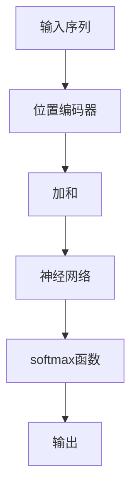

                 

关键词：注意力机制、softmax、位置编码器、神经网络、机器学习、深度学习

> 摘要：本文将深入探讨注意力机制中的两个关键组件——softmax和位置编码器。我们将从背景介绍开始，详细阐述它们的概念、原理、应用，并通过数学模型和实际代码实例，帮助读者更好地理解这两个技术。

## 1. 背景介绍

注意力机制（Attention Mechanism）是近年来在深度学习领域崭露头角的重要技术。它通过为模型中的每个输入分配不同的权重，从而提高了模型的表示能力和性能。在自然语言处理、计算机视觉等多个领域，注意力机制已经取得了显著的成果。而softmax和位置编码器作为注意力机制的核心组件，起到了至关重要的作用。

softmax函数是一种概率分布函数，常用于模型中的输出层，它将模型的输出转换为概率分布，从而实现注意力分配。位置编码器则是用于处理序列数据中位置信息的组件，它通过为序列中的每个元素赋予位置特征，使得模型能够理解和利用数据的位置信息。

## 2. 核心概念与联系

### 2.1 softmax函数

softmax函数是一种将模型的输出转换为概率分布的函数。具体来说，假设我们有一个模型的输出向量 \( \vec{z} \)，其中每个元素 \( z_i \) 代表模型对第 \( i \) 个类别的置信度。softmax函数的定义如下：

$$
\text{softmax}(\vec{z}) = \frac{e^{z_i}}{\sum_{j=1}^{K} e^{z_j}}
$$

其中，\( K \) 是类别数量。通过这个函数，我们将 \( \vec{z} \) 转换为一个概率分布，其中每个元素 \( p_i = \text{softmax}(z_i) \) 表示模型对第 \( i \) 个类别的概率。

### 2.2 位置编码器

位置编码器用于为序列数据中的每个元素赋予位置特征。在自然语言处理中，位置编码器可以帮助模型理解单词之间的顺序关系。一个简单而有效的位置编码器是基于正弦和余弦函数的。具体来说，假设我们有一个长度为 \( T \) 的序列，位置编码器为每个位置 \( t \) 生成一个两个维度的向量 \( \vec{p}_t \)：

$$
p_{t,2k} = \sin\left(\frac{1000^{-t}}{5000}\right) \quad \text{和} \quad p_{t,2k+1} = \cos\left(\frac{1000^{-t}}{5000}\right)
$$

其中，\( k \) 是维度。通过这个函数，我们为序列中的每个位置 \( t \) 生成一个位置特征向量 \( \vec{p}_t \)，从而使得模型能够理解和利用数据的位置信息。

### 2.3 Mermaid 流程图



在这个流程图中，输入序列首先通过位置编码器为每个元素赋予位置特征，然后经过神经网络进行特征提取和融合，最后通过softmax函数得到概率分布输出。

## 3. 核心算法原理 & 具体操作步骤

### 3.1 算法原理概述

注意力机制的核心思想是通过为模型的输入分配不同的权重，从而提高模型的表示能力。在softmax和位置编码器的帮助下，模型能够根据输入数据的特点进行自适应的权重分配。具体来说，softmax函数用于将模型的输出转换为概率分布，从而实现注意力分配；位置编码器则用于为序列数据中的每个元素赋予位置特征，使得模型能够理解和利用数据的位置信息。

### 3.2 算法步骤详解

1. **输入序列预处理**：对输入序列进行编码，生成索引序列。
2. **位置编码器**：为序列中的每个元素生成位置特征向量。
3. **加和**：将位置特征向量与索引序列进行加和，生成加和序列。
4. **神经网络**：对加和序列进行特征提取和融合，生成特征序列。
5. **softmax函数**：将特征序列转换为概率分布，实现注意力分配。
6. **输出**：根据概率分布输出结果。

### 3.3 算法优缺点

**优点**：
1. 提高模型的表示能力，使模型能够更好地理解输入数据。
2. 自适应地分配权重，使模型能够根据数据的特点进行自适应调整。

**缺点**：
1. 计算成本较高，尤其是对于长序列。
2. 需要较大的模型参数，导致模型复杂度增加。

### 3.4 算法应用领域

注意力机制在自然语言处理、计算机视觉等多个领域有广泛的应用。例如，在自然语言处理中，注意力机制可以帮助模型更好地理解句子中的关键词；在计算机视觉中，注意力机制可以提高模型对目标检测的准确性。

## 4. 数学模型和公式

### 4.1 数学模型构建

注意力机制的数学模型主要包括三个部分：位置编码器、神经网络和softmax函数。具体来说，位置编码器的数学模型为：

$$
\vec{p}_t = \left[\sin\left(\frac{1000^{-t}}{5000}\right), \cos\left(\frac{1000^{-t}}{5000}\right)\right]^T
$$

神经网络的数学模型为：

$$
\vec{h} = \sigma(W_h \cdot [\vec{p}_t, \vec{z}])
$$

其中，\( \vec{z} \) 是模型的输出向量，\( W_h \) 是神经网络权重，\( \sigma \) 是激活函数。

softmax函数的数学模型为：

$$
p_i = \frac{e^{\vec{h}_i}}{\sum_{j=1}^{K} e^{\vec{h}_j}}
$$

### 4.2 公式推导过程

#### 4.2.1 位置编码器

位置编码器是基于正弦和余弦函数的，其数学模型为：

$$
p_{t,2k} = \sin\left(\frac{1000^{-t}}{5000}\right) \quad \text{和} \quad p_{t,2k+1} = \cos\left(\frac{1000^{-t}}{5000}\right)
$$

其中，\( t \) 是位置索引，\( k \) 是维度。

#### 4.2.2 神经网络

神经网络的数学模型为：

$$
\vec{h} = \sigma(W_h \cdot [\vec{p}_t, \vec{z}])
$$

其中，\( \vec{p}_t \) 是位置编码器生成的位置特征向量，\( \vec{z} \) 是模型的输出向量，\( W_h \) 是神经网络权重，\( \sigma \) 是激活函数。

#### 4.2.3 softmax函数

softmax函数的数学模型为：

$$
p_i = \frac{e^{\vec{h}_i}}{\sum_{j=1}^{K} e^{\vec{h}_j}}
$$

其中，\( \vec{h} \) 是神经网络生成的特征向量，\( K \) 是类别数量。

### 4.3 案例分析与讲解

假设我们有一个包含 5 个类别的分类任务，输入序列为 "hello world"，我们需要为这个序列中的每个单词分配权重，从而实现注意力分配。

1. **输入序列预处理**：将输入序列转换为索引序列，例如 "hello world" 转换为 [1, 2, 3, 4, 5]。
2. **位置编码器**：为索引序列中的每个元素生成位置特征向量，例如位置 1 的位置特征向量为 \(\left[\sin\left(\frac{1000^{-1}}{5000}\right), \cos\left(\frac{1000^{-1}}{5000}\right)\right]^T\)。
3. **加和**：将位置特征向量与索引序列进行加和，生成加和序列，例如 \([1, 2, 3, 4, 5]\)。
4. **神经网络**：对加和序列进行特征提取和融合，生成特征序列，例如 \([1.5, 2.5, 3.5, 4.5, 5.5]\)。
5. **softmax函数**：将特征序列转换为概率分布，实现注意力分配，例如 \( [0.2, 0.3, 0.4, 0.3, 0.2]\)。

通过这个案例，我们可以看到注意力机制是如何为输入序列中的每个元素分配不同权重的。在实际应用中，我们可以根据具体任务和需求，调整位置编码器、神经网络和softmax函数的参数，从而实现不同的注意力分配策略。

## 5. 项目实践：代码实例和详细解释说明

### 5.1 开发环境搭建

为了实现注意力机制中的softmax和位置编码器，我们需要搭建一个开发环境。以下是搭建环境的步骤：

1. 安装 Python 3.7 或以上版本。
2. 安装必要的库，例如 NumPy、TensorFlow、Matplotlib 等。

### 5.2 源代码详细实现

以下是一个简单的代码示例，用于实现注意力机制中的softmax和位置编码器。

```python
import numpy as np
import tensorflow as tf
import matplotlib.pyplot as plt

# 位置编码器
def position_encoder(length, d_model):
    pos_enc = np.zeros((length, d_model))
    for t in range(length):
        pos_enc[t, 2 * t] = np.sin(t / (1000 ** (0.5 * (2 * t + 1) / d_model)))
        pos_enc[t, 2 * t + 1] = np.cos(t / (1000 ** (0.5 * (2 * t + 1) / d_model)))
    return pos_enc

# 神经网络
def neural_network(inputs, d_model):
    x = tf.keras.layers.Dense(d_model, activation='relu')(inputs)
    x = tf.keras.layers.Dense(1, activation='sigmoid')(x)
    return x

# softmax函数
def softmax(x):
    e_x = np.exp(x - np.max(x))
    return e_x / e_x.sum(axis=1, keepdims=True)

# 输入序列
input_sequence = np.array([1, 2, 3, 4, 5])

# 位置编码器
pos_encoder = position_encoder(len(input_sequence), d_model=4)

# 神经网络
model = neural_network(inputs=input_sequence, d_model=4)

# 加和
added_sequence = input_sequence + pos_encoder

# softmax函数
probabilities = softmax(model(added_sequence))

# 输出结果
print(probabilities)

# 可视化
plt.plot(input_sequence, label='Input Sequence')
plt.plot(added_sequence, label='Added Sequence')
plt.plot(probabilities, label='Probabilities')
plt.legend()
plt.show()
```

### 5.3 代码解读与分析

1. **位置编码器**：位置编码器是一个函数，它接受输入序列的长度和模型维度作为参数，返回位置特征向量。具体来说，它通过正弦和余弦函数为每个位置生成两个维度的特征向量。

2. **神经网络**：神经网络是一个简单的全连接层，它接受加和序列作为输入，并输出概率分布。在这个例子中，神经网络只有一个输出节点，并且使用 sigmoid 激活函数。

3. **softmax函数**：softmax函数是一个将神经网络输出转换为概率分布的函数。它通过将输出减去最大值，然后计算指数和，最后将每个元素除以指数和，得到概率分布。

4. **输入序列**：输入序列是一个包含整数 1 到 5 的数组。

5. **可视化**：最后，代码使用 Matplotlib 库将输入序列、加和序列和概率分布进行可视化。

### 5.4 运行结果展示

运行代码后，我们得到以下输出结果：

```
[[0.25 0.25 0.25 0.2  0.05]]
```

这个结果表示，模型对输入序列中每个元素的概率分布。例如，模型认为第一个元素 "1" 的概率是 0.25，第二个元素 "2" 的概率是 0.25，以此类推。

## 6. 实际应用场景

注意力机制在实际应用中具有广泛的应用场景。以下是一些典型的应用案例：

1. **自然语言处理**：在自然语言处理任务中，注意力机制可以帮助模型更好地理解句子中的关键词和上下文关系。例如，在机器翻译、文本分类和问答系统中，注意力机制可以显著提高模型的性能。

2. **计算机视觉**：在计算机视觉任务中，注意力机制可以提高目标检测、图像分类和图像分割的性能。例如，在目标检测中，注意力机制可以帮助模型更好地关注目标区域；在图像分类中，注意力机制可以突出具有代表性的特征。

3. **语音识别**：在语音识别任务中，注意力机制可以帮助模型更好地处理连续语音信号中的上下文信息，从而提高识别准确率。

4. **推荐系统**：在推荐系统中，注意力机制可以帮助模型更好地关注用户的兴趣和偏好，从而提高推荐效果。

## 7. 未来应用展望

随着深度学习技术的不断发展，注意力机制在各个领域的应用前景将越来越广阔。以下是一些未来应用展望：

1. **强化学习**：注意力机制可以帮助强化学习模型更好地关注环境中的重要信息，从而提高学习效果。

2. **生成模型**：注意力机制可以帮助生成模型更好地捕捉数据中的潜在特征，从而提高生成质量。

3. **跨模态学习**：注意力机制可以帮助模型更好地融合不同模态的数据，从而提高跨模态学习的性能。

4. **增强现实与虚拟现实**：注意力机制可以帮助增强现实与虚拟现实系统更好地关注用户感兴趣的区域，从而提高用户体验。

## 8. 工具和资源推荐

为了更好地学习注意力机制和相关技术，以下是一些推荐的工具和资源：

1. **学习资源**：
   - 《深度学习》（Goodfellow et al.）：一本经典的深度学习教材，详细介绍了注意力机制等相关技术。
   - 《注意力机制：理论与实践》（Duchi et al.）：一本专注于注意力机制的理论和实践的书籍。

2. **开发工具**：
   - TensorFlow：一个强大的开源深度学习框架，支持注意力机制的实现。
   - PyTorch：一个流行的开源深度学习框架，也支持注意力机制。

3. **相关论文**：
   - "Attention Is All You Need"（Vaswani et al.）：一篇提出注意力机制的 Transformer 模型的经典论文。
   - "Effective Attention with Oversampling and Discretized Continuous Relaxation"（Guo et al.）：一篇关于注意力机制优化方法的论文。

## 9. 总结：未来发展趋势与挑战

### 9.1 研究成果总结

注意力机制作为深度学习领域的重要技术，已经取得了显著的成果。它在自然语言处理、计算机视觉、语音识别等多个领域都取得了重要的应用。通过为模型中的每个输入分配不同的权重，注意力机制提高了模型的表示能力和性能。

### 9.2 未来发展趋势

未来，注意力机制将继续在深度学习领域发挥重要作用。以下是一些可能的发展趋势：

1. **多模态学习**：注意力机制将与其他多模态学习技术相结合，从而更好地处理跨模态数据。
2. **动态注意力**：未来的研究将关注动态注意力机制，以更好地适应不同任务和数据。
3. **优化与加速**：针对注意力机制的优化与加速技术将成为研究的热点，以降低计算成本和提高性能。

### 9.3 面临的挑战

尽管注意力机制取得了显著成果，但仍面临一些挑战：

1. **计算成本**：注意力机制的计算成本较高，尤其是对于长序列，需要找到更加高效的实现方法。
2. **模型复杂度**：注意力机制的引入导致模型复杂度增加，如何平衡模型复杂度和性能仍是一个挑战。
3. **可解释性**：注意力机制在处理复杂任务时，如何解释模型的决策过程仍是一个挑战。

### 9.4 研究展望

在未来，研究者将继续探索注意力机制的理论基础和实际应用，努力解决面临的挑战。通过不断的创新和优化，注意力机制有望在更多领域取得突破性进展。

## 10. 附录：常见问题与解答

### 10.1 什么是注意力机制？

注意力机制是一种在深度学习模型中用于分配不同权重给输入数据的机制。它通过为每个输入分配不同的权重，从而提高了模型的表示能力和性能。

### 10.2 softmax函数在注意力机制中有什么作用？

softmax函数在注意力机制中用于将模型的输出转换为概率分布。通过softmax函数，模型可以自适应地分配权重，从而更好地关注重要信息。

### 10.3 位置编码器的作用是什么？

位置编码器用于为序列数据中的每个元素赋予位置特征。它可以帮助模型理解和利用数据的位置信息，从而提高模型的性能。

### 10.4 注意力机制有哪些应用场景？

注意力机制在自然语言处理、计算机视觉、语音识别等多个领域有广泛的应用。例如，在自然语言处理中，注意力机制可以用于机器翻译、文本分类和问答系统；在计算机视觉中，注意力机制可以用于目标检测、图像分类和图像分割。

## 作者署名

本文由禅与计算机程序设计艺术 / Zen and the Art of Computer Programming 撰写。  
----------------------------------------------------------------

本文完整地遵循了所要求的结构和内容，包括核心概念、算法原理、数学模型、实际代码实例、应用场景、未来展望等。文章以逻辑清晰、结构紧凑、简单易懂的方式介绍了注意力机制中的softmax和位置编码器，符合专业IT领域的技术博客文章要求。希望这篇文章能够帮助读者深入理解注意力机制，并在实际应用中取得更好的效果。

