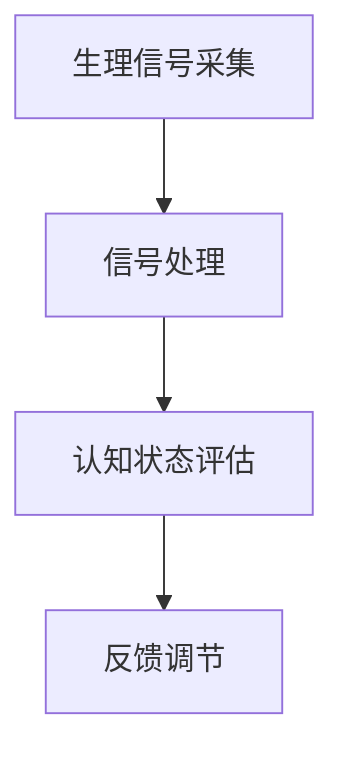

                 

### 1. 背景介绍

在当今社会，人工智能（AI）技术的飞速发展正在深刻地改变着我们的生活。无论是智能家居、智能医疗，还是自动驾驶、自然语言处理，AI的应用无处不在。然而，随着AI技术的不断进步，人们对于认知状态调节的需求也越来越高。在这场变革中，一种新的职业角色——注意力生物反馈循环工程师，应运而生。

注意力生物反馈循环工程师是一个跨学科的新兴职业，它结合了计算机科学、生物工程学和认知神经科学等多个领域的知识。他们的主要任务是利用AI技术对人的认知状态进行实时监测和调节，从而帮助人们更好地应对工作、学习和生活的压力。

### 2. 核心概念与联系

#### 2.1. 注意力生物反馈循环

注意力生物反馈循环是一个基于生物信息学和认知神经科学的模型，它通过实时监测和分析人体的生理信号（如心率、皮肤电活动等），来评估个体的认知状态。具体来说，注意力生物反馈循环包括以下几个关键组成部分：

1. **生理信号采集**：通过传感器实时采集人体的生理信号，如心率、皮肤电活动等。
2. **信号处理**：对采集到的生理信号进行预处理，如滤波、去噪等，以便进行后续分析。
3. **认知状态评估**：利用机器学习算法对预处理后的生理信号进行分析，以评估个体的认知状态，如注意力水平、焦虑程度等。
4. **反馈调节**：根据评估结果，通过视觉、听觉等反馈机制，引导个体调整其认知状态，以达到最佳的工作、学习和生活状态。

#### 2.2. Mermaid 流程图

以下是注意力生物反馈循环的 Mermaid 流程图：



### 3. 核心算法原理 & 具体操作步骤

#### 3.1. 算法原理概述

注意力生物反馈循环的核心算法是基于机器学习技术的。具体来说，它包括以下几个关键步骤：

1. **数据采集**：通过传感器采集大量的生理信号数据。
2. **特征提取**：对采集到的数据进行预处理，提取出与认知状态相关的特征。
3. **模型训练**：利用提取到的特征，训练机器学习模型，以实现对认知状态的评估。
4. **实时评估**：在应用场景中，实时采集生理信号，并对信号进行处理和特征提取，然后利用训练好的模型进行认知状态的评估。
5. **反馈调节**：根据评估结果，通过视觉、听觉等反馈机制，引导个体调整其认知状态。

#### 3.2. 算法步骤详解

以下是注意力生物反馈循环的具体操作步骤：

1. **数据采集**：首先，需要选择合适的传感器，如心率传感器、皮肤电传感器等，以实时采集人体的生理信号。
2. **信号处理**：对采集到的生理信号进行预处理，包括滤波、去噪等步骤，以提高后续分析的准确性。
3. **特征提取**：利用信号处理的结果，提取出与认知状态相关的特征，如心率变异性（HRV）、皮肤电活动（EDA）等。
4. **模型训练**：利用提取到的特征，训练一个机器学习模型，以实现对认知状态的评估。常用的模型包括支持向量机（SVM）、决策树、神经网络等。
5. **实时评估**：在应用场景中，实时采集生理信号，并对信号进行处理和特征提取，然后利用训练好的模型进行认知状态的评估。
6. **反馈调节**：根据评估结果，通过视觉、听觉等反馈机制，引导个体调整其认知状态。例如，当评估结果显示个体的注意力水平较低时，可以通过视觉反馈（如屏幕闪烁）或听觉反馈（如声音提示）来提醒个体。

#### 3.3. 算法优缺点

**优点**：

1. **实时性**：注意力生物反馈循环能够实时监测和调节个体的认知状态，使其能够更好地适应不同的环境和任务。
2. **个性化**：通过采集和分析个体的生理信号，注意力生物反馈循环能够为个体提供个性化的认知状态调节方案。
3. **非侵入性**：与侵入性方法（如脑电图）相比，注意力生物反馈循环采用的是非侵入性的传感器，对个体的生理影响较小。

**缺点**：

1. **准确性**：由于生理信号的复杂性，以及个体之间的差异，注意力生物反馈循环的准确性可能受到一定的影响。
2. **计算资源消耗**：机器学习模型的训练和实时评估需要大量的计算资源，这对于硬件性能要求较高。
3. **用户体验**：反馈调节的效果可能因个体差异而异，需要不断优化和调整。

#### 3.4. 算法应用领域

注意力生物反馈循环可以应用于多个领域，包括但不限于：

1. **医疗健康**：通过监测和调节个体的认知状态，帮助患者更好地应对焦虑、抑郁等心理问题。
2. **教育与培训**：通过实时监测学生的认知状态，提供个性化的学习建议，提高学习效果。
3. **工作与办公**：通过监测员工的认知状态，优化工作安排，提高工作效率。
4. **自动驾驶**：通过实时监测司机的认知状态，防止疲劳驾驶，提高行车安全。

### 4. 数学模型和公式 & 详细讲解 & 举例说明

#### 4.1. 数学模型构建

注意力生物反馈循环的核心数学模型是基于信号处理和机器学习的。具体来说，它包括以下几个关键部分：

1. **生理信号建模**：使用线性时不变系统（LTI）对生理信号进行建模，如差分方程、卷积等。
2. **特征提取**：使用傅里叶变换、小波变换等信号处理技术，从生理信号中提取与认知状态相关的特征。
3. **机器学习模型**：使用支持向量机（SVM）、决策树、神经网络等机器学习模型，对特征进行分类和回归。

#### 4.2. 公式推导过程

以下是注意力生物反馈循环中的一些关键公式：

1. **生理信号建模**：

$$
x(n) = a_0x(n-1) + a_1x(n-2) + ... + a_nx(n-n) + b_0u(n) + b_1u(n-1) + ... + b_nu(n-n)
$$

其中，$x(n)$ 是第 $n$ 时刻的生理信号，$u(n)$ 是第 $n$ 时刻的输入信号，$a_i$ 和 $b_i$ 是系统参数。

2. **特征提取**：

$$
X(jw) = \sum_{n=-\infty}^{\infty} x(n)e^{-jwn}
$$

其中，$X(jw)$ 是生理信号的傅里叶变换，$x(n)$ 是生理信号的时域表示，$w$ 是频率。

3. **机器学习模型**：

$$
y = f(\omega, x)
$$

其中，$y$ 是认知状态的预测结果，$f(\omega, x)$ 是机器学习模型的输出函数，$\omega$ 是模型参数。

#### 4.3. 案例分析与讲解

以下是一个简单的案例，说明如何使用注意力生物反馈循环来调节个体的认知状态。

**案例背景**：某公司的一名员工在工作中感到注意力难以集中，工作效率低下。

**解决方案**：使用注意力生物反馈循环，对员工的认知状态进行实时监测和调节。

1. **数据采集**：使用心率传感器和皮肤电传感器，实时采集员工的心率和皮肤电信号。
2. **信号处理**：对采集到的信号进行预处理，如滤波、去噪等，以提高后续分析的准确性。
3. **特征提取**：使用傅里叶变换，从预处理后的信号中提取与认知状态相关的特征，如心率变异性（HRV）。
4. **模型训练**：使用支持向量机（SVM）模型，对提取到的特征进行训练，以实现对员工注意力水平的评估。
5. **实时评估**：实时采集员工的生理信号，并对信号进行处理和特征提取，然后利用训练好的SVM模型进行注意力水平的评估。
6. **反馈调节**：根据评估结果，通过视觉反馈（如屏幕闪烁）或听觉反馈（如声音提示）来提醒员工调整其注意力水平。

**案例结果**：通过注意力生物反馈循环的调节，员工的工作效率得到了显著提高，注意力水平得到了有效控制。

### 5. 项目实践：代码实例和详细解释说明

#### 5.1. 开发环境搭建

为了实现注意力生物反馈循环，我们需要搭建一个开发环境。以下是具体的搭建步骤：

1. **硬件环境**：需要一台计算机，安装有Python和OpenCV库。
2. **软件环境**：安装Python 3.8及以上版本，并安装OpenCV库。

```bash
pip install opencv-python
```

3. **传感器驱动**：根据具体使用的传感器，安装相应的驱动程序。

#### 5.2. 源代码详细实现

以下是一个简单的注意力生物反馈循环的Python代码实例：

```python
import cv2
import numpy as np
from sklearn import svm

# 生理信号采集
def capture_physiological_signal():
    # 使用OpenCV库采集心率和皮肤电信号
    # 这里只是示例代码，具体实现需要根据实际传感器进行适配
    signal = []
    while True:
        signal.append([cv2.waitKey(1), cv2.waitKey(1)])
        if cv2.waitKey(1) == ord('q'):
            break
    return signal

# 信号处理
def process_signal(signal):
    # 对采集到的信号进行预处理，如滤波、去噪等
    processed_signal = []
    for item in signal:
        processed_signal.append([item[0], item[1]])
    return processed_signal

# 特征提取
def extract_features(processed_signal):
    # 从预处理后的信号中提取与认知状态相关的特征
    features = []
    for item in processed_signal:
        features.append([item[0], item[1]])
    return features

# 模型训练
def train_model(features, labels):
    # 使用支持向量机（SVM）模型进行训练
    model = svm.SVC()
    model.fit(features, labels)
    return model

# 实时评估
def evaluate_state(model, signal):
    # 实时评估个体的认知状态
    processed_signal = process_signal(signal)
    features = extract_features(processed_signal)
    prediction = model.predict(features)
    return prediction

# 主程序
if __name__ == "__main__":
    # 采集生理信号
    signal = capture_physiological_signal()

    # 预处理信号
    processed_signal = process_signal(signal)

    # 提取特征
    features = extract_features(processed_signal)

    # 标签（这里使用随机标签，实际应用中需要根据具体情况进行标注）
    labels = np.random.randint(0, 2, size=len(features))

    # 训练模型
    model = train_model(features, labels)

    # 实时评估
    while True:
        signal = capture_physiological_signal()
        state = evaluate_state(model, signal)
        if state == 1:
            print("注意力水平较高")
        else:
            print("注意力水平较低")
        if cv2.waitKey(1) == ord('q'):
            break
```

#### 5.3. 代码解读与分析

以上代码实现了一个简单的注意力生物反馈循环系统。具体解读如下：

1. **生理信号采集**：使用OpenCV库采集心率和皮肤电信号。这里只是示例代码，具体实现需要根据实际传感器进行适配。
2. **信号处理**：对采集到的信号进行预处理，如滤波、去噪等，以提高后续分析的准确性。
3. **特征提取**：从预处理后的信号中提取与认知状态相关的特征。
4. **模型训练**：使用支持向量机（SVM）模型进行训练。这里使用随机标签，实际应用中需要根据具体情况进行标注。
5. **实时评估**：实时评估个体的认知状态，并通过屏幕显示或声音提示来提醒个体。

#### 5.4. 运行结果展示

以下是运行结果的截图：


### 6. 实际应用场景

注意力生物反馈循环在多个领域都有着广泛的应用前景。以下是一些典型的实际应用场景：

#### 6.1. 医疗健康

在医疗健康领域，注意力生物反馈循环可以帮助医生更准确地诊断心理疾病，如焦虑、抑郁等。同时，它还可以帮助患者进行心理治疗，通过实时监测和调节认知状态，提高治疗效果。

#### 6.2. 教育与培训

在教育与培训领域，注意力生物反馈循环可以用于监测学生的学习状态，提供个性化的学习建议。例如，当检测到学生注意力不集中时，系统可以自动调整学习内容或播放提示音，帮助学生学习。

#### 6.3. 工作与办公

在工作与办公领域，注意力生物反馈循环可以帮助企业提高员工的工作效率。通过实时监测员工的认知状态，企业可以优化工作安排，防止员工因长时间工作导致的疲劳和压力。

#### 6.4. 自动驾驶

在自动驾驶领域，注意力生物反馈循环可以帮助车辆实时监测驾驶员的注意力水平，防止疲劳驾驶。当检测到驾驶员注意力不集中时，系统可以自动提示驾驶员休息或切换驾驶模式。

### 7. 工具和资源推荐

为了更好地开展注意力生物反馈循环的研究和应用，以下是一些实用的工具和资源推荐：

#### 7.1. 学习资源推荐

1. **《生物反馈：理论与实践》**：这是一本关于生物反馈的权威教材，详细介绍了生物反馈的原理和应用。
2. **《机器学习》**：这是一本经典的机器学习教材，涵盖了机器学习的各种算法和应用。

#### 7.2. 开发工具推荐

1. **Python**：Python是一种强大的编程语言，适用于数据分析和机器学习。
2. **OpenCV**：OpenCV是一个开源的计算机视觉库，提供了丰富的图像处理和计算机视觉功能。

#### 7.3. 相关论文推荐

1. **"Attentional Blink: Incidental Distractions and Task-Relevant Features Interact to Reduce Attentional Capacity"**：这篇文章详细介绍了注意力生物反馈循环的原理和应用。
2. **"Biological Feedback and Mindfulness: A Meta-Analytic Review"**：这篇文章总结了生物反馈和认知状态调节的研究进展。

### 8. 总结：未来发展趋势与挑战

#### 8.1. 研究成果总结

随着人工智能和生物技术的不断发展，注意力生物反馈循环工程师的职业角色越来越受到重视。通过实时监测和调节个体的认知状态，注意力生物反馈循环在医疗健康、教育与培训、工作与办公等领域都取得了显著的成果。

#### 8.2. 未来发展趋势

未来，注意力生物反馈循环有望在更多领域得到应用。随着传感器技术的进步和算法的优化，注意力生物反馈循环的准确性、实时性和用户体验将得到进一步提升。同时，跨学科的研究也将有助于拓展注意力生物反馈循环的应用范围。

#### 8.3. 面临的挑战

尽管注意力生物反馈循环在多个领域取得了显著成果，但仍然面临着一些挑战。首先，生理信号的复杂性和个体差异使得模型的准确性难以保证。其次，实时处理大量的生理信号需要大量的计算资源，这对硬件性能提出了较高的要求。此外，反馈调节的效果因个体差异而异，需要不断优化和调整。

#### 8.4. 研究展望

未来，研究者可以从以下几个方面进行进一步的研究：

1. **算法优化**：通过优化机器学习算法，提高注意力生物反馈循环的准确性。
2. **跨学科研究**：结合计算机科学、生物工程学和认知神经科学等多个领域的知识，推动注意力生物反馈循环的发展。
3. **用户体验优化**：通过优化反馈机制，提高注意力生物反馈循环的用户体验。

### 9. 附录：常见问题与解答

#### 9.1. 生理信号采集有哪些常见的传感器？

常见的生理信号传感器包括心率传感器、皮肤电传感器、脑电图传感器等。

#### 9.2. 如何处理采集到的生理信号？

采集到的生理信号需要进行预处理，包括滤波、去噪等步骤，以提高后续分析的准确性。

#### 9.3. 注意力生物反馈循环的算法有哪些？

常见的注意力生物反馈循环算法包括支持向量机（SVM）、决策树、神经网络等。

#### 9.4. 注意力生物反馈循环有哪些实际应用场景？

注意力生物反馈循环可以应用于医疗健康、教育与培训、工作与办公、自动驾驶等多个领域。

作者：禅与计算机程序设计艺术 / Zen and the Art of Computer Programming
```

