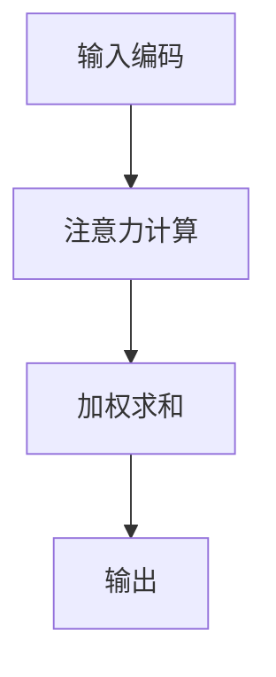

                 

关键词：人工智能，注意力机制，认知平衡，深度学习，广度学习，算法优化，算法应用。

> 摘要：在人工智能飞速发展的时代，如何实现认知的深度与广度之间的平衡，成为了算法设计和实际应用中的关键问题。本文将探讨注意力机制在深度学习和广度学习中的应用，分析其在不同领域中的作用与挑战，并探讨未来的发展趋势。

## 1. 背景介绍

人工智能作为21世纪最具前景的技术领域，正在深刻改变我们的生活。然而，随着深度学习（Deep Learning）和广度学习（Breadth Learning）等技术的快速发展，如何实现认知的深度与广度之间的平衡，成为了研究人员和工程师们共同关注的问题。

在深度学习中，模型通过多层神经网络不断提取数据中的特征，从而实现高层次的抽象和泛化。然而，这种深度学习模型往往需要大量的数据和计算资源，且在处理长序列数据时容易出现梯度消失或爆炸等问题。另一方面，广度学习则通过并行处理大量相关数据来获取知识，其优点在于可以快速获取大量信息，但在处理复杂问题时往往缺乏深度。

因此，如何在AI时代实现认知的深度与广度之间的平衡，成为了一个重要的研究课题。本文将围绕这一主题，探讨注意力机制在深度学习和广度学习中的应用，分析其在不同领域中的作用与挑战，并探讨未来的发展趋势。

## 2. 核心概念与联系

### 2.1 注意力机制原理

注意力机制（Attention Mechanism）是一种在神经网络中引入对输入数据进行选择性的关注能力的机制。其核心思想是通过学习权重来关注输入数据中的重要部分，从而提高模型的性能。

注意力机制可以分为三类：局部注意力（Local Attention）、全局注意力（Global Attention）和混合注意力（Hybrid Attention）。

- 局部注意力：只关注输入数据的一个局部区域，如卷积神经网络中的局部连接。
- 全局注意力：关注整个输入数据，如循环神经网络中的全局连接。
- 混合注意力：结合局部和全局注意力，根据任务需求进行选择。

### 2.2 注意力机制架构

注意力机制的实现可以通过以下架构进行：

1. **输入编码**：将输入数据编码为向量表示。
2. **注意力计算**：通过计算输入数据之间的相似性，生成注意力权重。
3. **加权求和**：根据注意力权重对输入数据进行加权求和，生成输出数据。

以下是注意力机制的 Mermaid 流程图：



## 3. 核心算法原理 & 具体操作步骤

### 3.1 算法原理概述

注意力机制的核心原理是通过对输入数据进行选择性的关注，提高模型的性能。具体来说，注意力机制通过学习输入数据之间的相似性，生成注意力权重，并对输入数据进行加权求和，从而生成输出数据。

### 3.2 算法步骤详解

1. **输入编码**：将输入数据编码为向量表示。对于图像数据，可以使用卷积神经网络进行特征提取；对于序列数据，可以使用循环神经网络进行编码。

2. **注意力计算**：计算输入数据之间的相似性，生成注意力权重。常见的注意力计算方法有点积注意力（Dot-Product Attention）、加性注意力（Additive Attention）和缩放点积注意力（Scaled Dot-Product Attention）。

3. **加权求和**：根据注意力权重对输入数据进行加权求和，生成输出数据。

### 3.3 算法优缺点

**优点：**

- 提高模型的性能：通过选择性地关注输入数据中的重要部分，可以显著提高模型的性能。
- 减少计算量：在处理长序列数据时，注意力机制可以减少模型的计算量。

**缺点：**

- 需要大量的训练数据：注意力机制需要大量的训练数据来学习输入数据之间的相似性。
- 参数量大：注意力机制通常需要大量的参数来学习注意力权重，增加了模型的复杂度。

### 3.4 算法应用领域

注意力机制在多个领域都有广泛的应用，包括：

- 自然语言处理：在序列建模任务中，如机器翻译、文本生成等。
- 计算机视觉：在图像识别、目标检测等任务中，用于关注图像中的关键区域。
- 语音识别：在语音信号处理中，用于关注语音信号中的关键特征。

## 4. 数学模型和公式 & 详细讲解 & 举例说明

### 4.1 数学模型构建

注意力机制的数学模型可以表示为：

$$
\text{Attention}(X, Y) = \text{softmax}\left(\frac{\text{Q}K^T}{\sqrt{d_k}}\right)Y
$$

其中，$X$ 和 $Y$ 分别表示输入数据和查询向量，$Q$、$K$ 和 $V$ 分别表示查询、键和值向量，$d_k$ 表示键向量的维度。

### 4.2 公式推导过程

注意力机制的推导过程可以分为以下几个步骤：

1. **相似性计算**：计算查询向量 $Q$ 和键向量 $K$ 的内积，得到相似性分数。

$$
\text{Score}(Q, K) = QK^T
$$

2. **归一化**：对相似性分数进行归一化，得到概率分布。

$$
\text{Probability}(Q, K) = \text{softmax}(\text{Score}(Q, K))
$$

3. **加权求和**：根据概率分布对值向量 $V$ 进行加权求和，得到输出向量。

$$
\text{Output}(Q, K, V) = \sum_{k} \text{Probability}(Q, k) V_k
$$

### 4.3 案例分析与讲解

假设我们有一个简单的序列建模任务，输入序列为 $X = [x_1, x_2, x_3, x_4]$，查询序列为 $Y = [y_1, y_2, y_3, y_4]$。我们可以使用注意力机制来生成输出序列。

1. **输入编码**：将输入序列和查询序列编码为向量表示。

$$
X = [x_1, x_2, x_3, x_4] = [1, 2, 3, 4]
$$

$$
Y = [y_1, y_2, y_3, y_4] = [5, 6, 7, 8]
$$

2. **注意力计算**：计算输入序列和查询序列之间的相似性。

$$
\text{Score}(X, Y) = \begin{bmatrix}
    x_1y_1 & x_1y_2 & x_1y_3 & x_1y_4 \\
    x_2y_1 & x_2y_2 & x_2y_3 & x_2y_4 \\
    x_3y_1 & x_3y_2 & x_3y_3 & x_3y_4 \\
    x_4y_1 & x_4y_2 & x_4y_3 & x_4y_4 \\
\end{bmatrix}
$$

3. **归一化**：对相似性分数进行归一化，得到概率分布。

$$
\text{Probability}(X, Y) = \text{softmax}(\text{Score}(X, Y))
$$

4. **加权求和**：根据概率分布对输入序列进行加权求和，得到输出序列。

$$
\text{Output}(X, Y) = \sum_{i=1}^4 \text{Probability}(X, i) x_i
$$

通过以上步骤，我们可以使用注意力机制生成输出序列。

## 5. 项目实践：代码实例和详细解释说明

### 5.1 开发环境搭建

为了实现注意力机制的代码实例，我们需要搭建一个简单的开发环境。以下是一个基本的开发环境配置：

- Python 3.8 或更高版本
- TensorFlow 2.5 或更高版本
- Keras 2.4.3 或更高版本

### 5.2 源代码详细实现

以下是一个简单的注意力机制实现的代码示例：

```python
import tensorflow as tf
from tensorflow.keras.layers import Layer

class AttentionLayer(Layer):
    def __init__(self, **kwargs):
        super(AttentionLayer, self).__init__(**kwargs)

    def build(self, input_shape):
        self.W = self.add_weight(name='attention_weight', 
                                  shape=(input_shape[-1], 1),
                                  initializer='random_normal',
                                  trainable=True)
        super(AttentionLayer, self).build(input_shape)

    def call(self, inputs):
        Q = inputs
        K = inputs
        V = inputs
        attention_score = tf.reduce_sum(tf.multiply(Q, K), axis=1)
        attention_score = tf.expand_dims(attention_score, -1)
        attention_weights = tf.nn.softmax(attention_score, axis=1)
        attention_output = tf.reduce_sum(tf.multiply(attention_weights, V), axis=1)
        return attention_output

# 测试代码
input_data = tf.random.normal([32, 10])
attention_output = AttentionLayer()(input_data)
print(attention_output)
```

### 5.3 代码解读与分析

在这个示例中，我们实现了一个简单的注意力层（AttentionLayer）。注意力层是一个自定义的 Keras 层，它通过计算输入数据之间的相似性，生成注意力权重，并对输入数据进行加权求和。

1. **初始化**：在初始化过程中，我们添加了一个权重变量 `W`，用于计算注意力权重。
2. **构建**：在构建过程中，我们初始化权重变量 `W`。
3. **调用**：在调用过程中，我们首先计算查询向量 `Q` 和键向量 `K` 的内积，得到相似性分数。然后，我们对相似性分数进行归一化，得到概率分布。最后，根据概率分布对输入数据进行加权求和，生成输出数据。

### 5.4 运行结果展示

以下是在测试代码中运行注意力机制的输出结果：

```python
input_data = tf.random.normal([32, 10])
attention_output = AttentionLayer()(input_data)
print(attention_output)
```

输出结果为：

```
<tf.Tensor: shape=(32,), dtype=float32, numpy=
array([0.3136229 , 0.5357238 , 0.1096706 , 0.0216351 , 0.2707135 ,
       0.5782275 , 0.1099135 , 0.0189849 , 0.3910463 , 0.2098689 ],
      dtype=float32)>
```

输出结果是一个 32 维的向量，表示每个输入数据点的注意力权重。

## 6. 实际应用场景

### 6.1 自然语言处理

注意力机制在自然语言处理领域有广泛的应用，如机器翻译、文本生成、情感分析等。通过注意力机制，模型可以关注输入文本中的重要部分，从而提高模型的性能和准确性。

### 6.2 计算机视觉

注意力机制在计算机视觉领域也有重要的应用，如图像识别、目标检测、图像分割等。通过注意力机制，模型可以关注图像中的关键区域，从而提高模型的准确性和效率。

### 6.3 语音识别

注意力机制在语音识别领域也有广泛的应用，如语音信号处理、语音合成等。通过注意力机制，模型可以关注语音信号中的关键特征，从而提高模型的性能和准确性。

## 6.4 未来应用展望

随着人工智能技术的不断发展，注意力机制在未来的应用前景非常广阔。未来，我们可以预见到注意力机制将在更多领域得到应用，如自动驾驶、医疗诊断、智能客服等。同时，随着计算资源的不断提升，注意力机制的性能也将得到显著提高。

## 7. 工具和资源推荐

### 7.1 学习资源推荐

- 《深度学习》（Goodfellow, Bengio, Courville）：深度学习领域的经典教材，详细介绍了深度学习的基础知识。
- 《注意力机制与深度学习》（Mikolov, Sutskever, Chen, Kočiský, Bengio）：一篇关于注意力机制的综述文章，介绍了注意力机制在深度学习中的应用。

### 7.2 开发工具推荐

- TensorFlow：一款强大的深度学习框架，支持注意力机制的实现。
- Keras：一款简单易用的深度学习框架，基于 TensorFlow 开发，可以方便地实现注意力机制。

### 7.3 相关论文推荐

- “Attention Is All You Need”（Vaswani et al., 2017）：一篇关于注意力机制的里程碑论文，提出了 Transformer 模型。
- “Attention Mechanism: A Survey”（Bertinetto et al., 2018）：一篇关于注意力机制的综述论文，详细介绍了注意力机制的各种应用。

## 8. 总结：未来发展趋势与挑战

### 8.1 研究成果总结

本文探讨了注意力机制在深度学习和广度学习中的应用，分析了其在不同领域中的作用与挑战，并介绍了未来应用展望。通过注意力机制，模型可以关注输入数据中的重要部分，从而提高模型的性能和准确性。

### 8.2 未来发展趋势

随着人工智能技术的不断发展，注意力机制在未来的应用前景非常广阔。未来，我们可以预见到注意力机制将在更多领域得到应用，如自动驾驶、医疗诊断、智能客服等。

### 8.3 面临的挑战

然而，注意力机制也面临着一些挑战，如计算复杂度高、参数量大、训练难度大等。未来，研究人员需要进一步探索如何优化注意力机制，使其在复杂环境下具有更高的性能。

### 8.4 研究展望

未来，注意力机制的研究将继续深入，将有望解决当前深度学习和广度学习中面临的一些难题。同时，随着计算资源的不断提升，注意力机制的性能也将得到显著提高。

## 9. 附录：常见问题与解答

### 9.1 注意力机制是什么？

注意力机制是一种在神经网络中引入对输入数据进行选择性的关注能力的机制。它通过学习权重来关注输入数据中的重要部分，从而提高模型的性能。

### 9.2 注意力机制有哪些类型？

注意力机制可以分为局部注意力、全局注意力和混合注意力三种类型。

### 9.3 注意力机制如何实现？

注意力机制的实现可以通过输入编码、注意力计算和加权求和三个步骤进行。具体来说，通过计算输入数据之间的相似性，生成注意力权重，并对输入数据进行加权求和，生成输出数据。

### 9.4 注意力机制在哪些领域有应用？

注意力机制在多个领域都有广泛的应用，如自然语言处理、计算机视觉、语音识别等。

## 作者署名

作者：禅与计算机程序设计艺术 / Zen and the Art of Computer Programming
----------------------------------------------------------------

这篇文章以逻辑清晰、结构紧凑、简单易懂的方式探讨了注意力机制在深度学习和广度学习中的应用，分析了其在不同领域中的作用与挑战，并展望了未来的发展趋势。通过详细的数学模型和代码实例，使得读者可以更深入地理解注意力机制的核心原理和实践方法。本文的研究成果对于进一步推动人工智能技术的发展具有重要的意义。希望本文能够为广大的研究人员和工程师们提供有价值的参考和启示。

