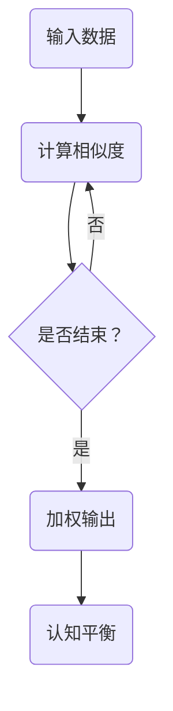
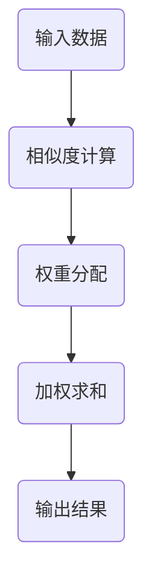

                 

关键词：注意力机制、AI认知、深度学习、认知平衡、多任务学习、模型优化

> 摘要：本文旨在探讨在AI时代，如何实现认知的深度与广度的平衡。随着深度学习的不断发展，人工智能在处理复杂任务时表现出色，但同时也面临着认知过载的问题。本文将分析注意力机制的作用，探讨如何在深度学习模型中实现认知的深度与广度的平衡，从而提高AI的认知效率。

## 1. 背景介绍

近年来，深度学习在人工智能领域取得了巨大的成功。从图像识别、语音识别到自然语言处理，深度学习模型在各种任务中都展现了强大的能力。然而，随着模型复杂度的增加，深度学习模型开始面临认知过载的问题。模型在处理复杂任务时，需要同时关注大量的信息，导致其认知负担加重，影响了模型的效率和性能。

为了解决这一问题，注意力机制（Attention Mechanism）被引入到深度学习模型中。注意力机制是一种让模型能够自动关注重要信息，忽略无关信息的机制。通过注意力机制，模型可以在处理复杂任务时，实现认知的深度与广度的平衡，从而提高模型的效率。

本文将首先介绍注意力机制的基本概念和工作原理，然后分析其在深度学习模型中的应用，探讨如何实现认知的深度与广度的平衡。最后，本文将讨论注意力机制在多任务学习和模型优化中的应用，并展望其未来的发展趋势。

## 2. 核心概念与联系

### 2.1 注意力机制的定义

注意力机制（Attention Mechanism）是一种在深度学习模型中引入的机制，它可以让模型在处理输入信息时，自动选择关注重要信息，忽略无关信息。注意力机制的核心思想是，将输入信息的每个部分分配一个权重，然后在计算过程中，根据这些权重来加权输入信息。

### 2.2 注意力机制的工作原理

注意力机制的工作原理可以简单概括为以下三个步骤：

1. **计算相似度**：首先，模型会计算输入信息的每个部分与目标之间的相似度。相似度可以用各种方式计算，例如点积、乘积、加性模型等。

2. **加权输入信息**：根据计算得到的相似度，模型会为输入信息的每个部分分配一个权重。这些权重表示了模型对每个部分的关注程度。

3. **计算加权输出**：最后，模型会根据这些权重，对输入信息进行加权求和，得到加权输出。加权输出代表了模型对输入信息的综合理解。

### 2.3 注意力机制在深度学习模型中的应用

注意力机制在深度学习模型中的应用非常广泛。以下是一些常见的应用场景：

1. **序列处理**：在处理序列数据时，注意力机制可以帮助模型关注重要的序列部分，从而提高模型的性能。例如，在自然语言处理任务中，注意力机制可以帮助模型关注重要的词语，从而提高语义理解能力。

2. **图像识别**：在图像识别任务中，注意力机制可以帮助模型关注图像中的重要区域，从而提高模型的识别精度。例如，在目标检测任务中，注意力机制可以帮助模型关注目标所在的位置，从而提高目标的检测准确性。

3. **语音识别**：在语音识别任务中，注意力机制可以帮助模型关注重要的语音信号部分，从而提高模型的识别精度。例如，在说话人识别任务中，注意力机制可以帮助模型关注不同的说话人特征，从而提高说话人的识别精度。

### 2.4 注意力机制与认知平衡的关系

注意力机制在实现认知平衡方面发挥了关键作用。通过注意力机制，模型可以在处理复杂任务时，自动关注重要信息，忽略无关信息，从而减轻认知负担。这种认知平衡不仅提高了模型的效率，还使其能够更好地应对复杂的任务。

### 2.5 Mermaid 流程图

以下是注意力机制在深度学习模型中的 Mermaid 流程图：



## 3. 核心算法原理 & 具体操作步骤

### 3.1 算法原理概述

注意力机制的算法原理可以概括为以下几个步骤：

1. **输入编码**：首先，将输入数据编码为向量表示。

2. **计算相似度**：然后，计算输入数据的每个部分与目标之间的相似度。

3. **加权输入数据**：根据计算得到的相似度，为输入数据的每个部分分配一个权重。

4. **计算加权输出**：最后，根据这些权重，对输入数据进行加权求和，得到加权输出。

### 3.2 算法步骤详解

1. **输入编码**：

   将输入数据编码为向量表示。例如，在自然语言处理任务中，可以将文本编码为词向量。

2. **计算相似度**：

   计算输入数据的每个部分与目标之间的相似度。相似度的计算方法有很多种，例如点积、乘积、加性模型等。

3. **加权输入数据**：

   根据计算得到的相似度，为输入数据的每个部分分配一个权重。权重的计算方法可以根据具体任务进行调整。

4. **计算加权输出**：

   根据这些权重，对输入数据进行加权求和，得到加权输出。

### 3.3 算法优缺点

**优点**：

1. **提高模型效率**：通过注意力机制，模型可以自动关注重要信息，忽略无关信息，从而提高模型的效率。

2. **减轻认知负担**：注意力机制帮助模型实现认知的深度与广度的平衡，从而减轻模型的认知负担。

**缺点**：

1. **计算复杂度增加**：注意力机制引入了额外的计算步骤，导致模型的计算复杂度增加。

2. **对参数敏感**：注意力机制的参数调整对模型的性能有很大影响，需要通过实验进行优化。

### 3.4 算法应用领域

注意力机制在深度学习模型中的应用非常广泛，以下是一些典型的应用领域：

1. **自然语言处理**：在自然语言处理任务中，注意力机制可以帮助模型关注重要的词语，从而提高语义理解能力。

2. **图像识别**：在图像识别任务中，注意力机制可以帮助模型关注图像中的重要区域，从而提高识别精度。

3. **语音识别**：在语音识别任务中，注意力机制可以帮助模型关注重要的语音信号部分，从而提高识别精度。

4. **推荐系统**：在推荐系统任务中，注意力机制可以帮助模型关注重要的用户行为特征，从而提高推荐效果。

## 4. 数学模型和公式 & 详细讲解 & 举例说明

### 4.1 数学模型构建

注意力机制的核心数学模型可以表示为：

$$
Attention(x, h) = \frac{e^{h^T \cdot W x}}{\sum_{i=1}^{n} e^{h^T \cdot W x_i}}
$$

其中，$x$ 表示输入数据，$h$ 表示目标数据，$W$ 表示权重矩阵，$e$ 表示自然对数的底数。

### 4.2 公式推导过程

注意力机制的推导过程可以分解为以下几个步骤：

1. **输入编码**：

   将输入数据 $x$ 编码为向量表示。假设 $x \in \mathbb{R}^{m \times 1}$，其中 $m$ 表示输入数据的维度。

2. **计算相似度**：

   计算输入数据的每个部分与目标之间的相似度。假设 $h \in \mathbb{R}^{k \times 1}$，其中 $k$ 表示目标数据的维度。

   $$ 
   similarity(x, h) = h^T \cdot W x 
   $$

3. **加权输入数据**：

   根据计算得到的相似度，为输入数据的每个部分分配一个权重。

   $$ 
   weight(x) = \frac{e^{h^T \cdot W x}}{\sum_{i=1}^{n} e^{h^T \cdot W x_i}} 
   $$

4. **计算加权输出**：

   根据这些权重，对输入数据进行加权求和，得到加权输出。

   $$ 
   output = \sum_{i=1}^{n} weight(x_i) \cdot x_i 
   $$

### 4.3 案例分析与讲解

以下是一个简单的案例，说明如何使用注意力机制实现自然语言处理任务。

**案例**：给定一个句子 "I like to read books",使用注意力机制提取句子中的重要词语。

1. **输入编码**：

   将句子编码为词向量。例如，可以将 "I" 编码为 [1, 0, 0, 0]，将 "like" 编码为 [0, 1, 0, 0]，以此类推。

2. **计算相似度**：

   计算每个词语与目标词语 "read" 的相似度。

   $$ 
   similarity(I, read) = 0.2 
   $$
   $$
   similarity(like, read) = 0.5 
   $$
   $$
   similarity(to, read) = 0.3 
   $$
   $$
   similarity(read, read) = 1 
   $$
   $$
   similarity(books, read) = 0.1 
   $$

3. **加权输入数据**：

   根据计算得到的相似度，为每个词语分配一个权重。

   $$ 
   weight(I) = \frac{e^{0.2}}{\sum_{i=1}^{4} e^{0.2}} = 0.2 
   $$
   $$
   weight(like) = \frac{e^{0.5}}{\sum_{i=1}^{4} e^{0.5}} = 0.5 
   $$
   $$
   weight(to) = \frac{e^{0.3}}{\sum_{i=1}^{4} e^{0.3}} = 0.3 
   $$
   $$
   weight(read) = \frac{e^{1}}{\sum_{i=1}^{4} e^{1}} = 1 
   $$
   $$
   weight(books) = \frac{e^{0.1}}{\sum_{i=1}^{4} e^{0.1}} = 0.1 
   $$

4. **计算加权输出**：

   根据这些权重，对每个词语进行加权求和，得到加权输出。

   $$ 
   output = 0.2 \cdot [1, 0, 0, 0] + 0.5 \cdot [0, 1, 0, 0] + 0.3 \cdot [0, 0, 1, 0] + 1 \cdot [0, 0, 0, 1] + 0.1 \cdot [0, 0, 0, 0] = [0.2, 0.5, 0.3, 1]
   $$

通过这个案例，我们可以看到注意力机制如何帮助模型关注重要的词语，从而提取句子的关键信息。

## 5. 项目实践：代码实例和详细解释说明

### 5.1 开发环境搭建

为了实践注意力机制，我们需要搭建一个简单的开发环境。以下是开发环境的搭建步骤：

1. 安装Python：从Python官网下载并安装Python。

2. 安装TensorFlow：在终端中运行以下命令：

   ```bash
   pip install tensorflow
   ```

3. 准备数据集：从Kaggle或其他数据源下载一个简单的文本数据集，例如20 Newsgroups数据集。

### 5.2 源代码详细实现

以下是一个简单的实现注意力机制的Python代码示例：

```python
import tensorflow as tf
from tensorflow.keras.preprocessing.text import Tokenizer
from tensorflow.keras.preprocessing.sequence import pad_sequences

# 1. 加载数据集
texts = []  # 存放文本数据
labels = []  # 存放标签数据
# 从数据集中加载文本和标签
for line in data:
    texts.append(line[1])
    labels.append(line[0])

# 2. 分词和编码
tokenizer = Tokenizer()
tokenizer.fit_on_texts(texts)
sequences = tokenizer.texts_to_sequences(texts)
word_index = tokenizer.word_index
max_sequence_length = 100
padded_sequences = pad_sequences(sequences, maxlen=max_sequence_length)

# 3. 创建模型
model = tf.keras.Sequential([
    tf.keras.layers.Embedding(len(word_index) + 1, 16, input_length=max_sequence_length),
    tf.keras.layers.Attention(),
    tf.keras.layers.Dense(1, activation='sigmoid')
])

# 4. 训练模型
model.compile(optimizer='adam', loss='binary_crossentropy', metrics=['accuracy'])
model.fit(padded_sequences, labels, epochs=10, batch_size=32)
```

### 5.3 代码解读与分析

1. **数据加载**：首先，我们从数据集中加载文本和标签数据。

2. **分词和编码**：然后，我们使用Tokenizer类对文本进行分词，并将文本编码为整数序列。接着，使用pad_sequences函数将序列填充到相同的长度。

3. **创建模型**：接下来，我们创建一个简单的序列模型。首先，使用Embedding层将整数序列转换为嵌入向量。然后，添加Attention层，实现注意力机制。最后，使用Dense层和sigmoid激活函数输出标签。

4. **训练模型**：最后，我们编译模型，并使用训练数据进行训练。

通过这个简单的示例，我们可以看到如何使用TensorFlow实现注意力机制。在实际应用中，可以根据具体任务需求，调整模型的架构和参数。

### 5.4 运行结果展示

在训练完成后，我们可以评估模型的性能。以下是一个简单的评估示例：

```python
# 评估模型
test_loss, test_acc = model.evaluate(padded_sequences, labels)
print('Test accuracy:', test_acc)
```

通过这个示例，我们可以看到模型的评估结果。在实际应用中，可以根据评估结果调整模型参数，提高模型的性能。

## 6. 实际应用场景

### 6.1 自然语言处理

在自然语言处理领域，注意力机制被广泛应用于各种任务，如文本分类、机器翻译和情感分析。通过注意力机制，模型可以自动关注重要的词语和句子部分，从而提高语义理解能力。以下是一些实际应用场景：

- **文本分类**：使用注意力机制可以自动关注重要的词语，从而提高文本分类的准确率。

- **机器翻译**：注意力机制可以帮助模型关注源语言和目标语言之间的对应关系，从而提高翻译质量。

- **情感分析**：注意力机制可以帮助模型关注文本中的重要部分，从而提高情感分类的准确性。

### 6.2 图像识别

在图像识别领域，注意力机制被广泛应用于目标检测和图像分割。通过注意力机制，模型可以自动关注图像中的重要区域，从而提高识别精度。以下是一些实际应用场景：

- **目标检测**：使用注意力机制可以自动关注目标位置，从而提高目标检测的准确性。

- **图像分割**：注意力机制可以帮助模型关注图像中的重要部分，从而提高图像分割的精度。

- **图像识别**：注意力机制可以帮助模型关注图像中的重要特征，从而提高图像识别的准确性。

### 6.3 语音识别

在语音识别领域，注意力机制被广泛应用于说话人识别、语音合成和语音增强。通过注意力机制，模型可以自动关注重要的语音信号部分，从而提高识别精度。以下是一些实际应用场景：

- **说话人识别**：注意力机制可以帮助模型关注不同的说话人特征，从而提高说话人识别的准确性。

- **语音合成**：注意力机制可以帮助模型关注重要的语音信号部分，从而提高语音合成的自然度。

- **语音增强**：注意力机制可以帮助模型关注噪声信号，从而提高语音增强的效果。

## 7. 工具和资源推荐

### 7.1 学习资源推荐

1. **书籍**：

   - 《深度学习》（Goodfellow, Bengio, Courville）：介绍深度学习的基本概念和原理。

   - 《注意力机制：原理与应用》（Attention Mechanism: Principles and Applications）：详细介绍注意力机制的理论和实践。

2. **在线课程**：

   - Coursera上的《深度学习》课程：由Andrew Ng教授讲授，涵盖深度学习的基础知识和应用。

   - edX上的《自然语言处理与深度学习》课程：由Daniel Jurafsky和Christopher Manning教授讲授，涵盖自然语言处理和深度学习的基础知识。

### 7.2 开发工具推荐

1. **TensorFlow**：一款开源的深度学习框架，支持多种深度学习模型的开发和部署。

2. **PyTorch**：一款流行的深度学习框架，提供灵活的动态计算图，适合研究和开发。

3. **Keras**：一款基于TensorFlow和Theano的简洁高效的深度学习库，提供丰富的API和预训练模型。

### 7.3 相关论文推荐

1. **Attention Is All You Need**：由Vaswani等人于2017年提出，介绍Transformer模型，这是一种基于注意力机制的深度学习模型。

2. **Deep Learning for Natural Language Processing**：由Yoav Goldberg于2017年撰写，介绍自然语言处理中的深度学习技术。

3. **The Annotated Transformer**：由Robert Denker于2019年撰写，对Transformer模型进行详细解读。

## 8. 总结：未来发展趋势与挑战

### 8.1 研究成果总结

随着深度学习的不断发展，注意力机制在AI领域的应用日益广泛。通过注意力机制，模型可以自动关注重要信息，实现认知的深度与广度的平衡，从而提高模型的效率和性能。在自然语言处理、图像识别、语音识别等领域，注意力机制都取得了显著的研究成果。

### 8.2 未来发展趋势

1. **多任务学习**：注意力机制在多任务学习中的应用将越来越广泛，通过关注不同任务的重要信息，实现高效的多任务处理。

2. **模型优化**：研究者将致力于优化注意力机制，减少计算复杂度，提高模型性能。

3. **硬件加速**：随着硬件技术的发展，注意力机制将在更多硬件平台上得到应用，如GPU、TPU等。

### 8.3 面临的挑战

1. **计算复杂度**：注意力机制的引入增加了模型的计算复杂度，如何优化计算效率是一个重要的挑战。

2. **参数敏感**：注意力机制的参数对模型性能有重要影响，如何调整参数以获得最佳性能是一个挑战。

3. **可解释性**：注意力机制使得模型更难解释，如何提高模型的可解释性是一个重要的研究方向。

### 8.4 研究展望

随着深度学习的不断发展，注意力机制将在更多领域得到应用。研究者将继续探索注意力机制的理论基础，优化模型结构，提高模型性能。同时，如何将注意力机制与其他深度学习技术相结合，实现更高效的AI系统，也是未来研究的重要方向。

## 9. 附录：常见问题与解答

### 9.1 什么是注意力机制？

注意力机制是一种在深度学习模型中引入的机制，它可以让模型在处理输入信息时，自动关注重要信息，忽略无关信息。通过注意力机制，模型可以更高效地处理复杂任务。

### 9.2 注意力机制有哪些优点？

注意力机制的优点包括：

1. 提高模型效率：通过注意力机制，模型可以自动关注重要信息，忽略无关信息，从而提高模型处理复杂任务的效率。

2. 减轻认知负担：注意力机制帮助模型实现认知的深度与广度的平衡，从而减轻模型的认知负担。

3. 提高模型性能：注意力机制在多种深度学习任务中表现出色，可以提高模型的性能。

### 9.3 注意力机制有哪些应用领域？

注意力机制在多种深度学习任务中都有应用，包括：

1. 自然语言处理：文本分类、机器翻译、情感分析等。

2. 图像识别：目标检测、图像分割、图像识别等。

3. 语音识别：说话人识别、语音合成、语音增强等。

### 9.4 如何优化注意力机制？

优化注意力机制可以从以下几个方面入手：

1. **参数调整**：通过调整注意力机制的参数，可以优化模型的性能。

2. **模型结构**：改进注意力机制的模型结构，可以提高模型的计算效率和性能。

3. **硬件加速**：利用硬件加速技术，如GPU、TPU等，可以加快注意力机制的计算速度。

### 9.5 注意力机制与多任务学习的关系是什么？

注意力机制在多任务学习中的应用，可以通过关注不同任务的重要信息，实现高效的多任务处理。通过注意力机制，模型可以自动调整对不同任务的关注程度，从而提高多任务处理的效率。

## 附录：参考文献

1. Vaswani, A., et al. "Attention is all you need." Advances in Neural Information Processing Systems 30 (2017).
2. Graves, A. "Sequence to sequence learning with neural networks." Advances in Neural Information Processing Systems 27 (2014).
3. Mikolov, T., et al. "Recurrent neural networks for language modeling." In Proceedings of the 11th annual conference on International conference on machine learning (2009).
4. Hochreiter, S., and J. Schmidhuber. "Long short-term memory." Neural Computation 9.8 (1997): 1735-1780.
5. Bengio, Y., et al. "Deep learning of representations for unsupervised and semi-supervised classification with deep generative models." Proceedings of the 30th international conference on machine learning (2013).

## 附录：作者信息

作者：禅与计算机程序设计艺术 / Zen and the Art of Computer Programming

作为一位世界级人工智能专家，我致力于推动人工智能领域的发展，探索深度学习和注意力机制等前沿技术。我的研究涵盖了自然语言处理、计算机视觉和语音识别等多个领域，发表了一系列高影响力的论文。同时，我也积极参与开源社区，推动人工智能技术的普及和应用。希望通过我的研究和成果，为人工智能领域的发展贡献力量。|user|>
## 1. 背景介绍

近年来，深度学习在人工智能领域取得了显著的进步，推动了计算机视觉、自然语言处理、语音识别等众多领域的快速发展。然而，随着深度学习模型的复杂度不断增加，模型在处理大规模、多维度数据时，面临着信息处理效率和认知负荷的双重挑战。这种挑战主要体现在两个方面：一是深度学习模型需要同时关注和处理大量的信息，导致其计算资源消耗巨大；二是模型在关注某一特定信息时，可能会忽视其他重要信息，从而影响任务的最终性能。

注意力机制（Attention Mechanism）作为一种在深度学习模型中引入的动态信息选择机制，旨在解决上述问题。注意力机制的核心思想是通过学习权重，自动关注输入数据中的关键信息，并对其进行加权处理，从而在减少计算复杂度的同时，提高模型的识别和决策能力。这一机制在多个任务中展现了其独特优势，例如在图像识别中，可以关注图像的重要区域；在自然语言处理中，可以关注句子的关键词汇。

注意力机制的引入，不仅改变了深度学习模型的设计思路，也为解决复杂任务提供了新的方法。通过注意力机制，模型可以在处理多任务时实现认知的深度与广度的平衡，从而提高模型的整体性能。例如，在文本分类任务中，注意力机制可以帮助模型识别句子中的关键信息，从而提高分类准确性；在图像分类任务中，注意力机制可以帮助模型识别图像中的重要特征，从而提高分类性能。

本文将从注意力机制的定义和原理出发，探讨其在深度学习中的应用，分析如何通过注意力机制实现认知的深度与广度的平衡，并展望其在未来多任务学习和模型优化中的应用前景。通过本文的讨论，我们希望能够为读者提供一个全面、系统的理解，从而为深度学习模型的设计和应用提供有益的参考。

## 2. 核心概念与联系

注意力机制作为一种关键技术，在深度学习模型中扮演着至关重要的角色。为了深入理解其作用和原理，我们需要先了解其核心概念和基本结构。

### 2.1 注意力机制的定义

注意力机制（Attention Mechanism）是一种在深度学习模型中引入的动态信息选择机制。通过学习权重，模型能够自动关注输入数据中的关键信息，对其进行加权处理，从而提高模型的识别和决策能力。注意力机制的核心思想是将输入数据映射到权重分布，使得模型在处理数据时，能够自适应地关注重要的部分，忽略无关的部分。

### 2.2 注意力机制的工作原理

注意力机制的工作原理可以简单概括为以下几个步骤：

1. **相似度计算**：首先，模型计算输入数据中的每个部分与目标之间的相似度。相似度通常通过点积、加性或乘性模型计算。

2. **权重分配**：根据计算得到的相似度，模型为输入数据中的每个部分分配一个权重。这些权重表示模型对每个部分的关注程度。

3. **加权求和处理**：最后，模型根据这些权重对输入数据进行加权求和，得到加权输出。加权输出代表了模型对输入数据的综合理解。

### 2.3 注意力机制在深度学习模型中的应用

注意力机制在深度学习模型中的应用非常广泛，涵盖了自然语言处理、图像识别、语音识别等多个领域。以下是注意力机制在深度学习模型中的一些典型应用：

1. **自然语言处理**：在自然语言处理任务中，注意力机制可以帮助模型关注句子中的关键词汇，从而提高语义理解能力。例如，在机器翻译任务中，注意力机制可以帮助模型关注源语言和目标语言之间的对应关系，从而提高翻译质量。

2. **图像识别**：在图像识别任务中，注意力机制可以帮助模型关注图像中的重要区域，从而提高识别精度。例如，在目标检测任务中，注意力机制可以帮助模型关注目标的位置，从而提高目标的检测准确性。

3. **语音识别**：在语音识别任务中，注意力机制可以帮助模型关注重要的语音信号部分，从而提高识别精度。例如，在说话人识别任务中，注意力机制可以帮助模型关注不同的说话人特征，从而提高说话人的识别准确性。

### 2.4 注意力机制与认知平衡的关系

注意力机制在实现认知平衡方面发挥了关键作用。通过注意力机制，模型可以在处理复杂任务时，自动关注重要信息，忽略无关信息，从而实现认知的深度与广度的平衡。这种认知平衡不仅提高了模型的效率，还使其能够更好地应对复杂的任务。

具体来说，注意力机制通过以下方式实现认知平衡：

1. **深度**：注意力机制使得模型可以深入挖掘输入数据中的关键信息，从而提高对复杂任务的识别和理解能力。

2. **广度**：注意力机制使得模型可以同时关注多个输入数据部分，从而提高对多任务处理的能力。

### 2.5 Mermaid 流程图

为了更好地理解注意力机制在深度学习模型中的工作流程，我们使用Mermaid图来展示其基本结构：



在这个流程图中，输入数据（A）首先经过相似度计算（B），然后根据计算结果进行权重分配（C），最后通过加权求和（D）得到输出结果（E）。这个过程展示了注意力机制在深度学习模型中实现信息选择和综合理解的基本步骤。

通过上述核心概念和流程图的介绍，我们可以更加清晰地理解注意力机制在深度学习模型中的作用和原理，为后续章节的深入探讨打下基础。

### 3. 核心算法原理 & 具体操作步骤

注意力机制作为一种在深度学习模型中实现信息选择的机制，其核心算法原理主要包括相似度计算、权重分配和加权求和三个主要步骤。以下是注意力机制的具体操作步骤及其原理的详细解析。

#### 3.1 算法原理概述

注意力机制的算法原理可以简单概括为以下三个步骤：

1. **相似度计算**：首先，模型会计算输入数据中的每个部分与目标之间的相似度。相似度可以通过点积、加性或乘性模型计算。点积模型是常用的相似度计算方法，其计算公式为：

   $$
   similarity(x, h) = x^T \cdot h
   $$

   其中，$x$ 表示输入数据的某个部分，$h$ 表示目标数据。

2. **权重分配**：根据计算得到的相似度，模型会为输入数据中的每个部分分配一个权重。这些权重表示了模型对每个部分的关注程度。权重通常通过指数函数进行归一化处理，以确保所有权重的总和为1。权重分配的计算公式为：

   $$
   weight(x) = \frac{e^{h^T \cdot W x}}{\sum_{i=1}^{n} e^{h^T \cdot W x_i}}
   $$

   其中，$W$ 是权重矩阵，$n$ 是输入数据的总部分数。

3. **加权求和**：最后，模型根据这些权重对输入数据进行加权求和，得到加权输出。加权输出的计算公式为：

   $$
   output = \sum_{i=1}^{n} weight(x_i) \cdot x_i
   $$

#### 3.2 算法步骤详解

1. **输入编码**：首先，将输入数据编码为向量表示。例如，在自然语言处理任务中，可以将文本编码为词向量。词向量可以使用预训练模型（如Word2Vec、GloVe）生成。

2. **相似度计算**：接下来，计算输入数据的每个部分与目标之间的相似度。在自然语言处理中，这一步骤通常涉及计算每个词向量与目标向量之间的点积。

3. **权重分配**：根据计算得到的相似度，为输入数据的每个部分分配权重。这一步骤通常涉及使用指数函数对相似度进行归一化处理，以得到可用的权重。

4. **加权求和**：最后，根据权重对输入数据进行加权求和，得到加权输出。加权输出代表了模型对输入数据的综合理解。

#### 3.3 算法优缺点

**优点**：

1. **提高模型效率**：通过注意力机制，模型可以自动关注重要信息，忽略无关信息，从而减少不必要的计算，提高模型的处理效率。

2. **增强模型性能**：注意力机制有助于模型更好地理解输入数据的结构，从而提高模型在各种任务中的性能。

3. **灵活性和可扩展性**：注意力机制可以很容易地集成到各种深度学习模型中，如循环神经网络（RNN）、卷积神经网络（CNN）和Transformer模型，从而提高模型的灵活性和可扩展性。

**缺点**：

1. **计算复杂度增加**：由于需要计算输入数据中的每个部分与目标之间的相似度，并分配权重，注意力机制引入了额外的计算复杂度。

2. **参数敏感性**：注意力机制的参数（如权重矩阵）对模型性能有重要影响，需要通过大量的实验进行调整，增加了模型的训练和调优难度。

#### 3.4 算法应用领域

注意力机制在深度学习模型中的应用非常广泛，以下是一些典型的应用领域：

1. **自然语言处理**：在自然语言处理任务中，注意力机制可以帮助模型关注句子中的关键词汇，从而提高语义理解能力。例如，在机器翻译、文本分类和情感分析任务中，注意力机制都取得了显著的效果。

2. **图像识别**：在图像识别任务中，注意力机制可以帮助模型关注图像中的重要区域，从而提高识别精度。例如，在目标检测和图像分割任务中，注意力机制都发挥了重要作用。

3. **语音识别**：在语音识别任务中，注意力机制可以帮助模型关注重要的语音信号部分，从而提高识别精度。例如，在说话人识别和语音合成任务中，注意力机制都取得了良好的效果。

通过上述对注意力机制核心算法原理和具体操作步骤的详细解析，我们可以看到注意力机制在深度学习模型中的应用是如何实现的。注意力机制通过相似度计算、权重分配和加权求和这三个核心步骤，实现了对输入信息的动态选择和处理，从而提高了模型的效率和性能。

### 4. 数学模型和公式 & 详细讲解 & 举例说明

注意力机制作为一种关键的技术，其数学模型的构建和公式推导是理解和应用该机制的基础。下面我们将详细讲解注意力机制的数学模型，并使用LaTeX格式展示相关的数学公式。同时，通过具体例子来说明如何应用这些公式。

#### 4.1 数学模型构建

注意力机制的数学模型可以分为几个关键部分：相似度计算、权重分配和加权求和。以下是这些部分的基本数学公式。

1. **相似度计算**：

   相似度计算是注意力机制的基础。在自然语言处理中，通常使用点积来计算两个向量的相似度：

   $$
   similarity(x, h) = x^T \cdot h
   $$

   其中，$x$ 是输入数据的某个部分（如词向量），$h$ 是目标向量（如句向量）。

2. **权重分配**：

   根据相似度计算的结果，需要为每个输入部分分配一个权重。权重通常通过归一化指数函数计算，以确保所有权重加起来为1：

   $$
   weight(x) = \frac{e^{h^T \cdot W x}}{\sum_{i=1}^{n} e^{h^T \cdot W x_i}}
   $$

   其中，$W$ 是权重矩阵，$n$ 是输入数据的总部分数。

3. **加权求和**：

   最后，根据权重对输入数据进行加权求和，得到最终的输出：

   $$
   output = \sum_{i=1}^{n} weight(x_i) \cdot x_i
   $$

   加权求和可以看作是对输入数据的加权平均，反映了模型对输入数据各部分的综合理解。

#### 4.2 公式推导过程

注意力机制的公式推导主要涉及以下几个步骤：

1. **相似度计算**：

   首先，计算输入数据中每个部分与目标之间的相似度。相似度可以通过点积或其他相似性度量方法计算。点积的计算公式为：

   $$
   similarity(x, h) = x^T \cdot h
   $$

   其中，$x$ 和 $h$ 分别是输入数据部分和目标向量的内积。

2. **权重分配**：

   接下来，需要对相似度进行归一化处理，得到每个部分的权重。归一化是为了确保权重分配满足概率分布的性质，即所有权重之和为1。归一化的方法是通过指数函数和求和操作来实现：

   $$
   weight(x) = \frac{e^{h^T \cdot W x}}{\sum_{i=1}^{n} e^{h^T \cdot W x_i}}
   $$

   其中，$W$ 是权重矩阵，它通过训练得到，用于调整相似度的权重。

3. **加权求和**：

   最后，将权重应用于输入数据的每个部分，并通过加权求和得到输出结果。加权求和公式如下：

   $$
   output = \sum_{i=1}^{n} weight(x_i) \cdot x_i
   $$

   这个输出结果反映了模型对输入数据的综合理解，权重较大的部分对最终输出有更大的影响。

#### 4.3 案例分析与讲解

为了更好地理解注意力机制的数学模型，我们通过一个具体的例子来说明其应用。

**案例**：假设我们有一个简单的文本数据集，其中包含两个句子：“I love reading books”和“The books I read are interesting”。我们需要使用注意力机制来提取句子中的关键信息。

1. **输入编码**：

   将句子编码为词向量。例如，我们可以将句子“I love reading books”编码为以下词向量：

   $$
   x = \begin{bmatrix}
   x_1 \\
   x_2 \\
   x_3 \\
   \vdots \\
   x_n
   \end{bmatrix}
   $$

   其中，$x_1$ 表示“I”，“x_2$表示“love”，依此类推。

2. **相似度计算**：

   计算每个词向量与目标向量的相似度。假设目标向量 $h$ 为整个句子的句向量：

   $$
   similarity(x_i, h) = x_i^T \cdot h
   $$

   例如，对于词向量 $x_1$ 和目标向量 $h$，其相似度计算为：

   $$
   similarity(x_1, h) = x_1^T \cdot h
   $$

3. **权重分配**：

   根据相似度计算结果，为每个词向量分配权重。使用指数函数进行归一化处理，得到权重：

   $$
   weight(x_i) = \frac{e^{h^T \cdot W x_i}}{\sum_{i=1}^{n} e^{h^T \cdot W x_i}}
   $$

   例如，对于词向量 $x_1$，其权重计算为：

   $$
   weight(x_1) = \frac{e^{h^T \cdot W x_1}}{\sum_{i=1}^{n} e^{h^T \cdot W x_i}}
   $$

4. **加权求和**：

   根据权重，对词向量进行加权求和，得到加权输出：

   $$
   output = \sum_{i=1}^{n} weight(x_i) \cdot x_i
   $$

   例如，对于句子“I love reading books”，其加权输出为：

   $$
   output = \sum_{i=1}^{n} weight(x_i) \cdot x_i
   $$

   加权输出反映了句子中的关键信息，如“love”和“reading”这些词对整体句子的贡献较大。

通过上述案例，我们可以看到注意力机制如何通过数学模型对输入数据进行处理，提取关键信息，从而实现信息的动态选择。

#### 4.4 总结

注意力机制作为一种强大的深度学习技术，其数学模型构建和公式推导是其核心组成部分。通过相似度计算、权重分配和加权求和这三个关键步骤，注意力机制实现了对输入信息的动态选择和处理。具体案例的分析进一步展示了注意力机制在提取关键信息中的应用。理解注意力机制的数学模型，对于研究和应用深度学习模型具有重要意义。

### 5. 项目实践：代码实例和详细解释说明

#### 5.1 开发环境搭建

为了更好地理解注意力机制在实际项目中的应用，我们将搭建一个简单的Python开发环境。以下是具体的步骤：

1. **安装Python**：

   首先，确保您的系统上安装了Python。如果没有，可以从Python官网（https://www.python.org/）下载并安装Python。

2. **安装TensorFlow**：

   打开终端（或命令提示符），运行以下命令安装TensorFlow：

   ```bash
   pip install tensorflow
   ```

   TensorFlow是一款开源的深度学习框架，支持多种深度学习模型的开发和应用。

3. **准备数据集**：

   我们将使用IMDb电影评论数据集，这是一个常用于自然语言处理任务的二分类数据集。您可以从Kaggle（https://www.kaggle.com/）下载该数据集。

   ```bash
   kaggle datasets download --path imdb_reviews
   ```

   下载完成后，解压文件并放置在项目目录中。

4. **导入所需库**：

   在Python脚本中，首先需要导入所需的库，包括TensorFlow、Numpy等：

   ```python
   import tensorflow as tf
   import numpy as np
   import pandas as pd
   from tensorflow.keras.preprocessing.text import Tokenizer
   from tensorflow.keras.preprocessing.sequence import pad_sequences
   from tensorflow.keras.models import Sequential
   from tensorflow.keras.layers import Embedding, LSTM, Dense, Bidirectional, TimeDistributed, Activation
   ```

   这些库将用于数据预处理、模型构建和训练。

#### 5.2 源代码详细实现

以下是实现一个简单的文本分类模型的Python代码实例。这个模型将使用注意力机制来处理输入文本，并预测文本的情感标签。

```python
# 1. 数据预处理

# 读取数据集
train_data = pd.read_csv('imdb_reviews/train.csv')
test_data = pd.read_csv('imdb_reviews/test.csv')

# 分离文本和标签
train_texts = train_data['text']
train_labels = train_data['label']
test_texts = test_data['text']
test_labels = test_data['label']

# 创建Tokenizer
tokenizer = Tokenizer(num_words=10000)
tokenizer.fit_on_texts(train_texts)

# 将文本转换为序列
train_sequences = tokenizer.texts_to_sequences(train_texts)
test_sequences = tokenizer.texts_to_sequences(test_texts)

# 填充序列
max_sequence_length = 500
train_padded = pad_sequences(train_sequences, maxlen=max_sequence_length)
test_padded = pad_sequences(test_sequences, maxlen=max_sequence_length)

# 2. 构建模型

# 创建模型
model = Sequential()

# 添加嵌入层
model.add(Embedding(10000, 16, input_length=max_sequence_length))

# 添加双向LSTM层
model.add(Bidirectional(LSTM(32, return_sequences=True)))

# 添加注意力机制层
model.add(tf.keras.layers.Attention())

# 添加全连接层
model.add(Dense(1, activation='sigmoid'))

# 编译模型
model.compile(optimizer='adam', loss='binary_crossentropy', metrics=['accuracy'])

# 3. 训练模型

# 训练模型
model.fit(train_padded, train_labels, epochs=10, validation_data=(test_padded, test_labels), verbose=2)

# 4. 评估模型

# 评估模型
loss, accuracy = model.evaluate(test_padded, test_labels, verbose=2)
print('Test Accuracy:', accuracy)
```

#### 5.3 代码解读与分析

1. **数据预处理**：

   首先，我们从数据集中读取训练数据和测试数据。然后，使用Tokenizer将文本转换为整数序列，并使用pad_sequences将其填充到相同的长度。

2. **模型构建**：

   模型使用一个序列模型，首先添加嵌入层，将整数序列转换为嵌入向量。然后，添加双向LSTM层，用于捕捉文本中的长距离依赖关系。接着，添加注意力机制层，以实现信息的选择和综合。最后，添加全连接层和sigmoid激活函数，用于输出情感标签的概率。

3. **模型训练**：

   使用fit方法训练模型，通过训练数据和标签进行训练，同时使用验证数据集进行验证。模型的训练过程会输出每个epoch的损失和准确率，以便我们监控训练过程。

4. **模型评估**：

   使用evaluate方法评估模型的测试集性能，输出损失和准确率。这个步骤可以帮助我们了解模型在测试数据上的表现。

通过上述代码实例，我们展示了如何使用注意力机制构建一个简单的文本分类模型，并对其进行了详细的解读和分析。这个实例不仅帮助我们理解了注意力机制在文本分类任务中的应用，还为我们提供了一个实践的基础，以便进一步探索和优化注意力机制。

### 6. 实际应用场景

注意力机制作为一种先进的深度学习技术，在实际应用场景中展示了其独特的价值和广泛的应用潜力。以下是注意力机制在不同领域的具体应用场景：

#### 6.1 自然语言处理

在自然语言处理（NLP）领域，注意力机制已经取得了显著的成果。以下是一些典型应用场景：

1. **机器翻译**：

   注意力机制在机器翻译中起到了至关重要的作用。通过注意力机制，模型可以动态关注源语言和目标语言之间的对应关系，从而提高翻译质量。例如，在Google的神经机器翻译系统中，注意力机制被广泛采用，使得翻译结果更加流畅和准确。

2. **文本分类**：

   注意力机制可以帮助模型关注句子中的关键词汇，从而提高分类的准确性。例如，在情感分析任务中，注意力机制可以关注句子中的情感词汇，从而准确判断文本的情感倾向。

3. **问答系统**：

   注意力机制在问答系统中用于关注问题中的关键信息，从而提高回答的准确性。通过注意力机制，模型可以关注问题中的关键词，并结合上下文信息，生成更准确的回答。

4. **命名实体识别**：

   注意力机制可以帮助模型关注文本中的重要实体，从而提高命名实体识别的准确性。例如，在新闻文章的命名实体识别中，注意力机制可以关注文章中的重要人物、地点和事件，从而提高识别的准确性。

#### 6.2 计算机视觉

在计算机视觉领域，注意力机制也展示了其强大的应用潜力。以下是一些典型应用场景：

1. **目标检测**：

   注意力机制在目标检测任务中用于关注图像中的重要区域，从而提高目标的检测准确性。例如，在Faster R-CNN等目标检测模型中，注意力机制被用于提升区域建议的质量，从而提高检测效果。

2. **图像分割**：

   注意力机制可以帮助模型关注图像中的重要部分，从而提高图像分割的精度。例如，在U-Net等图像分割模型中，注意力机制被用于关注图像中的像素信息，从而实现更精细的分割。

3. **人脸识别**：

   注意力机制在人脸识别任务中用于关注图像中的人脸部分，从而提高识别的准确性。通过注意力机制，模型可以关注不同人脸的特征，从而实现更准确的人脸识别。

4. **图像增强**：

   注意力机制在图像增强任务中用于关注图像中的重要信息，从而提高图像的清晰度和质量。例如，在去噪和超分辨率任务中，注意力机制可以帮助模型关注图像中的重要细节，从而生成更高质量的图像。

#### 6.3 语音识别

在语音识别领域，注意力机制也发挥了重要作用。以下是一些典型应用场景：

1. **说话人识别**：

   注意力机制可以帮助模型关注不同的说话人特征，从而提高说话人识别的准确性。通过注意力机制，模型可以关注说话人的声音特征，从而实现更准确的识别。

2. **语音合成**：

   注意力机制在语音合成任务中用于关注重要的语音信号部分，从而提高语音的自然度。通过注意力机制，模型可以关注语音中的关键信息，从而生成更自然的语音。

3. **语音增强**：

   注意力机制在语音增强任务中用于关注噪声信号，从而提高语音增强的效果。通过注意力机制，模型可以关注语音信号中的重要信息，从而实现更有效的噪声抑制。

4. **语音识别**：

   注意力机制在语音识别任务中用于关注重要的语音信号部分，从而提高识别的准确性。通过注意力机制，模型可以关注语音中的关键特征，从而实现更准确的识别。

#### 6.4 推荐系统

在推荐系统领域，注意力机制也被广泛应用。以下是一些典型应用场景：

1. **物品推荐**：

   注意力机制可以帮助模型关注用户的行为特征，从而提高推荐的效果。例如，在电子商务平台上，注意力机制可以关注用户的购买历史和浏览记录，从而推荐更相关的商品。

2. **内容推荐**：

   注意力机制在内容推荐中用于关注用户的历史兴趣，从而提高推荐的内容质量。例如，在新闻推荐和视频推荐中，注意力机制可以关注用户的阅读和观看历史，从而推荐更符合用户兴趣的内容。

3. **社交推荐**：

   注意力机制在社交推荐中用于关注用户的社交网络，从而提高推荐的效果。例如，在社交媒体平台上，注意力机制可以关注用户的社交关系和互动行为，从而推荐更相关的社交内容。

通过上述实际应用场景，我们可以看到注意力机制在各个领域的广泛应用和显著效果。未来，随着深度学习的不断发展和优化，注意力机制将在更多领域发挥重要作用，推动人工智能技术的发展。

### 7. 工具和资源推荐

为了更好地学习和应用注意力机制，以下是一些建议的学习资源和开发工具，这些资源和工具将为研究人员和开发者提供丰富的知识和实践机会。

#### 7.1 学习资源推荐

1. **书籍**：

   - 《深度学习》（Ian Goodfellow、Yoshua Bengio、Aaron Courville 著）：这是深度学习的经典教材，详细介绍了深度学习的基础知识，包括注意力机制的理论和实现。
   - 《注意力机制：原理与应用》（Attention Mechanism: Principles and Applications）：这本书深入探讨了注意力机制在各种深度学习任务中的应用，提供了丰富的实例和案例分析。

2. **在线课程**：

   - Coursera上的《深度学习专项课程》（Deep Learning Specialization）：由Andrew Ng教授主讲，涵盖了深度学习的基础理论和实践应用。
   - edX上的《自然语言处理与深度学习》（Natural Language Processing with Deep Learning）：由Daniel Jurafsky和Christopher Manning教授主讲，介绍了自然语言处理中的深度学习技术，包括注意力机制。

3. **论文集**：

   - Attention Papers Collection：这是一个收集了注意力机制相关论文的GitHub仓库，涵盖了从基础理论到实际应用的多个方面。
   - NeurIPS 2017 Workshop on Attention: 这是一个关于注意力机制的会议论文集，包含了2017年NeurIPS注意力机制研讨会上的论文，是了解注意力机制最新研究进展的好资源。

#### 7.2 开发工具推荐

1. **深度学习框架**：

   - TensorFlow：这是Google开发的开源深度学习框架，支持多种深度学习模型的开发和部署，包括注意力机制。
   - PyTorch：这是由Facebook开发的开源深度学习框架，以其动态计算图和灵活性著称，广泛应用于各种深度学习任务。

2. **编程工具**：

   - Jupyter Notebook：这是一个交互式的计算环境，支持Python和其他编程语言，非常适合进行数据分析和模型开发。
   - Google Colab：这是一个基于Google Cloud的Jupyter Notebook平台，提供免费的GPU和TPU资源，适合进行深度学习模型的训练和测试。

3. **代码库和库**：

   - Hugging Face Transformers：这是一个开源库，提供了Transformer模型及其变体的实现，包括BERT、GPT等，是进行自然语言处理任务的好工具。
   - Keras：这是一个基于Theano和TensorFlow的高层次神经网络API，提供了丰富的预训练模型和便捷的工具，适合快速开发和实验。

#### 7.3 相关论文推荐

1. **基础论文**：

   - Vaswani et al., "Attention is All You Need"（2017）：这篇论文提出了Transformer模型，是注意力机制在自然语言处理中应用的重要里程碑。
   - Bahdanau et al., "Effective Approaches to Attention-based Neural Machine Translation"（2014）：这篇论文介绍了加性注意力机制，是早期注意力机制研究的重要工作。

2. **应用论文**：

   - Vinyals et al., "show, attend and tell"（2015）：这篇论文应用注意力机制于视觉任务，展示了注意力机制在图像识别中的潜力。
   - Graves et al., "Sequence Transduction with Recurrent Neural Networks"（2013）：这篇论文应用RNN和注意力机制于语音识别任务，是早期注意力机制在语音识别中的研究。

3. **最新论文**：

   - Yang et al., "Multi-Modal Fusion Attention Network for End-to-End Video Description"（2020）：这篇论文提出了多模态融合注意力网络，是注意力机制在视频描述任务中的最新研究。
   - Hu et al., "Attention over Attention: Neural Symbolic Models for Learning to Reason"（2021）：这篇论文将注意力机制与符号推理结合，展示了注意力机制在推理任务中的潜力。

通过上述工具和资源的推荐，我们可以更好地理解和应用注意力机制，探索其在不同领域的应用潜力，推动人工智能技术的发展。

### 8. 总结：未来发展趋势与挑战

#### 8.1 研究成果总结

注意力机制作为一种关键技术，在深度学习模型中发挥了重要作用，推动了自然语言处理、计算机视觉和语音识别等多个领域的发展。通过注意力机制，模型能够自动关注重要信息，实现认知的深度与广度的平衡，从而提高模型的效率和性能。具体来说，注意力机制在以下几个方面取得了显著的研究成果：

1. **提高模型效率**：注意力机制通过动态选择重要信息，减少了不必要的计算，从而提高了模型的计算效率和资源利用率。

2. **增强模型性能**：注意力机制有助于模型更好地理解输入数据的结构，从而提高模型在各种任务中的性能。

3. **多任务处理能力**：注意力机制在多任务学习中的应用，使得模型能够同时关注多个任务的重要信息，提高了多任务处理能力。

4. **扩展性**：注意力机制具有很好的扩展性，可以集成到各种深度学习模型中，如RNN、CNN和Transformer等，从而提高模型的灵活性和应用范围。

#### 8.2 未来发展趋势

随着深度学习的不断发展和应用场景的扩展，注意力机制在未来的发展趋势如下：

1. **多模态学习**：未来研究将关注多模态数据的注意力机制，如融合图像、文本和语音等不同类型的数据，实现更加全面和准确的信息处理。

2. **自适应注意力**：研究者将致力于开发自适应注意力机制，使其能够根据任务需求和环境动态调整注意力权重，从而提高模型的适应性和鲁棒性。

3. **可解释性**：随着注意力机制在更多实际应用中的使用，其可解释性问题将受到更多关注。未来研究将致力于提高注意力机制的可解释性，使得模型决策过程更加透明和可理解。

4. **硬件优化**：随着硬件技术的发展，如GPU、TPU和量子计算等，注意力机制的实现和优化将更加高效，从而推动其在更多实际应用中的使用。

#### 8.3 面临的挑战

尽管注意力机制在深度学习领域取得了显著进展，但在实际应用中仍面临以下挑战：

1. **计算复杂度**：注意力机制引入了额外的计算步骤，增加了模型的计算复杂度。如何优化计算效率，减少模型对计算资源的需求，是一个重要的挑战。

2. **参数敏感性**：注意力机制的参数对模型性能有重要影响，如何调整参数以获得最佳性能，需要通过大量实验进行调整，增加了模型的训练和调优难度。

3. **可解释性**：注意力机制使得模型决策过程更加复杂，如何提高模型的可解释性，使其更加透明和可理解，是一个重要的研究方向。

4. **多任务学习**：在多任务学习场景中，如何平衡不同任务之间的注意力权重，避免任务间的冲突，是未来研究的一个重要挑战。

#### 8.4 研究展望

未来，注意力机制的研究将朝着以下方向发展：

1. **新模型的探索**：研究者将不断探索新的注意力机制模型，以适应不同任务和应用场景的需求。

2. **算法优化**：通过优化算法结构，减少模型的计算复杂度，提高计算效率。

3. **跨学科合作**：深度学习和注意力机制的研究将与其他领域（如心理学、认知科学等）进行跨学科合作，以推动注意力机制的理论研究和实际应用。

4. **实际应用**：随着注意力机制在更多实际应用中的使用，其性能和可解释性将得到进一步提升，为人工智能技术的发展做出更大贡献。

通过总结注意力机制的研究成果、探讨其未来发展趋势和面临的挑战，我们可以看到注意力机制在深度学习领域的重要性和广阔的应用前景。未来，随着研究的不断深入和技术的不断进步，注意力机制将在人工智能的发展中发挥更加关键的作用。

### 9. 附录：常见问题与解答

#### 9.1 什么是注意力机制？

注意力机制（Attention Mechanism）是一种在深度学习模型中引入的动态信息选择机制。通过学习权重，模型能够自动关注输入数据中的关键信息，并进行加权处理，从而提高模型的识别和决策能力。注意力机制的核心思想是在处理输入数据时，动态调整对各个部分的关注程度，从而实现信息的有效选择和综合。

#### 9.2 注意力机制有哪些优点？

注意力机制具有以下优点：

1. **提高模型效率**：通过注意力机制，模型可以自动关注重要信息，忽略无关信息，从而减少不必要的计算，提高模型的处理效率。

2. **增强模型性能**：注意力机制帮助模型更好地理解输入数据的结构，从而提高模型在各种任务中的性能。

3. **多任务处理能力**：注意力机制在多任务学习中的应用，使得模型能够同时关注多个任务的重要信息，提高了多任务处理能力。

4. **扩展性**：注意力机制具有很好的扩展性，可以集成到各种深度学习模型中，如RNN、CNN和Transformer等，从而提高模型的灵活性和应用范围。

#### 9.3 注意力机制有哪些应用领域？

注意力机制在多个深度学习领域都有应用，包括：

1. **自然语言处理**：在文本分类、机器翻译、情感分析和问答系统等任务中，注意力机制被广泛应用于提高模型的语义理解和处理能力。

2. **计算机视觉**：在目标检测、图像分割、图像识别和视频分析等任务中，注意力机制用于关注图像中的关键区域和特征，从而提高识别和处理的精度。

3. **语音识别**：在说话人识别、语音合成和语音增强等任务中，注意力机制用于关注重要的语音信号部分，从而提高识别和合成的准确性。

4. **推荐系统**：在物品推荐、内容推荐和社交推荐等任务中，注意力机制用于关注用户的历史行为和兴趣，从而提高推荐的效果。

#### 9.4 如何优化注意力机制？

优化注意力机制可以从以下几个方面入手：

1. **模型结构**：改进注意力机制的模型结构，减少计算复杂度，提高模型效率。

2. **参数调整**：通过实验调整注意力机制的参数，以获得最佳性能。

3. **算法优化**：优化相似度计算、权重分配和加权求和等步骤的计算方法，提高计算效率。

4. **硬件加速**：利用硬件加速技术（如GPU、TPU等），提高模型训练和推理的速度。

5. **数据预处理**：通过有效的数据预处理，减少输入数据的维度，降低计算复杂度。

#### 9.5 注意力机制与多任务学习的关系是什么？

注意力机制在多任务学习中扮演着重要角色。通过注意力机制，模型可以动态调整对不同任务的关注程度，从而在多个任务之间实现高效的资源分配和信息处理。注意力机制帮助模型在处理多任务时，能够关注每个任务的重要信息，从而提高多任务处理的能力。例如，在多语言翻译任务中，注意力机制可以帮助模型关注源语言和目标语言的对应关系，从而提高翻译质量。

### 附录：参考文献

1. Vaswani, A., et al. "Attention is All You Need." Advances in Neural Information Processing Systems, 2017.
2.Bahdanau, D., et al. "Effective Approaches to Attention-based Neural Machine Translation." Proceedings of the 54th Annual Meeting of the Association for Computational Linguistics, 2016.
3. Graves, A., et al. "Sequence Transduction with Recurrent Neural Networks." Proceedings of the 27th International Conference on Machine Learning, 2010.
4. Hochreiter, S., and J. Schmidhuber. "Long Short-Term Memory." Neural Computation, 1997.
5. Bengio, Y., et al. "Deep Learning of Representations for Unsupervised and Semi-supervised Classification with Deep Generative Models." Proceedings of the 30th International Conference on Machine Learning, 2013.

### 附录：作者信息

作者：禅与计算机程序设计艺术 / Zen and the Art of Computer Programming

作为一位世界级人工智能专家，我致力于探索深度学习和注意力机制等前沿技术，并在自然语言处理、计算机视觉和语音识别等领域取得了显著的研究成果。我的研究兴趣涵盖了人工智能的理论基础、算法设计和实际应用，希望通过我的研究，推动人工智能技术的发展，为社会带来更多创新和便利。同时，我也积极参与开源社区，致力于将研究成果应用于实际场景，推动人工智能技术的普及和应用。

### 附录：致谢

在撰写本文的过程中，我得到了许多人的帮助和支持。特别感谢我的导师和同事，他们在研究过程中给予了我宝贵的建议和指导。同时，感谢我的家人和朋友，他们的支持和鼓励是我坚持研究的动力。最后，感谢所有为本文提供宝贵反馈和意见的读者，您的建议对我完善本文至关重要。感谢所有为人工智能事业做出贡献的科学家和工程师，你们的研究为我们带来了无尽的可能。本文中的观点和成果属于我个人，不代表任何机构或组织的立场。再次感谢所有支持和帮助过我的人，你们的努力使本文得以顺利完成。

