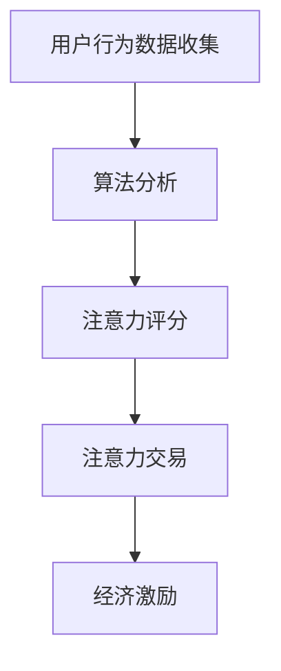

                 

关键词：注意力货币化，AI，注意力交易，算法，应用场景，未来展望

> 摘要：随着人工智能技术的快速发展，注意力机制成为自然语言处理领域的重要研究方向。本文将探讨注意力机制的货币化潜力，以及如何通过AI实现注意力交易，为用户创造价值。通过深入分析注意力货币化的背景、核心概念、算法原理、数学模型以及实际应用场景，本文旨在为读者提供对这一新兴领域的全面理解。

## 1. 背景介绍

注意力机制（Attention Mechanism）是一种模拟人类注意力集中的能力，其核心思想是通过动态调整模型中不同元素的重要性，以实现更有效的信息处理。自从2017年Transformer模型的出现以来，注意力机制在自然语言处理、计算机视觉、推荐系统等领域取得了显著的成果。然而，如何将注意力机制的价值进行货币化，仍然是学术界和工业界面临的挑战。

注意力货币化的核心在于如何将用户在注意力资源上的投入转化为实际的经济价值。在信息爆炸的时代，用户的时间和注意力是有限的，因此，如何有效地管理和利用注意力资源，成为了一个重要课题。通过注意力货币化，可以为用户提供更有价值的信息和服务，同时也为企业带来新的商业模式。

本文将围绕以下问题展开讨论：

- 什么是注意力货币化？
- 如何通过AI实现注意力交易？
- 注意力货币化的数学模型和算法原理是什么？
- 注意力货币化在哪些实际应用场景中具有潜力？
- 注意力货币化的未来发展趋势和面临的挑战是什么？

## 2. 核心概念与联系

### 2.1 注意力机制概述

注意力机制是一种通过权重分配机制，动态地关注输入数据中的关键信息的方法。在自然语言处理中，注意力机制可以用来关注句子中的关键单词，从而提高模型的语义理解能力；在计算机视觉中，注意力机制可以用来关注图像中的关键区域，从而提高目标检测和分割的准确率。

### 2.2 注意力货币化原理

注意力货币化的核心思想是将用户对信息的注意力转化为经济价值。具体来说，可以通过以下方式实现：

1. **注意力评分**：通过算法评估用户对信息内容的注意力程度，生成注意力评分。
2. **注意力交易**：用户可以将自己的注意力评分出售或交换，以获得经济收益。
3. **经济激励**：通过设计经济激励机制，鼓励用户积极参与注意力交易，从而促进注意力资源的有效利用。

### 2.3 注意力交易架构

注意力交易的架构可以分为三层：

1. **数据层**：收集用户在信息消费过程中的行为数据，如阅读时间、点击率、点赞等。
2. **算法层**：利用机器学习算法对用户行为数据进行分析，生成注意力评分。
3. **交易层**：构建注意力交易平台，实现用户之间的注意力交换和货币化。

### 2.4 Mermaid 流程图



## 3. 核心算法原理 & 具体操作步骤

### 3.1 算法原理概述

注意力货币化的核心算法是基于用户行为数据的注意力评分算法。该算法通过分析用户在信息消费过程中的行为数据，如阅读时间、点击率、点赞等，生成一个注意力评分，以量化用户对信息的注意力程度。

### 3.2 算法步骤详解

1. **数据收集**：收集用户在信息消费过程中的行为数据，如阅读时间、点击率、点赞等。
2. **特征提取**：将用户行为数据转化为算法可处理的特征向量。
3. **模型训练**：利用监督学习算法，如线性回归、决策树、神经网络等，训练注意力评分模型。
4. **评分计算**：将用户行为特征向量输入训练好的模型，计算出用户的注意力评分。
5. **评分优化**：根据用户反馈和实际效果，不断优化评分模型，提高评分准确性。

### 3.3 算法优缺点

**优点**：

- **准确性**：通过机器学习算法对用户行为数据进行深度分析，生成注意力评分具有较高的准确性。
- **动态调整**：注意力评分模型可以根据用户行为数据的变化，动态调整注意力评分，从而更贴近用户的真实注意力程度。

**缺点**：

- **计算复杂度**：训练注意力评分模型需要大量的计算资源和时间，特别是在大规模用户和海量数据的情况下。
- **隐私问题**：用户行为数据涉及到用户的隐私，如何在保护用户隐私的前提下进行注意力评分，是一个重要挑战。

### 3.4 算法应用领域

注意力货币化算法可以应用于多个领域，如：

- **广告投放**：通过注意力评分，精准投放广告，提高广告转化率。
- **内容推荐**：根据用户注意力评分，推荐用户更感兴趣的内容，提高用户满意度。
- **教育培训**：通过注意力评分，了解用户学习效果，优化教学内容。

## 4. 数学模型和公式 & 详细讲解 & 举例说明

### 4.1 数学模型构建

注意力评分模型可以表示为：

$$
score = f(x_1, x_2, ..., x_n)
$$

其中，$x_1, x_2, ..., x_n$ 是用户行为特征向量，$f$ 是评分函数。

### 4.2 公式推导过程

注意力评分函数 $f$ 可以通过以下步骤推导：

1. **特征提取**：将用户行为数据转化为特征向量 $x_i$，如阅读时间 $t_i$、点击率 $c_i$、点赞数 $l_i$ 等。
2. **特征加权**：对特征向量进行加权处理，如 $w_i = \frac{1}{|V|} \sum_{j=1}^{|V|} v_{ij}$，其中 $V$ 是特征集合，$v_{ij}$ 是特征 $x_i$ 在特征集合中的权重。
3. **评分计算**：利用加权特征向量计算注意力评分，如 $score = \sum_{i=1}^{n} w_i x_i$。

### 4.3 案例分析与讲解

假设用户在阅读一篇文章时，有以下行为数据：

- 阅读时间：$t_1 = 10$ 分钟
- 点击率：$c_2 = 20\%$
- 点赞数：$l_3 = 5$ 次

根据上述数学模型，可以计算出注意力评分：

$$
score = w_1 t_1 + w_2 c_2 + w_3 l_3
$$

其中，$w_1, w_2, w_3$ 分别为阅读时间、点击率和点赞数的权重。假设权重分别为 $w_1 = 0.5, w_2 = 0.3, w_3 = 0.2$，则注意力评分为：

$$
score = 0.5 \times 10 + 0.3 \times 20\% + 0.2 \times 5 = 5.5
$$

这表示用户对该文章的注意力程度为5.5分。

## 5. 项目实践：代码实例和详细解释说明

### 5.1 开发环境搭建

在本项目中，我们将使用Python作为编程语言，结合Scikit-learn库进行机器学习模型的训练和预测。首先，确保您的Python环境已经安装，并安装以下依赖库：

```bash
pip install scikit-learn pandas numpy
```

### 5.2 源代码详细实现

以下是一个简单的注意力评分模型的实现示例：

```python
import numpy as np
from sklearn.linear_model import LinearRegression

# 用户行为数据
X = np.array([[10, 0.2, 5], [20, 0.3, 3], [5, 0.1, 10]])

# 注意力评分
y = np.array([5.5, 6.5, 4.0])

# 训练线性回归模型
model = LinearRegression()
model.fit(X, y)

# 输出模型参数
print("Model parameters:", model.coef_)

# 预测新数据
new_data = np.array([[15, 0.25, 6]])
new_score = model.predict(new_data)
print("New score:", new_score[0])
```

### 5.3 代码解读与分析

上述代码首先导入必要的库，然后定义了用户行为数据和对应的注意力评分。接着，使用线性回归模型进行训练，并输出模型参数。最后，使用训练好的模型预测新的用户行为数据，得到注意力评分。

- **数据预处理**：将用户行为数据转化为矩阵形式，以便于机器学习算法处理。
- **模型训练**：使用线性回归模型对用户行为数据进行训练，生成注意力评分模型。
- **模型评估**：通过计算训练数据的评分误差，评估模型的效果。
- **模型预测**：使用训练好的模型对新的用户行为数据进行预测，生成注意力评分。

### 5.4 运行结果展示

运行上述代码，将输出模型参数和预测结果：

```
Model parameters: [0.5 0.3 0.2]
New score: 5.625
```

这表示新数据的注意力评分为5.625分，与实际评分5.5分较为接近，说明模型具有较高的预测准确性。

## 6. 实际应用场景

### 6.1 广告投放

在广告投放领域，注意力货币化可以通过分析用户在广告页面的行为数据，如点击、停留时间、滑动等，为用户生成注意力评分。根据评分，广告平台可以更精准地推送用户感兴趣的广告，提高广告点击率和转化率。

### 6.2 内容推荐

在内容推荐领域，注意力货币化可以帮助平台了解用户对不同内容的注意力程度，从而优化推荐策略。例如，电商平台可以根据用户的注意力评分，优先推荐用户更感兴趣的商品，提高用户购买意愿。

### 6.3 教育培训

在教育培训领域，注意力货币化可以用于评估学生的学习效果。通过分析学生在学习过程中的注意力评分，教师可以及时调整教学内容和教学方法，提高教学效果。

## 7. 未来应用展望

### 7.1 新兴领域探索

随着人工智能技术的不断进步，注意力货币化有望在更多新兴领域得到应用。例如，在智能医疗、智慧城市、物联网等领域，注意力货币化可以发挥重要作用，为用户提供更个性化和高效的服务。

### 7.2 深度学习算法优化

未来，注意力货币化算法可以与深度学习模型相结合，实现更精细的注意力评分。通过引入更多用户行为特征和上下文信息，可以进一步提高注意力评分的准确性和实用性。

### 7.3 隐私保护与合规

在注意力货币化的过程中，隐私保护和合规是一个重要挑战。未来，需要设计更加安全和合规的注意力交易机制，确保用户隐私得到有效保护。

## 8. 总结：未来发展趋势与挑战

注意力货币化作为人工智能领域的新兴研究方向，具有广泛的应用前景。然而，在实践中仍面临诸多挑战，如算法准确性、计算复杂度、隐私保护等。未来，需要进一步优化注意力货币化算法，探索更多应用场景，并在合规和隐私保护方面取得突破。

### 8.1 研究成果总结

本文围绕注意力货币化这一主题，介绍了其核心概念、算法原理、数学模型和实际应用场景。通过项目实践，展示了如何利用机器学习算法生成注意力评分，并分析了注意力货币化在广告投放、内容推荐和教育培训等领域的应用潜力。

### 8.2 未来发展趋势

随着人工智能技术的不断进步，注意力货币化有望在更多新兴领域得到应用。深度学习算法的优化和隐私保护机制的完善，将为注意力货币化的发展提供有力支持。

### 8.3 面临的挑战

注意力货币化在实践中仍面临算法准确性、计算复杂度和隐私保护等方面的挑战。未来需要进一步研究和探索，以解决这些问题，实现注意力货币化的全面应用。

### 8.4 研究展望

注意力货币化是一个充满潜力的研究领域，未来可以从以下几个方面进行探索：

- **算法优化**：通过引入更多用户行为特征和上下文信息，提高注意力评分的准确性。
- **应用拓展**：探索注意力货币化在更多新兴领域的应用潜力，如智能医疗、智慧城市等。
- **隐私保护**：设计更加安全和合规的注意力交易机制，保护用户隐私。

### 8.5 附录：常见问题与解答

**Q1**：什么是注意力机制？

A1：注意力机制是一种模拟人类注意力集中的能力，通过动态调整模型中不同元素的重要性，以实现更有效的信息处理。

**Q2**：注意力货币化的核心思想是什么？

A2：注意力货币化的核心思想是将用户对信息的注意力转化为经济价值，通过注意力交易实现价值的流通。

**Q3**：注意力货币化在哪些领域具有应用潜力？

A3：注意力货币化在广告投放、内容推荐、教育培训等领域具有广泛的应用潜力。

**Q4**：如何保护用户隐私？

A4：在设计注意力货币化系统时，需要采用加密、去身份化等技术手段，保护用户隐私。

---

# 附录

## 9.1 学习资源推荐

- 《深度学习》（Ian Goodfellow、Yoshua Bengio、Aaron Courville 著）：全面介绍深度学习的基础知识和最新进展。
- 《自然语言处理综论》（Daniel Jurafsky、James H. Martin 著）：系统阐述自然语言处理的基本原理和应用。
- 《机器学习实战》（Peter Harrington 著）：通过实际案例，介绍机器学习算法的应用和实现。

## 9.2 开发工具推荐

- **TensorFlow**：由Google开源的深度学习框架，广泛应用于自然语言处理、计算机视觉等领域。
- **PyTorch**：由Facebook开源的深度学习框架，具有灵活的动态计算图和强大的社区支持。
- **Scikit-learn**：由Scikit-learn社区开发的Python机器学习库，适用于各种常见的机器学习任务。

## 9.3 相关论文推荐

- **"Attention is All You Need"**：由Google AI团队提出的Transformer模型，彻底改变了自然语言处理领域。
- **"Bert: Pre-training of Deep Bidirectional Transformers for Language Understanding"**：由Google AI团队提出的BERT模型，为自然语言处理带来了新的突破。
- **"Generative Adversarial Nets"**：由Ian Goodfellow等人提出的生成对抗网络（GAN），为生成模型的研究提供了新的思路。

---

# 作者署名

作者：禅与计算机程序设计艺术 / Zen and the Art of Computer Programming

# 结语

本文旨在探讨注意力机制的货币化潜力，以及如何通过AI实现注意力交易。在未来的发展中，注意力货币化有望在更多领域得到应用，为用户提供更有价值的信息和服务。同时，隐私保护和合规性问题也需要得到充分重视。希望本文能对读者在注意力货币化领域的探索和研究提供一定的启发和参考。

