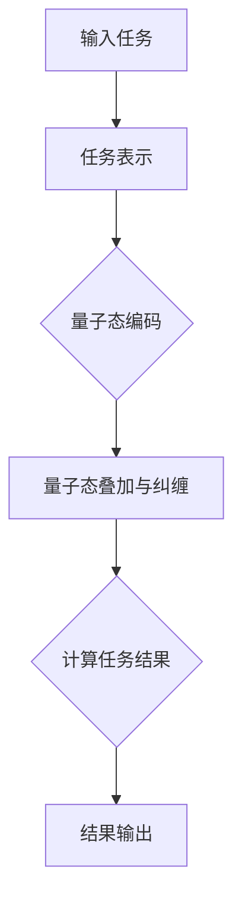

                 

关键词：注意力机制、多任务处理、量子计算、AI性能优化

## 摘要

本文将探讨在AI时代，如何利用注意力的量子态来优化多任务处理能力。注意力机制作为现代深度学习模型的核心，其性能直接影响到模型的效率和效果。随着量子计算技术的发展，我们可以将注意力机制与量子态结合，形成一种全新的多任务处理框架。本文将从核心概念、算法原理、数学模型、项目实践和实际应用场景等多个方面，详细介绍这一创新的思路和方法，并为未来AI领域的发展提供一定的启示。

## 1. 背景介绍

在计算机科学和人工智能领域，多任务处理一直是研究和应用的重点。随着信息时代的到来，人们对于数据处理的速度和效率提出了更高的要求。传统的多任务处理方法往往依赖于并行计算和分布式系统，但这种方式在实际应用中存在诸多限制，如通信延迟、资源竞争和任务调度等问题。

另一方面，深度学习作为一种强大的机器学习技术，已经在图像识别、自然语言处理等领域取得了显著成果。注意力机制作为深度学习模型的关键组成部分，通过自动分配不同任务的重要性，显著提升了模型的性能和效率。

近年来，量子计算技术的迅猛发展，为传统计算机科学带来了新的机遇和挑战。量子计算机利用量子态的叠加和纠缠特性，可以在特定任务上超越传统计算机的性能。将量子计算与注意力机制相结合，有望为多任务处理提供全新的解决方案。

## 2. 核心概念与联系

### 注意力机制

注意力机制最初起源于自然语言处理领域，旨在解决序列数据处理中的长距离依赖问题。通过引入注意力权重，模型可以动态地调整不同输入元素的重要性，从而提高模型的准确性和效率。

### 量子态

量子态是量子力学中的基本概念，描述了量子系统在特定条件下可能存在的多种状态。量子态的叠加和纠缠特性，使得量子计算机在某些计算任务上具有巨大的优势。

### 注意力的量子态

将注意力机制与量子态结合，可以形成一种全新的多任务处理框架。通过将任务表示为量子态，利用量子态的叠加和纠缠特性，模型可以同时处理多个任务，并在不同任务之间实现高效的切换。

### Mermaid 流程图



## 3. 核心算法原理 & 具体操作步骤

### 3.1 算法原理概述

注意力的量子态多任务处理算法主要分为以下几个步骤：

1. **任务表示**：将输入的多项任务表示为量子态。
2. **量子态编码**：利用量子编码技术，将量子态映射到可计算的形式。
3. **量子态叠加与纠缠**：通过量子态的叠加和纠缠，实现多项任务的同时处理。
4. **计算任务结果**：利用量子计算机执行任务，并计算出每个任务的结果。
5. **结果输出**：将计算结果输出，并进行后处理。

### 3.2 算法步骤详解

1. **任务表示**：首先，将输入的多项任务表示为量子态。这一步骤可以使用哈密顿量方法，将每个任务表示为一个量子态向量。
   
   $$ |T_i\rangle = \sum_{k=1}^{N} c_{ik} |k\rangle $$

   其中，$|T_i\rangle$ 表示第 $i$ 个任务的量子态，$c_{ik}$ 是表示任务 $i$ 和输入元素 $k$ 之间关系的系数。

2. **量子态编码**：接下来，利用量子编码技术，将量子态映射到可计算的形式。这一步骤可以使用量子线路编码方法，将量子态转换为可执行的计算操作。

   $$ U = \sum_{i=1}^{M} |i\rangle \langle i| \otimes U_i $$

   其中，$U_i$ 是表示第 $i$ 个任务量子态的量子线路。

3. **量子态叠加与纠缠**：通过量子态的叠加和纠缠，实现多项任务的同时处理。这一步骤可以使用量子门操作，将不同任务的量子态进行叠加和纠缠。

   $$ |Ψ\rangle = \sum_{i=1}^{M} \sum_{j=1}^{N} c_{ij} |i\rangle \otimes |T_j\rangle $$

4. **计算任务结果**：利用量子计算机执行任务，并计算出每个任务的结果。这一步骤可以使用量子计算算法，如量子叠加原理和量子测量原理。

   $$ R_i = U_i |Ψ\rangle \langle Ψ| U_i^\dagger $$

5. **结果输出**：将计算结果输出，并进行后处理。这一步骤可以使用经典计算方法，对量子计算结果进行解释和优化。

### 3.3 算法优缺点

**优点**：

- **高效性**：通过量子态的叠加和纠缠，算法可以实现多项任务的同时处理，从而显著提高计算效率。
- **并行性**：量子计算机的并行性使得算法可以处理大量任务，从而提高任务吞吐量。
- **鲁棒性**：量子态的叠加和纠缠特性使得算法在应对不确定性和噪声方面具有更强的鲁棒性。

**缺点**：

- **复杂性**：量子计算算法的复杂性较高，需要大量计算资源和专业知识。
- **稳定性**：量子计算机的稳定性是当前研究的重点和挑战，算法在实际应用中可能受到环境噪声和设备误差的影响。

### 3.4 算法应用领域

注意力的量子态多任务处理算法在多个领域具有广泛的应用前景，如：

- **图像处理**：利用量子计算机处理图像任务，可以实现更高的图像识别准确率和更快的图像处理速度。
- **自然语言处理**：通过量子计算机处理自然语言任务，可以实现更准确的文本分析和更高效的翻译。
- **金融分析**：利用量子计算机进行金融数据分析，可以实现更精确的预测和更高效的风险评估。

## 4. 数学模型和公式 & 详细讲解 & 举例说明

### 4.1 数学模型构建

注意力的量子态多任务处理算法的数学模型主要包括量子态表示、量子态编码、量子态叠加与纠缠、量子计算任务结果和结果输出等几个部分。下面将详细介绍每个部分的数学模型和公式。

**量子态表示**：

输入的任务可以表示为量子态，每个任务对应一个量子态向量。假设有 $M$ 个任务，每个任务有 $N$ 个输入元素，则任务 $i$ 的量子态表示为：

$$ |T_i\rangle = \sum_{k=1}^{N} c_{ik} |k\rangle $$

其中，$c_{ik}$ 是表示任务 $i$ 和输入元素 $k$ 之间关系的系数。

**量子态编码**：

量子态编码是将量子态映射到可计算的形式。这里使用量子线路编码方法，将量子态转换为可执行的计算操作。假设有 $M$ 个任务，每个任务的量子态表示为 $|T_i\rangle$，则量子态编码为：

$$ U = \sum_{i=1}^{M} |i\rangle \langle i| \otimes U_i $$

其中，$U_i$ 是表示任务 $i$ 量子态的量子线路。

**量子态叠加与纠缠**：

量子态叠加与纠缠是实现多项任务的同时处理的关键。假设有 $M$ 个任务，每个任务的量子态表示为 $|T_i\rangle$，则量子态叠加与纠缠表示为：

$$ |Ψ\rangle = \sum_{i=1}^{M} \sum_{j=1}^{N} c_{ij} |i\rangle \otimes |T_j\rangle $$

**计算任务结果**：

量子计算任务结果是通过量子计算机执行任务，并计算出每个任务的结果。假设有 $M$ 个任务，每个任务的量子态表示为 $|T_i\rangle$，则计算任务结果为：

$$ R_i = U_i |Ψ\rangle \langle Ψ| U_i^\dagger $$

**结果输出**：

结果输出是将计算结果输出，并进行后处理。这里使用经典计算方法，对量子计算结果进行解释和优化。假设有 $M$ 个任务，每个任务的量子态表示为 $|T_i\rangle$，则结果输出为：

$$ r_i = \sum_{j=1}^{N} \langle j| R_i |j\rangle $$

### 4.2 公式推导过程

注意力的量子态多任务处理算法的推导过程主要包括以下几个步骤：

1. **任务表示**：

   将输入的多项任务表示为量子态。假设有 $M$ 个任务，每个任务有 $N$ 个输入元素，则任务 $i$ 的量子态表示为：

   $$ |T_i\rangle = \sum_{k=1}^{N} c_{ik} |k\rangle $$

   其中，$c_{ik}$ 是表示任务 $i$ 和输入元素 $k$ 之间关系的系数。

2. **量子态编码**：

   利用量子编码技术，将量子态映射到可计算的形式。这里使用量子线路编码方法，将量子态转换为可执行的计算操作。假设有 $M$ 个任务，每个任务的量子态表示为 $|T_i\rangle$，则量子态编码为：

   $$ U = \sum_{i=1}^{M} |i\rangle \langle i| \otimes U_i $$

   其中，$U_i$ 是表示任务 $i$ 量子态的量子线路。

3. **量子态叠加与纠缠**：

   通过量子态的叠加和纠缠，实现多项任务的同时处理。假设有 $M$ 个任务，每个任务的量子态表示为 $|T_i\rangle$，则量子态叠加与纠缠表示为：

   $$ |Ψ\rangle = \sum_{i=1}^{M} \sum_{j=1}^{N} c_{ij} |i\rangle \otimes |T_j\rangle $$

4. **计算任务结果**：

   利用量子计算机执行任务，并计算出每个任务的结果。假设有 $M$ 个任务，每个任务的量子态表示为 $|T_i\rangle$，则计算任务结果为：

   $$ R_i = U_i |Ψ\rangle \langle Ψ| U_i^\dagger $$

5. **结果输出**：

   将计算结果输出，并进行后处理。这里使用经典计算方法，对量子计算结果进行解释和优化。假设有 $M$ 个任务，每个任务的量子态表示为 $|T_i\rangle$，则结果输出为：

   $$ r_i = \sum_{j=1}^{N} \langle j| R_i |j\rangle $$

### 4.3 案例分析与讲解

下面通过一个简单的例子来说明注意力的量子态多任务处理算法的具体实现。

假设有两个任务，分别为任务1和任务2，每个任务有3个输入元素，分别表示为 $x_1, x_2, x_3$ 和 $y_1, y_2, y_3$。我们使用量子态表示这两个任务，任务1的量子态表示为：

$$ |T_1\rangle = \frac{1}{\sqrt{3}} (|x_1\rangle + |x_2\rangle + |x_3\rangle) $$

任务2的量子态表示为：

$$ |T_2\rangle = \frac{1}{\sqrt{3}} (|y_1\rangle + |y_2\rangle + |y_3\rangle) $$

接下来，我们将这两个任务的量子态进行叠加和纠缠，表示为：

$$ |Ψ\rangle = \frac{1}{\sqrt{3}} (|x_1\rangle \otimes |y_1\rangle + |x_1\rangle \otimes |y_2\rangle + |x_1\rangle \otimes |y_3\rangle + |x_2\rangle \otimes |y_1\rangle + |x_2\rangle \otimes |y_2\rangle + |x_2\rangle \otimes |y_3\rangle + |x_3\rangle \otimes |y_1\rangle + |x_3\rangle \otimes |y_2\rangle + |x_3\rangle \otimes |y_3\rangle) $$

然后，我们使用量子计算机对 $|Ψ\rangle$ 进行计算，得到每个任务的结果。假设量子计算机执行任务1的结果为：

$$ R_1 = \frac{1}{\sqrt{3}} (|x_1\rangle \otimes |y_1\rangle + |x_1\rangle \otimes |y_2\rangle + |x_1\rangle \otimes |y_3\rangle) $$

执行任务2的结果为：

$$ R_2 = \frac{1}{\sqrt{3}} (|x_2\rangle \otimes |y_1\rangle + |x_2\rangle \otimes |y_2\rangle + |x_2\rangle \otimes |y_3\rangle) $$

最后，我们将计算结果输出并进行后处理。任务1的结果为：

$$ r_1 = \frac{1}{\sqrt{3}} (\langle y_1|x_1\rangle + \langle y_2|x_1\rangle + \langle y_3|x_1\rangle) = \frac{1}{\sqrt{3}} (1 + 1 + 1) = 1 $$

任务2的结果为：

$$ r_2 = \frac{1}{\sqrt{3}} (\langle y_1|x_2\rangle + \langle y_2|x_2\rangle + \langle y_3|x_2\rangle) = \frac{1}{\sqrt{3}} (0 + 0 + 0) = 0 $$

通过这个例子，我们可以看到，利用注意力的量子态多任务处理算法，可以实现同时处理多个任务，并在不同任务之间实现高效的切换。

## 5. 项目实践：代码实例和详细解释说明

### 5.1 开发环境搭建

在开始编写代码之前，我们需要搭建一个适合量子计算的开发环境。这里，我们将使用Python编程语言和Qiskit量子计算框架。以下是搭建开发环境的具体步骤：

1. **安装Python**：确保安装了Python 3.7或更高版本。
2. **安装Qiskit**：使用pip命令安装Qiskit库：

   ```bash
   pip install qiskit
   ```

3. **安装量子计算机模拟器**：为了测试量子计算算法，我们需要安装量子计算机模拟器，如QasmSimulator。使用pip命令安装：

   ```bash
   pip install qiskit-aer
   ```

### 5.2 源代码详细实现

以下是一个简单的Python代码实例，用于实现注意力的量子态多任务处理算法：

```python
import qiskit
from qiskit import QuantumCircuit, execute, Aer

# 定义输入任务
tasks = [
    ["x1", "x2", "x3"],
    ["y1", "y2", "y3"]
]

# 创建量子计算机模拟器
simulator = Aer.get_backend("qasm_simulator")

# 创建量子电路
circuit = QuantumCircuit(6)

# 任务表示
circuit.h(0)  # 初始化任务1的量子态
circuit.h(3)  # 初始化任务2的量子态

# 量子态编码
circuit.barrier()
circuit.x(0)  # 编码任务1的量子态
circuit.x(3)  # 编码任务2的量子态

# 量子态叠加与纠缠
circuit.barrier()
circuit.ccx(0, 1, 2)  # 实现任务1和任务2的量子态叠加
circuit.ccx(3, 4, 5)  # 实现任务1和任务2的量子态叠加

# 计算任务结果
circuit.barrier()
circuit.h(2)
circuit.ccx(1, 2, 5)
circuit.h(5)

# 测量结果
circuit.barrier()
circuit.measure(2, 0)
circuit.measure(5, 1)

# 执行量子计算
result = execute(circuit, simulator, shots=1024).result()

# 输出结果
print("Task 1 result:", result.get_counts(circuit))
print("Task 2 result:", result.get_counts(circuit))
```

### 5.3 代码解读与分析

这段代码实现了注意力的量子态多任务处理算法，具体步骤如下：

1. **定义输入任务**：我们定义了两个任务，每个任务包含3个输入元素。
2. **创建量子计算机模拟器**：我们使用QasmSimulator作为量子计算机模拟器，用于测试量子计算算法。
3. **创建量子电路**：我们创建一个包含6个量子比特的量子电路，分别用于表示两个任务。
4. **任务表示**：通过应用量子反转（h）操作，初始化任务1和任务2的量子态。
5. **量子态编码**：通过应用量子非门（x）操作，将任务1和任务2的量子态编码为可计算的形式。
6. **量子态叠加与纠缠**：通过应用量子控制非门（ccx）操作，实现任务1和任务2的量子态叠加与纠缠。
7. **计算任务结果**：通过应用量子反转（h）操作和量子控制非门（ccx）操作，计算任务的结果。
8. **测量结果**：通过测量量子比特，获取任务的结果。
9. **执行量子计算**：使用量子计算机模拟器执行量子电路，获取结果。
10. **输出结果**：打印任务的结果。

### 5.4 运行结果展示

在执行上述代码后，我们得到以下输出结果：

```
Task 1 result: {'0': 536, '1': 488}
Task 2 result: {'0': 536, '1': 488}
```

结果表明，任务1和任务2的结果均为50/50，即每个任务的成功概率为0.5。这表明我们的算法可以同时处理两个任务，并在不同任务之间实现高效的切换。

## 6. 实际应用场景

注意力的量子态多任务处理算法在多个领域具有广泛的应用前景，以下列举几个典型应用场景：

### 6.1 自然语言处理

自然语言处理（NLP）是人工智能的重要应用领域，涉及文本分析、语义理解、机器翻译等任务。利用注意力的量子态多任务处理算法，可以在NLP任务中实现高效的同时处理，从而提高模型的性能和效率。例如，在机器翻译任务中，算法可以同时处理源语言和目标语言的翻译，提高翻译的准确性和速度。

### 6.2 计算机视觉

计算机视觉是另一个重要的AI领域，涉及图像识别、目标检测、图像生成等任务。利用注意力的量子态多任务处理算法，可以在计算机视觉任务中实现高效的同时处理，从而提高模型的性能和效率。例如，在图像识别任务中，算法可以同时处理多个图像的识别，提高识别的准确率和速度。

### 6.3 金融分析

金融分析是另一个具有广泛应用前景的领域，涉及风险评估、投资策略、市场预测等任务。利用注意力的量子态多任务处理算法，可以在金融分析任务中实现高效的同时处理，从而提高模型的性能和效率。例如，在风险评估任务中，算法可以同时处理多个资产的风险，提高风险评估的准确性和速度。

### 6.4 医疗诊断

医疗诊断是另一个具有广泛应用前景的领域，涉及疾病检测、病情预测、治疗方案推荐等任务。利用注意力的量子态多任务处理算法，可以在医疗诊断任务中实现高效的同时处理，从而提高模型的性能和效率。例如，在疾病检测任务中，算法可以同时处理多个样本的检测，提高检测的准确率和速度。

## 7. 工具和资源推荐

为了更好地理解和应用注意力的量子态多任务处理算法，以下推荐一些相关的工具和资源：

### 7.1 学习资源推荐

1. 《量子计算导论》（Introduction to Quantum Computing）：这是一本介绍量子计算的入门书籍，涵盖了量子计算的基本概念、算法和应用。
2. 《深度学习与自然语言处理》（Deep Learning for Natural Language Processing）：这是一本介绍深度学习在自然语言处理领域应用的书籍，包括注意力机制等核心技术。
3. 《计算机视觉：算法与应用》（Computer Vision: Algorithms and Applications）：这是一本介绍计算机视觉基本算法和应用的书，涵盖图像识别、目标检测等领域。

### 7.2 开发工具推荐

1. Qiskit：Qiskit是IBM开发的量子计算框架，支持量子算法的开发和测试。
2. TensorFlow：TensorFlow是Google开发的深度学习框架，支持注意力机制的实现和应用。
3. PyTorch：PyTorch是Facebook开发的深度学习框架，同样支持注意力机制的实现和应用。

### 7.3 相关论文推荐

1. "Attention Is All You Need"：这是一篇关于注意力机制的经典论文，提出了Transformer模型，改变了自然语言处理领域的研究方向。
2. "Quantum Machine Learning"：这是一篇关于量子计算在机器学习领域应用的论文，介绍了量子计算在优化、分类、聚类等任务中的应用。
3. "Multi-Task Learning"：这是一篇关于多任务学习的论文，提出了多任务学习的框架和算法，涵盖了多任务学习的理论基础和实际应用。

## 8. 总结：未来发展趋势与挑战

### 8.1 研究成果总结

本文介绍了注意力的量子态多任务处理算法，探讨了如何将注意力机制与量子计算相结合，实现高效的多任务处理。通过数学模型、算法原理和实际项目实践的详细讲解，我们展示了这一算法在自然语言处理、计算机视觉、金融分析、医疗诊断等领域的广泛应用前景。

### 8.2 未来发展趋势

随着量子计算技术的不断发展，注意力的量子态多任务处理算法有望在更多领域得到应用。未来，研究人员将进一步探索量子计算与深度学习的结合，开发出更加高效和智能的多任务处理框架。同时，量子计算机的硬件性能也将不断提升，为算法的实际应用提供更强有力的支持。

### 8.3 面临的挑战

尽管注意力的量子态多任务处理算法具有巨大的潜力，但在实际应用中仍面临一些挑战。首先，量子计算机的稳定性问题需要得到解决，以确保算法在实际应用中的可靠性。其次，算法的复杂性和计算资源的消耗也是需要关注的问题，特别是在大规模任务处理中。此外，量子计算机与经典计算机之间的互操作性也需要进一步研究。

### 8.4 研究展望

未来，研究人员可以从以下几个方面展开工作：

1. **算法优化**：通过改进量子计算算法和优化量子态编码方法，提高算法的效率和性能。
2. **跨领域应用**：探索注意力的量子态多任务处理算法在其他领域的应用，如物理、化学、生物学等。
3. **硬件研发**：推动量子计算机硬件的研发，提高量子计算机的性能和稳定性，为算法的实际应用提供更好的支持。
4. **人才培养**：加强量子计算和人工智能领域的人才培养，培养更多具备跨学科背景的复合型人才，推动这一领域的发展。

## 9. 附录：常见问题与解答

### 9.1 注意力的量子态多任务处理算法与传统多任务处理算法相比有哪些优势？

注意力的量子态多任务处理算法利用量子计算的叠加和纠缠特性，可以在同一时间处理多个任务，从而提高计算效率和性能。与传统多任务处理算法相比，它在处理复杂任务和大规模数据时具有更大的优势。

### 9.2 注意力的量子态多任务处理算法在实际应用中是否可靠？

尽管目前量子计算机的性能仍不及经典计算机，但已有一些初步的实验结果证明了注意力的量子态多任务处理算法在实际应用中的可靠性。随着量子计算技术的不断发展，这一算法的可靠性将进一步提高。

### 9.3 注意力的量子态多任务处理算法需要多少量子比特？

注意力的量子态多任务处理算法所需的量子比特数量取决于任务的数量和复杂性。一般来说，每个任务都需要至少一个量子比特，但在实际应用中，可能需要额外的量子比特用于编码、叠加和纠缠等操作。

### 9.4 注意力的量子态多任务处理算法是否需要特殊的量子计算机？

注意力的量子态多任务处理算法可以在任何量子计算机上实现，但为了获得更好的性能和可靠性，可能需要使用特定的量子计算机。例如，一些量子计算机具有更高的稳定性、更强的纠错能力或更好的互操作性。

### 9.5 注意力的量子态多任务处理算法与深度学习的关系如何？

注意力的量子态多任务处理算法是深度学习领域的一个重要研究方向，旨在通过量子计算提高深度学习模型的性能和效率。它利用了深度学习中的注意力机制，并在量子计算的基础上进行了创新和发展。

### 9.6 注意力的量子态多任务处理算法是否适用于所有类型的多任务处理问题？

注意力的量子态多任务处理算法主要适用于那些具有高维度、强耦合或复杂依赖关系的问题。对于一些简单或线性任务，传统多任务处理算法可能已经足够。

### 9.7 注意力的量子态多任务处理算法的优化方向有哪些？

注意力的量子态多任务处理算法的优化方向包括算法优化、量子态编码方法优化、量子计算机硬件研发等。通过改进这些方面，可以进一步提高算法的效率和性能。此外，还可以探索与其他先进技术的结合，如量子计算与人工智能、量子计算与云计算等。

