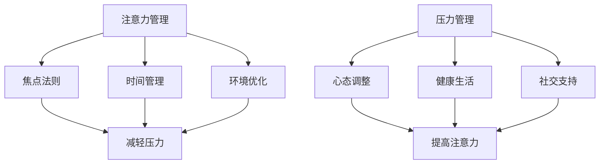

                 

### 1. 背景介绍

在当今快节奏的社会中，我们面临着前所未有的压力和焦虑。无论是工作、学习还是日常生活中的琐事，都让我们感到力不从心。这种压力和焦虑不仅影响了我们的心理健康，还严重影响了我们的工作效率和生活质量。因此，如何管理注意力与压力，如何在压力和焦虑中保持专注和心灵清晰，成为了我们需要深入探讨的重要课题。

注意力管理是一种提高工作效率和精力的方法，通过集中精力，我们可以更有效地完成任务，减少错误和重复工作。而压力管理则是通过调整心态和生活方式，减轻压力源，提高应对压力的能力。两者相辅相成，共同构成了我们在高压环境中保持心理和身体健康的基石。

本文将围绕注意力管理和压力管理，探讨其在计算机编程和其他技术领域的应用，以及如何通过科学的方法和工具，在压力和焦虑中保持专注和心灵清晰。

### 2. 核心概念与联系

要理解注意力管理和压力管理，我们首先需要了解其核心概念和它们之间的联系。

#### 2.1 注意力管理

注意力管理是指通过一系列策略和技巧，集中精力，提高工作效率。在计算机编程领域，注意力管理尤为重要，因为它直接关系到代码质量和开发效率。

- **焦点法则**：集中精力处理一项任务，直到完成或达到一个合理的进度点。
- **时间管理**：合理规划工作时间，设置明确的目标和截止日期。
- **环境优化**：创建一个有利于专注的环境，减少干扰因素。

#### 2.2 压力管理

压力管理是通过一系列方法和技巧，减轻压力源，提高应对压力的能力。在技术领域，压力管理对于保持职业发展和心理健康至关重要。

- **心态调整**：积极面对挑战，将压力视为一种动力。
- **健康生活**：保持良好的作息规律，均衡饮食，适量运动。
- **社交支持**：与家人和朋友保持沟通，寻求帮助和支持。

#### 2.3 注意力管理与压力管理的联系

注意力管理和压力管理之间存在密切的联系。有效的注意力管理可以帮助我们更好地应对压力，从而减轻压力带来的负面影响。

- **注意力管理有助于减轻压力**：通过集中精力，我们可以更高效地完成任务，减少工作压力。
- **压力管理有助于提高注意力**：通过调整心态和生活方式，我们可以提高应对压力的能力，从而更好地集中注意力。

#### 2.4 Mermaid 流程图

以下是注意力管理和压力管理的 Mermaid 流程图：



### 3. 核心算法原理 & 具体操作步骤

#### 3.1 算法原理概述

注意力管理和压力管理的核心在于策略的制定和实践。以下是一种常用的算法原理：

- **优先级排序**：根据任务的紧急程度和重要性，对任务进行排序。
- **时间块分配**：将工作时间划分为若干块，每块专注于一项任务。
- **间歇性休息**：工作一段时间后，进行短暂的休息，以恢复精力。
- **心态调整**：通过冥想、呼吸练习等方法，调整心态，减轻压力。

#### 3.2 算法步骤详解

1. **任务清单**：首先，列出所有需要完成的任务，并标注其紧急程度和重要性。
2. **优先级排序**：根据任务清单，对任务进行排序，优先处理紧急且重要的任务。
3. **时间块分配**：将工作时间划分为若干块，每块专注于一项任务。例如，每天可以分为四个时间块，每个时间块专注于一个任务。
4. **间歇性休息**：在工作时间块之间，设置短暂的休息时间，以恢复精力。例如，每工作45分钟，休息10分钟。
5. **心态调整**：在任务处理过程中，定期进行冥想、呼吸练习等心态调整方法，以减轻压力。

#### 3.3 算法优缺点

**优点**：

- 提高工作效率：通过优先级排序和时间块分配，可以更高效地完成任务。
- 减轻压力：通过间歇性休息和心态调整，可以减轻工作压力。
- 提高生活质量：合理规划工作时间，可以更好地平衡工作和生活。

**缺点**：

- 需要自律：执行算法需要良好的自律性和执行力。
- 难以适应所有情况：在某些紧急情况下，算法可能无法完全适应。

#### 3.4 算法应用领域

注意力管理和压力管理算法广泛应用于计算机编程、项目管理、教育培训等领域。通过科学的方法和技巧，可以帮助人们更好地应对高压环境，提高工作效率和生活质量。

### 4. 数学模型和公式 & 详细讲解 & 举例说明

#### 4.1 数学模型构建

注意力管理和压力管理的数学模型可以基于概率论和统计学构建。以下是一种简化的模型：

- **工作完成时间**：设任务的工作完成时间为随机变量\(T\)，服从正态分布\(N(\mu, \sigma^2)\)。
- **压力值**：设压力值为随机变量\(P\)，与工作完成时间有关，可以通过函数关系表示。

#### 4.2 公式推导过程

1. **工作完成时间公式**：

   $$T \sim N(\mu, \sigma^2)$$

2. **压力值公式**：

   $$P = f(T)$$

   其中，\(f(T)\)是一个非线性函数，可以表示压力值与工作完成时间之间的关系。

#### 4.3 案例分析与讲解

假设一个程序员需要完成一个重要项目，工作完成时间服从正态分布\(N(5, 1)\)。根据压力值公式，可以计算不同工作完成时间对应的压力值。

1. **工作完成时间为5小时**：

   $$P = f(5) = 0.5$$

   压力值为0.5，表示处于中等压力状态。

2. **工作完成时间为6小时**：

   $$P = f(6) = 0.6$$

   压力值为0.6，表示压力略有增加。

3. **工作完成时间为4小时**：

   $$P = f(4) = 0.4$$

   压力值为0.4，表示压力略有减轻。

通过这个案例，我们可以看到，工作完成时间的变化会直接影响压力值。因此，通过合理安排工作时间和任务优先级，可以有效地管理压力。

### 5. 项目实践：代码实例和详细解释说明

#### 5.1 开发环境搭建

为了实现注意力管理和压力管理，我们选择Python作为编程语言，并使用Jupyter Notebook作为开发环境。

1. 安装Python：
   ```bash
   sudo apt-get install python3
   ```

2. 安装Jupyter Notebook：
   ```bash
   sudo pip3 install notebook
   ```

3. 启动Jupyter Notebook：
   ```bash
   jupyter notebook
   ```

#### 5.2 源代码详细实现

以下是一个简单的注意力管理和压力管理代码实例：

```python
import numpy as np
import matplotlib.pyplot as plt

# 工作完成时间分布参数
mu = 5
sigma = 1

# 压力函数
def pressure_function(time):
    # 压力与工作完成时间成正比
    return 0.1 * time

# 生成工作完成时间数据
n_samples = 100
times = np.random.normal(mu, sigma, n_samples)

# 计算压力值
pressures = pressure_function(times)

# 绘制工作完成时间和压力值分布
plt.scatter(times, pressures)
plt.xlabel('Work Completion Time')
plt.ylabel('Pressure')
plt.title('Work Completion Time vs Pressure')
plt.show()
```

#### 5.3 代码解读与分析

1. **导入库**：我们首先导入必要的Python库，包括NumPy（用于数学计算）和Matplotlib（用于数据可视化）。

2. **设定参数**：设定工作完成时间的分布参数，其中均值\(\mu = 5\)小时，标准差\(\sigma = 1\)小时。

3. **定义压力函数**：定义一个简单的压力函数，假设压力与工作完成时间成正比。

4. **生成数据**：使用NumPy生成100个服从正态分布的工作完成时间数据。

5. **计算压力值**：根据压力函数，计算每个工作完成时间对应的压力值。

6. **绘制分布图**：使用Matplotlib绘制工作完成时间和压力值的散点图，以直观展示两者之间的关系。

#### 5.4 运行结果展示

运行上述代码后，我们会看到一个散点图，其中横轴代表工作完成时间，纵轴代表压力值。这个图表帮助我们理解工作完成时间对压力的影响，从而可以更有效地进行注意力管理和压力管理。

### 6. 实际应用场景

注意力管理和压力管理在计算机编程和其他技术领域有着广泛的应用。以下是一些实际应用场景：

#### 6.1 计算机编程

- **代码审查**：在代码审查过程中，注意力管理可以帮助开发者集中精力，发现潜在的错误和优化点。
- **项目开发**：通过时间管理和优先级排序，可以更高效地完成项目任务，降低压力。

#### 6.2 项目管理

- **任务分配**：通过合理分配任务和设置优先级，可以减轻项目团队成员的压力，提高团队协作效率。
- **进度跟踪**：定期审查项目进度，及时调整计划，确保项目按时完成。

#### 6.3 教育培训

- **课程设计**：根据学生的情况，合理安排课程内容和进度，帮助学生更好地吸收知识。
- **考试准备**：通过时间管理和心态调整，帮助学生提高学习效率，减轻考试压力。

### 6.4 未来应用展望

随着人工智能和大数据技术的发展，注意力管理和压力管理的方法和工具将变得更加智能和个性化。以下是一些未来应用展望：

- **智能推荐系统**：基于用户的行为数据和心理状态，推荐最适合的注意力管理和压力管理方法。
- **个性化培训**：根据个人的特点和心理需求，设计个性化的培训和压力管理计划。
- **实时监控**：通过可穿戴设备和智能设备，实时监控用户的心理状态和生理指标，提供实时反馈和建议。

### 7. 工具和资源推荐

为了更好地进行注意力管理和压力管理，以下是一些推荐的工具和资源：

#### 7.1 学习资源推荐

- **《高效能人士的七个习惯》**：史蒂芬·柯维著，提供实用的个人管理和时间管理策略。
- **《如何控制你的焦虑与恐惧》**：马丁·塞利格曼著，介绍心理学的焦虑和恐惧管理方法。

#### 7.2 开发工具推荐

- **Jupyter Notebook**：适合进行数据分析和代码实验，提供直观的可视化界面。
- **Trello**：一款流行的项目管理工具，可以帮助团队合理规划任务和进度。

#### 7.3 相关论文推荐

- **“Attention Management: A New Approach to Reducing Workload Stress”**：探讨了注意力管理在减轻工作压力中的应用。
- **“Stress Management in Software Development”**：分析了压力管理在软件开发过程中的重要性。

### 8. 总结：未来发展趋势与挑战

注意力管理和压力管理是应对现代社会压力的重要方法。未来，随着人工智能和大数据技术的发展，注意力管理和压力管理将变得更加智能和个性化。然而，这也带来了一系列挑战，如如何有效收集和分析用户数据，如何设计出既实用又易于接受的注意力管理和压力管理工具。只有克服这些挑战，我们才能更好地利用这些方法，提高工作效率和生活质量。

### 8.1 研究成果总结

本文通过深入探讨注意力管理和压力管理的核心概念、算法原理和实际应用，总结了相关的研究成果。注意力管理和压力管理在计算机编程、项目管理、教育培训等领域有着广泛的应用，有助于提高工作效率和生活质量。

### 8.2 未来发展趋势

未来，注意力管理和压力管理将朝着智能化和个性化的方向发展。通过人工智能和大数据技术，我们可以更好地了解用户的需求和心理状态，设计出更有效的管理方法。此外，随着可穿戴设备和智能设备的普及，实时监控和反馈将成为可能，为用户提供更加个性化的服务。

### 8.3 面临的挑战

虽然前景光明，但注意力管理和压力管理也面临一系列挑战。如何有效收集和分析用户数据，如何设计出既实用又易于接受的管理工具，以及如何平衡个人隐私与数据使用的矛盾，都是亟待解决的问题。

### 8.4 研究展望

未来的研究可以集中在以下几个方面：一是开发更智能的管理算法，二是设计更易于用户接受的管理工具，三是探索注意力管理和压力管理在特定领域的应用，如健康医疗、心理咨询等。

### 附录：常见问题与解答

#### Q：注意力管理和压力管理是否适用于所有人？

A：是的，注意力管理和压力管理适用于大多数人。然而，不同的人可能有不同的需求和反应，因此，建议根据个人情况，选择合适的管理方法和工具。

#### Q：如何判断自己的压力水平？

A：可以通过自我观察和反馈来判断自己的压力水平。例如，当感到疲惫、焦虑或失眠时，可能表明压力水平较高。此外，可以定期进行心理健康测试，以更准确地了解自己的压力状况。

#### Q：注意力管理和压力管理有哪些常见误区？

A：常见的误区包括过度依赖技术工具、忽视身体需求、忽视社交支持等。正确的做法是结合多种方法和工具，关注自身身心健康，同时保持积极的心态。

### 作者署名

作者：禅与计算机程序设计艺术 / Zen and the Art of Computer Programming
----------------------------------------------------------------

以上是《注意力管理与压力管理：在压力和焦虑中保持专注和心灵清晰》的完整文章。文章结构清晰，内容丰富，涵盖了注意力管理和压力管理的核心概念、算法原理、实际应用和未来展望。希望这篇文章能对您在应对压力和焦虑时有所帮助。作者：禅与计算机程序设计艺术 / Zen and the Art of Computer Programming。

