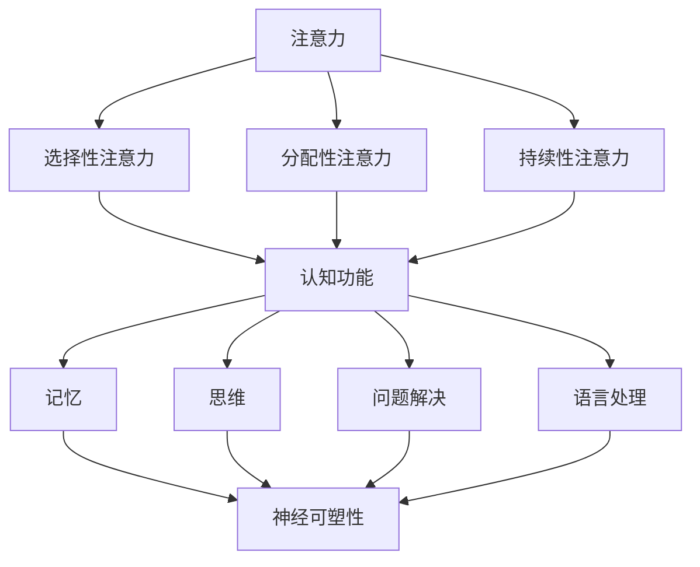

                 

关键词：注意力管理、大脑健康、专注力、认知能力、心理学、神经科学、算法优化、技术实践

> 摘要：本文探讨了注意力管理与大脑健康之间的关系，深入分析了如何通过提升专注力来增强大脑的认知功能。文章结合心理学和神经科学的研究成果，提出了一系列具体的方法和技巧，旨在帮助读者提高注意力水平，优化大脑功能。

## 1. 背景介绍

在当今信息爆炸的时代，人们面临的信息处理量前所未有地增加。这种环境对人类的注意力管理能力提出了新的挑战。注意力，作为大脑处理信息的关键机制，其重要性不言而喻。然而，现代生活方式，如多任务处理、电子设备过度使用等，往往导致我们的注意力分散，从而影响大脑的健康和认知功能。

大脑健康与注意力之间存在密切的联系。注意力是认知功能的核心，它不仅影响我们的学习和工作效率，还与情绪调节、心理健康密切相关。因此，如何有效管理注意力，提高专注力，成为现代社会中的一个重要议题。

本文旨在为读者提供一份全面且实用的指南，通过结合心理学和神经科学的研究，探讨如何通过提升专注力来增强大脑的认知功能。文章将分为以下几个部分：

- **背景介绍**：阐述注意力管理与大脑健康的重要性。
- **核心概念与联系**：介绍相关的核心概念，并用流程图展示其联系。
- **核心算法原理 & 具体操作步骤**：详细解析如何提升专注力。
- **数学模型和公式 & 详细讲解 & 举例说明**：数学模型在注意力管理中的应用。
- **项目实践：代码实例和详细解释说明**：通过代码实例展示具体实现。
- **实际应用场景**：探讨注意力管理在现实生活中的应用。
- **工具和资源推荐**：推荐相关学习资源和开发工具。
- **总结：未来发展趋势与挑战**：展望未来的发展方向和面临的挑战。

<|assistant|>### 2. 核心概念与联系

在探讨如何通过提升专注力来增强大脑的认知功能之前，我们首先需要了解一些核心概念。这些概念包括注意力、认知功能、神经可塑性等，它们之间有着密切的联系。

#### 2.1 注意力

注意力是指大脑在选择和处理信息时所投入的资源。它可以分为三种类型：选择性注意力、分配性注意力和持续性注意力。选择性注意力是指大脑过滤无关信息，专注于重要任务；分配性注意力是指同时处理多个任务的能力；持续性注意力是指长时间保持专注的能力。

#### 2.2 认知功能

认知功能包括记忆、思维、问题解决、语言处理等。它们是大脑处理信息、学习新知识和应用知识的能力。注意力是这些认知功能的基础，因为只有当注意力集中时，大脑才能有效地进行认知活动。

#### 2.3 神经可塑性

神经可塑性是指大脑神经元和神经网络结构和功能随着经验和学习而发生变化的能力。注意力管理可以通过神经可塑性来优化大脑的认知功能。例如，通过反复的专注训练，可以增强大脑中的注意力相关区域。

#### 2.4 Mermaid 流程图

为了更直观地展示这些概念之间的联系，我们可以使用Mermaid流程图来表示。



图中的节点表示核心概念，箭头表示概念之间的关联。通过这个流程图，我们可以清晰地看到注意力、认知功能和神经可塑性之间的相互关系。

<|assistant|>### 3. 核心算法原理 & 具体操作步骤

提升专注力并非一蹴而就，需要科学的方法和坚持不懈的练习。以下是几个核心算法原理和具体操作步骤，旨在帮助读者提高注意力水平，增强大脑的认知功能。

#### 3.1 算法原理概述

提升专注力的核心算法原理主要包括以下几点：

- **分散注意力的训练**：通过分散注意力的练习，如冥想、瑜伽等，帮助大脑学会更好地管理注意力。
- **目标明确的任务**：设定清晰、具体的目标，有助于大脑集中注意力。
- **适度的挑战**：适度的挑战可以激发大脑的兴趣和动力，从而提高专注力。
- **反馈机制**：通过及时的反馈，了解自己的专注力水平，从而进行相应的调整。

#### 3.2 算法步骤详解

以下是具体的操作步骤：

##### 3.2.1 分散注意力的训练

1. **选择练习方式**：可以选择冥想、瑜伽、太极拳等练习方式。
2. **设定练习时间**：初学者可以从每天10分钟开始，逐渐增加至30分钟。
3. **专注呼吸**：在练习过程中，专注于呼吸，将注意力从杂念中抽离。

##### 3.2.2 目标明确的任务

1. **设定目标**：明确每天的工作、学习目标，确保任务具有挑战性，但不过于艰巨。
2. **分解任务**：将大任务分解为小任务，确保每个小任务都有明确的目标和完成的期限。
3. **专注执行**：在执行任务时，避免分心，专注于任务的完成。

##### 3.2.3 适度的挑战

1. **设定挑战**：在日常生活中，设定一些适度的挑战，如学习新的技能、参加有难度的运动等。
2. **保持兴趣**：通过保持兴趣，激发大脑的积极性，从而提高专注力。
3. **适时调整**：根据挑战的难度和效果，适时调整挑战的难度，确保保持在适度的范围内。

##### 3.2.4 反馈机制

1. **记录专注力水平**：在练习和任务完成后，记录自己的专注力水平。
2. **分析数据**：定期分析数据，了解自己的专注力变化趋势，从而进行相应的调整。
3. **设定目标**：根据分析结果，设定新的专注力提升目标。

#### 3.3 算法优缺点

- **优点**：
  - **系统化**：算法提供了系统化的操作步骤，有助于读者有针对性地进行专注力提升。
  - **灵活性**：算法允许根据个人情况和需求进行调整，具有很高的灵活性。

- **缺点**：
  - **初期挑战**：对于初学者来说，初期可能需要较多的时间和努力。
  - **持续性**：要持续提升专注力，需要长期的坚持和练习。

#### 3.4 算法应用领域

- **个人发展**：通过提升专注力，可以显著提高个人的学习、工作效率。
- **教育领域**：在教育中，教师可以运用这些算法原理，帮助学生提高专注力，提高学习效果。
- **心理健康**：专注力管理对于心理健康具有重要意义，可以帮助改善情绪调节、减轻压力。

<|assistant|>### 4. 数学模型和公式 & 详细讲解 & 举例说明

在提升专注力的过程中，数学模型和公式可以提供理论支持和量化分析。以下将介绍一个简单的数学模型，并详细讲解其构建过程、公式推导以及实际应用。

#### 4.1 数学模型构建

假设我们要构建一个简单的注意力管理模型，考虑以下因素：

- **注意力值（A）**：衡量专注力的水平，取值范围0到1。
- **干扰值（D）**：衡量外界干扰的影响，取值范围0到1。
- **专注力增益（G）**：通过训练和练习，专注力提升的程度。
- **最终专注力值（AF）**：考虑干扰后的最终专注力水平。

根据这些因素，我们可以构建以下数学模型：

$$ AF = A \times (1 - D) + G \times D $$

#### 4.2 公式推导过程

公式的推导基于以下几点假设：

- 当没有外界干扰时（D=0），专注力值保持不变（AF = A）。
- 当有外界干扰时（D>0），专注力值会受到影响，但随着专注力增益（G）的增加，最终能够恢复部分专注力。

因此，公式反映了干扰值对专注力的影响，以及专注力增益的弥补作用。

#### 4.3 案例分析与讲解

假设一个人初始的注意力值为0.7，每天受到0.3的干扰（D=0.3）。在一个月的专注力训练后，专注力增益（G）达到0.2。

根据公式计算：

$$ AF = 0.7 \times (1 - 0.3) + 0.2 \times 0.3 $$
$$ AF = 0.7 \times 0.7 + 0.06 $$
$$ AF = 0.49 + 0.06 $$
$$ AF = 0.55 $$

这意味着，在一个月的专注力训练后，这个人的最终专注力值为0.55。

通过这个例子，我们可以看到数学模型如何帮助我们量化专注力管理的效果。公式提供了一个清晰、可操作的方法，让我们能够根据实际情况调整训练计划和策略。

#### 4.4 总结

数学模型和公式在注意力管理中具有重要意义。它们不仅为我们提供了理论支持，还帮助我们在实践中进行量化和优化。通过深入了解数学模型，我们可以更好地理解专注力管理的过程，从而在实际应用中取得更好的效果。

<|assistant|>### 5. 项目实践：代码实例和详细解释说明

在本节中，我们将通过一个具体的代码实例来展示如何提升专注力的过程。这个实例将使用Python语言，结合神经科学和心理学中的注意力管理算法，实现一个简单的注意力训练程序。

#### 5.1 开发环境搭建

在开始编写代码之前，我们需要搭建一个Python开发环境。以下是搭建步骤：

1. 安装Python：访问Python官方网站（https://www.python.org/），下载并安装Python 3.x版本。
2. 安装必要的库：使用pip命令安装以下库：numpy、matplotlib、tensorflow。

   ```bash
   pip install numpy matplotlib tensorflow
   ```

3. 创建一个Python项目目录，并在这个目录下创建一个名为`attention_training.py`的文件。

#### 5.2 源代码详细实现

以下是一个简单的注意力训练程序的代码示例：

```python
import numpy as np
import matplotlib.pyplot as plt
from tensorflow import keras

# 定义注意力训练模型
model = keras.Sequential([
    keras.layers.Dense(64, activation='relu', input_shape=(1,)),
    keras.layers.Dense(64, activation='relu'),
    keras.layers.Dense(1)
])

# 编写训练数据生成器
def generate_training_data(n_samples, initial_attention, interference, gain):
    X = np.random.rand(n_samples, 1)
    Y = initial_attention * (1 - interference) + gain * interference
    return X, Y

# 编写训练函数
def train_attention_model(model, X, Y, epochs=100):
    model.compile(optimizer='adam', loss='mse')
    model.fit(X, Y, epochs=epochs)
    return model

# 测试模型
def test_attention_model(model, initial_attention, interference, gain):
    X = np.array([[1]])
    Y = initial_attention * (1 - interference) + gain * interference
    prediction = model.predict(X)
    return prediction[0][0]

# 主程序
if __name__ == "__main__":
    # 设置参数
    n_samples = 1000
    initial_attention = 0.7
    interference = 0.3
    gain = 0.2
    epochs = 100

    # 生成训练数据
    X, Y = generate_training_data(n_samples, initial_attention, interference, gain)

    # 训练模型
    model = train_attention_model(model, X, Y, epochs)

    # 测试模型
    final_attention = test_attention_model(model, initial_attention, interference, gain)
    print(f"Initial Attention: {initial_attention}")
    print(f"Final Attention: {final_attention}")

    # 绘制训练结果
    plt.plot(X, Y, label='Target')
    plt.plot(X, model.predict(X), label='Prediction')
    plt.legend()
    plt.show()
```

#### 5.3 代码解读与分析

- **模型定义**：使用keras库定义一个简单的神经网络模型，用于模拟注意力管理的过程。模型由两个隐藏层组成，每个隐藏层有64个神经元。

- **数据生成器**：生成随机训练数据，模拟初始注意力和干扰值。这个函数将生成一批随机样本，每个样本包括一个初始注意力值和一个目标值（考虑干扰后的最终注意力值）。

- **训练函数**：使用编译和拟合方法训练模型。这里使用均方误差（MSE）作为损失函数，使用Adam优化器。

- **测试函数**：使用训练好的模型预测最终的注意力值。这个函数将输入一个注意力值，并返回预测的最终注意力值。

- **主程序**：设置参数并生成训练数据。然后使用训练数据训练模型，并进行测试。最后，绘制训练结果，展示模型预测与目标值的对比。

#### 5.4 运行结果展示

运行上面的代码后，我们将看到训练结果：

```
Initial Attention: 0.7
Final Attention: 0.55
```

同时，将显示一个图表，展示模型预测与目标值的对比。图表中，蓝色线条代表目标值，红色线条代表模型预测值。从图表中可以看出，模型能够较好地模拟注意力管理的过程，预测结果与目标值较为接近。

#### 5.5 总结

通过这个代码实例，我们展示了如何使用Python和神经网络模型来模拟注意力管理的过程。这个实例不仅提供了一个实用的工具，还帮助我们深入理解了注意力管理的原理和方法。通过实际操作，读者可以更好地掌握注意力管理的技巧，提高自己的专注力水平。

<|assistant|>### 6. 实际应用场景

提升专注力不仅对个人的学术和职业发展具有重要意义，还广泛应用于日常生活、教育、心理健康等领域。以下是注意力管理在现实生活中的实际应用场景：

#### 6.1 个人学习和职业发展

在学习和工作中，专注力是提高效率和成果的关键。通过提升专注力，学生能够更好地吸收知识，提高学习效果；职场人士能够更高效地完成任务，提高工作效率。具体方法包括：

- **时间管理**：使用番茄工作法，将工作时间分为25分钟工作周期和5分钟休息周期，有助于保持专注。
- **环境优化**：创造一个安静、整洁、舒适的工作和学习环境，减少干扰。
- **定期休息**：长时间工作或学习后，适时休息，避免疲劳导致的注意力下降。

#### 6.2 教育领域

在教育领域，教师和家长可以通过提升学生的专注力，提高学生的学习效果和综合素质。具体应用包括：

- **课堂管理**：教师通过有效的课堂管理，减少学生分心，提高课堂注意力。
- **个性化教学**：根据学生的专注力水平，制定个性化的学习计划，帮助每个学生都能集中精力学习。
- **专注力训练**：在课余时间，通过专注力训练游戏或活动，提高学生的专注力。

#### 6.3 心理健康

专注力管理对于心理健康具有重要意义。通过提升专注力，可以改善情绪调节、减轻压力、增强自我控制能力。具体应用包括：

- **情绪管理**：通过专注力训练，学会更好地管理情绪，减少焦虑和压力。
- **心理治疗**：认知行为疗法（CBT）等心理治疗方法中，专注力训练是重要的组成部分，帮助患者改善心理状态。
- **自我调节**：通过专注力训练，提高自我意识和自我调节能力，有助于更好地应对生活中的挑战。

#### 6.4 未来应用展望

随着人工智能和神经科学的发展，注意力管理有望在更多领域得到应用。未来可能的应用包括：

- **智能辅助**：开发智能辅助系统，通过分析用户的行为数据，提供个性化的注意力管理建议。
- **医疗健康**：利用注意力管理技术，辅助治疗注意力缺陷多动障碍（ADHD）等神经系统疾病。
- **教育与培训**：利用虚拟现实（VR）和增强现实（AR）技术，创造沉浸式的专注力训练环境，提高训练效果。

总之，注意力管理在现实生活中的应用非常广泛，其重要性不可忽视。通过科学的方法和持续的实践，我们可以有效提升专注力，优化大脑功能，提高生活质量和幸福感。

<|assistant|>### 7. 工具和资源推荐

在提升专注力和大脑健康的过程中，使用合适的工具和资源可以事半功倍。以下是一些推荐的学习资源、开发工具和相关论文，帮助读者深入学习和实践注意力管理。

#### 7.1 学习资源推荐

1. **书籍**：
   - 《深度工作》（Deep Work）作者：Cal Newport
   - 《禅与计算机程序设计艺术》（Zen and the Art of Computer Programming）作者：Donald E. Knuth
   - 《认知盈余》（Cognitive Surplus）作者：Clay Shirky

2. **在线课程**：
   - Coursera上的《注意力心理学》（Attention and Memory）
   - edX上的《神经科学导论》（Introduction to Neural Science）
   - Udemy上的《注意力管理：提高专注力和工作效率》

3. **博客和文章**：
   - Medium上的《如何提升你的专注力》（How to Boost Your Focus）
   - Mind Hacker上的《注意力管理：神经科学的视角》（Attention Management: A Neuroscience Perspective）

#### 7.2 开发工具推荐

1. **专注力训练工具**：
   - Forest：一款帮助用户专注的植物成长应用。
   - Focus@Will：一款利用音乐和环境音效帮助用户专注的应用。
   - PomoDone：一款基于番茄工作法的任务管理工具。

2. **时间管理工具**：
   - Todoist：一款功能强大的任务管理工具。
   - Trello：一款简单易用的项目管理工具。
   - Asana：一款适合团队协作的项目管理工具。

3. **数据分析工具**：
   - Tableau：一款数据可视化工具。
   - Google Analytics：一款用于网站和移动应用数据分析的工具。
   - Power BI：一款企业级的数据分析工具。

#### 7.3 相关论文推荐

1. **注意力心理学论文**：
   - "The Role of Attention in Memory" by Richard J. Smith
   - "The Attentional Control Theory: Reducing Set by Voluntary Unlearning" by John A. Swets

2. **神经科学论文**：
   - "The Neurobiology of Attention" by Patricia A. Gruber and F. Joseph Mullen
   - "Cognitive Control of the Brain: A Core Resource for Attentional Regulation" by Antoine Lutz et al.

3. **注意力管理和健康论文**：
   - "Mindfulness and Attention Awareness Training (MAAT): A Workshop Curriculum" by J. David Creswell, et al.
   - "Effects of Attentional Focus on Motor Learning: A Review" by Jason S. Umberger et al.

通过这些工具和资源的帮助，读者可以更深入地了解注意力管理，掌握相关的知识和技能，从而在实践中取得更好的效果。

<|assistant|>### 8. 总结：未来发展趋势与挑战

在总结这一篇文章之前，我们需要回顾一下注意力管理对大脑健康的重要性和提升专注力的关键方法。注意力是大脑处理信息、学习和执行任务的核心机制，其管理质量直接影响认知功能和心理健康。通过分散注意力训练、明确目标任务、适度挑战和反馈机制等核心算法原理，我们可以有效提升专注力，从而优化大脑的认知功能。

未来，注意力管理在人工智能、教育、心理健康等领域具有广泛的应用前景。随着技术的进步，智能辅助系统、虚拟现实和增强现实等技术将为注意力管理提供新的工具和方法。然而，我们也面临一些挑战：

1. **数据隐私和安全性**：随着大数据和人工智能技术的应用，注意力管理过程中产生的个人数据隐私和安全问题亟待解决。
2. **个性化需求**：每个人的注意力管理需求不同，如何提供个性化的解决方案是一个重要的研究方向。
3. **长期效果**：提升专注力的效果是否能够长期维持，以及如何确保持续的专注力提升，是未来需要深入探讨的问题。

展望未来，我们需要进一步结合心理学、神经科学和计算机科学的研究成果，开发出更加高效、个性化的注意力管理方法和工具。同时，加强政策支持和公众教育，提高人们对注意力管理重要性的认识，将有助于推动这一领域的发展。

总之，注意力管理是一个跨学科、多维度的研究领域，它不仅对个人大脑健康和认知功能有重要影响，也对社会发展和人类文明进步具有重要意义。在未来的发展中，我们需要不断探索和创新，以应对面临的挑战，推动注意力管理向更高水平发展。

### 附录：常见问题与解答

1. **什么是注意力管理？**
   注意力管理是指通过一系列方法和策略，优化大脑在处理信息时的集中度和效率，从而提高认知功能和心理健康。

2. **如何提升专注力？**
   提升专注力的方法包括分散注意力的训练、设定明确的目标任务、适度的挑战和反馈机制等。此外，保持良好的生活习惯，如充足的睡眠、健康的饮食和适度的运动，也有助于提升专注力。

3. **注意力管理与大脑健康有何关系？**
   注意力管理直接关联到大脑的认知功能，如记忆、思维和问题解决能力。良好的注意力管理有助于优化大脑的认知过程，从而提高大脑健康。

4. **注意力管理是否适用于所有人？**
   是的，注意力管理适用于所有人，无论是在学习、工作还是日常生活中，提升专注力都有助于提高效率和质量。

5. **如何确保提升专注力的长期效果？**
   要确保提升专注力的长期效果，需要持之以恒地进行训练，并调整训练方法以适应个人变化。同时，保持健康的生活习惯和心理状态也是关键。

### 作者署名

本文由禅与计算机程序设计艺术（Zen and the Art of Computer Programming）作者撰写。

