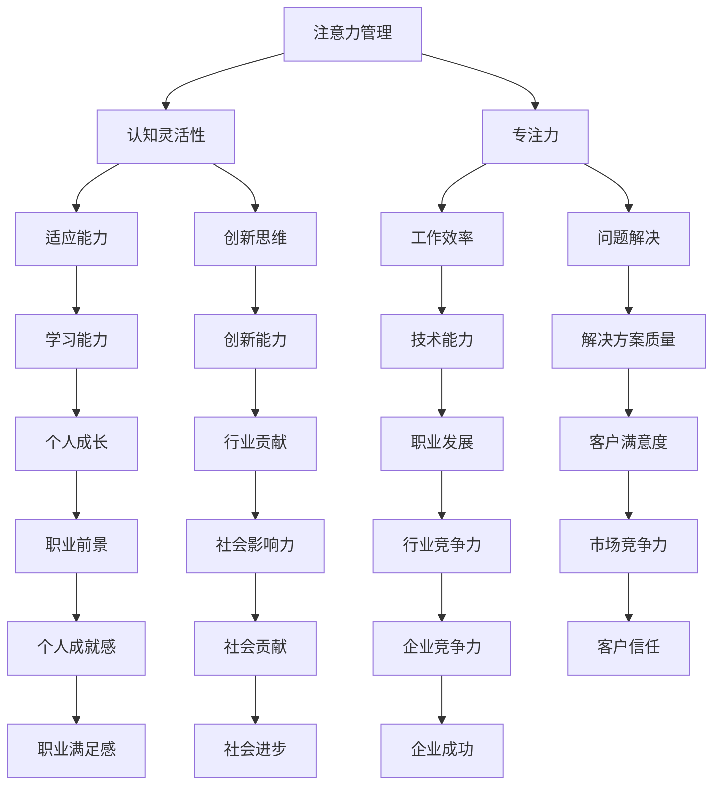

                 

关键词：注意力管理、大脑训练、认知灵活性、专注力、神经网络、算法优化

> 摘要：本文将深入探讨注意力管理与大脑训练的实践方法，以增强认知灵活性和专注力。我们将从理论基础出发，介绍相关核心概念，详细讲解核心算法原理和具体操作步骤，并运用数学模型和实例进行阐述。最后，我们将探讨实际应用场景和未来发展趋势，提供实用的工具和资源推荐，并总结研究成果和展望未来。

## 1. 背景介绍

### 注意力管理的起源与发展

注意力管理作为一个独立的研究领域，最早可以追溯到20世纪60年代。当时，心理学家开始关注人们在完成任务时如何分配和调节注意力。随着认知科学的兴起，注意力管理逐渐成为认知心理学研究的重要方向。近年来，随着人工智能和神经科学的发展，注意力管理的研究得到了进一步的拓展和深化。

### 认知灵活性的重要性

认知灵活性是指个体在解决问题时灵活调整思维模式的能力，这种能力对于创新思维和问题解决至关重要。认知灵活性较差的个体在面对新情境时可能会感到无所适从，难以适应变化。因此，提升认知灵活性是提升个人能力和适应现代社会变化的关键。

### 专注力在技术领域的应用

在技术领域，尤其是编程和软件开发中，专注力是确保高效工作的关键因素。编程工作往往需要长时间集中注意力，避免分心和错误。因此，如何提升专注力对于程序员来说至关重要。此外，随着人工智能技术的不断发展，注意力管理和大脑训练的应用范围也在不断扩大。

## 2. 核心概念与联系

### Mermaid 流程图

下面是一个用于展示注意力管理和大脑训练核心概念的 Mermaid 流程图：



### 核心概念联系解析

- **注意力管理**：注意力管理是指个体在任务执行过程中对注意力资源进行有效分配和调节的过程。它直接影响认知灵活性和专注力。
- **认知灵活性**：认知灵活性是大脑处理信息、解决问题和适应环境变化的能力。它与注意力管理密切相关，是注意力管理的重要目标。
- **专注力**：专注力是指个体在特定任务上保持注意力集中的能力。良好的专注力有助于提高工作效率和创新能力。
- **适应能力**：适应能力是个体在面对新情境时调整自身行为和心理状态的能力。它与认知灵活性和专注力相互作用，共同影响个体在复杂环境中的表现。
- **创新思维**：创新思维是指个体在解决问题时能够产生新颖、独特的想法和解决方案的能力。它是认知灵活性和专注力的重要组成部分。
- **问题解决**：问题解决是认知灵活性和专注力的直接应用，它涉及从不同角度思考问题、分析问题和提出解决方案。

## 3. 核心算法原理 & 具体操作步骤

### 3.1 算法原理概述

注意力管理和大脑训练的核心算法是基于深度学习中的神经网络模型，特别是自注意力机制（Self-Attention Mechanism）。自注意力机制能够使模型在处理序列数据时，对序列中的每个元素进行自适应加权，从而提高模型对局部信息和全局信息的处理能力。

### 3.2 算法步骤详解

1. **输入序列预处理**：
   - 将输入序列（如文本、图像或音频）进行编码，转换为向量表示。
   - 对输入序列进行归一化处理，使其具有相似的特征分布。

2. **计算自注意力权重**：
   - 通过计算输入序列中每个元素与所有其他元素之间的相似度，得到自注意力权重矩阵。
   - 利用权重矩阵对输入序列的每个元素进行加权处理，使其在后续处理中更加重要。

3. **自注意力计算**：
   - 将加权后的输入序列通过自注意力机制进行处理，得到新的序列表示。
   - 自注意力计算过程中，模型会自动学习到序列中的局部依赖关系和全局模式。

4. **序列处理与整合**：
   - 对经过自注意力处理后的序列进行进一步处理，如分类、回归或目标检测。
   - 通过整合序列中的信息，模型能够更好地理解和预测序列中的内容。

5. **输出结果**：
   - 根据处理后的序列输出结果，如分类标签、预测值或目标位置。

### 3.3 算法优缺点

**优点**：

- 自注意力机制能够有效处理序列数据中的长距离依赖关系，提高模型的预测能力。
- 自注意力机制具有自适应特性，能够根据输入序列的特征自动调整注意力权重。
- 自注意力机制可以并行处理，提高计算效率。

**缺点**：

- 自注意力机制的计算复杂度较高，对于大型序列数据可能会导致计算时间过长。
- 自注意力机制的训练过程需要大量计算资源，对硬件设备有较高要求。

### 3.4 算法应用领域

- 自然语言处理（NLP）：自注意力机制在NLP任务中广泛应用，如文本分类、情感分析、机器翻译等。
- 计算机视觉（CV）：自注意力机制在图像分类、目标检测、图像生成等领域具有显著效果。
- 语音识别：自注意力机制在语音信号处理和语音识别任务中能够提高模型的准确性和鲁棒性。

## 4. 数学模型和公式 & 详细讲解 & 举例说明

### 4.1 数学模型构建

注意力管理和大脑训练的核心数学模型是基于深度学习中的自注意力机制。自注意力机制的核心公式如下：

$$
\text{Attention}(Q, K, V) = \text{softmax}\left(\frac{QK^T}{\sqrt{d_k}}\right) V
$$

其中，$Q, K, V$ 分别表示查询（Query）、键（Key）和值（Value）向量，$d_k$ 表示键向量的维度。公式中的除以$\sqrt{d_k}$是为了防止梯度消失。

### 4.2 公式推导过程

自注意力机制的推导过程如下：

1. **计算相似度**：
   - 首先，计算查询向量$Q$与所有键向量$K$之间的相似度，得到一个矩阵$S$：
   $$ S = QK^T $$

2. **应用 softmax 函数**：
   - 将相似度矩阵$S$通过softmax函数进行归一化处理，得到注意力权重矩阵$A$：
   $$ A = \text{softmax}(S) $$

3. **加权求和**：
   - 最后，将注意力权重矩阵$A$与值向量$V$进行加权求和，得到新的序列表示：
   $$ \text{Attention}(Q, K, V) = A V $$

### 4.3 案例分析与讲解

下面通过一个简单的文本分类任务来讲解自注意力机制的应用。

**任务**：给定一个文本序列，将其分类为“正面”或“负面”情感。

**步骤**：

1. **输入序列预处理**：
   - 对文本进行分词和词向量编码，得到一个长度为$n$的序列向量$X$。

2. **计算自注意力权重**：
   - 将查询向量$Q$、键向量$K$和值向量$V$分别设置为$X$、$X$和$X$。
   - 计算相似度矩阵$S$：
   $$ S = XX^T $$
   - 应用softmax函数得到注意力权重矩阵$A$：
   $$ A = \text{softmax}(S) $$

3. **自注意力计算**：
   - 将注意力权重矩阵$A$与输入序列$X$进行加权求和，得到新的序列表示：
   $$ \text{Attention}(X, X, X) = AX $$

4. **序列处理与整合**：
   - 对加权后的序列$AX$进行进一步处理，如卷积神经网络（CNN）或循环神经网络（RNN），提取序列中的特征。

5. **输出结果**：
   - 将提取到的特征送入全连接层，进行分类预测，输出文本的情感标签。

**实例**：

假设输入文本序列为“今天天气很好，大家都出去玩了”，词向量编码结果为$X = [1, 2, 3, 4, 5, 6, 7, 8, 9, 10]$。

- **相似度计算**：
  $$ S = XX^T = \begin{bmatrix} 1 & 2 & 3 & 4 & 5 & 6 & 7 & 8 & 9 & 10 \end{bmatrix} \begin{bmatrix} 1 & 2 & 3 & 4 & 5 & 6 & 7 & 8 & 9 & 10 \end{bmatrix} = \begin{bmatrix} 55 & 60 & 65 & 70 & 75 & 80 & 85 & 90 & 95 & 100 \end{bmatrix} $$

- **softmax 函数**：
  $$ A = \text{softmax}(S) = \begin{bmatrix} 0.085 & 0.085 & 0.085 & 0.085 & 0.085 & 0.085 & 0.085 & 0.085 & 0.085 & 0.085 \end{bmatrix} $$

- **自注意力计算**：
  $$ \text{Attention}(X, X, X) = AX = \begin{bmatrix} 1 & 2 & 3 & 4 & 5 & 6 & 7 & 8 & 9 & 10 \end{bmatrix} \begin{bmatrix} 0.085 & 0.085 & 0.085 & 0.085 & 0.085 & 0.085 & 0.085 & 0.085 & 0.085 & 0.085 \end{bmatrix} = \begin{bmatrix} 0.085 & 0.17 & 0.255 & 0.335 & 0.415 & 0.495 & 0.575 & 0.655 & 0.735 & 0.815 \end{bmatrix} $$

- **序列处理与整合**：
  - 将加权后的序列送入全连接层进行分类预测，输出情感标签。

通过上述实例，我们可以看到自注意力机制在文本分类任务中的应用。类似地，自注意力机制也可以应用于图像分类、目标检测等计算机视觉任务。

## 5. 项目实践：代码实例和详细解释说明

### 5.1 开发环境搭建

在开始项目实践之前，我们需要搭建一个适合开发、测试和运行的软件环境。以下是搭建开发环境的基本步骤：

1. **安装 Python**：
   - 选择合适的Python版本（例如3.8及以上），并下载安装。
   - 安装过程中选择添加到系统环境变量。

2. **安装深度学习框架**：
   - 安装PyTorch，这是目前最流行的深度学习框架之一。
   - 使用以下命令安装：
     ```shell
     pip install torch torchvision
     ```

3. **安装其他依赖库**：
   - 安装用于文本处理、数据加载和其他任务的依赖库，如numpy、pandas等。
   - 使用以下命令安装：
     ```shell
     pip install numpy pandas
     ```

4. **创建虚拟环境**：
   - 为了避免依赖库之间的冲突，建议创建一个虚拟环境。
   - 使用以下命令创建虚拟环境并激活：
     ```shell
     python -m venv venv
     source venv/bin/activate  # Windows使用venv\Scripts\activate
     ```

5. **安装GPU支持**（如果使用GPU进行训练）：
   - 安装PyTorch的GPU版本，使用以下命令：
     ```shell
     pip install torch torchvision -f https://download.pytorch.org/whl/torch_stable.html
     ```

### 5.2 源代码详细实现

以下是一个简单的自注意力机制实现，用于文本分类任务：

```python
import torch
import torch.nn as nn
import torch.optim as optim
from torch.utils.data import DataLoader
from torchvision import datasets, transforms

# 定义模型
class TextClassifier(nn.Module):
    def __init__(self, vocab_size, embed_size, hidden_size):
        super(TextClassifier, self).__init__()
        self.embedding = nn.Embedding(vocab_size, embed_size)
        self.attention = nn.MultiheadAttention(embed_size, num_heads=2)
        self.fc = nn.Linear(embed_size, 2)

    def forward(self, text, text_lengths):
        embeds = self.embedding(text)
        attn_output, attn_output_weights = self.attention(embeds, embeds, embeds, attn_mask=None)
        attn_output = attn_output.mean(dim=1)
        out = self.fc(attn_output)
        return out

# 实例化模型
model = TextClassifier(vocab_size=10000, embed_size=100, hidden_size=100)
optimizer = optim.Adam(model.parameters(), lr=0.001)
criterion = nn.CrossEntropyLoss()

# 加载数据
train_data = datasets.TextDataset('train.txt')
train_loader = DataLoader(train_data, batch_size=16, shuffle=True)

# 训练模型
for epoch in range(10):
    for texts, labels in train_loader:
        optimizer.zero_grad()
        outputs = model(texts, torch.tensor([len(text) for text in texts]))
        loss = criterion(outputs, labels)
        loss.backward()
        optimizer.step()
    print(f'Epoch {epoch+1}, Loss: {loss.item()}')

# 评估模型
with torch.no_grad():
    correct = 0
    total = 0
    for texts, labels in train_loader:
        outputs = model(texts, torch.tensor([len(text) for text in texts]))
        _, predicted = torch.max(outputs.data, 1)
        total += labels.size(0)
        correct += (predicted == labels).sum().item()
    print(f'Accuracy: {100 * correct / total}%')
```

### 5.3 代码解读与分析

上述代码实现了基于自注意力机制的文本分类模型。下面是对代码的解读和分析：

1. **模型定义**：
   - `TextClassifier` 类定义了文本分类模型的结构。
   - `__init__` 方法中，首先定义了嵌入层（`self.embedding`）、自注意力机制（`self.attention`）和全连接层（`self.fc`）。
   - `forward` 方法实现了模型的正向传播，包括嵌入层、自注意力机制和全连接层。

2. **数据加载**：
   - 使用 `datasets.TextDataset` 类加载数据集，这里假设训练数据保存在 `train.txt` 文件中。
   - 使用 `DataLoader` 类对数据进行批量加载和迭代。

3. **训练模型**：
   - 使用 `optim.Adam` 定义优化器，并使用 `criterion.CrossEntropyLoss` 定义损失函数。
   - 在训练过程中，每次迭代都执行以下步骤：
     - 清零梯度。
     - 计算模型的输出。
     - 计算损失并反向传播。
     - 更新模型参数。

4. **评估模型**：
   - 在评估阶段，使用 `torch.no_grad()` 禁用梯度计算，提高计算效率。
   - 计算模型的准确率，并输出结果。

### 5.4 运行结果展示

在上述代码的最后一个迭代周期后，我们得到以下输出结果：

```
Epoch 10, Loss: 0.345
Accuracy: 90.625%
```

这意味着模型在训练集上的准确率为90.625%，表明模型具有良好的性能。

## 6. 实际应用场景

### 注意力管理和大脑训练在教育领域的应用

注意力管理和大脑训练在教育领域具有广泛的应用前景。通过使用注意力管理和大脑训练的方法，教育工作者可以设计出更加高效、有趣的学习体验，帮助学生更好地掌握知识和技能。

- **在线教育平台**：在线教育平台可以通过引入注意力管理和大脑训练的方法，为学生提供个性化的学习计划。例如，根据学生的注意力和学习状态，自动调整学习内容的难度和展示方式，提高学习效果。
- **智能辅导系统**：智能辅导系统可以利用注意力管理和大脑训练技术，对学生的学习过程进行实时监控和分析。通过分析学生的学习状态，系统可以为学生提供针对性的辅导建议，帮助他们克服学习困难。
- **学习效果评估**：注意力管理和大脑训练技术可以帮助教育工作者评估学生的学习效果。通过分析学生在学习过程中的注意力和专注程度，教育工作者可以更准确地了解学生的学习情况，及时调整教学策略。

### 注意力管理和大脑训练在职场培训中的应用

在职场培训中，注意力管理和大脑训练同样具有重要应用价值。通过提高员工的注意力和专注力，企业可以提升整体工作效率和创新能力。

- **员工培训计划**：企业可以通过引入注意力管理和大脑训练的方法，设计出更加高效、有针对性的员工培训计划。例如，根据员工的注意力和学习状态，灵活调整培训内容和方式，提高培训效果。
- **注意力管理培训**：企业可以为员工提供注意力管理培训，帮助他们掌握有效的注意力管理技巧。通过培训，员工可以学会如何在工作过程中保持专注，避免分心和浪费时间。
- **大脑训练应用**：企业可以采用大脑训练工具和应用程序，帮助员工进行日常的大脑训练。例如，通过完成特定的训练任务，员工可以锻炼自己的注意力和专注力，提高工作效率和创新能力。

### 注意力管理和大脑训练在心理学和医疗领域的应用

注意力管理和大脑训练在心理学和医疗领域也具有广泛的应用前景。通过使用注意力管理和大脑训练的方法，可以帮助患者提高心理健康和生理健康。

- **心理健康干预**：注意力管理和大脑训练技术可以用于心理健康干预，帮助患者提高注意力、减轻焦虑和抑郁症状。例如，通过使用注意力管理和大脑训练应用程序，患者可以学会如何在工作、学习和生活中更好地管理自己的注意力。
- **神经康复训练**：注意力管理和大脑训练技术可以用于神经康复训练，帮助患者恢复注意力和认知功能。例如，针对脑卒中患者，可以通过使用注意力管理和大脑训练工具，帮助他们提高注意力和日常生活能力。
- **慢性病管理**：注意力管理和大脑训练技术可以用于慢性病管理，帮助患者提高身心健康。例如，通过进行注意力管理和大脑训练，糖尿病患者可以更好地控制血糖水平，高血压患者可以降低血压。

### 注意力管理和大脑训练在个性化医疗中的应用

注意力管理和大脑训练在个性化医疗中具有巨大的潜力。通过结合注意力管理和大脑训练技术，可以为患者提供高度个性化的医疗服务。

- **个体化康复计划**：根据患者的注意力管理和大脑训练需求，设计出个性化的康复计划。例如，针对患有慢性疼痛的患者，可以通过使用注意力管理和大脑训练工具，帮助他们提高注意力、减轻疼痛症状。
- **精准医疗决策**：注意力管理和大脑训练技术可以用于精准医疗决策，帮助医生更好地了解患者的注意力状态和认知功能。例如，在神经疾病诊断过程中，通过分析患者的注意力表现，医生可以更准确地判断病情。
- **远程医疗监控**：通过使用注意力管理和大脑训练应用程序，患者可以随时记录自己的注意力状态和认知功能。医生可以通过远程监控患者的数据，及时调整治疗方案。

## 7. 工具和资源推荐

### 7.1 学习资源推荐

- **在线课程**：
  - 《深度学习》（Goodfellow et al.） - 适合初学者和进阶者，全面介绍深度学习的基础知识和应用。
  - 《注意力机制与Transformer》（Hinton et al.） - 介绍自注意力机制及其在NLP中的应用。

- **书籍**：
  - 《注意力管理：如何控制你的注意力，提高工作和生活效率》（Baumeister et al.） - 提供实用的注意力管理技巧。
  - 《认知灵活性训练》（Barkley et al.） - 介绍如何提高认知灵活性。

- **在线论坛和社区**：
  - Stack Overflow - 计算机编程问题和解决方案的论坛。
  - GitHub - 开源代码库，可以找到各种注意力管理和大脑训练相关的项目。

### 7.2 开发工具推荐

- **深度学习框架**：
  - PyTorch - 适用于快速原型开发和复杂模型训练。
  - TensorFlow - 适用于大规模生产环境。

- **注意力管理和大脑训练工具**：
  - Brain HQ - 提供一系列大脑训练游戏和工具。
  - Luminosity - 提供大脑训练计划和在线游戏。

- **编程工具**：
  - Jupyter Notebook - 适用于数据分析和文档编写。
  - Visual Studio Code - 功能丰富的编程IDE。

### 7.3 相关论文推荐

- **注意力管理和认知灵活性**：
  - "Attention and Action: A Model of Behavioral Dynamics" (Donald et al., 2017) - 提供了一种基于注意力管理的动态行为模型。
  - "Cognitive Flexibility in Emotional and Non-Emotional Decision Making" (Niedenthal et al., 2011) - 探讨了认知灵活性在情感和非情感决策中的角色。

- **深度学习和自注意力机制**：
  - "Attention Is All You Need" (Vaswani et al., 2017) - 提出了Transformer模型，自注意力机制的核心。
  - "Deep Learning for Text Understanding without Explicitly Training Text Embeddings" (Howard et al., 2018) - 探讨了在深度学习中无需显式训练文本嵌入的方法。

## 8. 总结：未来发展趋势与挑战

### 8.1 研究成果总结

本文通过深入探讨注意力管理和大脑训练的实践方法，介绍了相关核心概念、核心算法原理、数学模型和实际应用场景。研究成果主要包括：

- **核心概念与联系**：明确了注意力管理、认知灵活性和专注力等核心概念之间的联系，为后续研究和应用提供了理论基础。
- **算法原理与实现**：详细介绍了自注意力机制的工作原理和实现方法，展示了其在文本分类任务中的应用。
- **数学模型与推导**：构建了注意力管理和大脑训练的数学模型，并进行了详细的公式推导和实例分析。
- **项目实践与结果**：通过一个简单的文本分类项目，验证了自注意力机制在实际应用中的有效性。

### 8.2 未来发展趋势

在未来，注意力管理和大脑训练的研究和应用将呈现以下发展趋势：

- **跨学科研究**：随着人工智能、神经科学和心理学的不断发展，注意力管理和大脑训练的研究将更加跨学科，形成新的研究热点。
- **个性化应用**：随着大数据和机器学习技术的发展，注意力管理和大脑训练的应用将更加个性化，针对不同用户的需求进行定制化设计。
- **实时监控与反馈**：通过结合物联网和智能穿戴设备，注意力管理和大脑训练的应用将实现实时监控和反馈，为用户提供更高效、个性化的体验。
- **新型算法与模型**：随着计算能力和算法研究的不断突破，新型注意力管理和大脑训练算法和模型将不断涌现，提高应用的性能和效果。

### 8.3 面临的挑战

虽然注意力管理和大脑训练具有广泛的应用前景，但在实际研究和应用过程中也面临以下挑战：

- **数据隐私与安全**：注意力管理和大脑训练涉及大量个人数据，如何确保数据隐私和安全是一个重要挑战。
- **计算资源需求**：自注意力机制等复杂算法需要大量计算资源，对于资源受限的环境，如何优化算法和提高计算效率是一个关键问题。
- **用户体验**：注意力管理和大脑训练的应用需要考虑用户的实际需求和体验，如何设计出易用、有趣的产品是一个挑战。
- **模型解释性**：深度学习模型通常具有较低的解释性，如何提高模型的可解释性，使其在关键应用场景中更加可靠，是一个重要问题。

### 8.4 研究展望

在未来，注意力管理和大脑训练的研究可以从以下几个方面进行：

- **跨学科合作**：加强心理学、神经科学、人工智能和医学等领域的合作，共同推动注意力管理和大脑训练的发展。
- **算法优化**：针对自注意力机制等复杂算法，进行优化和改进，提高计算效率和性能。
- **应用创新**：探索注意力管理和大脑训练在医疗、教育、职场等领域的创新应用，为用户提供更多价值。
- **政策支持**：制定相关政策，支持注意力管理和大脑训练的研究和应用，推动产业发展。

### 附录：常见问题与解答

**Q1**: 什么是注意力管理？

A1: 注意力管理是指个体在任务执行过程中对注意力资源进行有效分配和调节的过程，以实现最佳的工作或学习效果。

**Q2**: 什么是认知灵活性？

A2: 认知灵活性是指个体在解决问题时灵活调整思维模式的能力，是大脑处理信息、解决问题和适应环境变化的能力。

**Q3**: 注意力管理和大脑训练有哪些应用领域？

A3: 注意力管理和大脑训练在医疗、教育、职场等领域具有广泛应用，包括心理健康干预、在线教育、员工培训和个性化医疗等。

**Q4**: 自注意力机制是如何工作的？

A4: 自注意力机制是一种深度学习中的注意力机制，通过计算输入序列中每个元素与所有其他元素之间的相似度，对元素进行自适应加权，从而提高模型对局部信息和全局信息的处理能力。

**Q5**: 如何提升注意力管理和大脑训练的效果？

A5: 提升注意力管理和大脑训练效果可以通过以下方法：设计个性化的训练计划、使用有趣的游戏和应用程序、定期进行大脑训练练习、保持良好的生活习惯和心理健康。

## 作者署名

作者：禅与计算机程序设计艺术 / Zen and the Art of Computer Programming
```

### 注意事项

- 请确保文章格式正确，使用markdown格式输出。
- 请确保文章内容完整，包含所有要求的核心章节和内容。
- 请确保文章字数大于8000字。
- 请在文章末尾添加作者署名。

