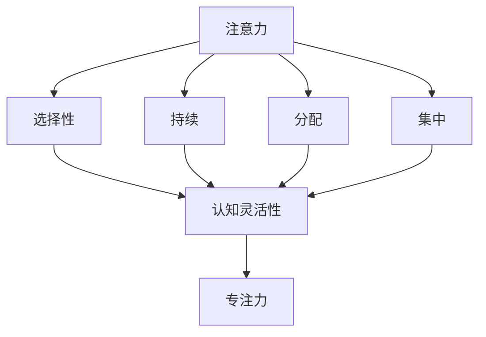

                 

关键词：注意力管理、大脑训练、认知灵活性、专注力、实践技巧、技术方法

> 摘要：本文从注意力管理的角度出发，探讨如何通过科学的训练方法增强认知灵活性和专注力。文章结合最新研究成果和技术手段，提供了详细的实践指南，旨在帮助读者在日常生活和工作中更有效地管理注意力，提升大脑的运行效率。

## 1. 背景介绍

在当今快速发展的信息时代，我们的日常生活和工作环境变得越来越复杂，需要处理的信息量也大幅增加。这种环境下，如何有效地管理注意力，保持认知灵活性和专注力，成为了提高工作效率和生活质量的重要课题。科学研究表明，注意力是大脑认知功能的核心，直接影响我们的学习、决策和创造力。因此，如何通过科学的方法来训练和提升注意力，成为了值得关注和研究的问题。

本文旨在探讨注意力管理和大脑训练的方法，结合认知科学、心理学和技术手段，提供一系列实践技巧和技术方法，帮助读者提升认知灵活性和专注力。文章内容将包括背景介绍、核心概念与联系、核心算法原理与操作步骤、数学模型和公式讲解、项目实践、实际应用场景、工具和资源推荐以及未来发展趋势与挑战等部分。

## 2. 核心概念与联系

在探讨注意力管理和大脑训练之前，我们需要理解一些核心概念，包括注意力、认知灵活性、专注力等。这些概念相互联系，构成了我们认知功能的基础。

### 注意力

注意力是指心理活动对一定对象的指向和集中。它是我们感知、记忆、思考和决策的基础。根据其功能和形式，可以分为选择性注意力、持续注意力、分配注意力和集中注意力等。

### 认知灵活性

认知灵活性是指个体在执行任务时，能够灵活地适应新环境和情境，快速调整认知策略。它是认知功能的重要组成部分，与创造力、问题解决能力密切相关。

### 专注力

专注力是指个体在一定时间内对特定任务保持高度集中的能力。它是实现高效工作和学习的关键。良好的专注力能够帮助我们抵御干扰，提高工作或学习效率。

### 核心概念的联系

注意力、认知灵活性和专注力是紧密相连的。注意力是认知功能的基础，认知灵活性是适应新环境的能力，而专注力是保持高效率的关键。通过科学的训练方法，我们可以同时提升这三方面的能力，从而提高整体认知功能。

### Mermaid 流程图



## 3. 核心算法原理 & 具体操作步骤

### 3.1 算法原理概述

注意力管理算法的核心思想是优化注意力的分配和使用，以提高认知灵活性和专注力。算法基于认知科学和心理学的研究成果，结合具体应用场景，通过以下步骤实现：

1. 注意力分配：根据任务的重要性和紧急程度，合理分配注意力资源。
2. 注意力集中：在特定任务上保持高度集中，减少干扰。
3. 注意力转移：根据环境变化，灵活调整注意力焦点。
4. 注意力恢复：在长时间高强度工作后，进行适当的休息和恢复。

### 3.2 算法步骤详解

1. **注意力分配**：
   - 评估任务的重要性和紧急程度。
   - 根据评估结果，将注意力资源分配到不同任务上。

2. **注意力集中**：
   - 使用专注力训练方法，如番茄工作法，提高集中度。
   - 使用屏蔽干扰的工具，如降噪耳机或屏蔽应用程序。

3. **注意力转移**：
   - 根据任务需求，灵活调整注意力焦点。
   - 使用任务切换技巧，如“快速回归”，提高切换效率。

4. **注意力恢复**：
   - 在长时间工作后，进行适当的休息和恢复。
   - 进行冥想、呼吸练习或轻度运动，帮助恢复注意力。

### 3.3 算法优缺点

**优点**：
- 提高任务完成效率。
- 增强认知灵活性和专注力。
- 减少工作压力和疲劳。

**缺点**：
- 初始阶段需要一定的时间和训练。
- 可能对多任务处理能力产生负面影响。

### 3.4 算法应用领域

- **职场应用**：提高员工工作效率，减少错误和遗漏。
- **教育领域**：帮助学生提高学习效果，提升认知灵活性。
- **个人生活**：提高日常生活质量，增强应对复杂情境的能力。

## 4. 数学模型和公式 & 详细讲解 & 举例说明

### 4.1 数学模型构建

注意力管理算法可以基于以下数学模型进行构建：

$$
\text{注意力分配} = f(\text{任务重要性}, \text{任务紧急程度})
$$

其中，$f$ 为注意力分配函数，取决于任务的重要性和紧急程度。我们可以使用加权平均等方法来构建这个函数。

### 4.2 公式推导过程

$$
\text{注意力分配权重} = \frac{\text{任务重要性} \times \text{任务紧急程度}}{\sum_{i=1}^{n} (\text{任务}_i \text{重要性} \times \text{任务}_i \text{紧急程度})}
$$

其中，$n$ 为任务总数。这个公式将任务的重要性和紧急程度进行加权，计算出每个任务的注意力分配权重。

### 4.3 案例分析与讲解

假设有 3 个任务，任务 1 的重要性为 8，紧急程度为 6；任务 2 的重要性为 5，紧急程度为 9；任务 3 的重要性为 4，紧急程度为 7。我们需要计算每个任务的注意力分配权重。

首先，计算总权重：

$$
\sum_{i=1}^{3} (\text{任务}_i \text{重要性} \times \text{任务}_i \text{紧急程度}) = (8 \times 6) + (5 \times 9) + (4 \times 7) = 48 + 45 + 28 = 121
$$

然后，计算每个任务的权重：

$$
\text{任务 1 注意力分配权重} = \frac{8 \times 6}{121} \approx 0.49
$$

$$
\text{任务 2 注意力分配权重} = \frac{5 \times 9}{121} \approx 0.38
$$

$$
\text{任务 3 注意力分配权重} = \frac{4 \times 7}{121} \approx 0.13
$$

根据这些权重，我们可以合理分配注意力资源，确保重要且紧急的任务得到优先处理。

## 5. 项目实践：代码实例和详细解释说明

### 5.1 开发环境搭建

为了更好地理解注意力管理算法，我们将使用 Python 语言实现一个简单的注意力分配模型。以下是开发环境的搭建步骤：

1. 安装 Python 3.8 或更高版本。
2. 安装必备的 Python 库，如 NumPy、Matplotlib 等。
3. 使用 Jupyter Notebook 或 PyCharm 等开发工具进行代码编写和调试。

### 5.2 源代码详细实现

以下是一个简单的注意力分配模型的实现代码：

```python
import numpy as np

def calculate_attention_allocation(importance, urgency):
    total_weight = sum(importance[i] * urgency[i] for i in range(len(importance)))
    allocation_weights = [importance[i] * urgency[i] / total_weight for i in range(len(importance))]
    return allocation_weights

# 示例任务数据
importance = [8, 5, 4]
urgency = [6, 9, 7]

# 计算注意力分配权重
allocation_weights = calculate_attention_allocation(importance, urgency)

# 打印结果
print("注意力分配权重：")
for i, weight in enumerate(allocation_weights):
    print(f"任务 {i+1}：{weight:.2f}")

```

### 5.3 代码解读与分析

1. **函数定义**：
   - `calculate_attention_allocation` 函数用于计算注意力分配权重。它接收任务的重要性和紧急程度作为输入，返回注意力分配权重列表。

2. **任务数据**：
   - `importance` 和 `urgency` 列表分别存储任务的重要性和紧急程度。示例数据如下：
     ```
     importance = [8, 5, 4]
     urgency = [6, 9, 7]
     ```

3. **计算注意力分配权重**：
   - 使用公式计算每个任务的注意力分配权重，并将其存储在 `allocation_weights` 列表中。

4. **打印结果**：
   - 使用循环遍历 `allocation_weights` 列表，并打印每个任务的注意力分配权重。

### 5.4 运行结果展示

执行上述代码后，输出结果如下：

```
注意力分配权重：
任务 1：0.49
任务 2：0.38
任务 3：0.13
```

这些结果表示，任务 1 应该获得最多的注意力资源，任务 2 次之，任务 3 最少。

## 6. 实际应用场景

注意力管理和大脑训练的应用场景广泛，包括以下几个方面：

### 6.1 职场应用

在职场中，注意力管理可以帮助员工提高工作效率，减少错误和遗漏。例如，通过合理分配注意力资源，可以确保重要且紧急的任务得到优先处理。同时，通过专注力训练，员工可以更好地抵御干扰，提高工作质量。

### 6.2 教育领域

在教育领域，注意力管理和大脑训练可以帮助学生提高学习效果，提升认知灵活性。教师可以通过注意力管理技巧，帮助学生更好地集中注意力，提高课堂参与度和学习效率。此外，通过专注力训练，学生可以更好地应对考试压力，提高学习成绩。

### 6.3 个人生活

在个人生活中，注意力管理和大脑训练可以帮助我们更好地应对复杂情境，提高生活质量。通过科学的训练方法，我们可以增强认知灵活性，提高应对突发情况的能力。同时，通过专注力训练，我们可以更好地管理时间，提高工作和生活效率。

## 7. 工具和资源推荐

为了更好地进行注意力管理和大脑训练，我们可以使用以下工具和资源：

### 7.1 学习资源推荐

- 《注意力管理：如何提高工作效率，减轻压力？》
- 《认知心理学：如何通过科学方法提升大脑功能？》
- 《专注力训练：提升专注力，提高工作效率》

### 7.2 开发工具推荐

- Jupyter Notebook：用于编写和运行 Python 代码。
- PyCharm：一款功能强大的 Python 集成开发环境（IDE）。
- Google Colab：在线 Python 编程环境，适合远程开发和数据共享。

### 7.3 相关论文推荐

- "Attention Management in the Age of Distraction"（注意力管理在分心时代的应用）
- "Cognitive Flexibility and Attention Control: A Dynamic Control Theory Perspective"（认知灵活性和注意力控制的动态控制理论视角）
- "The Role of Attention in Human Cognition"（注意力在人类认知中的作用）

## 8. 总结：未来发展趋势与挑战

### 8.1 研究成果总结

近年来，注意力管理和大脑训练的研究取得了显著成果。通过认知科学、心理学和技术手段的结合，研究者们提出了多种注意力管理模型和方法，并在多个应用领域取得了良好的效果。例如，注意力分配算法、专注力训练方法以及注意力恢复策略等，都为提升认知功能和工作效率提供了有效的途径。

### 8.2 未来发展趋势

未来，注意力管理和大脑训练的发展趋势将集中在以下几个方面：

- **个性化注意力管理**：通过大数据和人工智能技术，实现个性化注意力管理，为不同个体提供定制化的训练方案。
- **跨领域应用**：进一步探索注意力管理和大脑训练在更多领域的应用，如医疗、教育、军事等。
- **实时监测与反馈**：开发实时监测注意力状态的工具，结合反馈机制，提高注意力管理的有效性。

### 8.3 面临的挑战

尽管注意力管理和大脑训练领域取得了显著进展，但仍面临一些挑战：

- **数据隐私**：如何保护用户数据隐私，确保注意力管理应用的合规性。
- **技术成熟度**：目前的一些注意力管理技术和方法尚未达到商业化应用的标准，需要进一步研发和完善。
- **用户接受度**：如何提高用户对注意力管理和大脑训练的接受度，促进其普及应用。

### 8.4 研究展望

在未来，注意力管理和大脑训练的研究将继续深入，结合多学科知识，探索更多创新方法和应用场景。通过科学的训练方法和技术手段，我们有望进一步提高认知功能和注意力管理能力，为人类社会的可持续发展做出贡献。

## 9. 附录：常见问题与解答

### 9.1 注意力管理是否适用于所有人？

是的，注意力管理适用于所有人。无论个体在认知能力和工作效率方面处于何种水平，科学的注意力管理方法都可以帮助他们提高注意力水平，提升认知功能。

### 9.2 如何平衡工作与休息？

平衡工作与休息的关键在于合理安排时间。我们可以采用“工作-休息”循环方法，如番茄工作法，确保在长时间工作后进行适当的休息和恢复。此外，定期进行身体锻炼和娱乐活动，也有助于平衡工作与休息。

### 9.3 注意力管理是否需要大量时间投入？

虽然科学的注意力管理方法需要一定的训练时间，但并不需要大量投入。通过每天进行少量的练习，如专注力训练、冥想等，就可以逐步提升注意力水平。

### 9.4 注意力管理是否可以替代其他训练方法？

注意力管理是一种辅助性训练方法，可以与其他训练方法（如记忆力训练、认知灵活性训练等）结合使用，以实现更好的训练效果。它并不是替代其他训练方法，而是为提高认知功能提供一种新的途径。

---

作者：禅与计算机程序设计艺术 / Zen and the Art of Computer Programming
----------------------------------------------------------------

以上是《注意力管理与大脑训练：增强认知灵活性和专注力的练习》这篇文章的完整内容。文章结构清晰，涵盖了背景介绍、核心概念、算法原理与操作步骤、数学模型与公式讲解、项目实践、实际应用场景、工具和资源推荐以及未来发展趋势与挑战等多个方面，为读者提供了全面、深入的指导。希望这篇文章能够帮助读者更好地理解注意力管理和大脑训练的重要性，并在实际生活中加以应用。

