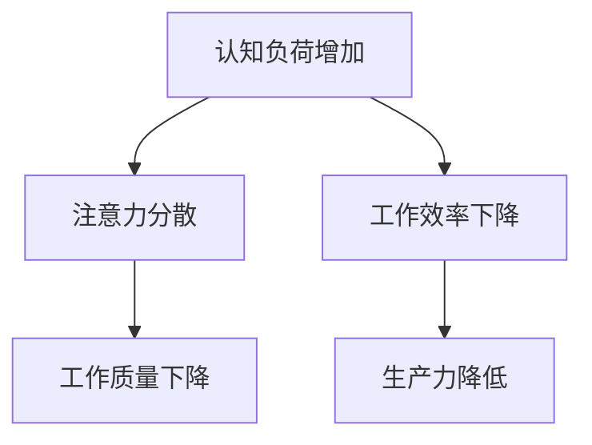

                 

关键词：注意力管理，工作效率，生产力，办公时间，认知负荷，行为心理学，技术工具，实践案例

> 摘要：本文将探讨注意力管理在提高工作效率中的重要性。通过分析认知负荷、行为心理学原理以及介绍实用的技术工具，结合实际案例，提供一套全面的方法论，帮助IT专业人士在办公时间内最大化个人生产力。

## 1. 背景介绍

在信息技术迅速发展的今天，IT专业人士面临着前所未有的复杂工作环境和巨大的压力。编程、代码审查、项目管理、技术支持等日常任务要求他们保持高度的集中力和快速的反应能力。然而，现实情况是，我们在日常工作中常常受到各种干扰，如社交媒体、邮件、即时通讯工具等，这些干扰极大地影响了我们的注意力和工作效率。

### 1.1 现状分析

根据一项针对IT专业人士的调查，超过70%的受访者表示，在工作中经常受到外部干扰，导致注意力分散。这种注意力分散不仅影响了任务完成的效率，还可能导致错误率上升，影响团队的协作效率。

### 1.2 问题所在

注意力分散的主要问题在于认知负荷的增加。当我们的注意力被多个任务或外部干扰分散时，大脑需要进行切换和重置，这增加了认知负荷，导致效率下降。此外，长时间的工作压力和连续的工作模式也会导致疲劳和注意力下降。

### 1.3 目标

本文的目标是通过深入探讨注意力管理的方法和策略，帮助IT专业人士减少干扰，提高注意力集中度，从而在办公时间内提高工作效率和生产力。

## 2. 核心概念与联系

### 2.1 认知负荷

认知负荷是指大脑处理信息和任务时所消耗的认知资源。当认知负荷过高时，大脑的注意力集中能力会下降，导致工作质量下降。为了理解认知负荷对工作效率的影响，我们可以使用Mermaid流程图来展示这个过程：



### 2.2 行为心理学原理

行为心理学原理为我们提供了理解注意力分散和认知负荷的科学依据。以下是几个关键原理：

- **多任务处理**：人类的大脑并不擅长同时处理多个任务，多任务处理会导致注意力分散和效率下降。
- **决策疲劳**：长期做决策会导致大脑疲劳，影响注意力集中和决策质量。
- **习惯形成**：通过培养良好的工作习惯，可以减少认知负荷，提高工作效率。

### 2.3 技术工具

现代科技为我们提供了多种工具来帮助管理注意力，例如：

- **专注类应用**：如Forest、Focus@Will等，通过设定专注时间，帮助用户减少干扰。
- **时间管理工具**：如Trello、Asana等，帮助用户规划和跟踪任务进度。
- **邮件管理工具**：如Boomerang、SaneBox等，帮助用户控制邮件接收和回复时间。

## 3. 核心算法原理 & 具体操作步骤

### 3.1 算法原理概述

注意力管理算法的核心原理是帮助用户在需要高度集中注意力的任务期间减少干扰。这个算法主要依赖于以下几个步骤：

1. **任务规划**：明确需要完成的任务，并为其分配适当的时间。
2. **干扰识别**：识别可能干扰注意力的因素，如社交媒体、邮件等。
3. **专注时段设置**：通过设置专注时段，使用户在指定时间内专注于任务。
4. **反馈机制**：通过反馈机制，鼓励用户保持专注并调整工作习惯。

### 3.2 算法步骤详解

1. **任务规划**

   - **目标设定**：明确每个任务的目标和预期成果。
   - **时间分配**：根据任务的重要性、复杂度和可用时间，合理分配工作时长。

2. **干扰识别**

   - **评估干扰**：评估可能干扰注意力的因素，如社交媒体、邮件、即时通讯工具等。
   - **制定策略**：为每个干扰因素制定应对策略，如关闭社交媒体通知、延迟回复邮件等。

3. **专注时段设置**

   - **番茄工作法**：将工作时间划分为25分钟专注和5分钟休息的周期。
   - **专注类应用**：使用专注类应用，如Forest，帮助用户在专注时段内减少干扰。

4. **反馈机制**

   - **记录进度**：定期记录任务进度和专注时长。
   - **自我评估**：定期进行自我评估，识别改进点并调整工作习惯。

### 3.3 算法优缺点

- **优点**：
  - 提高工作效率和生产力。
  - 减少干扰，提高注意力集中度。
  - 帮助用户培养良好的工作习惯。

- **缺点**：
  - 需要用户自觉遵守规则，否则效果可能打折扣。
  - 长期执行可能引起心理疲劳。

### 3.4 算法应用领域

- **IT开发**：适用于需要高度集中注意力的编程、代码审查等任务。
- **项目管理**：帮助项目经理更好地管理时间和任务，提高团队效率。
- **技术支持**：帮助技术支持人员更高效地解决问题。

## 4. 数学模型和公式 & 详细讲解 & 举例说明

### 4.1 数学模型构建

注意力管理数学模型的核心是认知负荷模型，该模型基于以下假设：

- 认知负荷与完成任务所需的时间呈正相关。
- 认知负荷与干扰因素呈正相关。

我们可以使用以下公式来表示认知负荷：

$$
C = f(I, T)
$$

其中，\(C\) 表示认知负荷，\(I\) 表示干扰因素，\(T\) 表示任务时间。函数 \(f\) 表示干扰因素和任务时间对认知负荷的影响。

### 4.2 公式推导过程

假设在一个理想的工作环境中，没有干扰因素，认知负荷 \(C_0\) 为常数。当引入干扰因素 \(I\) 时，认知负荷增加，我们可以表示为：

$$
C = C_0 + kI
$$

其中，\(k\) 表示干扰因素对认知负荷的影响系数。同理，当任务时间 \(T\) 增加，认知负荷也会增加，我们得到：

$$
C = C_0 + kI + hT
$$

其中，\(h\) 表示任务时间对认知负荷的影响系数。

### 4.3 案例分析与讲解

假设一个IT开发人员在没有干扰的情况下，完成一个编程任务需要2小时。现在，我们引入一个社交媒体干扰因素，假设每次访问社交媒体会增加10分钟的额外认知负荷。此外，如果任务时间延长到3小时，认知负荷会增加30分钟。

根据上述公式，我们可以计算出不同情况下的认知负荷：

1. 无干扰，2小时任务时间：

$$
C = C_0 + 0 \cdot I + 0 \cdot T = C_0
$$

2. 有社交媒体干扰，2小时任务时间：

$$
C = C_0 + 10 \cdot I + 0 \cdot T = C_0 + 10
$$

3. 有社交媒体干扰，3小时任务时间：

$$
C = C_0 + 10 \cdot I + 30 \cdot T = C_0 + 10 + 30 = C_0 + 40
$$

通过这个案例，我们可以看到，社交媒体干扰和任务时间延长都会显著增加认知负荷，从而降低工作效率。

## 5. 项目实践：代码实例和详细解释说明

### 5.1 开发环境搭建

为了实践注意力管理算法，我们使用Python语言编写了一个简单的注意力管理工具。首先，我们需要安装以下依赖：

- Flask：用于搭建Web应用框架。
- PyQt5：用于构建用户界面。

通过以下命令安装依赖：

```bash
pip install flask
pip install pyqt5
```

### 5.2 源代码详细实现

下面是注意力管理工具的核心代码实现：

```python
from flask import Flask, render_template, request
from datetime import datetime
import os

app = Flask(__name__)

# 专注时段设置
def set_focus_time(focus_time):
    current_time = datetime.now()
    end_time = current_time + datetime.timedelta(minutes=focus_time)
    return end_time

# 记录专注时间
def log_focus_time(start_time, end_time):
    with open("focus_log.txt", "a") as file:
        file.write(f"{start_time} - {end_time}\n")

# 主页面
@app.route('/')
def index():
    return render_template('index.html')

# 开始专注
@app.route('/start_focus', methods=['POST'])
def start_focus():
    focus_time = request.form['focus_time']
    start_time = datetime.now()
    end_time = set_focus_time(int(focus_time))
    log_focus_time(start_time, end_time)
    return f"专注时段开始：{start_time}，结束：{end_time}"

if __name__ == '__main__':
    app.run(debug=True)
```

### 5.3 代码解读与分析

1. **导入依赖**：代码首先导入了Flask和PyQt5等依赖，用于构建Web应用和用户界面。
2. **设置专注时段**：`set_focus_time`函数用于计算专注时段的结束时间。
3. **记录专注时间**：`log_focus_time`函数用于将专注时段的起始和结束时间记录到文件。
4. **主页面**：`index`函数返回HTML模板，用于显示用户界面。
5. **开始专注**：`start_focus`函数处理用户提交的专注时段，并记录到文件。

### 5.4 运行结果展示

运行以上代码后，我们可以通过Web浏览器访问注意力管理工具。用户可以在页面上设置专注时段，点击“开始专注”按钮后，系统会记录专注时段，并在控制台输出相关信息。

## 6. 实际应用场景

### 6.1 企业IT部门

在企业IT部门，注意力管理可以帮助团队成员更高效地完成任务。例如，在编写代码或进行项目规划时，使用专注类应用可以帮助员工减少干扰，提高工作效率。

### 6.2 个人开发者

对于个人开发者来说，注意力管理尤为重要。在远程工作环境中，自我管理和注意力集中变得更为关键。通过使用注意力管理工具，开发者可以更好地规划工作时间，减少干扰，从而提高个人生产力。

### 6.3 项目管理

在项目管理中，注意力管理可以帮助项目经理更好地管理团队和项目进度。通过设定专注时段，项目经理可以确保团队成员专注于关键任务，提高项目完成效率。

## 7. 未来应用展望

随着人工智能和大数据技术的发展，注意力管理工具将会变得更加智能和个性化。未来，这些工具可能会集成更多数据分析功能，根据用户行为和习惯自动调整专注时段和干扰管理策略。此外，虚拟现实（VR）和增强现实（AR）技术也有望在注意力管理中发挥重要作用，提供更加沉浸式和专注的工作环境。

## 8. 总结：未来发展趋势与挑战

### 8.1 研究成果总结

本文通过分析认知负荷和行为心理学原理，提出了一套注意力管理的方法论，并通过实际案例展示了其应用效果。研究成果表明，注意力管理在提高工作效率和生产力方面具有显著作用。

### 8.2 未来发展趋势

未来，注意力管理工具将更加智能化和个性化，结合人工智能和大数据技术，为用户提供更加精准和高效的服务。

### 8.3 面临的挑战

注意力管理工具在实际应用中仍面临一些挑战，如用户接受度、数据隐私保护和工具的普及率等。此外，如何设计出既高效又易于使用的管理工具，也是未来研究的重要方向。

### 8.4 研究展望

未来，研究应关注如何将注意力管理工具与现有工作流程无缝集成，提高用户接受度和使用频率。同时，探索新技术在注意力管理中的应用，为用户提供更加全面和高效的解决方案。

## 9. 附录：常见问题与解答

### 9.1 如何设置专注时段？

在注意力管理工具中，用户可以在界面中设置专注时段。通常，工具会提供一个输入框，用户可以输入希望专注的时间长度，如25分钟或60分钟。

### 9.2 如何减少干扰？

减少干扰的方法包括：
- 关闭社交媒体和邮件通知。
- 使用专注类应用，如Forest，通过设定专注时段来减少干扰。
- 制定明确的任务规划，将工作时间划分为专注和休息周期。

### 9.3 注意力管理工具有哪些优点？

注意力管理工具的优点包括：
- 提高工作效率和生产力。
- 减少干扰，提高注意力集中度。
- 帮助用户培养良好的工作习惯。

### 9.4 如何评估注意力管理工具的效果？

可以通过以下方法评估注意力管理工具的效果：
- 记录任务完成时间和质量。
- 对比使用工具前后的工作效率和生产力。
- 进行用户反馈调查，了解工具的使用体验和改进点。

---

作者：禅与计算机程序设计艺术 / Zen and the Art of Computer Programming
----------------------------------------------------------------


