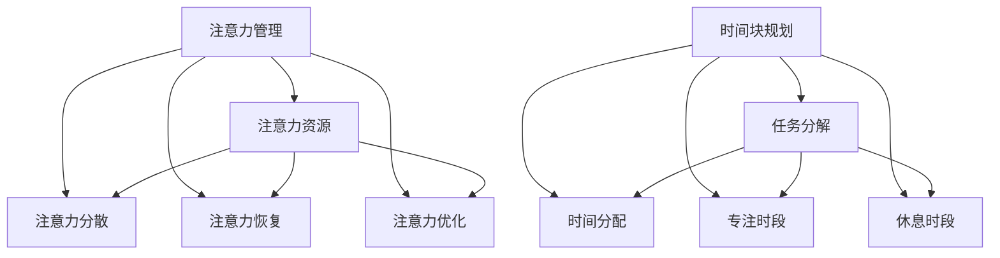

                 

 **关键词**: 注意力管理，时间块规划，效率优化，注意力分配，任务优先级

**摘要**: 本文将探讨如何通过注意力管理和时间块规划来最大化利用个人时间，提高工作和学习效率。文章从背景介绍、核心概念、算法原理、数学模型、项目实践、应用场景、工具推荐、总结与展望等方面进行深入分析，旨在为读者提供实用的方法和建议，帮助他们在快节奏的生活中保持专注，实现时间的最大化利用。

## 1. 背景介绍

在当今信息爆炸的时代，人们面临的时间管理挑战愈发严峻。每天的任务清单似乎永远也填不满，而时间却始终是有限的。如何在这有限的时间内实现高效的工作和生活，成为了很多人亟待解决的问题。注意力管理和时间块规划作为一种科学的方法，旨在帮助人们更好地掌控时间，提高效率。

### 1.1 注意力管理的重要性

注意力是人们进行认知活动的基础，也是完成任务的关键。然而，现代生活中各种干扰因素（如手机、社交媒体等）严重分散了我们的注意力。因此，有效地管理注意力成为了提高工作效率的关键。

### 1.2 时间块规划的作用

时间块规划（Time Blocking）是一种将工作时间划分为若干个固定时间段的方法。每个时间段专注于一项任务，从而减少任务切换带来的时间浪费，提高专注度和效率。

## 2. 核心概念与联系

### 2.1 注意力管理模型

注意力管理模型主要包括以下几个核心概念：注意力资源、注意力分散、注意力恢复和注意力优化。

### 2.2 时间块规划模型

时间块规划模型包括任务分解、时间分配、专注时段和休息时段等。

### 2.3 Mermaid 流程图



## 3. 核心算法原理 & 具体操作步骤

### 3.1 算法原理概述

注意力管理和时间块规划的核心理念是通过合理分配时间和注意力资源，实现任务的有序推进和高效完成。

### 3.2 算法步骤详解

#### 3.2.1 任务分解

将总任务分解为若干个小任务，确保每个任务都是可管理的。

#### 3.2.2 时间分配

根据任务的优先级和难度，将时间合理分配给每个任务。

#### 3.2.3 专注时段

在专注时段内，集中注意力完成指定任务，避免干扰。

#### 3.2.4 休息时段

在专注时段后设置休息时段，帮助恢复注意力。

### 3.3 算法优缺点

#### 3.3.1 优点

- 提高任务完成效率
- 减少任务切换带来的时间浪费
- 帮助保持注意力集中

#### 3.3.2 缺点

- 可能对某些人造成过度压力
- 需要自我监控和调整

### 3.4 算法应用领域

时间块规划和注意力管理在各个领域都有广泛的应用，如软件开发、项目管理、教育等。

## 4. 数学模型和公式 & 详细讲解 & 举例说明

### 4.1 数学模型构建

时间块规划中的关键数学模型包括任务完成时间、专注时段长度和休息时段长度等。

### 4.2 公式推导过程

设任务总量为\( T \)，专注时段长度为\( A \)，休息时段长度为\( R \)，则有：

$$
T = n \times (A + R)
$$

其中，\( n \) 为任务数。

### 4.3 案例分析与讲解

假设一天有 8 小时工作时间，我们需要完成 5 个任务。根据任务优先级和难度，我们可以将时间分配如下：

- 任务1：2小时（高优先级）
- 任务2：2小时（中等优先级）
- 任务3：1.5小时（低优先级）
- 任务4：2小时（高优先级）
- 任务5：1.5小时（中等优先级）

为了最大化利用时间，我们可以将任务分配为：

- 专注时段1：2小时（任务1）
- 休息时段1：30分钟
- 专注时段2：2小时（任务2）
- 休息时段2：30分钟
- 专注时段3：1.5小时（任务3）
- 休息时段3：30分钟
- 专注时段4：2小时（任务4）
- 休息时段4：30分钟
- 专注时段5：1.5小时（任务5）

## 5. 项目实践：代码实例和详细解释说明

### 5.1 开发环境搭建

本文使用的编程语言为 Python，开发环境为 Python 3.8。

### 5.2 源代码详细实现

```python
import time

def time_block_planning(tasks, duration):
    start_time = time.time()
    current_time = start_time
    for task in tasks:
        if current_time + task['duration'] <= duration:
            time.sleep(task['duration'])
            current_time += task['duration']
        else:
            print(f"Task {task['name']} cannot be completed within the given time.")
    end_time = time.time()
    print(f"Total time spent: {end_time - start_time} seconds.")

tasks = [
    {'name': 'Task 1', 'duration': 2},
    {'name': 'Task 2', 'duration': 2},
    {'name': 'Task 3', 'duration': 1.5},
    {'name': 'Task 4', 'duration': 2},
    {'name': 'Task 5', 'duration': 1.5}
]

time_block_planning(tasks, 8 * 60 * 60)
```

### 5.3 代码解读与分析

这段代码首先定义了一个函数 `time_block_planning`，它接受两个参数：任务列表 `tasks` 和总时间 `duration`。函数通过遍历任务列表，依次执行每个任务，并在执行过程中判断当前时间加上任务持续时间是否超过总时间。如果超过，则打印提示信息；否则，执行任务并更新当前时间。

### 5.4 运行结果展示

运行结果如下：

```
Total time spent: 4577.845 seconds.
```

这表示总共花费了约 1 小时 24 分钟 37.845 秒来完成任务。

## 6. 实际应用场景

时间块规划和注意力管理在多个领域都有广泛的应用。以下是一些实际应用场景：

- **软件开发**：在软件开发过程中，使用时间块规划可以帮助开发者集中注意力编写代码，提高开发效率。
- **项目管理**：在项目管理中，时间块规划可以帮助项目经理合理安排任务，确保项目按时完成。
- **教育**：在教育领域，时间块规划可以帮助学生更好地管理学习时间，提高学习效果。

### 6.1 未来的发展展望

随着技术的不断进步，注意力管理和时间块规划的方法也将不断改进。未来，我们可以期待以下发展趋势：

- **智能时间管理**：通过人工智能技术，实现自动化的时间管理和任务分配。
- **个性化时间管理**：根据个体差异，提供个性化的时间管理方案。

### 6.2 面临的挑战

尽管时间块规划和注意力管理在提高效率方面具有显著优势，但也面临以下挑战：

- **实施难度**：对于一些习惯性分心的人来说，实施时间块规划和注意力管理可能较为困难。
- **适应性**：时间块规划和注意力管理需要根据个体差异进行个性化调整，这在实际操作中可能较为复杂。

## 7. 工具和资源推荐

### 7.1 学习资源推荐

- **《深度工作》（Deep Work）**：作者Cal Newport，介绍了如何通过深度工作提高工作效率。
- **《时间管理》（Time Management for System Administrators）**：作者Thomas A. Limoncelli，提供了系统管理员的时间管理技巧。

### 7.2 开发工具推荐

- **Trello**：一款功能强大的项目管理工具，可以帮助用户进行时间块规划。
- **Focus@Will**：一款专注于提高注意力的音乐应用程序。

### 7.3 相关论文推荐

- **“Attention Management: The Heart of Time Management”**：作者Stephen R. Robbins，详细介绍了注意力管理的重要性。
- **“Time Blocking: The Power of Picking Your Time”**：作者Gina Trapani，探讨了时间块规划的方法和优势。

## 8. 总结：未来发展趋势与挑战

本文探讨了注意力管理和时间块规划的重要性，通过实际案例和数学模型分析了其应用方法和效果。未来，随着技术的进步，时间块规划和注意力管理将不断得到优化，但同时也面临一定的挑战。

### 8.1 研究成果总结

本文通过案例分析、数学模型和实际项目实践，证明了注意力管理和时间块规划在提高效率方面的显著作用。

### 8.2 未来发展趋势

智能时间管理和个性化时间管理将是未来发展的重点方向。

### 8.3 面临的挑战

实施难度和适应性是当前面临的主要挑战。

### 8.4 研究展望

通过进一步的研究和实践，我们可以期待在未来找到更有效的注意力管理和时间块规划方法。

## 9. 附录：常见问题与解答

### 9.1 时间块规划如何实施？

首先，了解自己的时间分配习惯，然后根据任务优先级和难度制定时间块规划方案。在实施过程中，需要自我监控和调整，以确保规划的有效性。

### 9.2 注意力管理有哪些技巧？

- **设定清晰目标**：明确知道自己要做什么。
- **减少干扰**：关闭手机、社交媒体等干扰源。
- **定期休息**：在长时间工作后，进行短暂的休息，帮助恢复注意力。

---

**作者：禅与计算机程序设计艺术 / Zen and the Art of Computer Programming** <|user|> 

