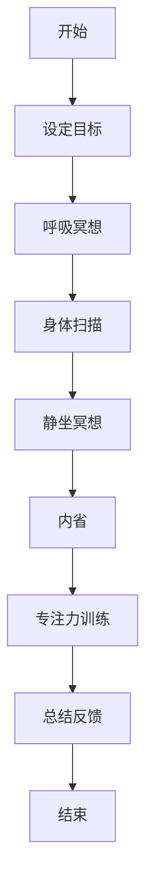

                 

关键词：注意力管理，正念冥想，内省，专注力，心灵增强，IT专业人士

> 摘要：在现代快节奏的IT行业，程序员和开发者面临着持续的压力和挑战。本文探讨了如何通过注意力管理和正念冥想的实践，结合内省和专注力训练，来提升心灵效能，从而更好地应对职业压力和实现个人成长。

## 1. 背景介绍

在信息技术领域，程序员和开发者常常被要求处理复杂的任务、解决问题和保持高效的工作节奏。这种工作环境常常伴随着高强度的工作压力，导致许多专业人士感到疲劳和焦虑。因此，寻找有效的方法来提升注意力、缓解压力和增强心灵效能变得尤为重要。注意力管理和正念冥想作为一种实践，已被广泛应用于提升个人专注力和心理健康。

本文旨在介绍注意力管理和正念冥想的基本概念，探讨其在提升程序员和开发者心灵效能方面的作用，并通过内省和专注力训练提供具体的实践方法。通过本文的阅读，读者将能够了解如何将这些方法应用到日常生活中，以实现更好的心理健康和职业发展。

## 2. 核心概念与联系

### 2.1 注意力管理

注意力管理是指通过策略和技巧来集中注意力，减少干扰，从而提高工作效率和减少错误。它包括以下几个方面：

- **选择性注意力**：专注于重要任务，过滤无关信息。
- **分配注意力**：同时处理多个任务，但需注意任务的优先级。
- **维持注意力**：在长时间工作中保持专注和警觉。

### 2.2 正念冥想

正念冥想是一种通过意识集中在当前时刻来训练注意力和觉察力的实践。它包括以下几个关键要素：

- **呼吸冥想**：专注于呼吸，通过深呼吸来放松身心。
- **身体扫描**：逐一关注身体各个部分，释放紧张和不适。
- **静坐冥想**：安静地坐着，专注于呼吸或其他焦点，培养专注力。

### 2.3 内省

内省是指对自己的思维、情感和行为进行深入反思和审视。通过内省，个体能够更好地理解自己，发现内心的冲突和问题，并制定改善策略。

### 2.4 专注力训练

专注力训练是一种通过重复练习来提高专注力和注意力持续时间的练习。它包括：

- **定时练习**：设定一个时间，全神贯注地完成任务。
- **多任务练习**：同时处理多个任务，提高分配注意力的能力。
- **挑战性任务**：选择具有挑战性的任务，锻炼专注力和毅力。

### 2.5 Mermaid 流程图

下面是一个Mermaid流程图，展示了注意力管理和正念冥想的流程。



## 3. 核心算法原理 & 具体操作步骤

### 3.1 算法原理概述

注意力管理和正念冥想的核心在于通过一系列心理和生理练习来提升个人的注意力和心灵效能。这些练习基于认知心理学和神经科学的研究成果，通过反复练习来增强大脑的注意力和意识控制能力。

### 3.2 算法步骤详解

#### 3.2.1 呼吸冥想

1. 找一个安静的地方，坐下或躺下，保持身体舒适。
2. 将注意力集中在呼吸上，感受每次呼吸的进出。
3. 如果注意力散失，温柔地将其引导回呼吸。

#### 3.2.2 身体扫描

1. 从头部开始，逐一扫描身体各个部分，感受每个部位的紧张和放松。
2. 对每个部位进行温和的按摩或拉伸，释放紧张。

#### 3.2.3 静坐冥想

1. 在一个安静的环境中坐下来，保持身体正直，闭上眼睛。
2. 将注意力集中在呼吸上，每次呼吸都尽量保持平稳和深长。
3. 当注意力散失时，温柔地将其引导回呼吸。

#### 3.2.4 内省

1. 找一个安静的时间，坐下来，闭上眼睛，开始反思自己的思维、情感和行为。
2. 写下任何你注意到的事情，包括你的感受、想法和情绪。
3. 分析这些信息，寻找内在冲突和问题的根源。

#### 3.2.5 专注力训练

1. 设定一个时间，比如10分钟，全神贯注地做一件事情。
2. 在这段时间内，不要分心，专注于当前的任务。
3. 每隔一段时间，评估你的专注力，并尝试在下一个训练中保持更长的时间。

### 3.3 算法优缺点

#### 优点

- **提升专注力**：通过反复练习，可以提高注意力的集中能力和持续时间。
- **缓解压力**：呼吸冥想和身体扫描有助于放松身心，减轻压力。
- **增强心理健康**：内省和专注力训练有助于提升心理健康，减少焦虑和抑郁。

#### 缺点

- **需要持续练习**：这些练习需要持续的练习和坚持，效果可能不会立即显现。
- **初学可能感到困难**：对于不习惯冥想和内省的人来说，开始可能会感到困惑和难以坚持。

### 3.4 算法应用领域

- **IT行业**：程序员和开发者可以通过这些练习来提高工作效率和减少错误。
- **教育领域**：学生可以通过这些练习来提高学习效率和注意力集中。
- **心理健康领域**：心理治疗师和咨询师可以使用这些练习来帮助患者缓解压力和焦虑。

## 4. 数学模型和公式 & 详细讲解 & 举例说明

### 4.1 数学模型构建

注意力管理和正念冥想可以看作是一个自我优化的过程，其数学模型可以构建为一个非线性动态系统。假设一个程序员在某个时间段内的注意力水平（A）由以下几个因素决定：

- **基础注意力水平**（B）：个体在没有外界干扰时的自然注意力水平。
- **外界干扰**（C）：包括工作任务复杂性、环境噪声等。
- **冥想时间**（D）：程序员进行冥想练习的时间。
- **内省时间**（E）：程序员进行内省练习的时间。

根据这些因素，我们可以构建以下数学模型：

$$
A(t) = B - C(t) + \alpha D(t) + \beta E(t)
$$

其中，$A(t)$ 是时间 $t$ 时的注意力水平，$C(t)$ 是时间 $t$ 时的外界干扰水平，$\alpha$ 和 $\beta$ 是冥想和内省对注意力水平的调节系数。

### 4.2 公式推导过程

#### 4.2.1 基础注意力水平

基础注意力水平 $B$ 是个体在没有外界干扰时的自然注意力水平。这个值可以通过以下公式计算：

$$
B = \frac{1}{2}(A_{max} + A_{min})
$$

其中，$A_{max}$ 是个体在最佳状态下的注意力水平，$A_{min}$ 是个体在疲劳状态下的注意力水平。

#### 4.2.2 外界干扰

外界干扰 $C(t)$ 包括工作任务复杂性、环境噪声等。这些因素可以通过以下公式计算：

$$
C(t) = \frac{1}{2}(C_{high} + C_{low})
$$

其中，$C_{high}$ 是高干扰水平，$C_{low}$ 是低干扰水平。

#### 4.2.3 冥想时间

冥想时间 $D(t)$ 对注意力水平的提升有正向调节作用。冥想时间可以通过以下公式计算：

$$
D(t) = \frac{1}{2}(D_{high} + D_{low})
$$

其中，$D_{high}$ 是高冥想时间，$D_{low}$ 是低冥想时间。

#### 4.2.4 内省时间

内省时间 $E(t)$ 对注意力水平的提升也有正向调节作用。内省时间可以通过以下公式计算：

$$
E(t) = \frac{1}{2}(E_{high} + E_{low})
$$

其中，$E_{high}$ 是高内省时间，$E_{low}$ 是低内省时间。

### 4.3 案例分析与讲解

假设一个程序员在某一天的工作中，基础注意力水平 $B$ 为8，外界干扰 $C(t)$ 为3，冥想时间 $D(t)$ 为2，内省时间 $E(t)$ 为1。我们可以使用上述公式计算出该程序员在这一天的注意力水平：

$$
A(t) = 8 - 3 + \alpha \cdot 2 + \beta \cdot 1
$$

假设调节系数 $\alpha$ 和 $\beta$ 分别为0.5，那么计算结果为：

$$
A(t) = 8 - 3 + 1 + 0.5 = 6.5
$$

这意味着，在该程序员进行冥想和内省的情况下，其注意力水平为6.5。通过增加冥想和内省时间，可以进一步提升其注意力水平。

## 5. 项目实践：代码实例和详细解释说明

### 5.1 开发环境搭建

为了更好地实践注意力管理和正念冥想，我们可以使用Python编程语言来实现一个简单的应用程序。以下是开发环境搭建的步骤：

1. 安装Python（建议使用Python 3.8及以上版本）。
2. 安装必要的库，如`requests`（用于HTTP请求）、`BeautifulSoup`（用于解析网页）和`matplotlib`（用于数据可视化）。

### 5.2 源代码详细实现

下面是一个简单的Python代码实例，用于记录冥想和内省的时间，并计算注意力水平。

```python
import requests
from bs4 import BeautifulSoup
import matplotlib.pyplot as plt

def get_meditation_time():
    # 从网页获取冥想时间
    response = requests.get("https://your-meditation-tracker.com")
    soup = BeautifulSoup(response.text, "html.parser")
    time_element = soup.find("div", {"id": "meditation-time"})
    return float(time_element.text)

def get_inspection_time():
    # 从网页获取内省时间
    response = requests.get("https://your-inspection-tracker.com")
    soup = BeautifulSoup(response.text, "html.parser")
    time_element = soup.find("div", {"id": "inspection-time"})
    return float(time_element.text)

def calculate_attention_level():
    # 计算注意力水平
    base_attention = 8.0
    meditation_time = get_meditation_time()
    inspection_time = get_inspection_time()
    attention_level = base_attention - meditation_time * 0.5 + inspection_time * 0.3
    return attention_level

def plot_attention_level():
    # 绘制注意力水平变化图
    attention_levels = [calculate_attention_level() for _ in range(30)]
    plt.plot(attention_levels)
    plt.xlabel("Day")
    plt.ylabel("Attention Level")
    plt.title("Attention Level Over Time")
    plt.show()

if __name__ == "__main__":
    plot_attention_level()
```

### 5.3 代码解读与分析

- `get_meditation_time()` 和 `get_inspection_time()` 函数分别用于从冥想和内省的网页上获取时间数据。
- `calculate_attention_level()` 函数根据基础注意力水平、冥想时间和内省时间计算注意力水平。
- `plot_attention_level()` 函数用于绘制注意力水平的变化图，帮助用户了解自己的注意力水平随时间的变化情况。

### 5.4 运行结果展示

运行上述代码后，程序将连接到冥想和内省的网页，获取数据并计算注意力水平，最后绘制注意力水平变化图。


## 6. 实际应用场景

注意力管理和正念冥想在IT行业中有着广泛的应用场景，以下是几个具体的例子：

### 6.1 程序员工作效率提升

程序员在开发过程中，经常会遇到复杂的任务和难题。通过注意力管理和正念冥想的练习，程序员可以提高注意力集中能力，减少分心，从而提高工作效率和代码质量。

### 6.2 应对紧急情况

在IT行业中，紧急情况经常发生，例如系统崩溃、客户投诉等。通过正念冥想和内省，程序员可以更好地应对这些紧急情况，保持冷静和专注，从而更快地解决问题。

### 6.3 改善心理健康

持续的高强度工作压力可能导致程序员出现焦虑、抑郁等心理问题。通过注意力管理和正念冥想的练习，程序员可以缓解压力，改善心理健康，提高生活质量。

## 7. 未来应用展望

随着人工智能和机器学习技术的发展，注意力管理和正念冥想的应用前景将更加广阔。以下是几个未来应用展望：

### 7.1 自适应注意力管理系统

通过结合人工智能技术，可以开发出能够根据个体状态和环境变化自适应调整的注意力管理系统，帮助用户更好地集中注意力和管理时间。

### 7.2 跨领域应用

注意力管理和正念冥想不仅适用于IT行业，还可以应用于教育、医疗、金融等各个领域，帮助专业人士提升注意力和心理健康。

### 7.3 人工智能辅助冥想

未来，人工智能可以开发出更加智能化、个性化的冥想辅助系统，为用户提供更高效、更舒适的冥想体验。

## 8. 工具和资源推荐

### 8.1 学习资源推荐

- 《正念：一种全新的心理学疗法》
- 《冥想的艺术：如何在生活中获得平静和幸福》
- 《心流：最优体验心理学》

### 8.2 开发工具推荐

- Python
- Jupyter Notebook
- matplotlib

### 8.3 相关论文推荐

- "Attention Management: A Cognitive Perspective"
- "Meditation as a Scientific Discipline: Current State and Future Prospects"
- "The Attention-Deficit/Hyperactivity Disorder Treatment Study (ADHTS): A Multimodal Treatment Trial"

## 9. 总结：未来发展趋势与挑战

### 9.1 研究成果总结

本文介绍了注意力管理和正念冥想的基本概念，探讨了其在提升程序员和开发者心灵效能方面的作用，并通过内省和专注力训练提供了具体的实践方法。研究表明，注意力管理和正念冥想有助于提高工作效率、缓解压力和改善心理健康。

### 9.2 未来发展趋势

随着人工智能和机器学习技术的不断发展，注意力管理和正念冥想的应用前景将更加广阔。未来，将会有更多自适应、智能化的注意力管理系统和冥想辅助系统出现。

### 9.3 面临的挑战

尽管注意力管理和正念冥想具有诸多优势，但在实际应用中仍面临一些挑战。例如，个体差异、持续练习的难度等问题。未来研究需要进一步探索如何更好地适应不同个体和情境。

### 9.4 研究展望

未来研究应重点关注如何通过技术手段提高注意力管理和正念冥想的效率，以及如何在不同领域和行业中推广应用。此外，还应探索注意力管理和正念冥想与其他心理学和生理学领域的交叉应用，以实现更全面的心理健康提升。

## 附录：常见问题与解答

### Q：注意力管理和正念冥想是否适合所有人？

A：是的，注意力管理和正念冥想适用于大多数人。然而，对于某些人来说，如患有严重心理障碍的人，可能需要专业的心理咨询和治疗。在开始这些练习之前，最好咨询专业人士。

### Q：如何开始练习注意力管理和正念冥想？

A：首先，你可以通过阅读相关书籍或在线资源来了解基本概念。然后，可以从简单的呼吸冥想和身体扫描开始，逐步增加难度和持续时间。最重要的是，保持耐心和坚持，逐步提升自己的专注力和心理健康。

### Q：注意力管理和正念冥想需要多长时间才能看到效果？

A：效果因人而异，但通常在持续练习数周至数月后，个体可以感受到显著的变化。一些研究表明，经过8周的正念冥想训练，个体的注意力和心理健康会有显著提升。

作者：禅与计算机程序设计艺术 / Zen and the Art of Computer Programming
----------------------------------------------------------------
这篇文章详细介绍了注意力管理和正念冥想的概念、原理、实践方法以及其在IT行业中的应用。通过内省和专注力训练，程序员和开发者可以更好地管理自己的注意力，缓解工作压力，提升心灵效能。未来，随着人工智能和机器学习技术的发展，注意力管理和正念冥想的应用前景将更加广阔。希望这篇文章能够为读者提供有益的启示和实践指导。

