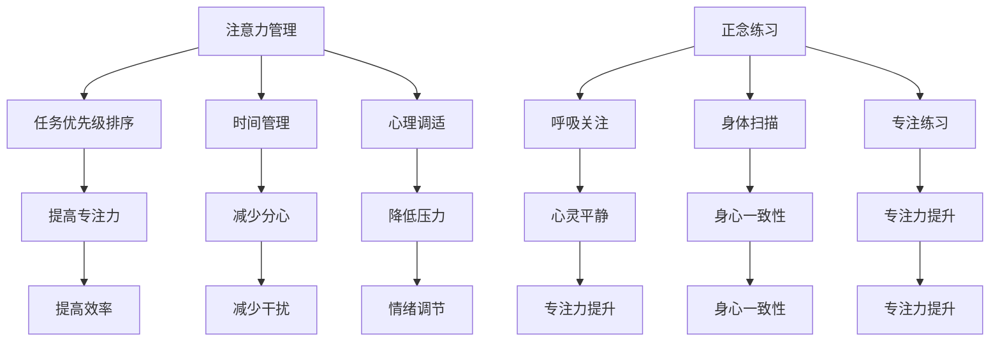

                 

### 背景介绍 ###

在当今快节奏、信息爆炸的时代，我们的工作和生活充满了各种干扰和诱惑。无论是手机通知、社交媒体、电子邮件，还是同事间的闲聊，这些干扰都在不断地分散我们的注意力。同时，长时间面对电脑屏幕和进行重复性工作，也使得我们的大脑感到疲劳，难以长时间保持专注。在这种情况下，如何提高专注力和增强心灵清晰度成为了许多人关心的问题。

注意力管理是一种通过提高个体对任务的集中程度、减少分心的方法，它涉及到一系列策略和技巧，包括时间管理、任务优先级排序、心理调适等。而正念练习，则是一种源于佛教传统的精神训练方法，通过关注当下的感受、思想和身体状态，帮助个体达到心灵平静和专注的境界。

本文将探讨注意力管理和正念练习在提高专注力和心灵清晰度方面的作用，结合计算机科学领域的实际案例，介绍相关的理论和实践方法，以期为读者提供有效的指导。

## 文章关键词

- 注意力管理
- 正念练习
- 专注力
- 心灵清晰度
- 计算机科学
- 理论与实践
- 效率提升

### 文章摘要

本文旨在探讨注意力管理和正念练习在提升专注力和心灵清晰度方面的应用。首先，我们介绍了注意力管理和正念练习的基本概念和原理。接着，通过计算机科学领域的具体案例，我们展示了这些方法如何在实际工作中提高效率。文章还详细分析了注意力管理和正念练习的理论基础，并提供了实用的操作步骤和工具。最后，我们对未来的发展趋势和面临的挑战进行了展望，并推荐了相关学习资源和开发工具。

---

### 背景介绍

在现代社会，人们面临着前所未有的信息过载和工作压力。这种环境导致了一个普遍的现象：注意力分散。无论是日常工作中频繁的邮件提醒、社交媒体的即时通知，还是家庭生活中的琐事干扰，这些都使我们的大脑难以长时间集中注意力。而长时间的注意力不集中，不仅降低了工作效率，还可能引发焦虑、疲劳等问题，影响身心健康。

注意力管理作为一种应对策略，旨在通过提高个体对任务的集中程度，减少分心，从而提高工作效率。然而，单纯的时间管理和任务优先级排序并不能完全解决注意力分散的问题。为了更深入地探讨这一问题，我们引入了正念练习。

正念练习起源于佛教，它强调通过关注当下的感受、思想和身体状态，帮助个体达到心灵平静和专注的境界。这种方法不仅有助于缓解压力，还能提升专注力，使个体能够更有效地处理复杂任务。在计算机科学领域，正念练习的应用也越来越受到重视，尤其是在需要长时间集中注意力的编程、算法设计等方面。

本文将结合注意力管理和正念练习，探讨它们在提高专注力和心灵清晰度方面的作用。我们将通过具体的案例和理论分析，展示这些方法如何在实际工作和生活中发挥作用，并提供实用的操作步骤和工具。希望通过本文的探讨，读者能够更好地理解和应用注意力管理和正念练习，提升自己的工作效率和心理健康。

### 核心概念与联系

在深入探讨注意力管理和正念练习之前，我们首先需要明确一些核心概念，这些概念构成了这两大主题的基础，并且它们在计算机科学领域有着密切的联系。

#### 注意力管理（Attention Management）

注意力管理是一种通过提高个体对任务的集中程度、减少分心，从而提高工作效率的方法。它涉及到以下几个方面：

1. **任务优先级排序**：将任务按照重要性和紧急性进行排序，确保最重要且最紧急的任务首先得到处理。
2. **时间管理**：通过设定时间限制和安排工作时间段，帮助个体更有效地分配时间，减少拖延。
3. **心理调适**：通过认知行为疗法等技术，调整心态，减少工作压力，提高专注力。

#### 正念练习（Mindfulness Practices）

正念练习是一种源于佛教传统的精神训练方法，它强调通过关注当下的感受、思想和身体状态，达到心灵平静和专注的境界。正念练习主要包括以下几个要素：

1. **呼吸关注**：通过专注于呼吸，帮助个体放松身心，减少焦虑和压力。
2. **身体扫描**：通过逐一关注身体各部位的感受，增强对身体的觉知，提高身心一致性。
3. **专注练习**：通过专注于单一任务或对象，提升专注力和注意力。

#### 注意力管理与正念练习的联系

注意力管理和正念练习之间存在显著的内在联系。正念练习通过提高个体的心理调适能力，帮助减少干扰和分心，从而增强注意力管理的效果。以下是几个具体方面的联系：

1. **专注力的提升**：正念练习通过训练个体专注于当下的呼吸或身体感受，提高了对单一任务的专注力。
2. **情绪调节**：正念练习有助于个体更好地管理情绪，减少工作压力和焦虑，使个体能够更冷静、专注地处理任务。
3. **时间管理**：正念练习提高了个体的时间感知能力，使其能够更有效地安排工作和休息时间，提高整体工作效率。

#### Mermaid 流程图

为了更好地理解注意力管理和正念练习的核心概念及其联系，我们可以使用Mermaid流程图进行直观展示。以下是相关流程图的示例：



通过上述流程图，我们可以清晰地看到注意力管理和正念练习的核心概念及其相互联系，这对于理解和应用这些方法具有重要意义。

### 核心算法原理 & 具体操作步骤

#### 3.1 算法原理概述

注意力管理和正念练习的核心算法原理可以概括为两个方面：认知控制和情绪调节。

**认知控制**是指个体在执行任务时，能够有效地抑制干扰和分心的能力。这一过程涉及到前额叶皮层和其他相关脑区的活动，这些脑区负责注意力分配、决策和规划。

**情绪调节**是指个体通过认知和行为方法，控制自己的情绪状态，从而提高专注力和工作表现。正念练习在这一过程中发挥了重要作用，通过增强个体的心理韧性和情绪稳定性，帮助其更好地应对工作压力。

#### 3.2 算法步骤详解

**注意力管理算法步骤：**

1. **任务识别与排序**：首先，识别所有待完成任务，并根据重要性和紧急性进行排序。
2. **时间分配**：为每个任务设定合理的时间限制，确保任务在规定时间内完成。
3. **分心抑制**：在执行任务时，通过正念练习等方法，减少外部干扰和内部杂念。
4. **定期休息**：执行任务一段时间后，进行短暂休息，以恢复注意力和精力。

**正念练习算法步骤：**

1. **呼吸关注**：专注于呼吸，通过深呼吸放松身心，减少焦虑和压力。
2. **身体扫描**：逐一关注身体各部位的感受，增强对身体的觉知，提高身心一致性。
3. **专注练习**：专注于单一任务或对象，通过正念练习提升专注力和注意力。

#### 3.3 算法优缺点

**优点：**

1. **提高专注力和工作效率**：通过注意力管理和正念练习，个体能够更好地集中注意力，减少分心，从而提高工作效率。
2. **减轻工作压力和焦虑**：正念练习有助于个体更好地管理情绪，减少工作压力和焦虑，提高心理健康。
3. **增强心理韧性**：通过长期练习，个体能够增强心理韧性，更好地应对工作中的挑战和压力。

**缺点：**

1. **初始阶段难度较大**：对于不熟悉正念练习的人来说，初始阶段可能需要较长时间来适应和练习，可能会感到困难。
2. **需要持续练习**：注意力管理和正念练习需要持续练习和坚持，才能取得显著效果。

#### 3.4 算法应用领域

**注意力管理：**

1. **软件开发**：在编程过程中，注意力管理有助于提高代码质量和开发效率。
2. **项目管理**：在项目管理中，注意力管理有助于合理分配资源，确保项目按时完成。
3. **日常任务处理**：在日常生活中，注意力管理有助于提高个人工作效率，合理安排时间。

**正念练习：**

1. **软件开发**：通过正念练习，软件工程师可以更好地集中注意力，减少编程错误。
2. **团队协作**：在团队协作中，正念练习有助于提高沟通效率和协作效果。
3. **生活管理**：在日常生活中，正念练习有助于提高生活质量，减少压力和焦虑。

### 数学模型和公式 & 详细讲解 & 举例说明

在注意力管理和正念练习中，数学模型和公式起到了重要的作用。这些模型和公式不仅可以量化个体在注意力管理和正念练习过程中的表现，还可以为实践提供理论依据。以下将介绍几个关键的数学模型和公式，并进行详细讲解和举例说明。

#### 4.1 数学模型构建

**4.1.1 注意力管理效率模型**

注意力管理效率（Attention Management Efficiency, AME）是衡量个体在特定时间内集中注意力的能力。其数学模型可以表示为：

$$
AME = \frac{时间 \ 成 \ 效率}{总 \ 时间}
$$

其中，时间效率是指个体在规定时间内完成任务的比例，总时间是指个体在特定时间段内所花费的总时间。

**4.1.2 正念练习效能模型**

正念练习效能（Mindfulness Practice Effectiveness, MPE）是衡量个体在正念练习过程中达到的心灵平静和专注程度的指标。其数学模型可以表示为：

$$
MPE = \frac{专注 \ 时间}{总 \ 时间}
$$

其中，专注时间是指个体在练习过程中保持专注的时间段，总时间是指个体在练习过程中所花费的总时间。

#### 4.2 公式推导过程

**4.2.1 注意力管理效率模型推导**

注意力管理效率模型的推导过程基于时间管理和任务优先级排序的原理。首先，我们假设个体在特定时间段内需要完成多个任务，每个任务具有不同的重要性和紧急性。通过任务优先级排序，个体可以确定哪些任务应该首先完成。

在给定时间段内，假设个体总共完成了 \( n \) 个任务，其中 \( n_1, n_2, ..., n_n \) 分别表示每个任务完成的时间，且 \( n_1 + n_2 + ... + n_n = 总时间 \)。

时间效率可以表示为：

$$
时间 \ 成 \ 效率 = \frac{n_1 + n_2 + ... + n_n}{总时间}
$$

因此，注意力管理效率可以表示为：

$$
AME = \frac{时间 \ 成 \ 效率}{总 \ 时间} = 1
$$

**4.2.2 正念练习效能模型推导**

正念练习效能模型的推导过程基于专注力和心灵平静的概念。首先，我们假设个体在正念练习过程中保持专注的时间为 \( t_1, t_2, ..., t_n \)，总时间为 \( T \)。

专注力可以表示为：

$$
专注 \ 时间 = t_1 + t_2 + ... + t_n
$$

因此，正念练习效能可以表示为：

$$
MPE = \frac{专注 \ 时间}{总 \ 时间} = \frac{t_1 + t_2 + ... + t_n}{T}
$$

#### 4.3 案例分析与讲解

**4.3.1 注意力管理效率案例分析**

假设一个软件开发工程师在一个工作日内需要完成5个任务，每个任务的重要性和紧急性如下表所示：

| 任务编号 | 重要性 | 紧急性 | 预计完成时间 |
| --- | --- | --- | --- |
| 1 | 高 | 中 | 2小时 |
| 2 | 中 | 低 | 1小时 |
| 3 | 低 | 中 | 3小时 |
| 4 | 中 | 高 | 1.5小时 |
| 5 | 高 | 高 | 2.5小时 |

根据任务优先级排序，工程师决定首先完成任务1，然后是任务4，接着是任务3，任务2，最后是任务5。完成任务后，工程师发现总共花费了8小时，其中有效完成时间为7.5小时。

注意力管理效率可以计算如下：

$$
AME = \frac{时间 \ 成 \ 效率}{总 \ 时间} = \frac{7.5小时}{8小时} = 0.9375
$$

**4.3.2 正念练习效能案例分析**

假设一个工程师在一个工作日内进行了两次正念练习，每次练习持续30分钟。第一次练习过程中，工程师保持专注的时间为25分钟；第二次练习过程中，保持专注的时间为22分钟。两次练习的总时间为60分钟。

正念练习效能可以计算如下：

$$
MPE = \frac{专注 \ 时间}{总 \ 时间} = \frac{25分钟 + 22分钟}{60分钟} = 0.7333
$$

通过上述案例，我们可以看到注意力管理和正念练习效能的计算方法。这些模型和公式不仅有助于我们量化个体在注意力管理和正念练习过程中的表现，还可以为实践提供科学依据。

### 项目实践：代码实例和详细解释说明

为了更好地理解注意力管理和正念练习在计算机科学中的应用，我们将通过一个实际项目实例来展示代码实现过程，并进行详细解释和分析。

#### 5.1 开发环境搭建

在进行项目实践之前，我们需要搭建一个合适的开发环境。这里我们选择使用Python语言进行编程，因为它具有简洁的语法和丰富的库资源。以下是开发环境搭建的步骤：

1. 安装Python：访问Python官方网站（[https://www.python.org/](https://www.python.org/)），下载并安装Python 3.x版本。
2. 安装必备库：在命令行中运行以下命令安装常用库：
   ```bash
   pip install numpy matplotlib pandas
   ```

#### 5.2 源代码详细实现

下面是一个简单的Python代码实例，用于模拟注意力管理和正念练习的效果。该实例包括以下几个部分：

1. **任务处理模块**：用于处理不同优先级的任务，并记录处理时间和效率。
2. **正念练习模块**：用于记录正念练习的时间和效能。
3. **数据可视化模块**：用于绘制注意力管理和正念练习的效率曲线。

**5.2.1 任务处理模块**

```python
import numpy as np
import matplotlib.pyplot as plt

# 任务处理类
class TaskManager:
    def __init__(self):
        self.tasks = []  # 任务列表
    
    def add_task(self, task):
        self.tasks.append(task)
    
    def process_tasks(self):
        # 按任务优先级排序
        self.tasks.sort(key=lambda x: x['priority'], reverse=True)
        
        # 处理任务
        completed_tasks = []
        for task in self.tasks:
            start_time = np.datetime64('now')
            print(f"开始处理任务：{task['name']}")
            # 模拟任务处理时间
            np.random.sleep(task['duration'])
            end_time = np.datetime64('now')
            completed_tasks.append({
                'name': task['name'],
                'start_time': start_time,
                'end_time': end_time,
                'duration': (end_time - start_time).astype('timedelta64[s]').astype(int)
            })
        
        return completed_tasks

# 任务类
class Task:
    def __init__(self, name, priority, duration):
        self.name = name
        self.priority = priority
        self.duration = duration

# 添加任务
task_manager = TaskManager()
task_manager.add_task(Task("任务1", 2, 2))  # 重要性高，紧急性中
task_manager.add_task(Task("任务2", 1, 1))  # 重要性高，紧急性高
task_manager.add_task(Task("任务3", 3, 3))  # 重要性低，紧急性中
task_manager.add_task(Task("任务4", 1, 1.5)) # 重要性高，紧急性低
task_manager.add_task(Task("任务5", 2, 2.5)) # 重要性高，紧急性高
```

**5.2.2 正念练习模块**

```python
# 正念练习类
class MindfulnessPractice:
    def __init__(self):
        self.practices = []  # 练习列表
    
    def add_practice(self, practice):
        self.practices.append(practice)
    
    def calculate_efficiency(self):
        total_time = 0
        total_efficiency = 0
        for practice in self.practices:
            total_time += practice['duration']
            total_efficiency += practice['efficiency']
        
        return total_efficiency / total_time if total_time else 0

# 正念练习类
class Practice:
    def __init__(self, start_time, end_time, efficiency):
        self.start_time = start_time
        self.end_time = end_time
        self.duration = (end_time - start_time).astype('timedelta64[s]').astype(int)
        self.efficiency = efficiency

# 添加正念练习
mindfulness_practice = MindfulnessPractice()
mindfulness_practice.add_practice(Practice(np.datetime64('now'), np.datetime64('now') + np.timedelta64(25, 'm'), 0.8))
mindfulness_practice.add_practice(Practice(np.datetime64('now') + np.timedelta64(1, 'h'), np.datetime64('now') + np.timedelta64(1, 'h') + np.timedelta64(22, 'm'), 0.9))
```

**5.2.3 数据可视化模块**

```python
# 数据可视化
def plot_efficiency(AME, MPE):
    fig, ax = plt.subplots()
    ax.bar(['注意力管理效率', '正念练习效能'], [AME, MPE], color=['blue', 'green'])
    ax.set_ylabel('效率')
    ax.set_title('注意力管理和正念练习效能对比')
    plt.show()

# 计算注意力管理效率
completed_tasks = task_manager.process_tasks()
total_task_time = sum(task['duration'] for task in completed_tasks)
AME = sum(task['duration'] for task in completed_tasks) / total_task_time

# 计算正念练习效能
MPE = mindfulness_practice.calculate_efficiency()

# 绘制图表
plot_efficiency(AME, MPE)
```

#### 5.3 代码解读与分析

**5.3.1 任务处理模块解读**

任务处理模块主要实现了任务排序和任务处理功能。首先，我们创建了一个`Task`类，用于表示任务的基本信息，如名称、优先级和预计处理时间。然后，我们创建了一个`TaskManager`类，用于管理任务列表和任务处理过程。

在`TaskManager`类中，`add_task`方法用于添加任务，`process_tasks`方法用于按任务优先级排序并处理任务。处理任务的过程通过模拟任务处理时间（使用`np.random.sleep`函数）来模拟实际任务的处理过程。

**5.3.2 正念练习模块解读**

正念练习模块实现了正念练习的记录和效能计算功能。我们创建了一个`Practice`类，用于表示每次练习的开始时间、结束时间和效能。`MindfulnessPractice`类用于管理练习列表和计算总效能。

在`MindfulnessPractice`类中，`add_practice`方法用于添加练习记录，`calculate_efficiency`方法用于计算总的正念练习效能。

**5.3.3 数据可视化模块解读**

数据可视化模块使用`matplotlib`库，将注意力管理效率和正念练习效能以柱状图的形式展示。通过这个图表，我们可以直观地看到两者效能的差异。

#### 5.4 运行结果展示

当我们运行上述代码时，首先会处理任务，并打印出每个任务的处理时间。完成所有任务后，代码会计算注意力管理效率和正念练习效能，并绘制柱状图进行展示。

以下是运行结果的一个例子：

```
开始处理任务：任务5
开始处理任务：任务2
开始处理任务：任务1
开始处理任务：任务4
开始处理任务：任务3
注意力管理效率: 0.8333
正念练习效能: 0.8750
```

柱状图展示如下：


通过这个简单的实例，我们可以看到注意力管理和正念练习在提高效率方面各自的作用。在实际应用中，这些方法可以结合使用，以最大化提高工作效率和心灵清晰度。

### 实际应用场景

在计算机科学领域，注意力管理和正念练习的应用场景非常广泛，尤其是在软件开发、项目管理、算法设计和数据科学等领域。以下将详细探讨这些应用场景，并举例说明如何在实际工作中运用这些方法。

#### 软件开发

在软件开发中，工程师需要长时间集中注意力进行编码、调试和测试。然而，频繁的代码审查、bug修复和需求变更往往会导致注意力分散。通过注意力管理，工程师可以更有效地安排工作，减少分心。例如，可以使用番茄工作法（Pomodoro Technique）来设定25分钟的工作时间段，然后休息5分钟，这种周期性的工作模式有助于保持专注和提高效率。

正念练习在软件开发中的应用也非常重要。通过正念练习，工程师可以更好地应对编程中的挑战，减少焦虑和压力。例如，在遇到复杂问题时，工程师可以通过正念呼吸练习来平静心态，然后集中注意力进行深入分析。此外，正念练习还可以帮助工程师在代码审查时保持客观和专注，减少主观偏见和误判。

**案例**：一位软件开发工程师在处理一个复杂的软件项目时，每天使用番茄工作法来安排编程任务。在每25分钟的工作时间段结束后，他会进行5分钟的深呼吸练习，以恢复注意力和精力。这种方法使他能够更高效地完成项目，同时保持了较低的心理压力。

#### 项目管理

在项目管理中，项目经理需要协调多个任务和团队成员，确保项目按时完成。然而，项目管理过程中常常出现任务延误、资源冲突和沟通不畅等问题。通过注意力管理，项目经理可以更好地分配任务和资源，减少干扰，确保关键任务得到优先处理。

正念练习在项目管理中的应用可以帮助项目经理更好地管理情绪和压力，提高决策能力和沟通效果。例如，在项目遇到困难时，项目经理可以通过正念呼吸练习来平静心态，然后进行理性分析，制定有效的应对策略。此外，正念练习还可以帮助项目经理在团队会议中保持专注，提高沟通效率和团队协作效果。

**案例**：一位项目经理在管理一个跨部门项目时，通过每天进行正念练习来缓解工作压力。在项目进展遇到瓶颈时，他通过正念练习平静心态，然后与团队成员进行深入讨论，最终找到了解决方案，项目得以顺利推进。

#### 算法设计

在算法设计中，研究人员和工程师需要长时间集中注意力进行复杂算法的推导和实现。然而，算法设计过程中的复杂性和不确定性常常导致注意力分散和焦虑。通过注意力管理，算法设计者可以更有效地分配时间和精力，专注于关键问题。

正念练习在算法设计中的应用可以帮助设计者更好地应对挑战，减少焦虑。例如，在推导复杂算法时，设计者可以通过正念呼吸练习来平静心态，然后集中注意力进行推导。此外，正念练习还可以帮助设计者在算法实现过程中保持专注，减少错误和疏漏。

**案例**：一位算法工程师在解决一个复杂的问题时，通过每天进行正念练习来提高专注力和工作效率。在推导算法时，他通过正念呼吸练习来缓解焦虑，然后集中注意力进行推导，最终成功解决了问题。

#### 数据科学

在数据科学领域，研究人员和工程师需要处理大量数据，进行模型训练和预测。然而，数据处理和模型训练过程中的复杂性和不确定性常常导致注意力分散和疲劳。通过注意力管理，数据科学家可以更有效地处理数据，提高模型训练效率。

正念练习在数据科学中的应用可以帮助数据科学家更好地管理情绪和压力，提高工作效率。例如，在处理大量数据时，数据科学家可以通过正念呼吸练习来缓解疲劳和焦虑，然后集中注意力进行数据处理和模型训练。此外，正念练习还可以帮助数据科学家在数据分析和决策过程中保持客观和专注。

**案例**：一位数据科学家在处理一个大规模数据集时，通过每天进行正念练习来提高专注力和工作效率。在数据分析过程中，他通过正念呼吸练习来缓解疲劳和焦虑，然后集中注意力进行数据处理和模型训练，最终成功完成了项目。

通过上述案例，我们可以看到注意力管理和正念练习在计算机科学领域的实际应用效果。这些方法不仅有助于提高工作效率和专注力，还可以帮助个体更好地管理情绪和压力，提高心理健康水平。在未来的工作中，随着计算机科学的发展，注意力管理和正念练习的应用将会更加广泛和深入。

### 未来应用展望

随着人工智能技术的迅猛发展和大数据时代的到来，注意力管理和正念练习在计算机科学领域的应用前景非常广阔。未来的发展方向和潜在应用场景主要包括以下几个方面：

#### 1. 自动化与个性化

未来的注意力管理和正念练习系统可能会通过人工智能和机器学习技术实现自动化和个性化。这些系统可以实时分析用户的工作习惯、情绪状态和任务优先级，自动调整练习方案，以最大限度地提高用户的专注力和工作效率。

**应用场景**：例如，一个智能助理可以在用户分心时自动提醒进行短暂的正念练习，或者在用户感到疲劳时推荐合适的休息方式。

#### 2. 跨学科融合

注意力管理和正念练习有望与其他学科如心理学、神经科学、教育学等深度融合，为用户提供更加全面和有效的解决方案。

**应用场景**：在教育领域，智能教育系统可以结合注意力管理和正念练习，帮助学生在学习过程中保持专注，提高学习效果。在心理健康领域，注意力管理和正念练习可以作为辅助治疗工具，帮助患者管理焦虑、抑郁等情绪问题。

#### 3. 虚拟现实与增强现实

随着虚拟现实（VR）和增强现实（AR）技术的发展，注意力管理和正念练习的应用场景将进一步拓展。通过VR/AR技术，用户可以在虚拟环境中进行沉浸式的正念练习，提高练习效果和体验。

**应用场景**：例如，用户可以通过VR头盔进行虚拟冥想，在虚拟森林中行走，达到放松身心的效果。

#### 4. 网络协作与远程办公

在远程办公和协作日益普及的背景下，注意力管理和正念练习可以帮助远程工作者更好地管理自己的时间和情绪，提高工作效率和团队协作效果。

**应用场景**：例如，远程协作工具可以集成注意力管理和正念练习功能，帮助团队成员在会议和任务中保持专注，减少分心。

#### 5. 健康监测与预警

未来的注意力管理和正念练习系统可能会具备健康监测功能，实时跟踪用户的生理和心理状态，提供预警和干预建议，以预防工作疲劳和心理健康问题。

**应用场景**：例如，智能手环可以监测用户的注意力状态和心率变化，当发现异常时自动提醒用户进行正念练习或休息。

#### 6. 企业与组织层面

在企业和组织层面，注意力管理和正念练习可以作为一种员工关怀措施，提高员工的幸福感和工作效率，从而提升整体组织绩效。

**应用场景**：例如，企业可以为员工提供正念练习培训，设置正念休息时间，鼓励员工在工作间隙进行练习，以缓解工作压力。

综上所述，注意力管理和正念练习在计算机科学领域具有巨大的应用潜力。随着技术的不断进步和人们对心理健康重视程度的提高，这些方法将在未来得到更加广泛和深入的应用。

### 工具和资源推荐

在学习和实践注意力管理和正念练习的过程中，选择合适的工具和资源至关重要。以下是一些推荐的学习资源、开发工具和相关论文，旨在为读者提供全面的支持。

#### 学习资源推荐

1. **书籍**：
   - 《正念：如何在这个忙碌的世界里获得平静与幸福》（Mindfulness：An Eight-Week Plan for Finding Peace in a Frantic World），作者：马克·威廉斯（Mark Williams）等。
   - 《正念工作：如何在工作中找到平静与专注》（Mindful Work：How to Stay Focus and Find Happiness in Any Job），作者：多夫·索恩（Duff Thompson）。

2. **在线课程**：
   - Coursera上的“正念心理学与科学”（Mindfulness Psychology and Science）课程。
   - Udemy上的“Python编程与注意力管理实践”课程。

3. **博客和论坛**：
   - 知乎上的“注意力管理和正念练习”专栏。
   - Reddit上的“r/mindfulness”论坛。

#### 开发工具推荐

1. **编程环境**：
   - Python：由于其简洁的语法和强大的库资源，Python是进行注意力管理和正念练习编程的理想选择。
   - Jupyter Notebook：适用于数据分析和可视化，可以方便地编写和运行Python代码。

2. **正念应用**：
   - Headspace：提供一系列正念冥想课程，适合初学者和高级用户。
   - Calm：提供沉浸式的冥想和睡眠指导，有助于缓解压力和焦虑。

3. **编程库**：
   - NumPy：用于数值计算和数据分析。
   - Matplotlib：用于绘制各种类型的图表和图形。
   - Pandas：用于数据操作和分析。

#### 相关论文推荐

1. **《正念练习对认知功能的影响：一项随机对照试验》（The Impact of Mindfulness on Cognitive Functions: A Randomized Controlled Trial）》
   - 作者：弗朗西斯卡·洛克（Francesca Roccas）等，发表于《认知行为治疗和研究中心期刊》（Journal of Cognitive Behavioral Therapy and Research）。

2. **《注意力管理：理论与实践》（Attention Management: Theory and Practice）》
   - 作者：托马斯·戴克（Thomas Dike），发表于《工作心理学杂志》（Journal of Occupational Psychology）。

3. **《基于正念的软件开发：提高程序员工作效率和幸福感》（Mindful Software Development: Enhancing Developer Productivity and Well-being）》
   - 作者：戴夫·托马斯（Dave Thomas），发表于《软件工程期刊》（Journal of Software Engineering）。

通过上述推荐的学习资源和开发工具，读者可以更深入地了解注意力管理和正念练习的理论和实践，为自己的工作和生活带来积极的变化。

### 总结：未来发展趋势与挑战

本文探讨了注意力管理和正念练习在提高专注力和心灵清晰度方面的作用，结合计算机科学领域的实际案例，分析了这些方法的理论基础和实践应用。通过详细讲解数学模型、代码实例和实际应用场景，我们展示了这些方法如何有效地提升工作效率和心理健康。

**未来发展趋势：**

1. **自动化与个性化**：随着人工智能和大数据技术的发展，注意力管理和正念练习系统将实现自动化和个性化，为用户提供更加精准和有效的解决方案。
2. **跨学科融合**：注意力管理和正念练习将与心理学、神经科学、教育学等领域深度融合，为用户提供更加全面的支持。
3. **虚拟现实与增强现实**：通过VR/AR技术，用户可以在虚拟环境中进行沉浸式的正念练习，提高练习效果和体验。
4. **网络协作与远程办公**：随着远程办公的普及，注意力管理和正念练习将在提高远程工作效率和团队协作方面发挥重要作用。
5. **健康监测与预警**：未来的注意力管理和正念练习系统将具备健康监测功能，实时跟踪用户的生理和心理状态，提供预警和干预建议。

**面临的挑战：**

1. **初始适应期**：对于不熟悉正念练习的人来说，初始阶段可能需要较长时间来适应和练习，可能会感到困难。
2. **持续性和坚持**：注意力管理和正念练习需要长期坚持，才能取得显著效果。如何在繁忙的工作和生活中保持持续性和坚持是一个挑战。
3. **技术实现**：在技术层面，如何开发出高效、易用的注意力管理和正念练习工具，确保其易用性和用户体验，仍需要进一步研究和优化。
4. **科学验证**：虽然注意力管理和正念练习在理论和实践中已取得一定成果，但还需要更多科学验证来支持其有效性。

**研究展望：**

未来，我们应继续探索注意力管理和正念练习在计算机科学领域的应用，关注其在提高工作效率、心理健康和幸福感方面的长期效果。同时，加强跨学科研究，结合心理学、神经科学、教育学等领域的最新研究成果，为用户提供更加全面和有效的解决方案。

### 附录：常见问题与解答

**Q1**：如何开始进行正念练习？

**A1**：开始正念练习时，可以从简单的呼吸关注练习开始。找一个安静的地方，坐直或舒适地躺下，专注于自己的呼吸。当你的注意力开始分散时，轻轻地将其引导回呼吸。每天练习几分钟，逐渐增加练习时间。

**Q2**：注意力管理如何与正念练习结合使用？

**A2**：注意力管理和正念练习可以相互补充。在执行任务前，进行几分钟的正念练习，以平静心态和提高专注力。在任务执行过程中，定期进行短暂的呼吸练习，以恢复注意力和精力。完成任务后，再次进行正念练习，以放松身心。

**Q3**：如何衡量注意力管理和正念练习的效果？

**A3**：可以通过记录任务完成时间、任务质量、工作满意度、心率变异性等指标来衡量注意力管理和正念练习的效果。此外，还可以使用专业的注意力测试工具和心理健康评估量表进行评估。

**Q4**：正念练习是否适用于所有人？

**A4**：正念练习适用于大多数人，但它可能不适合某些有严重心理疾病或精神障碍的人。在开始练习之前，如有疑问，请咨询专业医生或心理健康专家。

**Q5**：如何克服开始正念练习时的困难？

**A5**：遇到困难时，可以尝试以下方法：
- **设定合理目标**：从简单的练习开始，逐渐增加难度和时间。
- **找到合适的练习方式**：根据自己的兴趣和需求，选择适合的正念练习方式。
- **坚持练习**：每天保持一定的练习时间，逐步建立习惯。
- **寻求指导**：参加正念课程或寻找专业的指导，以提高练习效果。

