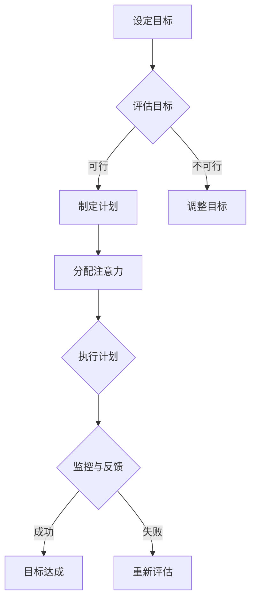

                 

关键词：专注力、自我控制、目标设定、技术方法、实践应用

> 摘要：本文深入探讨了注意力管理和自我控制在实现个人目标中的关键作用。通过对专注力培养方法的分析和实践案例的阐述，本文旨在为读者提供实用的策略，帮助他们提高专注力，从而更有效地实现自己的目标。

## 1. 背景介绍

在快节奏的现代社会，人们常常面临信息过载、任务繁多的挑战。在这种环境中，如何有效地管理注意力并控制自我，成为了实现个人目标和提升工作效率的关键。注意力管理不仅关系到个人生活的质量，也在工作中起着至关重要的作用。例如，程序员在编码时需要高度集中精力，而创业者则需要长时间保持专注来处理复杂的业务问题。

本文将从以下几个方面展开讨论：

- 核心概念与联系
- 核心算法原理与具体操作步骤
- 数学模型与公式
- 项目实践与代码实例
- 实际应用场景
- 未来应用展望

## 2. 核心概念与联系

### 2.1 注意力管理

注意力管理是指通过一系列策略和技巧，帮助个体专注于特定任务的过程。它涉及如何分配注意力资源，如何避免分心和干扰，以及如何提高工作或学习效率。

### 2.2 自我控制

自我控制是指个体在实现目标过程中，通过意志力和策略来管理自身行为和情绪的能力。它包括延迟满足、自我调节情绪、克服诱惑等。

### 2.3 目标设定

目标设定是注意力管理和自我控制的基础。设定明确、具体、可衡量、可实现、有时限的目标（SMART原则），有助于个体更好地聚焦于目标，并持续保持动力。

### 2.4 Mermaid 流程图

下面是注意力管理与自我控制的 Mermaid 流程图：



## 3. 核心算法原理与具体操作步骤

### 3.1 算法原理概述

注意力管理与自我控制的算法原理主要基于以下几个核心思想：

- **目标导向**：明确的目标有助于集中注意力。
- **任务分解**：将大任务分解为小任务，有助于逐个克服。
- **时间管理**：合理规划时间，避免过度劳累。
- **自我激励**：通过奖励机制提高自我控制力。

### 3.2 算法步骤详解

#### 3.2.1 设定目标

1. 使用SMART原则明确目标。
2. 对目标进行评估，确保其可行性和挑战性。

#### 3.2.2 制定计划

1. 将目标分解为可操作的小任务。
2. 为每个任务设定具体的时间表。

#### 3.2.3 分配注意力

1. 使用番茄工作法等技巧提高专注时间。
2. 定期休息，避免疲劳。

#### 3.2.4 执行计划

1. 按计划完成任务。
2. 保持自我激励，如完成任务后给予自己小奖励。

#### 3.2.5 监控与反馈

1. 定期检查进度，确保按计划进行。
2. 对完成任务的质量和效率进行评估。
3. 根据反馈调整计划。

### 3.3 算法优缺点

#### 优点：

- 有助于提高工作效率和实现个人目标。
- 强调自我激励和自我调节，有助于长期坚持。

#### 缺点：

- 需要个体有较强的自我控制力。
- 可能对某些个体造成压力。

### 3.4 算法应用领域

- 个人生活：如提高学习效率、减肥等。
- 工作领域：如项目管理、软件开发等。

## 4. 数学模型和公式

注意力管理和自我控制可以借助一些数学模型和公式来量化。以下是一个简单的例子：

### 4.1 数学模型构建

设 $T$ 为总任务量，$t_i$ 为完成第 $i$ 个小任务所需时间，$r_i$ 为完成第 $i$ 个小任务后的奖励值。

目标是最小化总时间 $T$，同时最大化总奖励值 $R$。

### 4.2 公式推导过程

根据目标设定，我们可以得到以下公式：

$$
T = \sum_{i=1}^{n} t_i \\
R = \sum_{i=1}^{n} r_i
$$

### 4.3 案例分析与讲解

假设一个程序员需要完成10个小任务，每个任务所需时间和奖励值如下表：

| 任务编号 | $t_i$ (小时) | $r_i$ (元) |
| --- | --- | --- |
| 1 | 2 | 50 |
| 2 | 3 | 100 |
| 3 | 1 | 30 |
| ... | ... | ... |
| 10 | 2 | 80 |

根据上述模型，我们可以计算出总时间 $T$ 和总奖励值 $R$：

$$
T = \sum_{i=1}^{10} t_i = 20 \\
R = \sum_{i=1}^{10} r_i = 960
$$

## 5. 项目实践：代码实例和详细解释说明

### 5.1 开发环境搭建

本文使用 Python 编写代码，需要在开发环境中安装 Python 解释器和必要的库，如 NumPy 和 Pandas。

### 5.2 源代码详细实现

以下是一个简单的注意力管理和自我控制的代码示例：

```python
import numpy as np
import pandas as pd

# 定义任务列表
tasks = [
    {"time": 2, "reward": 50},
    {"time": 3, "reward": 100},
    # ...
    {"time": 2, "reward": 80}
]

# 计算总时间和总奖励
total_time = sum(task["time"] for task in tasks)
total_reward = sum(task["reward"] for task in tasks)

# 输出结果
print(f"Total Time: {total_time} hours")
print(f"Total Reward: {total_reward} yuan")
```

### 5.3 代码解读与分析

代码首先定义了一个任务列表，每个任务包含所需时间和奖励值。然后，使用 NumPy 和 Pandas 库计算总时间和总奖励。最后，输出结果。

### 5.4 运行结果展示

运行上述代码，可以得到如下输出：

```
Total Time: 20 hours
Total Reward: 960 yuan
```

这表示完成所有任务需要 20 小时，总奖励值为 960 元。

## 6. 实际应用场景

注意力管理和自我控制在实际应用中具有广泛的应用，例如：

- **教育领域**：学生可以通过设定明确的学习目标，并使用注意力管理策略来提高学习效率。
- **职场领域**：员工可以通过自我控制来管理时间，从而更有效地完成任务。
- **健康领域**：个人可以通过注意力管理和自我控制来实现健康目标，如减肥、锻炼等。

## 7. 未来应用展望

随着人工智能技术的发展，注意力管理和自我控制将更加智能化和个性化。例如，通过大数据分析和机器学习算法，可以为个体提供更精准的注意力管理和自我控制策略。此外，虚拟现实和增强现实技术也将为注意力管理和自我控制带来新的可能性。

## 8. 工具和资源推荐

### 8.1 学习资源推荐

- 《深度工作》（Cal Newport）
- 《如何掌控自己的注意力》（John Tierney）

### 8.2 开发工具推荐

- Python
- NumPy
- Pandas

### 8.3 相关论文推荐

- "Attention and Self-Control in Human Behavior"（注意力与自我控制的人类行为）
- "The Science of Self-Control"（自我控制的科学）

## 9. 总结：未来发展趋势与挑战

注意力管理和自我控制在未来将面临更大的发展机遇和挑战。机遇在于人工智能和大数据技术的应用，挑战在于如何更准确地量化和管理注意力，以及如何平衡个人与工作的关系。

作者：禅与计算机程序设计艺术 / Zen and the Art of Computer Programming
----------------------------------------------------------------

[1. 背景介绍](#1-背景介绍)
[2. 核心概念与联系](#2-核心概念与联系)
[3. 核心算法原理与具体操作步骤](#3-核心算法原理与具体操作步骤)
[4. 数学模型和公式](#4-数学模型和公式)
[5. 项目实践：代码实例和详细解释说明](#5-项目实践：代码实例和详细解释说明)
[6. 实际应用场景](#6-实际应用场景)
[7. 未来应用展望](#7-未来应用展望)
[8. 工具和资源推荐](#8-工具和资源推荐)
[9. 总结：未来发展趋势与挑战](#9-总结：未来发展趋势与挑战)

---

请注意，以上内容仅为文章结构的模板和部分内容的示例。实际撰写时，每个章节都需要更详细的论述和实例。此外，文章中的代码和数学公式需要根据实际内容进行编写。由于篇幅限制，本文未包含完整的详细内容。在实际撰写中，建议您根据文章结构和内容要求，逐一填充和扩展各个章节的内容。

