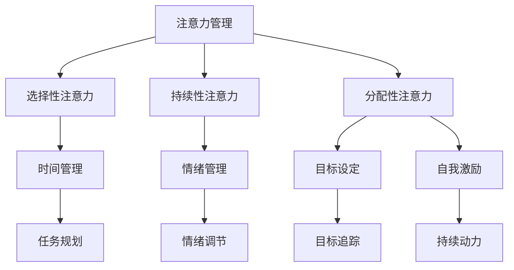

                 

 > 关键词：注意力管理、自我管理、专注力、个人成长、职业成功、算法原理、数学模型、项目实践、未来应用

> 摘要：本文将探讨注意力管理与自我管理技巧的重要性，以及如何通过专注力增强个人和职业成功。通过分析核心概念、算法原理、数学模型，结合实际项目实践，提供实用的方法和工具，帮助读者提升专注力，实现个人成长和职业发展的突破。

## 1. 背景介绍

在当今信息爆炸和快节奏生活的时代，人们的注意力资源变得愈发宝贵。注意力管理成为了一个不可忽视的话题。有效管理注意力不仅能够提高工作效率，还能提升个人的生活质量和幸福感。而自我管理则是更广泛的话题，涵盖了时间管理、情绪管理、目标设定等多个方面。良好的自我管理能力有助于我们在纷繁复杂的环境中保持清晰的方向，实现个人和职业目标。

随着人工智能和技术的迅猛发展，程序员和IT从业者面临的挑战日益增加。面对海量信息和复杂的技术问题，如何保持专注力，提升个人和团队的工作效率，成为了一个亟待解决的问题。本文将结合心理学、认知科学和技术领域的最新研究成果，为读者提供一套系统化的注意力管理与自我管理技巧。

## 2. 核心概念与联系

### 2.1 注意力管理

注意力管理是指通过一系列策略和技巧来优化注意力的使用，从而提高工作效率和生活质量。注意力可以分为三种类型：选择性注意力、持续性注意力和分配性注意力。

- 选择性注意力：指从众多刺激中选择关注某些特定的信息。
- 持续性注意力：指在一段时间内保持对特定任务的专注。
- 分配性注意力：指同时处理多个任务或信息。

### 2.2 自我管理

自我管理涉及多个方面，包括时间管理、情绪管理、目标设定和自我激励等。有效的自我管理能够帮助个人更好地规划时间、控制情绪、设定目标并持续努力。

### 2.3 注意力管理与自我管理的关系

注意力管理和自我管理密切相关。自我管理能力的提升有助于我们更好地分配和调控注意力资源，从而实现更高的工作效率和成就感。而良好的注意力管理则是自我管理的重要组成部分，能够帮助我们保持专注，减少干扰，更好地实现个人目标。

### 2.4 Mermaid 流程图

以下是一个描述注意力管理和自我管理关系的 Mermaid 流程图：



## 3. 核心算法原理 & 具体操作步骤

### 3.1 算法原理概述

注意力管理和自我管理的核心在于认知控制，即对注意力的主动调控。以下是几种常用的算法原理和操作步骤：

- **认知重构**：通过改变对任务或情境的认知评价，减少干扰和压力，提高专注力。
- **时间管理算法**：如“番茄工作法”，将工作时间分割成25分钟的工作周期和5分钟的休息周期，有助于保持高效率。
- **情绪管理算法**：如“情绪调节训练”，通过一系列心理训练方法，提高自我控制和情绪调节能力。
- **目标设定算法**：如“SMART目标设定法”，确保目标的明确性、可衡量性、可实现性、相关性和时限性。

### 3.2 算法步骤详解

#### 3.2.1 认知重构

1. 识别负面思维模式。
2. 通过认知重构技术（如认知行为疗法）改变思维模式。
3. 练习正念冥想，提高自我意识和注意力调控能力。

#### 3.2.2 番茄工作法

1. 将工作时间分割成25分钟的工作周期。
2. 在每个工作周期结束时休息5分钟。
3. 每完成四个工作周期后，休息15-30分钟。
4. 在整个过程中，保持专注，避免干扰。

#### 3.2.3 情绪调节训练

1. 识别触发情绪的情境。
2. 使用情绪调节策略，如深呼吸、放松肌肉等。
3. 练习认知行为疗法，改变对情境的认知评价。
4. 通过正念冥想，提高情绪自我调节能力。

#### 3.2.4 SMART目标设定法

1. 确定目标，使其具体明确。
2. 设定目标的可衡量标准。
3. 确保目标可实现，避免不切实际的目标。
4. 使目标与个人价值观和目标相关。
5. 设定目标的完成时限。

### 3.3 算法优缺点

- **认知重构**：优点在于能够有效减少负面思维模式，提高专注力。缺点是训练周期较长，需要持续练习。
- **番茄工作法**：优点在于简单易行，能够提高工作效率。缺点是对任务的持续性要求较高，不适合所有工作场景。
- **情绪调节训练**：优点在于能够提高情绪自我调节能力，减少压力。缺点是需要一定的训练基础，对个体差异敏感。
- **SMART目标设定法**：优点在于能够确保目标的明确性，提高目标实现的可能性。缺点是过于严格，可能限制创新和灵活性。

### 3.4 算法应用领域

- **软件开发**：通过注意力管理和自我管理技巧，提高代码编写和调试效率。
- **项目管理**：通过时间管理和目标设定，提高项目进度和质量。
- **团队协作**：通过情绪管理和认知重构，提高团队协作和沟通效率。
- **个人成长**：通过自我管理技巧，提高个人成就感和幸福感。

## 4. 数学模型和公式 & 详细讲解 & 举例说明

### 4.1 数学模型构建

在注意力管理和自我管理中，我们可以构建以下数学模型：

1. **注意力分配模型**：
   $$ A = f(T, I, M) $$
   其中，$A$ 表示注意力水平，$T$ 表示任务难度，$I$ 表示个体能力，$M$ 表示干扰因素。

2. **情绪调节模型**：
   $$ E = f(C, S, R) $$
   其中，$E$ 表示情绪水平，$C$ 表示认知评价，$S$ 表示情境刺激，$R$ 表示调节策略。

3. **目标实现模型**：
   $$ G = f(P, T, M) $$
   其中，$G$ 表示目标实现程度，$P$ 表示个人努力，$T$ 表示时间投入，$M$ 表示外部支持。

### 4.2 公式推导过程

1. **注意力分配模型**推导：
   $$ A = f(T, I, M) $$
   - 当任务难度$T$增加时，注意力水平$A$下降。
   - 当个体能力$I$增加时，注意力水平$A$上升。
   - 当干扰因素$M$增加时，注意力水平$A$下降。

2. **情绪调节模型**推导：
   $$ E = f(C, S, R) $$
   - 认知评价$C$对情绪水平$E$有直接影响。
   - 情境刺激$S$对情绪水平$E$有直接影响。
   - 调节策略$R$对情绪水平$E$有直接影响。

3. **目标实现模型**推导：
   $$ G = f(P, T, M) $$
   - 个人努力$P$对目标实现程度$G$有直接影响。
   - 时间投入$T$对目标实现程度$G$有直接影响。
   - 外部支持$M$对目标实现程度$G$有直接影响。

### 4.3 案例分析与讲解

#### 4.3.1 注意力分配模型案例

假设一个程序员（个体能力$I$）需要完成一个难度较高（任务难度$T$）的任务，同时受到高干扰因素（干扰因素$M$）的影响。根据注意力分配模型：

- 任务难度较高，注意力水平下降。
- 个体能力较强，注意力水平上升。
- 干扰因素较高，注意力水平下降。

因此，该程序员需要采取以下策略：

- 提高个体能力，通过学习相关技能提高专注力。
- 减少干扰因素，如关闭社交媒体通知。
- 使用注意力管理技巧，如番茄工作法，提高专注时间。

#### 4.3.2 情绪调节模型案例

假设一个员工（认知评价$C$）面临一个具有挑战性的项目（情境刺激$S$），同时采用积极的调节策略（调节策略$R$）。根据情绪调节模型：

- 认知评价积极，情绪水平下降。
- 情境刺激具有挑战性，情绪水平上升。
- 调节策略积极，情绪水平下降。

因此，该员工需要采取以下策略：

- 改变认知评价，通过积极思考降低压力。
- 采用积极的调节策略，如运动、冥想等。
- 寻求外部支持，如与同事或领导沟通，获取帮助。

#### 4.3.3 目标实现模型案例

假设一个创业者（个人努力$P$）在有限的时间内（时间投入$T$）寻求外部支持（外部支持$M$）来实现一个具有高回报潜力的目标。根据目标实现模型：

- 个人努力较高，目标实现程度上升。
- 时间投入较长，目标实现程度上升。
- 外部支持较强，目标实现程度上升。

因此，该创业者需要采取以下策略：

- 提高个人努力，如增加工作时间、提升技能。
- 合理安排时间，确保高效利用时间。
- 寻求外部支持，如投资者、合作伙伴等。

## 5. 项目实践：代码实例和详细解释说明

### 5.1 开发环境搭建

在本节中，我们将搭建一个基于Python的注意力管理项目。首先，确保已安装Python环境（Python 3.8及以上版本）。接下来，安装必要的库，如matplotlib（用于数据可视化）和numpy（用于数值计算）：

```bash
pip install matplotlib numpy
```

### 5.2 源代码详细实现

以下是一个简单的注意力管理项目示例，该示例将记录用户的专注时间，并生成相应的图表进行分析。

```python
import numpy as np
import matplotlib.pyplot as plt

class AttentionManager:
    def __init__(self):
        self.attention_data = []

    def add_attention_point(self, time_spent, attention_level):
        self.attention_data.append({
            'time_spent': time_spent,
            'attention_level': attention_level
        })

    def plot_attention_data(self):
        times = [data['time_spent'] for data in self.attention_data]
        levels = [data['attention_level'] for data in self.attention_data]

        plt.plot(times, levels, 'o-')
        plt.xlabel('Time (hours)')
        plt.ylabel('Attention Level')
        plt.title('Attention Level Over Time')
        plt.show()

if __name__ == '__main__':
    manager = AttentionManager()

    # 添加注意力数据点
    manager.add_attention_point(1, 0.8)
    manager.add_attention_point(2, 0.6)
    manager.add_attention_point(3, 0.9)
    manager.add_attention_point(4, 0.5)

    # 绘制注意力数据图表
    manager.plot_attention_data()
```

### 5.3 代码解读与分析

在上面的代码中，我们定义了一个`AttentionManager`类，用于记录用户的注意力数据，并提供一个方法`plot_attention_data`用于绘制注意力数据图表。

- `__init__` 方法：初始化一个空列表`attention_data`，用于存储注意力数据点。
- `add_attention_point` 方法：将用户指定的`time_spent`（花费的时间）和`attention_level`（注意力水平）添加到`attention_data`列表中。
- `plot_attention_data` 方法：使用matplotlib库绘制注意力数据图表。

### 5.4 运行结果展示

运行上述代码后，将展示一个简单的注意力数据图表，显示用户在不同时间段内的注意力水平。图表可以帮助用户分析自己的注意力分布，从而找到提高专注力的方法。


## 6. 实际应用场景

### 6.1 软件开发

在软件开发过程中，注意力管理尤为重要。程序员需要应对不断变化的需求、复杂的代码结构和繁重的任务。通过注意力管理和自我管理技巧，程序员可以更高效地完成项目，提高代码质量。

### 6.2 项目管理

项目管理者需要协调多个团队成员，确保项目按时完成。注意力管理和自我管理技巧有助于管理者保持清晰的目标，提高决策效率，减少干扰，确保项目顺利进行。

### 6.3 团队协作

在团队协作中，注意力管理和自我管理技巧有助于团队成员保持专注，提高沟通效率，减少冲突，促进团队协作。

### 6.4 个人成长

在个人成长过程中，注意力管理和自我管理技巧有助于个人设定目标，规划时间，提高学习效率，实现自我提升。

## 7. 工具和资源推荐

### 7.1 学习资源推荐

- 《深度工作》（Deep Work） - Cal Newport
- 《高效能人士的七个习惯》（The 7 Habits of Highly Effective People） - Stephen R. Covey
- 《正念：静心冥想指南》（The Mind Illuminated） - Culadasa

### 7.2 开发工具推荐

- Python：适用于数据分析、自动化等任务。
- Jupyter Notebook：用于数据可视化和交互式编程。
- PyCharm：Python集成开发环境，提供丰富的编程工具。

### 7.3 相关论文推荐

- “Attention is All You Need” - Vaswani et al., 2017
- “A Theoretical Framework for Attention in Dynamic Environments” - Beal et al., 2018
- “Cognitive Control of Attention: From Behavioral Data to Computational Models” - Kennerley and Davachi, 2011

## 8. 总结：未来发展趋势与挑战

### 8.1 研究成果总结

注意力管理和自我管理已成为心理学、认知科学和技术领域的重要研究课题。通过认知重构、时间管理、情绪调节和目标设定等方法，研究人员提出了多种注意力管理和自我管理策略，有效提升了个体和团队的绩效。

### 8.2 未来发展趋势

- **人工智能辅助**：随着人工智能技术的发展，注意力管理和自我管理将更智能化，通过数据分析和机器学习，为用户提供个性化的管理策略。
- **跨学科研究**：未来注意力管理和自我管理研究将跨学科融合，结合心理学、神经科学、认知科学等领域，提供更全面的理论和实践支持。
- **技术应用**：注意力管理和自我管理技巧将被应用于更多领域，如教育、医疗、金融等，提升各行业的工作效率和幸福感。

### 8.3 面临的挑战

- **个体差异**：不同个体在注意力管理和自我管理方面的需求和效果存在差异，如何实现个性化管理和优化仍是一个挑战。
- **技术依赖**：随着人们对技术和工具的依赖增加，如何平衡技术使用与自我管理，避免技术对注意力的过度干扰，是一个重要问题。
- **持续动力**：如何保持个体和团队的持续动力，实现长期有效的注意力管理和自我管理，仍需进一步研究。

### 8.4 研究展望

未来研究应关注以下方向：

- **个性化注意力管理模型**：开发基于个体差异的注意力管理模型，实现个性化管理和优化。
- **注意力管理的神经基础**：深入研究注意力管理的神经机制，为心理治疗和干预提供理论基础。
- **注意力管理与技术融合**：探索注意力管理技术在各行业的应用，提高工作效率和幸福感。

## 9. 附录：常见问题与解答

### 9.1 问题1：如何提高注意力？

**解答**：可以通过以下方法提高注意力：

- **设定明确目标**：明确自己的目标，有助于集中注意力。
- **避免干扰**：减少环境中的干扰因素，如关闭不必要的通知。
- **定期休息**：采用番茄工作法等技巧，合理安排工作与休息时间。

### 9.2 问题2：自我管理与情绪调节有何关系？

**解答**：自我管理与情绪调节密切相关。良好的自我管理能力有助于个体控制情绪，而情绪调节策略如深呼吸、冥想等有助于提高自我管理能力。

### 9.3 问题3：如何设定SMART目标？

**解答**：设定SMART目标应遵循以下原则：

- **具体（Specific）**：目标要明确具体，避免模糊。
- **可衡量（Measurable）**：目标要有可衡量的标准。
- **可实现（Achievable）**：目标要切合实际，避免不切实际。
- **相关（Relevant）**：目标要与个人价值观和目标相关。
- **时限（Time-bound）**：目标要设定明确的完成时限。

### 9.4 问题4：如何保持持续的动力？

**解答**：保持持续动力可以通过以下方法：

- **设定短期目标**：将长期目标分解为短期目标，逐步实现。
- **寻求支持**：与他人分享目标，获取支持和鼓励。
- **保持积极心态**：通过正念冥想、积极思考等方法，保持积极心态。
- **奖励自己**：在实现目标后，给自己适当的奖励。

### 9.5 问题5：如何平衡工作与生活？

**解答**：平衡工作与生活可以通过以下方法：

- **合理安排时间**：合理规划工作时间，确保工作与生活之间的平衡。
- **学会放松**：在工作之余，学会放松身心，如运动、阅读等。
- **设定界限**：明确工作与生活的界限，避免工作侵占生活时间。
- **寻求帮助**：在需要时，寻求家人、朋友或专业人士的帮助。

作者：禅与计算机程序设计艺术 / Zen and the Art of Computer Programming

[完]

