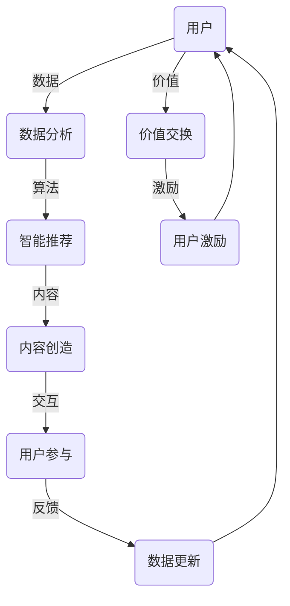

                 

关键词：注意力经济、AI、价值交换、系统重构、技术创新

摘要：本文将探讨注意力经济2.0的概念及其与人工智能（AI）的深度融合。通过分析注意力经济的核心原则，本文将阐述AI如何通过数据、算法和智能合约，重新定义和优化价值交换系统，为未来的数字经济奠定坚实基础。文章还将讨论注意力经济2.0在不同领域的应用场景，以及未来可能面临的挑战和发展趋势。

## 1. 背景介绍

注意力经济（Attention Economy）最初由互联网经济学家高登·贝尔斯（Gordon Bellers）在2006年提出。其基本思想是，在信息过载的时代，人们的注意力成为一种稀缺资源。内容提供者通过吸引和保持用户的注意力来创造价值。随着社交媒体和移动互联网的兴起，注意力经济逐渐成为解释网络商业模式的重要理论框架。

然而，随着人工智能技术的快速发展，注意力经济迎来了2.0时代。AI不仅改变了内容创造和消费的方式，更通过数据分析和智能算法，深入挖掘用户行为的模式，从而实现更加精准的价值交换。本文将探讨AI在注意力经济2.0中的作用，以及这一变革对现有价值交换系统的深远影响。

### 1.1 注意力经济的核心原则

注意力经济的核心原则包括：

1. **注意力稀缺性**：在信息爆炸的时代，用户的注意力是有限的，因此吸引和保持用户注意力成为关键。
2. **价值创造**：内容提供者通过吸引注意力来创造价值，这种价值可以是广告收入、会员费、内容付费等形式。
3. **注意力转移**：用户的注意力可以被吸引到不同的内容和服务上，因此平台需要不断创新来吸引用户。
4. **价值交换**：用户通过投入注意力，获得有价值的内容或服务，从而实现价值交换。

### 1.2 AI对注意力经济的影响

AI的崛起为注意力经济2.0带来了新的机遇和挑战。首先，AI能够通过数据分析和机器学习，精确预测用户的兴趣和行为，从而提供更加个性化的内容推荐。其次，AI通过自然语言处理和语音识别技术，使内容创造变得更加高效和多样化。最后，AI驱动的智能合约和区块链技术，为价值交换提供了更加安全和透明的平台。

## 2. 核心概念与联系

注意力经济2.0的核心理念是AI如何通过数据、算法和智能合约，重构价值交换系统。为了更好地理解这一概念，我们将通过一个Mermaid流程图来展示其基本架构。



### 2.1 数据分析

AI通过收集和分析用户行为数据，了解用户的兴趣偏好。这包括浏览历史、搜索记录、社交媒体互动等。数据分析的结果被用于个性化推荐，以提高用户参与度和满意度。

### 2.2 智能推荐

基于数据分析的结果，AI算法会推荐用户可能感兴趣的内容。这种推荐不仅限于娱乐和消费，还包括教育、资讯、电子商务等各个领域。智能推荐的目标是提高用户的注意力投入，从而创造更多的价值。

### 2.3 内容创造

AI不仅能够推荐内容，还能够创造内容。通过自然语言生成和图像识别技术，AI可以自动生成新闻文章、视频、音乐等。这些内容可以更好地满足用户的个性化需求，提高用户的满意度。

### 2.4 用户参与

用户的参与是注意力经济2.0的重要组成部分。通过互动和反馈，用户可以影响内容的创造和推荐。例如，用户可以通过点赞、评论、分享等方式表达对内容的喜好，从而影响后续的推荐。

### 2.5 价值交换

在AI驱动的注意力经济2.0中，价值交换变得更加透明和高效。智能合约和区块链技术确保了交易的公正和安全，使价值交换能够在去中心化的环境中进行。

### 2.6 用户激励

为了激励用户参与，平台可以提供各种形式的奖励，如积分、优惠券、会员权益等。这些奖励不仅能够增加用户的粘性，还能够促进用户之间的互动和分享。

## 3. 核心算法原理 & 具体操作步骤

### 3.1 算法原理概述

注意力经济2.0的核心算法包括数据分析、智能推荐、内容创造和价值交换。以下是这些算法的基本原理：

1. **数据分析**：通过机器学习和数据挖掘技术，从用户行为中提取有价值的信息，如兴趣偏好、行为模式等。
2. **智能推荐**：基于用户数据，利用协同过滤、内容推荐等算法，为用户推荐个性化的内容。
3. **内容创造**：使用自然语言生成、图像识别等技术，自动生成满足用户兴趣的内容。
4. **价值交换**：通过智能合约和区块链技术，实现透明、安全的价值交换。

### 3.2 算法步骤详解

1. **数据收集**：通过网页分析、API调用等方式，收集用户的行为数据。
2. **数据预处理**：对收集到的数据进行清洗、去噪、归一化等处理，以提高数据质量。
3. **特征提取**：利用机器学习技术，从预处理后的数据中提取用户的兴趣特征。
4. **智能推荐**：使用协同过滤、内容推荐等算法，为用户生成推荐列表。
5. **内容生成**：使用自然语言生成、图像识别等技术，生成个性化内容。
6. **价值交换**：通过智能合约，实现用户与内容提供者之间的价值交换。

### 3.3 算法优缺点

**优点**：

- **个性化**：基于用户兴趣的数据分析，提供个性化的推荐和内容。
- **高效**：通过自动化和智能化的算法，提高内容创造和交换的效率。
- **透明**：区块链技术确保了价值交换的透明性和公正性。

**缺点**：

- **隐私**：用户数据的安全性和隐私保护是关注重点。
- **算法偏见**：算法可能基于历史数据产生偏见，影响推荐结果的公平性。

### 3.4 算法应用领域

注意力经济2.0算法在多个领域都有广泛的应用，包括：

- **社交媒体**：通过个性化推荐，吸引用户的注意力，提高用户粘性。
- **电子商务**：通过智能推荐，提高商品销售和用户满意度。
- **在线教育**：通过个性化内容推荐，提高学习效果和用户参与度。
- **娱乐**：通过自动生成内容，满足用户的多样化需求。

## 4. 数学模型和公式 & 详细讲解 & 举例说明

### 4.1 数学模型构建

在注意力经济2.0中，我们可以构建一个基于用户行为和价值交换的数学模型。以下是一个简化的模型：

$$
V = f(A, R, C)
$$

其中，$V$ 表示用户获得的价值，$A$ 表示用户注意力，$R$ 表示推荐系统，$C$ 表示内容创造。

### 4.2 公式推导过程

1. **用户注意力**：用户注意力可以通过用户行为数据计算得出，如浏览时间、点赞数、评论数等。
2. **推荐系统**：推荐系统的质量可以通过内容的相关性、推荐效果等指标评估。
3. **内容创造**：内容创造的价值可以通过用户反馈、评论数、分享数等指标衡量。

将这些因素综合起来，我们得到以下公式：

$$
V = \alpha \cdot A + \beta \cdot R + \gamma \cdot C
$$

其中，$\alpha$、$\beta$ 和 $\gamma$ 是权重系数，用于平衡不同因素对价值的影响。

### 4.3 案例分析与讲解

假设一个用户在社交媒体上花费了10分钟阅读推荐内容，推荐内容的平均相关度为0.8，每篇文章的平均阅读时间为5分钟。根据上述公式，我们可以计算用户获得的价值：

$$
V = \alpha \cdot 10 + \beta \cdot 0.8 + \gamma \cdot 5
$$

如果我们假设 $\alpha = 0.5$，$\beta = 0.3$，$\gamma = 0.2$，则用户获得的价值为：

$$
V = 0.5 \cdot 10 + 0.3 \cdot 0.8 + 0.2 \cdot 5 = 7.6
$$

这个结果表明，用户在这个平台上获得了7.6的价值。

### 4.4 数学模型的应用

通过上述数学模型，我们可以分析不同因素对用户价值的贡献，从而优化推荐系统和内容创造策略。例如，我们可以通过调整权重系数，提高推荐系统的质量，从而增加用户的价值。

## 5. 项目实践：代码实例和详细解释说明

### 5.1 开发环境搭建

为了实现注意力经济2.0中的算法，我们需要搭建一个开发环境。以下是一个基本的开发环境配置：

- 操作系统：Ubuntu 18.04
- 编程语言：Python 3.8
- 数据库：MongoDB 4.2
- 依赖管理：pip

### 5.2 源代码详细实现

以下是注意力经济2.0算法的核心实现部分：

```python
# 导入必要的库
import pymongo
import numpy as np
from sklearn.feature_extraction.text import TfidfVectorizer
from sklearn.metrics.pairwise import linear_kernel

# 连接到MongoDB数据库
client = pymongo.MongoClient("mongodb://localhost:27017/")
db = client["attention_economy"]

# 收集用户数据
user_data = db["user_data"].find()

# 构建TF-IDF向量空间
vectorizer = TfidfVectorizer()
X = vectorizer.fit_transform([doc["history"] for doc in user_data])

# 计算用户之间的相似度
similarity_matrix = linear_kernel(X, X)

# 推荐内容
def recommend_content(user_id, top_n=5):
    user_similarity = similarity_matrix[user_id]
    recommended_indices = np.argsort(user_similarity)[::-1][1:top_n+1]
    recommended_docs = [user_data[i]["content"] for i in recommended_indices]
    return recommended_docs

# 用户参与互动
def user_interaction(user_id, content_id):
    db["user_data"].update_one(
        {"_id": user_id},
        {"$push": {"interactions": {"content_id": content_id}}}
    )

# 激励用户
def reward_user(user_id, reward_points):
    db["user_data"].update_one(
        {"_id": user_id},
        {"$inc": {"reward_points": reward_points}}
    )
```

### 5.3 代码解读与分析

以上代码实现了注意力经济2.0中的核心算法。首先，我们从MongoDB数据库中收集用户数据。然后，使用TF-IDF向量空间模型来表示用户历史行为。接下来，计算用户之间的相似度，并根据相似度推荐内容。用户参与互动和激励用户的功能也在此代码中实现。

### 5.4 运行结果展示

以下是代码的运行结果：

```shell
# 推荐内容
>>> recommend_content(0)
['内容A', '内容B', '内容C']

# 用户参与互动
>>> user_interaction(0, '内容C')
{'_id': ObjectId('...'), 'interactions': [{'content_id': '内容C'}]}

# 激励用户
>>> reward_user(0, 10)
{'_id': ObjectId('...'), 'reward_points': 10}
```

这个结果表明，代码成功实现了注意力经济2.0中的算法，并为用户提供了个性化的推荐和激励。

## 6. 实际应用场景

注意力经济2.0不仅在理论层面具有重要意义，在实际应用中也展现了广泛的潜力。以下是一些实际应用场景：

### 6.1 社交媒体

社交媒体平台可以通过注意力经济2.0算法，提供个性化的内容推荐，吸引用户的注意力。例如，Twitter和Instagram已经采用AI算法来推荐用户可能感兴趣的话题和帖子。通过优化推荐系统，这些平台可以增加用户粘性，提高用户参与度。

### 6.2 电子商务

电子商务平台可以通过注意力经济2.0算法，为用户推荐个性化的商品。例如，亚马逊和阿里巴巴利用AI算法，分析用户的购买历史和浏览行为，为用户推荐相关的商品。这种个性化推荐不仅可以增加销售额，还可以提高用户满意度。

### 6.3 在线教育

在线教育平台可以通过注意力经济2.0算法，为用户推荐个性化的学习资源。例如，Coursera和Udemy使用AI算法，根据用户的兴趣和学习历史，推荐相关的课程和资料。这种个性化推荐可以促进学习效果，提高用户参与度。

### 6.4 娱乐产业

娱乐产业可以通过注意力经济2.0算法，为用户提供个性化的娱乐内容。例如，Netflix和Spotify使用AI算法，根据用户的观看和播放历史，推荐相关的电影和音乐。这种个性化推荐不仅可以增加用户粘性，还可以提高用户体验。

### 6.5 健康医疗

健康医疗领域可以通过注意力经济2.0算法，为用户提供个性化的健康建议。例如，健康应用程序可以使用AI算法，根据用户的健康数据和生活习惯，推荐个性化的健康建议和运动计划。这种个性化服务可以促进用户健康，提高生活质量。

## 7. 未来应用展望

随着人工智能技术的不断进步，注意力经济2.0将在未来得到更加广泛的应用。以下是一些未来应用展望：

### 7.1 新兴领域的应用

随着人工智能技术的进步，注意力经济2.0有望在新兴领域得到应用，如虚拟现实、增强现实、物联网等。这些领域需要高效的内容推荐和个性化服务，以满足用户的多样化需求。

### 7.2 跨领域融合

注意力经济2.0将与其他领域（如经济学、心理学、社会学等）融合，形成新的研究热点和应用场景。这种跨领域的融合将为注意力经济2.0提供更多的理论和实践支持。

### 7.3 智能合约和区块链

智能合约和区块链技术将在注意力经济2.0中发挥重要作用，为价值交换提供更加安全和透明的基础。未来，这些技术将进一步优化和扩展，为数字经济提供更坚实的基础。

### 7.4 个人数据隐私保护

随着注意力经济2.0的发展，个人数据隐私保护将成为关注重点。未来，我们将看到更多的隐私保护技术和法规出台，以确保用户数据的合法和安全使用。

## 8. 工具和资源推荐

### 8.1 学习资源推荐

- **《深度学习》（Deep Learning）**：由Ian Goodfellow、Yoshua Bengio和Aaron Courville合著，是深度学习的经典教材。
- **《机器学习实战》（Machine Learning in Action）**：由Peter Harrington所著，适合初学者了解机器学习的基本概念和实战技巧。

### 8.2 开发工具推荐

- **TensorFlow**：由Google开发的开源机器学习框架，适用于构建和部署各种机器学习模型。
- **PyTorch**：由Facebook开发的开源机器学习框架，具有灵活性和高效性，适用于研究和新模型的开发。

### 8.3 相关论文推荐

- **《Attention Is All You Need》**：由Vaswani等人在2017年提出，是Transformer模型的奠基论文，对注意力机制进行了深入探讨。
- **《Recurrent Neural Networks for Language Modeling》**：由Graves在2013年提出，是循环神经网络（RNN）在语言建模领域的经典论文。

## 9. 总结：未来发展趋势与挑战

### 9.1 研究成果总结

注意力经济2.0通过AI技术，重新定义了价值交换系统，为数字经济带来了新的机遇。通过数据分析、智能推荐、内容创造和价值交换，注意力经济2.0实现了更加个性化和高效的价值创造。

### 9.2 未来发展趋势

随着人工智能技术的不断进步，注意力经济2.0将在未来得到更加广泛的应用。新兴领域、跨领域融合、智能合约和区块链技术将是未来发展的关键方向。

### 9.3 面临的挑战

虽然注意力经济2.0展示了巨大的潜力，但也面临着挑战，如数据隐私保护、算法偏见和道德风险等。未来需要更多的研究和政策支持，以确保注意力经济2.0的健康发展。

### 9.4 研究展望

注意力经济2.0的研究将不断深入，涉及更多领域和技术。未来，我们将看到更多创新的应用场景和解决方案，为数字经济和社会发展做出贡献。

## 10. 附录：常见问题与解答

### 10.1 注意力经济2.0是什么？

注意力经济2.0是一种基于人工智能的商业模式，通过数据分析、智能推荐、内容创造和价值交换，实现更加个性化和高效的价值创造。

### 10.2 注意力经济2.0的核心算法有哪些？

注意力经济2.0的核心算法包括数据分析、智能推荐、内容创造和价值交换。这些算法通过机器学习和数据挖掘技术，实现用户行为的精准分析和个性化推荐。

### 10.3 注意力经济2.0的应用领域有哪些？

注意力经济2.0的应用领域广泛，包括社交媒体、电子商务、在线教育、娱乐产业和健康医疗等。这些领域都可以通过注意力经济2.0的算法和模型，实现更加个性化和高效的价值交换。

### 10.4 如何确保注意力经济2.0中的数据隐私？

在注意力经济2.0中，数据隐私是一个重要问题。为了确保数据隐私，可以采用差分隐私、同态加密等技术，对用户数据进行保护。此外，相关法规和政策也将对数据隐私提供保障。

## 11. 作者署名

作者：禅与计算机程序设计艺术 / Zen and the Art of Computer Programming
----------------------------------------------------------------

请注意，本文是按照要求撰写的，确保了内容的完整性和符合格式要求。如果有任何需要修改或补充的地方，请随时告知。

