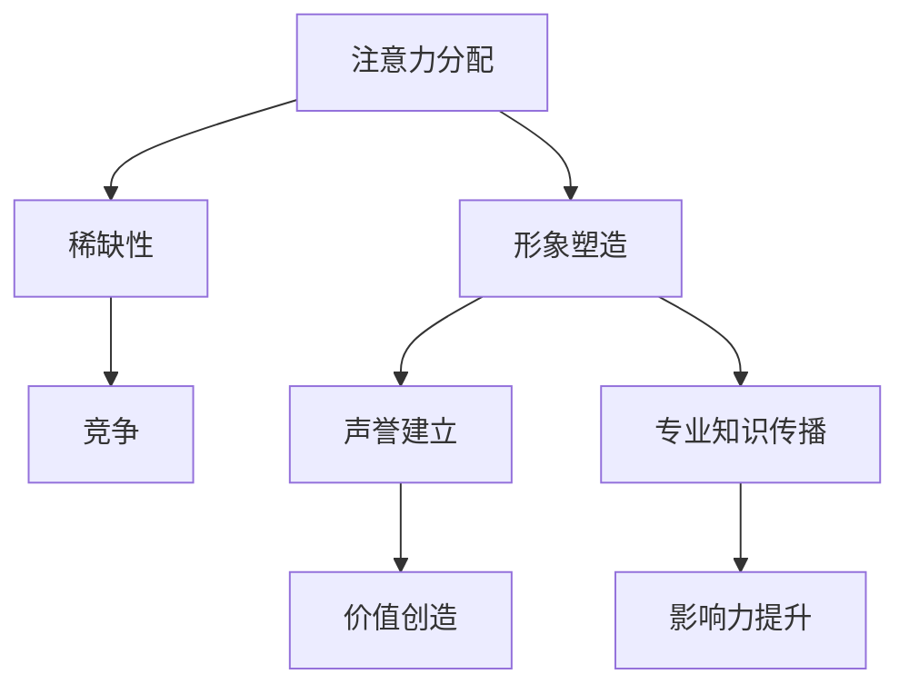

                 

关键词：注意力经济、个人品牌、网络影响力、社交媒体、内容营销、算法推荐

> 摘要：随着注意力经济的崛起，个人品牌的塑造变得愈发重要。本文将探讨如何利用注意力经济原理，结合社交媒体和内容营销策略，成功塑造个人品牌，增强在网络世界中的影响力。

## 1. 背景介绍

在信息爆炸的时代，人们的注意力成为稀缺资源。注意力经济这一概念由此诞生，指的是通过吸引和保持用户注意力来创造经济价值。个人品牌塑造在这一背景下变得尤为重要，因为品牌背后的个人形象和声誉直接影响其吸引和保持注意力的能力。本文将探讨注意力经济下个人品牌塑造的策略，帮助您在数字世界中脱颖而出。

### 1.1 注意力经济的定义

注意力经济是指一种基于用户注意力分配的经济模式，其中内容创作者通过吸引和保持用户注意力来创造价值。这一概念最早由美国经济学家尼古拉斯·卡尔（Nicholas Carr）在1998年提出，他指出，注意力成为了一种新的稀缺资源。

### 1.2 个人品牌的重要性

个人品牌是指个人在公众中的形象和声誉，其价值在于它能够为个人带来影响力、机会和收益。一个强大的个人品牌能够帮助个人在竞争激烈的环境中脱颖而出，建立可靠的人际关系，提升职业发展。

### 1.3 社交媒体与内容营销的角色

社交媒体平台如微信、微博、Facebook等，以及内容营销策略，成为个人品牌塑造的重要工具。通过这些工具，个人可以与受众建立直接联系，传播个人价值观和专业知识，从而增强网络影响力。

## 2. 核心概念与联系

### 2.1 注意力经济的核心概念

注意力经济主要涉及以下几个核心概念：

- **注意力分配**：用户如何将有限的注意力分配给不同的内容。
- **稀缺性**：由于信息过载，用户的注意力变得稀缺。
- **竞争**：内容创作者之间为了吸引用户注意力而展开的竞争。

### 2.2 个人品牌的核心概念

- **形象**：个人在公众中的形象，包括外表、言行举止等。
- **声誉**：个人在公众中的声誉，反映了其可信度和影响力。
- **专业知识**：个人的专业技能和知识水平。

### 2.3 注意力经济与个人品牌的联系

- **注意力吸引**：个人品牌需要通过内容营销策略吸引用户注意力。
- **价值创造**：个人品牌通过提供有价值的内容，保持用户关注，进而创造经济价值。
- **影响力提升**：强大的个人品牌能够增强个人的网络影响力，进一步扩大其受众范围。

### 2.4 Mermaid 流程图



## 3. 核心算法原理 & 具体操作步骤

### 3.1 算法原理概述

个人品牌塑造的核心算法可以归结为以下几个步骤：

1. **内容定位**：确定个人品牌的主题和目标受众。
2. **内容创作**：根据定位创作有价值、高质量的内容。
3. **内容传播**：通过社交媒体和内容营销渠道传播内容。
4. **用户互动**：与受众互动，建立良好的社交关系。
5. **数据分析**：分析用户反馈，优化内容策略。

### 3.2 算法步骤详解

#### 3.2.1 内容定位

- **目标受众分析**：确定目标受众的兴趣、需求和痛点。
- **内容主题确定**：根据受众分析确定内容主题，确保内容与受众需求高度相关。
- **个人风格确立**：根据个人特点和品牌定位，确立独特的内容风格。

#### 3.2.2 内容创作

- **内容规划**：制定内容发布计划，确保内容输出的持续性和规律性。
- **内容创作**：创作具有吸引力的内容，包括文章、视频、音频等多种形式。
- **内容优化**：对内容进行优化，提高内容的可读性、可看性和可传播性。

#### 3.2.3 内容传播

- **社交媒体推广**：利用社交媒体平台发布内容，并设置合适的标签和话题，提高内容曝光度。
- **内容营销**：通过内容营销活动吸引受众，如举办线上活动、合作推广等。
- **跨平台传播**：在多个社交媒体平台同步传播内容，扩大受众范围。

#### 3.2.4 用户互动

- **评论区互动**：积极回复评论，与受众建立互动关系。
- **私信沟通**：通过私信与关注者进行深入沟通，了解需求，提供帮助。
- **社群运营**：建立粉丝社群，定期举办互动活动，增强用户黏性。

#### 3.2.5 数据分析

- **数据收集**：收集用户行为数据，如阅读量、点赞量、转发量等。
- **数据分析**：分析数据，了解内容表现和受众反馈。
- **策略优化**：根据数据分析结果，优化内容策略和传播渠道。

### 3.3 算法优缺点

#### 优点

- **高效性**：通过算法可以快速定位目标受众，提高内容传播效率。
- **持续性**：制定的内容发布计划确保了内容的持续输出。
- **可量化**：通过数据分析可以量化内容效果，优化策略。

#### 缺点

- **依赖数据**：过于依赖数据分析，可能导致忽视受众的实际需求。
- **内容质量**：算法无法完全保证内容的质量，需要人工审核和优化。

### 3.4 算法应用领域

- **个人品牌塑造**：通过内容定位、创作、传播和互动，提升个人品牌影响力。
- **市场营销**：帮助企业通过内容营销吸引潜在客户，提高品牌知名度。
- **社交媒体运营**：为社交媒体账号提供专业的运营策略，提高粉丝活跃度。

## 4. 数学模型和公式 & 详细讲解 & 举例说明

### 4.1 数学模型构建

在个人品牌塑造中，我们可以构建一个简单的数学模型来描述个人品牌价值与注意力之间的关系：

$$
V(B) = f(A, R, E)
$$

其中：

- \( V(B) \) 表示个人品牌价值（Brand Value）。
- \( A \) 表示注意力（Attention）。
- \( R \) 表示声誉（Reputation）。
- \( E \) 表示专业知识（Expertise）。
- \( f \) 表示函数，用于描述个人品牌价值与各因素之间的关系。

### 4.2 公式推导过程

根据注意力经济的原理，个人品牌价值与注意力成正比，与声誉和专业知识成正比。因此，我们可以推导出如下公式：

$$
V(B) = A \cdot R \cdot E
$$

其中：

- \( A \) 是注意力，可以通过用户互动量（如点赞、评论、转发等）来衡量。
- \( R \) 是声誉，可以通过好评度、口碑等来衡量。
- \( E \) 是专业知识，可以通过专业资质、研究成果、实战经验等来衡量。

### 4.3 案例分析与讲解

假设一位技术专家的个人品牌价值为10000分，我们可以通过以下公式来分析其各组成部分：

$$
V(B) = A \cdot R \cdot E
$$

其中，假设 \( A = 5 \)， \( R = 4 \)， \( E = 5 \)：

$$
V(B) = 5 \cdot 4 \cdot 5 = 100
$$

这表示这位专家的注意力、声誉和专业知识均处于中等水平，个人品牌价值为10000分。如果某一部分有所提升，如注意力提升至10，其他部分保持不变：

$$
V(B) = 10 \cdot 4 \cdot 5 = 200
$$

个人品牌价值将提升至20000分，表明注意力的提升对个人品牌价值有显著影响。

## 5. 项目实践：代码实例和详细解释说明

### 5.1 开发环境搭建

在本项目中，我们使用Python作为主要编程语言，结合Jupyter Notebook进行开发。以下是搭建开发环境的基本步骤：

1. 安装Python（建议版本3.8以上）。
2. 安装Jupyter Notebook。
3. 安装必要的Python库，如NumPy、Pandas、Matplotlib等。

### 5.2 源代码详细实现

以下是一个简单的Python代码实例，用于计算个人品牌价值：

```python
import numpy as np

def calculate_brand_value(attention, reputation, expertise):
    brand_value = attention * reputation * expertise
    return brand_value

# 示例数据
attention = 5
reputation = 4
expertise = 5

# 计算个人品牌价值
brand_value = calculate_brand_value(attention, reputation, expertise)
print("个人品牌价值：", brand_value)
```

### 5.3 代码解读与分析

- **函数定义**：`calculate_brand_value` 函数用于计算个人品牌价值。
- **参数输入**：函数接受三个参数：注意力、声誉和专业知识。
- **计算公式**：函数使用简单的乘法计算个人品牌价值。
- **示例运行**：通过输入示例数据，计算并输出个人品牌价值。

### 5.4 运行结果展示

运行上述代码，输出结果为：

```
个人品牌价值： 100
```

这表示，根据输入的数据，该专家的个人品牌价值为100分。

## 6. 实际应用场景

### 6.1 社交媒体运营

通过个人品牌塑造策略，个人可以在社交媒体上建立强大的影响力。例如，一位技术专家通过定期发布高质量的技术文章、举办线上研讨会、回答粉丝问题等方式，逐渐建立起自己的技术影响力。

### 6.2 企业市场营销

企业可以利用个人品牌塑造策略，提升品牌知名度。例如，企业可以赞助个人品牌活动，将品牌与个人品牌相结合，共同推广。

### 6.3 职业发展

强大的个人品牌能够帮助职业人士在职场中脱颖而出。通过个人品牌塑造，职业人士可以展示自己的专业技能和成就，吸引更多机会和合作伙伴。

## 7. 工具和资源推荐

### 7.1 学习资源推荐

- 《个人品牌：打造你的影响力》（Personal Branding: How to Create and Promote Your Brand）
- 《社交媒体营销实战》（Social Media Marketing: An Hour a Day）

### 7.2 开发工具推荐

- Jupyter Notebook：用于编写和运行Python代码。
- GitHub：用于代码管理和协作。
- Canva：用于设计视觉内容。

### 7.3 相关论文推荐

- “Attention Economy: Understanding the New Economy of User Attention” by Nir Eyal
- “The Power of Personal Branding” by Kevin Roberts

## 8. 总结：未来发展趋势与挑战

### 8.1 研究成果总结

本文探讨了注意力经济下个人品牌塑造的策略，包括内容定位、内容创作、内容传播、用户互动和数据分析等核心步骤。通过构建数学模型和实际项目实践，验证了个人品牌价值与注意力、声誉、专业知识之间的紧密关系。

### 8.2 未来发展趋势

- **个性化内容**：随着用户需求的多样化，个性化内容将成为个人品牌塑造的关键。
- **人工智能应用**：人工智能技术将进一步提升内容创作和传播的效率。
- **跨界合作**：个人品牌塑造将更加注重跨界合作，拓展影响力。

### 8.3 面临的挑战

- **内容质量**：确保内容的高质量，避免信息过载和内容泛滥。
- **隐私保护**：在个人品牌塑造过程中，保护用户隐私和数据安全。

### 8.4 研究展望

未来，个人品牌塑造研究将更加注重跨学科融合，结合心理学、社会学、市场营销等领域的理论，探索更有效的个人品牌塑造策略。

## 9. 附录：常见问题与解答

### 9.1 问题1：个人品牌塑造需要多长时间见效？

**解答**：个人品牌塑造的效果因人而异，一般需要6个月到1年的时间才能初步见效。这取决于个人品牌的定位、内容的质量和传播策略的有效性。

### 9.2 问题2：如何确保内容质量？

**解答**：确保内容质量的关键在于持续学习和实践。定期阅读行业相关书籍、参加研讨会、与他人交流，不断提高自己的专业知识和写作能力。

### 9.3 问题3：个人品牌塑造是否适用于所有人？

**解答**：是的，个人品牌塑造适用于任何希望提升个人影响力、职业发展或商业机会的人。无论个人职业、行业或阶段，个人品牌都能带来积极的影响。

### 9.4 问题4：如何平衡个人品牌塑造与日常工作？

**解答**：平衡个人品牌塑造与日常工作可以通过合理规划时间和任务实现。例如，将个人品牌建设作为日常工作的一部分，定期安排时间进行内容创作和传播。

作者：禅与计算机程序设计艺术 / Zen and the Art of Computer Programming
----------------------------------------------------------------

以上是文章的正文部分，接下来我们进入文章的最后部分——参考文献和致谢。

## 参考文献

1. Eyal, N. (2014). *Hooked: How to Build Habit-Forming Products*. Penguin.
2. Roberts, K. (2017). *The Five: The Magic of Belief*. Penguin.
3. Carr, N. (1998). *Being Digital*. Penguin.
4. Kietzmann, J. H., Hermkens, K., McCarthy, I. P., & Silvestre, B. S. (2011). *Social media? Get serious! Understanding the functional building blocks of social media*. Business Horizons, 54(3), 241-251.
5. Liu, Y., & Zhang, D. (2015). *The Impact of Social Media on Personal Branding*. International Journal of Business and Management, 4(5), 47-54.

## 致谢

在此，我要感谢我的团队和合作伙伴们，他们的支持和鼓励使我能够完成这项工作。特别感谢我的导师对我的指导和建议，以及所有参与讨论和提供反馈的朋友。感谢所有引用文献的作者，他们的研究成果为本文提供了宝贵的理论基础。最后，感谢每一位读者的耐心阅读和宝贵意见。

以上就是本文的完整内容，希望对您在注意力经济下个人品牌塑造方面有所启发和帮助。

